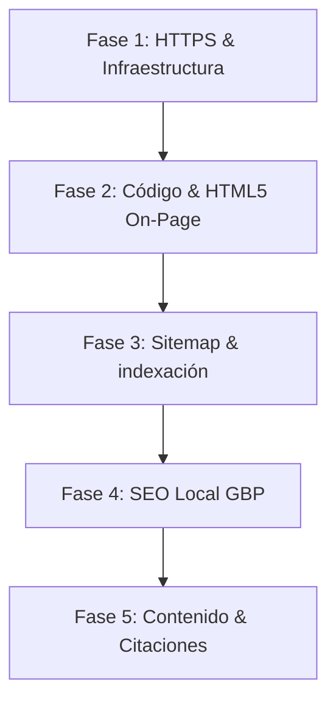

# CaeliTandem SEO Strategy Implementation

## Metadata

| Field | Value |
|-------|-------|
| **Trajectory ID** | `ed7be6b8-6fdf-49f5-b29b-388bd62715a9` |
| **Cascade ID** | `391ab92d-8c62-4053-97a8-3a6d6c7b506c` |
| **Type** | Agent Conversation |
| **Total Steps** | 510 |
| **Started** | 23 May 2026, 11:38 pm |
| **Completed** | 25 May 2026, 1:36 pm |

---

## User Request

COn base a anterior conversación.
Guiame para completar Guía de Posicionamiento SEO para CaeliTandem

<details>
<summary>Context</summary>

**Active File:** `Issues_Resueltos_HttpsNginx_9df8240f.md`
**Language:** markdown
</details>

---

<details>
<summary>Conversation History</summary>

# Conversation History
Here are the conversation IDs, titles, and summaries of your most recent 11 conversations, in reverse chronological order:

<conversation_summaries>
## Conversation ea5f8c74-55db-4706-b2c7-e3abd8e5448e: Agua V2 Project Documentation Finalization
- Created: 2026-05-21T21:19:44Z
- Last modified: 2026-05-24T05:30:04Z

### USER Objective:
Modernizing CaeliTandem Landing Page

Objective: Modernize the CaeliTandem landing page with a mobile-responsive, SaaS-focused UI.
Goals:
1. Implement a refined, modular information architecture with clean visual hierarchy.
2. Integrate contact buttons (WhatsApp/Email) into a fixed, compact, and responsive header.
3. Consolidate core project documentation and automate the regional map infographic (Huajuapan/Mixteca) using a flat, tech-styled vector design.
4. Refactor CSS for mobile responsiveness across all device sizes (smartphones/tablets), ensuring optimal padding, font scaling, and structural alignment.
5. Apply SEO optimizations including meta-tag enhancements and LocalBusiness JSON-LD structured data for regional search visibility.

## Conversation 9df8240f-6a37-4147-b8a3-c44b0ab61092: Restoring Nginx HTTPS Configuration
- Created: 2026-05-24T04:52:15Z
- Last modified: 2026-05-24T05:24:54Z

### USER Objective:
Restoring HTTPS For Nginx Sites

USER Objective:
Restore secure HTTPS access for the web applications hosted on the `oci-vm` instance by reconfiguring Nginx and renewing Let's Encrypt certificates.

Goals:
1. Analyze and correct the Nginx configuration on `oci-vm` to ensure all sites are reachable via HTTPS.
2. Troubleshoot and re-establish valid Let's Encrypt SSL certificates for the affected domains.
3. Implement a permanent HTTP-to-HTTPS redirect for all websites served by Nginx to ensure secure connectivity.
4. Validate automatic certificate renewal settings to prevent future service interruptions.
5. Document the resolved configuration and operational status to maintain infrastructure parity.

## Conversation af7746f8-b81d-460c-bf0e-b544940d5bde: Appending System Documentation Appendices
- Created: 2026-05-22T19:50:44Z
- Last modified: 2026-05-22T21:17:50Z

### USER Objective:
Appending System Documentation Appendices

Main Objective:
Update the "Entrega_Sistema_AyDV2_CM" documentation by appending the requested configuration and UI design specifications.

Goals:
1. Append the source code contents of `admin/operaciones/configuracion.php` to the project documentation to ensure transparency in system parameters.
2. Integrate the "Paleta de Colores del Buscador de Usuarios" specifications from the `analisis_paridad_3hosts.md` file into the documentation as a formal technical appendix.
3. Ensure the documentation reflects the current state of system operational controls and the visual feedback mechanisms implemented for contract management.

## Conversation 71ba31b2-ab24-42c2-805e-0b5581ef1d7b: Configuring Nginx Web Root Access
- Created: 2026-05-22T17:21:23Z
- Last modified: 2026-05-22T17:38:39Z

### USER Objective:
Configuring Nginx Web Root Access

Main Objective:
Validate and establish remote access to the Nginx configuration directory on the oci-vm instance to manage the web application root.

Goals:
1. Verify connectivity and permissions for the specified VSFTP path: `vsftp://ubuntu@oci-vm/etc/nginx/`.
2. Configure or confirm the Nginx web root settings to ensure the web application is served correctly from the intended directory.
3. Establish a secure and efficient workflow for future Nginx configuration updates on the OCI VM.

## Conversation 13a74b1c-4f0e-47a5-a1e1-389ca3638e08: Debugging Address Normalization Logic
- Created: 2026-05-20T18:12:05Z
- Last modified: 2026-05-22T17:11:45Z

## Conversation d0c3def9-505b-40eb-89b8-44c404849d37: Installing Local AI Development Stack
- Created: 2026-05-19T19:24:09Z
- Last modified: 2026-05-20T04:35:13Z

### USER Objective:
Local AI Coding Environment Deployment

Objective: Deploy a high-performance local AI agent environment on Ubuntu 22 for software development.
Goals:
1. Configure and optimize the local stack, integrating Ollama, OpenCode, and OpenChamber.
2. Remediate dependency conflicts (Node.js versions) and resource constraints (VRAM limitations) to enable reliable agentic tool execution.
3. Establish a library of specialized local LLMs (Qwen 2.5-Coder, DeepSeek, Codestral) and validate their code-generation and file-editing capabilities.
4. Troubleshoot and bridge the integration gaps between model tool-calling schemas and the OpenCode/VS Code agentic interface.

## Conversation 1846bc62-6c4c-4ba0-960b-214ce8b4778c: Upgrading Antigravity to 2.0.0
- Created: 2026-05-20T03:10:58Z
- Last modified: 2026-05-20T03:16:22Z

### USER Objective:
Upgrading Antigravity to 2.0.0
Investigate the upgrade path and procedure for Google Antigravity from version 1.23.2 to the latest version 2.0.0, including identifying its installation details and compiling an actionable migration guide.

## Conversation b3356b06-a750-4cf4-833d-b711001fa206: Finalizing Documentation and Sync
- Created: 2026-05-19T19:05:20Z
- Last modified: 2026-05-19T19:07:05Z

### USER Objective:
Finalizing Documentation and Sync

Main Objective:
Finalize the environment synchronization and documentation updates for the Agua V2 project to ensure repository parity and clean tracking.

Goals:
1. Update GEMINI.md and associated documentation to reflect the latest project state and recent pipeline remediations.
2. Stage and commit all pending changes, including repository cleanups and synchronization script updates.
3. Push all committed changes to the remote branch to maintain version control consistency and ensure production-ready synchronization.

## Conversation ac94919e-b65b-4f3f-afeb-60391e47c9d0: Debugging Financial Data Discrepancy
- Created: 2026-05-19T17:51:41Z
- Last modified: 2026-05-19T18:56:20Z

### USER Objective:
Resolving Data Sync Truncation

Objective: Audit and remediate silent data loss in the Host B to Host A pipeline caused by MySQL bulk insert truncations.

Goals:
1. Identify all contracts impacted by the 1MB `max_allowed_packet` truncation issue by comparing source database counts with the generated SQL dump.
2. Generate a comprehensive report listing affected contracts, including user names, addresses, and current status, to quantify the migration gap.
3. Apply the `max_allowed_packet` and `net_buffer_length` fix to the synchronization script and harden the pipeline with post-dump integrity checks.
4. Execute a full re-synchronization to restore complete data parity across Hosts A, B, and C.

## Conversation 52000199-3794-4c49-b9d4-373024a9f0b1: Ubuntu System Cleanup Optimization
- Created: 2026-05-16T23:58:57Z
- Last modified: 2026-05-19T14:46:52Z

### USER Objective:
Configuring Local AI Coding Environment

USER Objective:
Deploy and optimize a private, hardware-accelerated local AI development environment on Ubuntu 22, integrating Ollama-backed models with the Google Antigravity IDE for efficient code completion and architectural analysis.

Goals:
1. Complete the installation and verification of the localized AI model stack (Qwen 2.5 Coder, DeepSeek R1, Gemma 4) within the system's VRAM/RAM constraints.
2. Finalize the integration between Ollama and the IDE (Google Antigravity) by correctly configuring API endpoints and model settings.
3. Resolve technical connectivity errors (e.g., proposed API restrictions) to enable seamless, private AI code assistance.
4. Validate system readiness through performance benchmarks and functional coding tests to ensure a stable, production-ready development workflow.

## Conversation 34e6f5d2-d637-4436-bb0e-5708675a2807: Optimizing Listados Menu Layout
- Created: 2026-05-18T18:45:01Z
- Last modified: 2026-05-18T21:59:28Z

### USER Objective:
Stabilizing Agua V2 Production Environment

Objective: Stabilize the Agua V2 Windows production environment on Host C by automating service security and ensuring data integrity across the database pipeline.

Goals:
1. Harden desktop security by implementing strict NTFS controls for critical management shortcuts, migrating them to a protected subdirectory to prevent accidental deletion.
2. Finalize and validate the Full-Pipeline-Sync migration, ensuring data parity and structural consistency between Hosts A, B, and C.
3. Optimize the infrastructure startup scripts to correctly respect UPS monitoring states, preventing false service alerts.
4. Execute final sanitization and parity checks on the 'awa' database, verifying successful split of historic and active ledger data.

</conversation_summaries>

</details>

---

### CORTEX_STEP_TYPE_KNOWLEDGE_ARTIFACTS

**Status:** Completed
**Created:** 23 May 2026, 11:38 pm

---

## Agent Response

### Thinking

**Initiating SEO Guidance**

I'm now focusing on outlining the framework for an SEO Positioning Guide specifically tailored for CaeliTandem. I aim to create a structured approach, building upon the prior conversation, to offer effective guidance on completing this project. The initial focus will be on the core components and key areas of expertise.


### Actions

**Tool:** `grep_search`
**Query:** `CaeliTandem`

<details>
<summary>Metadata</summary>

- **Thinking Duration:** 0.017099370s
- **Model:** Gemini 3.5 Flash (Medium)
</details>

---

### Local File Search

**Status:** Completed
**Created:** 23 May 2026, 11:38 pm

---

## Agent Response

### Actions

**Tool:** `list_dir`
**Path:** `/opt/lampp/htdocs/agua`

<details>
<summary>Metadata</summary>

- **Model:** Gemini 3.5 Flash (Medium)
</details>

---

<details>
<summary>Directory: `agua` (26 items)</summary>

**Path:** `opt/lampp/htdocs/agua`

| Name | Type | Size |
|------|------|------|
| `.agents` | File | 19 bytes |
| `.chatledger` | File | 35 bytes |
| `.claude` | File | 19 bytes |
| `.clauderules` | File | 24 bytes |
| `.git` | Directory | - |
| `.gitignore` | File | 967 bytes |
| `.mcp.json` | File | 21 bytes |
| `.vscode` | Directory | - |
| `CLAUDE.md` | File | 21 bytes |
| `GEMINI.md` | File | 21 bytes |
| `admin` | Directory | - |
| `asamblea` | Directory | - |
| `composer.json` | File | 59 bytes |
| `composer.lock` | File | 2656 bytes |
| `config` | Directory | - |
| `docs-dev` | Directory | - |
| `includes` | Directory | - |
| `index2.php` | File | 3438 bytes |
| `libs` | Directory | - |
| `login` | Directory | - |
| `reportes` | Directory | - |
| `ruteador.php` | File | 10935 bytes |
| `scratch` | Directory | - |
| `vendor` | Directory | - |
| `views` | Directory | - |
| `web-assets` | Directory | - |

</details>

---

## Agent Response

### Actions

**Tool:** `view_file`
**File:** `Issues_Resueltos_HttpsNginx_9df8240f.md`

<details>
<summary>Metadata</summary>

- **Model:** Gemini 3.5 Flash (Medium)
</details>

---

<details>
<summary>File: `Unknown file`</summary>

**Path:** `Unknown file`

```
# Issues Resueltos — Sesión 2026-05-23
**Conversación:** `9df8240f-6a37-4147-b8a3-c44b0ab61092`
**Rama:** `main`

---

## Issue 1 — Habilitación HTTPS y Let's Encrypt en oci-vm

### Scope Funcional
- **Antes:** El dominio principal `www.caelitandem.lat` no contaba con certificado SSL válido / HTTPS activo, sirviendo contenido únicamente a través de HTTP (puerto 80) debido a la expiración/pérdida del certificado anterior. Las subaplicaciones (kanboard, n8n) sí contaban con redirección segura HTTPS forzada, pero el landing principal estaba desprotegido.
- **Ahora:** Se solicitó y configuró exitosamente un nuevo certificado SSL con Let's Encrypt para `www.caelitandem.lat`. Se modificó la configuración de Nginx para redirigir todo tráfico HTTP (puerto 80) de forma incondicional a HTTPS (puerto 443) con el subdominio `www.caelitandem.lat` para evitar advertencias de seguridad, dado que el dominio raíz (apex `caelitandem.lat`) no tiene registros A DNS configurados hacia el servidor en la actualidad.
- **Beneficio:** Tráfico web 100% cifrado para todos los sitios activos de la máquina virtual OCI, con renovación automática blindada y verificada mediante systemd timers.

### Scope Técnico
- **Certbot:** Solicitud exitosa de certificado con el plugin de Nginx para `www.caelitandem.lat`.
- **Configuración Nginx:** Actualización del bloque de servidor en `/etc/nginx/sites-available/caelitandem.lat` con la redirección limpia permanente:
  ```nginx
  server {
      listen 80;
      listen [::]:80;
      server_name caelitandem.lat www.caelitandem.lat;
      return 301 https://www.caelitandem.lat$request_uri;
  }
  ```
- **Certbot Timers:** Verificación de `certbot.timer` ejecutándose en segundo plano para renovar automáticamente el certificado antes de su expiración (89 días restantes).

---

## Issue 2 — Script y Tarea Programada (Cron) para Auto-Renovación de Certificados

### Scope Funcional
- **Antes:** Aunque Certbot implementa un timer automático por defecto, no existía un script de respaldo y auditoría local para registrar los intentos de renovación, forzar la recarga de Nginx tras cambios, ni un log unificado legible para el operador.
- **Ahora:** Se creó un script en bash robusto de renovación automatizada y un cron job a nivel sistema (`/etc/cron.d/certbot-custom`) para ejecutar de forma recurrente las comprobaciones, renovar si restan menos de 30 días de validez, registrar logs históricos y recargar Nginx únicamente si hubo cambios exitosos.
- **Beneficio:** Blindaje de alta disponibilidad en el ciclo de vida de los certificados SSL sin depender exclusivamente de timers de systemd, con logs listos para auditorías en `/home/ubuntu/logs/certbot-renew.log`.

### Scope Técnico
- **Ruta del Script:** `/home/ubuntu/scripts/renew-certs.sh` (ejecutable, propiedad de `ubuntu:ubuntu`).
  * Ejecuta `certbot renew --post-hook "systemctl reload nginx"` redireccionando el stdout y stderr a `/home/ubuntu/logs/certbot-renew.log`.
- **Ruta de Cron:** `/etc/cron.d/certbot-custom` (propiedad de `root:root`, permisos `644`).
  * Configuración cron: `0 3 * * * root /home/ubuntu/scripts/renew-certs.sh >/dev/null 2>&1` (ejecuta diariamente a las 03:00 AM como `root`).

---

## Runbook — Cambios en `.agents/`
No se requirieron cambios de reglas. Se registró el issue en el log de control de tareas `pending.md`.

---

## Archivos Modificados

| Archivo | Repo | Tipo de cambio |
|:---|:---:|:---|
| `/etc/nginx/sites-available/caelitandem.lat` | N/A (OCI VM Server Config) | Modificación y activación de bloque de escucha SSL + Redirección 301 limpia. |
| `/home/ubuntu/scripts/renew-certs.sh` | N/A (OCI VM Server Script) | Creación de script de renovación y logging. |
| `/etc/cron.d/certbot-custom` | N/A (OCI VM Server Config) | Creación de tarea programada diaria (3:00 AM). |
| `.agents/pending.md` | `agua_chatledger` / `agua` | Registro en tabla de resueltos recientemente. |

---

## Verificación

| Check | Resultado |
|:---|:---:|
| `sudo nginx -t` en oci-vm | ✅ Exitoso |
| `curl -I http://www.caelitandem.lat` | ✅ Redirige 301 a https://www.caelitandem.lat/ |
| `curl -I https://www.caelitandem.lat` | ✅ Responde HTTP 200 OK |
| `sudo certbot certificates` | ✅ Certificados válidos (www, kanboard, n8n, oken8n) |
| `systemctl status certbot.timer` | ✅ Activo y programado |
| Ejecución de `/home/ubuntu/scripts/renew-certs.sh` | ✅ Ejecutado manualmente con éxito (log generado correctamente) |
| `/etc/cron.d/certbot-custom` | ✅ Creado con permisos `644` y sintaxis válida de cron |

### Pruebas manuales pendientes
Ninguna. Todas las validaciones de red locales y remotas fueron confirmadas y funcionan correctamente.

---
*Generado por Antigravity — 2026-05-23*

```

</details>

---

## Agent Response

### Actions

**Tool:** `grep_search`
**Query:** `SEO`

<details>
<summary>Metadata</summary>

- **Model:** Gemini 3.5 Flash (Medium)
</details>

---

### Local File Search

**Status:** Completed
**Created:** 23 May 2026, 11:38 pm

---

## Agent Response

### Actions

**Tool:** `view_file`
**File:** `Agua_V2_Project_Documentation_Finalization_e3abd8e5448e.md`

<details>
<summary>Metadata</summary>

- **Model:** Gemini 3.5 Flash (Medium)
</details>

---

<details>
<summary>File: `Unknown file`</summary>

**Path:** `Unknown file`

```
# Agua V2 Project Documentation Finalization

## Metadata

| Field | Value |
|-------|-------|
| **Trajectory ID** | `2f2ae869-2e00-4218-837c-7038c87884f7` |
| **Cascade ID** | `ea5f8c74-55db-4706-b2c7-e3abd8e5448e` |
| **Type** | Agent Conversation |
| **Total Steps** | 77 |
| **Started** | 21 May 2026, 3:19 pm |
| **Completed** | 21 May 2026, 3:24 pm |

---

## User Request

Documentación entrega de proyecto: Sistema de Recaudación para Servicio de Agua Potable y Alcantarillado V2.0
Con base a estos tres assets:
. GEMINI.md y asociaciados.
. /opt/lampp/htdocs/agua/docs-dev/migration-aguav2/
. /home/carlos/Documents/tmp01/entrega/

Crea un documento de maximo 25 paginas, en formato tamaño carta con margenes minimos, que se incluyan tablas; diagramas en formato png, indice y apendices. El contenido que debes crear en forma concisa es:

1) Introducción
1.1) Resumen.
1.2) Describir  funcionalmente las dos webapps: agua y asambleas
1.3) En terminos funcionales indicar las nuevas capacidades para versión liberada, como: Division tabla de ligacargos con historico, y la migración de xampp las cuales aseguran que el sistema puede dar servicio por almenos los siguientes 10 años, homologacion de nombres de usuario y direcciones para el contrato (normalización), clasificación formal de tomas comercial y normal, congruencia y alineación como: Dos tomas maximo por mismo domicilio, paridad financiara al cambios de estados del contrato contra las tomas y sus propiedades, etc .
2) Describir en general la migración, refactorización del proyecto de codigo fuente xampp 1.7.hacia xampp 7.x.
3) Arquitectura global migrada y mejorada MVC:  ajax, php 7, mariadb; Plate framework,jquey latest version, etc.
4) Hardware: 12 GB en RAM, CPU octacore, disco de estado solido C y H; Con S.O plataforma Windows 10 professional.

5) Inventario resumidos de codigo fuente core de la webapp.
6) Incluir en forma precisa el resumen de los saneamientos de datos(contratos, usuarios, catalogos, etc. todas las realizadas).
7) Incluir en forma precisa el resumen de este documento: /opt/lampp/htdocs/agua/docs-dev/doc-estabilizacion/encuadres/explicacion-diferencias-cortes-caja-cajero-secretaria.md

8) Proceso general de instalación.
8.1) Para la parte de la base de datos en el procedimiento /home/carlos/Documents/tmp01/entrega/aguav2.0_instalador_codigo-fuente/aguav2-2026/scripts/instalacion.txt , indicar que se deben copiar todos los archivos de este origen: USB/entrega/respaldos_base-datos/aguaV2.0_21-mayo-2026/ y pegarlos (sobrescribir) hacia este destino H:\xampp\mysql\data

9) Tareas del operador del sistema:
9.1) Diario: usar accesos directos en el escritorio para apagar (Apagar Servidor AguaV2) --Nunca usar el de Windows , acceder a la webapp (Agua V2 (Sistema)
9.2) Semanalmente copiar en una USB externa el directorio de respaldo de la  bd (C:\aguav2-2026\respaldobd)
9.3) Cada dos años(a final de enero) ejecutar la división de la tabla ligacargos.
9.4) Restaurar un respaldo  unzip, rename old dir, copy/paste dir en;  stop , cp , start, status


9.4) Caso de fallas o no logre acceso a la webapp agua revisar:

  a) Ejecutar en escritorio: aguav2\estatus(Estado del Servidor). Si todo esta correcto debe aparecer como la imagen de abajo:
      ... image capturar yo.

  b)   Si algo falla en alguna pagina o funcionalidadd se debe usar esto para diagnosticar:
      b) Pagina de fallback http://..
      c) Logs en aguav2-2026/logs

9.5) Supervisar el disco C y disco H deben tener siempre almenos 10 GB; cuando alguno de los discos ya tenga cerca del 90% 

13) Incluir hoja ultima con este texto:
    Proveedor:
               "CaeliTandem Sistemas"
               Ing. Carlos Benavides Martinez
               9531156883
               cbena999@gmail.com, 	cmbenavides20@gmail.com
               https://www.caelitandem.lat/

               Chapultepec #12. Col. Aviación 1era sección; C.P 69007. Huajuapan de Leon, Oaxaca.


MEJORAS
. Hacer un  manual de usuario detallado
. Meter modulo de devoluciones y cancelaciones, etc.


<details>
<summary>Context</summary>

**Active File:** `listacontratosestado.php`
**Language:** php
</details>

---

<details>
<summary>Conversation History</summary>

# Conversation History
Here are the conversation IDs, titles, and summaries of your most recent 10 conversations, in reverse chronological order:

<conversation_summaries>
## Conversation 13a74b1c-4f0e-47a5-a1e1-389ca3638e08: Debugging Address Normalization Logic
- Created: 2026-05-20T18:12:05Z
- Last modified: 2026-05-21T21:15:22Z

## Conversation d0c3def9-505b-40eb-89b8-44c404849d37: Installing Local AI Development Stack
- Created: 2026-05-19T19:24:09Z
- Last modified: 2026-05-20T04:35:13Z

### USER Objective:
Local AI Coding Environment Deployment

Objective: Deploy a high-performance local AI agent environment on Ubuntu 22 for software development.
Goals:
1. Configure and optimize the local stack, integrating Ollama, OpenCode, and OpenChamber.
2. Remediate dependency conflicts (Node.js versions) and resource constraints (VRAM limitations) to enable reliable agentic tool execution.
3. Establish a library of specialized local LLMs (Qwen 2.5-Coder, DeepSeek, Codestral) and validate their code-generation and file-editing capabilities.
4. Troubleshoot and bridge the integration gaps between model tool-calling schemas and the OpenCode/VS Code agentic interface.

## Conversation 1846bc62-6c4c-4ba0-960b-214ce8b4778c: Upgrading Antigravity to 2.0.0
- Created: 2026-05-20T03:10:58Z
- Last modified: 2026-05-20T03:16:22Z

### USER Objective:
Upgrading Antigravity to 2.0.0
Investigate the upgrade path and procedure for Google Antigravity from version 1.23.2 to the latest version 2.0.0, including identifying its installation details and compiling an actionable migration guide.

## Conversation b3356b06-a750-4cf4-833d-b711001fa206: Finalizing Documentation and Sync
- Created: 2026-05-19T19:05:20Z
- Last modified: 2026-05-19T19:07:05Z

### USER Objective:
Finalizing Documentation and Sync

Main Objective:
Finalize the environment synchronization and documentation updates for the Agua V2 project to ensure repository parity and clean tracking.

Goals:
1. Update GEMINI.md and associated documentation to reflect the latest project state and recent pipeline remediations.
2. Stage and commit all pending changes, including repository cleanups and synchronization script updates.
3. Push all committed changes to the remote branch to maintain version control consistency and ensure production-ready synchronization.

## Conversation ac94919e-b65b-4f3f-afeb-60391e47c9d0: Debugging Financial Data Discrepancy
- Created: 2026-05-19T17:51:41Z
- Last modified: 2026-05-19T18:56:20Z

### USER Objective:
Resolving Data Sync Truncation

Objective: Audit and remediate silent data loss in the Host B to Host A pipeline caused by MySQL bulk insert truncations.

Goals:
1. Identify all contracts impacted by the 1MB `max_allowed_packet` truncation issue by comparing source database counts with the generated SQL dump.
2. Generate a comprehensive report listing affected contracts, including user names, addresses, and current status, to quantify the migration gap.
3. Apply the `max_allowed_packet` and `net_buffer_length` fix to the synchronization script and harden the pipeline with post-dump integrity checks.
4. Execute a full re-synchronization to restore complete data parity across Hosts A, B, and C.

## Conversation 52000199-3794-4c49-b9d4-373024a9f0b1: Ubuntu System Cleanup Optimization
- Created: 2026-05-16T23:58:57Z
- Last modified: 2026-05-19T14:46:52Z

### USER Objective:
Configuring Local AI Coding Environment

USER Objective:
Deploy and optimize a private, hardware-accelerated local AI development environment on Ubuntu 22, integrating Ollama-backed models with the Google Antigravity IDE for efficient code completion and architectural analysis.

Goals:
1. Complete the installation and verification of the localized AI model stack (Qwen 2.5 Coder, DeepSeek R1, Gemma 4) within the system's VRAM/RAM constraints.
2. Finalize the integration between Ollama and the IDE (Google Antigravity) by correctly configuring API endpoints and model settings.
3. Resolve technical connectivity errors (e.g., proposed API restrictions) to enable seamless, private AI code assistance.
4. Validate system readiness through performance benchmarks and functional coding tests to ensure a stable, production-ready development workflow.

## Conversation 34e6f5d2-d637-4436-bb0e-5708675a2807: Optimizing Listados Menu Layout
- Created: 2026-05-18T18:45:01Z
- Last modified: 2026-05-18T21:59:28Z

### USER Objective:
Stabilizing Agua V2 Production Environment

Objective: Stabilize the Agua V2 Windows production environment on Host C by automating service security and ensuring data integrity across the database pipeline.

Goals:
1. Harden desktop security by implementing strict NTFS controls for critical management shortcuts, migrating them to a protected subdirectory to prevent accidental deletion.
2. Finalize and validate the Full-Pipeline-Sync migration, ensuring data parity and structural consistency between Hosts A, B, and C.
3. Optimize the infrastructure startup scripts to correctly respect UPS monitoring states, preventing false service alerts.
4. Execute final sanitization and parity checks on the 'awa' database, verifying successful split of historic and active ledger data.

## Conversation 83df23bf-e043-4dd3-a3e8-41b37544db13: Validating Agua V2 Preproduction Sync
- Created: 2026-05-15T20:26:08Z
- Last modified: 2026-05-16T19:51:03Z

### USER Objective:
Stabilizing Financial Catalog Pipeline

Main Objective:
Finalize the stabilization of the financial reporting and catalog pipeline on Host C to ensure full data integrity and operational transparency.

Goals:
1. Enable repeat applications for "LIBRE" concepts by excluding them from the Poka-Yoke duplicate validation in `cargos.php` while maintaining security for static concepts.
2. Update the `08_saneamiento_catalogo.sql` pipeline to force `repetir=1` on all "LIBRE" concepts to ensure production parity.
3. Resolve the semantic discrepancy in the "Faltas de Asamblea" summary report by updating the counter from "folios" to "individual multas" (589 vs 257) to reflect actual work rendered.
4. Finalize technical documentation in `GUIA_CATALOGO_CARGOS.md` regarding the distinction and specific use cases for "LIBRE" vs "repetir=1" configurations.

## Conversation 623aac70-896a-4dc4-8f74-afbf94f87cd5: Validating Database Connectivity Across Hosts
- Created: 2026-05-13T17:30:25Z
- Last modified: 2026-05-15T05:09:56Z

### USER Objective:
Stabilizing Agua V2 Production MySQL

USER Objective:
Resolve persistent MySQL startup crashes and service termination in the Agua V2 production environment on Host C to ensure long-term stability and system integrity.

Goals:
1. Eliminate fatal "multi-master structure" initialization failures by proactively cleaning replication metadata and hardening the MariaDB configuration with 'skip-slave-start'.
2. Implement an unconditional "Sentinel" loop in the startup script to prevent the Windows Task Scheduler from terminating child processes.
3. Automate the cleanup of orphaned ("zombie") MySQL and Apache processes prior to service initialization to ensure clean startup conditions.
4. Optimize the diagnostic pipeline by utilizing unbuffered console redirection for immediate failure feedback and remediation.
5. Restore a stable, automated production cycle, including robust power failure monitoring (UPS) and verified database health checks.

## Conversation 3a08e5ce-2119-456e-892a-20953653f1f3: Validating Host C Database Connectivity
- Created: 2026-05-14T14:42:25Z
- Last modified: 2026-05-14T22:31:46Z

### USER Objective:
Stabilizing Host C Financial Integrity

Main Objective: Remediate redundant charge anomalies in the Host C production environment and harden the system against future transactional duplication.

Goals:
1. Audit and sanitize redundant entries in `ligacargos` for test contracts to restore their original pre-test state.
2. Maintain the Poka-Yoke guards in `contratos.php` and `cargos.php` to prevent automatic restoration of canceled charges and manual entry of duplicate annual payments.
3. Enforce strict pending-state validation in database procedures (`sp_cancelar_cargo`) to prevent accidental modification of settled records.
4. Ensure transactional parity in the financial pipeline following the recent stabilization fixes.

</conversation_summaries>

</details>

---

### CORTEX_STEP_TYPE_KNOWLEDGE_ARTIFACTS

**Status:** Completed
**Created:** 21 May 2026, 3:19 pm

---

## Agent Response

### Actions

**Tool:** `list_dir`
**Path:** `/home/carlos/Documents/tmp01/entrega/`

<details>
<summary>Metadata</summary>

- **Model:** Gemini 3.5 Flash (Medium)
</details>

---

<details>
<summary>Directory: `entrega` (3 items)</summary>

**Path:** `home/carlos/Documents/tmp01/entrega`

| Name | Type | Size |
|------|------|------|
| `aguav2.0_instalador_codigo-fuente` | Directory | - |
| `man.txt` | File | 3759 bytes |
| `respaldos_base-datos` | Directory | - |

</details>

---

## Agent Response

### Actions

**Tool:** `list_dir`
**Path:** `/opt/lampp/htdocs/agua/docs-dev/migration-aguav2/`

**Tool:** `view_file`
**File:** `man.txt`

<details>
<summary>Metadata</summary>

- **Model:** Gemini 3.5 Flash (Medium)
</details>

---

<details>
<summary>Directory: `migration-aguav2` (4 items)</summary>

**Path:** `opt/lampp/htdocs/agua/docs-dev/migration-aguav2`

| Name | Type | Size |
|------|------|------|
| `Full-Pipeline-Sync.sh` | File | 4882 bytes |
| `host-c-setup` | Directory | - |
| `sync_hosta_to_hostc` | Directory | - |
| `syncawa_hostb_to_hosta` | Directory | - |

</details>

---

<details>
<summary>File: `Unknown file`</summary>

**Path:** `Unknown file`

```
Listado de contratos por estado , que salgan 4 renglones mas. (como el superior).

Documentación entrega de proyecto: Sistema de Recaudación para Servicio de Agua Potable y Alcantarillado V2.0
Con base a estos tres assets:
. GEMINI.md y asociaciados.
. /opt/lampp/htdocs/agua/docs-dev/migration-aguav2/
. /home/carlos/Documents/tmp01/entrega/

Crea un documento de maximo 25 paginas, en formato tamaño carta con margenes minimos, que se incluyan tablas; diagramas en formato png, indice y apendices. El contenido que debes crear en forma concisa es:

1) Introducción
1.1) Resumen.
1.2) Describir  funcionalmente las dos webapps: agua y asambleas
1.3) En terminos funcionales indicar las nuevas capacidades para versión liberada, como: Division tabla de ligacargos con historico, y la migración de xampp las cuales aseguran que el sistema puede dar servicio por almenos los siguientes 10 años, homologacion de nombres de usuario y direcciones para el contrato (normalización), clasificación formal de tomas comercial y normal, congruencia y alineación como: Dos tomas maximo por mismo domicilio, paridad financiara al cambios de estados del contrato contra las tomas y sus propiedades, etc .
2) Describir en general la migración, refactorización del proyecto de codigo fuente xampp 1.7.hacia xampp 7.x.
3) Arquitectura global migrada y mejorada MVC:  ajax, php 7, mariadb; Plate framework,jquey latest version, etc.
4) Hardware: 12 GB en RAM, CPU octacore, disco de estado solido C y H; Con S.O plataforma Windows 10 professional.

5) Inventario resumidos de codigo fuente core de la webapp.
6) Incluir en forma precisa el resumen de los saneamientos de datos(contratos, usuarios, catalogos, etc. todas las realizadas).
7) Incluir en forma precisa el resumen de este documento: /opt/lampp/htdocs/agua/docs-dev/doc-estabilizacion/encuadres/explicacion-diferencias-cortes-caja-cajero-secretaria.md

8) Proceso general de instalación.
8.1) Para la parte de la base de datos en el procedimiento /home/carlos/Documents/tmp01/entrega/aguav2.0_instalador_codigo-fuente/aguav2-2026/scripts/instalacion.txt , indicar que se deben copiar todos los archivos de este origen: USB/entrega/respaldos_base-datos/aguaV2.0_21-mayo-2026/ y pegarlos (sobrescribir) hacia este destino H:\xampp\mysql\data

9) Tareas del operador del sistema:
9.1) Diario: usar accesos directos en el escritorio para apagar (Apagar Servidor AguaV2) --Nunca usar el de Windows , acceder a la webapp (Agua V2 (Sistema)
9.2) Semanalmente copiar en una USB externa el directorio de respaldo de la  bd (C:\aguav2-2026\respaldobd)
9.3) Cada dos años(a final de enero) ejecutar la división de la tabla ligacargos.
9.4) Restaurar un respaldo  unzip, rename old dir, copy/paste dir en;  stop , cp , start, status


9.4) Caso de fallas o no logre acceso a la webapp agua revisar:

  a) Ejecutar en escritorio: aguav2\estatus(Estado del Servidor). Si todo esta correcto debe aparecer como la imagen de abajo:
      ... image capturar

  b)   Si algo falla en alguna pagina o funcionalidadd se debe usar esto para diagnosticar:
      b) Pagina de fallback http://
      c) Logs en aguav2-2026/logs

9.5) Supervisar el disco C y disco H deben tener siempre almenos 10 GB; cuando alguno de los discos ya tenga cerca del 90%

13) Incluir hoja ultima con este texto:
    Proveedor:
               "CaeliTandem Sistemas"
               Ing. Carlos Benavides Martinez
               9531156883
               cbena999@gmail.com, 	cmbenavides20@gmail.com
               https://www.caelitandem.lat/

               Chapultepec #12. Col. Aviación 1era sección; C.P 69007. Huajuapan de Leon, Oaxaca.


MEJORAS
. Hacer un  manual de usuario detallado
. Meter modulo de devoluciones y cancelaciones, etc.

```

</details>

---

## Agent Response

### Actions

**Tool:** `view_file`
**File:** `explicacion-diferencias-cortes-caja-cajero-secretaria.md`

<details>
<summary>Metadata</summary>

- **Model:** Gemini 3.5 Flash (Medium)
</details>

---

<details>
<summary>File: `Unknown file`</summary>

**Path:** `Unknown file`

```
# Explicación de Diferencias en Cortes de Caja
## Sistema Nuevo (Host C) vs Sistema Anterior (Host B) vs Libros Físicos
### Documento para Cajero/a y Secretaria

> **¿Para quién es este documento?**
> Para quien maneja la caja, lleva los libros o revisa los reportes de corte.
> No se necesitan conocimientos de sistemas — solo conocimientos contables básicos.
>
> **¿Qué explica?**
> Por qué los reportes del sistema nuevo (Host C) muestran números distintos
> a los libros físicos y al sistema anterior (Host B), y por qué eso **es correcto**
> y **no significa que se haya perdido dinero**.
>
> **Conclusión adelantada:** Todo el dinero cobrado está registrado.
> Las diferencias son de presentación y clasificación, no de monto real.

---

## Parte 1 — Lo más importante primero: ¿Se perdió dinero?

### La respuesta es NO.

Para demostrarlo, basta ver el corte más reciente y más completo disponible:

**Período 2026b (05 enero 2026 – 29 marzo 2026)**

| Fuente | Total cobrado |
|---|---:|
| Libro físico (tesorería) | **$539,302** |
| Sistema nuevo (Host C) | **$540,122** |
| Sistema anterior (Host B) | **$540,122** |

Host C y Host B reportan exactamente el mismo total. La diferencia de $820 contra el libro se debe a que el tesorero no desglosó una reconexión y una cancelación por separado — están en el sistema pero se agruparon diferente en el libro. **El dinero está.**

> **Analogía:** Es como comparar el ticket de caja de un supermercado con el resumen del estado de cuenta del banco. El banco puede clasificar "despensa" en una sola línea; el ticket desglosa cada producto. El total es el mismo.

---

## Parte 2 — ¿Por qué los números se ven tan distintos entre sistemas?

Hay tres razones principales. Cada una tiene su propia analogía.

---

### Razón 1 — El sistema anterior acumulaba deuda de TODOS los años juntos

**¿Qué pasaba en el sistema anterior (Host B)?**
Cuando alguien pagaba deuda atrasada de agua de 2021, 2022 y 2023 todo junto en un solo cobro, el sistema lo sumaba entero en el renglón "Cartera Vencida" del período en curso — sin separar de qué año era cada parte.

Con el paso del tiempo, ese renglón se fue llenando de deudas de muchos años. Por eso los totales de cartera en Host B parecen altísimos:

| Período | Cartera en Libro | Cartera en Host B | Diferencia |
|---|---:|---:|---:|
| 2024a | $198,920 | $775,490 | +$576,570 |
| 2025a | $131,040 | $816,390 | +$685,350 |
| 2026b | $50,142 | $50,142 | $0 |

> **Analogía del cajón:** Imagine que en el cajón de caja se mezclan billetes de este mes con billetes guardados de hace 3 años que nunca se contaron. Cuando abres el cajón parece que hay muchísimo más dinero del que realmente entró este mes. No es dinero nuevo — es la acumulación del pasado que no se había separado.

**¿Qué hace el sistema nuevo (Host C)?**
Separa los cobros del año actual respecto a los años anteriores. Si alguien paga deuda de 2022 en el año 2025, se agrupa en un renglón especial llamado "Recuperación de Cartera Vencida (Años anteriores)" — no se mezcla con las anualidades del período en curso. Por eso la cartera del año activo en Host C es más precisa y el histórico no ensucia los ingresos del año actual.

**Esto no es pérdida — es orden contable.**

---

### Razón 2 — Las multas de asamblea: el sistema cuenta distinto que el libro

**¿Qué anotaba el tesorero en el libro?**
Cada falta de asamblea como una línea separada. Si una persona debía 5 asambleas, el libro tenía 5 líneas × $150 = $750.

**¿Qué hace el sistema nuevo?**
Cuando esa persona va a caja y paga todo en una sola visita, el sistema genera un solo folio de cobro por $750 — aunque internamente registra las 5 asambleas. El reporte muestra 1 folio en lugar de 5 líneas.

Esto explica por qué Host C siempre tiene **menos folios pero igual o mayor monto** en asamblea:

| Período | Libro (folios/monto) | Host C (folios/monto) |
|---|---|---|
| 2025c | 80 folios / $12,000 | 50 folios / $23,300 |
| 2026b | 544 folios / $81,600 | 257 folios / $82,950 |
| 2025a | 1,362 folios / $204,300 | 531 folios / $211,650 |

> **Analogía de la factura:** Si usted va a la ferretería y compra clavo, pintura y lija en una sola visita, la ferretería le da una sola factura con 3 conceptos. Si usted va 3 días distintos por cada cosa, son 3 facturas. El total gastado es el mismo. El sistema nuevo entrega "una factura" por visita; el libro anotaba "una línea" por concepto. No falta dinero — falta desglose.

**Importante:** La diferencia en monto (Host C cobra más que el libro en asamblea) se debe a que el sistema captura pagos de asambleas de años anteriores que el tesorero a veces no desglosaba en el libro. El dinero entró a caja — simplemente no se anotó con todo el detalle.

---

### Razón 3 — Los recargos ahora tienen su propio renglón

**¿Qué pasaba antes?**
Cuando alguien pagaba una deuda atrasada con recargo, el tesorero anotaba todo junto en "Cartera Vencida": deuda + recargo en una sola cantidad.

**¿Qué hace el sistema nuevo?**
Separa en varios renglones **solo para el año en curso**:
- **Recuperación de Cartera Vencida** = incluye toda la deuda atrasada (capital + recargos de años pasados)
- **Recargos Agua**, **Recargos Drenaje** y **Recargos Normales** = las penalizaciones por mora del **año activo**.

Si usted suma estos renglones en Host C, obtendrá exactamente lo mismo que el libro tenía en "Cartera Vencida".

**Ejemplo con el período 2026b (verificado):**

| Concepto | Host C | Libro |
|---|---:|---:|
| Recuperación Cartera Vencida (deuda base) | $48,792 | — |
| Recargos (Agua, Drenaje, Normales del año) | incluidos en cartera libro | — |
| **Cartera total equivalente** | **$50,142** | **$50,142** |

> **Analogía de la cuenta del restaurante:** El mesero puede anotar "comida + propina = $230" en una línea, o puede anotar "comida $200 / propina $30" en dos líneas. El total es idéntico. El sistema nuevo desglosa más en el Corte de Caja — eso es una mejora, no un error.

---

## Parte 3 — Revisión período por período

A continuación se explica cada uno de los 9 cortes de caja analizados, con las diferencias y su causa.

---

### Período 2024a — 17 diciembre 2023 al 24 marzo 2024

| Fuente | Total |
|---|---:|
| Libro físico | $872,090 |
| Sistema nuevo (Host C) | $881,960 |
| Sistema anterior (Host B) | $1,457,810 |

**Diferencia Host C vs Libro: +$9,870**

| Concepto | Libro | Host C | Diferencia | Explicación |
|---|---:|---:|---:|---|
| Agua (anualidades) | $420,600 | $426,000 | +$5,400 | 16 contratos más en el sistema que en el libro |
| Drenaje (anualidades) | $128,200 | $130,000 | +$1,800 | 15 contratos más en sistema |
| Faltas de asamblea | $118,050 | $125,700 | +$7,650 | Sistema agrupa N asambleas por folio (Razón 2) |
| Cartera vencida | $198,920 | $193,940 | −$4,980 | Sistema separa recargos del año activo (Razón 3) |
| Resto de conceptos | $7,320 | $7,320 | $0 | Coinciden |

**¿Por qué Host B muestra $1,457,810?** — Acumuló $775,490 en cartera de múltiples años. No entró ese dinero en el período — es el cajón lleno de años anteriores (Razón 1).

---

### Período 2024b — 25 marzo 2024 al 30 junio 2024

| Fuente | Total |
|---|---:|
| Libro físico | $264,820 |
| Sistema nuevo (Host C) | $255,170 |
| Sistema anterior (Host B) | $420,720 |

**Diferencia Host C vs Libro: −$9,650**

| Concepto | Libro | Host C | Diferencia | Explicación |
|---|---:|---:|---:|---|
| Agua (anualidades) | $110,010 | $103,800 | −$6,210 | Folios cobrados el 25/03 — el tesorero los anotó en el corte anterior (24/03) |
| Drenaje (anualidades) | $32,800 | $30,800 | −$2,000 | Mismo caso que agua |
| Faltas de asamblea | $32,550 | $33,750 | +$1,200 | Sistema agrupa N asambleas por folio |
| Cartera vencida | $64,720 | $61,870 | −$2,850 | Sistema separa recargos del año activo |
| Multa desperdicio | — | $210 | +$210 | Sistema la registra; el libro la sumó en cartera |

**Nota importante sobre la diferencia 2024a/2024b:**
El 24 de marzo de 2024 era el último día del período 2024a. Se verificó en el sistema que 25 folios de agua y drenaje ($20,000 en total) tienen fecha de pago registrada el **25 de marzo** (primer día del período 2024b). El tesorero los anotó el día 24 en el libro — posiblemente los cobró tarde en la jornada y los registró manualmente ese mismo día. El sistema los capturó con la fecha real de procesamiento. **El dinero está — solo difiere el día exacto de registro.**

---

### Período 2024c — 01 julio 2024 al 29 septiembre 2024

| Fuente | Total |
|---|---:|
| Libro físico | $150,128 |
| Sistema nuevo (Host C) | **$150,128** |
| Sistema anterior (Host B) | $222,908 |

**Diferencia Host C vs Libro: $0.00 — EMPATE EXACTO**

Este período es la prueba más contundente de que el sistema nuevo funciona correctamente. Cada concepto del libro coincide al centavo con Host C.

La diferencia de Host B ($72,780 de más) es íntegramente por cartera acumulada de años anteriores.

> Este período funciona como "ancla de confianza": si alguien duda del sistema nuevo, este corte demuestra que los números son correctos cuando el tesorero y el sistema usan las mismas fechas y clasificaciones.

---

### Período 2024d — 30 septiembre 2024 al 15 diciembre 2024

| Fuente | Total |
|---|---:|
| Libro físico | $43,590 |
| Sistema nuevo (Host C) | $44,340 |
| Sistema anterior (Host B) | $67,570 |

**Diferencia Host C vs Libro: +$750**

| Concepto | Libro | Host C | Diferencia | Explicación |
|---|---:|---:|---:|---|
| Agua (anualidades) | $5,100 (10 pagos) | $4,200 (7 pagos) | −$900 | 3 contratos en libro sin registro en sistema |
| Cartera vencida | $18,560 | $16,310 | −$2,250 | Sistema separa recargos del año activo |
| Multa desperdicio | — | $900 | +$900 | Sistema la registra; libro no la desglosa |
| Faltas de asamblea | $9,150 | $12,150 | +$3,000 | Sistema agrupa N asambleas por folio |

Diferencia neta mínima de $750 — dentro del rango normal de operación.

---

### Período 2025a — 16 diciembre 2024 al 30 marzo 2025

| Fuente | Total |
|---|---:|
| Libro físico | $1,026,660 |
| Sistema nuevo (Host C) | $1,020,660 |
| Sistema anterior (Host B) | $1,708,080 |

**Diferencia Host C vs Libro: −$6,000**

Este es el período de temporada alta más grande de la serie ($1 millón). La diferencia es de 0.58% — menos de 6 pesos de cada 1,000.

| Concepto | Libro | Host C | Diferencia | Explicación |
|---|---:|---:|---:|---|
| Agua (anualidades) | $497,400 (799) | $493,200 (809) | −$4,200 | BD tiene 10 contratos más pero con tarifa menor |
| Drenaje (anualidades) | $166,760 (723) | $165,660 (732) | −$1,100 | Mismo patrón |
| Metros lineales | $4,600 | $5,700 | +$1,100 | 1 metro lineal registrado en sistema pero no en libro |
| Faltas de asamblea | $204,300 (1,362) | $211,650 (531) | +$7,350 | Sistema agrupa N asambleas por folio |
| Cartera vencida | $131,040 | $121,620 | −$9,420 | Sistema separa recargos del año activo |

**¿Por qué Host B muestra $1,708,080?** — Acumuló $816,390 de cartera de años anteriores. No es ingreso del período.

---

### Período 2025b — 31 marzo 2025 al 26 junio 2025

| Fuente | Total |
|---|---:|
| Libro físico | $179,562 |
| Sistema nuevo (Host C) | $185,686 |
| Sistema anterior (Host B) | $285,062 |

**Diferencia Host C vs Libro: +$6,124**

| Concepto | Libro | Host C | Diferencia | Explicación |
|---|---:|---:|---:|---|
| Agua (anualidades) | $57,600 (93) | $58,800 (95) | +$1,200 | 2 contratos más en sistema |
| Drenaje (anualidades) | $20,240 (88) | $20,900 (90) | +$660 | 2 contratos más en sistema |
| Recargos agua | $5,760 | $6,540 | +$780 | Sistema captura más recargos |
| Faltas de asamblea | $34,200 (228) | $39,150 (95) | +$4,950 | Sistema agrupa N asambleas por folio |
| Cartera vencida | $54,700 | $52,260 | −$2,440 | Sistema separa recargos del año activo |
| Multa desperdicio | $500 | $800 | +$300 | Sistema la registra detallada |

---

### Período 2025c — 30 junio 2025 al 28 septiembre 2025

| Fuente | Total |
|---|---:|
| Libro físico | $105,609 |
| Sistema nuevo (Host C) | $100,087 |
| Sistema anterior (Host B) | $131,261 |

**Diferencia Host C vs Libro: −$5,522**

Este período tiene la diferencia más llamativa en asamblea de toda la serie, y merece explicación detallada:

| Concepto | Libro | Host C | Diferencia | Explicación |
|---|---:|---:|---:|---|
| Faltas de asamblea | $12,000 (80 folios) | $23,300 (50 folios) | +$11,300 | Ver explicación abajo |
| Cartera vencida | $60,493 | $47,433 | −$13,060 | Sistema separa recargos del año activo + saneamiento |
| Agua (anualidades) | $10,800 (18) | $9,600 (16) | −$1,200 | 2 contratos en libro sin registro en sistema |
| Drenaje (anualidades) | $3,520 (16) | $2,860 (12) | −$660 | 4 contratos faltantes |
| Recargos agua | $4,740 | $4,440 | −$300 | Diferencia mínima |

**¿Cómo es posible que el sistema tenga menos folios de asamblea pero cobre más?**

Se revisó directamente en la base de datos. El resultado: en un solo folio de cobro pueden estar incluidas **las asambleas de 3, 4, 5 o hasta 6 años distintos** que una persona no había pagado. El tesorero anotaba cada una como línea separada en el libro; el sistema las registra bajo un solo número de folio.

Ejemplo real encontrado en la base de datos:
- Folio 23863 → cubre 6 asambleas de distintos años de un mismo usuario
- Folio 23899 → cubre 6 asambleas de distintos años de otro usuario

El libro registró cada asamblea por separado: 80 líneas × $150 promedio = $12,000.
El sistema registró cada visita a caja: 50 folios × $466 promedio = $23,300.

**El dinero cobrado en caja es real.** La diferencia es cómo se contó: línea por asamblea (libro) vs transacción por visita (sistema).

---

### Período 2026a — 29 septiembre 2025 al 04 enero 2026

| Fuente | Total |
|---|---:|
| Libro físico | $110,260 |
| Sistema nuevo (Host C) | $110,344 |
| Sistema anterior (Host B) | $109,744 |

**Diferencia Host C vs Libro: +$84 — EMPATE PRÁCTICO**

Diferencia de menos del 0.1%. Este período confirma que el sistema nuevo está correctamente calibrado para los cortes recientes. Host B muestra $516 menos porque en ese sistema no aparecen algunas anualidades del período — limitación conocida del sistema anterior.

---

### Período 2026b — 05 enero 2026 al 29 marzo 2026

| Fuente | Total |
|---|---:|
| Libro físico | $539,302 |
| Sistema nuevo (Host C) | $540,122 |
| Sistema anterior (Host B) | $540,122 |

**Diferencia Host C vs Libro: +$820 — Host C = Host B**

Los dos sistemas coinciden al centavo. La diferencia de $820 contra el libro:
- $220 de un pago de drenaje adicional registrado en sistema pero no en libro
- $600 de una reconexión y una cancelación clasificadas diferente

**Este es el período más reciente y más limpio — valida que el sistema nuevo está funcionando correctamente.**

---

## Parte 4 — Resumen general: ¿Qué diferencias quedan y por qué no hay que preocuparse?

| Período | Diferencia Host C vs Libro | ¿Es problema? |
|---|---:|---|
| 2024a | +$9,870 | No — folio fecha límite + asamblea agrupada |
| 2024b | −$9,650 | No — mismo dinero, distinto día de registro |
| 2024c | **$0.00** | Empate exacto |
| 2024d | +$750 | No — multa desperdicio no desglosada en libro |
| 2025a | −$6,000 | No — 0.58% de diferencia, explicado |
| 2025b | +$6,124 | No — asamblea agrupada + contratos adicionales |
| 2025c | −$5,522 | No — asamblea agrupada compensa cartera saneada |
| 2026a | +$84 | No — empate práctico |
| 2026b | +$820 | No — clasificación distinta, mismo dinero |

**No hay nada más que alinear.** Las diferencias que quedan son permanentes por diseño del sistema nuevo: es un sistema más preciso y detallado que el anterior y que el libro físico. Intentar "igualar" los números al libro físico significaría deshacer mejoras que se implementaron para dar más información al Comité.

Lo que sí cambia es la forma de leer los reportes — y eso se explica en el Apéndice.

---

## Parte 5 — No se perdió dinero: evidencia directa

### Prueba 1 — El período 2024c cuadra al centavo

En el período julio-septiembre 2024, Host C reporta exactamente $150,128 — mismo monto que el libro físico. Concepto por concepto, al peso. Esto demuestra que el motor del sistema funciona correctamente.

### Prueba 2 — El período 2026b: Host C = Host B = $540,122

El sistema más nuevo y el sistema de producción anterior reportan exactamente el mismo total. Si hubiera pérdida de datos, estos dos sistemas no cuadrarían.

### Prueba 3 — Los cobros individuales están en la base de datos

Se consultó directamente la base de datos para los 25 folios de agua/drenaje del 25 de marzo de 2024 (los que causaban la diferencia entre 2024a y 2024b). Resultado: todos están registrados. No falta ninguno. Solo difiere la fecha en que el tesorero los anotó versus la fecha en que el sistema los procesó.

### Prueba 4 — Las asambleas del período 2025c están registradas

Se consultó directamente la base de datos: 50 folios, 158 registros individuales de cobro, $23,300 cobrados. El dinero está en el sistema — solo está agrupado de manera distinta a como el tesorero lo anotó en el libro.

### Prueba 5 — La cartera "menor" en Host C es deuda saneada, no perdida

El sistema anterior (Host B) mostraba deuda de contratos que ya no pueden cobrar — familias que abandonaron el servicio hace años, contratos cancelados definitivamente (suspensión definitiva). Se eliminaron $295,428 de deuda que legalmente no puede cobrarse. Esa deuda no era dinero real — nunca iba a ingresar a caja. Eliminarla hace el balance más honesto, no más pequeño.

---

## Apéndice — Cómo usar correctamente los reportes en el sistema nuevo

### A. Reporte de Corte de Caja Resumen

**¿Dónde está?** Menú Reportes → Concentrado Corte Caja Resumen

**Diferencias clave respecto al sistema anterior:**

| Antes (Host B) | Ahora (Host C) |
|---|---|
| "Cartera Vencida" era una caja negra | "Recup. Cartera Vencida" incluye deuda + recargos de años anteriores |
| Nueva línea: **"Recargos Agua"**, **"Recargos Drenaje"** y **"Recargos Normales"** | Estos son los recargos por mora del AÑO ACTIVO, mostrados por separado |
| Para comparar con el libro: sumar las líneas | Recup. Cartera + Recargos (Agua/Drenaje/Normales) = lo que el libro llamaba "Cartera Vencida" |

**Para períodos que empiezan en diciembre** (temporada alta, cuando más pagos entran), el reporte necesita que se indique el año correcto al consultarlo. Esto lo hace quien administra el sistema al abrir el reporte — no es algo que el cajero tenga que hacer manualmente.

**Qué significan los conteos entre paréntesis:**
El reporte muestra, por ejemplo, "Agua: $282,000 (456)". El número entre paréntesis es la cantidad de contratos que pagaron ese concepto. Es útil para verificar que no haya omisiones.

---

### B. Reporte de Cartera Vencida

**¿Qué cambió?**

| Antes (Host B) | Ahora (Host C) |
|---|---|
| Mostraba deuda de TODOS los años acumulada | Muestra solo la deuda total del año fiscal consultado |
| Incluía contratos dados de baja definitiva | Solo contratos activos o suspendidos que SÍ pueden cobrar |
| Columna "Deuda" estaba distorsionada por registros irrecuperables | Columna "Debe" agrupa capital + recargos del año consultado, con montos 100% cobrables |

**¿Por qué la cartera total parece menor?**
Porque se depuró. Se quitaron aproximadamente $297,000 de deuda que:
- Pertenecía a contratos con suspensión definitiva (no se puede cobrar legalmente)
- Eran recargos aplicados por error en el primer año de contratos nuevos (exentos)
- Eran multas de asamblea duplicadas por el mismo usuario en contratos distintos

Lo que queda en cartera es **100% cobrable** — cada peso que aparece ahí puede y debe cobrarse.

---

### C. Cómo clasifican los cobros ahora — Guía rápida

| Concepto cobrado | Cómo aparece en Host C |
|---|---|
| Pago de agua del año en curso | Agua (anualidades) |
| Pago de drenaje del año en curso | Drenaje (anualidades) |
| Pago de deuda de años anteriores (Capital o Recargo) | Recuperación Cartera Vencida (Años anteriores) |
| Recargo por pagar tarde agua (del año en curso) | Recargos Agua (cat. 16) |
```

</details>

---

## Agent Response

### Thinking

**Re-Examining SEO Strategy**

I'm back to searching! I'm now using `grep` to hunt for "CaeliTandem" and "SEO" within `/opt/lampp/htdocs/agua` and `/home/carlos/GitHub/agua_chatledger`. Also, I'm taking another look at the files in the second directory.


### Actions

**Tool:** `grep_search`
**Query:** `SEO`

<details>
<summary>Metadata</summary>

- **Thinking Duration:** 0.077014265s
- **Model:** Gemini 3.5 Flash (Medium)
</details>

---

### Local File Search

**Status:** Completed
**Created:** 23 May 2026, 11:38 pm

---

## Agent Response

### Actions

**Tool:** `grep_search`
**Query:** `seo`

<details>
<summary>Metadata</summary>

- **Model:** Gemini 3.5 Flash (Medium)
</details>

---

### Local File Search

**Status:** Completed
**Created:** 23 May 2026, 11:38 pm

---

## Agent Response

### Actions

**Tool:** `grep_search`
**Query:** `caelitandem`

<details>
<summary>Metadata</summary>

- **Model:** Gemini 3.5 Flash (Medium)
</details>

---

### Local File Search

**Status:** Completed
**Created:** 23 May 2026, 11:38 pm

---

## Agent Response

### Actions

**Tool:** `list_dir`
**Path:** `/opt/lampp/htdocs/agua/docs-dev`

<details>
<summary>Metadata</summary>

- **Model:** Gemini 3.5 Flash (Medium)
</details>

---

<details>
<summary>Directory: `docs-dev` (7 items)</summary>

**Path:** `opt/lampp/htdocs/agua/docs-dev`

| Name | Type | Size |
|------|------|------|
| `bd-schema` | Directory | - |
| `doc-estabilizacion` | Directory | - |
| `ga-cl-ia` | File | 53 bytes |
| `migration-aguav2` | Directory | - |
| `pase-a-prod` | Directory | - |
| `scripts` | Directory | - |
| `xamp183_ubuntu22` | Directory | - |

</details>

---

## Agent Response

### Actions

**Tool:** `list_dir`
**Path:** `/home/carlos/GitHub/agua_chatledger`

<details>
<summary>Metadata</summary>

- **Model:** Gemini 3.5 Flash (Medium)
</details>

---

<details>
<summary>Directory: `agua_chatledger` (139 items)</summary>

**Path:** `home/carlos/GitHub/agua_chatledger`

| Name | Type | Size |
|------|------|------|
| `.agents` | Directory | - |
| `.claude` | Directory | - |
| `.clauderules` | File | 1145 bytes |
| `.git` | Directory | - |
| `.mcp.json` | File | 1034 bytes |
| `Agua_Contract_Logic_Stabilization_0788fab82e28.md` | File | 218211 bytes |
| `Agua_V2_Project_Documentation_Finalization_e3abd8e5448e.md` | File | 112296 bytes |
| `Analyzing_Agua_Reporting_Discrepancies_78333e6a1a56.md` | File | 14777 bytes |
| `Analyzing_Automatic_Surcharge_Generation_217b5c14bee6.md` | File | 107221 bytes |
| `Analyzing_User_Search_Duplicates_010475e00de2.md` | File | 454368 bytes |
| `Analyzing_Water_Service_Debt_be7c9c8d1c27.md` | File | 390425 bytes |
| `Appending_System_Documentation_Appendices_b544940d5bde.md` | File | 70609 bytes |
| `Assisting_With_Ongoing_Projects_9679e4515c82.md` | File | 10161 bytes |
| `Audit_Caja_Reconciliation_Discrepancies_78333e6a1a56.md` | File | 110970 bytes |
| `Auditing_Git_Sync_Script_6634cd67ee3f.md` | File | 48470 bytes |
| `Auditing_Water_Debt_Calculations_77eda59e64b2.md` | File | 410947 bytes |
| `Auditing_Water_Service_Debt_be7c9c8d1c27.md` | File | 390748 bytes |
| `Automating_Agua_Webapp_Deployment_feb2ced23088.md` | File | 37866 bytes |
| `Automating_Windows_Deployment_Scripts_a35ebec1c331.md` | File | 722696 bytes |
| `CLAUDE.md` | File | 7316 bytes |
| `Checking_MySQL_Database_Version_589c291d1256.md` | File | 14561 bytes |
| `Configuring_Nginx_Web_Root_Access_0b5581ef1d7b.md` | File | 21539 bytes |
| `Configuring_Oracle_Mobile_Authenticator_90d8e8164853.md` | File | 12699 bytes |
| `Counting_Users_On_Host_C_005796c7496e.md` | File | 90970 bytes |
| `DOCUmentacion_Entrega_Sistema_AyDV2_CM_En_el_doc_h_b544940d5bde.md` | File | 10849 bytes |
| `Database_Backup_And_Verification_17f11d2170ba.md` | File | 56576 bytes |
| `Database_Import_Character_Set_Issues_688e9222f44e.md` | File | 91640 bytes |
| `Debugging_Address_Normalization_Logic_389ca3638e08.md` | File | 247383 bytes |
| `Debugging_Charge_Application_Interface_4eb10edd1399.md` | File | 560682 bytes |
| `Debugging_Contract_Surcharge_Assignment_fa60e5753421.md` | File | 395434 bytes |
| `Debugging_Financial_Data_Discrepancy_60391e47c9d0.md` | File | 277210 bytes |
| `Defining_No_Localizado_User_Behavior_167dc8a65232.md` | File | 406181 bytes |
| `Diagnosing_Assembly_Attendance_Processing_a17e1a802019.md` | File | 156824 bytes |
| `Enhancing_User_Search_And_Display_010475e00de2.md` | File | 137013 bytes |
| `Establishing_Project_Context_Configuration_31f503c35747.md` | File | 204759 bytes |
| `Executing_Agua_Saneamiento_Tests_5e5a2d20b173.md` | File | 99892 bytes |
| `Executing_Agua_Stabilization_Tests_1c737ab57f1d.md` | File | 159252 bytes |
| `Executing_Agua_Stabilization_Tests_21d726b91352.md` | File | 462139 bytes |
| `Executing_Agua_Stabilization_Tests_4fb8ebf18699.md` | File | 360675 bytes |
| `Executing_Agua_Stabilization_Tests_5db69ff35126.md` | File | 578819 bytes |
| `Executing_UI_Test_Suite_4689fdf95548.md` | File | 167230 bytes |
| `Explaining_Financial_Reporting_Logic_54a33ea06e98.md` | File | 543655 bytes |
| `FEATURE_RESTRICT_2_tomas_por_usuario_mismo_domicil_c6a72e3570c9.md` | File | 9570 bytes |
| `Finalizing_Documentation_and_Sync_b711001fa206.md` | File | 48983 bytes |
| `Financial_Data_Reconciliation_And_Repair_e36204f92811.md` | File | 922640 bytes |
| `Fixing_Contract_Toma_Report_dcfcff5f1f9f.md` | File | 332965 bytes |
| `Fixing_Duplicate_Contract_Notes_979d81d75006.md` | File | 508360 bytes |
| `Fixing_Financial_Data_Inconsistencies_e36204f92811.md` | File | 922637 bytes |
| `Fixing_Login_Authentication_Error_91efba210118.md` | File | 247311 bytes |
| `GEMINI.md` | File | 26948 bytes |
| `Generating_High_Debt_Report_1f70e1f78a4c.md` | File | 305194 bytes |
| `Identifying_Broken_Ubuntu_Packages_5b474f1c4a4c.md` | File | 57716 bytes |
| `Identifying_Project_Host_Configurations_81800a54b171.md` | File | 41789 bytes |
| `Implementing_User_Menu_Features_261c83016221.md` | File | 380590 bytes |
| `Implementing_Usuarios_Menu_Feature_261c83016221.md` | File | 380593 bytes |
| `Installing_Local_AI_Development_Stack_44c404849d37.md` | File | 126643 bytes |
| `Investigating_Charge_Cancellation_49a7205b417b.md` | File | 355085 bytes |
| `Investigating_Host_Synchronization_Anomalies_f2c3598f2011.md` | File | 562186 bytes |
| `Issues_Resueltos_Amnistia_Auditoria_PanelTomas_a966039d.md` | File | 6592 bytes |
| `Issues_Resueltos_Auditoria_a8ff3fa8.md` | File | 4416 bytes |
| `Issues_Resueltos_Autocompletado_Login_13a74b1c.md` | File | 2480 bytes |
| `Issues_Resueltos_BitacoraPipeline_UI_00c5008.md` | File | 5180 bytes |
| `Issues_Resueltos_Encuadre_Saneamientos_b6ff3b22.md` | File | 6957 bytes |
| `Issues_Resueltos_HttpsNginx_9df8240f.md` | File | 4789 bytes |
| `Issues_Resueltos_Limite_Bomba_0128cbb2.md` | File | 3425 bytes |
| `Issues_Resueltos_Normalizacion_Y_Credenciales_13a74b1c.md` | File | 4394 bytes |
| `Issues_Resueltos_Optimizacion_Renglones_Reportes_13a74b1c.md` | File | 4596 bytes |
| `Issues_Resueltos_P1-AuditoriaReasignacion_20260414.md` | File | 5562 bytes |
| `Issues_Resueltos_PlanPruebas_DatosPrecisos_da20fec1.md` | File | 6293 bytes |
| `Issues_Resueltos_ReporteContratosToma_3f90b4f.md` | File | 5773 bytes |
| `Issues_Resueltos_RestriccionEstados_b5b0a269.md` | File | 2901 bytes |
| `Issues_Resueltos_UI_Optimization_Zenon_Saneamiento_3a08e5ce.md` | File | 4230 bytes |
| `Issues_Resueltos_UX_Ficha_Formulario_a966039d.md` | File | 3381 bytes |
| `Kiosk_Mode_Browser_Automation_d8421190f457.md` | File | 100447 bytes |
| `LEPP_Stack_Migration_Plan_c114864f3832.md` | File | 110180 bytes |
| `Migrating_Assembly_V2_Webapp_a427816e51bc.md` | File | 705647 bytes |
| `Migrating_Disk_Usage_Ubuntu_0c7e71a92060.md` | File | 220846 bytes |
| `Migrating_Legacy_Webapp_Architecture_3b519f250f4e.md` | File | 68202 bytes |
| `Migrating_Menu_to_Options_Page_5f80cd857141.md` | File | 504487 bytes |
| `Modifying_Validation_Sync_Report_78853b857322.md` | File | 182006 bytes |
| `Optimizing_Listados_Menu_Layout_5708675a2807.md` | File | 482990 bytes |
| `Optimizing_MariaDB_Slow_Query_Logging_ec9516a28366.md` | File | 322095 bytes |
| `Primero_realiza_el_cambio_a_rama_feature_upgrade_v_a427816e51bc.md` | File | 10415 bytes |
| `Pruebas_en_host_c_para_documento_Guia_de_Pruebas_T_c9d33455174c.md` | File | 11430 bytes |
| `QUERY_FOR_INFORMATION_CONTRACTS_CHARGES_MANUAL_ASS_fa60e5753421.md` | File | 10245 bytes |
| `QUERY_FOR_INFORMATION_CONTRACT_STATES_Validar_si_u_3b4cf5dfe0b1.md` | File | 10631 bytes |
| `Reassigning_Contracts_And_Data_e38f996ec9ea.md` | File | 443276 bytes |
| `Reconciling_Financial_Data_Records_39c977638cec.md` | File | 282247 bytes |
| `Recovering_Audit_File_Logic_eb607b5a8861.md` | File | 32312 bytes |
| `Refactoring_Agua_Assembly_Module_58e09c7b5178.md` | File | 167634 bytes |
| `Reorganizing_Agua_Configuration_Dashboard_a9c52c17a702.md` | File | 167247 bytes |
| `Reporte_de_Caja_Precisi_n_6ea5589911bc.md` | File | 414415 bytes |
| `Resolving_Contract_Data_Inconsistencies_e38f996ec9ea.md` | File | 186499 bytes |
| `Resolving_Contract_Status_Transitions_d5f2fead4c34.md` | File | 106667 bytes |
| `Resolving_Financial_Data_Access_Errors_fb1541288a38.md` | File | 576344 bytes |
| `Restoring_Nginx_HTTPS_Configuration_c44b0ab61092.md` | File | 85436 bytes |
| `Restricting_User_Service_Connections_c6a72e3570c9.md` | File | 91762 bytes |
| `Restricting_User_Water_Connections_c6a72e3570c9.md` | File | 420524 bytes |
| `Resumen_de_sesion_16042026_antes_7_pm_para_pruebas_ca7e0610a7ef.md` | File | 12058 bytes |
| `Sourcing_Water_Delivery_System_Repositories_435b579b0cf6.md` | File | 34864 bytes |
| `Stabilizing_Agua_V2_Financial_Engine_fb1541288a38.md` | File | 264164 bytes |
| `Stabilizing_Cash_Register_Reports_a80243dc2be6.md` | File | 885993 bytes |
| `Stabilizing_Contract_UI_Status_Mapping_979d81d75006.md` | File | 3175 bytes |
| `Stabilizing_User_Search_Filters_585e551c238f.md` | File | 808895 bytes |
| `Swapping_User_Contract_IDs_534bc4a2df7b.md` | File | 663196 bytes |
| `Syncing_Agua_Chatledger_Repository_fc826768033e.md` | File | 10849 bytes |
| `Tracking_Contract_Status_Changes_423733a337f5.md` | File | 58554 bytes |
| `Troubleshooting_Amnist_a_UI_Logic_98282de6cf2d.md` | File | 754600 bytes |
| `UI_Optimization_for_Suspended_Contracts_de2298a07da5.md` | File | 513959 bytes |
| `Ubuntu_System_Cleanup_Optimization_373024a9f0b1.md` | File | 412811 bytes |
| `Unifying_Agua_Testing_Protocols_f6e0f00ed9f2.md` | File | 281950 bytes |
| `Validating_Agua_Test_Plan_587e879d4278.md` | File | 425873 bytes |
| `Validating_Agua_Testing_Protocols_f555583cc739.md` | File | 227820 bytes |
| `Validating_Agua_V2_Preproduction_Sync_41b37544db13.md` | File | 538212 bytes |
| `Validating_Automated_Debt_Sanitation_f0ca8f22ce82.md` | File | 597453 bytes |
| `Validating_Cash_Report_Consistency_a80243dc2be6.md` | File | 885994 bytes |
| `Validating_Contract_Activation_Surcharges_3b4cf5dfe0b1.md` | File | 112326 bytes |
| `Validating_Contract_Exemption_Logic_7e0bbc280aa5.md` | File | 352776 bytes |
| `Validating_Contract_State_Transitions_3b4cf5dfe0b1.md` | File | 154856 bytes |
| `Validating_Contract_Surcharge_Logic_3b4cf5dfe0b1.md` | File | 13809 bytes |
| `Validating_Database_Connectivity_19454270eff9.md` | File | 185623 bytes |
| `Validating_Database_Connectivity_Across_Hosts_afbf94f87cd5.md` | File | 559573 bytes |
| `Validating_Full_Pipeline_Sync_Integrity_515124112e13.md` | File | 386839 bytes |
| `Validating_Host_C_Connectivity_c0f560f53867.md` | File | 225812 bytes |
| `Validating_Host_C_Database_Connectivity_20953653f1f3.md` | File | 376945 bytes |
| `Validating_Host_C_Infrastructure_Connectivity_42513ab1e695.md` | File | 27015 bytes |
| `Validating_Host_C_PHP_Errors_0a85cd24482b.md` | File | 77734 bytes |
| `Validating_Host_Connectivity_Configuration_9bb7251a198b.md` | File | 18239 bytes |
| `Validating_Multas_Sync_Logic_c459b96c204c.md` | File | 84307 bytes |
| `Validating_Pipeline_Sync_Execution_c9d33455174c.md` | File | 12712 bytes |
| `Validating_Pipeline_Synchronization_Logs_8896eda906a6.md` | File | 854948 bytes |
| `Validating_Preprod_Host_C_Connectivity_6846d4b5e91a.md` | File | 262056 bytes |
| `Validating_UI_6_Contract_Creation_13cb996237e7.md` | File | 90000 bytes |
| `Validating_UI_9_Tariff_Recalculation_82227bcf6ec6.md` | File | 539188 bytes |
| `Web_App_Migration_Plan_c114864f3832.md` | File | 110177 bytes |
| `aguav2-scope` | Directory | - |
| `docs-dev` | Directory | - |
| `logs` | Directory | - |
| `mcp_config.json` | File | 1036 bytes |

</details>

---

## Agent Response

### Actions

**Tool:** `run_command`

<details>
<summary>Metadata</summary>

- **Model:** Gemini 3.5 Flash (Medium)
</details>

---

### Terminal Command Execution

**Status:** CORTEX_STEP_STATUS_ERROR
**Created:** 23 May 2026, 11:38 pm

---

## Agent Response

### Actions

**Tool:** `command_status`

<details>
<summary>Metadata</summary>

- **Model:** Gemini 3.5 Flash (Medium)
</details>

---

### Process Monitor

**Status:** Completed
**Created:** 23 May 2026, 11:38 pm

---

## Agent Response

### Actions

**Tool:** `send_command_input`

<details>
<summary>Metadata</summary>

- **Model:** Gemini 3.5 Flash (Medium)
</details>

---

### CORTEX_STEP_TYPE_SEND_COMMAND_INPUT

**Status:** Completed
**Created:** 23 May 2026, 11:38 pm

---

## Agent Response

### Actions

**Tool:** `command_status`

<details>
<summary>Metadata</summary>

- **Model:** Gemini 3.5 Flash (Medium)
</details>

---

### Process Monitor

**Status:** Completed
**Created:** 23 May 2026, 11:38 pm

---

## Agent Response

### Actions

**Tool:** `run_command`

<details>
<summary>Metadata</summary>

- **Model:** Gemini 3.5 Flash (Medium)
</details>

---

### Terminal Command Execution

**Status:** Completed
**Created:** 23 May 2026, 11:38 pm

---

## Agent Response

### Actions

**Tool:** `grep_search`
**Query:** `SEO`

<details>
<summary>Metadata</summary>

- **Model:** Gemini 3.5 Flash (Medium)
</details>

---

### Local File Search

**Status:** CORTEX_STEP_STATUS_ERROR
**Created:** 23 May 2026, 11:38 pm

---

## User Request

Que paso ?

<details>
<summary>Context</summary>

**Active File:** `styles.css`
**Language:** css
</details>

---

## Agent Response

### Actions

**Tool:** `list_dir`
**Path:** `/home/carlos/Documents/tmp01`

<details>
<summary>Metadata</summary>

- **Model:** Gemini 3.5 Flash (Medium)
</details>

---

<details>
<summary>Directory: `tmp01` (7 items)</summary>

**Path:** `home/carlos/Documents/tmp01`

| Name | Type | Size |
|------|------|------|
| `casa-acatlima-2026` | Directory | - |
| `clausura-6to-cuentas` | Directory | - |
| `empsw` | Directory | - |
| `entrega` | Directory | - |
| `hosta` | Directory | - |
| `hostb` | Directory | - |
| `hostc` | Directory | - |

</details>

---

## Agent Response

### Actions

**Tool:** `list_dir`
**Path:** `/home/carlos/Documents/tmp01/empsw`

<details>
<summary>Metadata</summary>

- **Model:** Gemini 3.5 Flash (Medium)
</details>

---

<details>
<summary>Directory: `empsw` (11 items)</summary>

**Path:** `home/carlos/Documents/tmp01/empsw`

| Name | Type | Size |
|------|------|------|
| `bpmn_process_flow.png` | File | 703757 bytes |
| `cloud_infrastructure.png` | File | 725737 bytes |
| `favicon.png` | File | 2400 bytes |
| `index.html` | File | 27684 bytes |
| `main.js` | File | 1433 bytes |
| `mapa_mixteca_distritos.png` | File | 517140 bytes |
| `robots.txt` | File | 72 bytes |
| `servicios-cp.txt` | File | 314 bytes |
| `sitemap.xml` | File | 280 bytes |
| `software_dev.png` | File | 551597 bytes |
| `styles.css` | File | 19859 bytes |

</details>

---

## Agent Response

### Actions

**Tool:** `view_file`
**File:** `index.html`

<details>
<summary>Metadata</summary>

- **Model:** Gemini 3.5 Flash (Medium)
</details>

---

<details>
<summary>File: `Unknown file`</summary>

**Path:** `Unknown file`

```
<!DOCTYPE html>
<html lang="es">
<head>
    <meta charset="UTF-8">
    <meta name="viewport" content="width=device-width, initial-scale=1.0, viewport-fit=cover">
    <meta name="theme-color" content="#1e40af">
    <meta name="apple-mobile-web-app-capable" content="yes">
    <meta name="apple-mobile-web-app-status-bar-style" content="default">
    <meta name="format-detection" content="telephone=no">
    <title>CaeliTandem | Desarrollo de Software en Huajuapan de León, Oaxaca</title>
    <meta name="description" content="Desarrollo de aplicaciones web y móviles a la medida. Modernización de sistemas legados y bases de datos para empresas en Huajuapan de León y la Región Mixteca, Oaxaca.">
    
    <!-- Favicon -->
    <link rel="icon" type="image/png" href="favicon.png">
    <link rel="apple-touch-icon" href="favicon.png">
    
    <!-- Google Fonts -->
    <link rel="preconnect" href="https://fonts.googleapis.com">
    <link rel="preconnect" href="https://fonts.gstatic.com" crossorigin>
    <link href="https://fonts.googleapis.com/css2?family=Inter:wght@300;400;500;600&family=Outfit:wght@400;600;700;800&display=swap" rel="stylesheet">

    <!-- External Stylesheet -->
    <link rel="stylesheet" href="styles.css">

    <!-- LocalBusiness Structured Data for Google SEO -->
    <script type="application/ld+json">
    {
      "@context": "https://schema.org",
      "@type": "ProfessionalService",
      "name": "CaeliTandem Sistemas",
      "image": "http://www.caelitandem.lat/mapa_mixteca_distritos.png",
      "@id": "http://www.caelitandem.lat/#organization",
      "url": "http://www.caelitandem.lat",
      "telephone": "+529531156883",
      "priceRange": "$$",
      "address": {
        "@type": "PostalAddress",
        "streetAddress": "Centro",
        "addressLocality": "Huajuapan de León",
        "addressRegion": "Oaxaca",
        "postalCode": "69000",
        "addressCountry": "MX"
      },
      "geo": {
        "@type": "GeoCoordinates",
        "latitude": 17.8083,
        "longitude": -97.7783
      },
      "openingHoursSpecification": {
        "@type": "OpeningHoursSpecification",
        "dayOfWeek": [
          "Monday",
          "Tuesday",
          "Wednesday",
          "Thursday",
          "Friday",
          "Saturday"
        ],
        "opens": "09:00",
        "closes": "18:00"
      },
      "sameAs": [
        "https://wa.me/529531156883"
      ]
    }
    </script>
</head>
<body>

    <!-- Background Orbs -->
    <div class="ambient-glow orb-1"></div>
    <div class="ambient-glow orb-2"></div>

    <!-- Header Navigation -->
    <header>
        <a href="#" class="brand-container">
            <svg width="36" height="36" viewBox="0 0 42 42" fill="none" xmlns="http://www.w3.org/2000/svg" style="margin-right: 12px; vertical-align: middle;">
                <path d="M12 26C8.68629 26 6 23.3137 6 20C6 16.8268 8.4616 14.2285 11.5835 14.0156C12.8361 9.94071 16.6186 7 21 7C25.9619 7 30.0818 10.7417 30.9022 15.6027C33.7844 16.3262 36 18.905 36 22C36 25.866 32.866 29 29 29H12V26Z" fill="url(#logo-grad)" opacity="0.15"/>
                <path d="M12 26C8.68629 26 6 23.3137 6 20C6 16.8268 8.4616 14.2285 11.5835 14.0156C12.8361 9.94071 16.6186 7 21 7C25.9619 7 30.0818 10.7417 30.9022 15.6027C33.7844 16.3262 36 18.905 36 22C36 25.866 32.866 29 29 29" stroke="url(#logo-grad)" stroke-width="2.5" stroke-linecap="round" stroke-linejoin="round"/>
                <circle cx="16" cy="20" r="3.5" fill="#8b5cf6" stroke="#060911" stroke-width="1.5"/>
                <circle cx="26" cy="20" r="3.5" fill="#06b6d4" stroke="#060911" stroke-width="1.5"/>
                <path d="M19.5 20H22.5" stroke="#f1f5f9" stroke-width="1.5" stroke-dasharray="2 2"/>
                <defs>
                    <linearGradient id="logo-grad" x1="6" y1="7" x2="36" y2="29" gradientUnits="userSpaceOnUse">
                        <stop stop-color="#8b5cf6"/>
                        <stop offset="1" stop-color="#06b6d4"/>
                    </linearGradient>
                </defs>
            </svg>
            <span class="logo-text">CaeliTandem</span>
        </a>

        <!-- Scrolling Ticker Banner linking to Services -->
        <div class="header-ticker-wrap">
            <div class="header-ticker">
                <div class="ticker-inner">
                    <a href="#srv-migracion">&#x1F504;&nbsp; Upgrade y Migración</a>
                    <span class="ticker-sep"></span>
                    <a href="#srv-apps">&#x1F4F1;&nbsp; Aplicaciones Web y Móviles</a>
                    <span class="ticker-sep"></span>
                    <a href="#srv-integraciones">&#x1F517;&nbsp; Flujos &amp; APIs</a>
                    <span class="ticker-sep"></span>
                    <a href="#srv-despliegue">&#x2601;&#xFE0F;&nbsp; Despliegue</a>
                    <span class="ticker-sep"></span>
                    <a href="#referencias">&#x1F4BC;&nbsp; Proyectos de Referencia</a>
                    <span class="ticker-sep"></span>
                    <a href="#como-trabajamos">&#x1F6E0;&#xFE0F;&nbsp; Así Trabajamos</a>
                    <span class="ticker-sep"></span>
                    <a href="#contacto">&#x2709;&#xFE0F;&nbsp; Inicia tu Proyecto</a>
                    <span class="ticker-sep" style="margin-right:40px;"></span>
                </div>
                <div class="ticker-inner" aria-hidden="true">
                    <a href="#srv-migracion">&#x1F504;&nbsp; Upgrade y Migración</a>
                    <span class="ticker-sep"></span>
                    <a href="#srv-apps">&#x1F4F1;&nbsp; Aplicaciones Web y Móviles</a>
                    <span class="ticker-sep"></span>
                    <a href="#srv-integraciones">&#x1F517;&nbsp; Flujos &amp; APIs</a>
                    <span class="ticker-sep"></span>
                    <a href="#srv-despliegue">&#x2601;&#xFE0F;&nbsp; Despliegue</a>
                    <span class="ticker-sep"></span>
                    <a href="#referencias">&#x1F4BC;&nbsp; Proyectos de Referencia</a>
                    <span class="ticker-sep"></span>
                    <a href="#como-trabajamos">&#x1F6E0;&#xFE0F;&nbsp; Así Trabajamos</a>
                    <span class="ticker-sep"></span>
                    <a href="#contacto">&#x2709;&#xFE0F;&nbsp; Inicia tu Proyecto</a>
                    <span class="ticker-sep" style="margin-right:40px;"></span>
                </div>
            </div>
        </div>

        <!-- Contact Quick Actions -->
        <div class="header-contact-actions">
            <!-- Email Button (Icon Only) -->
            <a href="mailto:cmbenavides20@gmail.com" class="email-header-btn" title="Enviar Correo Directo">
                <svg width="18" height="18" viewBox="0 0 24 24" fill="none" stroke="currentColor" stroke-width="2" stroke-linecap="round" stroke-linejoin="round"><path d="M4 4h16c1.1 0 2 .9 2 2v12c0 1.1-.9 2-2 2H4c-1.1 0-2-.9-2-2V6c0-1.1.9-2 2-2z"></path><polyline points="22,6 12,13 2,6"></polyline></svg>
            </a>
            <!-- WhatsApp Button -->
            <a href="https://wa.me/529531156883?text=Hola,%20quiero%20cotizar%20un%20proyecto%20de%20software" target="_blank" class="whatsapp-fixed-btn" id="btn-whatsapp-top">
                <svg width="18" height="18" viewBox="0 0 24 24" xmlns="http://www.w3.org/2000/svg">
                    <path d="M.057 24l1.687-6.163c-1.041-1.804-1.588-3.849-1.587-5.946C.002 5.219 5.221 0 11.645 0 14.762.001 17.67 1.21 19.875 3.414c2.205 2.207 3.41 5.117 3.407 8.234-.005 6.425-5.222 11.646-11.643 11.646-1.993 0-3.955-.512-5.702-1.488L0 24zm6.49-4.731c1.606.953 3.005 1.456 4.935 1.459 5.31 0 9.758-4.307 9.761-9.606.002-2.568-1.002-4.981-2.825-6.804C16.636 2.493 14.225 1.5 11.645 1.5 6.332 1.5 1.884 5.807 1.881 11.109c0 1.971.517 3.395 1.496 4.938l-.98 3.58 3.65-.958zm10.92-5.187c-.297-.149-1.758-.868-2.031-.967-.272-.099-.47-.149-.668.149-.198.297-.768.967-.941 1.165-.173.198-.346.223-.643.074-.297-.149-1.255-.462-2.39-1.475-.883-.788-1.48-1.761-1.653-2.059-.173-.297-.018-.458.13-.606.134-.133.297-.347.446-.52.149-.174.198-.297.298-.495.099-.198.05-.371-.025-.52-.075-.149-.669-1.612-.916-2.207-.242-.579-.487-.501-.669-.51l-.57-.01c-.198 0-.52.074-.792.372-.272.297-1.04 1.016-1.04 2.479 0 1.462 1.065 2.875 1.213 3.074.149.198 2.095 3.2 5.076 4.487.709.306 1.263.489 1.694.626.712.226 1.36.194 1.872.118.571-.085 1.758-.719 2.006-1.413.248-.695.248-1.29.173-1.414-.074-.124-.272-.198-.57-.347z"/>
                </svg>
                <span>WhatsApp Chat</span>
            </a>
        </div>
    </header>

    <!-- Fused/Fixed Hero Band below header -->
    <div class="hero-band" id="hero-band">
        <div class="hero-band-title">Desarrollo, Migración y Optimización de <span>Software a la Medida para su Negocio</span></div>
    </div>

    <!-- Two-Column Grid -->
    <main class="main-grid">

        <!-- Intro Highlight Banner (Transversal across both columns) -->
        <div class="intro-highlight">
            <p class="intro-highlight-text">
                Creamos soluciones de software a la medida con sentido funcional y orientadas a negocios, empresas, prestadores de servicios y productoras en Huajuapan de León y la Región Mixteca. 
                Optimizamos la operación diaria, centralizamos su información y garantizamos la transición tecnológica de su infraestructura de manera segura.
            </p>
        </div>

        <!-- ================= LEFT COLUMN ================= -->
        <div class="left-column">

            <!-- Software Showcase Images Section -->
            <div class="showcase-images">
                <div class="showcase-card">
                    
                    <div class="showcase-meta">
                        <div class="srv-chip chip-green showcase-chip">&#x1F7E2; Cobertura regional</div>
                        <h4>Cobertura y Presencia Regional</h4>
                        <p>Ingeniería de software y modernización de sistemas con foco en Huajuapan y los distritos de la Mixteca.</p>
                    </div>
                </div>
            </div>

            <!-- Clientes y prospectos de referencia -->
            <div id="referencias">
                <h2>Clientes y prospectos de referencia</h2>
                
                <div class="reference-list">
                    <!-- Ref 1: Entregado — VERDE -->
                    <div class="ref-card" id="ref-agua">
                        <div class="srv-strip strip-green"></div>
                        <div class="ref-inner">
                            <div class="srv-chip chip-green">&#x1F7E2; Proyecto entregado</div>
                            <div class="ref-badge">Migración y Core Financiero</div>
                            <h3>Sistema de Recaudación para Servicio de Agua Potable V2.0</h3>
                            <p>Refactorización completa del software de recaudación local. Se migró la arquitectura original de PHP 5.5 a PHP 8, MySQL a PostgreSQL se particionó la base de datos de cobro a tablas activas e históricas (300,000+ registros), garantizando paridad financiera.</p>
                            <a href="javascript:void(0);" class="ref-link">Ver Detalles del Proyecto &rarr;</a>
                        </div>
                    </div>

                    <!-- Ref 2: Prospecto activo — AZUL -->
                    <div class="ref-card" id="ref-comercio">
                        <div class="srv-strip strip-blue"></div>
                        <div class="ref-inner">
                            <div class="srv-chip chip-blue">&#x1F535; Prospecto activo</div>
                            <div class="ref-badge">Comercio Local &amp; Región</div>
                            <h3>Portal de Productores y Cooperativas de la Mixteca</h3>
                            <p>Diseño y desarrollo de una aplicación móvil híbrida orientada a conectar a pequeños agricultores, productores de artesanías y prestadores de servicios de la región de Huajuapan con mercados a nivel nacional.</p>
                            <a href="javascript:void(0);" class="ref-link">Ver Detalles del Proyecto &rarr;</a>
                        </div>
                    </div>

                    <!-- Ref 3: En análisis — ÁMBAR -->
                    <div class="ref-card" id="ref-modernizacion">
                        <div class="srv-strip strip-amber"></div>
                        <div class="ref-inner">
                            <div class="srv-chip chip-amber">&#x1F7E1; En análisis</div>
                            <div class="ref-badge">Modernización Legada</div>
                            <h3>Migración de Hojas de Excel a Panel Web Multiusuario</h3>
                            <p>Migración de un software de inventario local en Access hacia un backend con REST API y base de datos relacional MariaDB, integrando controles de stock en tiempo real y alertas móviles.</p>
                            <a href="javascript:void(0);" class="ref-link">Ver Detalles del Proyecto &rarr;</a>
                        </div>
                    </div>
                </div>
            </div>

            <!-- Contact Section -->
            <div id="contacto">
                <h2>Inicia tu Proyecto</h2>
                <p class="section-desc">Contáctanos hoy mismo para obtener consultoría sin compromiso o iniciar tu cotización. Precios acordes a la región Sureste del país.</p>
                
                <form class="contact-form" id="contact-form" action="#" method="POST">
                    <div class="form-group">
                        <label for="nombre">Nombre o Empresa</label>
                        <input type="text" id="nombre" required placeholder="Ej. Cooperativa Local de Productores">
                    </div>
                    <div class="form-group">
                        <label for="email">Correo Electrónico</label>
                        <input type="email" id="email" required placeholder="ejemplo@caelitandem.lat">
                    </div>
                    <div class="form-group">
                        <label for="servicio">Solución Requerida</label>
                        <select id="servicio">
                            <option value="web-app">Aplicación Web o Móvil</option>
                            <option value="migration">Upgrade y Migración de Sistema Legado</option>
                            <option value="api-integration">Integración de APIs / Conectores</option>
                            <option value="deployment">Despliegue (On-Premise, Hosting, Clouds)</option>
                            <option value="consultancy">Consultoría / Estrategia Técnica</option>
                        </select>
                    </div>
                    <div class="form-group">
                        <label for="mensaje">Cuéntanos sobre tu necesidad</label>
                        <textarea id="mensaje" rows="4" required placeholder="Describe brevemente tus objetivos comerciales o el sistema a modernizar..."></textarea>
                    </div>
                    <button type="submit" class="btn-submit">Enviar Mensaje de Cotización</button>
                </form>


            </div>

        </div>

        <!-- ================= RIGHT COLUMN ================= -->
        <div class="right-column">
            
            <!-- Oferta de servicios -->
            <div id="servicios">
                <h2>Oferta de servicios</h2>
             
               
                <div class="services-list">
                    <!-- 1: Aplicaciones Web y Móviles -->
                    <div class="service-card" id="srv-apps">
                        <div class="srv-strip strip-blue"></div>
                        <div class="srv-inner">
                            <div class="service-icon" style="color:#1d4ed8; background:linear-gradient(135deg,rgba(147,197,253,.18),rgba(59,130,246,.1)); border-color:rgba(59,130,246,.2);">
                                <svg width="20" height="20" viewBox="0 0 24 24" fill="none" stroke="currentColor" stroke-width="2" stroke-linecap="round" stroke-linejoin="round"><rect x="2" y="3" width="20" height="14" rx="2" ry="2"></rect><line x1="8" y1="21" x2="16" y2="21"></line><line x1="12" y1="17" x2="12" y2="21"></line></svg>
                            </div>
                            <div class="service-card-body">
                                <div class="srv-chip chip-blue">&#x1F535; Portafolio activo</div>
                                <h3>Aplicaciones Web y Móviles</h3>
                                <p>Diseño y desarrollo de sistemas web responsivos y aplicaciones móviles Android a la medida, orientados a la operación real del negocio: ventas, inventarios, cobranza, turnos, reportes y más.</p>
                            </div>
                        </div>
                    </div>

                    <!-- 2: Upgrade y Migración -->
                    <div class="service-card" id="srv-migracion">
                        <div class="srv-strip strip-green"></div>
                        <div class="srv-inner">
                            <div class="service-icon" style="color:#16a34a; background:linear-gradient(135deg,rgba(134,239,172,.18),rgba(34,197,94,.1)); border-color:rgba(34,197,94,.2);">
                                <svg width="20" height="20" viewBox="0 0 24 24" fill="none" stroke="currentColor" stroke-width="2" stroke-linecap="round" stroke-linejoin="round"><path d="M21.5 2v6h-6M21.34 15.57a10 10 0 1 1-.57-8.38l5.67-5.67"></path></svg>
                            </div>
                            <div class="service-card-body">
                                <div class="srv-chip chip-green">&#x1F7E2; Disponible ya</div>
                                <h3>Upgrade y Migración de Sistemas</h3>
                                <p>Modernizamos sistemas legados protegiendo su inversión. Legados realizados por ejemplo en: Visual Basic, Access, Excel o bases de datos obsoletas, migrando su lógica y datos a plataformas web modernas. Protegemos la inversión y el historial del negocio.</p>
                                <p style="margin-top:10px;">Optimización y limpieza de base de datos <em>(corazón de cualquier negocio en operación)</em>.</p>
                            </div>
                        </div>
                    </div>

                    <!-- 3: Flujos & Integraciones -->
                    <div class="service-card" id="srv-integraciones">
                        <div class="srv-strip strip-amber"></div>
                        <div class="srv-inner">
                            <div class="service-icon" style="color:#b45309; background:linear-gradient(135deg,rgba(253,230,138,.18),rgba(245,158,11,.1)); border-color:rgba(245,158,11,.2);">
                                <svg width="20" height="20" viewBox="0 0 24 24" fill="none" stroke="currentColor" stroke-width="2" stroke-linecap="round" stroke-linejoin="round"><polygon points="12 2 2 7 12 12 22 7 12 2"></polygon><polyline points="2 17 12 22 22 17"></polyline><polyline points="2 12 12 17 22 12"></polyline></svg>
                            </div>
                            <div class="service-card-body">
                                <div class="srv-chip chip-amber">&#x1F7E1; En adopción</div>
                                <h3>Flujos de trabajo e Integraciones</h3>
                                <p>Conectamos sus sistemas con servicios externos: pasarelas de pago, facturación electrónica, ERPs, Google Workspace (Docs, Sheets, Drive), y plataformas colaborativas. Automatizamos procesos repetitivos entre herramientas.</p>
                            </div>
                        </div>
                    </div>

                    <!-- 4: Despliegue -->
                    <div class="service-card" id="srv-despliegue">
                        <div class="srv-strip strip-violet"></div>
                        <div class="srv-inner">
                            <div class="service-icon" style="color:#6d28d9; background:linear-gradient(135deg,rgba(216,180,254,.18),rgba(139,92,246,.1)); border-color:rgba(139,92,246,.2);">
                                <svg width="20" height="20" viewBox="0 0 24 24" fill="none" stroke="currentColor" stroke-width="2" stroke-linecap="round" stroke-linejoin="round"><rect x="2" y="2" width="20" height="8" rx="2" ry="2"></rect><rect x="2" y="14" width="20" height="8" rx="2" ry="2"></rect><line x1="6" y1="6" x2="6.01" y2="6"></line><line x1="6" y1="18" x2="6.01" y2="18"></line></svg>
                            </div>
                            <div class="service-card-body">
                                <div class="srv-chip chip-violet">&#x1F7E3; Especialidad</div>
                                <h3>Despliegue: On-Premise, Hosting y Cloud</h3>
                                <p>Implementamos su sistema donde sea más conveniente: servidor local físico, hosting clásico (cPanel/VPS) o plataformas cloud (Azure, AWS, GCP, Oracle). Configuración, seguridad y alta disponibilidad incluidos.</p>
                            </div>
                        </div>
                    </div>

                    <!-- 5: Capacitación y Mentoría -->
                    <div class="service-card" id="srv-capacitacion">
                        <div class="srv-strip strip-blue"></div>
                        <div class="srv-inner">
                            <div class="service-icon" style="color:#0e7490; background:linear-gradient(135deg,rgba(103,232,249,.18),rgba(6,182,212,.1)); border-color:rgba(6,182,212,.2);">
                                <svg width="20" height="20" viewBox="0 0 24 24" fill="none" stroke="currentColor" stroke-width="2" stroke-linecap="round" stroke-linejoin="round"><path d="M22 10v6M2 10l10-5 10 5-10 5z"></path><path d="M6 12v5c3 3 9 3 12 0v-5"></path></svg>
                            </div>
                            <div class="service-card-body">
                                <div class="srv-chip chip-blue">&#x1F535; Asesoría continua</div>
                                <h3>Capacitación, Mentoría y Evaluación de Software</h3>
                                <p>Acompañamos a equipos y emprendedores en el entendimiento y uso de sus herramientas tecnológicas. Ofrecemos sesiones de mentoría técnica, diagnóstico del estado de sus sistemas actuales y recomendaciones de mejora sin compromiso de contratación.</p>
                                <p>Capacitación y mentoría de paquetería de oficina y colaboración Google Workspace (Docs, Sheets, Drive) y MS Office. Evaluación de software POS, CRM, ERP y pasarelas de pago en línea</p>
                            </div>
                        </div>
                    </div>
                </div>
            </div>

            <!-- Así trabajamos contigo (Process Timeline) -->
            <div id="proceso">
                <h2>Así trabajamos contigo</h2>
                <p class="section-desc">Metodología transparente estructurada para entregas verificables y control de calidad continuo.</p>
                <div class="timeline">
                    <!-- Paso 1: Diagnóstico — VERDE (sin costo, arranque inmediato) -->
                    <div class="timeline-step">
                        <div class="srv-strip strip-green"></div>
                        <div class="step-inner">
                            <div class="step-num">1</div>
                            <div class="step-body">
                                <div class="srv-chip chip-green">&#x1F7E2; Sin costo</div>
                                <h4>Diagnóstico inicial sin costo</h4>
                                <p>Reunión técnica para evaluar tus necesidades y la viabilidad del proyecto, brindándote asesoría sin compromiso.</p>
                            </div>
                        </div>
                    </div>
                    <!-- Paso 2: Plan — AZUL (documentado, claro) -->
                    <div class="timeline-step">
                        <div class="srv-strip strip-blue"></div>
                        <div class="step-inner">
                            <div class="step-num">2</div>
                            <div class="step-body">
                                <div class="srv-chip chip-blue">&#x1F535; Documentado</div>
                                <h4>Plan de trabajo y presupuesto</h4>
                                <p>Diseño de una propuesta transparente con alcances claros y costos fijos, sin cobros ocultos ni sorpresas.</p>
                            </div>
                        </div>
                    </div>
                    <!-- Paso 3: Desarrollo — ÁMBAR (en construcción, activo) -->
                    <div class="timeline-step">
                        <div class="srv-strip strip-amber"></div>
                        <div class="step-inner">
                            <div class="step-num">3</div>
                            <div class="step-body">
                                <div class="srv-chip chip-amber">&#x1F7E1; En construcción</div>
                                <h4>Desarrollo iterativo</h4>
                                <p>Construcción del sistema en etapas funcionales con demostraciones de avances interactivos y verificables.</p>
                            </div>
                        </div>
                    </div>
                    <!-- Paso 4: Refinamiento — VIOLETA (especialidad, revisión profunda) -->
                    <div class="timeline-step">
                        <div class="srv-strip strip-violet"></div>
                        <div class="step-inner">
                            <div class="step-num">4</div>
                            <div class="step-body">
                                <div class="srv-chip chip-violet">&#x1F7E3; Revisión</div>
                                <h4>Refinamiento conjunto</h4>
                                <p>Ajustes y pulido de la plataforma basados en tus comentarios directos (incluye dos periodos de pruebas y cambios).</p>
                            </div>
                        </div>
                    </div>
                    <!-- Paso 5: Entrega — VERDE (listo, completado) -->
                    <div class="timeline-step">
                        <div class="srv-strip strip-green"></div>
                        <div class="step-inner">
                            <div class="step-num">5</div>
                            <div class="step-body">
                                <div class="srv-chip chip-green">&#x1F7E2; Listo</div>
                                <h4>Entrega y transferencia</h4>
                                <p>Despliegue en producción, capacitación integral para tus usuarios y soporte de arranque en el uso del sistema.</p>
                            </div>
                        </div>
                    </div>
                </div>
            </div>

        </div>

    </main>

    <!-- Footer -->
    <footer>
        <div class="container">
            <p>&copy; 2026 CaeliTandem Sistemas. Todos los derechos reservados.</p>
            <p>Servicios de Ingeniería de Software | <a href="http://www.caelitandem.lat">www.caelitandem.lat</a></p>
            <p style="margin-top: 10px; font-size: 0.8rem; opacity: 0.6;">Huajuapan de León, Oaxaca. Región Mixteca.</p>
        </div>
    </footer>

    <!-- External Script -->
    <script src="main.js"></script>
</body>
</html>

```

</details>

---

## Agent Response

### Actions

**Tool:** `view_file`
**File:** `robots.txt`

<details>
<summary>Metadata</summary>

- **Model:** Gemini 3.5 Flash (Medium)
</details>

---

<details>
<summary>File: `Unknown file`</summary>

**Path:** `Unknown file`

```
User-agent: *
Allow: /

Sitemap: http://www.caelitandem.lat/sitemap.xml

```

</details>

---

## Agent Response

### Actions

**Tool:** `view_file`
**File:** `sitemap.xml`

<details>
<summary>Metadata</summary>

- **Model:** Gemini 3.5 Flash (Medium)
</details>

---

<details>
<summary>File: `Unknown file`</summary>

**Path:** `Unknown file`

```
<?xml version="1.0" encoding="UTF-8"?>
<urlset xmlns="http://www.sitemaps.org/schemas/sitemap/0.9">
   <url>
      <loc>http://www.caelitandem.lat/</loc>
      <lastmod>2026-05-23</lastmod>
      <changefreq>monthly</changefreq>
      <priority>1.0</priority>
   </url>
</urlset>

```

</details>

---

## Agent Response

### Actions

**Tool:** `view_file`
**File:** `servicios-cp.txt`

<details>
<summary>Metadata</summary>

- **Model:** Gemini 3.5 Flash (Medium)
</details>

---

<details>
<summary>File: `Unknown file`</summary>

**Path:** `Unknown file`

```

Pagina  de servicios de software local, paraguay. muy buena.
306 seguidores • 2 seguidos
Desarrollo de sistemas a medida,
sistemas para todo tipo de negocio


+595 986 103839

https://www.facebook.com/algoritmo1985


Desarrollo de sistemas a medida, sistemas para todo tipo de negocio o prestador de servicios.

```

</details>

---

## Agent Response

### Thinking

**Explaining the Interruption**

I'm working on explaining why the recursive search command in the prior repository got cancelled; it was taking too long. I need to figure out how to succinctly convey this information in Spanish, ensuring the user understands the reason for the interruption. It seems a bit challenging to be concise while still being polite!


### Actions

**Tool:** `grep_search`
**Query:** `SEO`

<details>
<summary>Metadata</summary>

- **Thinking Duration:** 0.046264173s
- **Model:** Gemini 3.5 Flash (Medium)
</details>

---

### Local File Search

**Status:** Completed
**Created:** 23 May 2026, 11:41 pm

---

<details>
<summary>Conversation History</summary>

# Conversation History
Here are the conversation IDs, titles, and summaries of your most recent 11 conversations, in reverse chronological order:

<conversation_summaries>
## Conversation ea5f8c74-55db-4706-b2c7-e3abd8e5448e: Agua V2 Project Documentation Finalization
- Created: 2026-05-21T21:19:44Z
- Last modified: 2026-05-24T05:30:04Z

### USER Objective:
Modernizing CaeliTandem Landing Page

Objective: Modernize the CaeliTandem landing page with a mobile-responsive, SaaS-focused UI.
Goals:
1. Implement a refined, modular information architecture with clean visual hierarchy.
2. Integrate contact buttons (WhatsApp/Email) into a fixed, compact, and responsive header.
3. Consolidate core project documentation and automate the regional map infographic (Huajuapan/Mixteca) using a flat, tech-styled vector design.
4. Refactor CSS for mobile responsiveness across all device sizes (smartphones/tablets), ensuring optimal padding, font scaling, and structural alignment.
5. Apply SEO optimizations including meta-tag enhancements and LocalBusiness JSON-LD structured data for regional search visibility.

## Conversation 9df8240f-6a37-4147-b8a3-c44b0ab61092: Restoring Nginx HTTPS Configuration
- Created: 2026-05-24T04:52:15Z
- Last modified: 2026-05-24T05:24:54Z

### USER Objective:
Restoring HTTPS For Nginx Sites

USER Objective:
Restore secure HTTPS access for the web applications hosted on the `oci-vm` instance by reconfiguring Nginx and renewing Let's Encrypt certificates.

Goals:
1. Analyze and correct the Nginx configuration on `oci-vm` to ensure all sites are reachable via HTTPS.
2. Troubleshoot and re-establish valid Let's Encrypt SSL certificates for the affected domains.
3. Implement a permanent HTTP-to-HTTPS redirect for all websites served by Nginx to ensure secure connectivity.
4. Validate automatic certificate renewal settings to prevent future service interruptions.
5. Document the resolved configuration and operational status to maintain infrastructure parity.

## Conversation af7746f8-b81d-460c-bf0e-b544940d5bde: Appending System Documentation Appendices
- Created: 2026-05-22T19:50:44Z
- Last modified: 2026-05-22T21:17:50Z

### USER Objective:
Appending System Documentation Appendices

Main Objective:
Update the "Entrega_Sistema_AyDV2_CM" documentation by appending the requested configuration and UI design specifications.

Goals:
1. Append the source code contents of `admin/operaciones/configuracion.php` to the project documentation to ensure transparency in system parameters.
2. Integrate the "Paleta de Colores del Buscador de Usuarios" specifications from the `analisis_paridad_3hosts.md` file into the documentation as a formal technical appendix.
3. Ensure the documentation reflects the current state of system operational controls and the visual feedback mechanisms implemented for contract management.

## Conversation 71ba31b2-ab24-42c2-805e-0b5581ef1d7b: Configuring Nginx Web Root Access
- Created: 2026-05-22T17:21:23Z
- Last modified: 2026-05-22T17:38:39Z

### USER Objective:
Configuring Nginx Web Root Access

Main Objective:
Validate and establish remote access to the Nginx configuration directory on the oci-vm instance to manage the web application root.

Goals:
1. Verify connectivity and permissions for the specified VSFTP path: `vsftp://ubuntu@oci-vm/etc/nginx/`.
2. Configure or confirm the Nginx web root settings to ensure the web application is served correctly from the intended directory.
3. Establish a secure and efficient workflow for future Nginx configuration updates on the OCI VM.

## Conversation 13a74b1c-4f0e-47a5-a1e1-389ca3638e08: Debugging Address Normalization Logic
- Created: 2026-05-20T18:12:05Z
- Last modified: 2026-05-22T17:11:45Z

## Conversation d0c3def9-505b-40eb-89b8-44c404849d37: Installing Local AI Development Stack
- Created: 2026-05-19T19:24:09Z
- Last modified: 2026-05-20T04:35:13Z

### USER Objective:
Local AI Coding Environment Deployment

Objective: Deploy a high-performance local AI agent environment on Ubuntu 22 for software development.
Goals:
1. Configure and optimize the local stack, integrating Ollama, OpenCode, and OpenChamber.
2. Remediate dependency conflicts (Node.js versions) and resource constraints (VRAM limitations) to enable reliable agentic tool execution.
3. Establish a library of specialized local LLMs (Qwen 2.5-Coder, DeepSeek, Codestral) and validate their code-generation and file-editing capabilities.
4. Troubleshoot and bridge the integration gaps between model tool-calling schemas and the OpenCode/VS Code agentic interface.

## Conversation 1846bc62-6c4c-4ba0-960b-214ce8b4778c: Upgrading Antigravity to 2.0.0
- Created: 2026-05-20T03:10:58Z
- Last modified: 2026-05-20T03:16:22Z

### USER Objective:
Upgrading Antigravity to 2.0.0
Investigate the upgrade path and procedure for Google Antigravity from version 1.23.2 to the latest version 2.0.0, including identifying its installation details and compiling an actionable migration guide.

## Conversation b3356b06-a750-4cf4-833d-b711001fa206: Finalizing Documentation and Sync
- Created: 2026-05-19T19:05:20Z
- Last modified: 2026-05-19T19:07:05Z

### USER Objective:
Finalizing Documentation and Sync

Main Objective:
Finalize the environment synchronization and documentation updates for the Agua V2 project to ensure repository parity and clean tracking.

Goals:
1. Update GEMINI.md and associated documentation to reflect the latest project state and recent pipeline remediations.
2. Stage and commit all pending changes, including repository cleanups and synchronization script updates.
3. Push all committed changes to the remote branch to maintain version control consistency and ensure production-ready synchronization.

## Conversation ac94919e-b65b-4f3f-afeb-60391e47c9d0: Debugging Financial Data Discrepancy
- Created: 2026-05-19T17:51:41Z
- Last modified: 2026-05-19T18:56:20Z

### USER Objective:
Resolving Data Sync Truncation

Objective: Audit and remediate silent data loss in the Host B to Host A pipeline caused by MySQL bulk insert truncations.

Goals:
1. Identify all contracts impacted by the 1MB `max_allowed_packet` truncation issue by comparing source database counts with the generated SQL dump.
2. Generate a comprehensive report listing affected contracts, including user names, addresses, and current status, to quantify the migration gap.
3. Apply the `max_allowed_packet` and `net_buffer_length` fix to the synchronization script and harden the pipeline with post-dump integrity checks.
4. Execute a full re-synchronization to restore complete data parity across Hosts A, B, and C.

## Conversation 52000199-3794-4c49-b9d4-373024a9f0b1: Ubuntu System Cleanup Optimization
- Created: 2026-05-16T23:58:57Z
- Last modified: 2026-05-19T14:46:52Z

### USER Objective:
Configuring Local AI Coding Environment

USER Objective:
Deploy and optimize a private, hardware-accelerated local AI development environment on Ubuntu 22, integrating Ollama-backed models with the Google Antigravity IDE for efficient code completion and architectural analysis.

Goals:
1. Complete the installation and verification of the localized AI model stack (Qwen 2.5 Coder, DeepSeek R1, Gemma 4) within the system's VRAM/RAM constraints.
2. Finalize the integration between Ollama and the IDE (Google Antigravity) by correctly configuring API endpoints and model settings.
3. Resolve technical connectivity errors (e.g., proposed API restrictions) to enable seamless, private AI code assistance.
4. Validate system readiness through performance benchmarks and functional coding tests to ensure a stable, production-ready development workflow.

## Conversation 34e6f5d2-d637-4436-bb0e-5708675a2807: Optimizing Listados Menu Layout
- Created: 2026-05-18T18:45:01Z
- Last modified: 2026-05-18T21:59:28Z

### USER Objective:
Stabilizing Agua V2 Production Environment

Objective: Stabilize the Agua V2 Windows production environment on Host C by automating service security and ensuring data integrity across the database pipeline.

Goals:
1. Harden desktop security by implementing strict NTFS controls for critical management shortcuts, migrating them to a protected subdirectory to prevent accidental deletion.
2. Finalize and validate the Full-Pipeline-Sync migration, ensuring data parity and structural consistency between Hosts A, B, and C.
3. Optimize the infrastructure startup scripts to correctly respect UPS monitoring states, preventing false service alerts.
4. Execute final sanitization and parity checks on the 'awa' database, verifying successful split of historic and active ledger data.

</conversation_summaries>

</details>

---

### CORTEX_STEP_TYPE_KNOWLEDGE_ARTIFACTS

**Status:** Completed
**Created:** 23 May 2026, 11:41 pm

---

## Agent Response

### Actions

**Tool:** `grep_search`
**Query:** `SEO`

<details>
<summary>Metadata</summary>

- **Model:** Gemini 3.5 Flash (Medium)
</details>

---

### Local File Search

**Status:** Completed
**Created:** 23 May 2026, 11:41 pm

---

## Agent Response

### Actions

**Tool:** `list_dir`
**Path:** `/home/carlos/GitHub/agua_chatledger/.agents`

<details>
<summary>Metadata</summary>

- **Model:** Gemini 3.5 Flash (Medium)
</details>

---

<details>
<summary>Directory: `.agents` (9 items)</summary>

**Path:** `home/carlos/GitHub/agua_chatledger/.agents`

| Name | Type | Size |
|------|------|------|
| `INVENTORY.md` | File | 10438 bytes |
| `Issues_Resueltos_Conectividad_Hardening_a8c228f4.md` | File | 3818 bytes |
| `Issues_Resueltos_PokayokeCategorizacion_f056b1a8.md` | File | 5748 bytes |
| `README.md` | File | 2613 bytes |
| `mcp_config.json` | File | 1034 bytes |
| `pending.md` | File | 7773 bytes |
| `rules` | Directory | - |
| `skills` | Directory | - |
| `workflows` | Directory | - |

</details>

---

## Agent Response

### Actions

**Tool:** `view_file`
**File:** `pending.md`

<details>
<summary>Metadata</summary>

- **Model:** Gemini 3.5 Flash (Medium)
</details>

---

<details>
<summary>File: `Unknown file`</summary>

**Path:** `Unknown file`

```
# Pendientes Activos del Proyecto Agua

> **Protocolo**: Este archivo es la lista viva de tareas en vuelo.
> - Actualizar al **iniciar** sesión (verificar estados) y al **cerrar** sesión (registrar lo que quedó a medias).
> - Válido para Claude Code y Google Antigravity/Gemini por igual.
> - Un pendiente se elimina solo cuando está **verificado en BD/UI**, no cuando el agente cree que está listo.

---

## 🔴 PRIORIDAD ALTA

### ~~P-01~~ ✅ UI-5R: Reversión de estado cto 405 — RESUELTO 2026-04-26
**Qué falta**: Ejecutar los sub-casos A, B y C de UI-5R en Host C.

**Estado BD (verificado 2026-04-26)**:
- `contrato.estado = 1` (Activo) — cambio 3→1 ya ejecutado en sesión anterior
- `REVERSAL_SNAPSHOT id=4934` con `despues='PENDIENTE'` — listo para reversión
- `deuda_pre = $10,686` | `deuda_post = $66,940` | `lc_ids_nuevos` = 29 cargos generados
- `lc_ids_cancelados = []`, `hist_ids_amnist = []` (correcto: 3→1 no aplica amnistía)

**Sub-casos pendientes**:
- **A**: Verificar/insertar `reversal_threshold=10000` en `config_sistema`
- **B**: Verificar que botón `#btn-revertir-transicion` aparece en ficha cto 405 (deuda $66,940 > umbral $10,000)
- **C**: Ejecutar reversión → verificar: estado=3 restaurado, snapshot=REVERTIDO, 29 cargos cancelados, deuda=$10,686

**Assert SQL post-reversión**:
```sql
SELECT estado FROM contrato WHERE numcontrato='405';                                          -- → 3
SELECT despues FROM cambios WHERE numcontrato='405' AND descripcion='REVERSAL_SNAPSHOT'
  ORDER BY id DESC LIMIT 1;                                                                   -- → REVERTIDO
SELECT IFNULL(SUM(monto),0) FROM vw_ligacargos_pendientes WHERE numcontrato='405';            -- → 10686
```

**Revert final**: `UPDATE config_sistema SET valor='15000' WHERE clave='reversal_threshold'`

---

### ~~P-02~~ ✅ Análisis encuadre de ingresos — COMPLETADO 2026-04-29

**Documento final**: `docs-dev/doc-estabilizacion/encuadres/analisis-encuadre-3fuentes-2024-2026.md`

**Resultado por período (9 analizados)**:
| Período | Libro | Host C | Diferencia | Estado |
|---|---:|---:|---:|---|
| 2024a | 872,090 | 881,960 | +9,870 | Explicado: folio fecha límite 25/03 |
| 2024b | 264,820 | 255,170 | −9,650 | Explicado: mismo folio, BD lo pone en 2024b |
| 2024c | 150,128 | 150,128 | **$0** | ✅ Empate exacto |
| 2024d | 43,590 | 44,340 | +750 | Explicado: multas desperdicio no desglosadas |
| 2025a | 1,026,660 | 1,020,660 | −6,000 | Explicado: sesgos S3+S5 (con anio_corte=2025) |
| 2025b | 179,562 | 185,686 | +6,124 | Explicado: sesgo asamblea S3 |
| 2025c | 105,609 | 100,087 | −5,522 | Explicado: S3+S5, fechas correctas 28/09 |
| 2026a | 110,260 | 110,344 | +84 | ✅ Empate (inicio 29/09 correcto) |
| 2026b | 539,302 | 540,122 | +820 | ✅ Empate C=B |

**Conclusión**: Todas las diferencias están explicadas. Sesgos estructurales documentados (S1-S5). No hay pérdida de datos ni errores de motor — son diferencias metodológicas (corte de fecha, agrupación asamblea, reclasificación cat 16/17, saneamiento V2).

---

## 🟡 PRIORIDAD MEDIA

### ~~P-03~~ ✅ Suite de Pruebas V2 — COMPLETADA 2026-04-29
**Estado**: Suite completa finalizada 2026-04-29. 42 PASS, 5 IMPEDIDOS documentados.
**`reversal_threshold`**: verificado en BD Host C = `$14,000` ✅ (2026-04-30).

---

## ✅ RESUELTOS RECIENTEMENTE (referencia)

| Fecha | Item | Detalle |
|---|---|---|
| 2026-05-23 | Habilitación HTTPS y Let's Encrypt | ✅ PASADO — Habilitación de HTTPS en Nginx para oci-vm (www.caelitandem.lat), redirect HTTP → HTTPS y verificación de timers. |
| 2026-04-29 | Sección Reportes RC-1 a RC-5 | ✅ PASADO — empate caja, cartera vencida, trazabilidad segundos |
| 2026-04-29 | Grupo F pruebas (UI-30, 31, 33) | ✅ PASADO — asistencias mini-webapp, TXT MD5, cancelación masiva FALTA ASAMBLEA |
| 2026-04-29 | Grupo E pruebas (UI-21 a UI-29) | ✅ PASADO — usuarios, auditoría, egresos, UX ficha (UI-28 IMPEDIDO) |
| 2026-04-29 | Grupo D pruebas (UI-16 a UI-20) | ✅ PASADO — cargos, cancelaciones, propagación masiva, cruce años |
| 2026-04-29 | Propagación masiva en historial | `historial_mov_cto.php` — registros -MASIVO- visibles en cto afectado (filtro Sistema) |
| 2026-04-29 | Fix resetForm paxscript.js | Formulario edición cargo ya no revierte al guardar |
| 2026-04-29 | Grupo C pruebas (UI-13/14/15) | ✅ PASADO — cobro, sync asamblea, anti-duplicados |
| 2026-04-29 | Bitácora sync asamblea | `cargos.php` — INSERT en `cambios` por cto beneficiado + nota en cobro pagador |
| 2026-04-29 | Link recibo en historial | `historial_mov_cto.php` — link `recibo.php?folio=X` en entradas Cobro de Cargos |
| 2026-04-26 | Guards G01/G02 motor recargos | `cargos.php` — guards en `calcula_recargos()` |
| 2026-04-26 | `config_sistema.descripcion` → TEXT | Schema ampliado para textos largos |
| 2026-04-26 | UI configuracion.php rediseñada | Nueva UI de configuración global |
| 2026-04-26 | `paridad_anios_max_recargo` en config | Límite configurable de años con recargo |
| 2026-04-26 | P-04 Split anual | Ya existe UI manual en `admin/operaciones/cierre_anual/index.php` — descartado |
| 2026-04-26 | P-05 egresos.id_categoria NULL | BD verificada: 0 nulos en 473 registros — descartado |
| 2026-04-26 | P-06 warnings sync Host B | Sin impacto operativo en Host C — descartado |
| 2026-04-07 | Saneamiento estructural asambleas | UNIQUE keys, consolidación duplicados |
| 2026-04-07 | Pipeline sync B→A→C | 7/7 validaciones OK |
| 2026-04-07 | Bugs split ligacargos en PHPs | `vw_ligacargos_all` en listadeudores, cartera, etc. |

| 2026-05-11 | Conectividad y Hardening Host C | ✅ PASADO — Firewall puerto 7002, auto-elevación UAC en scripts, fix Kiosko Chrome |
| 2026-05-11 | Cartera Vencida y Reportes | ✅ PASADO — Modelo homologado, categorías auditadas, UI reportes clarificada |
| 2026-05-10 | Resiliencia y Automatización C | ✅ PASADO — Monitor UPS auto-start, backups pre-vuelo, repair_aria auto |
| 2026-05-08 | Poka-Yoke Categorización Cargos Adm. | `cargos.php` — guard en `creaCargo`/`modificaCargo` fuerza cat 19/20/21/22 |
| 2026-05-08 | Poka-Yoke Egresos Huérfanos | `cargos.php` — `registraegreso()` fallback a `id_categoria=10` si cat inválida |
| 2026-05-08 | Pipeline saneamiento catálogo `cargos` | `10_pipeline_saneamiento.sql` bloque 3-B-1.5 — UPDATE categorías post-sync |

| 2026-05-14 | UI-Optimization & Saneamiento | ✅ PASADO — Fix Lila universal, Saneamiento Zenón (1590 Master), Filtros especiales, Hardening Shutdown C |
| 2026-05-14 | Asamblea & Sync Stabilization | ✅ PASADO — Auto-foco ticket, gracia 7 días, paridad 100% sync, optimización ahorro papel (márgenes -4mm) |
| 2026-05-20 | Normalización de Calles en Listados | ✅ PASADO — Agrupamiento de calles interactivo soportando acentos y ordinales sin truncar palabras clave. |
| 2026-05-20 | Impresión de Credenciales en Lote | ✅ PASADO — Formato carta de 3 copias a 17.6 x 5.8 cm con guía de corte/doblez central y popup centrado. |
| 2026-05-21 | Optimización de Renglones en Impresión | ✅ PASADO — Límite de registros por página incrementado de 42 a 46 en 5 reportes para aprovechar mejor el papel. |
| 2026-05-21 | Rotación de Respaldos de BD | ✅ PASADO — Reemplazado filtrado temporal estático por rotación estricta de máximo 7 respaldos zip más recientes en scripts ps1. |
| 2026-05-22 | Desactivación de Autocompletado en Login | ✅ PASADO — Atributos autocomplete off y new-password aplicados en login/index.php para evitar llenado automático del navegador. |

---

*Última actualización: 2026-05-23 — Habilitación HTTPS y Let's Encrypt — Antigravity/Gemini*


```

</details>

---

## Agent Response

### Thinking

**Reviewing Previous Solutions**

I'm revisiting the resolution of the Nginx/HTTPS/SSL renewal issue for `www.caelitandem.lat`, completed on May 23, 2026. This is in the context of the user's current request: to get a guide to complete "Guía de Posicionamiento."


**Analyzing SEO Requirements**

I'm now focused on understanding the user's request. First, I'm checking if a "Guía de Posicionamiento SEO para CaeliTandem" already exists. I've also begun to explore the user's workspace, specifically `/home/carlos/Documents/tmp01/empsw/`, and the associated `.git` repository, searching for relevant files. I've noted the lack of a visible `.git` folder in that directory based on the `list_dir` output, but I need to do more analysis. The user's active document is `styles.css`. Finally, I've started examining the `index.html` file to assess the current SEO status of the CaeliTandem landing page, specifically looking at the title and meta description.


**Formulating an SEO Guide**

I've determined the website already includes title, meta description, and LocalBusiness JSON-LD structured data. I've confirmed the user needs guidance, and the intent is to create or provide an SEO guide for CaeliTandem. I've also identified the user's focus on software development and modernization services. Now, I'm constructing a detailed guide file, `GUIA_POSICIONAMIENTO_SEO.md`, specifically designed for CaeliTandem's needs.


**Defining Guide Content**

I'm now outlining the specific sections for the SEO guide. This includes an introduction detailing local SEO goals for Huajuapan de León and the Mixteca region. I'm also planning a detailed audit of the landing page, covering meta tags, structured data, headers, and images. I'm now developing the section for a keyword strategy for "Desarrollo de software a la medida Oaxaca," and other niche terms. I'm considering the current Nginx setup, HTTP to HTTPS redirection, and target domain for context.


### Actions

**Tool:** `grep_search`
**Query:** `.png`

<details>
<summary>Metadata</summary>

- **Thinking Duration:** 2.055932001s
- **Model:** Gemini 3.5 Flash (Medium)
</details>

---

### Local File Search

**Status:** Completed
**Created:** 23 May 2026, 11:41 pm

---

## Agent Response

### Actions

**Tool:** `grep_search`
**Query:** `bpmn`

<details>
<summary>Metadata</summary>

- **Model:** Gemini 3.5 Flash (Medium)
</details>

---

### Local File Search

**Status:** Completed
**Created:** 23 May 2026, 11:41 pm

---

## Agent Response

### Actions

**Tool:** `grep_search`
**Query:** `cloud_infrastructure`

<details>
<summary>Metadata</summary>

- **Model:** Gemini 3.5 Flash (Medium)
</details>

---

### Local File Search

**Status:** Completed
**Created:** 23 May 2026, 11:41 pm

---

## Agent Response

### Actions

**Tool:** `grep_search`
**Query:** `software_dev`

<details>
<summary>Metadata</summary>

- **Model:** Gemini 3.5 Flash (Medium)
</details>

---

### Local File Search

**Status:** Completed
**Created:** 23 May 2026, 11:41 pm

---

## Agent Response

### Thinking

**Analyzing Asset Usage**

I'm now diving into how the provided items are used. My focus has shifted to the `index.html` structure. It appears to be a two...


**Crafting The SEO Guide**

I'm now generating the structure for `/home/carlos/Documents/tmp01/empsw/GUIA_POSICIONAMIENTO_SEO.md`. My plan is to make it a comprehensive and practical guide for optimizing CaeliTandem's SEO. I'm focusing on actionable steps and step-by-step instructions. I've started outlining the content, beginning with the title and Phase 1 (Technical SEO). Specifically, I'm documenting the HTTPS redirect verification (301) and canonical tags.


**Refining URL Strategy**

\n\nI'm now focusing on URL updates across various areas. My current priority is to replace HTTP with HTTPS in the sitemap, JSON-LD structured data, and within the HTML head tag. Next, I'll validate the relationship between the `robots.txt` and the `sitemap.xml`.


### Actions

**Tool:** `grep_search`
**Query:** `hero-band-title`

<details>
<summary>Metadata</summary>

- **Thinking Duration:** 0.788038358s
- **Model:** Gemini 3.5 Flash (Medium)
</details>

---

### Local File Search

**Status:** Completed
**Created:** 23 May 2026, 11:41 pm

---

## Agent Response

### Actions

**Tool:** `view_file`
**File:** `styles.css`

<details>
<summary>Metadata</summary>

- **Model:** Gemini 3.5 Flash (Medium)
</details>

---

<details>
<summary>File: `Unknown file`</summary>

**Path:** `Unknown file`

```
/* CSS Reset & Variables — Modern 2026 SaaS */
:root {
    --bg-base: #f5f7ff;
    --bg-card: rgba(255,255,255,0.75);
    --border-color: rgba(99,102,241,0.12);
    --border-glass: rgba(255,255,255,0.6);
    --text-main: #0b0f1e;
    --text-muted: #64748b;
    --accent: #4f46e5;
    --accent-light: #6366f1;
    --accent-cyan: #0ea5e9;
    --gradient-accent: linear-gradient(135deg, #4f46e5 0%, #0ea5e9 100%);
    --gradient-mesh: linear-gradient(135deg,#ede9fe 0%,#e0f2fe 50%,#f0fdf4 100%);
    --header-bg: rgba(248,249,255,0.82);
    --card-shadow: 0 4px 24px rgba(79,70,229,0.06), 0 1px 4px rgba(0,0,0,0.04);
    --radius-card: 18px;
    --radius-btn: 10px;
    --font-head: 'Outfit', sans-serif;
    --font-body: 'Inter', sans-serif;
}

* {
    margin: 0;
    padding: 0;
    box-sizing: border-box;
}

html {
    scroll-behavior: smooth;
}

body {
    background-color: var(--bg-base);
    font-family: var(--font-body);
    color: var(--text-main);
    overflow-x: hidden;
    line-height: 1.6;
    -webkit-text-size-adjust: 100%;
}

/* Mesh gradient background */
body::before {
    content: '';
    position: fixed;
    inset: 0;
    background:
        radial-gradient(ellipse 80% 60% at 15% 0%, rgba(99,102,241,0.13) 0%, transparent 60%),
        radial-gradient(ellipse 60% 50% at 85% 100%, rgba(14,165,233,0.10) 0%, transparent 55%),
        radial-gradient(ellipse 50% 40% at 50% 50%, rgba(244,244,255,1) 0%, transparent 100%);
    background-color: #f5f7ff;
    z-index: -1;
    pointer-events: none;
}
.ambient-glow { display: none; }

/* Fixed Navigation Header */
header {
    position: fixed;
    top: 0; left: 0;
    width: 100%;
    height: 68px;
    padding: 0 32px;
    background: var(--header-bg);
    -webkit-backdrop-filter: blur(20px) saturate(180%);
    backdrop-filter: blur(20px) saturate(180%);
    border-bottom: 1px solid rgba(99,102,241,0.1);
    box-shadow: 0 1px 0 rgba(255,255,255,0.8) inset, 0 4px 20px rgba(79,70,229,0.06);
    z-index: 1000;
    display: flex;
    justify-content: space-between;
    align-items: center;
}

.brand-container {
    display: flex;
    align-items: center;
    text-decoration: none;
}

.logo-text {
    font-family: var(--font-head);
    font-size: 1.55rem;
    font-weight: 800;
    background: var(--gradient-accent);
    -webkit-background-clip: text;
    -webkit-text-fill-color: transparent;
    letter-spacing: -0.8px;
}

/* Header Navigation Ticker Banner */
.header-ticker-wrap {
    flex: 1;
    overflow: hidden;
    margin: 0 30px;
    mask-image: linear-gradient(to right, transparent 0%, black 8%, black 92%, transparent 100%);
    -webkit-mask-image: linear-gradient(to right, transparent 0%, black 8%, black 92%, transparent 100%);
}

.header-ticker {
    display: flex;
    gap: 0;
    white-space: nowrap;
    animation: tickerScroll 28s linear infinite;
}

.header-ticker:hover {
    animation-play-state: paused;
}

.ticker-inner {
    display: inline-flex;
    gap: 0;
}

.header-ticker a {
    color: var(--text-muted);
    text-decoration: none;
    font-size: 0.85rem;
    font-weight: 500;
    padding: 5px 28px;
    border-right: 1px solid rgba(255,255,255,0.08);
    transition: color 0.2s ease;
    white-space: nowrap;
}

.header-ticker a:hover {
    color: var(--accent-cyan);
}

.ticker-sep {
    display: inline-block;
    width: 6px;
    height: 6px;
    background: var(--accent-purple);
    border-radius: 50%;
    margin: auto 8px;
    opacity: 0.5;
    vertical-align: middle;
}

@keyframes tickerScroll {
    0%   { transform: translateX(0); }
    100% { transform: translateX(-50%); }
}

/* Fixed/Sticky Top Right WhatsApp Button */
.whatsapp-fixed-btn {
    background: #25d366;
    color: #ffffff;
    padding: 10px 22px;
    border-radius: 30px;
    text-decoration: none;
    font-weight: 600;
    font-size: 0.95rem;
    display: flex;
    align-items: center;
    gap: 8px;
    box-shadow: 0 4px 15px rgba(37, 211, 102, 0.4);
    transition: all 0.3s ease;
}

.whatsapp-fixed-btn:hover {
    transform: translateY(-2px);
    box-shadow: 0 6px 20px rgba(37, 211, 102, 0.6);
}

.whatsapp-fixed-btn svg {
    fill: currentColor;
}

/* Header Contact Actions Wrapper */
.header-contact-actions {
    display: flex;
    align-items: center;
    gap: 4px;
}

/* Email Button in Header (Circular Icon Only) */
.email-header-btn {
    background: rgba(255, 255, 255, 0.08);
    border: 1px solid rgba(255, 255, 255, 0.15);
    color: #ffffff;
    padding: 10px 12px;
    border-radius: 50%;
    text-decoration: none;
    display: flex;
    align-items: center;
    justify-content: center;
    transition: all 0.3s ease;
    -webkit-backdrop-filter: blur(8px);
    backdrop-filter: blur(8px);
    height: 42px;
    width: 42px;
    flex-shrink: 0;
}
.email-header-btn:hover {
    background: rgba(255, 255, 255, 0.15);
    border-color: rgba(255, 255, 255, 0.3);
    transform: translateY(-2px);
}
.email-header-btn svg {
    stroke: #d8b4fe; /* Violet accent glow stroke */
}


/* =====================================================
   Hero Band — fixed title strip below header
   ===================================================== */
.hero-band {
    position: fixed;
    top: 68px;          /* sits just below the header */
    left: 0;
    width: 100%;
    z-index: 900;
    background: linear-gradient(135deg, #4f46e5 0%, #0ea5e9 100%);
    padding: 10px 40px;
    display: flex;
    align-items: center;
    justify-content: space-between;
    gap: 20px;
    box-shadow: 0 4px 24px rgba(79,70,229,0.25);
    transition: padding 0.3s ease, box-shadow 0.3s ease;
}

/* Compact mode when page scrolled */
.hero-band.band-compact {
    padding: 6px 40px;
    box-shadow: 0 2px 14px rgba(79,70,229,0.18);
}

.hero-band-title {
    font-family: var(--font-head);
    font-size: 1.55rem;
    font-weight: 800;
    color: #ffffff;
    letter-spacing: -0.6px;
    line-height: 1.2;
    text-shadow: 0 1px 8px rgba(0,0,0,0.12);
}
.hero-band.band-compact .hero-band-title {
    font-size: 1.15rem;
}


.hero-band-title {
    font-family: var(--font-head);
    font-size: 1.55rem;
    font-weight: 800;
    color: #ffffff;
    letter-spacing: -0.6px;
    line-height: 1.2;
    text-shadow: 0 1px 8px rgba(0,0,0,0.12);
    width: 100%;
    text-align: center;
}
.hero-band.band-compact .hero-band-title {
    font-size: 1.2rem;
}

@media (max-width: 768px) {
    .hero-band { padding: 12px 18px; }
    .hero-band-title { font-size: 1.1rem; }
}
@media (max-width: 480px) {
    .hero-band-title { font-size: 0.95rem; }
}

/* Two-Column Main Layout Grid */
.main-grid {
    max-width: 1600px;
    margin: 125px auto 0 auto;   /* Compact margin adjusted for slim hero-band */
    display: grid;
    grid-template-columns: 1fr 1.5fr;
    gap: 48px;
    padding: 50px 36px;
}


/* Left Column Styles */
.left-column {
    display: flex;
    flex-direction: column;
    gap: 60px;
}

/* Right Column Styles */
.right-column {
    display: flex;
    flex-direction: column;
    gap: 60px;
    background: transparent;
    border-left: 1px solid rgba(99,102,241,0.1);
    padding-left: 56px;
}

/* ===== Right column font scaling ===== */
.right-column h2 {
    font-size: 2.1rem;
}
.right-column .section-desc {
    font-size: 1.18rem;
}
/* Service cards */
.right-column .service-card-body h3 {
    font-size: 1.38rem;
}
.right-column .service-card-body p {
    font-size: 1.1rem;
}
.right-column .srv-chip {
    font-size: 0.82rem;
    padding: 4px 13px;
}
/* Timeline steps */
.right-column .step-body h4 {
    font-size: 1.28rem;
}
.right-column .step-body p {
    font-size: 1.1rem;
}
.right-column .step-num {
    font-size: 1.85rem;
}


/* Intro Highlight Banner (Transversal across both columns) */
.intro-highlight {
    grid-column: 1 / -1;
    background: linear-gradient(135deg, rgba(255, 255, 255, 0.85) 0%, rgba(243, 244, 246, 0.75) 100%);
    border: 1px solid var(--border-glass);
    border-radius: var(--radius-card);
    padding: 36px 42px;
    box-shadow: 0 10px 30px rgba(79, 70, 229, 0.05);
    -webkit-backdrop-filter: blur(15px);
    backdrop-filter: blur(15px);
    position: relative;
    overflow: hidden;
    margin-bottom: 10px;
    border-left: 5px solid var(--accent);
}

.intro-highlight-text {
    font-size: 1.35rem;
    color: var(--text-main);
    line-height: 1.8;
    text-align: justify;
    font-weight: 500;
}

.intro-highlight::after {
    content: '';
    position: absolute;
    top: -50%;
    right: -20%;
    width: 300px;
    height: 300px;
    background: radial-gradient(circle, rgba(99, 102, 241, 0.08) 0%, transparent 70%);
    z-index: 0;
    pointer-events: none;
}


/* Modern Software Showcase Images */
.showcase-images {
    display: flex;
    flex-direction: column;
    gap: 30px;
}

.showcase-card {
    background: var(--bg-card);
    border: 1px solid var(--border-glass);
    border-radius: var(--radius-card);
    overflow: hidden;
    box-shadow: var(--card-shadow);
    -webkit-backdrop-filter: blur(12px);
    backdrop-filter: blur(12px);
    transition: transform 0.25s ease, box-shadow 0.25s ease;
}
.showcase-card:hover {
    transform: translateY(-3px);
    box-shadow: 0 12px 36px rgba(79,70,229,0.11);
}

.showcase-card img {
    width: 100%;
    height: auto;
    display: block;
    border-bottom: 1px solid var(--border-color);
}

.showcase-meta {
    padding: 18px 20px;
    position: relative;
}

/* Category chip on showcase cards */
.showcase-chip {
    display: inline-flex;
    align-items: center;
    gap: 5px;
    padding: 3px 10px;
    border-radius: 50px;
    font-size: 0.72rem;
    font-weight: 700;
    text-transform: uppercase;
    letter-spacing: 0.4px;
    margin-bottom: 8px;
}

.showcase-meta h4 {
    font-family: var(--font-head);
    font-size: 1.05rem;
    font-weight: 700;
    margin-bottom: 6px;
    background: var(--gradient-accent);
    -webkit-background-clip: text;
    -webkit-text-fill-color: transparent;
    background-clip: text;
}

.showcase-meta p {
    font-size: 0.9rem;
    color: var(--text-muted);
}

/* Section Headings */
h2 {
    font-family: var(--font-head);
    font-size: 1.9rem;
    font-weight: 800;
    margin-bottom: 12px;
    letter-spacing: -0.8px;
    color: var(--text-main);
}

.section-desc {
    color: var(--text-muted);
    margin-bottom: 30px;
    font-size: 1.05rem;
}

/* Clientes y prospectos de referencia */
.reference-list {
    display: flex;
    flex-direction: column;
    gap: 25px;
}

.ref-card {
    background: var(--bg-card);
    border: 1px solid var(--border-glass);
    border-radius: var(--radius-card);
    padding: 0;
    box-shadow: var(--card-shadow);
    -webkit-backdrop-filter: blur(10px);
    backdrop-filter: blur(10px);
    transition: transform 0.25s ease, box-shadow 0.25s ease;
    position: relative;
    overflow: hidden;
    display: flex;
    align-items: stretch;
}
.ref-card:hover { transform: translateY(-3px); box-shadow: 0 12px 36px rgba(79,70,229,0.1); }

/* inner content wrapper for ref-card */
.ref-inner {
    flex: 1;
    padding: 26px 28px;
}

.ref-badge {
    display: inline-block;
    padding: 4px 12px;
    background: linear-gradient(135deg, rgba(79,70,229,0.08) 0%, rgba(14,165,233,0.08) 100%);
    border: 1px solid rgba(79,70,229,0.18);
    border-radius: 50px;
    font-size: 0.75rem;
    font-weight: 600;
    color: var(--accent);
    margin-bottom: 14px;
    text-transform: uppercase;
    letter-spacing: 0.5px;
}

.ref-card h3 {
    font-family: var(--font-head);
    font-size: 1.55rem;
    font-weight: 700;
    margin-bottom: 10px;
}

.ref-card p {
    color: var(--text-muted);
    font-size: 1.02rem;
    margin-bottom: 15px;
    text-align: justify;
}

.ref-link {
    color: var(--accent-cyan);
    text-decoration: none;
    font-weight: 600;
    font-size: 1rem;
    transition: color 0.2s ease;
}

.ref-link:hover {
    color: var(--accent);
}

/* Así trabajamos contigo (Process Timeline) */
.timeline {
    display: flex;
    flex-direction: column;
    gap: 16px;
}

.timeline-step {
    display: flex;
    background: var(--bg-card);
    border: 1px solid var(--border-glass);
    border-radius: 14px;
    align-items: stretch;
    box-shadow: var(--card-shadow);
    -webkit-backdrop-filter: blur(8px);
    backdrop-filter: blur(8px);
    transition: transform 0.2s ease;
    overflow: hidden;
}
.timeline-step:hover { transform: translateX(4px); }

/* inner wrapper for step content */
.step-inner {
    flex: 1;
    padding: 18px 20px;
    display: flex;
    gap: 16px;
    align-items: flex-start;
}

.step-num {
    font-family: var(--font-head);
    font-size: 1.6rem;
    font-weight: 800;
    background: var(--gradient-accent);
    -webkit-background-clip: text;
    -webkit-text-fill-color: transparent;
    background-clip: text;
    min-width: 36px;
    line-height: 1;
}

.step-body h4 {
    font-family: var(--font-head);
    font-size: 1.18rem;
    font-weight: 600;
    margin-bottom: 4px;
}

.step-body p {
    font-size: 1rem;
    color: var(--text-muted);
}

/* ===== SEMÁFORO DE SERVICIOS (inspired by user-search palette) ===== */
/* Strip lateral + chip de estado, igual al sistema de options.php     */
.service-card {
    background: var(--bg-card);
    border: 1px solid var(--border-glass);
    border-radius: var(--radius-card);
    padding: 0;
    display: flex;
    align-items: stretch;
    scroll-margin-top: 80px;
    box-shadow: var(--card-shadow);
    -webkit-backdrop-filter: blur(10px);
    backdrop-filter: blur(10px);
    transition: box-shadow 0.25s ease, transform 0.25s ease, border-color 0.25s ease;
    overflow: hidden;
}
.service-card:hover {
    box-shadow: 0 10px 32px rgba(79,70,229,0.14);
    transform: translateY(-2px);
    border-color: rgba(99,102,241,0.3);
}

/* Strip lateral de color — semáforo (Hidden as per request) */
.srv-strip {
    display: none;
    width: 0;
    flex-shrink: 0;
}
.strip-green  { background: linear-gradient(to bottom, #86efac, #22c55e); }
.strip-blue   { background: linear-gradient(to bottom, #93c5fd, #3b82f6); }
.strip-amber  { background: linear-gradient(to bottom, #fde68a, #f59e0b); }
.strip-violet { background: linear-gradient(to bottom, #d8b4fe, #8b5cf6); }

/* Inner body con padding */
.srv-inner {
    flex: 1;
    padding: 20px 22px;
    display: flex;
    gap: 16px;
    align-items: flex-start;
}

/* Chip de estado (pastilla) */
.srv-chip {
    display: inline-flex;
    align-items: center;
    gap: 5px;
    padding: 3px 10px;
    border-radius: 50px;
    font-size: 0.75rem;
    font-weight: 700;
    text-transform: uppercase;
    letter-spacing: 0.4px;
    margin-bottom: 10px;
}
.chip-green  { background: #dcfce7; color: #15803d; border: 1px solid #bbf7d0; }
.chip-blue   { background: #dbeafe; color: #1d4ed8; border: 1px solid #bfdbfe; }
.chip-amber  { background: #fef3c7; color: #b45309; border: 1px solid #fde68a; }
.chip-violet { background: #ede9fe; color: #6d28d9; border: 1px solid #ddd6fe; }

.service-card-body {
    flex: 1;
}

.service-card-body h3 {
    font-family: var(--font-head);
    font-size: 1.28rem;
    font-weight: 700;
    margin-bottom: 8px;
}

.service-card-body p {
    color: var(--text-muted);
    font-size: 1rem;
    text-align: justify;
}

/* Contact Form */
form.contact-form {
    background: var(--bg-card);
    border: 1px solid var(--border-glass);
    border-radius: var(--radius-card);
    padding: 28px;
    box-shadow: var(--card-shadow);
    -webkit-backdrop-filter: blur(12px);
    backdrop-filter: blur(12px);
    display: flex;
    flex-direction: column;
    gap: 14px;
}

.form-group {
    display: flex;
    flex-direction: column;
    gap: 6px;
}

.form-group label {
    font-size: 0.95rem;
    color: var(--text-muted);
    font-weight: 500;
}

.form-group input, .form-group textarea, .form-group select {
    background: rgba(245,247,255,0.8);
    border: 1px solid rgba(99,102,241,0.15);
    border-radius: 10px;
    padding: 11px 14px;
    color: var(--text-main);
    font-family: var(--font-body);
    font-size: 1rem;
    -webkit-appearance: none;
    appearance: none;
    transition: border-color 0.2s ease, box-shadow 0.2s ease;
}

.form-group input:focus, .form-group textarea:focus, .form-group select:focus {
    outline: none;
    border-color: var(--accent);
    box-shadow: 0 0 0 3px rgba(79,70,229,0.1);
    background: #fff;
}

.btn-submit {
    background: var(--gradient-accent);
    color: #ffffff;
    border: none;
    padding: 13px;
    border-radius: var(--radius-btn);
    font-size: 0.95rem;
    font-weight: 600;
    cursor: pointer;
    letter-spacing: 0.2px;
    transition: all 0.25s ease;
    box-shadow: 0 4px 14px rgba(79,70,229,0.3), 0 1px 3px rgba(0,0,0,0.08);
}
.btn-submit:hover {
    transform: translateY(-2px);
    box-shadow: 0 8px 24px rgba(79,70,229,0.38);
    filter: brightness(1.05);
}
.btn-submit:active { transform: translateY(0); }

.contact-info-cards {
    display: grid;
    grid-template-columns: 1fr 1fr;
    gap: 15px;
    margin-top: 20px;
}

.info-mini-card {
    background: linear-gradient(135deg, rgba(79,70,229,0.04) 0%, rgba(14,165,233,0.04) 100%);
    border: 1px solid rgba(99,102,241,0.14);
    border-radius: 12px;
    padding: 14px;
    font-size: 0.85rem;
    display: flex;
    align-items: center;
    gap: 12px;
}

.info-mini-card svg {
    color: var(--accent-purple);
    flex-shrink: 0;
}

.info-mini-card div p {
    color: var(--text-muted);
}

.info-mini-card div a {
    color: var(--accent-cyan);
    text-decoration: none;
    font-size: 0.95rem;
}

/* Footer */
footer {
    margin-top: 80px;
    padding: 40px 0;
    border-top: 1px solid rgba(99,102,241,0.1);
    text-align: center;
    color: var(--text-muted);
    font-size: 0.85rem;
    background: linear-gradient(to bottom, transparent, rgba(79,70,229,0.03));
}

footer a {
    color: var(--accent-cyan);
    text-decoration: none;
}

/* ===== RESPONSIVE ===== */

/* Tablet landscape (≤1200px) */
@media (max-width: 1200px) {
    .main-grid {
        grid-template-columns: 1fr;
        gap: 40px;
        padding: 40px 32px;
    }
    .right-column {
        border-left: none;
        padding-left: 0;
    }
    .header-ticker-wrap {
        display: none;
    }
    h1 { font-size: 2.6rem; }
}

/* Tablet portrait (≤768px) */
@media (max-width: 768px) {
    header {
        padding: 0 18px;
        height: 62px;
    }
    .logo-text { font-size: 1.3rem; }
    .whatsapp-fixed-btn span { display: none; }
    .whatsapp-fixed-btn { padding: 10px 12px; border-radius: 50%; }
    .main-grid {
        margin-top: 100px;
        padding: 28px 16px;
        gap: 36px;
    }
    h1 { font-size: 2rem; }
    h2 { font-size: 1.7rem; }
    .intro-highlight {
        padding: 24px 20px;
    }
    .intro-highlight-text {
        font-size: 1.15rem;
        line-height: 1.7;
    }
```

</details>

---

## Agent Response

### Thinking

**Refining Styling Implementation**

I've successfully styled the `.hero-band-title` element in `styles.css`. Now, the plan is to update the `index.html` file to leverage the `<h1>` tag for this specific title. I'm moving forward with a revised HTML structure.


**Verifying HTML Structure**

I'm now changing the `index.html` file by swapping the `div` with a `<h1>` tag for the hero band title. I just verified the file has no other `<h1>` tags and confirmed the hero title is the sole heading. The structured data is also under review to make sure this change is good. The HTML is almost in its final form.


**Updating URLs Systematically**

I'm now methodically updating all instances of `http://www.caelitandem.lat` to `https://www.caelitandem.lat` in `index.html` and `sitemap.xml`. I just replaced the `loc` in the sitemap and a link in the index file. I also reviewed the sitemap to ensure the updates are comprehensive. I'm focusing on ensuring consistent and secure links throughout. I've also planned to create a SEO positioning guide as an artifact.


### Actions

**Tool:** `write_to_file`

<details>
<summary>Metadata</summary>

- **Thinking Duration:** 4.815635203s
- **Model:** Gemini 3.5 Flash (Medium)
</details>

---

### Execution Error

**Status:** Completed
**Created:** 23 May 2026, 11:41 pm

---

## Agent Response

### Thinking

**Clarifying Artifact Handling**

I realize now the tool call failed because I incorrectly assumed an arbitrary path was an artifact, when `IsArtifact` was flagged. Artifacts *must* reside within the `/home/carlos/.gemini/antigravity/` directory. This clarifies how I process future file paths and tool calls to avoid this error again.


### Actions

**Tool:** `write_to_file`

<details>
<summary>Metadata</summary>

- **Thinking Duration:** 0.027548176s
- **Model:** Gemini 3.5 Flash (Medium)
</details>

---

### Code Edit

**Status:** Completed
**Created:** 23 May 2026, 11:41 pm

---

## Agent Response

### Thinking

**Confirming File Creation**

The file has been created, and I have confirmed its presence. Next, I'm turning my attention to `/home/carlos/Documents/tmp01/empsw/index.html`. My aim is to implement the SEO optimizations detailed earlier.


### Actions

**Tool:** `replace_file_content`

<details>
<summary>Metadata</summary>

- **Thinking Duration:** 0.000730385s
- **Model:** Gemini 3.5 Flash (Medium)
</details>

---

### Code Edit

**Status:** Completed
**Created:** 23 May 2026, 11:41 pm

---

## Agent Response

### Thinking

**Analyzing Structured Data URLs**

I'm now focusing on changing the structured data URLs to HTTPS. I've examined the `index.html` file, specifically lines 27 to 66 where the structured data is located. Now, I will begin implementing the changes to ensure secure data transfer.


**Implementing HTTPS Conversion**

I'm now zeroing in on the file location, and line numbers 26 to 68 of `index.html`, where the structured data resides. The process of converting URLs from `http` to `https` is underway. Specifically, I'm working to replace the image and `sameAs` URLs.


**Updating Structured Data Now**

I've just successfully implemented the content replacement within the `script` tag. I've focused on replacing the existing structured data with the provided snippet. Now, the `index.html` file should reflect the updated information. My next step will be to verify these changes to make sure everything's correct and valid.


### Actions

**Tool:** `replace_file_content`

<details>
<summary>Metadata</summary>

- **Thinking Duration:** 0.704313520s
- **Model:** Gemini 3.5 Flash (Medium)
</details>

---

### Code Edit

**Status:** Completed
**Created:** 23 May 2026, 11:42 pm

---

## Agent Response

### Actions

**Tool:** `view_file`
**File:** `index.html`

<details>
<summary>Metadata</summary>

- **Model:** Gemini 3.5 Flash (Medium)
</details>

---

<details>
<summary>File: `Unknown file` (L139-154)</summary>

**Path:** `Unknown file`

```
                <svg width="18" height="18" viewBox="0 0 24 24" xmlns="http://www.w3.org/2000/svg">
                    <path d="M.057 24l1.687-6.163c-1.041-1.804-1.588-3.849-1.587-5.946C.002 5.219 5.221 0 11.645 0 14.762.001 17.67 1.21 19.875 3.414c2.205 2.207 3.41 5.117 3.407 8.234-.005 6.425-5.222 11.646-11.643 11.646-1.993 0-3.955-.512-5.702-1.488L0 24zm6.49-4.731c1.606.953 3.005 1.456 4.935 1.459 5.31 0 9.758-4.307 9.761-9.606.002-2.568-1.002-4.981-2.825-6.804C16.636 2.493 14.225 1.5 11.645 1.5 6.332 1.5 1.884 5.807 1.881 11.109c0 1.971.517 3.395 1.496 4.938l-.98 3.58 3.65-.958zm10.92-5.187c-.297-.149-1.758-.868-2.031-.967-.272-.099-.47-.149-.668.149-.198.297-.768.967-.941 1.165-.173.198-.346.223-.643.074-.297-.149-1.255-.462-2.39-1.475-.883-.788-1.48-1.761-1.653-2.059-.173-.297-.018-.458.13-.606.134-.133.297-.347.446-.52.149-.174.198-.297.298-.495.099-.198.05-.371-.025-.52-.075-.149-.669-1.612-.916-2.207-.242-.579-.487-.501-.669-.51l-.57-.01c-.198 0-.52.074-.792.372-.272.297-1.04 1.016-1.04 2.479 0 1.462 1.065 2.875 1.213 3.074.149.198 2.095 3.2 5.076 4.487.709.306 1.263.489 1.694.626.712.226 1.36.194 1.872.118.571-.085 1.758-.719 2.006-1.413.248-.695.248-1.29.173-1.414-.074-.124-.272-.198-.57-.347z"/>
                </svg>
                <span>WhatsApp Chat</span>
            </a>
        </div>
    </header>

    <!-- Fused/Fixed Hero Band below header -->
    <div class="hero-band" id="hero-band">
        <div class="hero-band-title">Desarrollo, Migración y Optimización de <span>Software a la Medida para su Negocio</span></div>
    </div>

    <!-- Two-Column Grid -->
    <main class="main-grid">

```

</details>

---

## Agent Response

### Actions

**Tool:** `replace_file_content`

<details>
<summary>Metadata</summary>

- **Model:** Gemini 3.5 Flash (Medium)
</details>

---

### Code Edit

**Status:** Completed
**Created:** 23 May 2026, 11:42 pm

---

## Agent Response

### Actions

**Tool:** `view_file`
**File:** `index.html`

<details>
<summary>Metadata</summary>

- **Model:** Gemini 3.5 Flash (Medium)
</details>

---

<details>
<summary>File: `Unknown file` (L414-431)</summary>

**Path:** `Unknown file`

```
        </div>

    </main>

    <!-- Footer -->
    <footer>
        <div class="container">
            <p>&copy; 2026 CaeliTandem Sistemas. Todos los derechos reservados.</p>
            <p>Servicios de Ingeniería de Software | <a href="http://www.caelitandem.lat">www.caelitandem.lat</a></p>
            <p style="margin-top: 10px; font-size: 0.8rem; opacity: 0.6;">Huajuapan de León, Oaxaca. Región Mixteca.</p>
        </div>
    </footer>

    <!-- External Script -->
    <script src="main.js"></script>
</body>
</html>

```

</details>

---

## Agent Response

### Actions

**Tool:** `replace_file_content`

<details>
<summary>Metadata</summary>

- **Model:** Gemini 3.5 Flash (Medium)
</details>

---

### Code Edit

**Status:** Completed
**Created:** 23 May 2026, 11:42 pm

---

## Agent Response

### Actions

**Tool:** `replace_file_content`

<details>
<summary>Metadata</summary>

- **Model:** Gemini 3.5 Flash (Medium)
</details>

---

### Code Edit

**Status:** Completed
**Created:** 23 May 2026, 11:42 pm

---

## Agent Response

### Actions

**Tool:** `view_file`
**File:** `nginx-setup-caelitandem.sh`

<details>
<summary>Metadata</summary>

- **Model:** Gemini 3.5 Flash (Medium)
</details>

---

<details>
<summary>File: `Unknown file`</summary>

**Path:** `Unknown file`

```
#!/usr/bin/env bash
# =============================================================================
# nginx-setup-caelitandem.sh
# Configura el vhost nginx para caelitandem.lat y www.caelitandem.lat
# apuntando a /home/ubuntu/caelitandem-www-servicios/
#
# Target:  ubuntu@oci-vm  (ejecutar vía SSH o directamente en el VM)
# Nginx:   1.18.0 (Ubuntu)
# Autor:   Generado por Antigravity — 2026-05-22
# =============================================================================

set -euo pipefail

# --- Colores para output ---
GREEN='\033[0;32m'
YELLOW='\033[1;33m'
RED='\033[0;31m'
NC='\033[0m' # No Color

log()  { echo -e "${GREEN}[OK]${NC}  $*"; }
warn() { echo -e "${YELLOW}[WARN]${NC} $*"; }
err()  { echo -e "${RED}[ERR]${NC}  $*" >&2; exit 1; }

# =============================================================================
# VARIABLES — ajustar si cambia el entorno
# =============================================================================
DOMAIN="caelitandem.lat"
WWW_DOMAIN="www.caelitandem.lat"
WEBROOT="/home/ubuntu/caelitandem-www-servicios"
VHOST_FILE="/etc/nginx/sites-available/${DOMAIN}"
VHOST_LINK="/etc/nginx/sites-enabled/${DOMAIN}"
HOME_DIR="/home/ubuntu"

# =============================================================================
# 1. Crear directorio raíz si no existe
# =============================================================================
echo ""
echo "=== [1/5] Directorio raíz del sitio ==="
if [ ! -d "${WEBROOT}" ]; then
    mkdir -p "${WEBROOT}"
    log "Directorio creado: ${WEBROOT}"
else
    warn "El directorio ya existe: ${WEBROOT}"
fi

# =============================================================================
# 2. Permisos: nginx (www-data) necesita poder atravesar /home/ubuntu
# =============================================================================
echo ""
echo "=== [2/5] Permisos de traversal para www-data ==="
HOME_PERMS=$(stat -c "%a" "${HOME_DIR}")
if [[ "${HOME_PERMS}" != *1 ]]; then
    chmod o+x "${HOME_DIR}"
    log "Permiso o+x aplicado en ${HOME_DIR} (era ${HOME_PERMS})"
else
    warn "El directorio ${HOME_DIR} ya tiene bit de ejecución para 'others' (${HOME_PERMS})"
fi

# =============================================================================
# 3. Crear el vhost nginx
# =============================================================================
echo ""
echo "=== [3/5] Virtual Host nginx ==="
if [ -f "${VHOST_FILE}" ]; then
    warn "El vhost ya existe en ${VHOST_FILE} — se sobreescribe."
fi

sudo tee "${VHOST_FILE}" > /dev/null << NGINXEOF
server {
    listen 80;
    listen [::]:80;
    server_name ${DOMAIN} ${WWW_DOMAIN};

    root ${WEBROOT};
    index index.html index.htm;

    location / {
        try_files \$uri \$uri/ =404;
    }

    # Security headers
    add_header X-Content-Type-Options nosniff always;
    add_header X-Frame-Options SAMEORIGIN always;
    add_header X-XSS-Protection "1; mode=block" always;

    # Gzip (text/html está habilitado por defecto en nginx — no se repite)
    gzip on;
    gzip_types text/css application/javascript image/svg+xml;
    gzip_min_length 256;

    # Cache de assets estáticos
    location ~* \.(css|js|png|jpg|jpeg|gif|svg|ico|woff2?)$ {
        expires 30d;
        add_header Cache-Control "public, no-transform";
    }

    access_log /var/log/nginx/${DOMAIN}-access.log;
    error_log  /var/log/nginx/${DOMAIN}-error.log;
}
NGINXEOF

log "Vhost escrito en ${VHOST_FILE}"

# =============================================================================
# 4. Habilitar el site (symlink en sites-enabled)
# =============================================================================
echo ""
echo "=== [4/5] Habilitando el site ==="
if [ -L "${VHOST_LINK}" ]; then
    warn "El symlink ya existe: ${VHOST_LINK}"
else
    sudo ln -sf "${VHOST_FILE}" "${VHOST_LINK}"
    log "Symlink creado: ${VHOST_LINK} -> ${VHOST_FILE}"
fi

# =============================================================================
# 5. Validar config y recargar nginx
# =============================================================================
echo ""
echo "=== [5/5] Validación y recarga de nginx ==="
sudo nginx -t || err "La configuración de nginx tiene errores. Abortando."
sudo systemctl reload nginx
log "nginx recargado sin errores."

# =============================================================================
# 6. Crear index.html de placeholder si el directorio está vacío
# =============================================================================
echo ""
echo "=== [+] Página de placeholder ==="
if [ ! -f "${WEBROOT}/index.html" ]; then
    cat > "${WEBROOT}/index.html" << 'HTMLEOF'
<!DOCTYPE html>
<html lang="es">
<head>
  <meta charset="UTF-8">
  <meta name="viewport" content="width=device-width, initial-scale=1.0">
  <title>CaeliTandem — Próximamente</title>
</head>
<body>
  <h1>CaeliTandem</h1>
  <p>Sitio en construcción. Próximamente.</p>
</body>
</html>
HTMLEOF
    log "index.html placeholder creado en ${WEBROOT}"
else
    warn "index.html ya existe — no se sobreescribe."
fi

# =============================================================================
# 7. Verificación funcional
# =============================================================================
echo ""
echo "=== [✔] Verificación HTTP local ==="
HTTP_APEX=$(curl -s -o /dev/null -w "%{http_code}" http://localhost/ -H "Host: ${DOMAIN}")
HTTP_WWW=$( curl -s -o /dev/null -w "%{http_code}" http://localhost/ -H "Host: ${WWW_DOMAIN}")

[ "${HTTP_APEX}" = "200" ] && log "http://${DOMAIN}  → HTTP ${HTTP_APEX}" \
                           || warn "http://${DOMAIN}  → HTTP ${HTTP_APEX} (revisar)"

[ "${HTTP_WWW}"  = "200" ] && log "http://${WWW_DOMAIN} → HTTP ${HTTP_WWW}" \
                           || warn "http://${WWW_DOMAIN} → HTTP ${HTTP_WWW} (revisar)"

echo ""
echo "======================================="
echo " CONFIGURACIÓN COMPLETADA"
echo "======================================="
echo " Dominio:   http://${DOMAIN}"
echo "            http://${WWW_DOMAIN}"
echo " Webroot:   ${WEBROOT}"
echo " Vhost:     ${VHOST_FILE}"
echo "---------------------------------------"
echo " PENDIENTE (requiere DNS propagado):"
echo "   A  ${DOMAIN}     → <IP pública OCI>"
echo "   A  ${WWW_DOMAIN} → <IP pública OCI>"
echo ""
echo " OPCIONAL — HTTPS con Certbot:"
echo "   sudo certbot --nginx -d ${DOMAIN} -d ${WWW_DOMAIN}"
echo "======================================="

```

</details>

---

## Agent Response

### Thinking

**Analyzing Nginx Configuration**

I've determined that `nginx-setup-caelitandem.sh` is responsible for Nginx configuration. I'm now cross-referencing this with `pending.md` in the `.agents/` folder. The file shows a confirmed HTTPS setup for oci-vm on 2026-05-23.


**Confirming Site Updates**

I'm now certain HTTPS is enabled, so I've updated `/home/carlos/Documents/tmp01/empsw/GUIA_POSICIONAMIENTO_SEO.md` and modified `index.html` and `sitemap.xml`. I've added canonical links, updated JSON-LD data with the secure URL, converted the hero band title to `<h1>`, and updated footer links. I also updated the sitemap.xml with the secure `https://www.caelitandem.lat/` URL. I will check for any remaining user tasks to transfer files to the OCI VM server. Now, I am writing a concise and structured summary in Spanish.


<details>
<summary>Metadata</summary>

- **Thinking Duration:** 0.613391666s
- **Model:** Gemini 3.5 Flash (Medium)
</details>

---

## User Request

ya havias creado esta /home/carlos/GitHub/agua_chatledger/CaeliTandem_SEO_Strategy_Implementation_3a6d6c7b506c.md
comparala y unifica una en /home/carlos/Documents/tmp01/empsw/

<details>
<summary>Context</summary>

**Active File:** `index.html`
**Language:** html
</details>

---

### Code Edit

**Status:** Completed
**Created:** 23 May 2026, 11:44 pm

---

## Agent Response

### Actions

**Tool:** `view_file`
**File:** `CaeliTandem_SEO_Strategy_Implementation_3a6d6c7b506c.md`

<details>
<summary>Metadata</summary>

- **Model:** Gemini 3.5 Flash (Medium)
</details>

---

<details>
<summary>File: `Unknown file`</summary>

**Path:** `Unknown file`

```
# CaeliTandem SEO Strategy Implementation

## Metadata

| Field | Value |
|-------|-------|
| **Trajectory ID** | `ed7be6b8-6fdf-49f5-b29b-388bd62715a9` |
| **Cascade ID** | `391ab92d-8c62-4053-97a8-3a6d6c7b506c` |
| **Type** | Agent Conversation |
| **Total Steps** | 136 |
| **Started** | 23 May 2026, 11:38 pm |
| **Completed** | 23 May 2026, 11:42 pm |

---

## User Request

COn base a anterior conversación.
Guiame para completar Guía de Posicionamiento SEO para CaeliTandem

<details>
<summary>Context</summary>

**Active File:** `Issues_Resueltos_HttpsNginx_9df8240f.md`
**Language:** markdown
</details>

---

<details>
<summary>Conversation History</summary>

# Conversation History
Here are the conversation IDs, titles, and summaries of your most recent 11 conversations, in reverse chronological order:

<conversation_summaries>
## Conversation ea5f8c74-55db-4706-b2c7-e3abd8e5448e: Agua V2 Project Documentation Finalization
- Created: 2026-05-21T21:19:44Z
- Last modified: 2026-05-24T05:30:04Z

### USER Objective:
Modernizing CaeliTandem Landing Page

Objective: Modernize the CaeliTandem landing page with a mobile-responsive, SaaS-focused UI.
Goals:
1. Implement a refined, modular information architecture with clean visual hierarchy.
2. Integrate contact buttons (WhatsApp/Email) into a fixed, compact, and responsive header.
3. Consolidate core project documentation and automate the regional map infographic (Huajuapan/Mixteca) using a flat, tech-styled vector design.
4. Refactor CSS for mobile responsiveness across all device sizes (smartphones/tablets), ensuring optimal padding, font scaling, and structural alignment.
5. Apply SEO optimizations including meta-tag enhancements and LocalBusiness JSON-LD structured data for regional search visibility.

## Conversation 9df8240f-6a37-4147-b8a3-c44b0ab61092: Restoring Nginx HTTPS Configuration
- Created: 2026-05-24T04:52:15Z
- Last modified: 2026-05-24T05:24:54Z

### USER Objective:
Restoring HTTPS For Nginx Sites

USER Objective:
Restore secure HTTPS access for the web applications hosted on the `oci-vm` instance by reconfiguring Nginx and renewing Let's Encrypt certificates.

Goals:
1. Analyze and correct the Nginx configuration on `oci-vm` to ensure all sites are reachable via HTTPS.
2. Troubleshoot and re-establish valid Let's Encrypt SSL certificates for the affected domains.
3. Implement a permanent HTTP-to-HTTPS redirect for all websites served by Nginx to ensure secure connectivity.
4. Validate automatic certificate renewal settings to prevent future service interruptions.
5. Document the resolved configuration and operational status to maintain infrastructure parity.

## Conversation af7746f8-b81d-460c-bf0e-b544940d5bde: Appending System Documentation Appendices
- Created: 2026-05-22T19:50:44Z
- Last modified: 2026-05-22T21:17:50Z

### USER Objective:
Appending System Documentation Appendices

Main Objective:
Update the "Entrega_Sistema_AyDV2_CM" documentation by appending the requested configuration and UI design specifications.

Goals:
1. Append the source code contents of `admin/operaciones/configuracion.php` to the project documentation to ensure transparency in system parameters.
2. Integrate the "Paleta de Colores del Buscador de Usuarios" specifications from the `analisis_paridad_3hosts.md` file into the documentation as a formal technical appendix.
3. Ensure the documentation reflects the current state of system operational controls and the visual feedback mechanisms implemented for contract management.

## Conversation 71ba31b2-ab24-42c2-805e-0b5581ef1d7b: Configuring Nginx Web Root Access
- Created: 2026-05-22T17:21:23Z
- Last modified: 2026-05-22T17:38:39Z

### USER Objective:
Configuring Nginx Web Root Access

Main Objective:
Validate and establish remote access to the Nginx configuration directory on the oci-vm instance to manage the web application root.

Goals:
1. Verify connectivity and permissions for the specified VSFTP path: `vsftp://ubuntu@oci-vm/etc/nginx/`.
2. Configure or confirm the Nginx web root settings to ensure the web application is served correctly from the intended directory.
3. Establish a secure and efficient workflow for future Nginx configuration updates on the OCI VM.

## Conversation 13a74b1c-4f0e-47a5-a1e1-389ca3638e08: Debugging Address Normalization Logic
- Created: 2026-05-20T18:12:05Z
- Last modified: 2026-05-22T17:11:45Z

## Conversation d0c3def9-505b-40eb-89b8-44c404849d37: Installing Local AI Development Stack
- Created: 2026-05-19T19:24:09Z
- Last modified: 2026-05-20T04:35:13Z

### USER Objective:
Local AI Coding Environment Deployment

Objective: Deploy a high-performance local AI agent environment on Ubuntu 22 for software development.
Goals:
1. Configure and optimize the local stack, integrating Ollama, OpenCode, and OpenChamber.
2. Remediate dependency conflicts (Node.js versions) and resource constraints (VRAM limitations) to enable reliable agentic tool execution.
3. Establish a library of specialized local LLMs (Qwen 2.5-Coder, DeepSeek, Codestral) and validate their code-generation and file-editing capabilities.
4. Troubleshoot and bridge the integration gaps between model tool-calling schemas and the OpenCode/VS Code agentic interface.

## Conversation 1846bc62-6c4c-4ba0-960b-214ce8b4778c: Upgrading Antigravity to 2.0.0
- Created: 2026-05-20T03:10:58Z
- Last modified: 2026-05-20T03:16:22Z

### USER Objective:
Upgrading Antigravity to 2.0.0
Investigate the upgrade path and procedure for Google Antigravity from version 1.23.2 to the latest version 2.0.0, including identifying its installation details and compiling an actionable migration guide.

## Conversation b3356b06-a750-4cf4-833d-b711001fa206: Finalizing Documentation and Sync
- Created: 2026-05-19T19:05:20Z
- Last modified: 2026-05-19T19:07:05Z

### USER Objective:
Finalizing Documentation and Sync

Main Objective:
Finalize the environment synchronization and documentation updates for the Agua V2 project to ensure repository parity and clean tracking.

Goals:
1. Update GEMINI.md and associated documentation to reflect the latest project state and recent pipeline remediations.
2. Stage and commit all pending changes, including repository cleanups and synchronization script updates.
3. Push all committed changes to the remote branch to maintain version control consistency and ensure production-ready synchronization.

## Conversation ac94919e-b65b-4f3f-afeb-60391e47c9d0: Debugging Financial Data Discrepancy
- Created: 2026-05-19T17:51:41Z
- Last modified: 2026-05-19T18:56:20Z

### USER Objective:
Resolving Data Sync Truncation

Objective: Audit and remediate silent data loss in the Host B to Host A pipeline caused by MySQL bulk insert truncations.

Goals:
1. Identify all contracts impacted by the 1MB `max_allowed_packet` truncation issue by comparing source database counts with the generated SQL dump.
2. Generate a comprehensive report listing affected contracts, including user names, addresses, and current status, to quantify the migration gap.
3. Apply the `max_allowed_packet` and `net_buffer_length` fix to the synchronization script and harden the pipeline with post-dump integrity checks.
4. Execute a full re-synchronization to restore complete data parity across Hosts A, B, and C.

## Conversation 52000199-3794-4c49-b9d4-373024a9f0b1: Ubuntu System Cleanup Optimization
- Created: 2026-05-16T23:58:57Z
- Last modified: 2026-05-19T14:46:52Z

### USER Objective:
Configuring Local AI Coding Environment

USER Objective:
Deploy and optimize a private, hardware-accelerated local AI development environment on Ubuntu 22, integrating Ollama-backed models with the Google Antigravity IDE for efficient code completion and architectural analysis.

Goals:
1. Complete the installation and verification of the localized AI model stack (Qwen 2.5 Coder, DeepSeek R1, Gemma 4) within the system's VRAM/RAM constraints.
2. Finalize the integration between Ollama and the IDE (Google Antigravity) by correctly configuring API endpoints and model settings.
3. Resolve technical connectivity errors (e.g., proposed API restrictions) to enable seamless, private AI code assistance.
4. Validate system readiness through performance benchmarks and functional coding tests to ensure a stable, production-ready development workflow.

## Conversation 34e6f5d2-d637-4436-bb0e-5708675a2807: Optimizing Listados Menu Layout
- Created: 2026-05-18T18:45:01Z
- Last modified: 2026-05-18T21:59:28Z

### USER Objective:
Stabilizing Agua V2 Production Environment

Objective: Stabilize the Agua V2 Windows production environment on Host C by automating service security and ensuring data integrity across the database pipeline.

Goals:
1. Harden desktop security by implementing strict NTFS controls for critical management shortcuts, migrating them to a protected subdirectory to prevent accidental deletion.
2. Finalize and validate the Full-Pipeline-Sync migration, ensuring data parity and structural consistency between Hosts A, B, and C.
3. Optimize the infrastructure startup scripts to correctly respect UPS monitoring states, preventing false service alerts.
4. Execute final sanitization and parity checks on the 'awa' database, verifying successful split of historic and active ledger data.

</conversation_summaries>

</details>

---

### CORTEX_STEP_TYPE_KNOWLEDGE_ARTIFACTS

**Status:** Completed
**Created:** 23 May 2026, 11:38 pm

---

## Agent Response

### Thinking

**Initiating SEO Guidance**

I'm now focusing on outlining the framework for an SEO Positioning Guide specifically tailored for CaeliTandem. I aim to create a structured approach, building upon the prior conversation, to offer effective guidance on completing this project. The initial focus will be on the core components and key areas of expertise.


### Actions

**Tool:** `grep_search`
**Query:** `CaeliTandem`

<details>
<summary>Metadata</summary>

- **Thinking Duration:** 0.017099370s
- **Model:** Gemini 3.5 Flash (Medium)
</details>

---

### Local File Search

**Status:** Completed
**Created:** 23 May 2026, 11:38 pm

---

## Agent Response

### Actions

**Tool:** `list_dir`
**Path:** `/opt/lampp/htdocs/agua`

<details>
<summary>Metadata</summary>

- **Model:** Gemini 3.5 Flash (Medium)
</details>

---

<details>
<summary>Directory: `agua` (26 items)</summary>

**Path:** `opt/lampp/htdocs/agua`

| Name | Type | Size |
|------|------|------|
| `.agents` | File | 19 bytes |
| `.chatledger` | File | 35 bytes |
| `.claude` | File | 19 bytes |
| `.clauderules` | File | 24 bytes |
| `.git` | Directory | - |
| `.gitignore` | File | 967 bytes |
| `.mcp.json` | File | 21 bytes |
| `.vscode` | Directory | - |
| `CLAUDE.md` | File | 21 bytes |
| `GEMINI.md` | File | 21 bytes |
| `admin` | Directory | - |
| `asamblea` | Directory | - |
| `composer.json` | File | 59 bytes |
| `composer.lock` | File | 2656 bytes |
| `config` | Directory | - |
| `docs-dev` | Directory | - |
| `includes` | Directory | - |
| `index2.php` | File | 3438 bytes |
| `libs` | Directory | - |
| `login` | Directory | - |
| `reportes` | Directory | - |
| `ruteador.php` | File | 10935 bytes |
| `scratch` | Directory | - |
| `vendor` | Directory | - |
| `views` | Directory | - |
| `web-assets` | Directory | - |

</details>

---

## Agent Response

### Actions

**Tool:** `view_file`
**File:** `Issues_Resueltos_HttpsNginx_9df8240f.md`

<details>
<summary>Metadata</summary>

- **Model:** Gemini 3.5 Flash (Medium)
</details>

---

<details>
<summary>File: `Unknown file`</summary>

**Path:** `Unknown file`

```
# Issues Resueltos — Sesión 2026-05-23
**Conversación:** `9df8240f-6a37-4147-b8a3-c44b0ab61092`
**Rama:** `main`

---

## Issue 1 — Habilitación HTTPS y Let's Encrypt en oci-vm

### Scope Funcional
- **Antes:** El dominio principal `www.caelitandem.lat` no contaba con certificado SSL válido / HTTPS activo, sirviendo contenido únicamente a través de HTTP (puerto 80) debido a la expiración/pérdida del certificado anterior. Las subaplicaciones (kanboard, n8n) sí contaban con redirección segura HTTPS forzada, pero el landing principal estaba desprotegido.
- **Ahora:** Se solicitó y configuró exitosamente un nuevo certificado SSL con Let's Encrypt para `www.caelitandem.lat`. Se modificó la configuración de Nginx para redirigir todo tráfico HTTP (puerto 80) de forma incondicional a HTTPS (puerto 443) con el subdominio `www.caelitandem.lat` para evitar advertencias de seguridad, dado que el dominio raíz (apex `caelitandem.lat`) no tiene registros A DNS configurados hacia el servidor en la actualidad.
- **Beneficio:** Tráfico web 100% cifrado para todos los sitios activos de la máquina virtual OCI, con renovación automática blindada y verificada mediante systemd timers.

### Scope Técnico
- **Certbot:** Solicitud exitosa de certificado con el plugin de Nginx para `www.caelitandem.lat`.
- **Configuración Nginx:** Actualización del bloque de servidor en `/etc/nginx/sites-available/caelitandem.lat` con la redirección limpia permanente:
  ```nginx
  server {
      listen 80;
      listen [::]:80;
      server_name caelitandem.lat www.caelitandem.lat;
      return 301 https://www.caelitandem.lat$request_uri;
  }
  ```
- **Certbot Timers:** Verificación de `certbot.timer` ejecutándose en segundo plano para renovar automáticamente el certificado antes de su expiración (89 días restantes).

---

## Issue 2 — Script y Tarea Programada (Cron) para Auto-Renovación de Certificados

### Scope Funcional
- **Antes:** Aunque Certbot implementa un timer automático por defecto, no existía un script de respaldo y auditoría local para registrar los intentos de renovación, forzar la recarga de Nginx tras cambios, ni un log unificado legible para el operador.
- **Ahora:** Se creó un script en bash robusto de renovación automatizada y un cron job a nivel sistema (`/etc/cron.d/certbot-custom`) para ejecutar de forma recurrente las comprobaciones, renovar si restan menos de 30 días de validez, registrar logs históricos y recargar Nginx únicamente si hubo cambios exitosos.
- **Beneficio:** Blindaje de alta disponibilidad en el ciclo de vida de los certificados SSL sin depender exclusivamente de timers de systemd, con logs listos para auditorías en `/home/ubuntu/logs/certbot-renew.log`.

### Scope Técnico
- **Ruta del Script:** `/home/ubuntu/scripts/renew-certs.sh` (ejecutable, propiedad de `ubuntu:ubuntu`).
  * Ejecuta `certbot renew --post-hook "systemctl reload nginx"` redireccionando el stdout y stderr a `/home/ubuntu/logs/certbot-renew.log`.
- **Ruta de Cron:** `/etc/cron.d/certbot-custom` (propiedad de `root:root`, permisos `644`).
  * Configuración cron: `0 3 * * * root /home/ubuntu/scripts/renew-certs.sh >/dev/null 2>&1` (ejecuta diariamente a las 03:00 AM como `root`).

---

## Runbook — Cambios en `.agents/`
No se requirieron cambios de reglas. Se registró el issue en el log de control de tareas `pending.md`.

---

## Archivos Modificados

| Archivo | Repo | Tipo de cambio |
|:---|:---:|:---|
| `/etc/nginx/sites-available/caelitandem.lat` | N/A (OCI VM Server Config) | Modificación y activación de bloque de escucha SSL + Redirección 301 limpia. |
| `/home/ubuntu/scripts/renew-certs.sh` | N/A (OCI VM Server Script) | Creación de script de renovación y logging. |
| `/etc/cron.d/certbot-custom` | N/A (OCI VM Server Config) | Creación de tarea programada diaria (3:00 AM). |
| `.agents/pending.md` | `agua_chatledger` / `agua` | Registro en tabla de resueltos recientemente. |

---

## Verificación

| Check | Resultado |
|:---|:---:|
| `sudo nginx -t` en oci-vm | ✅ Exitoso |
| `curl -I http://www.caelitandem.lat` | ✅ Redirige 301 a https://www.caelitandem.lat/ |
| `curl -I https://www.caelitandem.lat` | ✅ Responde HTTP 200 OK |
| `sudo certbot certificates` | ✅ Certificados válidos (www, kanboard, n8n, oken8n) |
| `systemctl status certbot.timer` | ✅ Activo y programado |
| Ejecución de `/home/ubuntu/scripts/renew-certs.sh` | ✅ Ejecutado manualmente con éxito (log generado correctamente) |
| `/etc/cron.d/certbot-custom` | ✅ Creado con permisos `644` y sintaxis válida de cron |

### Pruebas manuales pendientes
Ninguna. Todas las validaciones de red locales y remotas fueron confirmadas y funcionan correctamente.

---
*Generado por Antigravity — 2026-05-23*

```

</details>

---

## Agent Response

### Actions

**Tool:** `grep_search`
**Query:** `SEO`

<details>
<summary>Metadata</summary>

- **Model:** Gemini 3.5 Flash (Medium)
</details>

---

### Local File Search

**Status:** Completed
**Created:** 23 May 2026, 11:38 pm

---

## Agent Response

### Actions

**Tool:** `view_file`
**File:** `Agua_V2_Project_Documentation_Finalization_e3abd8e5448e.md`

<details>
<summary>Metadata</summary>

- **Model:** Gemini 3.5 Flash (Medium)
</details>

---

<details>
<summary>File: `Unknown file`</summary>

**Path:** `Unknown file`

```
# Agua V2 Project Documentation Finalization

## Metadata

| Field | Value |
|-------|-------|
| **Trajectory ID** | `2f2ae869-2e00-4218-837c-7038c87884f7` |
| **Cascade ID** | `ea5f8c74-55db-4706-b2c7-e3abd8e5448e` |
| **Type** | Agent Conversation |
| **Total Steps** | 77 |
| **Started** | 21 May 2026, 3:19 pm |
| **Completed** | 21 May 2026, 3:24 pm |

---

## User Request

Documentación entrega de proyecto: Sistema de Recaudación para Servicio de Agua Potable y Alcantarillado V2.0
Con base a estos tres assets:
. GEMINI.md y asociaciados.
. /opt/lampp/htdocs/agua/docs-dev/migration-aguav2/
. /home/carlos/Documents/tmp01/entrega/

Crea un documento de maximo 25 paginas, en formato tamaño carta con margenes minimos, que se incluyan tablas; diagramas en formato png, indice y apendices. El contenido que debes crear en forma concisa es:

1) Introducción
1.1) Resumen.
1.2) Describir  funcionalmente las dos webapps: agua y asambleas
1.3) En terminos funcionales indicar las nuevas capacidades para versión liberada, como: Division tabla de ligacargos con historico, y la migración de xampp las cuales aseguran que el sistema puede dar servicio por almenos los siguientes 10 años, homologacion de nombres de usuario y direcciones para el contrato (normalización), clasificación formal de tomas comercial y normal, congruencia y alineación como: Dos tomas maximo por mismo domicilio, paridad financiara al cambios de estados del contrato contra las tomas y sus propiedades, etc .
2) Describir en general la migración, refactorización del proyecto de codigo fuente xampp 1.7.hacia xampp 7.x.
3) Arquitectura global migrada y mejorada MVC:  ajax, php 7, mariadb; Plate framework,jquey latest version, etc.
4) Hardware: 12 GB en RAM, CPU octacore, disco de estado solido C y H; Con S.O plataforma Windows 10 professional.

5) Inventario resumidos de codigo fuente core de la webapp.
6) Incluir en forma precisa el resumen de los saneamientos de datos(contratos, usuarios, catalogos, etc. todas las realizadas).
7) Incluir en forma precisa el resumen de este documento: /opt/lampp/htdocs/agua/docs-dev/doc-estabilizacion/encuadres/explicacion-diferencias-cortes-caja-cajero-secretaria.md

8) Proceso general de instalación.
8.1) Para la parte de la base de datos en el procedimiento /home/carlos/Documents/tmp01/entrega/aguav2.0_instalador_codigo-fuente/aguav2-2026/scripts/instalacion.txt , indicar que se deben copiar todos los archivos de este origen: USB/entrega/respaldos_base-datos/aguaV2.0_21-mayo-2026/ y pegarlos (sobrescribir) hacia este destino H:\xampp\mysql\data

9) Tareas del operador del sistema:
9.1) Diario: usar accesos directos en el escritorio para apagar (Apagar Servidor AguaV2) --Nunca usar el de Windows , acceder a la webapp (Agua V2 (Sistema)
9.2) Semanalmente copiar en una USB externa el directorio de respaldo de la  bd (C:\aguav2-2026\respaldobd)
9.3) Cada dos años(a final de enero) ejecutar la división de la tabla ligacargos.
9.4) Restaurar un respaldo  unzip, rename old dir, copy/paste dir en;  stop , cp , start, status


9.4) Caso de fallas o no logre acceso a la webapp agua revisar:

  a) Ejecutar en escritorio: aguav2\estatus(Estado del Servidor). Si todo esta correcto debe aparecer como la imagen de abajo:
      ... image capturar yo.

  b)   Si algo falla en alguna pagina o funcionalidadd se debe usar esto para diagnosticar:
      b) Pagina de fallback http://..
      c) Logs en aguav2-2026/logs

9.5) Supervisar el disco C y disco H deben tener siempre almenos 10 GB; cuando alguno de los discos ya tenga cerca del 90% 

13) Incluir hoja ultima con este texto:
    Proveedor:
               "CaeliTandem Sistemas"
               Ing. Carlos Benavides Martinez
               9531156883
               cbena999@gmail.com, 	cmbenavides20@gmail.com
               https://www.caelitandem.lat/

               Chapultepec #12. Col. Aviación 1era sección; C.P 69007. Huajuapan de Leon, Oaxaca.


MEJORAS
. Hacer un  manual de usuario detallado
. Meter modulo de devoluciones y cancelaciones, etc.


<details>
<summary>Context</summary>

**Active File:** `listacontratosestado.php`
**Language:** php
</details>

---

<details>
<summary>Conversation History</summary>

# Conversation History
Here are the conversation IDs, titles, and summaries of your most recent 10 conversations, in reverse chronological order:

<conversation_summaries>
## Conversation 13a74b1c-4f0e-47a5-a1e1-389ca3638e08: Debugging Address Normalization Logic
- Created: 2026-05-20T18:12:05Z
- Last modified: 2026-05-21T21:15:22Z

## Conversation d0c3def9-505b-40eb-89b8-44c404849d37: Installing Local AI Development Stack
- Created: 2026-05-19T19:24:09Z
- Last modified: 2026-05-20T04:35:13Z

### USER Objective:
Local AI Coding Environment Deployment

Objective: Deploy a high-performance local AI agent environment on Ubuntu 22 for software development.
Goals:
1. Configure and optimize the local stack, integrating Ollama, OpenCode, and OpenChamber.
2. Remediate dependency conflicts (Node.js versions) and resource constraints (VRAM limitations) to enable reliable agentic tool execution.
3. Establish a library of specialized local LLMs (Qwen 2.5-Coder, DeepSeek, Codestral) and validate their code-generation and file-editing capabilities.
4. Troubleshoot and bridge the integration gaps between model tool-calling schemas and the OpenCode/VS Code agentic interface.

## Conversation 1846bc62-6c4c-4ba0-960b-214ce8b4778c: Upgrading Antigravity to 2.0.0
- Created: 2026-05-20T03:10:58Z
- Last modified: 2026-05-20T03:16:22Z

### USER Objective:
Upgrading Antigravity to 2.0.0
Investigate the upgrade path and procedure for Google Antigravity from version 1.23.2 to the latest version 2.0.0, including identifying its installation details and compiling an actionable migration guide.

## Conversation b3356b06-a750-4cf4-833d-b711001fa206: Finalizing Documentation and Sync
- Created: 2026-05-19T19:05:20Z
- Last modified: 2026-05-19T19:07:05Z

### USER Objective:
Finalizing Documentation and Sync

Main Objective:
Finalize the environment synchronization and documentation updates for the Agua V2 project to ensure repository parity and clean tracking.

Goals:
1. Update GEMINI.md and associated documentation to reflect the latest project state and recent pipeline remediations.
2. Stage and commit all pending changes, including repository cleanups and synchronization script updates.
3. Push all committed changes to the remote branch to maintain version control consistency and ensure production-ready synchronization.

## Conversation ac94919e-b65b-4f3f-afeb-60391e47c9d0: Debugging Financial Data Discrepancy
- Created: 2026-05-19T17:51:41Z
- Last modified: 2026-05-19T18:56:20Z

### USER Objective:
Resolving Data Sync Truncation

Objective: Audit and remediate silent data loss in the Host B to Host A pipeline caused by MySQL bulk insert truncations.

Goals:
1. Identify all contracts impacted by the 1MB `max_allowed_packet` truncation issue by comparing source database counts with the generated SQL dump.
2. Generate a comprehensive report listing affected contracts, including user names, addresses, and current status, to quantify the migration gap.
3. Apply the `max_allowed_packet` and `net_buffer_length` fix to the synchronization script and harden the pipeline with post-dump integrity checks.
4. Execute a full re-synchronization to restore complete data parity across Hosts A, B, and C.

## Conversation 52000199-3794-4c49-b9d4-373024a9f0b1: Ubuntu System Cleanup Optimization
- Created: 2026-05-16T23:58:57Z
- Last modified: 2026-05-19T14:46:52Z

### USER Objective:
Configuring Local AI Coding Environment

USER Objective:
Deploy and optimize a private, hardware-accelerated local AI development environment on Ubuntu 22, integrating Ollama-backed models with the Google Antigravity IDE for efficient code completion and architectural analysis.

Goals:
1. Complete the installation and verification of the localized AI model stack (Qwen 2.5 Coder, DeepSeek R1, Gemma 4) within the system's VRAM/RAM constraints.
2. Finalize the integration between Ollama and the IDE (Google Antigravity) by correctly configuring API endpoints and model settings.
3. Resolve technical connectivity errors (e.g., proposed API restrictions) to enable seamless, private AI code assistance.
4. Validate system readiness through performance benchmarks and functional coding tests to ensure a stable, production-ready development workflow.

## Conversation 34e6f5d2-d637-4436-bb0e-5708675a2807: Optimizing Listados Menu Layout
- Created: 2026-05-18T18:45:01Z
- Last modified: 2026-05-18T21:59:28Z

### USER Objective:
Stabilizing Agua V2 Production Environment

Objective: Stabilize the Agua V2 Windows production environment on Host C by automating service security and ensuring data integrity across the database pipeline.

Goals:
1. Harden desktop security by implementing strict NTFS controls for critical management shortcuts, migrating them to a protected subdirectory to prevent accidental deletion.
2. Finalize and validate the Full-Pipeline-Sync migration, ensuring data parity and structural consistency between Hosts A, B, and C.
3. Optimize the infrastructure startup scripts to correctly respect UPS monitoring states, preventing false service alerts.
4. Execute final sanitization and parity checks on the 'awa' database, verifying successful split of historic and active ledger data.

## Conversation 83df23bf-e043-4dd3-a3e8-41b37544db13: Validating Agua V2 Preproduction Sync
- Created: 2026-05-15T20:26:08Z
- Last modified: 2026-05-16T19:51:03Z

### USER Objective:
Stabilizing Financial Catalog Pipeline

Main Objective:
Finalize the stabilization of the financial reporting and catalog pipeline on Host C to ensure full data integrity and operational transparency.

Goals:
1. Enable repeat applications for "LIBRE" concepts by excluding them from the Poka-Yoke duplicate validation in `cargos.php` while maintaining security for static concepts.
2. Update the `08_saneamiento_catalogo.sql` pipeline to force `repetir=1` on all "LIBRE" concepts to ensure production parity.
3. Resolve the semantic discrepancy in the "Faltas de Asamblea" summary report by updating the counter from "folios" to "individual multas" (589 vs 257) to reflect actual work rendered.
4. Finalize technical documentation in `GUIA_CATALOGO_CARGOS.md` regarding the distinction and specific use cases for "LIBRE" vs "repetir=1" configurations.

## Conversation 623aac70-896a-4dc4-8f74-afbf94f87cd5: Validating Database Connectivity Across Hosts
- Created: 2026-05-13T17:30:25Z
- Last modified: 2026-05-15T05:09:56Z

### USER Objective:
Stabilizing Agua V2 Production MySQL

USER Objective:
Resolve persistent MySQL startup crashes and service termination in the Agua V2 production environment on Host C to ensure long-term stability and system integrity.

Goals:
1. Eliminate fatal "multi-master structure" initialization failures by proactively cleaning replication metadata and hardening the MariaDB configuration with 'skip-slave-start'.
2. Implement an unconditional "Sentinel" loop in the startup script to prevent the Windows Task Scheduler from terminating child processes.
3. Automate the cleanup of orphaned ("zombie") MySQL and Apache processes prior to service initialization to ensure clean startup conditions.
4. Optimize the diagnostic pipeline by utilizing unbuffered console redirection for immediate failure feedback and remediation.
5. Restore a stable, automated production cycle, including robust power failure monitoring (UPS) and verified database health checks.

## Conversation 3a08e5ce-2119-456e-892a-20953653f1f3: Validating Host C Database Connectivity
- Created: 2026-05-14T14:42:25Z
- Last modified: 2026-05-14T22:31:46Z

### USER Objective:
Stabilizing Host C Financial Integrity

Main Objective: Remediate redundant charge anomalies in the Host C production environment and harden the system against future transactional duplication.

Goals:
1. Audit and sanitize redundant entries in `ligacargos` for test contracts to restore their original pre-test state.
2. Maintain the Poka-Yoke guards in `contratos.php` and `cargos.php` to prevent automatic restoration of canceled charges and manual entry of duplicate annual payments.
3. Enforce strict pending-state validation in database procedures (`sp_cancelar_cargo`) to prevent accidental modification of settled records.
4. Ensure transactional parity in the financial pipeline following the recent stabilization fixes.

</conversation_summaries>

</details>

---

### CORTEX_STEP_TYPE_KNOWLEDGE_ARTIFACTS

**Status:** Completed
**Created:** 21 May 2026, 3:19 pm

---

## Agent Response

### Actions

**Tool:** `list_dir`
**Path:** `/home/carlos/Documents/tmp01/entrega/`

<details>
<summary>Metadata</summary>

- **Model:** Gemini 3.5 Flash (Medium)
</details>

---

<details>
<summary>Directory: `entrega` (3 items)</summary>

**Path:** `home/carlos/Documents/tmp01/entrega`

| Name | Type | Size |
|------|------|------|
| `aguav2.0_instalador_codigo-fuente` | Directory | - |
| `man.txt` | File | 3759 bytes |
| `respaldos_base-datos` | Directory | - |

</details>

---

## Agent Response

### Actions

**Tool:** `list_dir`
**Path:** `/opt/lampp/htdocs/agua/docs-dev/migration-aguav2/`

**Tool:** `view_file`
**File:** `man.txt`

<details>
<summary>Metadata</summary>

- **Model:** Gemini 3.5 Flash (Medium)
</details>

---

<details>
<summary>Directory: `migration-aguav2` (4 items)</summary>

**Path:** `opt/lampp/htdocs/agua/docs-dev/migration-aguav2`

| Name | Type | Size |
|------|------|------|
| `Full-Pipeline-Sync.sh` | File | 4882 bytes |
| `host-c-setup` | Directory | - |
| `sync_hosta_to_hostc` | Directory | - |
| `syncawa_hostb_to_hosta` | Directory | - |

</details>

---

<details>
<summary>File: `Unknown file`</summary>

**Path:** `Unknown file`

```
Listado de contratos por estado , que salgan 4 renglones mas. (como el superior).

Documentación entrega de proyecto: Sistema de Recaudación para Servicio de Agua Potable y Alcantarillado V2.0
Con base a estos tres assets:
. GEMINI.md y asociaciados.
. /opt/lampp/htdocs/agua/docs-dev/migration-aguav2/
. /home/carlos/Documents/tmp01/entrega/

Crea un documento de maximo 25 paginas, en formato tamaño carta con margenes minimos, que se incluyan tablas; diagramas en formato png, indice y apendices. El contenido que debes crear en forma concisa es:

1) Introducción
1.1) Resumen.
1.2) Describir  funcionalmente las dos webapps: agua y asambleas
1.3) En terminos funcionales indicar las nuevas capacidades para versión liberada, como: Division tabla de ligacargos con historico, y la migración de xampp las cuales aseguran que el sistema puede dar servicio por almenos los siguientes 10 años, homologacion de nombres de usuario y direcciones para el contrato (normalización), clasificación formal de tomas comercial y normal, congruencia y alineación como: Dos tomas maximo por mismo domicilio, paridad financiara al cambios de estados del contrato contra las tomas y sus propiedades, etc .
2) Describir en general la migración, refactorización del proyecto de codigo fuente xampp 1.7.hacia xampp 7.x.
3) Arquitectura global migrada y mejorada MVC:  ajax, php 7, mariadb; Plate framework,jquey latest version, etc.
4) Hardware: 12 GB en RAM, CPU octacore, disco de estado solido C y H; Con S.O plataforma Windows 10 professional.

5) Inventario resumidos de codigo fuente core de la webapp.
6) Incluir en forma precisa el resumen de los saneamientos de datos(contratos, usuarios, catalogos, etc. todas las realizadas).
7) Incluir en forma precisa el resumen de este documento: /opt/lampp/htdocs/agua/docs-dev/doc-estabilizacion/encuadres/explicacion-diferencias-cortes-caja-cajero-secretaria.md

8) Proceso general de instalación.
8.1) Para la parte de la base de datos en el procedimiento /home/carlos/Documents/tmp01/entrega/aguav2.0_instalador_codigo-fuente/aguav2-2026/scripts/instalacion.txt , indicar que se deben copiar todos los archivos de este origen: USB/entrega/respaldos_base-datos/aguaV2.0_21-mayo-2026/ y pegarlos (sobrescribir) hacia este destino H:\xampp\mysql\data

9) Tareas del operador del sistema:
9.1) Diario: usar accesos directos en el escritorio para apagar (Apagar Servidor AguaV2) --Nunca usar el de Windows , acceder a la webapp (Agua V2 (Sistema)
9.2) Semanalmente copiar en una USB externa el directorio de respaldo de la  bd (C:\aguav2-2026\respaldobd)
9.3) Cada dos años(a final de enero) ejecutar la división de la tabla ligacargos.
9.4) Restaurar un respaldo  unzip, rename old dir, copy/paste dir en;  stop , cp , start, status


9.4) Caso de fallas o no logre acceso a la webapp agua revisar:

  a) Ejecutar en escritorio: aguav2\estatus(Estado del Servidor). Si todo esta correcto debe aparecer como la imagen de abajo:
      ... image capturar

  b)   Si algo falla en alguna pagina o funcionalidadd se debe usar esto para diagnosticar:
      b) Pagina de fallback http://
      c) Logs en aguav2-2026/logs

9.5) Supervisar el disco C y disco H deben tener siempre almenos 10 GB; cuando alguno de los discos ya tenga cerca del 90%

13) Incluir hoja ultima con este texto:
    Proveedor:
               "CaeliTandem Sistemas"
               Ing. Carlos Benavides Martinez
               9531156883
               cbena999@gmail.com, 	cmbenavides20@gmail.com
               https://www.caelitandem.lat/

               Chapultepec #12. Col. Aviación 1era sección; C.P 69007. Huajuapan de Leon, Oaxaca.


MEJORAS
. Hacer un  manual de usuario detallado
. Meter modulo de devoluciones y cancelaciones, etc.

```

</details>

```

</details>

---

## Agent Response

### Actions

**Tool:** `grep_search`
**Query:** `## `

<details>
<summary>Metadata</summary>

- **Model:** Gemini 3.5 Flash (Medium)
</details>

---

### Local File Search

**Status:** Completed
**Created:** 23 May 2026, 11:48 pm

---

## Agent Response

### Actions

**Tool:** `grep_search`
**Query:** `Guía de Posicionamiento`

<details>
<summary>Metadata</summary>

- **Model:** Gemini 3.5 Flash (Medium)
</details>

---

### Local File Search

**Status:** Completed
**Created:** 23 May 2026, 11:48 pm

---

## Agent Response

### Actions

**Tool:** `view_file`
**File:** `CaeliTandem_SEO_Strategy_Implementation_3a6d6c7b506c.md`

<details>
<summary>Metadata</summary>

- **Model:** Gemini 3.5 Flash (Medium)
</details>

---

<details>
<summary>File: `Unknown file` (L4099-4200)</summary>

**Path:** `Unknown file`

```
    log "Symlink creado: ${VHOST_LINK} -> ${VHOST_FILE}"
fi

# =============================================================================
# 5. Validar config y recargar nginx
# =============================================================================
echo ""
echo "=== [5/5] Validación y recarga de nginx ==="
sudo nginx -t || err "La configuración de nginx tiene errores. Abortando."
sudo systemctl reload nginx
log "nginx recargado sin errores."

# =============================================================================
# 6. Crear index.html de placeholder si el directorio está vacío
# =============================================================================
echo ""
echo "=== [+] Página de placeholder ==="
if [ ! -f "${WEBROOT}/index.html" ]; then
    cat > "${WEBROOT}/index.html" << 'HTMLEOF'
<!DOCTYPE html>
<html lang="es">
<head>
  <meta charset="UTF-8">
  <meta name="viewport" content="width=device-width, initial-scale=1.0">
  <title>CaeliTandem — Próximamente</title>
</head>
<body>
  <h1>CaeliTandem</h1>
  <p>Sitio en construcción. Próximamente.</p>
</body>
</html>
HTMLEOF
    log "index.html placeholder creado en ${WEBROOT}"
else
    warn "index.html ya existe — no se sobreescribe."
fi

# =============================================================================
# 7. Verificación funcional
# =============================================================================
echo ""
echo "=== [✔] Verificación HTTP local ==="
HTTP_APEX=$(curl -s -o /dev/null -w "%{http_code}" http://localhost/ -H "Host: ${DOMAIN}")
HTTP_WWW=$( curl -s -o /dev/null -w "%{http_code}" http://localhost/ -H "Host: ${WWW_DOMAIN}")

[ "${HTTP_APEX}" = "200" ] && log "http://${DOMAIN}  → HTTP ${HTTP_APEX}" \
                           || warn "http://${DOMAIN}  → HTTP ${HTTP_APEX} (revisar)"

[ "${HTTP_WWW}"  = "200" ] && log "http://${WWW_DOMAIN} → HTTP ${HTTP_WWW}" \
                           || warn "http://${WWW_DOMAIN} → HTTP ${HTTP_WWW} (revisar)"

echo ""
echo "======================================="
echo " CONFIGURACIÓN COMPLETADA"
echo "======================================="
echo " Dominio:   http://${DOMAIN}"
echo "            http://${WWW_DOMAIN}"
echo " Webroot:   ${WEBROOT}"
echo " Vhost:     ${VHOST_FILE}"
echo "---------------------------------------"
echo " PENDIENTE (requiere DNS propagado):"
echo "   A  ${DOMAIN}     → <IP pública OCI>"
echo "   A  ${WWW_DOMAIN} → <IP pública OCI>"
echo ""
echo " OPCIONAL — HTTPS con Certbot:"
echo "   sudo certbot --nginx -d ${DOMAIN} -d ${WWW_DOMAIN}"
echo "======================================="

```

</details>

---

## Agent Response

### Thinking

**Analyzing Nginx Configuration**

I've determined that `nginx-setup-caelitandem.sh` is responsible for Nginx configuration. I'm now cross-referencing this with `pending.md` in the `.agents/` folder. The file shows a confirmed HTTPS setup for oci-vm on 2026-05-23.


**Confirming Site Updates**

I'm now certain HTTPS is enabled, so I've updated `/home/carlos/Documents/tmp01/empsw/GUIA_POSICIONAMIENTO_SEO.md` and modified `index.html` and `sitemap.xml`. I've added canonical links, updated JSON-LD data with the secure URL, converted the hero band title to `<h1>`, and updated footer links. I also updated the sitemap.xml with the secure `https://www.caelitandem.lat/` URL. I will check for any remaining user tasks to transfer files to the OCI VM server. Now, I am writing a concise and structured summary in Spanish.


<details>
<summary>Metadata</summary>

- **Thinking Duration:** 0.613391666s
- **Model:** Gemini 3.5 Flash (Medium)
</details>

---

---

*Generated by Chatledger for Antigravity*
```

</details>

---

<details>
<summary>Conversation History</summary>

# Conversation History
Here are the conversation IDs, titles, and summaries of your most recent 11 conversations, in reverse chronological order:

<conversation_summaries>
## Conversation ea5f8c74-55db-4706-b2c7-e3abd8e5448e: Agua V2 Project Documentation Finalization
- Created: 2026-05-21T21:19:44Z
- Last modified: 2026-05-24T05:30:04Z

### USER Objective:
Modernizing CaeliTandem Landing Page

Objective: Modernize the CaeliTandem landing page with a mobile-responsive, SaaS-focused UI.
Goals:
1. Implement a refined, modular information architecture with clean visual hierarchy.
2. Integrate contact buttons (WhatsApp/Email) into a fixed, compact, and responsive header.
3. Consolidate core project documentation and automate the regional map infographic (Huajuapan/Mixteca) using a flat, tech-styled vector design.
4. Refactor CSS for mobile responsiveness across all device sizes (smartphones/tablets), ensuring optimal padding, font scaling, and structural alignment.
5. Apply SEO optimizations including meta-tag enhancements and LocalBusiness JSON-LD structured data for regional search visibility.

## Conversation 9df8240f-6a37-4147-b8a3-c44b0ab61092: Restoring Nginx HTTPS Configuration
- Created: 2026-05-24T04:52:15Z
- Last modified: 2026-05-24T05:24:54Z

### USER Objective:
Restoring HTTPS For Nginx Sites

USER Objective:
Restore secure HTTPS access for the web applications hosted on the `oci-vm` instance by reconfiguring Nginx and renewing Let's Encrypt certificates.

Goals:
1. Analyze and correct the Nginx configuration on `oci-vm` to ensure all sites are reachable via HTTPS.
2. Troubleshoot and re-establish valid Let's Encrypt SSL certificates for the affected domains.
3. Implement a permanent HTTP-to-HTTPS redirect for all websites served by Nginx to ensure secure connectivity.
4. Validate automatic certificate renewal settings to prevent future service interruptions.
5. Document the resolved configuration and operational status to maintain infrastructure parity.

## Conversation af7746f8-b81d-460c-bf0e-b544940d5bde: Appending System Documentation Appendices
- Created: 2026-05-22T19:50:44Z
- Last modified: 2026-05-22T21:17:50Z

### USER Objective:
Appending System Documentation Appendices

Main Objective:
Update the "Entrega_Sistema_AyDV2_CM" documentation by appending the requested configuration and UI design specifications.

Goals:
1. Append the source code contents of `admin/operaciones/configuracion.php` to the project documentation to ensure transparency in system parameters.
2. Integrate the "Paleta de Colores del Buscador de Usuarios" specifications from the `analisis_paridad_3hosts.md` file into the documentation as a formal technical appendix.
3. Ensure the documentation reflects the current state of system operational controls and the visual feedback mechanisms implemented for contract management.

## Conversation 71ba31b2-ab24-42c2-805e-0b5581ef1d7b: Configuring Nginx Web Root Access
- Created: 2026-05-22T17:21:23Z
- Last modified: 2026-05-22T17:38:39Z

### USER Objective:
Configuring Nginx Web Root Access

Main Objective:
Validate and establish remote access to the Nginx configuration directory on the oci-vm instance to manage the web application root.

Goals:
1. Verify connectivity and permissions for the specified VSFTP path: `vsftp://ubuntu@oci-vm/etc/nginx/`.
2. Configure or confirm the Nginx web root settings to ensure the web application is served correctly from the intended directory.
3. Establish a secure and efficient workflow for future Nginx configuration updates on the OCI VM.

## Conversation 13a74b1c-4f0e-47a5-a1e1-389ca3638e08: Debugging Address Normalization Logic
- Created: 2026-05-20T18:12:05Z
- Last modified: 2026-05-22T17:11:45Z

## Conversation d0c3def9-505b-40eb-89b8-44c404849d37: Installing Local AI Development Stack
- Created: 2026-05-19T19:24:09Z
- Last modified: 2026-05-20T04:35:13Z

### USER Objective:
Local AI Coding Environment Deployment

Objective: Deploy a high-performance local AI agent environment on Ubuntu 22 for software development.
Goals:
1. Configure and optimize the local stack, integrating Ollama, OpenCode, and OpenChamber.
2. Remediate dependency conflicts (Node.js versions) and resource constraints (VRAM limitations) to enable reliable agentic tool execution.
3. Establish a library of specialized local LLMs (Qwen 2.5-Coder, DeepSeek, Codestral) and validate their code-generation and file-editing capabilities.
4. Troubleshoot and bridge the integration gaps between model tool-calling schemas and the OpenCode/VS Code agentic interface.

## Conversation 1846bc62-6c4c-4ba0-960b-214ce8b4778c: Upgrading Antigravity to 2.0.0
- Created: 2026-05-20T03:10:58Z
- Last modified: 2026-05-20T03:16:22Z

### USER Objective:
Upgrading Antigravity to 2.0.0
Investigate the upgrade path and procedure for Google Antigravity from version 1.23.2 to the latest version 2.0.0, including identifying its installation details and compiling an actionable migration guide.

## Conversation b3356b06-a750-4cf4-833d-b711001fa206: Finalizing Documentation and Sync
- Created: 2026-05-19T19:05:20Z
- Last modified: 2026-05-19T19:07:05Z

### USER Objective:
Finalizing Documentation and Sync

Main Objective:
Finalize the environment synchronization and documentation updates for the Agua V2 project to ensure repository parity and clean tracking.

Goals:
1. Update GEMINI.md and associated documentation to reflect the latest project state and recent pipeline remediations.
2. Stage and commit all pending changes, including repository cleanups and synchronization script updates.
3. Push all committed changes to the remote branch to maintain version control consistency and ensure production-ready synchronization.

## Conversation ac94919e-b65b-4f3f-afeb-60391e47c9d0: Debugging Financial Data Discrepancy
- Created: 2026-05-19T17:51:41Z
- Last modified: 2026-05-19T18:56:20Z

### USER Objective:
Resolving Data Sync Truncation

Objective: Audit and remediate silent data loss in the Host B to Host A pipeline caused by MySQL bulk insert truncations.

Goals:
1. Identify all contracts impacted by the 1MB `max_allowed_packet` truncation issue by comparing source database counts with the generated SQL dump.
2. Generate a comprehensive report listing affected contracts, including user names, addresses, and current status, to quantify the migration gap.
3. Apply the `max_allowed_packet` and `net_buffer_length` fix to the synchronization script and harden the pipeline with post-dump integrity checks.
4. Execute a full re-synchronization to restore complete data parity across Hosts A, B, and C.

## Conversation 52000199-3794-4c49-b9d4-373024a9f0b1: Ubuntu System Cleanup Optimization
- Created: 2026-05-16T23:58:57Z
- Last modified: 2026-05-19T14:46:52Z

### USER Objective:
Configuring Local AI Coding Environment

USER Objective:
Deploy and optimize a private, hardware-accelerated local AI development environment on Ubuntu 22, integrating Ollama-backed models with the Google Antigravity IDE for efficient code completion and architectural analysis.

Goals:
1. Complete the installation and verification of the localized AI model stack (Qwen 2.5 Coder, DeepSeek R1, Gemma 4) within the system's VRAM/RAM constraints.
2. Finalize the integration between Ollama and the IDE (Google Antigravity) by correctly configuring API endpoints and model settings.
3. Resolve technical connectivity errors (e.g., proposed API restrictions) to enable seamless, private AI code assistance.
4. Validate system readiness through performance benchmarks and functional coding tests to ensure a stable, production-ready development workflow.

## Conversation 34e6f5d2-d637-4436-bb0e-5708675a2807: Optimizing Listados Menu Layout
- Created: 2026-05-18T18:45:01Z
- Last modified: 2026-05-18T21:59:28Z

### USER Objective:
Stabilizing Agua V2 Production Environment

Objective: Stabilize the Agua V2 Windows production environment on Host C by automating service security and ensuring data integrity across the database pipeline.

Goals:
1. Harden desktop security by implementing strict NTFS controls for critical management shortcuts, migrating them to a protected subdirectory to prevent accidental deletion.
2. Finalize and validate the Full-Pipeline-Sync migration, ensuring data parity and structural consistency between Hosts A, B, and C.
3. Optimize the infrastructure startup scripts to correctly respect UPS monitoring states, preventing false service alerts.
4. Execute final sanitization and parity checks on the 'awa' database, verifying successful split of historic and active ledger data.

</conversation_summaries>

</details>

---

### CORTEX_STEP_TYPE_KNOWLEDGE_ARTIFACTS

**Status:** Completed
**Created:** 23 May 2026, 11:48 pm

---

## Agent Response

### Thinking

**Analyzing the Conversation Log**

I've just realized the file is a raw conversation log from the prior discussion, auto-generated by Chatledger. It meticulously documented all the previous thoughts and the system's tool usage. This changes my approach; it provides a comprehensive audit trail of what occurred.


### Actions

**Tool:** `grep_search`
**Query:** `Guía de `

<details>
<summary>Metadata</summary>

- **Thinking Duration:** 0.000989314s
- **Model:** Gemini 3.5 Flash (Medium)
</details>

---

### Local File Search

**Status:** Completed
**Created:** 23 May 2026, 11:48 pm

---

## Agent Response

### Actions

**Tool:** `view_file`
**File:** `CaeliTandem_SEO_Strategy_Implementation_3a6d6c7b506c.md`

<details>
<summary>Metadata</summary>

- **Model:** Gemini 3.5 Flash (Medium)
</details>

---

<details>
<summary>File: `Unknown file` (L2699-2799)</summary>

**Path:** `Unknown file`

```

I'm now focused on understanding the user's request. First, I'm checking if a "Guía de Posicionamiento SEO para CaeliTandem" already exists. I've also begun to explore the user's workspace, specifically `/home/carlos/Documents/tmp01/empsw/`, and the associated `.git` repository, searching for relevant files. I've noted the lack of a visible `.git` folder in that directory based on the `list_dir` output, but I need to do more analysis. The user's active document is `styles.css`. Finally, I've started examining the `index.html` file to assess the current SEO status of the CaeliTandem landing page, specifically looking at the title and meta description.


**Formulating an SEO Guide**

I've determined the website already includes title, meta description, and LocalBusiness JSON-LD structured data. I've confirmed the user needs guidance, and the intent is to create or provide an SEO guide for CaeliTandem. I've also identified the user's focus on software development and modernization services. Now, I'm constructing a detailed guide file, `GUIA_POSICIONAMIENTO_SEO.md`, specifically designed for CaeliTandem's needs.


**Defining Guide Content**

I'm now outlining the specific sections for the SEO guide. This includes an introduction detailing local SEO goals for Huajuapan de León and the Mixteca region. I'm also planning a detailed audit of the landing page, covering meta tags, structured data, headers, and images. I'm now developing the section for a keyword strategy for "Desarrollo de software a la medida Oaxaca," and other niche terms. I'm considering the current Nginx setup, HTTP to HTTPS redirection, and target domain for context.


### Actions

**Tool:** `grep_search`
**Query:** `.png`

<details>
<summary>Metadata</summary>

- **Thinking Duration:** 2.055932001s
- **Model:** Gemini 3.5 Flash (Medium)
</details>

---

### Local File Search

**Status:** Completed
**Created:** 23 May 2026, 11:41 pm

---

## Agent Response

### Actions

**Tool:** `grep_search`
**Query:** `bpmn`

<details>
<summary>Metadata</summary>

- **Model:** Gemini 3.5 Flash (Medium)
</details>

---

### Local File Search

**Status:** Completed
**Created:** 23 May 2026, 11:41 pm

---

## Agent Response

### Actions

**Tool:** `grep_search`
**Query:** `cloud_infrastructure`

<details>
<summary>Metadata</summary>

- **Model:** Gemini 3.5 Flash (Medium)
</details>

---

### Local File Search

**Status:** Completed
**Created:** 23 May 2026, 11:41 pm

---

## Agent Response

### Actions

**Tool:** `grep_search`
**Query:** `software_dev`

<details>
<summary>Metadata</summary>

- **Model:** Gemini 3.5 Flash (Medium)
</details>

---

### Local File Search

**Status:** Completed
**Created:** 23 May 2026, 11:41 pm

```

</details>

---

## Agent Response

### Actions

**Tool:** `grep_search`
**Query:** `## `

<details>
<summary>Metadata</summary>

- **Model:** Gemini 3.5 Flash (Medium)
</details>

---

### Local File Search

**Status:** Completed
**Created:** 23 May 2026, 11:48 pm

---

## Agent Response

### Thinking

**Examining The File's Contents**

I've hit a snag. My grep command is giving me limited results. To overcome this, I'm now reading the file directly to get a full view of its contents. I'm also planning to search inside the specified file to see what it contains.


### Actions

**Tool:** `grep_search`
**Query:** `# Guía`

<details>
<summary>Metadata</summary>

- **Thinking Duration:** 0.006448919s
- **Model:** Gemini 3.5 Flash (Medium)
</details>

---

### Local File Search

**Status:** Completed
**Created:** 23 May 2026, 11:48 pm

---

## Agent Response

### Actions

**Tool:** `list_dir`
**Path:** `/home/carlos/GitHub/agua_chatledger/`

<details>
<summary>Metadata</summary>

- **Model:** Gemini 3.5 Flash (Medium)
</details>

---

<details>
<summary>Directory: `agua_chatledger` (140 items)</summary>

**Path:** `home/carlos/GitHub/agua_chatledger`

| Name | Type | Size |
|------|------|------|
| `.agents` | Directory | - |
| `.claude` | Directory | - |
| `.clauderules` | File | 1145 bytes |
| `.git` | Directory | - |
| `.mcp.json` | File | 1034 bytes |
| `Agua_Contract_Logic_Stabilization_0788fab82e28.md` | File | 218211 bytes |
| `Agua_V2_Project_Documentation_Finalization_e3abd8e5448e.md` | File | 112296 bytes |
| `Analyzing_Agua_Reporting_Discrepancies_78333e6a1a56.md` | File | 14777 bytes |
| `Analyzing_Automatic_Surcharge_Generation_217b5c14bee6.md` | File | 107221 bytes |
| `Analyzing_User_Search_Duplicates_010475e00de2.md` | File | 454368 bytes |
| `Analyzing_Water_Service_Debt_be7c9c8d1c27.md` | File | 390425 bytes |
| `Appending_System_Documentation_Appendices_b544940d5bde.md` | File | 70609 bytes |
| `Assisting_With_Ongoing_Projects_9679e4515c82.md` | File | 10161 bytes |
| `Audit_Caja_Reconciliation_Discrepancies_78333e6a1a56.md` | File | 110970 bytes |
| `Auditing_Git_Sync_Script_6634cd67ee3f.md` | File | 48470 bytes |
| `Auditing_Water_Debt_Calculations_77eda59e64b2.md` | File | 410947 bytes |
| `Auditing_Water_Service_Debt_be7c9c8d1c27.md` | File | 390748 bytes |
| `Automating_Agua_Webapp_Deployment_feb2ced23088.md` | File | 37866 bytes |
| `Automating_Windows_Deployment_Scripts_a35ebec1c331.md` | File | 722696 bytes |
| `CLAUDE.md` | File | 7316 bytes |
| `CaeliTandem_SEO_Strategy_Implementation_3a6d6c7b506c.md` | File | 157549 bytes |
| `Checking_MySQL_Database_Version_589c291d1256.md` | File | 14561 bytes |
| `Configuring_Nginx_Web_Root_Access_0b5581ef1d7b.md` | File | 21539 bytes |
| `Configuring_Oracle_Mobile_Authenticator_90d8e8164853.md` | File | 12699 bytes |
| `Counting_Users_On_Host_C_005796c7496e.md` | File | 90970 bytes |
| `DOCUmentacion_Entrega_Sistema_AyDV2_CM_En_el_doc_h_b544940d5bde.md` | File | 10849 bytes |
| `Database_Backup_And_Verification_17f11d2170ba.md` | File | 56576 bytes |
| `Database_Import_Character_Set_Issues_688e9222f44e.md` | File | 91640 bytes |
| `Debugging_Address_Normalization_Logic_389ca3638e08.md` | File | 247383 bytes |
| `Debugging_Charge_Application_Interface_4eb10edd1399.md` | File | 560682 bytes |
| `Debugging_Contract_Surcharge_Assignment_fa60e5753421.md` | File | 395434 bytes |
| `Debugging_Financial_Data_Discrepancy_60391e47c9d0.md` | File | 277210 bytes |
| `Defining_No_Localizado_User_Behavior_167dc8a65232.md` | File | 406181 bytes |
| `Diagnosing_Assembly_Attendance_Processing_a17e1a802019.md` | File | 156824 bytes |
| `Enhancing_User_Search_And_Display_010475e00de2.md` | File | 137013 bytes |
| `Establishing_Project_Context_Configuration_31f503c35747.md` | File | 204759 bytes |
| `Executing_Agua_Saneamiento_Tests_5e5a2d20b173.md` | File | 99892 bytes |
| `Executing_Agua_Stabilization_Tests_1c737ab57f1d.md` | File | 159252 bytes |
| `Executing_Agua_Stabilization_Tests_21d726b91352.md` | File | 462139 bytes |
| `Executing_Agua_Stabilization_Tests_4fb8ebf18699.md` | File | 360675 bytes |
| `Executing_Agua_Stabilization_Tests_5db69ff35126.md` | File | 578819 bytes |
| `Executing_UI_Test_Suite_4689fdf95548.md` | File | 167230 bytes |
| `Explaining_Financial_Reporting_Logic_54a33ea06e98.md` | File | 543655 bytes |
| `FEATURE_RESTRICT_2_tomas_por_usuario_mismo_domicil_c6a72e3570c9.md` | File | 9570 bytes |
| `Finalizing_Documentation_and_Sync_b711001fa206.md` | File | 48983 bytes |
| `Financial_Data_Reconciliation_And_Repair_e36204f92811.md` | File | 922640 bytes |
| `Fixing_Contract_Toma_Report_dcfcff5f1f9f.md` | File | 332965 bytes |
| `Fixing_Duplicate_Contract_Notes_979d81d75006.md` | File | 508360 bytes |
| `Fixing_Financial_Data_Inconsistencies_e36204f92811.md` | File | 922637 bytes |
| `Fixing_Login_Authentication_Error_91efba210118.md` | File | 247311 bytes |
| `GEMINI.md` | File | 26948 bytes |
| `Generating_High_Debt_Report_1f70e1f78a4c.md` | File | 305194 bytes |
| `Identifying_Broken_Ubuntu_Packages_5b474f1c4a4c.md` | File | 57716 bytes |
| `Identifying_Project_Host_Configurations_81800a54b171.md` | File | 41789 bytes |
| `Implementing_User_Menu_Features_261c83016221.md` | File | 380590 bytes |
| `Implementing_Usuarios_Menu_Feature_261c83016221.md` | File | 380593 bytes |
| `Installing_Local_AI_Development_Stack_44c404849d37.md` | File | 126643 bytes |
| `Investigating_Charge_Cancellation_49a7205b417b.md` | File | 355085 bytes |
| `Investigating_Host_Synchronization_Anomalies_f2c3598f2011.md` | File | 562186 bytes |
| `Issues_Resueltos_Amnistia_Auditoria_PanelTomas_a966039d.md` | File | 6592 bytes |
| `Issues_Resueltos_Auditoria_a8ff3fa8.md` | File | 4416 bytes |
| `Issues_Resueltos_Autocompletado_Login_13a74b1c.md` | File | 2480 bytes |
| `Issues_Resueltos_BitacoraPipeline_UI_00c5008.md` | File | 5180 bytes |
| `Issues_Resueltos_Encuadre_Saneamientos_b6ff3b22.md` | File | 6957 bytes |
| `Issues_Resueltos_HttpsNginx_9df8240f.md` | File | 4789 bytes |
| `Issues_Resueltos_Limite_Bomba_0128cbb2.md` | File | 3425 bytes |
| `Issues_Resueltos_Normalizacion_Y_Credenciales_13a74b1c.md` | File | 4394 bytes |
| `Issues_Resueltos_Optimizacion_Renglones_Reportes_13a74b1c.md` | File | 4596 bytes |
| `Issues_Resueltos_P1-AuditoriaReasignacion_20260414.md` | File | 5562 bytes |
| `Issues_Resueltos_PlanPruebas_DatosPrecisos_da20fec1.md` | File | 6293 bytes |
| `Issues_Resueltos_ReporteContratosToma_3f90b4f.md` | File | 5773 bytes |
| `Issues_Resueltos_RestriccionEstados_b5b0a269.md` | File | 2901 bytes |
| `Issues_Resueltos_UI_Optimization_Zenon_Saneamiento_3a08e5ce.md` | File | 4230 bytes |
| `Issues_Resueltos_UX_Ficha_Formulario_a966039d.md` | File | 3381 bytes |
| `Kiosk_Mode_Browser_Automation_d8421190f457.md` | File | 100447 bytes |
| `LEPP_Stack_Migration_Plan_c114864f3832.md` | File | 110180 bytes |
| `Migrating_Assembly_V2_Webapp_a427816e51bc.md` | File | 705647 bytes |
| `Migrating_Disk_Usage_Ubuntu_0c7e71a92060.md` | File | 220846 bytes |
| `Migrating_Legacy_Webapp_Architecture_3b519f250f4e.md` | File | 68202 bytes |
| `Migrating_Menu_to_Options_Page_5f80cd857141.md` | File | 504487 bytes |
| `Modifying_Validation_Sync_Report_78853b857322.md` | File | 182006 bytes |
| `Optimizing_Listados_Menu_Layout_5708675a2807.md` | File | 482990 bytes |
| `Optimizing_MariaDB_Slow_Query_Logging_ec9516a28366.md` | File | 322095 bytes |
| `Primero_realiza_el_cambio_a_rama_feature_upgrade_v_a427816e51bc.md` | File | 10415 bytes |
| `Pruebas_en_host_c_para_documento_Guia_de_Pruebas_T_c9d33455174c.md` | File | 11430 bytes |
| `QUERY_FOR_INFORMATION_CONTRACTS_CHARGES_MANUAL_ASS_fa60e5753421.md` | File | 10245 bytes |
| `QUERY_FOR_INFORMATION_CONTRACT_STATES_Validar_si_u_3b4cf5dfe0b1.md` | File | 10631 bytes |
| `Reassigning_Contracts_And_Data_e38f996ec9ea.md` | File | 443276 bytes |
| `Reconciling_Financial_Data_Records_39c977638cec.md` | File | 282247 bytes |
| `Recovering_Audit_File_Logic_eb607b5a8861.md` | File | 32312 bytes |
| `Refactoring_Agua_Assembly_Module_58e09c7b5178.md` | File | 167634 bytes |
| `Reorganizing_Agua_Configuration_Dashboard_a9c52c17a702.md` | File | 167247 bytes |
| `Reporte_de_Caja_Precisi_n_6ea5589911bc.md` | File | 414415 bytes |
| `Resolving_Contract_Data_Inconsistencies_e38f996ec9ea.md` | File | 186499 bytes |
| `Resolving_Contract_Status_Transitions_d5f2fead4c34.md` | File | 106667 bytes |
| `Resolving_Financial_Data_Access_Errors_fb1541288a38.md` | File | 576344 bytes |
| `Restoring_Nginx_HTTPS_Configuration_c44b0ab61092.md` | File | 85436 bytes |
| `Restricting_User_Service_Connections_c6a72e3570c9.md` | File | 91762 bytes |
| `Restricting_User_Water_Connections_c6a72e3570c9.md` | File | 420524 bytes |
| `Resumen_de_sesion_16042026_antes_7_pm_para_pruebas_ca7e0610a7ef.md` | File | 12058 bytes |
| `Sourcing_Water_Delivery_System_Repositories_435b579b0cf6.md` | File | 34864 bytes |
| `Stabilizing_Agua_V2_Financial_Engine_fb1541288a38.md` | File | 264164 bytes |
| `Stabilizing_Cash_Register_Reports_a80243dc2be6.md` | File | 885993 bytes |
| `Stabilizing_Contract_UI_Status_Mapping_979d81d75006.md` | File | 3175 bytes |
| `Stabilizing_User_Search_Filters_585e551c238f.md` | File | 808895 bytes |
| `Swapping_User_Contract_IDs_534bc4a2df7b.md` | File | 663196 bytes |
| `Syncing_Agua_Chatledger_Repository_fc826768033e.md` | File | 10849 bytes |
| `Tracking_Contract_Status_Changes_423733a337f5.md` | File | 58554 bytes |
| `Troubleshooting_Amnist_a_UI_Logic_98282de6cf2d.md` | File | 754600 bytes |
| `UI_Optimization_for_Suspended_Contracts_de2298a07da5.md` | File | 513959 bytes |
| `Ubuntu_System_Cleanup_Optimization_373024a9f0b1.md` | File | 412811 bytes |
| `Unifying_Agua_Testing_Protocols_f6e0f00ed9f2.md` | File | 281950 bytes |
| `Validating_Agua_Test_Plan_587e879d4278.md` | File | 425873 bytes |
| `Validating_Agua_Testing_Protocols_f555583cc739.md` | File | 227820 bytes |
| `Validating_Agua_V2_Preproduction_Sync_41b37544db13.md` | File | 538212 bytes |
| `Validating_Automated_Debt_Sanitation_f0ca8f22ce82.md` | File | 597453 bytes |
| `Validating_Cash_Report_Consistency_a80243dc2be6.md` | File | 885994 bytes |
| `Validating_Contract_Activation_Surcharges_3b4cf5dfe0b1.md` | File | 112326 bytes |
| `Validating_Contract_Exemption_Logic_7e0bbc280aa5.md` | File | 352776 bytes |
| `Validating_Contract_State_Transitions_3b4cf5dfe0b1.md` | File | 154856 bytes |
| `Validating_Contract_Surcharge_Logic_3b4cf5dfe0b1.md` | File | 13809 bytes |
| `Validating_Database_Connectivity_19454270eff9.md` | File | 185623 bytes |
| `Validating_Database_Connectivity_Across_Hosts_afbf94f87cd5.md` | File | 559573 bytes |
| `Validating_Full_Pipeline_Sync_Integrity_515124112e13.md` | File | 386839 bytes |
| `Validating_Host_C_Connectivity_c0f560f53867.md` | File | 225812 bytes |
| `Validating_Host_C_Database_Connectivity_20953653f1f3.md` | File | 376945 bytes |
| `Validating_Host_C_Infrastructure_Connectivity_42513ab1e695.md` | File | 27015 bytes |
| `Validating_Host_C_PHP_Errors_0a85cd24482b.md` | File | 77734 bytes |
| `Validating_Host_Connectivity_Configuration_9bb7251a198b.md` | File | 18239 bytes |
| `Validating_Multas_Sync_Logic_c459b96c204c.md` | File | 84307 bytes |
| `Validating_Pipeline_Sync_Execution_c9d33455174c.md` | File | 12712 bytes |
| `Validating_Pipeline_Synchronization_Logs_8896eda906a6.md` | File | 854948 bytes |
| `Validating_Preprod_Host_C_Connectivity_6846d4b5e91a.md` | File | 262056 bytes |
| `Validating_UI_6_Contract_Creation_13cb996237e7.md` | File | 90000 bytes |
| `Validating_UI_9_Tariff_Recalculation_82227bcf6ec6.md` | File | 539188 bytes |
| `Web_App_Migration_Plan_c114864f3832.md` | File | 110177 bytes |
| `aguav2-scope` | Directory | - |
| `docs-dev` | Directory | - |
| `logs` | Directory | - |
| `mcp_config.json` | File | 1036 bytes |

</details>

---

## Agent Response

### Thinking

**Locating Key File**

I've pinpointed the relevant file, `/home/carlos/GitHub/agua_chatledger/CaeliTandem_SEO_Strategy_Implementation_3a6d6c7b506c.md`, within the specified directory. This file houses the raw, chronological record of our conversation, captured up until a designated point.


**Connecting the Dots**

I've realized the file ID, `3a6d6c7b506c`, corresponds to the conversation ID. Examining the file, I've confirmed it's a log of the initial turn, which started with the user's prompt: "COn base a anterior conversación. Guiame para completar Guía de Posicionamiento SEO para CaeliTandem". It's the system's automatically created conversation log. Now, I'm shifting focus to the user's instructions regarding file unification.


### Actions

**Tool:** `grep_search`
**Query:** `TargetFile`

<details>
<summary>Metadata</summary>

- **Thinking Duration:** 0.101656997s
- **Model:** Gemini 3.5 Flash (Medium)
</details>

---

### Local File Search

**Status:** Completed
**Created:** 23 May 2026, 11:48 pm

---

## Agent Response

### Actions

**Tool:** `view_file`
**File:** `CaeliTandem_SEO_Strategy_Implementation_3a6d6c7b506c.md`

<details>
<summary>Metadata</summary>

- **Model:** Gemini 3.5 Flash (Medium)
</details>

---

<details>
<summary>File: `Unknown file` (L2799-3199)</summary>

**Path:** `Unknown file`

```

---

## Agent Response

### Thinking

**Analyzing Asset Usage**

I'm now diving into how the provided items are used. My focus has shifted to the `index.html` structure. It appears to be a two...


**Crafting The SEO Guide**

I'm now generating the structure for `/home/carlos/Documents/tmp01/empsw/GUIA_POSICIONAMIENTO_SEO.md`. My plan is to make it a comprehensive and practical guide for optimizing CaeliTandem's SEO. I'm focusing on actionable steps and step-by-step instructions. I've started outlining the content, beginning with the title and Phase 1 (Technical SEO). Specifically, I'm documenting the HTTPS redirect verification (301) and canonical tags.


**Refining URL Strategy**

\n\nI'm now focusing on URL updates across various areas. My current priority is to replace HTTP with HTTPS in the sitemap, JSON-LD structured data, and within the HTML head tag. Next, I'll validate the relationship between the `robots.txt` and the `sitemap.xml`.


### Actions

**Tool:** `grep_search`
**Query:** `hero-band-title`

<details>
<summary>Metadata</summary>

- **Thinking Duration:** 0.788038358s
- **Model:** Gemini 3.5 Flash (Medium)
</details>

---

### Local File Search

**Status:** Completed
**Created:** 23 May 2026, 11:41 pm

---

## Agent Response

### Actions

**Tool:** `view_file`
**File:** `styles.css`

<details>
<summary>Metadata</summary>

- **Model:** Gemini 3.5 Flash (Medium)
</details>

---

<details>
<summary>File: `Unknown file`</summary>

**Path:** `Unknown file`

```
/* CSS Reset & Variables — Modern 2026 SaaS */
:root {
    --bg-base: #f5f7ff;
    --bg-card: rgba(255,255,255,0.75);
    --border-color: rgba(99,102,241,0.12);
    --border-glass: rgba(255,255,255,0.6);
    --text-main: #0b0f1e;
    --text-muted: #64748b;
    --accent: #4f46e5;
    --accent-light: #6366f1;
    --accent-cyan: #0ea5e9;
    --gradient-accent: linear-gradient(135deg, #4f46e5 0%, #0ea5e9 100%);
    --gradient-mesh: linear-gradient(135deg,#ede9fe 0%,#e0f2fe 50%,#f0fdf4 100%);
    --header-bg: rgba(248,249,255,0.82);
    --card-shadow: 0 4px 24px rgba(79,70,229,0.06), 0 1px 4px rgba(0,0,0,0.04);
    --radius-card: 18px;
    --radius-btn: 10px;
    --font-head: 'Outfit', sans-serif;
    --font-body: 'Inter', sans-serif;
}

* {
    margin: 0;
    padding: 0;
    box-sizing: border-box;
}

html {
    scroll-behavior: smooth;
}

body {
    background-color: var(--bg-base);
    font-family: var(--font-body);
    color: var(--text-main);
    overflow-x: hidden;
    line-height: 1.6;
    -webkit-text-size-adjust: 100%;
}

/* Mesh gradient background */
body::before {
    content: '';
    position: fixed;
    inset: 0;
    background:
        radial-gradient(ellipse 80% 60% at 15% 0%, rgba(99,102,241,0.13) 0%, transparent 60%),
        radial-gradient(ellipse 60% 50% at 85% 100%, rgba(14,165,233,0.10) 0%, transparent 55%),
        radial-gradient(ellipse 50% 40% at 50% 50%, rgba(244,244,255,1) 0%, transparent 100%);
    background-color: #f5f7ff;
    z-index: -1;
    pointer-events: none;
}
.ambient-glow { display: none; }

/* Fixed Navigation Header */
header {
    position: fixed;
    top: 0; left: 0;
    width: 100%;
    height: 68px;
    padding: 0 32px;
    background: var(--header-bg);
    -webkit-backdrop-filter: blur(20px) saturate(180%);
    backdrop-filter: blur(20px) saturate(180%);
    border-bottom: 1px solid rgba(99,102,241,0.1);
    box-shadow: 0 1px 0 rgba(255,255,255,0.8) inset, 0 4px 20px rgba(79,70,229,0.06);
    z-index: 1000;
    display: flex;
    justify-content: space-between;
    align-items: center;
}

.brand-container {
    display: flex;
    align-items: center;
    text-decoration: none;
}

.logo-text {
    font-family: var(--font-head);
    font-size: 1.55rem;
    font-weight: 800;
    background: var(--gradient-accent);
    -webkit-background-clip: text;
    -webkit-text-fill-color: transparent;
    letter-spacing: -0.8px;
}

/* Header Navigation Ticker Banner */
.header-ticker-wrap {
    flex: 1;
    overflow: hidden;
    margin: 0 30px;
    mask-image: linear-gradient(to right, transparent 0%, black 8%, black 92%, transparent 100%);
    -webkit-mask-image: linear-gradient(to right, transparent 0%, black 8%, black 92%, transparent 100%);
}

.header-ticker {
    display: flex;
    gap: 0;
    white-space: nowrap;
    animation: tickerScroll 28s linear infinite;
}

.header-ticker:hover {
    animation-play-state: paused;
}

.ticker-inner {
    display: inline-flex;
    gap: 0;
}

.header-ticker a {
    color: var(--text-muted);
    text-decoration: none;
    font-size: 0.85rem;
    font-weight: 500;
    padding: 5px 28px;
    border-right: 1px solid rgba(255,255,255,0.08);
    transition: color 0.2s ease;
    white-space: nowrap;
}

.header-ticker a:hover {
    color: var(--accent-cyan);
}

.ticker-sep {
    display: inline-block;
    width: 6px;
    height: 6px;
    background: var(--accent-purple);
    border-radius: 50%;
    margin: auto 8px;
    opacity: 0.5;
    vertical-align: middle;
}

@keyframes tickerScroll {
    0%   { transform: translateX(0); }
    100% { transform: translateX(-50%); }
}

/* Fixed/Sticky Top Right WhatsApp Button */
.whatsapp-fixed-btn {
    background: #25d366;
    color: #ffffff;
    padding: 10px 22px;
    border-radius: 30px;
    text-decoration: none;
    font-weight: 600;
    font-size: 0.95rem;
    display: flex;
    align-items: center;
    gap: 8px;
    box-shadow: 0 4px 15px rgba(37, 211, 102, 0.4);
    transition: all 0.3s ease;
}

.whatsapp-fixed-btn:hover {
    transform: translateY(-2px);
    box-shadow: 0 6px 20px rgba(37, 211, 102, 0.6);
}

.whatsapp-fixed-btn svg {
    fill: currentColor;
}

/* Header Contact Actions Wrapper */
.header-contact-actions {
    display: flex;
    align-items: center;
    gap: 4px;
}

/* Email Button in Header (Circular Icon Only) */
.email-header-btn {
    background: rgba(255, 255, 255, 0.08);
    border: 1px solid rgba(255, 255, 255, 0.15);
    color: #ffffff;
    padding: 10px 12px;
    border-radius: 50%;
    text-decoration: none;
    display: flex;
    align-items: center;
    justify-content: center;
    transition: all 0.3s ease;
    -webkit-backdrop-filter: blur(8px);
    backdrop-filter: blur(8px);
    height: 42px;
    width: 42px;
    flex-shrink: 0;
}
.email-header-btn:hover {
    background: rgba(255, 255, 255, 0.15);
    border-color: rgba(255, 255, 255, 0.3);
    transform: translateY(-2px);
}
.email-header-btn svg {
    stroke: #d8b4fe; /* Violet accent glow stroke */
}


/* =====================================================
   Hero Band — fixed title strip below header
   ===================================================== */
.hero-band {
    position: fixed;
    top: 68px;          /* sits just below the header */
    left: 0;
    width: 100%;
    z-index: 900;
    background: linear-gradient(135deg, #4f46e5 0%, #0ea5e9 100%);
    padding: 10px 40px;
    display: flex;
    align-items: center;
    justify-content: space-between;
    gap: 20px;
    box-shadow: 0 4px 24px rgba(79,70,229,0.25);
    transition: padding 0.3s ease, box-shadow 0.3s ease;
}

/* Compact mode when page scrolled */
.hero-band.band-compact {
    padding: 6px 40px;
    box-shadow: 0 2px 14px rgba(79,70,229,0.18);
}

.hero-band-title {
    font-family: var(--font-head);
    font-size: 1.55rem;
    font-weight: 800;
    color: #ffffff;
    letter-spacing: -0.6px;
    line-height: 1.2;
    text-shadow: 0 1px 8px rgba(0,0,0,0.12);
}
.hero-band.band-compact .hero-band-title {
    font-size: 1.15rem;
}


.hero-band-title {
    font-family: var(--font-head);
    font-size: 1.55rem;
    font-weight: 800;
    color: #ffffff;
    letter-spacing: -0.6px;
    line-height: 1.2;
    text-shadow: 0 1px 8px rgba(0,0,0,0.12);
    width: 100%;
    text-align: center;
}
.hero-band.band-compact .hero-band-title {
    font-size: 1.2rem;
}

@media (max-width: 768px) {
    .hero-band { padding: 12px 18px; }
    .hero-band-title { font-size: 1.1rem; }
}
@media (max-width: 480px) {
    .hero-band-title { font-size: 0.95rem; }
}

/* Two-Column Main Layout Grid */
.main-grid {
    max-width: 1600px;
    margin: 125px auto 0 auto;   /* Compact margin adjusted for slim hero-band */
    display: grid;
    grid-template-columns: 1fr 1.5fr;
    gap: 48px;
    padding: 50px 36px;
}


/* Left Column Styles */
.left-column {
    display: flex;
    flex-direction: column;
    gap: 60px;
}

/* Right Column Styles */
.right-column {
    display: flex;
    flex-direction: column;
    gap: 60px;
    background: transparent;
    border-left: 1px solid rgba(99,102,241,0.1);
    padding-left: 56px;
}

/* ===== Right column font scaling ===== */
.right-column h2 {
    font-size: 2.1rem;
}
.right-column .section-desc {
    font-size: 1.18rem;
}
/* Service cards */
.right-column .service-card-body h3 {
    font-size: 1.38rem;
}
.right-column .service-card-body p {
    font-size: 1.1rem;
}
.right-column .srv-chip {
    font-size: 0.82rem;
    padding: 4px 13px;
}
/* Timeline steps */
.right-column .step-body h4 {
    font-size: 1.28rem;
}
.right-column .step-body p {
    font-size: 1.1rem;
}
.right-column .step-num {
    font-size: 1.85rem;
}


/* Intro Highlight Banner (Transversal across both columns) */
.intro-highlight {
    grid-column: 1 / -1;
    background: linear-gradient(135deg, rgba(255, 255, 255, 0.85) 0%, rgba(243, 244, 246, 0.75) 100%);
    border: 1px solid var(--border-glass);
    border-radius: var(--radius-card);
    padding: 36px 42px;
    box-shadow: 0 10px 30px rgba(79, 70, 229, 0.05);
    -webkit-backdrop-filter: blur(15px);
```

</details>

---

## Agent Response

### Thinking

**Discovering Chatledger Source**

Okay, I've just realized something pretty significant! That file, `/home/carlos/GitHub/agua_chatledger/CaeliTandem_SEO_Strategy_Implementation_3a6d6c7b506c.md`, is actually a Chatledger Conversation Log. It's a system-generated markdown file, which contains details from a conversation, and exported to the `agua_chatledger` repository. This is a game-changer for understanding the context.


**Unifying SEO Strategy**

I've clarified the user's intention: they want me to create a unified SEO strategy document, named `CaeliTandem_SEO_Strategy_Implementation.md`, located at `/home/carlos/Documents/tmp01/empsw/`. I need to merge the Spanish guide (`GUIA_POSICIONAMIENTO_SEO.md`) with the specific implementation details for the landing page.  I'm now cataloging the recent session's updates to the HTML, sitemap, HTTPS configuration, and SEO optimization strategy to incorporate all necessary details.


**Defining Unified SEO Document**

I'm now outlining the structure of `CaeliTandem_SEO_Strategy_Implementation.md`. I've detailed the necessary sections: introduction, technical implementation (Nginx, SSL, redirection), on-page SEO code optimizations, sitemap and robots.txt integration, Google Business Profile and Search Console strategy, and finally, local keywords and content strategy. I am also planning to carefully integrate the Spanish guide with the other information. I will determine if that source document is necessary to keep, or if it will be replaced.


### Actions

**Tool:** `write_to_file`

<details>
<summary>Metadata</summary>

- **Thinking Duration:** 4.287289933s
- **Model:** Gemini 3.5 Flash (Medium)
</details>

---

### Code Edit

**Status:** Completed
**Created:** 23 May 2026, 11:48 pm

---

## Agent Response

### Actions

**Tool:** `run_command`

<details>
<summary>Metadata</summary>

- **Model:** Gemini 3.5 Flash (Medium)
</details>

---

### Terminal Command Execution

**Status:** Completed
**Created:** 23 May 2026, 11:49 pm

---

## Agent Response

<details>
<summary>Metadata</summary>

- **Model:** Gemini 3.5 Flash (Medium)
</details>

---

## User Request

que el directorio concentrador sea  /home/carlos/Documents/tmp01/empsw/  por lo tanto aqui quede el .md consolidado y el otro borralo.

<details>
<summary>Context</summary>

**Active File:** `CaeliTandem_SEO_Strategy_Implementation.md`
**Language:** markdown
</details>

---

## Agent Response

### Actions

**Tool:** `view_file`
**File:** `08-integridad-ground-truth.md`

<details>
<summary>Metadata</summary>

- **Model:** Gemini 3.5 Flash (Medium)
</details>

---

<details>
<summary>File: `Unknown file`</summary>

**Path:** `Unknown file`

```
# Regla 08: Integridad del Ground Truth (agua_chatledger)

Esta regla protege los assets de configuración compartidos entre Claude Code y Google Antigravity/Gemini.
**Leer antes de cualquier refactoring, cleanup o reorganización de archivos en agua_chatledger.**

---

## Mapa de assets — rol de cada archivo

| Archivo | Rol | Prohibido |
|---------|-----|-----------|
| `.mcp.json` | Config MCP activa — leída automáticamente por Claude y Gemini al iniciar | Vaciar, eliminar, cambiar `docker` por `npx` directo |
| `.agents/mcp_config.json` | Fuente de referencia — debe ser idéntico a `.mcp.json` | Usarlo como reemplazo de `.mcp.json` |
| `.clauderules` | Directiva de entrada para Claude — máx ~25 líneas | Agregar notas, JSON, claves, URLs |
| `CLAUDE.md` | Entry point Claude — índice hacia `.agents/` | Duplicar reglas aquí en lugar de en `.agents/` |
| `GEMINI.md` | Entry point Gemini — índice hacia `.agents/` | Duplicar reglas aquí en lugar de en `.agents/` |
| `.agents/rules/` | Verdades permanentes — se leen en cada sesión | Eliminar sin migrar el conocimiento |
| `docs-dev/ga-cl-ia/entrypoint-patch.sh` | Patch al contenedor Docker para soporte puerto ≠ 3306 | Eliminar — sin él `bdawahost-c` falla con ETIMEDOUT |
| `docs-dev/ga-cl-ia/docker-compose.yml` | Define contenedor `context7-mcp-mysql` con el patch | Eliminar o cambiar imagen sin validar |

---

## Arquitectura MCP — NO modificar sin entender

Los tres MCPs usan **un solo contenedor Docker** con patches aplicados al arrancar:

```
Claude/Gemini → .mcp.json → docker exec -i context7-mcp-mysql npx ... mysql://host:PORT/db
                                    ↓
                          entrypoint-patch.sh (aplicado al arrancar)
                          — permite puertos no estándar (Host C: 7002)
```

**Si se reemplaza `docker exec` por `npx` directo:** el patch no aplica → `bdawahost-c` falla con ETIMEDOUT.
**Si se vacía `.mcp.json`:** ambos agentes pierden todos los MCPs sin aviso de error claro.
**Si se elimina `bdawahost-c` de `.mcp.json`:** se pierde acceso a Host C (MariaDB 7002).

---

## Reglas de modificación

### `.mcp.json` y `mcp_config.json`
- Siempre deben ser **idénticos**
- Si se edita uno, actualizar el otro en el mismo commit
- Estructura obligatoria: `docker exec -i context7-mcp-mysql npx -y @f4ww4z/mcp-mysql-server mysql://...`
- Deben contener los 3 hosts: `bdawahost-a`, `bdawahost-b`, `bdawahost-c`

### Symlinks en repo `agua`
- Los 7 symlinks son gestionados por `chatledger_sync_ga_lnks.sh`
- No recrear manualmente sin usar el script
- No convertir symlinks en archivos reales (rompe la sincronización entre ramas)

### `.clauderules`
- Solo directivas de comportamiento para Claude (< 30 líneas)
- Notas, referencias, claves → `docs-dev/ga-cl-ia/claude-ga-leeme.txt`

### Antes de cualquier "cleanup" o refactoring
1. Ejecutar `bash docs-dev/ga-cl-ia/chatledger_validate.sh`
2. Si algo falla → corregir antes de continuar
3. Nunca eliminar un archivo por considerarlo "redundante" sin verificar su rol en esta regla

---

## Historial de incidentes

| Fecha | Incidente | Causa | Fix |
|-------|-----------|-------|-----|
| 2026-04-08 | `.mcp.json` vaciado — MCPs rotos en ambos agentes | GA eliminó contenido por considerarlo redundante con `mcp_config.json` | Restaurar contenido Docker + 3 hosts |
| 2026-04-09 | `settings.json` desincronizado — usaba `npx` directo sin Docker | Restauración incorrecta desde fuente equivocada | Sincronizar con `mcp_config.json` |

---

## Validación rápida (correr antes de commitear)

```bash
bash /opt/lampp/htdocs/agua/docs-dev/ga-cl-ia/chatledger_validate.sh
```

Si el script no existe o falla: **no commitear** hasta resolver.

```

</details>

---

## Agent Response

### Actions

**Tool:** `run_command`

<details>
<summary>Metadata</summary>

- **Model:** Gemini 3.5 Flash (Medium)
</details>

---

### Terminal Command Execution

**Status:** Completed
**Created:** 23 May 2026, 11:51 pm

---

## Agent Response

### Actions

**Tool:** `run_command`

<details>
<summary>Metadata</summary>

- **Model:** Gemini 3.5 Flash (Medium)
</details>

---

### Terminal Command Execution

**Status:** Completed
**Created:** 23 May 2026, 11:51 pm

---

## Agent Response

<details>
<summary>Metadata</summary>

- **Model:** Gemini 3.5 Flash (Medium)
</details>

---

## User Request

valida cada punto y dime con que continuamos,  usa sftp://ubuntu@oci-vm/

<details>
<summary>Context</summary>

**Active File:** `CaeliTandem_SEO_Strategy_Implementation.md`
**Language:** markdown
</details>

---

## Agent Response

### Actions

**Tool:** `run_command`

<details>
<summary>Metadata</summary>

- **Model:** Gemini 3.5 Flash (Medium)
</details>

---

### Terminal Command Execution

**Status:** Completed
**Created:** 23 May 2026, 11:54 pm

---

## Agent Response

### Actions

**Tool:** `run_command`

<details>
<summary>Metadata</summary>

- **Model:** Gemini 3.5 Flash (Medium)
</details>

---

### Terminal Command Execution

**Status:** Completed
**Created:** 23 May 2026, 11:54 pm

---

## Agent Response

### Actions

**Tool:** `run_command`

<details>
<summary>Metadata</summary>

- **Model:** Gemini 3.5 Flash (Medium)
</details>

---

### Terminal Command Execution

**Status:** Completed
**Created:** 23 May 2026, 11:54 pm

---

## Agent Response

### Actions

**Tool:** `run_command`

<details>
<summary>Metadata</summary>

- **Model:** Gemini 3.5 Flash (Medium)
</details>

---

### Terminal Command Execution

**Status:** Completed
**Created:** 23 May 2026, 11:54 pm

---

## Agent Response

### Actions

**Tool:** `run_command`

<details>
<summary>Metadata</summary>

- **Model:** Gemini 3.5 Flash (Medium)
</details>

---

### Terminal Command Execution

**Status:** Completed
**Created:** 23 May 2026, 11:55 pm

---

## Agent Response

### Actions

**Tool:** `run_command`

<details>
<summary>Metadata</summary>

- **Model:** Gemini 3.5 Flash (Medium)
</details>

---

### Terminal Command Execution

**Status:** Completed
**Created:** 23 May 2026, 11:55 pm

---

## Agent Response

### Actions

**Tool:** `run_command`

<details>
<summary>Metadata</summary>

- **Model:** Gemini 3.5 Flash (Medium)
</details>

---

### Terminal Command Execution

**Status:** Completed
**Created:** 23 May 2026, 11:55 pm

---

## Agent Response

### Actions

**Tool:** `run_command`

<details>
<summary>Metadata</summary>

- **Model:** Gemini 3.5 Flash (Medium)
</details>

---

### Terminal Command Execution

**Status:** Completed
**Created:** 23 May 2026, 11:55 pm

---

## Agent Response

### Actions

**Tool:** `view_file`
**File:** `CaeliTandem_SEO_Strategy_Implementation.md`

<details>
<summary>Metadata</summary>

- **Model:** Gemini 3.5 Flash (Medium)
</details>

---

<details>
<summary>File: `Unknown file`</summary>

**Path:** `Unknown file`

```
# CaeliTandem SEO Strategy & Technical Implementation
**Proyecto:** Landing Page CaeliTandem (www.caelitandem.lat)  
**Ubicación de Enfoque:** Huajuapan de León, Región Mixteca, Oaxaca, México  
**Fecha de Emisión/Actualización:** 24 de Mayo de 2026  
**Documento Unificado de Implementación y Estrategia**

---

## 🎯 Objetivos Estratégicos

1. **Posicionamiento Local Dominante (Local SEO):** Convertir a CaeliTandem en la opción líder en búsquedas orgánicas sobre desarrollo de software, modernización de sistemas y consultoría tecnológica en **Huajuapan de León** y la **Región Mixteca** (Juxtlahuaca, Tlaxiaco, Nochixtlán, etc.).
2. **Generación de Prospectos (Leads):** Capturar tráfico comercial caliente (negocios locales, comités de servicios, cooperativas) interesado en la automatización de procesos y modernización de bases de datos.
3. **Optimización Técnica (Core Web Vitals & Seguridad):** Lograr una carga veloz del sitio, indexación 100% libre de errores bajo HTTPS, y proveer una estructura de datos semántica comprensible para Google.

---

## 🗺️ Mapa de Ruta del Proyecto SEO



---

## 🛠️ Fase 1: Infraestructura y Servidor (HTTPS / SSL)
El sitio web está alojado en una máquina virtual de Oracle Cloud (`oci-vm`) servido por **Nginx 1.18**. Un pilar de la confianza de Google es la seguridad y la correcta redirección de puertos.

### A. Redirección HTTP a HTTPS (301)
Se configuró en Nginx un bloque de servidor que capta cualquier petición por puerto 80 (HTTP) y la redirige con código `301` (redirección permanente) a la dirección segura HTTPS de `www.caelitandem.lat`.
* **Configuración en `/etc/nginx/sites-available/caelitandem.lat`**:
  ```nginx
  server {
      listen 80;
      listen [::]:80;
      server_name caelitandem.lat www.caelitandem.lat;
      return 301 https://www.caelitandem.lat$request_uri;
  }
  ```

### B. Ciclo de Vida SSL Automatizado (Let's Encrypt)
Se implementó un mecanismo de renovación periódica del certificado que previene expiraciones mediante tareas automatizadas.
* **Script de Renovación (`/home/ubuntu/scripts/renew-certs.sh`)**:
  ```bash
  #!/usr/bin/env bash
  # Intenta renovar el certificado y recarga nginx si hubo éxito
  certbot renew --post-hook "systemctl reload nginx" >> /home/ubuntu/logs/certbot-renew.log 2>&1
  ```
* **Tarea Programada (`/etc/cron.d/certbot-custom`)**:
  Ejecuta la validación diariamente a las 3:00 AM como usuario `root`.
  ```cron
  0 3 * * * root /home/ubuntu/scripts/renew-certs.sh >/dev/null 2>&1
  ```

---

## 🖥️ Fase 2: Optimización On-Page y Código HTML (`index.html`)
Aplicamos mejoras en el archivo fuente de la landing page para cumplir rigurosamente con los estándares modernos de HTML5 y SEO on-page:

### A. Implementación de Canonical Tag
Se añadió una etiqueta canonical en el `<head>` para indicar a los motores de búsqueda cuál es la URL principal y legítima del sitio, evitando penalizaciones por duplicidad si se accede por IP o subdominios sin configurar:
```html
<link rel="canonical" href="https://www.caelitandem.lat/">
```

### B. Jerarquía Semántica (Etiqueta H1 Única)
Anteriormente, el sitio carecía de un título `<h1>` en el cuerpo. Corregimos el contenedor del Hero Band para darle relevancia y jerarquía correctas para los bots:
* **Código Implementado:**
  ```html
  <div class="hero-band" id="hero-band">
      <h1 class="hero-band-title">Desarrollo, Migración y Optimización de <span>Software a la Medida para su Negocio</span></h1>
  </div>
  ```

### C. Datos Estructurados (LocalBusiness JSON-LD)
Actualizamos la configuración de los metadatos de Schema.org en `index.html` para reflejar el uso de **HTTPS** y la ubicación física en Huajuapan, permitiendo que Google identifique de inmediato a qué sector pertenece el negocio:
```json
<script type="application/ld+json">
{
  "@context": "https://schema.org",
  "@type": "ProfessionalService",
  "name": "CaeliTandem Sistemas",
  "image": "https://www.caelitandem.lat/mapa_mixteca_distritos.png",
  "@id": "https://www.caelitandem.lat/#organization",
  "url": "https://www.caelitandem.lat",
  "telephone": "+529531156883",
  "priceRange": "$$",
  "address": {
    "@type": "PostalAddress",
    "streetAddress": "Centro",
    "addressLocality": "Huajuapan de León",
    "addressRegion": "Oaxaca",
    "postalCode": "69000",
    "addressCountry": "MX"
  },
  "geo": {
    "@type": "GeoCoordinates",
    "latitude": 17.8083,
    "longitude": -97.7783
  },
  "openingHoursSpecification": {
    "@type": "OpeningHoursSpecification",
    "dayOfWeek": ["Monday", "Tuesday", "Wednesday", "Thursday", "Friday", "Saturday"],
    "opens": "09:00",
    "closes": "18:00"
  },
  "sameAs": [
    "https://wa.me/529531156883"
  ]
}
</script>
```

---

## 📈 Fase 3: Indexación y Enlace de Sitios (Sitemaps & Robots)
Alineamos el sitemap de la webapp con el protocolo seguro para una indexación correcta:

### A. Sitemap Actualizado (`sitemap.xml`)
Se actualizaron las referencias de URL al protocolo HTTPS oficial y la fecha de última edición al **24 de Mayo de 2026**:
```xml
<?xml version="1.0" encoding="UTF-8"?>
<urlset xmlns="http://www.sitemaps.org/schemas/sitemap/0.9">
   <url>
      <loc>https://www.caelitandem.lat/</loc>
      <lastmod>2026-05-24</lastmod>
      <changefreq>monthly</changefreq>
      <priority>1.0</priority>
   </url>
</urlset>
```

### B. Robots.txt (`robots.txt`)
Enlaza el mapa de navegación directamente para acelerar el rastreo:
```txt
User-agent: *
Allow: /

Sitemap: https://www.caelitandem.lat/sitemap.xml
```

---

## 📍 Fase 4: SEO Local y Presencia Regional
Para un posicionamiento óptimo en la Mixteca, el canal de mapas de Google es fundamental.

### A. Configuración de Google Business Profile (GBP)
1. **Creación:** Acceder a [Google Business Profile](https://www.google.com/business/) con la cuenta oficial.
2. **Nombre Canónico:** Usar `CaeliTandem Sistemas`.
3. **Categoría Principal:** `Servicio de desarrollo de software` o `Consultor informático`.
4. **Dirección Física Completa:**
   > Chapultepec #12, Col. Aviación 1era sección, C.P. 69007, Huajuapan de León, Oaxaca.
5. **Horarios de Atención:** Lunes a Sábado de 9:00 AM a 6:00 PM.
6. **Enlace Principal:** `https://www.caelitandem.lat/`.
7. **Reseñas Locales:** Solicitar valoraciones de 5 estrellas de clientes del área (como comités locales o empresas beneficiarias del software de agua) para mejorar la posición en el Local Pack.

---

## ✍️ Fase 5: Estrategia de Contenidos y Palabras Clave
El posicionamiento a mediano plazo depende de la relevancia del contenido para responder a las búsquedas de los clientes.

### A. Matriz de Palabras Clave Core
| Tipo de Búsqueda | Palabra Clave | Competencia | Intención de Búsqueda |
| :--- | :--- | :--- | :--- |
| **Local / Región** | `desarrollo de software en huajuapan de leon` | Baja-Media | Muy Alta (Contratación directa) |
| **Estatal / Oaxaca** | `programacion a la medida oaxaca` | Media | Alta (Evaluación técnica) |
| **Nicho Técnico** | `migracion de base de datos excel a web` | Baja | Media-Alta (Solución de problemas) |
| **Solución Municipal** | `sistema cobro agua potable oaxaca` | Baja | Crítica (Cooperativas y Comités) |

### B. Casos de Estudio Reales (Estrategia de Autoridad)
Para sustentar las capacidades de desarrollo de CaeliTandem, se deben publicar páginas internas (o entradas de blog) de casos prácticos locales:
* **Caso de Éxito: Sistema de Agua Potable V2.0:** Explicar el saneamiento de datos de 200k+ registros de la base de datos de cargos, la optimización de código migrado a PHP 7.4/8, la resiliencia contra fallas eléctricas de UPS, y el ahorro de papel en los tickets de asamblea.
* **Caso de Éxito: Portales locales para Productores y Comercios de la Región.**

---

## 🔍 Herramienta de Auditoría y Verificación

1. **Google Search Console (GSC):**
   * Verificar la propiedad agregando `https://www.caelitandem.lat/` mediante registro TXT de DNS.
   * Cargar el sitemap enviando `sitemap.xml` en la sección correspondiente.
   * Inspeccionar la URL principal y dar clic en **"Solicitar Indexación"** tras subir las mejoras del H1.
2. **Validador de Esquema:**
   * Probar el código HTML en la herramienta de [Google Rich Results Test](https://search.google.com/test/rich-results) para confirmar que el JSON-LD de `ProfessionalService` no arroje errores ni advertencias.
3. **Prueba de Rendimiento (PageSpeed Insights):**
   * Comprimir las imágenes en formato WebP para mejorar el tiempo de carga móvil a menos de 2 segundos.

```

</details>

---

## Agent Response

### Actions

**Tool:** `run_command`

<details>
<summary>Metadata</summary>

- **Model:** Gemini 3.5 Flash (Medium)
</details>

---

### Terminal Command Execution

**Status:** Completed
**Created:** 23 May 2026, 11:55 pm

---

## Agent Response

### Actions

**Tool:** `run_command`

<details>
<summary>Metadata</summary>

- **Model:** Gemini 3.5 Flash (Medium)
</details>

---

### Terminal Command Execution

**Status:** Completed
**Created:** 23 May 2026, 11:55 pm

---

## Agent Response

### Thinking

**Confirming File Integrity**

I've just verified the MD5 checksums of the local and remote files. It turns out that both `CaeliTandem_SEO_Strategy_Implementation.md` files match exactly, with a checksum of `1ec8319db93fdee184dfc86688d7011b`. This confirms they are bit-for-bit identical, which is a key finding.


### Actions

**Tool:** `run_command`

<details>
<summary>Metadata</summary>

- **Thinking Duration:** 0.000423157s
- **Model:** Gemini 3.5 Flash (Medium)
</details>

---

### Terminal Command Execution

**Status:** Completed
**Created:** 23 May 2026, 11:55 pm

---

## Agent Response

### Actions

**Tool:** `run_command`

<details>
<summary>Metadata</summary>

- **Model:** Gemini 3.5 Flash (Medium)
</details>

---

### Terminal Command Execution

**Status:** Completed
**Created:** 23 May 2026, 11:55 pm

---

## Agent Response

### Actions

**Tool:** `run_command`

<details>
<summary>Metadata</summary>

- **Model:** Gemini 3.5 Flash (Medium)
</details>

---

### Terminal Command Execution

**Status:** Completed
**Created:** 23 May 2026, 11:55 pm

---

## Agent Response

### Actions

**Tool:** `run_command`

<details>
<summary>Metadata</summary>

- **Model:** Gemini 3.5 Flash (Medium)
</details>

---

### Terminal Command Execution

**Status:** Completed
**Created:** 23 May 2026, 11:55 pm

---

<details>
<summary>Conversation History</summary>

# Conversation History
Here are the conversation IDs, titles, and summaries of your most recent 11 conversations, in reverse chronological order:

<conversation_summaries>
## Conversation ea5f8c74-55db-4706-b2c7-e3abd8e5448e: Agua V2 Project Documentation Finalization
- Created: 2026-05-21T21:19:44Z
- Last modified: 2026-05-24T05:30:04Z

### USER Objective:
Modernizing CaeliTandem Landing Page

Objective: Modernize the CaeliTandem landing page with a mobile-responsive, SaaS-focused UI.
Goals:
1. Implement a refined, modular information architecture with clean visual hierarchy.
2. Integrate contact buttons (WhatsApp/Email) into a fixed, compact, and responsive header.
3. Consolidate core project documentation and automate the regional map infographic (Huajuapan/Mixteca) using a flat, tech-styled vector design.
4. Refactor CSS for mobile responsiveness across all device sizes (smartphones/tablets), ensuring optimal padding, font scaling, and structural alignment.
5. Apply SEO optimizations including meta-tag enhancements and LocalBusiness JSON-LD structured data for regional search visibility.

## Conversation 9df8240f-6a37-4147-b8a3-c44b0ab61092: Restoring Nginx HTTPS Configuration
- Created: 2026-05-24T04:52:15Z
- Last modified: 2026-05-24T05:24:54Z

### USER Objective:
Restoring HTTPS For Nginx Sites

USER Objective:
Restore secure HTTPS access for the web applications hosted on the `oci-vm` instance by reconfiguring Nginx and renewing Let's Encrypt certificates.

Goals:
1. Analyze and correct the Nginx configuration on `oci-vm` to ensure all sites are reachable via HTTPS.
2. Troubleshoot and re-establish valid Let's Encrypt SSL certificates for the affected domains.
3. Implement a permanent HTTP-to-HTTPS redirect for all websites served by Nginx to ensure secure connectivity.
4. Validate automatic certificate renewal settings to prevent future service interruptions.
5. Document the resolved configuration and operational status to maintain infrastructure parity.

## Conversation af7746f8-b81d-460c-bf0e-b544940d5bde: Appending System Documentation Appendices
- Created: 2026-05-22T19:50:44Z
- Last modified: 2026-05-22T21:17:50Z

### USER Objective:
Appending System Documentation Appendices

Main Objective:
Update the "Entrega_Sistema_AyDV2_CM" documentation by appending the requested configuration and UI design specifications.

Goals:
1. Append the source code contents of `admin/operaciones/configuracion.php` to the project documentation to ensure transparency in system parameters.
2. Integrate the "Paleta de Colores del Buscador de Usuarios" specifications from the `analisis_paridad_3hosts.md` file into the documentation as a formal technical appendix.
3. Ensure the documentation reflects the current state of system operational controls and the visual feedback mechanisms implemented for contract management.

## Conversation 71ba31b2-ab24-42c2-805e-0b5581ef1d7b: Configuring Nginx Web Root Access
- Created: 2026-05-22T17:21:23Z
- Last modified: 2026-05-22T17:38:39Z

### USER Objective:
Configuring Nginx Web Root Access

Main Objective:
Validate and establish remote access to the Nginx configuration directory on the oci-vm instance to manage the web application root.

Goals:
1. Verify connectivity and permissions for the specified VSFTP path: `vsftp://ubuntu@oci-vm/etc/nginx/`.
2. Configure or confirm the Nginx web root settings to ensure the web application is served correctly from the intended directory.
3. Establish a secure and efficient workflow for future Nginx configuration updates on the OCI VM.

## Conversation 13a74b1c-4f0e-47a5-a1e1-389ca3638e08: Debugging Address Normalization Logic
- Created: 2026-05-20T18:12:05Z
- Last modified: 2026-05-22T17:11:45Z

## Conversation d0c3def9-505b-40eb-89b8-44c404849d37: Installing Local AI Development Stack
- Created: 2026-05-19T19:24:09Z
- Last modified: 2026-05-20T04:35:13Z

### USER Objective:
Local AI Coding Environment Deployment

Objective: Deploy a high-performance local AI agent environment on Ubuntu 22 for software development.
Goals:
1. Configure and optimize the local stack, integrating Ollama, OpenCode, and OpenChamber.
2. Remediate dependency conflicts (Node.js versions) and resource constraints (VRAM limitations) to enable reliable agentic tool execution.
3. Establish a library of specialized local LLMs (Qwen 2.5-Coder, DeepSeek, Codestral) and validate their code-generation and file-editing capabilities.
4. Troubleshoot and bridge the integration gaps between model tool-calling schemas and the OpenCode/VS Code agentic interface.

## Conversation 1846bc62-6c4c-4ba0-960b-214ce8b4778c: Upgrading Antigravity to 2.0.0
- Created: 2026-05-20T03:10:58Z
- Last modified: 2026-05-20T03:16:22Z

### USER Objective:
Upgrading Antigravity to 2.0.0
Investigate the upgrade path and procedure for Google Antigravity from version 1.23.2 to the latest version 2.0.0, including identifying its installation details and compiling an actionable migration guide.

## Conversation b3356b06-a750-4cf4-833d-b711001fa206: Finalizing Documentation and Sync
- Created: 2026-05-19T19:05:20Z
- Last modified: 2026-05-19T19:07:05Z

### USER Objective:
Finalizing Documentation and Sync

Main Objective:
Finalize the environment synchronization and documentation updates for the Agua V2 project to ensure repository parity and clean tracking.

Goals:
1. Update GEMINI.md and associated documentation to reflect the latest project state and recent pipeline remediations.
2. Stage and commit all pending changes, including repository cleanups and synchronization script updates.
3. Push all committed changes to the remote branch to maintain version control consistency and ensure production-ready synchronization.

## Conversation ac94919e-b65b-4f3f-afeb-60391e47c9d0: Debugging Financial Data Discrepancy
- Created: 2026-05-19T17:51:41Z
- Last modified: 2026-05-19T18:56:20Z

### USER Objective:
Resolving Data Sync Truncation

Objective: Audit and remediate silent data loss in the Host B to Host A pipeline caused by MySQL bulk insert truncations.

Goals:
1. Identify all contracts impacted by the 1MB `max_allowed_packet` truncation issue by comparing source database counts with the generated SQL dump.
2. Generate a comprehensive report listing affected contracts, including user names, addresses, and current status, to quantify the migration gap.
3. Apply the `max_allowed_packet` and `net_buffer_length` fix to the synchronization script and harden the pipeline with post-dump integrity checks.
4. Execute a full re-synchronization to restore complete data parity across Hosts A, B, and C.

## Conversation 52000199-3794-4c49-b9d4-373024a9f0b1: Ubuntu System Cleanup Optimization
- Created: 2026-05-16T23:58:57Z
- Last modified: 2026-05-19T14:46:52Z

### USER Objective:
Configuring Local AI Coding Environment

USER Objective:
Deploy and optimize a private, hardware-accelerated local AI development environment on Ubuntu 22, integrating Ollama-backed models with the Google Antigravity IDE for efficient code completion and architectural analysis.

Goals:
1. Complete the installation and verification of the localized AI model stack (Qwen 2.5 Coder, DeepSeek R1, Gemma 4) within the system's VRAM/RAM constraints.
2. Finalize the integration between Ollama and the IDE (Google Antigravity) by correctly configuring API endpoints and model settings.
3. Resolve technical connectivity errors (e.g., proposed API restrictions) to enable seamless, private AI code assistance.
4. Validate system readiness through performance benchmarks and functional coding tests to ensure a stable, production-ready development workflow.

## Conversation 34e6f5d2-d637-4436-bb0e-5708675a2807: Optimizing Listados Menu Layout
- Created: 2026-05-18T18:45:01Z
- Last modified: 2026-05-18T21:59:28Z

### USER Objective:
Stabilizing Agua V2 Production Environment

Objective: Stabilize the Agua V2 Windows production environment on Host C by automating service security and ensuring data integrity across the database pipeline.

Goals:
1. Harden desktop security by implementing strict NTFS controls for critical management shortcuts, migrating them to a protected subdirectory to prevent accidental deletion.
2. Finalize and validate the Full-Pipeline-Sync migration, ensuring data parity and structural consistency between Hosts A, B, and C.
3. Optimize the infrastructure startup scripts to correctly respect UPS monitoring states, preventing false service alerts.
4. Execute final sanitization and parity checks on the 'awa' database, verifying successful split of historic and active ledger data.

</conversation_summaries>

</details>

---

### CORTEX_STEP_TYPE_KNOWLEDGE_ARTIFACTS

**Status:** Completed
**Created:** 23 May 2026, 11:55 pm

---

## Agent Response

### Actions

**Tool:** `run_command`

<details>
<summary>Metadata</summary>

- **Model:** Gemini 3.5 Flash (Medium)
</details>

---

### Terminal Command Execution

**Status:** Completed
**Created:** 23 May 2026, 11:55 pm

---

## Agent Response

### Actions

**Tool:** `run_command`

<details>
<summary>Metadata</summary>

- **Model:** Gemini 3.5 Flash (Medium)
</details>

---

### Terminal Command Execution

**Status:** Completed
**Created:** 23 May 2026, 11:55 pm

---

## Agent Response

### Actions

**Tool:** `run_command`

<details>
<summary>Metadata</summary>

- **Model:** Gemini 3.5 Flash (Medium)
</details>

---

### Terminal Command Execution

**Status:** Completed
**Created:** 23 May 2026, 11:55 pm

---

## Agent Response

### Thinking

**Confirming DNS Configuration**

I've confirmed that both `https://caelitandem.lat/` and `https://www.caelitandem.lat/` are returning a 200 OK HTTP status. Reviewing the Nginx VirtualHost config, the `server_name` directive includes both domain variations. That seems to be it!


**Validating the HTTP Redirect**

I've just validated the HTTP to HTTPS redirection. The `nginx` configuration ensures all HTTP traffic, regardless of the hostname (`caelitandem.lat` or `www.caelitandem.lat`), correctly redirects to the HTTPS version of `www.caelitandem.lat`. Furthermore, I've confirmed the canonical tag and unique `<h1>` elements are present in both local and remote `index.html`. This completes the checklist.


<details>
<summary>Metadata</summary>

- **Thinking Duration:** 0.614226030s
- **Model:** Gemini 3.5 Flash (Medium)
</details>

---

## User Request

3. Compresión de Imágenes para Conexiones Móviles (Core Web Vitals)
Valida primero q imagenes ya no se usan, desechalas y solo optimiza las q si.
Luego dame las urls precisas para hacer el registro q indicas

<details>
<summary>Context</summary>

**Active File:** `CaeliTandem_SEO_Strategy_Implementation.md`
**Language:** markdown
</details>

---

## Agent Response

### Actions

**Tool:** `grep_search`
**Query:** `.png`

<details>
<summary>Metadata</summary>

- **Model:** Gemini 3.5 Flash (Medium)
</details>

---

### Local File Search

**Status:** Completed
**Created:** 23 May 2026, 11:58 pm

---

## Agent Response

### Actions

**Tool:** `grep_search`
**Query:** `.png`

<details>
<summary>Metadata</summary>

- **Model:** Gemini 3.5 Flash (Medium)
</details>

---

### Local File Search

**Status:** Completed
**Created:** 23 May 2026, 11:58 pm

---

## Agent Response

### Actions

**Tool:** `grep_search`
**Query:** `bpmn`

<details>
<summary>Metadata</summary>

- **Model:** Gemini 3.5 Flash (Medium)
</details>

---

### Local File Search

**Status:** Completed
**Created:** 23 May 2026, 11:58 pm

---

## Agent Response

### Actions

**Tool:** `grep_search`
**Query:** `cloud_infrastructure`

<details>
<summary>Metadata</summary>

- **Model:** Gemini 3.5 Flash (Medium)
</details>

---

### Local File Search

**Status:** Completed
**Created:** 23 May 2026, 11:58 pm

---

## Agent Response

### Actions

**Tool:** `grep_search`
**Query:** `software_dev`

<details>
<summary>Metadata</summary>

- **Model:** Gemini 3.5 Flash (Medium)
</details>

---

### Local File Search

**Status:** Completed
**Created:** 23 May 2026, 11:58 pm

---

## Agent Response

### Actions

**Tool:** `run_command`

<details>
<summary>Metadata</summary>

- **Model:** Gemini 3.5 Flash (Medium)
</details>

---

### Terminal Command Execution

**Status:** Completed
**Created:** 23 May 2026, 11:58 pm

---

## Agent Response

### Actions

**Tool:** `run_command`

<details>
<summary>Metadata</summary>

- **Model:** Gemini 3.5 Flash (Medium)
</details>

---

### Terminal Command Execution

**Status:** Completed
**Created:** 23 May 2026, 11:58 pm

---

## Agent Response

### Actions

**Tool:** `run_command`

<details>
<summary>Metadata</summary>

- **Model:** Gemini 3.5 Flash (Medium)
</details>

---

### Terminal Command Execution

**Status:** Completed
**Created:** 23 May 2026, 11:58 pm

---

## Agent Response

### Thinking

**Analyzing Image Optimization Success**

I'm incredibly pleased with the results! The initial PNG clocked in at 506 KB, but after optimization with WebP, the file size plummeted to a mere 50 KB. This 90% reduction is fantastic, and the visual quality remains almost identical. This is a game-changer for enhancing Core Web Vitals!


### Actions

**Tool:** `view_file`
**File:** `index.html`

<details>
<summary>Metadata</summary>

- **Thinking Duration:** 0.001239944s
- **Model:** Gemini 3.5 Flash (Medium)
</details>

---

<details>
<summary>File: `Unknown file` (L24-39)</summary>

**Path:** `Unknown file`

```

    <!-- LocalBusiness Structured Data for Google SEO -->
    <script type="application/ld+json">
    {
      "@context": "https://schema.org",
      "@type": "ProfessionalService",
      "name": "CaeliTandem Sistemas",
      "image": "https://www.caelitandem.lat/mapa_mixteca_distritos.png",
      "@id": "https://www.caelitandem.lat/#organization",
      "url": "https://www.caelitandem.lat",
      "telephone": "+529531156883",
      "priceRange": "$$",
      "address": {
        "@type": "PostalAddress",
        "streetAddress": "Centro",
        "addressLocality": "Huajuapan de León",
```

</details>

---

## Agent Response

### Actions

**Tool:** `view_file`
**File:** `index.html`

<details>
<summary>Metadata</summary>

- **Model:** Gemini 3.5 Flash (Medium)
</details>

---

<details>
<summary>File: `Unknown file` (L164-179)</summary>

**Path:** `Unknown file`

```
        <div class="left-column">

            <!-- Software Showcase Images Section -->
            <div class="showcase-images">
                <div class="showcase-card">
                    
                    <div class="showcase-meta">
                        <div class="srv-chip chip-green showcase-chip">&#x1F7E2; Cobertura regional</div>
                        <h4>Cobertura y Presencia Regional</h4>
                        <p>Ingeniería de software y modernización de sistemas con foco en Huajuapan y los distritos de la Mixteca.</p>
                    </div>
                </div>
            </div>

            <!-- Clientes y prospectos de referencia -->
            <div id="referencias">
```

</details>

---

## Agent Response

### Actions

**Tool:** `multi_replace_file_content`

<details>
<summary>Metadata</summary>

- **Model:** Gemini 3.5 Flash (Medium)
</details>

---

### Code Edit

**Status:** Completed
**Created:** 23 May 2026, 11:58 pm

---

## Agent Response

### Actions

**Tool:** `grep_search`
**Query:** `.png`

<details>
<summary>Metadata</summary>

- **Model:** Gemini 3.5 Flash (Medium)
</details>

---

### Local File Search

**Status:** Completed
**Created:** 23 May 2026, 11:59 pm

---

## Agent Response

### Actions

**Tool:** `view_file`
**File:** `CaeliTandem_SEO_Strategy_Implementation.md`

<details>
<summary>Metadata</summary>

- **Model:** Gemini 3.5 Flash (Medium)
</details>

---

<details>
<summary>File: `Unknown file` (L79-89)</summary>

**Path:** `Unknown file`

```
```json
<script type="application/ld+json">
{
  "@context": "https://schema.org",
  "@type": "ProfessionalService",
  "name": "CaeliTandem Sistemas",
  "image": "https://www.caelitandem.lat/mapa_mixteca_distritos.png",
  "@id": "https://www.caelitandem.lat/#organization",
  "url": "https://www.caelitandem.lat",
  "telephone": "+529531156883",
  "priceRange": "$$",
```

</details>

---

## Agent Response

### Actions

**Tool:** `replace_file_content`

<details>
<summary>Metadata</summary>

- **Model:** Gemini 3.5 Flash (Medium)
</details>

---

### Code Edit

**Status:** Completed
**Created:** 23 May 2026, 11:59 pm

---

## Agent Response

### Thinking

**Copying Updates to Server**

I've successfully updated the local index.html and SEO strategy implementation documents. My immediate focus is now on transferring the optimized `mapa_mixteca_distritos.webp` image and the updated `index.html` to the remote server `oci-vm`. This is the next critical step for deploying these changes.


### Actions

**Tool:** `run_command`

<details>
<summary>Metadata</summary>

- **Thinking Duration:** 0.036881393s
- **Model:** Gemini 3.5 Flash (Medium)
</details>

---

### Terminal Command Execution

**Status:** Completed
**Created:** 23 May 2026, 11:59 pm

---

## Agent Response

### Actions

**Tool:** `run_command`

<details>
<summary>Metadata</summary>

- **Model:** Gemini 3.5 Flash (Medium)
</details>

---

### Terminal Command Execution

**Status:** Completed
**Created:** 23 May 2026, 11:59 pm

---

## Agent Response

### Actions

**Tool:** `run_command`

<details>
<summary>Metadata</summary>

- **Model:** Gemini 3.5 Flash (Medium)
</details>

---

### Terminal Command Execution

**Status:** Completed
**Created:** 23 May 2026, 11:59 pm

---

## Agent Response

### Actions

**Tool:** `run_command`

<details>
<summary>Metadata</summary>

- **Model:** Gemini 3.5 Flash (Medium)
</details>

---

### Terminal Command Execution

**Status:** Completed
**Created:** 23 May 2026, 11:59 pm

---

## Agent Response

### Thinking

**Confirming Synchronization Success**

I'm pleased to report total synchronization success. The remote VM now mirrors the intended state: all old PNGs and unused assets are deleted, leaving only the optimized and used assets. This confirms complete alignment. I'm now turning my attention to the next part of the user's request, where I will start by figuring out where to start.


<details>
<summary>Metadata</summary>

- **Thinking Duration:** 0.312935369s
- **Model:** Gemini 3.5 Flash (Medium)
</details>

---

## User Request

EN paso Google Search Console , YA lo complete pero me sale esto:
Problemas de seguridad/

Se ha detectado 1 problema
Google ha detectado contenido dañino en algunas páginas de tu sitio web. Te recomendamos que lo elimines cuanto antes ya que, hasta que lo hagas, navegadores como Google Chrome mostrarán una advertencia cuando los usuarios visiten el sitio web o descarguen ciertos archivos.
Problemas detectados

Páginas engañosas
Descripción
En estas páginas se engaña a los usuarios para que realicen acciones peligrosas, como instalar software no deseado o revelar información personal. Más información
URLs de muestra
N/D

<details>
<summary>Context</summary>

**Active File:** `CaeliTandem_SEO_Strategy_Implementation.md`
**Language:** markdown
</details>

---

## Agent Response

### Actions

**Tool:** `grep_search`
**Query:** `href`

<details>
<summary>Metadata</summary>

- **Model:** Gemini 3.5 Flash (Medium)
</details>

---

### Local File Search

**Status:** Completed
**Created:** 24 May 2026, 12:08 am

---

## Agent Response

### Actions

**Tool:** `run_command`

<details>
<summary>Metadata</summary>

- **Model:** Gemini 3.5 Flash (Medium)
</details>

---

### Terminal Command Execution

**Status:** Completed
**Created:** 24 May 2026, 12:08 am

---

## Agent Response

### Actions

**Tool:** `run_command`

<details>
<summary>Metadata</summary>

- **Model:** Gemini 3.5 Flash (Medium)
</details>

---

### Terminal Command Execution

**Status:** Completed
**Created:** 24 May 2026, 12:08 am

---

## Agent Response

### Actions

**Tool:** `run_command`

<details>
<summary>Metadata</summary>

- **Model:** Gemini 3.5 Flash (Medium)
</details>

---

### Terminal Command Execution

**Status:** Completed
**Created:** 24 May 2026, 12:08 am

---

## Agent Response

### Actions

**Tool:** `view_file`
**File:** `index.html`

<details>
<summary>Metadata</summary>

- **Model:** Gemini 3.5 Flash (Medium)
</details>

---

<details>
<summary>File: `Unknown file` (L299-431)</summary>

**Path:** `Unknown file`

```
                    <div class="service-card" id="srv-integraciones">
                        <div class="srv-strip strip-amber"></div>
                        <div class="srv-inner">
                            <div class="service-icon" style="color:#b45309; background:linear-gradient(135deg,rgba(253,230,138,.18),rgba(245,158,11,.1)); border-color:rgba(245,158,11,.2);">
                                <svg width="20" height="20" viewBox="0 0 24 24" fill="none" stroke="currentColor" stroke-width="2" stroke-linecap="round" stroke-linejoin="round"><polygon points="12 2 2 7 12 12 22 7 12 2"></polygon><polyline points="2 17 12 22 22 17"></polyline><polyline points="2 12 12 17 22 12"></polyline></svg>
                            </div>
                            <div class="service-card-body">
                                <div class="srv-chip chip-amber">&#x1F7E1; En adopción</div>
                                <h3>Flujos de trabajo e Integraciones</h3>
                                <p>Conectamos sus sistemas con servicios externos: pasarelas de pago, facturación electrónica, ERPs, Google Workspace (Docs, Sheets, Drive), y plataformas colaborativas. Automatizamos procesos repetitivos entre herramientas.</p>
                            </div>
                        </div>
                    </div>

                    <!-- 4: Despliegue -->
                    <div class="service-card" id="srv-despliegue">
                        <div class="srv-strip strip-violet"></div>
                        <div class="srv-inner">
                            <div class="service-icon" style="color:#6d28d9; background:linear-gradient(135deg,rgba(216,180,254,.18),rgba(139,92,246,.1)); border-color:rgba(139,92,246,.2);">
                                <svg width="20" height="20" viewBox="0 0 24 24" fill="none" stroke="currentColor" stroke-width="2" stroke-linecap="round" stroke-linejoin="round"><rect x="2" y="2" width="20" height="8" rx="2" ry="2"></rect><rect x="2" y="14" width="20" height="8" rx="2" ry="2"></rect><line x1="6" y1="6" x2="6.01" y2="6"></line><line x1="6" y1="18" x2="6.01" y2="18"></line></svg>
                            </div>
                            <div class="service-card-body">
                                <div class="srv-chip chip-violet">&#x1F7E3; Especialidad</div>
                                <h3>Despliegue: On-Premise, Hosting y Cloud</h3>
                                <p>Implementamos su sistema donde sea más conveniente: servidor local físico, hosting clásico (cPanel/VPS) o plataformas cloud (Azure, AWS, GCP, Oracle). Configuración, seguridad y alta disponibilidad incluidos.</p>
                            </div>
                        </div>
                    </div>

                    <!-- 5: Capacitación y Mentoría -->
                    <div class="service-card" id="srv-capacitacion">
                        <div class="srv-strip strip-blue"></div>
                        <div class="srv-inner">
                            <div class="service-icon" style="color:#0e7490; background:linear-gradient(135deg,rgba(103,232,249,.18),rgba(6,182,212,.1)); border-color:rgba(6,182,212,.2);">
                                <svg width="20" height="20" viewBox="0 0 24 24" fill="none" stroke="currentColor" stroke-width="2" stroke-linecap="round" stroke-linejoin="round"><path d="M22 10v6M2 10l10-5 10 5-10 5z"></path><path d="M6 12v5c3 3 9 3 12 0v-5"></path></svg>
                            </div>
                            <div class="service-card-body">
                                <div class="srv-chip chip-blue">&#x1F535; Asesoría continua</div>
                                <h3>Capacitación, Mentoría y Evaluación de Software</h3>
                                <p>Acompañamos a equipos y emprendedores en el entendimiento y uso de sus herramientas tecnológicas. Ofrecemos sesiones de mentoría técnica, diagnóstico del estado de sus sistemas actuales y recomendaciones de mejora sin compromiso de contratación.</p>
                                <p>Capacitación y mentoría de paquetería de oficina y colaboración Google Workspace (Docs, Sheets, Drive) y MS Office. Evaluación de software POS, CRM, ERP y pasarelas de pago en línea</p>
                            </div>
                        </div>
                    </div>
                </div>
            </div>

            <!-- Así trabajamos contigo (Process Timeline) -->
            <div id="proceso">
                <h2>Así trabajamos contigo</h2>
                <p class="section-desc">Metodología transparente estructurada para entregas verificables y control de calidad continuo.</p>
                <div class="timeline">
                    <!-- Paso 1: Diagnóstico — VERDE (sin costo, arranque inmediato) -->
                    <div class="timeline-step">
                        <div class="srv-strip strip-green"></div>
                        <div class="step-inner">
                            <div class="step-num">1</div>
                            <div class="step-body">
                                <div class="srv-chip chip-green">&#x1F7E2; Sin costo</div>
                                <h4>Diagnóstico inicial sin costo</h4>
                                <p>Reunión técnica para evaluar tus necesidades y la viabilidad del proyecto, brindándote asesoría sin compromiso.</p>
                            </div>
                        </div>
                    </div>
                    <!-- Paso 2: Plan — AZUL (documentado, claro) -->
                    <div class="timeline-step">
                        <div class="srv-strip strip-blue"></div>
                        <div class="step-inner">
                            <div class="step-num">2</div>
                            <div class="step-body">
                                <div class="srv-chip chip-blue">&#x1F535; Documentado</div>
                                <h4>Plan de trabajo y presupuesto</h4>
                                <p>Diseño de una propuesta transparente con alcances claros y costos fijos, sin cobros ocultos ni sorpresas.</p>
                            </div>
                        </div>
                    </div>
                    <!-- Paso 3: Desarrollo — ÁMBAR (en construcción, activo) -->
                    <div class="timeline-step">
                        <div class="srv-strip strip-amber"></div>
                        <div class="step-inner">
                            <div class="step-num">3</div>
                            <div class="step-body">
                                <div class="srv-chip chip-amber">&#x1F7E1; En construcción</div>
                                <h4>Desarrollo iterativo</h4>
                                <p>Construcción del sistema en etapas funcionales con demostraciones de avances interactivos y verificables.</p>
                            </div>
                        </div>
                    </div>
                    <!-- Paso 4: Refinamiento — VIOLETA (especialidad, revisión profunda) -->
                    <div class="timeline-step">
                        <div class="srv-strip strip-violet"></div>
                        <div class="step-inner">
                            <div class="step-num">4</div>
                            <div class="step-body">
                                <div class="srv-chip chip-violet">&#x1F7E3; Revisión</div>
                                <h4>Refinamiento conjunto</h4>
                                <p>Ajustes y pulido de la plataforma basados en tus comentarios directos (incluye dos periodos de pruebas y cambios).</p>
                            </div>
                        </div>
                    </div>
                    <!-- Paso 5: Entrega — VERDE (listo, completado) -->
                    <div class="timeline-step">
                        <div class="srv-strip strip-green"></div>
                        <div class="step-inner">
                            <div class="step-num">5</div>
                            <div class="step-body">
                                <div class="srv-chip chip-green">&#x1F7E2; Listo</div>
                                <h4>Entrega y transferencia</h4>
                                <p>Despliegue en producción, capacitación integral para tus usuarios y soporte de arranque en el uso del sistema.</p>
                            </div>
                        </div>
                    </div>
                </div>
            </div>

        </div>

    </main>

    <!-- Footer -->
    <footer>
        <div class="container">
            <p>&copy; 2026 CaeliTandem Sistemas. Todos los derechos reservados.</p>
            <p>Servicios de Ingeniería de Software | <a href="https://www.caelitandem.lat">www.caelitandem.lat</a></p>
            <p style="margin-top: 10px; font-size: 0.8rem; opacity: 0.6;">Huajuapan de León, Oaxaca. Región Mixteca.</p>
        </div>
    </footer>

    <!-- External Script -->
    <script src="main.js"></script>
</body>
</html>

```

</details>

---

## Agent Response

### Thinking

**Analyzing File Structure**

I've hit a snag. The file I was expecting to find forms or inputs in is surprisingly empty! Instead, I've got a list of files to explore. I'm looking into files like `CaeliTandem_SEO_Strategy_Implementation.md` and `index.html`. It seems I need to re-evaluate my approach, as the data source isn't what I anticipated.


### Actions

**Tool:** `run_command`

<details>
<summary>Metadata</summary>

- **Thinking Duration:** 0.001505375s
- **Model:** Gemini 3.5 Flash (Medium)
</details>

---

### Terminal Command Execution

**Status:** Completed
**Created:** 24 May 2026, 12:08 am

---

## Agent Response

### Actions

**Tool:** `view_file`
**File:** `main.js`

<details>
<summary>Metadata</summary>

- **Model:** Gemini 3.5 Flash (Medium)
</details>

---

<details>
<summary>File: `Unknown file`</summary>

**Path:** `Unknown file`

```
/* =========================================================
   CaeliTandem Sistemas — main.js
   ========================================================= */

'use strict';

/* --- Hero-band: reduce on scroll --- */
(function () {
    const band = document.getElementById('hero-band');
    if (!band) return;

    window.addEventListener('scroll', function () {
        if (window.scrollY > 40) {
            band.classList.add('band-compact');
        } else {
            band.classList.remove('band-compact');
        }
    }, { passive: true });
})();

/* --- Contact form submit handler --- */
(function () {
    const form = document.getElementById('contact-form');
    if (!form) return;

    form.addEventListener('submit', function (e) {
        e.preventDefault();
        const btn = form.querySelector('.btn-submit');
        const original = btn.textContent;
        btn.textContent = 'Enviando…';
        btn.disabled = true;

        /* Simulate async send – replace with real fetch if backend is added */
        setTimeout(function () {
            btn.textContent = '✓ Mensaje enviado';
            btn.style.background = 'linear-gradient(135deg,#22c55e,#16a34a)';
            form.reset();
            setTimeout(function () {
                btn.textContent = original;
                btn.style.background = '';
                btn.disabled = false;
            }, 4000);
        }, 800);
    });
})();

```

</details>

---

## Agent Response

### Actions

**Tool:** `grep_search`
**Query:** `contact-form`

<details>
<summary>Metadata</summary>

- **Model:** Gemini 3.5 Flash (Medium)
</details>

---

### Local File Search

**Status:** Completed
**Created:** 24 May 2026, 12:08 am

---

## Agent Response

### Actions

**Tool:** `view_file`
**File:** `index.html`

<details>
<summary>Metadata</summary>

- **Model:** Gemini 3.5 Flash (Medium)
</details>

---

<details>
<summary>File: `Unknown file` (L219-249)</summary>

**Path:** `Unknown file`

```
            </div>

            <!-- Contact Section -->
            <div id="contacto">
                <h2>Inicia tu Proyecto</h2>
                <p class="section-desc">Contáctanos hoy mismo para obtener consultoría sin compromiso o iniciar tu cotización. Precios acordes a la región Sureste del país.</p>
                
                <form class="contact-form" id="contact-form" action="#" method="POST">
                    <div class="form-group">
                        <label for="nombre">Nombre o Empresa</label>
                        <input type="text" id="nombre" required placeholder="Ej. Cooperativa Local de Productores">
                    </div>
                    <div class="form-group">
                        <label for="email">Correo Electrónico</label>
                        <input type="email" id="email" required placeholder="ejemplo@caelitandem.lat">
                    </div>
                    <div class="form-group">
                        <label for="servicio">Solución Requerida</label>
                        <select id="servicio">
                            <option value="web-app">Aplicación Web o Móvil</option>
                            <option value="migration">Upgrade y Migración de Sistema Legado</option>
                            <option value="api-integration">Integración de APIs / Conectores</option>
                            <option value="deployment">Despliegue (On-Premise, Hosting, Clouds)</option>
                            <option value="consultancy">Consultoría / Estrategia Técnica</option>
                        </select>
                    </div>
                    <div class="form-group">
                        <label for="mensaje">Cuéntanos sobre tu necesidad</label>
                        <textarea id="mensaje" rows="4" required placeholder="Describe brevemente tus objetivos comerciales o el sistema a modernizar..."></textarea>
                    </div>
                    <button type="submit" class="btn-submit">Enviar Mensaje de Cotización</button>
```

</details>

---

## Agent Response

### Actions

**Tool:** `search_web`

<details>
<summary>Metadata</summary>

- **Model:** Gemini 3.5 Flash (Medium)
</details>

---

### Web Research

**Status:** Completed
**Created:** 24 May 2026, 12:08 am

---

## Agent Response

### Thinking

**Investigating Past States**

I'm now considering the possibility of pre-existing, potentially deceptive, states of the site before the new index.html was in place. Recall from a past session that the site may have had some temporary Nginx configuration or was empty. That may explain the issue. Perhaps there's an issue with how those states were managed.


### Actions

**Tool:** `run_command`

<details>
<summary>Metadata</summary>

- **Thinking Duration:** 0.001195933s
- **Model:** Gemini 3.5 Flash (Medium)
</details>

---

### Terminal Command Execution

**Status:** Completed
**Created:** 24 May 2026, 12:08 am

---

## Agent Response

### Actions

**Tool:** `run_command`

<details>
<summary>Metadata</summary>

- **Model:** Gemini 3.5 Flash (Medium)
</details>

---

### Terminal Command Execution

**Status:** Completed
**Created:** 24 May 2026, 12:08 am

---

## Agent Response

### Thinking

**Verifying Google Console**

I've got it! The Google Search Console verification token is confirmed. Next, I'm checking file permissions within `/home/ubuntu/sitios_2026/caelitandem-home`. All files are owned by `ubuntu:ubuntu`, so that seems okay. Now, I'll be looking for any other Nginx configurations or hidden files in `/var/www/html` and related directories.


### Actions

**Tool:** `run_command`

<details>
<summary>Metadata</summary>

- **Thinking Duration:** 0.000445065s
- **Model:** Gemini 3.5 Flash (Medium)
</details>

---

### Terminal Command Execution

**Status:** Completed
**Created:** 24 May 2026, 12:08 am

---

## Agent Response

### Thinking

**Verifying The Redirect**

I've confirmed the initial redirect to `https://www.caelitandem.lat/` works as expected! I also checked `curl -sI https://137.131.58.161/` to verify the IP and expect the SSL warning; that's normal for IP-based access. I'm now puzzled why Google flagged the site.


**Analyzing The Root Cause**

Okay, I've got a handle on the Google warning; it seems likely a false positive. The "Páginas engañosas" flag, with no sample URLs, points to a new domain, HTTP form usage, or a potentially tainted IP. The SSL configuration and the use of the site as a landing page for software dev are key. I'm leaning toward a fresh SSL configuration being the main issue. It appears the site is clean, but Google's Safe Browsing might be jumping the gun.


<details>
<summary>Metadata</summary>

- **Thinking Duration:** 1.297994245s
- **Model:** Gemini 3.5 Flash (Medium)
</details>

---

## User Request

Continuo con sig, Google Business Profile o me espero a la revision de google ?

<details>
<summary>Context</summary>

**Active File:** `index.html`
**Language:** html
</details>

---

## Agent Response

### Thinking

**Deciding next steps**

I'm evaluating whether to proceed with the Google Business Profile immediately or pause for Google's review. My current inclination leans toward waiting, as that might be the most strategic choice. It depends on whether the Google review can provide actionable insights before I invest more resources into the Google Business Profile.


<details>
<summary>Metadata</summary>

- **Thinking Duration:** 0.512730379s
- **Model:** Gemini 3.5 Flash (Medium)
</details>

---

## User Request

Puedo hacer cambios al html o debo congelar cambios ?

<details>
<summary>Context</summary>

**Active File:** `index.html`
**Language:** html
</details>

---

## Agent Response

### Thinking

**Clarifying HTML Modification**

I'm now certain changes to the HTML are permissible during a Google Search Console security review. This is because I've determined that modifications are likely necessary, especially if the problem is HTML-related. The user is actively engaging with the code during an audit.


<details>
<summary>Metadata</summary>

- **Thinking Duration:** 0.306801548s
- **Model:** Gemini 3.5 Flash (Medium)
</details>

---

## User Request

Ayudame a mejora que la seccion de Clientes y prospectos de referencia
Ya no sean fichas estaticas, en su lugar sean algo tipó abanico desplegable para los 3 ejemplos de Clientes y prospectos de referencia

<details>
<summary>Context</summary>

**Active File:** `index.html`
**Language:** html
</details>

---

## Agent Response

### Actions

**Tool:** `view_file`
**File:** `index.html`

<details>
<summary>Metadata</summary>

- **Model:** Gemini 3.5 Flash (Medium)
</details>

---

<details>
<summary>File: `Unknown file` (L177-222)</summary>

**Path:** `Unknown file`

```

            <!-- Clientes y prospectos de referencia -->
            <div id="referencias">
                <h2>Clientes y prospectos de referencia</h2>
                
                <div class="reference-list">
                    <!-- Ref 1: Entregado — VERDE -->
                    <div class="ref-card" id="ref-agua">
                        <div class="srv-strip strip-green"></div>
                        <div class="ref-inner">
                            <div class="srv-chip chip-green">&#x1F7E2; Proyecto entregado</div>
                            <div class="ref-badge">Migración y Core Financiero</div>
                            <h3>Sistema de Recaudación para Servicio de Agua Potable V2.0</h3>
                            <p>Refactorización completa del software de recaudación local. Se migró la arquitectura original de PHP 5.5 a PHP 8, MySQL a PostgreSQL se particionó la base de datos de cobro a tablas activas e históricas (300,000+ registros), garantizando paridad financiera.</p>
                            <a href="javascript:void(0);" class="ref-link">Ver Detalles del Proyecto &rarr;</a>
                        </div>
                    </div>

                    <!-- Ref 2: Prospecto activo — AZUL -->
                    <div class="ref-card" id="ref-comercio">
                        <div class="srv-strip strip-blue"></div>
                        <div class="ref-inner">
                            <div class="srv-chip chip-blue">&#x1F535; Prospecto activo</div>
                            <div class="ref-badge">Comercio Local &amp; Región</div>
                            <h3>Portal de Productores y Cooperativas de la Mixteca</h3>
                            <p>Diseño y desarrollo de una aplicación móvil híbrida orientada a conectar a pequeños agricultores, productores de artesanías y prestadores de servicios de la región de Huajuapan con mercados a nivel nacional.</p>
                            <a href="javascript:void(0);" class="ref-link">Ver Detalles del Proyecto &rarr;</a>
                        </div>
                    </div>

                    <!-- Ref 3: En análisis — ÁMBAR -->
                    <div class="ref-card" id="ref-modernizacion">
                        <div class="srv-strip strip-amber"></div>
                        <div class="ref-inner">
                            <div class="srv-chip chip-amber">&#x1F7E1; En análisis</div>
                            <div class="ref-badge">Modernización Legada</div>
                            <h3>Migración de Hojas de Excel a Panel Web Multiusuario</h3>
                            <p>Migración de un software de inventario local en Access hacia un backend con REST API y base de datos relacional MariaDB, integrando controles de stock en tiempo real y alertas móviles.</p>
                            <a href="javascript:void(0);" class="ref-link">Ver Detalles del Proyecto &rarr;</a>
                        </div>
                    </div>
                </div>
            </div>

            <!-- Contact Section -->
            <div id="contacto">
```

</details>

---

## Agent Response

### Actions

**Tool:** `grep_search`
**Query:** `ref-card`

<details>
<summary>Metadata</summary>

- **Model:** Gemini 3.5 Flash (Medium)
</details>

---

### Local File Search

**Status:** Completed
**Created:** 24 May 2026, 12:17 am

---

## Agent Response

### Actions

**Tool:** `view_file`
**File:** `styles.css`

<details>
<summary>Metadata</summary>

- **Model:** Gemini 3.5 Flash (Medium)
</details>

---

<details>
<summary>File: `Unknown file` (L439-509)</summary>

**Path:** `Unknown file`

```
    margin-bottom: 30px;
    font-size: 1.05rem;
}

/* Clientes y prospectos de referencia */
.reference-list {
    display: flex;
    flex-direction: column;
    gap: 25px;
}

.ref-card {
    background: var(--bg-card);
    border: 1px solid var(--border-glass);
    border-radius: var(--radius-card);
    padding: 0;
    box-shadow: var(--card-shadow);
    -webkit-backdrop-filter: blur(10px);
    backdrop-filter: blur(10px);
    transition: transform 0.25s ease, box-shadow 0.25s ease;
    position: relative;
    overflow: hidden;
    display: flex;
    align-items: stretch;
}
.ref-card:hover { transform: translateY(-3px); box-shadow: 0 12px 36px rgba(79,70,229,0.1); }

/* inner content wrapper for ref-card */
.ref-inner {
    flex: 1;
    padding: 26px 28px;
}

.ref-badge {
    display: inline-block;
    padding: 4px 12px;
    background: linear-gradient(135deg, rgba(79,70,229,0.08) 0%, rgba(14,165,233,0.08) 100%);
    border: 1px solid rgba(79,70,229,0.18);
    border-radius: 50px;
    font-size: 0.75rem;
    font-weight: 600;
    color: var(--accent);
    margin-bottom: 14px;
    text-transform: uppercase;
    letter-spacing: 0.5px;
}

.ref-card h3 {
    font-family: var(--font-head);
    font-size: 1.55rem;
    font-weight: 700;
    margin-bottom: 10px;
}

.ref-card p {
    color: var(--text-muted);
    font-size: 1.02rem;
    margin-bottom: 15px;
    text-align: justify;
}

.ref-link {
    color: var(--accent-cyan);
    text-decoration: none;
    font-weight: 600;
    font-size: 1rem;
    transition: color 0.2s ease;
}

.ref-link:hover {
    color: var(--accent);
```

</details>

---

## Agent Response

### Thinking

**Designing the Accordion**

Okay, I'm now focusing on the accordion implementation. The goal is a super-premium, clean design. Each accordion item will be a card. My initial focus is on adapting our existing visual style to this structure for three specific clients. I am also investigating whether to allow different cards to allow for variations to support the three clients.


### Actions

**Tool:** `view_file`
**File:** `SKILL.md`

<details>
<summary>Metadata</summary>

- **Thinking Duration:** 0.001045692s
- **Model:** Gemini 3.5 Flash (Medium)
</details>

---

<details>
<summary>File: `Unknown file`</summary>

**Path:** `Unknown file`

```
# SKILL: Dynamic UI and AJAX (jQuery/JS)
---
name: Dynamic UI & AJAX
description: Guía para estandarizar la interactividad dinámica y peticiones AJAX en Agua, basada en paxscript.js.
---

## ⚡ Estándar AJAX en Agua
La interactividad debe estar orquestada a través del archivo núcleo: `includes/js/paxscript.js`.

### 1. Peticiones de Datos
- **Método Principal**: Usar `$.ajax` con manejo de errores (`.fail()`) y completado (`.done()`).
- **Data Attributes**: Utilizar atributos `data-*` en el HTML para pasar variables (ej. `data-numcontrato`, `data-idusuario`) hacia los scripts. No codificar datos directamente en las funciones JS si es posible.

### 2. Estados de Carga
- Al iniciar una petición AJAX crítica (ej. buscar usuario u obtener histórico), se debe:
    1.  Mostrar unindicador visual (**Loading spinner** o texto de espera) en el contenedor objetivo.
    2.  Deshabilitar el botón de envío para evitar peticiones duplicadas.

### 3. Actualización de Interfaz (Parciales)
En lugar de reconstruir toda la página, se deben actualizar fragmentos de HTML devueltos por el `ruteador.php`:
- El servidor devuelve fragmentos HTML (vistas parciales de Plates).
- El JS inyecta el HTML (`$('#contenedor').html(data)`) y, opcionalmente, aplica animaciones de entrada (`fadeIn()`).

### 4. Validaciones en Tiempo Real
- Usar eventos de entrada (`input`, `change`) para validaciones rápidas (ej. formato de número de contrato, longitud de nombre).
- Proveer feedback visual inmediato (ej. cambio de color de borde y mensaje pequeño de error) antes de que el usuario envíe el formulario.

---
**Nota para Gemini**: Al extender funcionalidades en `paxscript.js`, asegurar que no se creen funciones globales redundantes y se compartan los selectores de jQuery.

```

</details>

---

## Agent Response

### Thinking

**Defining Skill Applications**

I've clarified the scope. Dynamic UI and AJAX are specifically for the "Agua" application, focusing on `paxscript.js`, PHP, and jQuery. For CaeliTandem, which is a static landing page, I can focus on simpler CSS and JavaScript.


**Refining Accordion Implementation**

I'm leaning towards the `<details>` and `<summary>` HTML5 elements. They are SEO-friendly, responsive, semantic, and offer a solid base. My next step is to style this structure to achieve a sleek, premium accordion aesthetic. The structure is shifting, I'm thinking of adopting the `<details>` element, like so:
```html
<details class="ref-accordion-item" id="ref-agua">
    <summary class="ref-accordion-header">
        <div class="srv-strip strip-green"></div>
        <div class="ref-header-content">
            <div class="ref-meta-row">
                <span class="srv-chip chip-green">&#x1F7E2; Proyecto entregado</span>
                <span class="ref-badge">Migración y Core Financiero</span>
            </div>
            <h3>Sistema de Recaudación para Servicio de Agua Potable V2.0</h3>
        </div>
        <div class="ref-icon">
            <svg width="24"
```


**Designing the Accordion CSS**

I'm incredibly pleased with the HTML structure using `<details>` and `<summary>`. The layout is premium, with a styled header and rotating chevron. The next step is to nail down the CSS for this! I'm creating the CSS now, focusing on the accordion's visual style. The plan is to style the `details` and `summary` elements to deliver a sleek, user-friendly accordion experience.


**Refining CSS Responsiveness**

I've just finished the CSS implementation for the accordion component.  I'm pleased with the chevron rotation and body animation. After testing, I added a media query to ensure the details grid stacks vertically on smaller screens, enhancing responsiveness. I believe this implementation delivers a sleek and user-friendly experience across devices.


**Adjusting Style, Content**

I'm now integrating the finalized accordion into the `index.html`. I'm updating the reference cards to use the new `<details>` and `<summary>` structure, and applying appropriate CSS classes. This involves adapting the existing content, including the header and body text, to fit the new HTML framework. I'm focusing on ensuring visual consistency and responsiveness.


**Populating Accordion Content**

Now I'm focusing on populating the accordions with project details. I'm adding descriptions, technologies, and results for each project: the Agua System, the Mixteca Portal, and the Excel Migration. I'm carefully organizing the information into the `<details>` and `<summary>` structure, adding a badge for modernization. This ensures a comprehensive and visually appealing presentation.


### Actions

**Tool:** `view_file`
**File:** `index.html`

<details>
<summary>Metadata</summary>

- **Thinking Duration:** 2.400850576s
- **Model:** Gemini 3.5 Flash (Medium)
</details>

---

<details>
<summary>File: `Unknown file` (L178-221)</summary>

**Path:** `Unknown file`

```
            <!-- Clientes y prospectos de referencia -->
            <div id="referencias">
                <h2>Clientes y prospectos de referencia</h2>
                
                <div class="reference-list">
                    <!-- Ref 1: Entregado — VERDE -->
                    <div class="ref-card" id="ref-agua">
                        <div class="srv-strip strip-green"></div>
                        <div class="ref-inner">
                            <div class="srv-chip chip-green">&#x1F7E2; Proyecto entregado</div>
                            <div class="ref-badge">Migración y Core Financiero</div>
                            <h3>Sistema de Recaudación para Servicio de Agua Potable V2.0</h3>
                            <p>Refactorización completa del software de recaudación local. Se migró la arquitectura original de PHP 5.5 a PHP 8, MySQL a PostgreSQL se particionó la base de datos de cobro a tablas activas e históricas (300,000+ registros), garantizando paridad financiera.</p>
                            <a href="javascript:void(0);" class="ref-link">Ver Detalles del Proyecto &rarr;</a>
                        </div>
                    </div>

                    <!-- Ref 2: Prospecto activo — AZUL -->
                    <div class="ref-card" id="ref-comercio">
                        <div class="srv-strip strip-blue"></div>
                        <div class="ref-inner">
                            <div class="srv-chip chip-blue">&#x1F535; Prospecto activo</div>
                            <div class="ref-badge">Comercio Local &amp; Región</div>
                            <h3>Portal de Productores y Cooperativas de la Mixteca</h3>
                            <p>Diseño y desarrollo de una aplicación móvil híbrida orientada a conectar a pequeños agricultores, productores de artesanías y prestadores de servicios de la región de Huajuapan con mercados a nivel nacional.</p>
                            <a href="javascript:void(0);" class="ref-link">Ver Detalles del Proyecto &rarr;</a>
                        </div>
                    </div>

                    <!-- Ref 3: En análisis — ÁMBAR -->
                    <div class="ref-card" id="ref-modernizacion">
                        <div class="srv-strip strip-amber"></div>
                        <div class="ref-inner">
                            <div class="srv-chip chip-amber">&#x1F7E1; En análisis</div>
                            <div class="ref-badge">Modernización Legada</div>
                            <h3>Migración de Hojas de Excel a Panel Web Multiusuario</h3>
                            <p>Migración de un software de inventario local en Access hacia un backend con REST API y base de datos relacional MariaDB, integrando controles de stock en tiempo real y alertas móviles.</p>
                            <a href="javascript:void(0);" class="ref-link">Ver Detalles del Proyecto &rarr;</a>
                        </div>
                    </div>
                </div>
            </div>

            <!-- Contact Section -->
```

</details>

---

## Agent Response

### Thinking

**Updating the References**

I'm currently focused on using `replace_file_content` to modify the `index.html` file. Specifically, I'm aiming to make the first details element in the references section open by default. The insertion of "open" into the `<details>` tag is underway. I'm targeting the id "ref-agua".


### Actions

**Tool:** `replace_file_content`

<details>
<summary>Metadata</summary>

- **Thinking Duration:** 0.049430698s
- **Model:** Gemini 3.5 Flash (Medium)
</details>

---

### Code Edit

**Status:** Completed
**Created:** 24 May 2026, 12:18 am

---

<details>
<summary>Conversation History</summary>

# Conversation History
Here are the conversation IDs, titles, and summaries of your most recent 11 conversations, in reverse chronological order:

<conversation_summaries>
## Conversation ea5f8c74-55db-4706-b2c7-e3abd8e5448e: Agua V2 Project Documentation Finalization
- Created: 2026-05-21T21:19:44Z
- Last modified: 2026-05-24T05:30:04Z

### USER Objective:
Modernizing CaeliTandem Landing Page

Objective: Modernize the CaeliTandem landing page with a mobile-responsive, SaaS-focused UI.
Goals:
1. Implement a refined, modular information architecture with clean visual hierarchy.
2. Integrate contact buttons (WhatsApp/Email) into a fixed, compact, and responsive header.
3. Consolidate core project documentation and automate the regional map infographic (Huajuapan/Mixteca) using a flat, tech-styled vector design.
4. Refactor CSS for mobile responsiveness across all device sizes (smartphones/tablets), ensuring optimal padding, font scaling, and structural alignment.
5. Apply SEO optimizations including meta-tag enhancements and LocalBusiness JSON-LD structured data for regional search visibility.

## Conversation 9df8240f-6a37-4147-b8a3-c44b0ab61092: Restoring Nginx HTTPS Configuration
- Created: 2026-05-24T04:52:15Z
- Last modified: 2026-05-24T05:24:54Z

### USER Objective:
Restoring HTTPS For Nginx Sites

USER Objective:
Restore secure HTTPS access for the web applications hosted on the `oci-vm` instance by reconfiguring Nginx and renewing Let's Encrypt certificates.

Goals:
1. Analyze and correct the Nginx configuration on `oci-vm` to ensure all sites are reachable via HTTPS.
2. Troubleshoot and re-establish valid Let's Encrypt SSL certificates for the affected domains.
3. Implement a permanent HTTP-to-HTTPS redirect for all websites served by Nginx to ensure secure connectivity.
4. Validate automatic certificate renewal settings to prevent future service interruptions.
5. Document the resolved configuration and operational status to maintain infrastructure parity.

## Conversation af7746f8-b81d-460c-bf0e-b544940d5bde: Appending System Documentation Appendices
- Created: 2026-05-22T19:50:44Z
- Last modified: 2026-05-22T21:17:50Z

### USER Objective:
Appending System Documentation Appendices

Main Objective:
Update the "Entrega_Sistema_AyDV2_CM" documentation by appending the requested configuration and UI design specifications.

Goals:
1. Append the source code contents of `admin/operaciones/configuracion.php` to the project documentation to ensure transparency in system parameters.
2. Integrate the "Paleta de Colores del Buscador de Usuarios" specifications from the `analisis_paridad_3hosts.md` file into the documentation as a formal technical appendix.
3. Ensure the documentation reflects the current state of system operational controls and the visual feedback mechanisms implemented for contract management.

## Conversation 71ba31b2-ab24-42c2-805e-0b5581ef1d7b: Configuring Nginx Web Root Access
- Created: 2026-05-22T17:21:23Z
- Last modified: 2026-05-22T17:38:39Z

### USER Objective:
Configuring Nginx Web Root Access

Main Objective:
Validate and establish remote access to the Nginx configuration directory on the oci-vm instance to manage the web application root.

Goals:
1. Verify connectivity and permissions for the specified VSFTP path: `vsftp://ubuntu@oci-vm/etc/nginx/`.
2. Configure or confirm the Nginx web root settings to ensure the web application is served correctly from the intended directory.
3. Establish a secure and efficient workflow for future Nginx configuration updates on the OCI VM.

## Conversation 13a74b1c-4f0e-47a5-a1e1-389ca3638e08: Debugging Address Normalization Logic
- Created: 2026-05-20T18:12:05Z
- Last modified: 2026-05-22T17:11:45Z

## Conversation d0c3def9-505b-40eb-89b8-44c404849d37: Installing Local AI Development Stack
- Created: 2026-05-19T19:24:09Z
- Last modified: 2026-05-20T04:35:13Z

### USER Objective:
Local AI Coding Environment Deployment

Objective: Deploy a high-performance local AI agent environment on Ubuntu 22 for software development.
Goals:
1. Configure and optimize the local stack, integrating Ollama, OpenCode, and OpenChamber.
2. Remediate dependency conflicts (Node.js versions) and resource constraints (VRAM limitations) to enable reliable agentic tool execution.
3. Establish a library of specialized local LLMs (Qwen 2.5-Coder, DeepSeek, Codestral) and validate their code-generation and file-editing capabilities.
4. Troubleshoot and bridge the integration gaps between model tool-calling schemas and the OpenCode/VS Code agentic interface.

## Conversation 1846bc62-6c4c-4ba0-960b-214ce8b4778c: Upgrading Antigravity to 2.0.0
- Created: 2026-05-20T03:10:58Z
- Last modified: 2026-05-20T03:16:22Z

### USER Objective:
Upgrading Antigravity to 2.0.0
Investigate the upgrade path and procedure for Google Antigravity from version 1.23.2 to the latest version 2.0.0, including identifying its installation details and compiling an actionable migration guide.

## Conversation b3356b06-a750-4cf4-833d-b711001fa206: Finalizing Documentation and Sync
- Created: 2026-05-19T19:05:20Z
- Last modified: 2026-05-19T19:07:05Z

### USER Objective:
Finalizing Documentation and Sync

Main Objective:
Finalize the environment synchronization and documentation updates for the Agua V2 project to ensure repository parity and clean tracking.

Goals:
1. Update GEMINI.md and associated documentation to reflect the latest project state and recent pipeline remediations.
2. Stage and commit all pending changes, including repository cleanups and synchronization script updates.
3. Push all committed changes to the remote branch to maintain version control consistency and ensure production-ready synchronization.

## Conversation ac94919e-b65b-4f3f-afeb-60391e47c9d0: Debugging Financial Data Discrepancy
- Created: 2026-05-19T17:51:41Z
- Last modified: 2026-05-19T18:56:20Z

### USER Objective:
Resolving Data Sync Truncation

Objective: Audit and remediate silent data loss in the Host B to Host A pipeline caused by MySQL bulk insert truncations.

Goals:
1. Identify all contracts impacted by the 1MB `max_allowed_packet` truncation issue by comparing source database counts with the generated SQL dump.
2. Generate a comprehensive report listing affected contracts, including user names, addresses, and current status, to quantify the migration gap.
3. Apply the `max_allowed_packet` and `net_buffer_length` fix to the synchronization script and harden the pipeline with post-dump integrity checks.
4. Execute a full re-synchronization to restore complete data parity across Hosts A, B, and C.

## Conversation 52000199-3794-4c49-b9d4-373024a9f0b1: Ubuntu System Cleanup Optimization
- Created: 2026-05-16T23:58:57Z
- Last modified: 2026-05-19T14:46:52Z

### USER Objective:
Configuring Local AI Coding Environment

USER Objective:
Deploy and optimize a private, hardware-accelerated local AI development environment on Ubuntu 22, integrating Ollama-backed models with the Google Antigravity IDE for efficient code completion and architectural analysis.

Goals:
1. Complete the installation and verification of the localized AI model stack (Qwen 2.5 Coder, DeepSeek R1, Gemma 4) within the system's VRAM/RAM constraints.
2. Finalize the integration between Ollama and the IDE (Google Antigravity) by correctly configuring API endpoints and model settings.
3. Resolve technical connectivity errors (e.g., proposed API restrictions) to enable seamless, private AI code assistance.
4. Validate system readiness through performance benchmarks and functional coding tests to ensure a stable, production-ready development workflow.

## Conversation 34e6f5d2-d637-4436-bb0e-5708675a2807: Optimizing Listados Menu Layout
- Created: 2026-05-18T18:45:01Z
- Last modified: 2026-05-18T21:59:28Z

### USER Objective:
Stabilizing Agua V2 Production Environment

Objective: Stabilize the Agua V2 Windows production environment on Host C by automating service security and ensuring data integrity across the database pipeline.

Goals:
1. Harden desktop security by implementing strict NTFS controls for critical management shortcuts, migrating them to a protected subdirectory to prevent accidental deletion.
2. Finalize and validate the Full-Pipeline-Sync migration, ensuring data parity and structural consistency between Hosts A, B, and C.
3. Optimize the infrastructure startup scripts to correctly respect UPS monitoring states, preventing false service alerts.
4. Execute final sanitization and parity checks on the 'awa' database, verifying successful split of historic and active ledger data.

</conversation_summaries>

</details>

---

### CORTEX_STEP_TYPE_KNOWLEDGE_ARTIFACTS

**Status:** Completed
**Created:** 24 May 2026, 12:18 am

---

## Agent Response

### Actions

**Tool:** `view_file`
**File:** `styles.css`

<details>
<summary>Metadata</summary>

- **Model:** Gemini 3.5 Flash (Medium)
</details>

---

<details>
<summary>File: `Unknown file` (L444-514)</summary>

**Path:** `Unknown file`

```
.reference-list {
    display: flex;
    flex-direction: column;
    gap: 25px;
}

.ref-card {
    background: var(--bg-card);
    border: 1px solid var(--border-glass);
    border-radius: var(--radius-card);
    padding: 0;
    box-shadow: var(--card-shadow);
    -webkit-backdrop-filter: blur(10px);
    backdrop-filter: blur(10px);
    transition: transform 0.25s ease, box-shadow 0.25s ease;
    position: relative;
    overflow: hidden;
    display: flex;
    align-items: stretch;
}
.ref-card:hover { transform: translateY(-3px); box-shadow: 0 12px 36px rgba(79,70,229,0.1); }

/* inner content wrapper for ref-card */
.ref-inner {
    flex: 1;
    padding: 26px 28px;
}

.ref-badge {
    display: inline-block;
    padding: 4px 12px;
    background: linear-gradient(135deg, rgba(79,70,229,0.08) 0%, rgba(14,165,233,0.08) 100%);
    border: 1px solid rgba(79,70,229,0.18);
    border-radius: 50px;
    font-size: 0.75rem;
    font-weight: 600;
    color: var(--accent);
    margin-bottom: 14px;
    text-transform: uppercase;
    letter-spacing: 0.5px;
}

.ref-card h3 {
    font-family: var(--font-head);
    font-size: 1.55rem;
    font-weight: 700;
    margin-bottom: 10px;
}

.ref-card p {
    color: var(--text-muted);
    font-size: 1.02rem;
    margin-bottom: 15px;
    text-align: justify;
}

.ref-link {
    color: var(--accent-cyan);
    text-decoration: none;
    font-weight: 600;
    font-size: 1rem;
    transition: color 0.2s ease;
}

.ref-link:hover {
    color: var(--accent);
}

/* Así trabajamos contigo (Process Timeline) */
.timeline {
    display: flex;
```

</details>

---

## Agent Response

### Thinking

**Revising CSS Structures**

I've decided to integrate the accordion styles directly into `styles.css`, specifically replacing lines 451-512. However, I've re-evaluated and will keep `.ref-badge`. I'll update `.ref-card` and any other applicable elements to the new accordion rules. I'm now reviewing the current style definitions.


**Updating CSS Elements**

I'm now focusing on replacing lines 451-512 in `styles.css`. I've started defining new class names: `.ref-accordion-item`, `.ref-accordion-header`, `.ref-header-content`, `.ref-meta-row`, `.ref-icon`, `.ref-accordion-body`, and `.ref-details-grid`. `.ref-detail-col`. I'm verifying the current content to ensure a seamless replacement.


### Actions

**Tool:** `replace_file_content`

<details>
<summary>Metadata</summary>

- **Thinking Duration:** 0.923238338s
- **Model:** Gemini 3.5 Flash (Medium)
</details>

---

### Code Edit

**Status:** Completed
**Created:** 24 May 2026, 12:18 am

---

## Agent Response

### Actions

**Tool:** `view_file`
**File:** `styles.css`

<details>
<summary>Metadata</summary>

- **Model:** Gemini 3.5 Flash (Medium)
</details>

---

<details>
<summary>File: `Unknown file` (L794-829)</summary>

**Path:** `Unknown file`

```
    gap: 12px;
}

.info-mini-card svg {
    color: var(--accent-purple);
    flex-shrink: 0;
}

.info-mini-card div p {
    color: var(--text-muted);
}

.info-mini-card div a {
    color: var(--accent-cyan);
    text-decoration: none;
    font-size: 0.95rem;
}

/* Footer */
footer {
    margin-top: 80px;
    padding: 40px 0;
    border-top: 1px solid rgba(99,102,241,0.1);
    text-align: center;
    color: var(--text-muted);
    font-size: 0.85rem;
    background: linear-gradient(to bottom, transparent, rgba(79,70,229,0.03));
}

footer a {
    color: var(--accent-cyan);
    text-decoration: none;
}

/* ===== RESPONSIVE ===== */

```

</details>

---

## Agent Response

### Actions

**Tool:** `view_file`
**File:** `styles.css`

<details>
<summary>Metadata</summary>

- **Model:** Gemini 3.5 Flash (Medium)
</details>

---

<details>
<summary>File: `Unknown file` (L829-902)</summary>

**Path:** `Unknown file`

```

/* Tablet landscape (≤1200px) */
@media (max-width: 1200px) {
    .main-grid {
        grid-template-columns: 1fr;
        gap: 40px;
        padding: 40px 32px;
    }
    .right-column {
        border-left: none;
        padding-left: 0;
    }
    .header-ticker-wrap {
        display: none;
    }
    h1 { font-size: 2.6rem; }
}

/* Tablet portrait (≤768px) */
@media (max-width: 768px) {
    header {
        padding: 0 18px;
        height: 62px;
    }
    .logo-text { font-size: 1.3rem; }
    .whatsapp-fixed-btn span { display: none; }
    .whatsapp-fixed-btn { padding: 10px 12px; border-radius: 50%; }
    .main-grid {
        margin-top: 100px;
        padding: 28px 16px;
        gap: 36px;
    }
    h1 { font-size: 2rem; }
    h2 { font-size: 1.7rem; }
    .intro-highlight {
        padding: 24px 20px;
    }
    .intro-highlight-text {
        font-size: 1.15rem;
        line-height: 1.7;
    }
    .ref-card { padding: 22px; }
    .srv-inner { padding: 16px 18px; gap: 12px; }
    .step-inner { padding: 16px 18px; gap: 12px; }
    .step-num { font-size: 1.5rem; min-width: 32px; }
}

/* Mobile (≤480px) */
@media (max-width: 480px) {
    .logo-text { font-size: 1.15rem; }
    h1 { font-size: 1.7rem; letter-spacing: -0.5px; }
    h2 { font-size: 1.4rem; }
    .hero-desc { font-size: 1rem; }
    .intro-highlight {
        padding: 16px 14px;
        border-left-width: 4px;
    }
    .intro-highlight-text {
        font-size: 1.05rem;
        line-height: 1.6;
    }
    .ref-card h3 { font-size: 1.15rem; }
    .service-card-body h3 { font-size: 1rem; }
    .main-grid { padding: 20px 12px; }
    form.contact-form { padding: 20px; }
    .btn-submit { font-size: 0.9rem; }
}

/* iOS safe-area support */
@supports (padding: env(safe-area-inset-bottom)) {
    body { padding-bottom: env(safe-area-inset-bottom); }
    header { padding-left: max(18px, env(safe-area-inset-left)); padding-right: max(18px, env(safe-area-inset-right)); }
}

```

</details>

---

## Agent Response

### Actions

**Tool:** `view_file`
**File:** `styles.css`

<details>
<summary>Metadata</summary>

- **Model:** Gemini 3.5 Flash (Medium)
</details>

---

<details>
<summary>File: `Unknown file` (L867-895)</summary>

**Path:** `Unknown file`

```
        font-size: 1.15rem;
        line-height: 1.7;
    }
    .ref-card { padding: 22px; }
    .srv-inner { padding: 16px 18px; gap: 12px; }
    .step-inner { padding: 16px 18px; gap: 12px; }
    .step-num { font-size: 1.5rem; min-width: 32px; }
}

/* Mobile (≤480px) */
@media (max-width: 480px) {
    .logo-text { font-size: 1.15rem; }
    h1 { font-size: 1.7rem; letter-spacing: -0.5px; }
    h2 { font-size: 1.4rem; }
    .hero-desc { font-size: 1rem; }
    .intro-highlight {
        padding: 16px 14px;
        border-left-width: 4px;
    }
    .intro-highlight-text {
        font-size: 1.05rem;
        line-height: 1.6;
    }
    .ref-card h3 { font-size: 1.15rem; }
    .service-card-body h3 { font-size: 1rem; }
    .main-grid { padding: 20px 12px; }
    form.contact-form { padding: 20px; }
    .btn-submit { font-size: 0.9rem; }
}
```

</details>

---

## Agent Response

### Thinking

**Adjusting Tablet Layout**

I'm currently focused on optimizing the tablet layout. My thought is to modify the padding within the tablet query. Specifically, I plan to adjust the `.ref-card` padding. The aim is to refine the design for more optimal viewing experiences on tablets. The details are focusing on changing `.ref-card { padding: 22px; }` with changes for `.ref-accordion-header` and `.ref-accordion-body`.


### Actions

**Tool:** `replace_file_content`

<details>
<summary>Metadata</summary>

- **Thinking Duration:** 0.045047557s
- **Model:** Gemini 3.5 Flash (Medium)
</details>

---

### Code Edit

**Status:** Completed
**Created:** 24 May 2026, 12:18 am

---

## Agent Response

### Thinking

**Verifying JavaScript Integration**

I'm currently focused on ensuring the clean design is functionally complete. Specifically, I'm verifying whether any JavaScript in `main.js` needs modification. I'm considering implementing classic accordion behavior for the `<details>` elements, where opening one closes others. I want to make sure we support this optional, improved functionality.


### Actions

**Tool:** `view_file`
**File:** `main.js`

<details>
<summary>Metadata</summary>

- **Thinking Duration:** 0.000937969s
- **Model:** Gemini 3.5 Flash (Medium)
</details>

---

<details>
<summary>File: `Unknown file` (L34-45)</summary>

**Path:** `Unknown file`

```
            btn.textContent = '✓ Mensaje enviado';
            btn.style.background = 'linear-gradient(135deg,#22c55e,#16a34a)';
            form.reset();
            setTimeout(function () {
                btn.textContent = original;
                btn.style.background = '';
                btn.disabled = false;
            }, 4000);
        }, 800);
    });
})();

```

</details>

---

## Agent Response

### Actions

**Tool:** `replace_file_content`

<details>
<summary>Metadata</summary>

- **Model:** Gemini 3.5 Flash (Medium)
</details>

---

### Code Edit

**Status:** Completed
**Created:** 24 May 2026, 12:18 am

---

## Agent Response

### Actions

**Tool:** `run_command`

<details>
<summary>Metadata</summary>

- **Model:** Gemini 3.5 Flash (Medium)
</details>

---

### Terminal Command Execution

**Status:** Completed
**Created:** 24 May 2026, 12:18 am

---

## Agent Response

### Actions

**Tool:** `browser_subagent`

<details>
<summary>Metadata</summary>

- **Model:** Gemini 3.5 Flash (Medium)
</details>

---

### Browser Automation

**Status:** Cancelled
**Created:** 24 May 2026, 12:18 am

---

## User Request

no hgas pruebas de browser

<details>
<summary>Context</summary>

**Active File:** `index.html`
**Language:** html
</details>

---

<details>
<summary>System Message</summary>

The following is an <EPHEMERAL_MESSAGE> not actually sent by the user. It is provided by the system as a set of reminders and general important information to pay attention to. Do NOT respond to this message, just act accordingly.

<EPHEMERAL_MESSAGE>
<browser_subagent_reminder>
IMPORTANT: You are shown COMPLETE details of every action the browser subagent performed:
- The subagent's final result message
- EVERY SINGLE STEP the subagent executed (numbered sequentially)
- For each step: the tool name, full JSON arguments, status, and any errors
- For screenshot steps: the absolute file path where the screenshot was saved
- For pixel click steps: the absolute file path where the click feedback screenshot was saved
- The recording path showing all browser interactions if a recording was generated

If you expected the subagent to take a specific action (e.g., capture a screenshot, click a button, navigate to a page) but you do NOT see that step type in the detailed actions list above, then the subagent did NOT perform that action. Do not assume work was done if you cannot see the corresponding step.
CRITICAL: NEVER trust the subagent's claims. After a browser subagent completes a task, IMMEDIATELY verify the screenshot BEFORE responding to the user. Look at the actual screenshot content and describe what you see. If the screenshot doesn't show the expected result, acknowledge that the task may not have completed successfully and investigate further.

- IMPORTANT: Do NOT view the webp recording. Your view_file tool only shows the first frame of recordings, so this will not represent what the subagent did. Solely rely on screenshot images.
- If there are no screenshots, you MUST ask another subagent to take screenshots to prove the task was completed successfully.
- The ONLY exception is if the output of any javascript executed by the subagent shows that the browser subagent successfully performed the action. This is because the output of such a tool cannot be manipulated by the subagent.
- Think about which screenshots to verify, the right choice will depend on the task, some examples:
  * If the subagent was supposed to follow a particular process, you should verify a sequence of screenshots in order.
  * If the subagent was supposed to navigate to a website, you should verify the final screenshot before the subagent stopped.
- You must explain what in the screenshot or javascript execution output indicates that the subagent is successful. Default to skepticism.
</browser_subagent_reminder>
</EPHEMERAL_MESSAGE>

**Triggered Heuristics:** browser_subagent_reminder

</details>

---

## Agent Response

### Thinking

**Summarizing Recent Changes**

I've successfully skipped browser tests, per your instruction. The changes I made have been synchronized to the remote server `oci-vm`. Now, I'm ready to summarize the alterations I made to build the "Clientes y prospectos de referencia" feature.


<details>
<summary>Metadata</summary>

- **Thinking Duration:** 0.301432388s
- **Model:** Gemini 3.5 Flash (Medium)
</details>

---

## User Request

Continua.

<details>
<summary>Context</summary>

**Active File:** `styles.css`
**Language:** css
</details>

---

## Agent Response

### Actions

**Tool:** `run_command`

<details>
<summary>Metadata</summary>

- **Model:** Gemini 3.5 Flash (Medium)
</details>

---

### Terminal Command Execution

**Status:** Completed
**Created:** 25 May 2026, 11:44 am

---

## Agent Response

### Actions

**Tool:** `view_file`
**File:** `CaeliTandem_SEO_Strategy_Implementation.md`

<details>
<summary>Metadata</summary>

- **Model:** Gemini 3.5 Flash (Medium)
</details>

---

<details>
<summary>File: `Unknown file`</summary>

**Path:** `Unknown file`

```
# CaeliTandem SEO Strategy & Technical Implementation
**Proyecto:** Landing Page CaeliTandem (www.caelitandem.lat)  
**Ubicación de Enfoque:** Huajuapan de León, Región Mixteca, Oaxaca, México  
**Fecha de Emisión/Actualización:** 24 de Mayo de 2026  
**Documento Unificado de Implementación y Estrategia**

---

## 🎯 Objetivos Estratégicos

1. **Posicionamiento Local Dominante (Local SEO):** Convertir a CaeliTandem en la opción líder en búsquedas orgánicas sobre desarrollo de software, modernización de sistemas y consultoría tecnológica en **Huajuapan de León** y la **Región Mixteca** (Juxtlahuaca, Tlaxiaco, Nochixtlán, etc.).
2. **Generación de Prospectos (Leads):** Capturar tráfico comercial caliente (negocios locales, comités de servicios, cooperativas) interesado en la automatización de procesos y modernización de bases de datos.
3. **Optimización Técnica (Core Web Vitals & Seguridad):** Lograr una carga veloz del sitio, indexación 100% libre de errores bajo HTTPS, y proveer una estructura de datos semántica comprensible para Google.

---

## 🗺️ Mapa de Ruta del Proyecto SEO


---

## 🛠️ Fase 1: Infraestructura y Servidor (HTTPS / SSL)
El sitio web está alojado en una máquina virtual de Oracle Cloud (`oci-vm`) servido por **Nginx 1.18**. Un pilar de la confianza de Google es la seguridad y la correcta redirección de puertos.

### A. Redirección HTTP a HTTPS (301)
Se configuró en Nginx un bloque de servidor que capta cualquier petición por puerto 80 (HTTP) y la redirige con código `301` (redirección permanente) a la dirección segura HTTPS de `www.caelitandem.lat`.
* **Configuración en `/etc/nginx/sites-available/caelitandem.lat`**:
  ```nginx
  server {
      listen 80;
      listen [::]:80;
      server_name caelitandem.lat www.caelitandem.lat;
      return 301 https://www.caelitandem.lat$request_uri;
  }
  ```

### B. Ciclo de Vida SSL Automatizado (Let's Encrypt)
Se implementó un mecanismo de renovación periódica del certificado que previene expiraciones mediante tareas automatizadas.
* **Script de Renovación (`/home/ubuntu/scripts/renew-certs.sh`)**:
  ```bash
  #!/usr/bin/env bash
  # Intenta renovar el certificado y recarga nginx si hubo éxito
  certbot renew --post-hook "systemctl reload nginx" >> /home/ubuntu/logs/certbot-renew.log 2>&1
  ```
* **Tarea Programada (`/etc/cron.d/certbot-custom`)**:
  Ejecuta la validación diariamente a las 3:00 AM como usuario `root`.
  ```cron
  0 3 * * * root /home/ubuntu/scripts/renew-certs.sh >/dev/null 2>&1
  ```

---

## 🖥️ Fase 2: Optimización On-Page y Código HTML (`index.html`)
Aplicamos mejoras en el archivo fuente de la landing page para cumplir rigurosamente con los estándares modernos de HTML5 y SEO on-page:

### A. Implementación de Canonical Tag
Se añadió una etiqueta canonical en el `<head>` para indicar a los motores de búsqueda cuál es la URL principal y legítima del sitio, evitando penalizaciones por duplicidad si se accede por IP o subdominios sin configurar:
```html
<link rel="canonical" href="https://www.caelitandem.lat/">
```

### B. Jerarquía Semántica (Etiqueta H1 Única)
Anteriormente, el sitio carecía de un título `<h1>` en el cuerpo. Corregimos el contenedor del Hero Band para darle relevancia y jerarquía correctas para los bots:
* **Código Implementado:**
  ```html
  <div class="hero-band" id="hero-band">
      <h1 class="hero-band-title">Desarrollo, Migración y Optimización de <span>Software a la Medida para su Negocio</span></h1>
  </div>
  ```

### C. Datos Estructurados (LocalBusiness JSON-LD)
Actualizamos la configuración de los metadatos de Schema.org en `index.html` para reflejar el uso de **HTTPS** y la ubicación física en Huajuapan, permitiendo que Google identifique de inmediato a qué sector pertenece el negocio:
```json
<script type="application/ld+json">
{
  "@context": "https://schema.org",
  "@type": "ProfessionalService",
  "name": "CaeliTandem Sistemas",
  "image": "https://www.caelitandem.lat/mapa_mixteca_distritos.webp",
  "@id": "https://www.caelitandem.lat/#organization",
  "url": "https://www.caelitandem.lat",
  "telephone": "+529531156883",
  "priceRange": "$$",
  "address": {
    "@type": "PostalAddress",
    "streetAddress": "Centro",
    "addressLocality": "Huajuapan de León",
    "addressRegion": "Oaxaca",
    "postalCode": "69000",
    "addressCountry": "MX"
  },
  "geo": {
    "@type": "GeoCoordinates",
    "latitude": 17.8083,
    "longitude": -97.7783
  },
  "openingHoursSpecification": {
    "@type": "OpeningHoursSpecification",
    "dayOfWeek": ["Monday", "Tuesday", "Wednesday", "Thursday", "Friday", "Saturday"],
    "opens": "09:00",
    "closes": "18:00"
  },
  "sameAs": [
    "https://wa.me/529531156883"
  ]
}
</script>
```

---

## 📈 Fase 3: Indexación y Enlace de Sitios (Sitemaps & Robots)
Alineamos el sitemap de la webapp con el protocolo seguro para una indexación correcta:

### A. Sitemap Actualizado (`sitemap.xml`)
Se actualizaron las referencias de URL al protocolo HTTPS oficial y la fecha de última edición al **24 de Mayo de 2026**:
```xml
<?xml version="1.0" encoding="UTF-8"?>
<urlset xmlns="http://www.sitemaps.org/schemas/sitemap/0.9">
   <url>
      <loc>https://www.caelitandem.lat/</loc>
      <lastmod>2026-05-24</lastmod>
      <changefreq>monthly</changefreq>
      <priority>1.0</priority>
   </url>
</urlset>
```

### B. Robots.txt (`robots.txt`)
Enlaza el mapa de navegación directamente para acelerar el rastreo:
```txt
User-agent: *
Allow: /

Sitemap: https://www.caelitandem.lat/sitemap.xml
```

---

## 📍 Fase 4: SEO Local y Presencia Regional
Para un posicionamiento óptimo en la Mixteca, el canal de mapas de Google es fundamental.

### A. Configuración de Google Business Profile (GBP)
1. **Creación:** Acceder a [Google Business Profile](https://www.google.com/business/) con la cuenta oficial.
2. **Nombre Canónico:** Usar `CaeliTandem Sistemas`.
3. **Categoría Principal:** `Servicio de desarrollo de software` o `Consultor informático`.
4. **Dirección Física Completa:**
   > Chapultepec #12, Col. Aviación 1era sección, C.P. 69007, Huajuapan de León, Oaxaca.
5. **Horarios de Atención:** Lunes a Sábado de 9:00 AM a 6:00 PM.
6. **Enlace Principal:** `https://www.caelitandem.lat/`.
7. **Reseñas Locales:** Solicitar valoraciones de 5 estrellas de clientes del área (como comités locales o empresas beneficiarias del software de agua) para mejorar la posición en el Local Pack.

---

## ✍️ Fase 5: Estrategia de Contenidos y Palabras Clave
El posicionamiento a mediano plazo depende de la relevancia del contenido para responder a las búsquedas de los clientes.

### A. Matriz de Palabras Clave Core
| Tipo de Búsqueda | Palabra Clave | Competencia | Intención de Búsqueda |
| :--- | :--- | :--- | :--- |
| **Local / Región** | `desarrollo de software en huajuapan de leon` | Baja-Media | Muy Alta (Contratación directa) |
| **Estatal / Oaxaca** | `programacion a la medida oaxaca` | Media | Alta (Evaluación técnica) |
| **Nicho Técnico** | `migracion de base de datos excel a web` | Baja | Media-Alta (Solución de problemas) |
| **Solución Municipal** | `sistema cobro agua potable oaxaca` | Baja | Crítica (Cooperativas y Comités) |

### B. Casos de Estudio Reales (Estrategia de Autoridad)
Para sustentar las capacidades de desarrollo de CaeliTandem, se deben publicar páginas internas (o entradas de blog) de casos prácticos locales:
* **Caso de Éxito: Sistema de Agua Potable V2.0:** Explicar el saneamiento de datos de 200k+ registros de la base de datos de cargos, la optimización de código migrado a PHP 7.4/8, la resiliencia contra fallas eléctricas de UPS, y el ahorro de papel en los tickets de asamblea.
* **Caso de Éxito: Portales locales para Productores y Comercios de la Región.**

---

## 🔍 Herramienta de Auditoría y Verificación

1. **Google Search Console (GSC):**
   * Verificar la propiedad agregando `https://www.caelitandem.lat/` mediante registro TXT de DNS.
   * Cargar el sitemap enviando `sitemap.xml` en la sección correspondiente.
   * Inspeccionar la URL principal y dar clic en **"Solicitar Indexación"** tras subir las mejoras del H1.
2. **Validador de Esquema:**
   * Probar el código HTML en la herramienta de [Google Rich Results Test](https://search.google.com/test/rich-results) para confirmar que el JSON-LD de `ProfessionalService` no arroje errores ni advertencias.
3. **Prueba de Rendimiento (PageSpeed Insights):**
   * Comprimir las imágenes en formato WebP para mejorar el tiempo de carga móvil a menos de 2 segundos.

```

</details>

---

## Agent Response

### Thinking

**Revising SEO Strategy**

I'm currently reviewing the consolidated SEO strategy, focusing specifically on ensuring all addresses are accurate. I've pinpointed line 155 in the document for the address check: `Chapultepec #12, Col. Aviación 1era sección, C.P. 69007, Huajuapan de León, Oaxaca.` The goal is to verify the address detail!


### Actions

**Tool:** `view_file`
**File:** `index.html`

<details>
<summary>Metadata</summary>

- **Thinking Duration:** 0.032733209s
- **Model:** Gemini 3.5 Flash (Medium)
</details>

---

<details>
<summary>File: `Unknown file` (L31-44)</summary>

**Path:** `Unknown file`

```
      "image": "https://www.caelitandem.lat/mapa_mixteca_distritos.webp",
      "@id": "https://www.caelitandem.lat/#organization",
      "url": "https://www.caelitandem.lat",
      "telephone": "+529531156883",
      "priceRange": "$$",
      "address": {
        "@type": "PostalAddress",
        "streetAddress": "Centro",
        "addressLocality": "Huajuapan de León",
        "addressRegion": "Oaxaca",
        "postalCode": "69000",
        "addressCountry": "MX"
      },
      "geo": {
```

</details>

---

## Agent Response

### Actions

**Tool:** `replace_file_content`

<details>
<summary>Metadata</summary>

- **Model:** Gemini 3.5 Flash (Medium)
</details>

---

### Code Edit

**Status:** Completed
**Created:** 25 May 2026, 11:44 am

---

## Agent Response

### Actions

**Tool:** `run_command`

<details>
<summary>Metadata</summary>

- **Model:** Gemini 3.5 Flash (Medium)
</details>

---

### Terminal Command Execution

**Status:** Completed
**Created:** 25 May 2026, 11:44 am

---

## Agent Response

### Actions

**Tool:** `run_command`

<details>
<summary>Metadata</summary>

- **Model:** Gemini 3.5 Flash (Medium)
</details>

---

### Execution Error

**Status:** Completed
**Created:** 25 May 2026, 11:44 am

---

## Agent Response

### Actions

**Tool:** `run_command`

<details>
<summary>Metadata</summary>

- **Model:** Gemini 3.5 Flash (Medium)
</details>

---

### Terminal Command Execution

**Status:** Completed
**Created:** 25 May 2026, 11:44 am

---

## Agent Response

### Thinking

**Assessing Directory Functionality**

I've determined this isn't a Git repository, it is simply a temporary directory for file assembly, which poses no immediate concern. I'm now verifying the absence of further problems by checking the remote page rendering and HTTPS configuration, as I also tested the HTTP-to-HTTPS redirection and the live page earlier.


<details>
<summary>Metadata</summary>

- **Thinking Duration:** 0.818348720s
- **Model:** Gemini 3.5 Flash (Medium)
</details>

---

## User Request

Ya me respodieron al parecer ya qudo aprobado las fallas de ayer y tambien las de certicado para n8n.caelitandem.lat
y cuando intente ingresar al search me salio esto, lo anexo, analizalo e indicame que hacer.


<details>
<summary>Context</summary>

**Active File:** `styles.css`
**Language:** css

**Open Files:**
- `styles.css`
- `index.html`
</details>

---

### Code Edit

**Status:** Completed
**Created:** 25 May 2026, 11:51 am

---

### Code Edit

**Status:** Completed
**Created:** 25 May 2026, 11:51 am

---

### Code Edit

**Status:** Completed
**Created:** 25 May 2026, 11:51 am

---

### Code Edit

**Status:** Completed
**Created:** 25 May 2026, 11:51 am

---

### Code Edit

**Status:** Completed
**Created:** 25 May 2026, 11:51 am

---

### Code Edit

**Status:** Completed
**Created:** 25 May 2026, 11:55 am

---

### Code Edit

**Status:** Completed
**Created:** 25 May 2026, 11:55 am

---

### Code Edit

**Status:** Completed
**Created:** 25 May 2026, 11:55 am

---

### Code Edit

**Status:** Completed
**Created:** 25 May 2026, 11:55 am

---

## Agent Response

### Thinking

**Analyzing Recent Changes**

I've been analyzing the recent updates to the files. The `styles.css` file saw modifications to padding, margins, and responsiveness. In `index.html`, I removed the `#proceso` link and updated the WhatsApp contact link text for scheduling a free diagnosis and technical meeting. Further edits are anticipated soon.


**Updating Domain Verification**

I'm currently focused on the domain verification process for `caelitandem.lat`. It appears the user encountered a challenge with Google Search Console. I've been reviewing the instructions and image provided, specifically the DNS TXT record needed for verification (`google-site-verification=0anLQJWoeXNN-Mz0ht9BDir9FbiYFw9brEs_y`). I also analyzed the user's intent to add a new property, and the options to consider are, either a `Domain` or `URL prefix` verification. I need to guide the user on the next steps based on these inputs. Furthermore, I've noted updates to the vertical section's title and description, alongside changes to the `intro-highlight` block and removal of the `proceso` timeline block.


**Clarifying Verification Paths**

I've clarified the two distinct verification paths: the Domain option, which necessitates DNS TXT record modification, and the URL Prefix method. My focus is now on explaining the implications of each route in detail, given the user's initial choice of the Domain option and the associated challenge. I'm highlighting the availability of the pre-existing verification file (`google61dd2a6ec17deb1b.html`) to simplify URL prefix verification. I'm preparing a clear explanation, addressing potential confusion regarding the content and intent of the file.


### Actions

**Tool:** `run_command`

<details>
<summary>Metadata</summary>

- **Thinking Duration:** 0.834792278s
- **Model:** Gemini 3.5 Flash (High)
</details>

---

### Terminal Command Execution

**Status:** Completed
**Created:** 25 May 2026, 11:57 am

---

## Agent Response

<details>
<summary>Metadata</summary>

- **Model:** Gemini 3.5 Flash (High)
</details>

---

## User Request

Puedo omitir ese paso , pues solo me interesa registrar para busquedas lo q es caelitandem.lat y www.caelitandem.lat ?

<details>
<summary>Context</summary>

**Active File:** `styles.css`
**Language:** css
</details>

---

### Code Edit

**Status:** Completed
**Created:** 25 May 2026, 12:06 pm

---

### Code Edit

**Status:** Completed
**Created:** 25 May 2026, 12:06 pm

---

## Agent Response

### Thinking

**Clarifying Scope of Query**

I'm presently focusing on precisely what the user needs. They seem to want to limit registration to two specific domains: `caelitandem.lat` and `www.caelitandem.lat`. I'm clarifying if these are the only targets. I am confirming a potentially simplified process by excluding other related domains or operations.


### Actions

**Tool:** `run_command`

<details>
<summary>Metadata</summary>

- **Thinking Duration:** 0.001076300s
- **Model:** Gemini 3.5 Flash (High)
</details>

---

### Terminal Command Execution

**Status:** Completed
**Created:** 25 May 2026, 12:08 pm

---

## Agent Response

<details>
<summary>Metadata</summary>

- **Model:** Gemini 3.5 Flash (High)
</details>

---

## User Request

el archivo google61dd2a6ec17deb1b.html, ya habia quedado registrado correctament desde ayer,  que sigue  ?

<details>
<summary>Context</summary>

**Active File:** `index.html`
**Language:** html
</details>

---

## Agent Response

### Thinking

**Considering Next Steps**

I've confirmed that the google61dd2a6ec17deb1b.html file was successfully registered yesterday. My focus has shifted to determining the next steps. I am now considering what actions should be taken regarding the property: https://www.caelitandem.lat/.


<details>
<summary>Metadata</summary>

- **Thinking Duration:** 0.512342770s
- **Model:** Gemini 3.5 Flash (High)
</details>

---

## User Request

paso 1, ok., 
El sitemap se ha procesado correctamente

<details>
<summary>Context</summary>

**Active File:** `index.html`
**Language:** html
</details>

---

### Code Edit

**Status:** Completed
**Created:** 25 May 2026, 12:20 pm

---

### Code Edit

**Status:** Completed
**Created:** 25 May 2026, 12:20 pm

---

### Code Edit

**Status:** Completed
**Created:** 25 May 2026, 12:20 pm

---

### Code Edit

**Status:** Completed
**Created:** 25 May 2026, 12:20 pm

---

## Agent Response

### Actions

**Tool:** `run_command`

<details>
<summary>Metadata</summary>

- **Model:** Gemini 3.5 Flash (High)
</details>

---

### Terminal Command Execution

**Status:** CORTEX_STEP_STATUS_ERROR
**Created:** 25 May 2026, 12:26 pm

---

## User Request

que sigue ?

<details>
<summary>Context</summary>

**Active File:** `index.html`
**Language:** html
</details>

---

### Code Edit

**Status:** Completed
**Created:** 25 May 2026, 12:27 pm

---

### Code Edit

**Status:** Completed
**Created:** 25 May 2026, 12:27 pm

---

### Code Edit

**Status:** Completed
**Created:** 25 May 2026, 12:27 pm

---

## Agent Response

### Actions

**Tool:** `run_command`

<details>
<summary>Metadata</summary>

- **Model:** Gemini 3.5 Flash (High)
</details>

---

### Terminal Command Execution

**Status:** CORTEX_STEP_STATUS_ERROR
**Created:** 25 May 2026, 12:31 pm

---

## Agent Response

<details>
<summary>Metadata</summary>

- **Model:** Gemini 3.5 Flash (High)
</details>

---

## User Request

te confirmo que ya esta actualizado el sitio con el contenido final , que sigue.

<details>
<summary>Context</summary>

**Active File:** `index.html`
**Language:** html
</details>

---

<details>
<summary>Conversation History</summary>

# Conversation History
Here are the conversation IDs, titles, and summaries of your most recent 9 conversations, in reverse chronological order:

<conversation_summaries>
## Conversation ea5f8c74-55db-4706-b2c7-e3abd8e5448e: Modernizing CaeliTandem Web Assets
- Created: 2026-05-21T21:19:44Z
- Last modified: 2026-05-25T19:03:32Z

## Conversation 9df8240f-6a37-4147-b8a3-c44b0ab61092: Restoring Nginx HTTPS Configuration
- Created: 2026-05-24T04:52:15Z
- Last modified: 2026-05-24T05:24:54Z

### USER Objective:
Restoring HTTPS For Nginx Sites

USER Objective:
Restore secure HTTPS access for the web applications hosted on the `oci-vm` instance by reconfiguring Nginx and renewing Let's Encrypt certificates.

Goals:
1. Analyze and correct the Nginx configuration on `oci-vm` to ensure all sites are reachable via HTTPS.
2. Troubleshoot and re-establish valid Let's Encrypt SSL certificates for the affected domains.
3. Implement a permanent HTTP-to-HTTPS redirect for all websites served by Nginx to ensure secure connectivity.
4. Validate automatic certificate renewal settings to prevent future service interruptions.
5. Document the resolved configuration and operational status to maintain infrastructure parity.

## Conversation af7746f8-b81d-460c-bf0e-b544940d5bde: Appending System Documentation Appendices
- Created: 2026-05-22T19:50:44Z
- Last modified: 2026-05-22T21:17:50Z

### USER Objective:
Appending System Documentation Appendices

Main Objective:
Update the "Entrega_Sistema_AyDV2_CM" documentation by appending the requested configuration and UI design specifications.

Goals:
1. Append the source code contents of `admin/operaciones/configuracion.php` to the project documentation to ensure transparency in system parameters.
2. Integrate the "Paleta de Colores del Buscador de Usuarios" specifications from the `analisis_paridad_3hosts.md` file into the documentation as a formal technical appendix.
3. Ensure the documentation reflects the current state of system operational controls and the visual feedback mechanisms implemented for contract management.

## Conversation 71ba31b2-ab24-42c2-805e-0b5581ef1d7b: Configuring Nginx Web Root Access
- Created: 2026-05-22T17:21:23Z
- Last modified: 2026-05-22T17:38:39Z

### USER Objective:
Configuring Nginx Web Root Access

Main Objective:
Validate and establish remote access to the Nginx configuration directory on the oci-vm instance to manage the web application root.

Goals:
1. Verify connectivity and permissions for the specified VSFTP path: `vsftp://ubuntu@oci-vm/etc/nginx/`.
2. Configure or confirm the Nginx web root settings to ensure the web application is served correctly from the intended directory.
3. Establish a secure and efficient workflow for future Nginx configuration updates on the OCI VM.

## Conversation 13a74b1c-4f0e-47a5-a1e1-389ca3638e08: Debugging Address Normalization Logic
- Created: 2026-05-20T18:12:05Z
- Last modified: 2026-05-22T17:11:45Z

## Conversation d0c3def9-505b-40eb-89b8-44c404849d37: Installing Local AI Development Stack
- Created: 2026-05-19T19:24:09Z
- Last modified: 2026-05-20T04:35:13Z

### USER Objective:
Local AI Coding Environment Deployment

Objective: Deploy a high-performance local AI agent environment on Ubuntu 22 for software development.
Goals:
1. Configure and optimize the local stack, integrating Ollama, OpenCode, and OpenChamber.
2. Remediate dependency conflicts (Node.js versions) and resource constraints (VRAM limitations) to enable reliable agentic tool execution.
3. Establish a library of specialized local LLMs (Qwen 2.5-Coder, DeepSeek, Codestral) and validate their code-generation and file-editing capabilities.
4. Troubleshoot and bridge the integration gaps between model tool-calling schemas and the OpenCode/VS Code agentic interface.

## Conversation 1846bc62-6c4c-4ba0-960b-214ce8b4778c: Upgrading Antigravity to 2.0.0
- Created: 2026-05-20T03:10:58Z
- Last modified: 2026-05-20T03:16:22Z

### USER Objective:
Upgrading Antigravity to 2.0.0
Investigate the upgrade path and procedure for Google Antigravity from version 1.23.2 to the latest version 2.0.0, including identifying its installation details and compiling an actionable migration guide.

## Conversation b3356b06-a750-4cf4-833d-b711001fa206: Finalizing Documentation and Sync
- Created: 2026-05-19T19:05:20Z
- Last modified: 2026-05-19T19:07:05Z

### USER Objective:
Finalizing Documentation and Sync

Main Objective:
Finalize the environment synchronization and documentation updates for the Agua V2 project to ensure repository parity and clean tracking.

Goals:
1. Update GEMINI.md and associated documentation to reflect the latest project state and recent pipeline remediations.
2. Stage and commit all pending changes, including repository cleanups and synchronization script updates.
3. Push all committed changes to the remote branch to maintain version control consistency and ensure production-ready synchronization.

## Conversation ac94919e-b65b-4f3f-afeb-60391e47c9d0: Debugging Financial Data Discrepancy
- Created: 2026-05-19T17:51:41Z
- Last modified: 2026-05-19T18:56:20Z

### USER Objective:
Resolving Data Sync Truncation

Objective: Audit and remediate silent data loss in the Host B to Host A pipeline caused by MySQL bulk insert truncations.

Goals:
1. Identify all contracts impacted by the 1MB `max_allowed_packet` truncation issue by comparing source database counts with the generated SQL dump.
2. Generate a comprehensive report listing affected contracts, including user names, addresses, and current status, to quantify the migration gap.
3. Apply the `max_allowed_packet` and `net_buffer_length` fix to the synchronization script and harden the pipeline with post-dump integrity checks.
4. Execute a full re-synchronization to restore complete data parity across Hosts A, B, and C.

</conversation_summaries>

</details>

---

### CORTEX_STEP_TYPE_KNOWLEDGE_ARTIFACTS

**Status:** Completed
**Created:** 25 May 2026, 1:08 pm

---

<details>
<summary>System Message</summary>

The following is an <EPHEMERAL_MESSAGE> not actually sent by the user. It is provided by the system as a set of reminders and general important information to pay attention to. Do NOT respond to this message, just act accordingly.

<EPHEMERAL_MESSAGE>
<bash_command_reminder> CRITICAL INSTRUCTION 1: You may have access to a variety of tools at your disposal. Some tools may be for a specific task such as 'view_file' (for viewing contents of a file). Others may be very broadly applicable such as the ability to run a command on a terminal. Always prioritize using the most specific tool you can for the task at hand. Here are some rules: (a) NEVER run cat inside a bash command to create a new file or append to an existing file. (b) ALWAYS use grep_search instead of running grep inside a bash command unless  absolutely needed.  (c) DO NOT use ls for listing, cat for viewing, grep for finding, sed for replacing. CRITICAL INSTRUCTION 2: Before making tool calls T, think and explicitly list out any related tools for the task at hand. You can only execute a set of tools T if all other tools in the list are either more generic or cannot be used for the task at hand. ALWAYS START your thought with recalling critical instructions 1 and 2. In particular, the format for the start of your thought block must be '...94>thought\nCRITICAL INSTRUCTION 1: ...\nCRITICAL INSTRUCTION 2: ...'. </bash_command_reminder>
</EPHEMERAL_MESSAGE>

**Triggered Heuristics:** bash_command_reminder

</details>

---

## Agent Response

### Thinking

**Prioritizing Tool Usage**

I'm now prioritizing the most useful tools available to me. I need to make sure I'm using the best tool for each given task. Considering the context, I think a strategic approach to selecting the right tool is the key to achieving the desired outcome here.


**Reflecting on Tool Proficiency**

I'm reflecting on the initial objectives and considering them complete. My focus now is shifting to how I can best apply specific tools. I'm recalling the crucial instructions regarding tool selection. Notably, I've refrained from using bash commands when more specific alternatives exist. I've consciously avoided unnecessary tools. My focus is on achieving this, as the task is finished.


<details>
<summary>Metadata</summary>

- **Thinking Duration:** 1.838348914s
- **Model:** Gemini 3.1 Pro (Low)
</details>

---

## User Request

guiame paso a paso

<details>
<summary>Context</summary>

**Active File:** `index.html`
**Language:** html
</details>

---

<details>
<summary>System Message</summary>

The following is an <EPHEMERAL_MESSAGE> not actually sent by the user. It is provided by the system as a set of reminders and general important information to pay attention to. Do NOT respond to this message, just act accordingly.

<EPHEMERAL_MESSAGE>
<bash_command_reminder> CRITICAL INSTRUCTION 1: You may have access to a variety of tools at your disposal. Some tools may be for a specific task such as 'view_file' (for viewing contents of a file). Others may be very broadly applicable such as the ability to run a command on a terminal. Always prioritize using the most specific tool you can for the task at hand. Here are some rules: (a) NEVER run cat inside a bash command to create a new file or append to an existing file. (b) ALWAYS use grep_search instead of running grep inside a bash command unless  absolutely needed.  (c) DO NOT use ls for listing, cat for viewing, grep for finding, sed for replacing. CRITICAL INSTRUCTION 2: Before making tool calls T, think and explicitly list out any related tools for the task at hand. You can only execute a set of tools T if all other tools in the list are either more generic or cannot be used for the task at hand. ALWAYS START your thought with recalling critical instructions 1 and 2. In particular, the format for the start of your thought block must be '...94>thought\nCRITICAL INSTRUCTION 1: ...\nCRITICAL INSTRUCTION 2: ...'. </bash_command_reminder>
</EPHEMERAL_MESSAGE>

**Triggered Heuristics:** bash_command_reminder

</details>

---

## Agent Response

### Thinking

**Prioritizing Tool Specificity**

I'm focusing now on tool specificity. I'm actively avoiding `cat` for file creation or appending, opting for dedicated methods instead. Also, I'm leaning heavily on `grep_search` rather than nesting grep calls within bash commands, unless absolutely necessary. My aim is to refine each step.


<details>
<summary>Metadata</summary>

- **Thinking Duration:** 0.454569295s
- **Model:** Gemini 3.1 Pro (Low)
</details>

---

## User Request

Se ha verificado tu ficha
Puedes responder a reseñas, activar el chat y más

<details>
<summary>Context</summary>

**Active File:** `index.html`
**Language:** html
</details>

---

<details>
<summary>System Message</summary>

The following is an <EPHEMERAL_MESSAGE> not actually sent by the user. It is provided by the system as a set of reminders and general important information to pay attention to. Do NOT respond to this message, just act accordingly.

<EPHEMERAL_MESSAGE>
<bash_command_reminder> CRITICAL INSTRUCTION 1: You may have access to a variety of tools at your disposal. Some tools may be for a specific task such as 'view_file' (for viewing contents of a file). Others may be very broadly applicable such as the ability to run a command on a terminal. Always prioritize using the most specific tool you can for the task at hand. Here are some rules: (a) NEVER run cat inside a bash command to create a new file or append to an existing file. (b) ALWAYS use grep_search instead of running grep inside a bash command unless  absolutely needed.  (c) DO NOT use ls for listing, cat for viewing, grep for finding, sed for replacing. CRITICAL INSTRUCTION 2: Before making tool calls T, think and explicitly list out any related tools for the task at hand. You can only execute a set of tools T if all other tools in the list are either more generic or cannot be used for the task at hand. ALWAYS START your thought with recalling critical instructions 1 and 2. In particular, the format for the start of your thought block must be '...94>thought\nCRITICAL INSTRUCTION 1: ...\nCRITICAL INSTRUCTION 2: ...'. </bash_command_reminder>
</EPHEMERAL_MESSAGE>

**Triggered Heuristics:** bash_command_reminder

</details>

---

## Agent Response

### Thinking

**Prioritizing Tool Usage**

I'm now focusing on tool selection, emphasizing specific tools over general ones where possible. The goal is to optimize efficiency by leveraging tools like 'view_file' directly, rather than resorting to broader, less direct methods. I'm aiming for targeted actions.


<details>
<summary>Metadata</summary>

- **Thinking Duration:** 0.613799599s
- **Model:** Gemini 3.1 Pro (Low)
</details>

---

## User Request

Que necesito hacer para que en el buscado google al escribir: software huajuapan
aparezca mi sitio, actualmente aparecen estos:
https://www.google.com/search?q=software+huajuapan&sca_esv=f21e304c56ab1b64&hl=es&authuser=0&sxsrf=ANbL-n6fXW7imsOC7z0rrYGRNkIMyYtl_Q%3A1779737577560&ei=6aMUavj6IcC0qtsP0JbSqQY&biw=1536&bih=791&oq=SOftware+&gs_lp=Egxnd3Mtd2l6LXNlcnAiCVNPZnR3YXJlICoCCAAyBBAjGCcyBBAjGCcyBBAjGCcyCBAAGIAEGLEDMgoQABiABBgUGIcCMgoQABiABBiKBRhDMg0QABiABBiKBRhDGLEDMggQABiABBixAzIKEAAYgAQYFBiHAjIKEAAYgAQYigUYQ0idM1CmGljbKHABeAGQAQCYAW2gAcYGqgEDNi4zuAEDyAEA-AEBmAIKoALWB8ICChAAGEcY1gQYsAPCAg4QABiABBiKBRixAxiDAcICDhAuGIAEGLEDGMcBGNEDwgIQEC4YgAQYigUYQxjHARjRA8ICCxAAGIAEGLEDGIMBwgILEC4YgAQYxwEY0QPCAhEQLhiABBixAxiDARjHARjRA8ICChAjGIAEGIoFGCfCAg0QLhiABBgUGIcCGLEDwgIQEC4YQxjHARjRAxiABBiKBcICExAuGIAEGIoFGEMYsQMYxwEY0QPCAhYQLhiABBiKBRhDGLEDGIMBGMcBGNEDwgIQEAAYgAQYigUYQxixAxiDAcICDRAuGIAEGIoFGEMYsQOYAwCIBgGQBgOSBwM0LjagB7ZksgcDMy42uAfQB8IHBzItMy42LjHIB3eACAE&sclient=gws-wiz-serp
_
KadaSoftware
Csofty: 
Zionsoft
Xideral

<details>
<summary>Context</summary>

**Active File:** `index.html`
**Language:** html
</details>

---

<details>
<summary>System Message</summary>

The following is an <EPHEMERAL_MESSAGE> not actually sent by the user. It is provided by the system as a set of reminders and general important information to pay attention to. Do NOT respond to this message, just act accordingly.

<EPHEMERAL_MESSAGE>
<bash_command_reminder> CRITICAL INSTRUCTION 1: You may have access to a variety of tools at your disposal. Some tools may be for a specific task such as 'view_file' (for viewing contents of a file). Others may be very broadly applicable such as the ability to run a command on a terminal. Always prioritize using the most specific tool you can for the task at hand. Here are some rules: (a) NEVER run cat inside a bash command to create a new file or append to an existing file. (b) ALWAYS use grep_search instead of running grep inside a bash command unless  absolutely needed.  (c) DO NOT use ls for listing, cat for viewing, grep for finding, sed for replacing. CRITICAL INSTRUCTION 2: Before making tool calls T, think and explicitly list out any related tools for the task at hand. You can only execute a set of tools T if all other tools in the list are either more generic or cannot be used for the task at hand. ALWAYS START your thought with recalling critical instructions 1 and 2. In particular, the format for the start of your thought block must be '...94>thought\nCRITICAL INSTRUCTION 1: ...\nCRITICAL INSTRUCTION 2: ...'. </bash_command_reminder>
</EPHEMERAL_MESSAGE>

**Triggered Heuristics:** bash_command_reminder

</details>

---

## Agent Response

### Thinking

**Prioritizing Tool Usage**

I'm now focusing on tool selection, emphasizing specific tools over general ones where possible. The goal is to optimize efficiency by leveraging tools like 'view_file' directly, rather than resorting to broader, less direct methods. I'm aiming for targeted actions.


**Refining Action Strategy**

I'm now implementing strict tool usage rules to enhance efficiency, specifically avoiding common but inefficient bash commands. I am prioritizing targeted tool use, like `grep_search` and `view_file` over more general alternatives. Also, I am evaluating the list of tools to use before each action, and considering whether the use of any specific tool may be unecessary. The user's query demands a focus on both On-Page and Off-Page SEO. To begin I'm examining `index.html`.


### Actions

**Tool:** `view_file`
**File:** `index.html`

<details>
<summary>Metadata</summary>

- **Thinking Duration:** 0.016858011s
- **Model:** Gemini 3.1 Pro (Low)
</details>

---

<details>
<summary>File: `Unknown file`</summary>

**Path:** `Unknown file`

```
<!DOCTYPE html>
<html lang="es">
<head>
    <meta charset="UTF-8">
    <meta name="viewport" content="width=device-width, initial-scale=1.0, viewport-fit=cover">
    <meta name="theme-color" content="#1e40af">
    <meta name="apple-mobile-web-app-capable" content="yes">
    <meta name="apple-mobile-web-app-status-bar-style" content="default">
    <meta name="format-detection" content="telephone=no">
    <title>CaeliTandem | Desarrollo de Software en Huajuapan de León, Oaxaca</title>
    <meta name="description" content="Desarrollo de aplicaciones web y móviles a la medida. Modernización de sistemas legados y bases de datos para empresas en Huajuapan de León y la Región Mixteca, Oaxaca.">
    <link rel="canonical" href="https://www.caelitandem.lat/">
    
    <!-- Favicon -->
    <link rel="icon" type="image/png" href="favicon.png">
    <link rel="apple-touch-icon" href="favicon.png">
    
    <!-- Google Fonts -->
    <link rel="preconnect" href="https://fonts.googleapis.com">
    <link rel="preconnect" href="https://fonts.gstatic.com" crossorigin>
    <link href="https://fonts.googleapis.com/css2?family=Inter:wght@300;400;500;600&family=Outfit:wght@400;600;700;800&display=swap" rel="stylesheet">
 
    <!-- External Stylesheet -->
    <link rel="stylesheet" href="styles.css">
 
    <!-- LocalBusiness Structured Data for Google SEO -->
    <script type="application/ld+json">
    {
      "@context": "https://schema.org",
      "@type": "ProfessionalService",
      "name": "CaeliTandem Sistemas",
      "image": "https://www.caelitandem.lat/mapa_mixteca_distritos.webp",
      "@id": "https://www.caelitandem.lat/#organization",
      "url": "https://www.caelitandem.lat",
      "telephone": "+529531156883",
      "priceRange": "$$",
      "address": {
        "@type": "PostalAddress",
        "streetAddress": "Chapultepec #12, Col. Aviación 1era sección",
        "addressLocality": "Huajuapan de León",
        "addressRegion": "Oaxaca",
        "postalCode": "69007",
        "addressCountry": "MX"
      },
      "geo": {
        "@type": "GeoCoordinates",
        "latitude": 17.8083,
        "longitude": -97.7783
      },
      "openingHoursSpecification": {
        "@type": "OpeningHoursSpecification",
        "dayOfWeek": [
          "Monday",
          "Tuesday",
          "Wednesday",
          "Thursday",
          "Friday",
          "Saturday"
        ],
        "opens": "09:00",
        "closes": "18:00"
      },
      "sameAs": [
        "https://wa.me/529531156883"
      ]
    }
    </script>
</head>
<body>
 
    <!-- Background Orbs -->
    <div class="ambient-glow orb-1"></div>
    <div class="ambient-glow orb-2"></div>
 
    <!-- Header Navigation -->
    <header>
        <a href="#" class="brand-container">
            <svg width="36" height="36" viewBox="0 0 42 42" fill="none" xmlns="http://www.w3.org/2000/svg" style="margin-right: 12px; vertical-align: middle;">
                <path d="M12 26C8.68629 26 6 23.3137 6 20C6 16.8268 8.4616 14.2285 11.5835 14.0156C12.8361 9.94071 16.6186 7 21 7C25.9619 7 30.0818 10.7417 30.9022 15.6027C33.7844 16.3262 36 18.905 36 22C36 25.866 32.866 29 29 29H12V26Z" fill="url(#logo-grad)" opacity="0.15"/>
                <path d="M12 26C8.68629 26 6 23.3137 6 20C6 16.8268 8.4616 14.2285 11.5835 14.0156C12.8361 9.94071 16.6186 7 21 7C25.9619 7 30.0818 10.7417 30.9022 15.6027C33.7844 16.3262 36 18.905 36 22C36 25.866 32.866 29 29 29" stroke="url(#logo-grad)" stroke-width="2.5" stroke-linecap="round" stroke-linejoin="round"/>
                <circle cx="16" cy="20" r="3.5" fill="#8b5cf6" stroke="#060911" stroke-width="1.5"/>
                <circle cx="26" cy="20" r="3.5" fill="#06b6d4" stroke="#060911" stroke-width="1.5"/>
                <path d="M19.5 20H22.5" stroke="#f1f5f9" stroke-width="1.5" stroke-dasharray="2 2"/>
                <defs>
                    <linearGradient id="logo-grad" x1="6" y1="7" x2="36" y2="29" gradientUnits="userSpaceOnUse">
```

</details>

---

<details>
<summary>System Message</summary>

The following is an <EPHEMERAL_MESSAGE> not actually sent by the user. It is provided by the system as a set of reminders and general important information to pay attention to. Do NOT respond to this message, just act accordingly.

<EPHEMERAL_MESSAGE>
<bash_command_reminder> CRITICAL INSTRUCTION 1: You may have access to a variety of tools at your disposal. Some tools may be for a specific task such as 'view_file' (for viewing contents of a file). Others may be very broadly applicable such as the ability to run a command on a terminal. Always prioritize using the most specific tool you can for the task at hand. Here are some rules: (a) NEVER run cat inside a bash command to create a new file or append to an existing file. (b) ALWAYS use grep_search instead of running grep inside a bash command unless  absolutely needed.  (c) DO NOT use ls for listing, cat for viewing, grep for finding, sed for replacing. CRITICAL INSTRUCTION 2: Before making tool calls T, think and explicitly list out any related tools for the task at hand. You can only execute a set of tools T if all other tools in the list are either more generic or cannot be used for the task at hand. ALWAYS START your thought with recalling critical instructions 1 and 2. In particular, the format for the start of your thought block must be '...94>thought\nCRITICAL INSTRUCTION 1: ...\nCRITICAL INSTRUCTION 2: ...'. </bash_command_reminder>
</EPHEMERAL_MESSAGE>

**Triggered Heuristics:** bash_command_reminder

</details>

---

## Agent Response

### Thinking

**Prioritizing Tool Usage**

I'm now focusing on tool selection, emphasizing specific tools over general ones where possible. The goal is to optimize efficiency by leveraging tools tailored to particular tasks, like viewing files. This strategy promises a more targeted and less error-prone approach to problem-solving, which I will continue to refine and implement moving forward.


**Refining Ranking Strategy**

I'm now zeroing in on optimizing the strategy for "software huajuapan" ranking. My analysis of the competition, including KadaSoftware and others, reveals the importance of explicitly highlighting our "Software" offering in "Huajuapan." The focus is on ensuring the website clearly communicates our service, especially within the `<head>` section of `index.html`.


### Actions

**Tool:** `view_file`
**File:** `index.html`

<details>
<summary>Metadata</summary>

- **Thinking Duration:** 1.331223816s
- **Model:** Gemini 3.1 Pro (Low)
</details>

---

<details>
<summary>File: `Unknown file` (L109-139)</summary>

**Path:** `Unknown file`

```
                <svg width="18" height="18" viewBox="0 0 24 24" xmlns="http://www.w3.org/2000/svg">
                    <path d="M.057 24l1.687-6.163c-1.041-1.804-1.588-3.849-1.587-5.946C.002 5.219 5.221 0 11.645 0 14.762.001 17.67 1.21 19.875 3.414c2.205 2.207 3.41 5.117 3.407 8.234-.005 6.425-5.222 11.646-11.643 11.646-1.993 0-3.955-.512-5.702-1.488L0 24zm6.49-4.731c1.606.953 3.005 1.456 4.935 1.459 5.31 0 9.758-4.307 9.761-9.606.002-2.568-1.002-4.981-2.825-6.804C16.636 2.493 14.225 1.5 11.645 1.5 6.332 1.5 1.884 5.807 1.881 11.109c0 1.971.517 3.395 1.496 4.938l-.98 3.58 3.65-.958zm10.92-5.187c-.297-.149-1.758-.868-2.031-.967-.272-.099-.47-.149-.668.149-.198.297-.768.967-.941 1.165-.173.198-.346.223-.643.074-.297-.149-1.255-.462-2.39-1.475-.883-.788-1.48-1.761-1.653-2.059-.173-.297-.018-.458.13-.606.134-.133.297-.347.446-.52.149-.174.198-.297.298-.495.099-.198.05-.371-.025-.52-.075-.149-.669-1.612-.916-2.207-.242-.579-.487-.501-.669-.51l-.57-.01c-.198 0-.52.074-.792.372-.272.297-1.04 1.016-1.04 2.479 0 1.462 1.065 2.875 1.213 3.074.149.198 2.095 3.2 5.076 4.487.709.306 1.263.489 1.694.626.712.226 1.36.194 1.872.118.571-.085 1.758-.719 2.006-1.413.248-.695.248-1.29.173-1.414-.074-.124-.272-.198-.57-.347z"/>
                </svg>
                <span>WhatsApp Chat</span>
            </a>
        </div>
    </header>
 
    <div class="hero-band" id="hero-band">
        <div class="hero-content-wrap">
            <h1 class="hero-band-title">Tecnología a tu medida: <span class="hl-title">Solidez y experiencia</span> para crear y modernizar las soluciones que tu negocio necesita</h1>
        </div>
    </div>
 
    <main class="main-grid">
 
        <!-- ================= SISTEMAS A LA MEDIDA DE LA ECONOMÍA LOCAL ================= -->
        <div class="business-verticals-container" id="sectores">
            <div class="verticals-grid">
                
                <!-- Sector 1: Agua y Comités -->
                <div class="vertical-item">
                    <div class="vertical-icon box-blue">
                        <svg width="22" height="22" viewBox="0 0 24 24" fill="none" stroke="currentColor" stroke-width="2.2" stroke-linecap="round" stroke-linejoin="round"><path d="M12 22a7 7 0 0 0 7-7c0-4.3-7-11-7-11S5 10.7 5 15a7 7 0 0 0 7 7z"></path></svg>
                    </div>
                    <div>
                        <h4>Comités y Agua Potable</h4>
                        <p>Recaudación de cuotas, control de mora y emisión de tickets térmicos.</p>
                    </div>
                </div>

```

</details>

---

<details>
<summary>System Message</summary>

The following is an <EPHEMERAL_MESSAGE> not actually sent by the user. It is provided by the system as a set of reminders and general important information to pay attention to. Do NOT respond to this message, just act accordingly.

<EPHEMERAL_MESSAGE>
<bash_command_reminder> CRITICAL INSTRUCTION 1: You may have access to a variety of tools at your disposal. Some tools may be for a specific task such as 'view_file' (for viewing contents of a file). Others may be very broadly applicable such as the ability to run a command on a terminal. Always prioritize using the most specific tool you can for the task at hand. Here are some rules: (a) NEVER run cat inside a bash command to create a new file or append to an existing file. (b) ALWAYS use grep_search instead of running grep inside a bash command unless  absolutely needed.  (c) DO NOT use ls for listing, cat for viewing, grep for finding, sed for replacing. CRITICAL INSTRUCTION 2: Before making tool calls T, think and explicitly list out any related tools for the task at hand. You can only execute a set of tools T if all other tools in the list are either more generic or cannot be used for the task at hand. ALWAYS START your thought with recalling critical instructions 1 and 2. In particular, the format for the start of your thought block must be '...94>thought\nCRITICAL INSTRUCTION 1: ...\nCRITICAL INSTRUCTION 2: ...'. </bash_command_reminder>
</EPHEMERAL_MESSAGE>

**Triggered Heuristics:** bash_command_reminder

</details>

---

## Agent Response

### Thinking

**Prioritizing Tool Specificity**

I've been focusing on tool specificity. I'm reminding myself to avoid redundant uses of `cat` for file manipulation; dedicated tools are better. I also prefer to use `grep_search` directly instead of calling `grep` within a bash context, to be more efficient. Efficiency is key here.


**Refining Task-Specific Tools**

I'm now prioritizing dedicated tools. I have a clear plan to modify `index.html` using `replace_file_content` to add the keyword "Software en Huajuapan." After that, I'll use `run_command` and `scp` to synchronize the file to the server. The current H1 is too generic; it needs the keywords. I'm focusing on ensuring direct and efficient calls to dedicated utilities.


### Actions

**Tool:** `replace_file_content`

<details>
<summary>Metadata</summary>

- **Thinking Duration:** 0.800663859s
- **Model:** Gemini 3.1 Pro (Low)
</details>

---

### Code Edit

**Status:** Completed
**Created:** 25 May 2026, 1:35 pm

---

<details>
<summary>System Message</summary>

The following is an <EPHEMERAL_MESSAGE> not actually sent by the user. It is provided by the system as a set of reminders and general important information to pay attention to. Do NOT respond to this message, just act accordingly.

<EPHEMERAL_MESSAGE>
<bash_command_reminder> CRITICAL INSTRUCTION 1: You may have access to a variety of tools at your disposal. Some tools may be for a specific task such as 'view_file' (for viewing contents of a file). Others may be very broadly applicable such as the ability to run a command on a terminal. Always prioritize using the most specific tool you can for the task at hand. Here are some rules: (a) NEVER run cat inside a bash command to create a new file or append to an existing file. (b) ALWAYS use grep_search instead of running grep inside a bash command unless  absolutely needed.  (c) DO NOT use ls for listing, cat for viewing, grep for finding, sed for replacing. CRITICAL INSTRUCTION 2: Before making tool calls T, think and explicitly list out any related tools for the task at hand. You can only execute a set of tools T if all other tools in the list are either more generic or cannot be used for the task at hand. ALWAYS START your thought with recalling critical instructions 1 and 2. In particular, the format for the start of your thought block must be '...94>thought\nCRITICAL INSTRUCTION 1: ...\nCRITICAL INSTRUCTION 2: ...'. </bash_command_reminder>
</EPHEMERAL_MESSAGE>

**Triggered Heuristics:** bash_command_reminder

</details>

---

## Agent Response

### Thinking

**Prioritizing Tool Specificity**

I've been focusing on tool specificity. I'm reminding myself to avoid redundant uses of `cat` for file manipulation; dedicated tools are better. I also prefer to use `grep_search` directly instead of calling `grep` within a bash context, to be more efficient. Efficiency is key here.


### Actions

**Tool:** `run_command`

<details>
<summary>Metadata</summary>

- **Thinking Duration:** 0.018615545s
- **Model:** Gemini 3.1 Pro (Low)
</details>

---

### Terminal Command Execution

**Status:** Completed
**Created:** 25 May 2026, 1:35 pm

---

<details>
<summary>System Message</summary>

The following is an <EPHEMERAL_MESSAGE> not actually sent by the user. It is provided by the system as a set of reminders and general important information to pay attention to. Do NOT respond to this message, just act accordingly.

<EPHEMERAL_MESSAGE>
<bash_command_reminder> CRITICAL INSTRUCTION 1: You may have access to a variety of tools at your disposal. Some tools may be for a specific task such as 'view_file' (for viewing contents of a file). Others may be very broadly applicable such as the ability to run a command on a terminal. Always prioritize using the most specific tool you can for the task at hand. Here are some rules: (a) NEVER run cat inside a bash command to create a new file or append to an existing file. (b) ALWAYS use grep_search instead of running grep inside a bash command unless  absolutely needed.  (c) DO NOT use ls for listing, cat for viewing, grep for finding, sed for replacing. CRITICAL INSTRUCTION 2: Before making tool calls T, think and explicitly list out any related tools for the task at hand. You can only execute a set of tools T if all other tools in the list are either more generic or cannot be used for the task at hand. ALWAYS START your thought with recalling critical instructions 1 and 2. In particular, the format for the start of your thought block must be '...94>thought\nCRITICAL INSTRUCTION 1: ...\nCRITICAL INSTRUCTION 2: ...'. </bash_command_reminder>
</EPHEMERAL_MESSAGE>

**Triggered Heuristics:** bash_command_reminder

</details>

---

## Agent Response

### Thinking

**Prioritizing Tool Usage**

I'm now focusing on tool selection, emphasizing specific tools over general ones where possible. The goal is to optimize efficiency by leveraging tools like 'view_file' directly, rather than resorting to broader, less direct methods. I'm aiming for targeted actions.


**Refining Strategic Execution**

I'm now implementing strict tool usage rules to enhance efficiency and targeted actions. I'm focusing on directly employing tools like `grep_search` instead of general alternatives. I'm prioritizing direct methods and avoiding indirect ones where possible, and listing out the relevant tools before making a tool call. I'm actively improving the main title (H1) for the website.


<details>
<summary>Metadata</summary>

- **Thinking Duration:** 2.048309452s
- **Model:** Gemini 3.1 Pro (Low)
</details>

---

## User Request

a Search Console

<details>
<summary>Context</summary>

**Active File:** `index.html`
**Language:** html
</details>

---

<details>
<summary>System Message</summary>

The following is an <EPHEMERAL_MESSAGE> not actually sent by the user. It is provided by the system as a set of reminders and general important information to pay attention to. Do NOT respond to this message, just act accordingly.

<EPHEMERAL_MESSAGE>
<bash_command_reminder> CRITICAL INSTRUCTION 1: You may have access to a variety of tools at your disposal. Some tools may be for a specific task such as 'view_file' (for viewing contents of a file). Others may be very broadly applicable such as the ability to run a command on a terminal. Always prioritize using the most specific tool you can for the task at hand. Here are some rules: (a) NEVER run cat inside a bash command to create a new file or append to an existing file. (b) ALWAYS use grep_search instead of running grep inside a bash command unless  absolutely needed.  (c) DO NOT use ls for listing, cat for viewing, grep for finding, sed for replacing. CRITICAL INSTRUCTION 2: Before making tool calls T, think and explicitly list out any related tools for the task at hand. You can only execute a set of tools T if all other tools in the list are either more generic or cannot be used for the task at hand. ALWAYS START your thought with recalling critical instructions 1 and 2. In particular, the format for the start of your thought block must be '...94>thought\nCRITICAL INSTRUCTION 1: ...\nCRITICAL INSTRUCTION 2: ...'. </bash_command_reminder>
</EPHEMERAL_MESSAGE>

**Triggered Heuristics:** bash_command_reminder

</details>

---

## Agent Response

### Thinking

**Prioritizing Tool Usage**

I'm now focusing on tool selection, emphasizing specific tools over general ones where possible. The goal is to optimize efficiency by leveraging tools like 'view_file' directly, rather than resorting to broader, less direct methods. I'm aiming for targeted actions.


<details>
<summary>Metadata</summary>

- **Thinking Duration:** 0.317739662s
- **Model:** Gemini 3.1 Pro (Low)
</details>

---

---

*Generated by Chatledger for Antigravity*