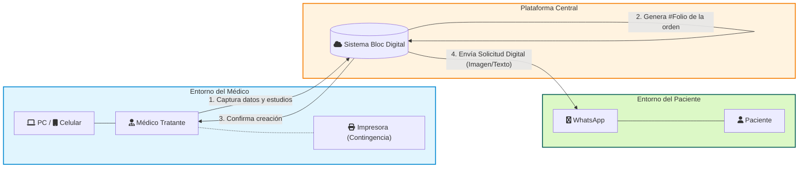
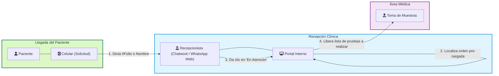
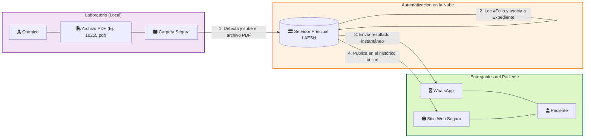
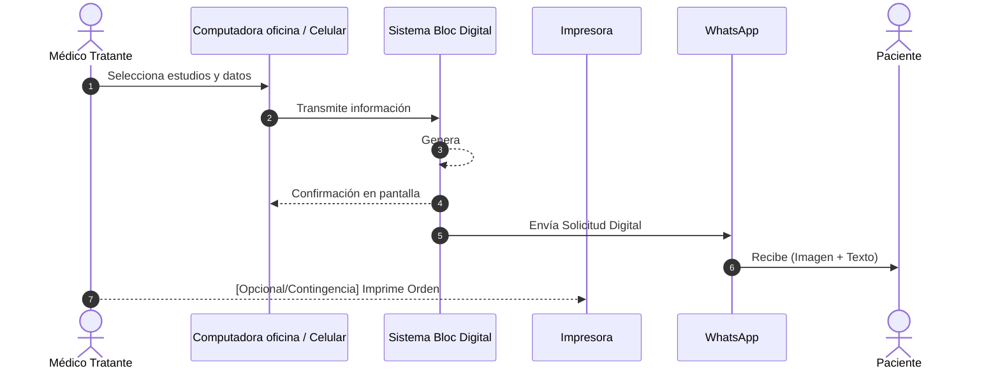
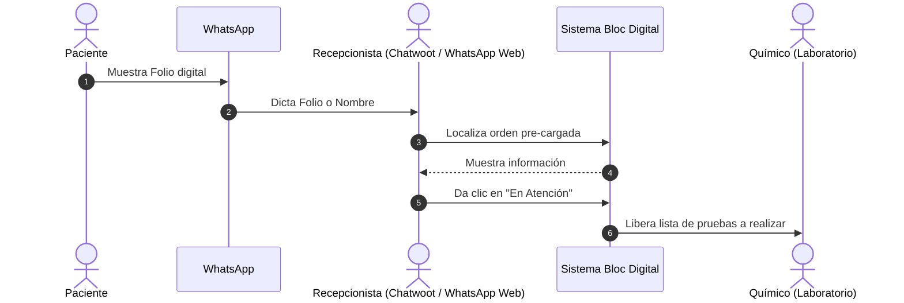
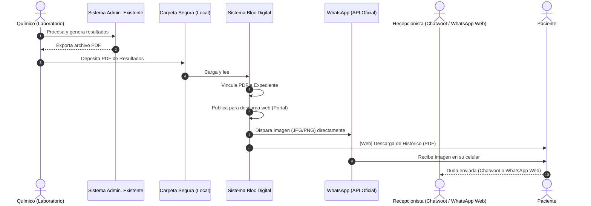

# Contractual Audit for LAESH Optimization

## Metadata

| Field | Value |
|-------|-------|
| **Trajectory ID** | `1f7e3f9c-e1c0-4f59-89d2-e9657f2acc90` |
| **Cascade ID** | `cb0e983b-0b58-480c-ace3-dd067fe7b902` |
| **Type** | Agent Conversation |
| **Total Steps** | 154 |
| **Started** | 19 July 2026, 7:16 pm |
| **Completed** | 20 July 2026, 12:32 am |

---

## User Request

Tu rol sera el de un experto en software cloud, y contractual para cautivar a un cliente y me  compre la opcion 4.

Analiza a detalle todos los documentos .MD, partiendo  de Resumen_Oferta_Servicios.md (rector), realiza una revision a super detalle para identificar: algun gap/issue, desalineación, falta de coherencia en alcances, no alcances, aspectos contractuales,etc, etc y pueda enmendarse.

/home/carlos/GitHub/caelitandem_home/portafolio-dev-2026/blocklabgd/contrato-laesh/v1.1/

No modifiques nada. Presentame plan.

<details>
<summary>Context</summary>

**Active File:** `Resumen_Oferta_Servicios.md`
**Language:** markdown
</details>

---

<details>
<summary>Conversation History</summary>

# Conversation History
Here are the conversation IDs, titles, and summaries of your most recent 10 conversations, in reverse chronological order:

<conversation_summaries>
## Conversation f2337344-e15f-4cfe-a491-aa14df397180: Contract Suite Finalization and Optimization
- Created: 2026-07-17T13:35:32Z
- Last modified: 2026-07-20T01:12:45Z

### USER Objective:
Finalizing LAESH Operational Documentation

Main Objective: Finalize and unify the LAESH documentation suite to ensure professional, homologated, and client-ready contractual and operational materials.

Goals:
1. Standardize all legal and operational documents by incorporating the "WhatsApp API Cloud" terminology and enforcing "Médico Tratante" nomenclature.
2. Integrate critical operational rules (24-hour window, Chatwoot omnicanal flow, and strict SIM-card usage restrictions) across all annexes to eliminate contractual gaps.
3. Optimize the Resumen_Oferta_Servicios.md document by restructuring infrastructure costs and operational exclusions into clear, executive-ready Markdown tables and list formats that prevent rendering issues.
4. Verify total cross-document consistency to ensure modular scalability and legal protection for the client.
5. Finalize the "Release Candidate" documentation suite (`v1.0/`) for immediate formal presentation and signature.

## Conversation 22d8d80f-4db9-45b5-aded-40f2c6bbbbe9: Contract Restructuring and Standardization
- Created: 2026-07-17T13:28:16Z
- Last modified: 2026-07-17T13:33:15Z

### USER Objective:
Contract Restructuring and Standardization

Main Objective: Restructure existing software development legal documentation into a modular, scalable framework for independent project management and service delivery.

Goals:
1. Deconstruct the monolithic "Contrato_Desarrollo_Software_Medida.docx" into a reusable base template and project-specific annexes.
2. Separate the hosting and maintenance infrastructure into an independent "Contract for Administration and Technical Support" to decouple it from individual project development lifecycles.
3. Remove direct infrastructure rental costs from the developer's contract, clarifying that the client handles direct payment to the hosting provider (Hostinger).
4. Integrate specific protective clauses regarding server access, administrative responsibilities, and limitation of liability for third-party hosting service issues.
5. Provide the new legal framework in an iterative Markdown format for further refinement before final document generation.

## Conversation 77b9f9f8-d281-4b6f-8a78-2f63a9952736: Validating WhatsApp Cloud API Hosting
- Created: 2026-07-15T18:56:40Z
- Last modified: 2026-07-15T20:36:38Z

### USER Objective:
WhatsApp Cloud API Integration

Objective: Implement and validate a production-grade WhatsApp Cloud API integration for medical clinics on the oci-vm server, while securing the infrastructure and finalizing financial documentation.

Goals:
1. Complete the technical "hardening" of the oci-vm server to mitigate identified security gaps (DDoS, phishing, and unauthorized access).
2. Validate the WhatsApp API PoC (image transmission) to confirm server capability for real-time messaging.
3. Finalize the `viabilidad-whatsappAPI-hosting.html` documentation to align with July 2026 Meta "Per-Message" pricing and native MXN billing.
4. Establish a scalable, multi-tenant endpoint strategy for medical client notifications.

## Conversation 0bcb657b-49b3-4e9c-994a-8e5bd805534b: Estabilización Motor Financiero AguaV2
- Created: 2026-06-30T19:46:04Z
- Last modified: 2026-07-15T18:03:21Z

### USER Objective:
Financial Engine Debt Reconciliation

Objective: Stabilize the AguaV2 financial engine by enforcing strict debt recovery policies on historical arrears.
Goals:
1. Revoke automatic forgiveness of surcharges for late capital payments, ensuring overdue interest survives despite past settlements.
2. Align the automated JIT engine and historical cleanup scripts to strictly differentiate between "canceled capital" (where interest is forgiven) and "late-paid capital" (where interest remains collectible).
3. Finalize the `fix-issue-01` deployment package by purging legacy anomalies from 2018 onwards while protecting manual historical surcharges (<= 2017) to meet the operator's exact recovery requirements.
4. Ensure full consistency across SQL deployment scripts, PHP business logic, and UI configuration tools to prevent unintended automated debt write-offs.

## Conversation e7385dba-c6a4-4918-a6c8-99ea08d52ae1: PWA Voice Phase Four Testing
- Created: 2026-07-07T06:06:19Z
- Last modified: 2026-07-07T14:24:46Z

## Conversation 47312b81-1164-4c0a-ab34-a2b98d7c94b9: Executing VOSK Phase 4 Testing
- Created: 2026-07-06T02:28:10Z
- Last modified: 2026-07-07T06:03:11Z

### USER Objective:
PWA Voice Pipeline Finalization

USER Objective: Finalize the production-grade deployment and operational stabilization of the VOSK voice command PWA.

Goals:
1. Complete the PWA "hard-refresh" and catalog verification process to ensure the 55-product repository is fully operational across mobile devices.
2. Refactor the PWA Deployment Guide (Section 10) in the operational manual to be user-friendly for managers and cashiers, moving technical implementation details to appropriate technical documentation.
3. Validate end-to-end functionality via manual QA protocols, confirming successful PWA "Add to Home Screen" installation, secure certificate trust, and seamless voice command execution.
4. Finalize remaining infrastructure gaps and ensure full system observability through the integrated MariaDB telemetry dashboard.

## Conversation 4f75a451-b8cc-4d33-84c9-10163ce71a32: Finalizing VOSK Voice Command Unification
- Created: 2026-07-04T17:14:40Z
- Last modified: 2026-07-06T02:25:10Z

### USER Objective:
Stabilizing VOSK PWA Production

USER Objective:
Finalize the production-readiness and verification of the VOSK-based voice command PWA.

Goals:
1. Conduct a full-cycle validation of the system using both the automated CLI backend test suite and the manual end-to-end PWA diagnostic protocols.
2. Execute a total "clean-slate" purge of the PWA environment to ensure fresh installation of the 55-product catalog and updated assets.
3. Validate all seven resilience pillars, including the Cache-First Service Worker strategy, AudioWorklet VAD/RMS thresholds, and memory management via Kill-and-Respawn logic.
4. Verify system integrity, responsiveness, and performance across simulated connectivity and hardware-constrained scenarios to confirm operational stability.
5. Consolidate technical documentation and maintenance runbooks, ensuring all architectural improvements (VAD, Cache-First, WASM Watchdog) are formally recorded as the project source of truth.

## Conversation 1d94ff2e-c998-4f28-b6e5-bd37b46816f9: Manual Execution of VOSK Tests
- Created: 2026-07-05T19:46:05Z
- Last modified: 2026-07-05T21:19:05Z

### USER Objective:
Manual Execution of VOSK Tests

Objective: Execute the manual testing phase for the PWA VOSK voice command system to ensure production stability.

Goals:
1. Conduct hands-on testing following the procedures defined in Pruebas_Casos_Validacion_Comandas_VOSK.html.
2. Validate the hybrid "Push-to-Talk" lifecycle for waitstaff and "hands-free" WakeLock for KDS units.
3. Verify offline enqueuing protocols and synchronization reliability during simulated connectivity drops.
4. Confirm UI/UX consistency across smartphone devices during command execution.
5. Identify and document any anomalies found during manual interaction for immediate remediation.

## Conversation 840498da-688d-40ff-adae-2f74e4bae508: 
- Created: 2026-07-03T01:58:51Z
- Last modified: 2026-07-04T17:07:00Z

### USER Objective:
Consolidating PWA Quality Assurance

Main Objective: Finalize the PWA command system stabilization by centralizing all diagnostic and validation protocols into the master QA documentation.

Goals:
1. Complete the migration of scattered test cases and operational validation scenarios from project manuals into the unified Pruebas_Casos_Validacion_Comandas_VOSK.html document.
2. Ensure the QA suite covers the new Browser API diagnostics, including COOP/COEP, WakeLock, EVICT persistence, and PWA onboarding requirements.
3. Eliminate documentation fragmentation by consolidating functional, integration, and operational test procedures into a single source of truth for production maintenance.
4. Maintain full parity between backend CLI automated tests and frontend browser-based diagnostic suites to ensure environment-agnostic stability.

## Conversation 6609794f-111e-455e-9814-990ce143d4d0: WhatsApp vCard Image Compatibility
- Created: 2026-07-03T02:03:19Z
- Last modified: 2026-07-03T02:03:34Z

### USER Objective:
WhatsApp vCard Image Compatibility

Objective: Determine the feasibility of embedding profile photos within .vcf files shared via WhatsApp.

Goals:
1. Verify technical support for `PHOTO` or `LOGO` fields in vCard files within the WhatsApp ecosystem.
2. Identify why WhatsApp frequently rejects vCard files containing embedded images (parsing errors, size limitations, or encoding issues).
3. Evaluate reliable alternatives, such as using digital business card links with metadata previews, to achieve the desired professional presentation without triggering file format errors.

</conversation_summaries>

</details>

---

### CORTEX_STEP_TYPE_KNOWLEDGE_ARTIFACTS

**Status:** Completed
**Created:** 19 July 2026, 7:16 pm

---

## Agent Response

### Thinking

The user wants me to analyze all MD documents in the directory `/home/carlos/GitHub/caelitandem_home/portafolio-dev-2026/blocklabgd/contrato-laesh/v1.1/` starting from `Resumen_Oferta_Servicios.md` as the rector document, identify gaps, issues, misalignments, incoherence in scope, out-of-scope items, contractual aspects, etc., and present a plan without modifying anything.

Let me first explore the directory structure.

### Actions

**Tool:** `list_dir`
**Path:** `/home/carlos/GitHub/caelitandem_home/portafolio-dev-2026/blocklabgd/contrato-laesh/v1.1`

**Tool:** `list_dir`
**Path:** `/home/carlos/GitHub/caelitandem_home/portafolio-dev-2026/blocklabgd/contrato-laesh/v1.0`

<details>
<summary>Metadata</summary>

- **Thinking Duration:** 5.939615490s
- **Model:** Claude Sonnet 4.6 (Thinking)
</details>

---

<details>
<summary>Directory: `v1.1` (12 items)</summary>

**Path:** `home/carlos/GitHub/caelitandem_home/portafolio-dev-2026/blocklabgd/contrato-laesh/v1.1`

| Name | Type | Size |
|------|------|------|
| `Acta_Firma_Aceptacion.md` | File | 1904 bytes |
| `Analisis_Tecnico_WhatsApp_Gaps.md` | File | 18075 bytes |
| `Anexo_A_Bloc_Digital.md` | File | 11357 bytes |
| `Anexo_A_Paquete_Integral.md` | File | 6599 bytes |
| `Anexo_A_Sitio_Web.md` | File | 7509 bytes |
| `Anexo_B_Soporte_Produccion.md` | File | 3921 bytes |
| `Anexo_Visual_Flujos_Operativos.md` | File | 12278 bytes |
| `Contrato_Administracion_Servidor.md` | File | 7419 bytes |
| `Contrato_Base_Desarrollo.md` | File | 15386 bytes |
| `Resumen_Oferta_Servicios.md` | File | 24329 bytes |
| `diagramas1.0` | Directory | - |
| `tecnicos` | Directory | - |

</details>

---

<details>
<summary>Directory: `v1.0` (11 items)</summary>

**Path:** `home/carlos/GitHub/caelitandem_home/portafolio-dev-2026/blocklabgd/contrato-laesh/v1.0`

| Name | Type | Size |
|------|------|------|
| `Acta_Firma_Aceptacion.md` | File | 1904 bytes |
| `Analisis_Tecnico_WhatsApp_Gaps.md` | File | 18075 bytes |
| `Anexo_A_Bloc_Digital.md` | File | 11357 bytes |
| `Anexo_A_Paquete_Integral.md` | File | 6599 bytes |
| `Anexo_A_Sitio_Web.md` | File | 7509 bytes |
| `Anexo_B_Soporte_Produccion.md` | File | 3921 bytes |
| `Anexo_Visual_Flujos_Operativos.md` | File | 12278 bytes |
| `Contrato_Administracion_Servidor.md` | File | 7419 bytes |
| `Contrato_Base_Desarrollo.md` | File | 15386 bytes |
| `Resumen_Oferta_Servicios.md` | File | 24329 bytes |
| `diagramas1.0` | Directory | - |

</details>

---

## Agent Response

### Actions

**Tool:** `view_file`
**File:** `Resumen_Oferta_Servicios.md`

<details>
<summary>Metadata</summary>

- **Model:** Claude Sonnet 4.6 (Thinking)
</details>

---

<details>
<summary>File: `Unknown file`</summary>

**Path:** `Unknown file`

```
# RESUMEN DE LA OFERTA DE SERVICIOS
**Proyecto:** Laboratorios Clínicos LAESH
**Fecha de corte:** Julio 2026

Este documento presenta las cuatro modalidades de contratación disponibles. Las propuestas están diseñadas para permitir a "EL CLIENTE" elegir el alcance tecnológico y funcional que mejor se adapte a su presupuesto y urgencia operativa.

*(Nota Legal: Independientemente de la opción elegida, toda la documentación contractual se ejecuta utilizando un Contrato Base Modular, el cual protege las garantías, previene retrasos y promueve el cumplimiento fiscal para ambas partes).*

---


### Opción 1: Sitio Web Presencial (Básico)

*   **Inversión Total:** $10,000.00 MXN
*   **Esquema de Pago (2 Hitos):** 50% Anticipo ($5,000) / 50% Firma de Aceptación ($5,000).
*   **Tiempo de Entrega:** 1 Mes (30 días naturales).
*   **Garantía:** 15 días naturales (Inicia a partir de la firma de Aceptación).
*   **Alcance Funcional:** Página web sencilla (5 secciones). Incluye Inicio, Nosotros (Cédulas), Catálogo de Estudios y Precios, Contacto (con mapa interactivo y botón directo a WhatsApp), y Aviso de Privacidad. Es la solución ideal para tener una presencia profesional en internet.
*   **Alcance Tecnológico:** Incluye optimización básica para posicionamiento en Google y adaptabilidad para celulares y tablets.
 

---

### Opción 2: Sitio Web PLUS (Portal de Resultados Automatizado)

*   **Inversión Total:** $30,000.00 MXN
*   **Esquema de Pago (2 Hitos):** 50% Anticipo ($15,000) / 50% Firma de Aceptación ($15,000).
*   **Tiempo de Entrega:** 2 Meses (60 días naturales).
*   **Garantía:** 30 días naturales (Inicia a partir de la firma de Aceptación).
*   **Alcance Funcional:** Todo lo de la Opción 1, **MÁS** un Portal de Pacientes. El personal deposita los resultados (PDF) en una carpeta de la computadora; el sistema los procesa y permite al paciente descargarlos en la página web. Adicionalmente, se notifica la imagen del resultado de manera automática por WhatsApp. **Esto representa un ahorro de tiempo sustancial, ya que automatiza la entrega para la gran mayoría de los pacientes del laboratorio (tanto de mostrador como referidos).**
*   **Alcance Tecnológico:** Incluye una base de datos segura para almacenar historiales, vinculación directa a la **Plataforma Oficial de WhatsApp (Meta)** para la notificación automatizada de los estudios, e instalación del software de **Bandeja Omnicanal (Chatwoot)** para la atención manual. Cuenta con mecanismo **"WhatsApp Stopper"** de seguridad financiera (Corte automático de comunicación con Meta para evitar sobrecostos).
*   **Reglas del Canal WhatsApp:** Debido a las políticas anti-spam de Meta, se restringe el envío proactivo de mensajes libres si el paciente no ha interactuado en las últimas 24 horas. Sin embargo, si un paciente escribe (incluso meses después de su cita), ese mensaje es **iniciado por el usuario (Inbound)**. En ese instante, Meta abre automáticamente una Ventana de Servicio de 24 horas, permitiendo a la recepcionista contestar de forma libre, sin plantillas y sin bloqueos *(Ver Flujo 3 del Anexo Visual)*. Para mitigar bloqueos cuando el paciente no escribe, el sistema incluye botones de acción (Ej. `[Ver Horarios y Ubicación]`); si el paciente lo oprime, habilita inmediatamente la atención libre. Para campañas comerciales en frío, el laboratorio deberá utilizar su canal tradicional de forma independiente.
 

---

### Opción 3: Bloc Digital de Solicitudes Clínicas

*   **Inversión Total:** $60,000.00 MXN
*   **Esquema de Pago (3 Hitos):** 30% Anticipo ($18,000) / 30% Despliegue a Producción ($18,000) / 40% Firma de Aceptación ($24,000).
*   **Tiempo de Entrega:** 2.5 Meses (75 días naturales).
*   **Garantía:** 30 días naturales (Inicia a partir de la firma de Aceptación).
*   **Alcance Funcional:** Automatización completa para crear y rastrear las órdenes de laboratorio. Incluye un catálogo de estudios, un portal rápido para que los médicos tratantes hagan la **Orden clínica digital**, y una pantalla donde pueden ver si sus pacientes ya fueron atendidos. Como único punto de contacto automatizado, **se le notificará al paciente su Orden clínica digital en imagen directamente en su WhatsApp**. Adicionalmente, cuenta con un portal para que recepción controle el estatus (Remitido, En Atención, Resultados Listos, Cerrada) y un **Módulo de Reportes** con estadísticas básicas.
*   **Consideración Operativa (Limitante):** Al no incluir el módulo de entrega automatizada, la recepción sigue obligada a entregar los resultados finales de forma 100% manual. **IMPORTANTE:** Debido a las reglas anti-spam de Meta (que bloquean el chat libre a las 24 horas si el paciente no responde), la recepcionista no podrá notificarle el resultado de Orden clínica digital en imagen por el nuevo canal automatizado. Tendrá que notificarlos manualmente utilizando el **WhatsApp Web de los números actuales de la clínica**. Esto significa que el paciente recibirá su orden inicial desde el número nuevo automatizado, y sus resultados finales desde el número tradicional. Esta desconexión mantiene el cuello de botella en mostrador.
*   **Alcance Tecnológico:** Sistema en la nube interno, perfiles de usuario, roles de seguridad, generación dinámica de PDFs, instalación de **Bandeja Omnicanal (Chatwoot)** y **"WhatsApp Stopper"** de seguridad financiera. *(Nota: Meta exige un dominio público para verificar empresas; si la clínica no tiene sitio web, se montará una "Landing Page" básica de contacto sin costo extra para cumplir este requisito).*
*   **Reglas del Canal WhatsApp:** Debido a las políticas anti-spam de Meta, se restringe el envío proactivo de mensajes libres si el paciente no ha interactuado en las últimas 24 horas. Sin embargo, si un paciente escribe (incluso meses después de su cita), ese mensaje es **iniciado por el usuario (Inbound)**. En ese instante, Meta abre automáticamente una Ventana de Servicio de 24 horas, permitiendo a la recepcionista contestar de forma libre, sin plantillas y sin bloqueos *(Ver Flujo 3 del Anexo Visual)*. Para mitigar bloqueos cuando el paciente no escribe, el sistema incluye botones de acción (Ej. `[Ver Horarios y Ubicación]`) en la orden; si el paciente lo oprime, habilita inmediatamente la atención libre. Para campañas comerciales en frío, se deberá utilizar el canal tradicional.
 

---

### Opción 4: PAQUETE INTEGRAL AUTOMATIZADO (La Opción 2 + Opción 3)

*   **Inversión Total:** **$80,000.00 MXN** *(Ahorro de $10,000.00 MXN sobre precios de lista al ejecutarse de forma paralela)*.
*   **Esquema de Pago (3 Hitos):** 30% Anticipo ($24,000) / 30% Despliegue a Producción ($24,000) / 40% Firma de Aceptación ($32,000).
*   **Tiempo de Entrega:** 4 Meses (120 días naturales).
*   **Garantía:** 45 días naturales (Inicia a partir de la firma de Aceptación).
*   **Alcance Funcional:** Solución completa que integra el **Bloc Digital** y el **Sitio Web PLUS (Resultados Automatizados)**. El médico tratante genera la orden, el paciente la recibe por WhatsApp y acude a la clínica. Al terminar los estudios, el químico guarda el PDF en su computadora, y el sistema notifica el resultado al paciente por WhatsApp como imagen para su instantánea visualización, y lo sube en PDF a la web. Es un proceso automatizado que no pierde la calidez humana, ya que el sistema y la recepcionista comparten el mismo hilo de conversación en WhatsApp (modelo híbrido) para resolver cualquier duda del paciente de forma instantánea.
*   **Beneficios y Ahorros (Solución Completa):** Esta opción resuelve el ciclo entero y mitiga los cuellos de botella operativos de la clínica. **El Sistema Bloc Digital procesará TODOS los PDFs que genere el laboratorio, sin hacer distinción.** No importa si el paciente llegó por un médico tratante del Bloc Digital o si llegó directamente caminando al mostrador; el sistema leerá el PDF, lo convertirá a imagen y lo enviará por el nuevo número automatizado a todos por igual, sacándole el 100% de provecho a la inversión.
*   **Alcance Tecnológico:** Sistema integrado bajo una sola base de datos, un mismo canal oficial de WhatsApp (Protegido por **WhatsApp Stopper** para controlar costos), y la instalación de **Bandeja Omnicanal (Chatwoot)**. Como los pacientes recibirán sus órdenes y resultados desde este nuevo número, es altamente probable que respondan sus dudas directamente ahí. Gradualmente, este nuevo número automatizado y Chatwoot absorberán el 90% del tráfico, convirtiéndose en el canal principal de atención de la clínica.
*   **Reglas del Canal WhatsApp:** Debido a las políticas anti-spam de Meta, se restringe el envío proactivo de mensajes libres si el paciente no ha interactuado en las últimas 24 horas. Sin embargo, si un paciente escribe (incluso meses después de su cita), ese mensaje es **iniciado por el usuario (Inbound)**. En ese instante, Meta abre automáticamente una Ventana de Servicio de 24 horas, permitiendo a la recepcionista contestar de forma libre, sin plantillas y sin bloqueos *(Ver Flujo 3 del Anexo Visual)*. Para campañas comerciales en frío, el laboratorio deberá utilizar su canal de WhatsApp tradicional de forma independiente.
 

---

## Cuadro Comparativo (Inversión vs. Valor Funcional)
Para facilitar la toma de decisiones, la siguiente tabla resume los pros, contras y el objetivo principal de cada opción tecnológica ofertada, permitiendo visualizar rápidamente el costo-beneficio.

| Característica | Opción 1: Presencial | Opción 2: Web PLUS | Opción 3: Bloc Digital | Opción 4: Integral |
| :--- | :--- | :--- | :--- | :--- |
| **Objetivo Principal** | Presencia Pública | Notificación de Resultados | Digitalización de Órdenes | Solución Automatizada Total |
| **Inversión Desarrollo** | $10,000 MXN | $30,000 MXN | $60,000 MXN | **$80,000 MXN** *(Recomendado)* |
| **Tiempo de Entrega** | 1 Mes | 2 Meses | 2.5 Meses | 4 Meses |
| **Pros (Ventajas)** | Económico, atrae pacientes por internet. | Automatiza la notificación del resultado de la Orden clínica digital en imagen, ahorrando múltiples horas diarias en recepción. | Reduce los errores por mala letra en recetas, profesionaliza al médico y notifica la Orden clínica digital en imagen. | Ciclo cerrado. Reduce errores y automatiza notificaciones (orden y resultado en imagen) bajo un mismo canal híbrido integrado. |
| **Contras (Limitantes)** | No resuelve problemas operativos internos. | Recepción debe seguir descifrando recetas de papel. Sujeto a reglas de atención de 24h de Meta. | Recepción debe notificar el resultado final manualmente por su cuenta (Meta bloquea el canal a las 24h). El flujo queda desconectado en dos líneas de WhatsApp. | Mayor inversión inicial y el laboratorio asume los costos por consumo oficial de la Whatsapp API Cloud. |

---

## Resumen de Puntos de Acceso (URLs)
Para brindar máxima claridad, la siguiente tabla resume los enlaces (URLs) que se activarán dependiendo de la opción contratada. Todas las direcciones operarán unificadas bajo el dominio principal de la clínica (ej. `laesh.mx`).

| Módulo / Interfaz | Opción 1 | Opción 2 | Opción 3 | Opción 4 | Ruta de Acceso (Ejemplo) |
| :--- | :---: | :---: | :---: | :---: | :--- |
| **Sitio Web Público** | Sí | Sí | No | Sí | `https://laesh.mx` |
| **Portal de Pacientes (Resultados)** | No | Sí | No | Sí | `https://laesh.mx/pacientes` |
| **Portal Médico (Captura de Órdenes)** | No | No | Sí | Sí | `https://laesh.mx/medicos` |
| **Portal de Recepción (Control Interno)** | No | No | Sí | Sí | `https://laesh.mx/labadmin` |

---

# SECCIÓN DE ANEXOS Y CONSIDERACIONES DETALLADAS
*La siguiente sección profundiza en las normativas, riesgos, garantías y estructura legal que amparan la ejecución de cualquiera de las opciones listadas en el Resumen Ejecutivo superior.*

---

## Condiciones y Requisitos Generales (Aplicables a todos los proyectos)
*   **Modelo de Entrega y Estabilización:** Independientemente de la opción elegida, los proyectos incluyen una fase de **hasta 15 días naturales de Estabilización** (pruebas en vivo y capacitación) que corre posterior al despliegue. Por regla general, al concluir estos 15 días (o antes, si ambas partes determinan de común acuerdo que el sistema opera de forma correcta y completa) se firma el Acta de Aceptación, liquidando el pago final y arrancando la Garantía correspondiente.
*   **Presupuesto para Proveedores de Terceros (Infraestructura):** Al ser un ecosistema 100% en la Nube (Cloud), el sistema operará en servidores contratados a su nombre, garantizándole total independencia. **Como parte de esta oferta de servicios, mi función es apoyarle como guía consultor paso a paso para realizar estas compras con los proveedores correspondientes.** Es obligación crítica de "EL CLIENTE" garantizar una conexión a internet estable en sus instalaciones. Los costos estimados (pagos directos al proveedor mediante domiciliación bancaria) se resumen a continuación:

    | Concepto Externo (Proveedor) | Frecuencia | Inversión Estimada | Aplica para | Observaciones Operativas |
    | :--- | :---: | :--- | :---: | :--- |
    | **Servidor en la Nube (Hostinger)** | Anual | ~$3,000 a $4,000 MXN | Opciones 2, 3, 4 | Se requiere un plan avanzado VPS KVM 4. *(La Opción 1 solo exige un plan básico de ~$500 MXN anuales).* |
    | **Dominio de Internet (.mx)** | Anual | ~$600 MXN | Todas | Nombre público e institucional de su página web (Ej. `laesh.mx`). |
    | **Chip SIM (Nuevo Número Móvil)** | Variable | ~$200 MXN | Opciones 2, 3, 4 | Línea celular virgen dedicada exclusivamente para el canal automatizado (Pago único o recargas esporádicas para mantener la línea activa en México). |
    | **Whatsapp API Cloud (Consumo Meta)** | Mensual | Pago por Consumo | Opciones 2, 3, 4 | Meta no cobra renta mensual. Cobra exclusivamente por "Conversación de Utilidad" (aprox. $0.15 a $0.20 MXN) desde el mensaje #1. Se debe domiciliar una tarjeta bancaria corporativa. Estará fuertemente protegido por nuestro algoritmo *WhatsApp Stopper* para evitar sobrecostos accidentales. |
*   **Titularidad y Verificación Empresarial (WhatsApp):** Por estrictas normativas de protección de datos médicos (INAI) y políticas anti-suplantación de Meta, la cuenta oficial de WhatsApp y su método de pago deben registrarse obligatoriamente a nombre del laboratorio. Para ello, "EL CLIENTE" deberá comprobar la identidad de su negocio ante Meta enviando su **Constancia de Situación Fiscal** y **Comprobante de Domicilio**. Esta titularidad directa protege legalmente a la clínica, garantizando que sea la única dueña y responsable del canal por donde viaja la salud de sus pacientes.
*   **Operatividad de WhatsApp (Uso Exclusivo de Nuevo Número):** Para garantizar estabilidad técnica, **el ecosistema utilizará OBLIGATORIAMENTE un NUEVO chip telefónico**. Lo más seguro es **NUNCA usar el número actual de la clínica para la API Cloud de WhatsApp**. Si la clínica migrara su número actual a la API Cloud, se cerraría su aplicación normal de WhatsApp Business, perdiendo irremediablemente todo el historial de chats con médicos y saliéndose automáticamente de todos los grupos. *(Nota Arquitectónica: No es posible conectar sus números "viejos/actuales" a Chatwoot sin caer en este riesgo. Por lo tanto, mantendrán el WhatsApp Web viejo exclusivamente para médicos o proveedores, mientras que el Chatwoot con el nuevo número absorberá orgánicamente casi la totalidad del tráfico de pacientes).*
*   **Funcionalidades Fuera de Alcance:** A fin de mantener un ecosistema eficiente y sin ambigüedades, queda expresamente fuera de todas las opciones planteadas (4) el desarrollo de:

    | Concepto Excluido | Detalle y Razón Operativa |
    | :--- | :--- |
    | **Campañas de Marketing Masivo** | El canal API implementado es estricto para atención. Si se realizan ventas en frío o promociones fuera de la ventana de 24h, Meta bloqueará la línea de forma permanente. (Llamadas regulares de voz no aplican en la plataforma). |
    | **Aplicaciones Móviles Nativas** | Todo el ecosistema opera de manera 100% web. No se desarrollarán ni publicarán apps instalables en tiendas (App Store / Google Play). |
    | **Chatbots Automáticos** | No se incluyen bots conversacionales (IA) para responder dudas médicas, cotizar precios o dar servicio al cliente vía WhatsApp. |
    | **Punto de Venta / Pasarelas** | Quedan excluidas las terminales de pago, pasarelas para cobro con tarjeta en línea y módulos de control de caja. |
    | **Módulos Financieros Avanzados** | Queda fuera la Facturación Electrónica (CFDI), cálculo de nóminas o calculadoras de honorarios para médicos referidores. |
    | **Asesoría Legal (INAI)** | La redacción jurídica de los Avisos de Privacidad respecto a datos de salud es responsabilidad de "EL CLIENTE". |
    | **Cuentas de Correo Corporativo** | No incluye creación ni alojamiento de buzones para empleados. El sistema usa un motor invisible (SMTP) exclusivo para alertas internas. |
*   **Seguridad y Privacidad de Datos:** Para tranquilidad del laboratorio y de los pacientes, el sistema usa protocolos de seguridad modernos: toda la información viaja encriptada por internet (candado verde HTTPS), y las contraseñas de los médicos se guardan cifradas (nadie, ni los desarrolladores, pueden verlas). El servidor provisto por Hostinger cuenta con protecciones mundiales. Finalmente, los datos de la tarjeta bancaria de la clínica para pagar los servicios de WhatsApp y Hostinger se ingresan directo en esas plataformas globales; nuestro sistema jamás pide, ve, ni guarda información de sus tarjetas.
*   **Propiedad de Datos e Historial Clínico (5 años):** "EL CLIENTE" será siempre el dueño absoluto y exclusivo de toda su información procesada (pacientes, resultados, logotipos). Para brindar máxima tranquilidad y cumplir con estándares de salud, la base de datos de las soluciones está diseñada para retener el historial operativo del laboratorio hasta por **5 años**. *(Nota: La configuración y resguardo de las copias de seguridad automáticas (backups) se gestiona a través de la póliza anual de Administración de Servidor).*
*   **Licenciamiento Tecnológico:** La clínica adquiere una **licencia de uso perpetua**; es decir, jamás pagará "rentas" por el derecho de usar el software. Por su parte, "EL PRESTADOR" conserva la propiedad intelectual exclusiva sobre el código fuente (motor tecnológico), reservándose el derecho de utilizar dicha ingeniería base en otros proyectos comerciales.

---

## Servicios Post-Salida (Sugeridos para el Año 1)
Una vez concluidos los periodos de garantía gratuitos de cualquiera de las opciones anteriores, se sugieren las siguientes pólizas de mantenimiento y monitoreo para asegurar que el sistema opere continuamente en óptimas condiciones:

| Póliza Sugerida | Inversión Anual | Cobertura Principal | Aplica para |
| :--- | :--- | :--- | :---: |
| **1. Soporte a Producción (Mantenimiento)** | $8,000 MXN | Bolsa de 12 horas mensuales para cambios o resolución rápida de incidentes. | Todas |
| **2. Administración de Servidor / Hosting** | $4,000 MXN | Mano de obra técnica (Respaldos automáticos, parches de seguridad de la nube). *Nota: El alquiler del hardware se paga directo al proveedor*. | Opciones 2, 3, 4 |

*(Nota: Al concluir el Año 1, "EL CLIENTE" podrá decidir libremente si desea renovar estas pólizas anuales (con ajuste inflacionario base INPC), cambiar a un esquema de iguala mensual, o pagar los servicios de soporte bajo demanda "por evento").*

---

## Riesgos y Mitigaciones Operativas
Para garantizar la viabilidad y éxito del proyecto, se identifican los siguientes riesgos externos y sus estrategias de mitigación:

| Riesgo Identificado | Impacto Potencial | Estrategia de Mitigación |
| :--- | :--- | :--- |
| **Aprobación en Meta (WhatsApp Cloud API)** | Meta exige validación formal de la empresa. Puede retrasar la salida a producción si los documentos son rechazados. | "EL CLIENTE" proveerá Constancia Fiscal y Comprobante de Domicilio en los primeros días del proyecto para obtener aprobación anticipada, evitando cuellos de botella. |
| **Extracción de Texto (PDFs del Laboratorio)** | Los equipos de la clínica podrían generar PDFs planos (tipo imagen escaneada), imposibilitando la lectura automática del folio. | Se ejecutará una Prueba de Concepto (PoC) técnica en etapas tempranas. De fallar, el personal renombrará manualmente el archivo con el `#Folio` como contingencia operativa. |
| **Caídas de Infraestructura de Terceros** | Interrupciones por mantenimiento o caídas globales de los proveedores externos (Hostinger y Meta Platforms). | Contratación de la *Póliza de Administración de Servidor* para copias de seguridad continuas y reactivación ágil (SLA de 2 horas). |

---

## Consideraciones Fiscales y Administrativas
*   **Aceptación y Liberación de Pagos:** Para cualquiera de las 4 opciones, el cobro del 100% del proyecto se rige por la firma del **Acta de Aceptación de Proyecto Tecnológico**. Este documento se firma típicamente al terminar el periodo de Estabilización (pudiendo ser antes si la clínica da su visto bueno anticipado); certifica que el sistema opera correctamente, y detona la obligación de liquidar el último hito de pago antes de que arranque la garantía.
*   **Montos Libres:** Todas las cantidades económicas listadas en esta propuesta son **montos netos (libres de impuestos)** a favor del Prestador.
*   **Cálculo Inverso (Persona Física a Persona Moral):** Al estar el Prestador tributando en el Régimen Simplificado de Confianza (RESICO), el Cliente (Persona Moral) es responsable de realizar el cálculo a la inversa (de neto a bruto) al momento de la facturación: agregar el 16% de IVA y descontar el 1.25% de retención de ISR y 10.6667% de retención de IVA (estándar fiscal vigente aplicable a prestación de servicios profesionales de una Persona Física a una Persona Moral). El cliente deberá cerciorarse de que el depósito líquido transferido sea exactamente igual a la cifra pactada en cada opción.

---

## Estructura Documental
Para garantizar total transparencia técnica y comercial, este proyecto se rige por un conjunto de 8 documentos modulares complementarios. *(Nota: En esta etapa temprana no es necesario imprimir ni revisar la totalidad de estos documentos, pero es fundamental que conozca su existencia como respaldo y protección a su inversión).*

**Nota sobre Políticas de Uso:** *(Para visualizar a detalle las reglas de interacción y los flujos de comunicación permitidos por Meta detallados anteriormente, consulte la sección "Casos de Uso de la Bandeja Omnicanal" en el Anexo Técnico, así como el Anexo Visual de Flujos Operativos).*

| Archivo Legal / Técnico | Abstracto del Contenido |
| :--- | :--- |
| **1. Resumen_Oferta_Servicios.md** | Documento rector (el actual) que compara opciones, costos, infraestructura y responsabilidades. |
| **2. Contrato_Base_Desarrollo.md** | Marco legal que establece hitos de pago, confidencialidad, propiedad intelectual y límites de responsabilidad (SLA). |
| **3. Anexo_A_Sitio_Web.md** | Especificación técnica exclusiva para la Opción 1 (Estructura de la web presencial). |
| **4. Anexo_A_Bloc_Digital.md** | Especificación técnica exclusiva para la Opción 3 (Reglas del portal médico y órdenes). |
| **5. Anexo_A_Paquete_Integral.md** | Especificación técnica para la Opción 2 y 4 (Módulo de resultados automatizados y Chatwoot). |
| **6. Contrato_Administracion_Servidor.md** | Póliza (opcional) para respaldos automáticos, parches de seguridad y monitoreo de la nube. |
| **7. Anexo_B_Soporte_Produccion.md** | Póliza (opcional) de mantenimiento y corrección de bugs tras finalizar los periodos de garantía gratuitos. |
| **8. Anexo_Visual_Flujos_Operativos.md** | Diagramas esquemáticos que ilustran visualmente el funcionamiento de la clínica paso a paso, incluyendo los ciclos de vida y reglas operativas de la API de WhatsApp. |


```

</details>

---

## Agent Response

### Actions

**Tool:** `view_file`
**File:** `Contrato_Base_Desarrollo.md`

**Tool:** `view_file`
**File:** `Anexo_A_Sitio_Web.md`

**Tool:** `view_file`
**File:** `Anexo_A_Bloc_Digital.md`

<details>
<summary>Metadata</summary>

- **Model:** Claude Sonnet 4.6 (Thinking)
</details>

---

<details>
<summary>File: `Unknown file`</summary>

**Path:** `Unknown file`

```
# CONTRATO DE PRESTACIÓN DE SERVICIOS PROFESIONALES
## PARA EL DESARROLLO DE SOFTWARE / PROYECTO WEB

Contrato de prestación de servicios profesionales para el desarrollo de software/proyecto web que celebran, por una parte, **CARLOS MARCELO BENAVIDES MARTÍNEZ**, con Registro Federal de Contribuyentes (RFC) **BEMC740404EE2**, con domicilio en **Calle Chapultepec 12, Col. Aviación 1ra Sección, C.P. 69000, Heroica Ciudad de Huajuapan de León, Oaxaca**, a quien en lo sucesivo se denominará **"EL PRESTADOR"**; y por la otra, **[NOMBRE O RAZÓN SOCIAL DEL CLIENTE]**, con RFC **[RFC DEL CLIENTE]**, con domicilio en **[DOMICILIO DEL CLIENTE]**, a quien en lo sucesivo se denominará **"EL CLIENTE"**; y a quienes en su conjunto se les denominará **"LAS PARTES"**, al tenor de las siguientes declaraciones y cláusulas:

### DECLARACIONES

**I. Declara "EL PRESTADOR":**
1. Que es una persona física/moral dedicada, entre otras actividades, al desarrollo de software, sitios web y sistemas informáticos.
2. Que cuenta con los conocimientos técnicos, la experiencia y los recursos necesarios para llevar a cabo el desarrollo objeto del presente contrato.
3. Que se encuentra inscrito ante el Servicio de Administración Tributaria (SAT) bajo el RFC señalado en el proemio de este contrato.
4. Que señala como domicilio para efectos de este contrato el ubicado en **Calle Chapultepec 12, Col. Aviación 1ra Sección, C.P. 69000, Heroica Ciudad de Huajuapan de León, Oaxaca**.

**II. Declara "EL CLIENTE":**
1. Que requiere los servicios profesionales de "EL PRESTADOR" para el desarrollo de un proyecto tecnológico a la medida, conforme a las especificaciones descritas en el **Anexo A** del presente contrato.
2. Que cuenta con la capacidad legal y los recursos económicos suficientes para cumplir con las obligaciones que deriven del presente contrato.
3. Que señala como domicilio para efectos de este contrato el ubicado en [DOMICILIO DEL CLIENTE].

---

### CLÁUSULAS

**PRIMERA. Objeto del contrato (Contrato Marco)**
El presente documento funciona como un Contrato Marco. "EL PRESTADOR" se obliga a diseñar, desarrollar e implementar a favor de "EL CLIENTE" el proyecto o proyectos tecnológicos (en lo sucesivo "EL SISTEMA" o "LOS SISTEMAS"), comprendiendo las fases de análisis, diseño, desarrollo, pruebas, despliegue, estabilización y garantía, conforme al alcance, funcionalidades, entregables y especificaciones técnicas descritas estrictamente en el **Anexo A** (o múltiples anexos si se contratan proyectos modulares en fechas distintas). Cada anexo formará parte integrante de este contrato, pero sus calendarios, hitos de facturación y garantías operarán de manera independiente.

Adicionalmente, y solo en la medida en que haya sido contratado por "EL CLIENTE" conforme al listado de anexos aplicables, el objeto del presente contrato podrá comprender el servicio de soporte a producción posterior al periodo de garantía, descrito en el **Anexo B**. 

*(Nota: Los servicios de administración de infraestructura, hosting y mantenimiento continuo de servidores se rigen por un contrato independiente).*

**SEGUNDA. Alcance y entregables**
El alcance del proyecto, los módulos o funcionalidades a desarrollar, la metodología de trabajo y el calendario de entregas se especifican en el **Anexo A**. Cualquier funcionalidad, módulo o requerimiento no incluido expresamente en dicho anexo se considerará fuera de alcance y estará sujeto a la Cláusula Novena (Cambios y trabajo adicional).

**SEGUNDA COMPLEMENTARIA. Fuera de Alcance y Limitaciones Técnicas**
A fin de evitar ambigüedades operativas, y salvo que se especifique lo contrario de manera expresa y por escrito en el **Anexo A**, quedan estrictamente excluidos del alcance de este contrato y de las obligaciones de "EL PRESTADOR":
1. **Módulos Financieros y Fiscales:** Cualquier desarrollo o integración relacionada con facturación electrónica (CFDI), cálculo de nóminas, gestión contable o cálculo de esquemas de comisiones/honorarios para médicos referidores.
2. **Infraestructura y Servicios de Terceros:** El pago de rentas, licencias, dominios de internet, servidores web (hosting en Hostinger), servicios en la nube o los consumos mensuales de la **Whatsapp API Cloud**. Todos estos servicios de terceros son responsabilidad económica y operativa directa de "EL CLIENTE", quien se obliga a proveer su propia tarjeta de crédito o débito corporativa para domiciliar los pagos de manera directa con dichos proveedores internacionales, deslindando a "EL PRESTADOR" de cualquier intermediación de pago o corte de servicio por falta de fondos.
3. **Hardware y Redes Locales:** La compra, instalación, reparación, configuración o mantenimiento de computadoras, impresoras, ruteadores, cableado de red local (LAN) o cualquier dispositivo físico dentro de las instalaciones de "EL CLIENTE".
4. **Captura de Datos Históricos (Data Entry):** La migración manual, captura o vaciado masivo de expedientes clínicos, resultados médicos o bases de datos provenientes de sistemas anteriores, a excepción de la importación inicial de catálogos si así lo marca el Anexo A.
5. **Aspectos Legales (INAI):** La asesoría jurídica y redacción de Avisos de Privacidad respecto al manejo de datos sensibles (salud) en plataformas digitales, recayendo dicha responsabilidad y titularidad absoluta en "EL CLIENTE".
6. **Buzones de Correo:** El alojamiento, creación o administración de cuentas de correo corporativo para el personal de "EL CLIENTE".

**TERCERA. Precio y forma de pago**
Las cantidades económicas estipuladas en el **Anexo A** y demás anexos aplicables representan montos **netos (libres de impuestos)** a favor de "EL PRESTADOR". 

Dado que "EL PRESTADOR" tributa bajo el Régimen Simplificado de Confianza (RESICO) como Persona Física, y asumiendo que "EL CLIENTE" tributa como Persona Moral, "EL CLIENTE" se obliga a realizar el cálculo a la inversa (de neto a bruto) (agregando el 16% de IVA y contemplando las retenciones obligatorias de ISR e IVA que marca la ley) de tal manera que el monto líquido depositado coincida exactamente con las cantidades netas estipuladas en este contrato y sus anexos.

Todos los pagos se realizarán en moneda nacional (pesos mexicanos) mediante transferencia electrónica o depósito bancario dentro de los **5 días naturales** siguientes a la presentación de la factura (CFDI) correspondiente. En caso de mora en el pago, se causarán intereses moratorios del **5%** mensual sobre el saldo insoluto.

**CUARTA. Plazo de ejecución**
El desarrollo de "EL SISTEMA" iniciará en la fecha acordada y concluirá conforme al calendario de entregas definido en el **Anexo A**, salvo que "LAS PARTES" acuerden por escrito una prórroga, o que ésta derive de retrasos imputables a "EL CLIENTE" (por ejemplo, demora en la entrega de información, contenidos, accesos o retroalimentación), en cuyo caso el plazo se ampliará en la misma proporción del retraso.

**QUINTA. Propiedad intelectual y Licenciamiento**
Las partes reconocen y aceptan que "EL SISTEMA" (aplicación web) está construido sobre un motor tecnológico, arquitectura de software y código fuente propiedad exclusiva de "EL PRESTADOR". Por lo tanto, una vez cubierto en su totalidad el precio pactado, "EL PRESTADOR" otorga a "EL CLIENTE" una **Licencia de Uso Perpetua, Intransferible y No Exclusiva** para el uso operativo de "EL SISTEMA" en su negocio.

Bajo este modelo de licenciamiento:
1. **Reserva de Derechos Patrimoniales:** "EL PRESTADOR" retiene el 100% de los derechos patrimoniales sobre el código fuente, la lógica de programación y los algoritmos, reservándose el derecho irrestricto de comercializar, licenciar o implementar soluciones basadas en el mismo motor tecnológico a terceros.
2. **Propiedad de "EL CLIENTE":** Toda la información procesada en el sistema (bases de datos de pacientes, historial, catálogos), así como las marcas, logotipos y el diseño visual (front-end) creado específicamente para su identidad corporativa, son y seguirán siendo propiedad exclusiva, absoluta y confidencial de "EL CLIENTE".
3. **Excepción para Sitios Web:** En caso de que el presente contrato ampare el desarrollo de un Sitio Web o Página de Presentación estática, "EL PRESTADOR" sí cede los derechos patrimoniales sobre el diseño visual y contenidos de dicho sitio a favor de "EL CLIENTE".

En tanto no se cubra la totalidad del precio pactado, "EL PRESTADOR" conserva la titularidad total y no se otorga licencia alguna.

**SEXTA. Confidencialidad**
"LAS PARTES" se obligan a mantener estricta confidencialidad respecto de la información técnica, comercial, financiera y de cualquier otra naturaleza a la que tengan acceso con motivo de este contrato, obligación que subsistirá por **3 años** posteriores a la terminación del mismo. Esta obligación no aplica a información de dominio público o que "LAS PARTES" estén obligadas a revelar por mandato de autoridad competente.

**SÉPTIMA. Garantía y Protección al Cliente**
"EL PRESTADOR" garantiza la corrección, sin costo adicional, de fallas o defectos ("bugs") atribuibles a su desarrollo, por el **Periodo de Garantía** estipulado en el Anexo A. Este periodo comenzará a correr exclusivamente a partir del día siguiente a la firma del Acta de Aceptación y una vez liquidado el pago final al 100%.

**Blindaje y Penalización:** Dado que "EL CLIENTE" cubre la totalidad del proyecto antes del inicio de la garantía, si durante dicho Periodo de Garantía "EL PRESTADOR" incumple injustificada y comprobablemente con la corrección de fallas críticas atribuibles a su código (dejando el sistema inoperante), "EL CLIENTE" tendrá derecho a exigir un reembolso proporcional de hasta el **20% del valor total del proyecto** como pena convencional por incumplimiento de garantía.

Quedan excluidos de la garantía: nuevas funcionalidades o módulos no contemplados en el Anexo A, fallas derivadas de modificaciones realizadas por terceros al código, y fallas originadas por el entorno de hospedaje, hardware o infraestructura de terceros.

Concluido el Periodo de Garantía, cualquier corrección de bugs, cambio menor o soporte adicional será materia del servicio de soporte a producción (Anexo B), sujeto a contratación y pago independientes. 

**SÉPTIMA COMPLEMENTARIA. Periodo de Estabilización**
Una vez desplegado "EL SISTEMA" en el entorno de producción, iniciará inmediatamente un **Periodo de Estabilización de 15 días naturales**. Esta es una fase de pruebas en vivo, previa a la entrega final. Durante esta fase, "EL PRESTADOR" dará seguimiento intensivo, elaborará y entregará la documentación técnica y el manual de usuario, y corregirá sin costo cualquier detalle derivado del uso real. Al concluir estos 15 días, el sistema se considerará estabilizado y listo para su entrega formal.

**OCTAVA. Pruebas, Aceptación y Pago Final**
Al concluir satisfactoriamente el Periodo de Estabilización, "EL CLIENTE" firmará el **Acta de Aceptación**. La firma de este documento certifica la recepción conforme de "EL SISTEMA" y detona, de manera obligatoria e inmediata, la liberación del **último hito de pago (Pago Final)** estipulado en el Anexo A correspondiente. Transcurrido un plazo de **7 días naturales** desde el fin de la estabilización sin que "EL CLIENTE" reporte fallas críticas ni firme el acta por omisión, el sistema se tendrá por aceptado tácitamente, obligando al pago final.

**NOVENA. Cambios y trabajo adicional**
Cualquier solicitud de "EL CLIENTE" que implique modificar el alcance original (nuevas funcionalidades, cambios sustanciales de diseño, o requerimientos no previstos en el Anexo A) será evaluada por "EL PRESTADOR" y, de proceder, se documentará mediante un anexo o convenio modificatorio por escrito, especificando el impacto en tiempo y costo antes de su ejecución.

**DÉCIMA. Terminación anticipada**
Cualquiera de "LAS PARTES" podrá dar por terminado el presente contrato de forma anticipada mediante notificación por escrito con **7 días naturales** de anticipación. En caso de terminación anticipada, "EL CLIENTE" pagará a "EL PRESTADOR" la parte proporcional del trabajo efectivamente realizado hasta la fecha de terminación, y "EL PRESTADOR" entregará los avances desarrollados a esa fecha.

**DÉCIMA PRIMERA. Relación entre las partes**
"LAS PARTES" reconocen que el presente contrato es de naturaleza civil/mercantil y no genera relación laboral alguna entre "EL PRESTADOR" (ni su personal, en su caso) y "EL CLIENTE", por lo que no será aplicable la legislación laboral entre ellos.

**DÉCIMA SEGUNDA. Limitación de responsabilidad**
La responsabilidad de "EL PRESTADOR" frente a "EL CLIENTE" por cualquier reclamación derivada de este contrato se limita, en todo caso, al monto efectivamente pagado por "EL CLIENTE" bajo este contrato. "EL PRESTADOR" no será responsable por daños indirectos, lucro cesante o pérdida de datos derivados del uso de "EL SISTEMA", salvo negligencia grave o dolo. "EL PRESTADOR" tampoco es responsable por cortes de servicio, pérdida de datos o incidentes de seguridad causados por el proveedor de hosting (Hostinger) ni por suspensiones, bloqueos de número o cambios en las políticas de la **Whatsapp API Cloud** contratada directamente por "EL CLIENTE".

**DÉCIMA TERCERA. Jurisdicción y legislación aplicable**
Para la interpretación y cumplimiento del presente contrato, "LAS PARTES" se someten a la legislación aplicable y a la jurisdicción de los tribunales competentes en la **HEROICA CIUDAD DE HUAJUAPAN DE LEON, OAXACA**, renunciando a cualquier otro fuero que pudiera corresponderles por razón de sus domicilios presentes o futuros.

Leído que fue el presente contrato y enteradas "LAS PARTES" de su contenido y alcance legal, lo firman de conformidad en dos tantos, en la **HEROICA CIUDAD DE HUAJUAPAN DE LEON, OAXACA**, a **27 de Julio de 2026**.

_______________________________
**EL PRESTADOR** — CARLOS MARCELO BENAVIDES MARTÍNEZ

_______________________________
**EL CLIENTE** — [NOMBRE O RAZÓN SOCIAL]

---
### ANEXOS APLICABLES Y ESTRUCTURA DOCUMENTAL
Marque los anexos y documentos que aplican al presente contrato conforme a los servicios efectivamente contratados por "EL CLIENTE":

**Documentos de Alcance (Desarrollo):**
[ X ] **Anexo A — Bloc Digital de Solicitudes Clínicas:** Especificaciones técnicas, hitos de pago, entregables y alcance para la aplicación web transaccional. (Obligatorio si se contrata la webapp).
[ X ] **Anexo A — Sitio Web Corporativo (Página de Presentación):** Especificaciones de diseño, contenido y alcance para la página web estática institucional. (Obligatorio si se contrata el sitio web).

**Documentos de Mantenimiento y Soporte:**
[ X ] **Anexo B — Soporte Anual a Producción (Post-Garantía):** Servicio opcional de mantenimiento continuo, corrección de errores y bolsa de horas mensuales de ajuste, aplicable una vez expirado el periodo de garantía del Anexo A.
[ X ] **Contrato de Servicios Recurrentes (Administración de Servidor):** Documento legal independiente para el servicio de configuración, soporte técnico y administración de la infraestructura de hosting contratada directamente por "EL CLIENTE".

```

</details>

---

<details>
<summary>File: `Unknown file`</summary>

**Path:** `Unknown file`

```
# ANEXO A — ALCANCE DEL PROYECTO
## Proyecto: Sitio Web Corporativo / Página de Presentación

Este anexo forma parte integrante del Contrato de Prestación de Servicios Profesionales celebrado entre "EL PRESTADOR" y "EL CLIENTE".

**1. Descripción general del proyecto**
El proyecto consiste en crear una página web sencilla para el laboratorio, con el objetivo de tener una presencia profesional en internet, informar sobre los estudios disponibles y facilitar el contacto con los pacientes.

**2. Alcance y entregables (Tabla de Funcionalidades)**
A continuación se detalla el alcance exacto del desarrollo. Los módulos marcados como "PLUS" únicamente aplican y tienen validez técnica si "EL CLIENTE" contrató explícitamente dicha modalidad comercial.

| Componente | Descripción de la Funcionalidad (Alcance Exacto) |
| :--- | :--- |
| **Sitio Web** | Página de 5 secciones (Inicio, Nosotros, Estudios, Contacto, Privacidad). Adaptable a celulares y optimizada para aparecer en Google. Botón flotante de WhatsApp. |
| **Portal de Pacientes (Modalidad PLUS)** | Área segura donde los pacientes pueden descargar su historial de resultados en formato PDF (últimos 90 días). Acceso validado mediante **Teléfono + Folio**. |
| **Subida de Resultados (Modalidad PLUS)** | Canal seguro (Carpeta de sincronización local) donde el personal de laboratorio deposita los PDFs diarios. El servidor los procesa y asocia automáticamente apoyándose en el `#Folio` contenido en el nombre del archivo. |
| **Automatización WhatsApp (Modalidad PLUS)** | Una vez procesado el archivo PDF, el sistema lo convierte a imagen (JPG/PNG) y lo envía directamente al WhatsApp del paciente para asegurar su visualización fácil en su celular. **Esto aplica para TODOS los pacientes del laboratorio (tanto referidos por médicos como directos de mostrador)**, ahorrando mucho tiempo en recepción. Requiere la asignación de un **NUEVO Número Telefónico Dedicado (Chip SIM)**, el cual la recepcionista podrá operar vía **Bandeja de Atención Centralizada (Chatwoot)** para atender a los pacientes. |
| **Prueba de Concepto y Contingencia (PLUS)** | Previo a la salida, se realizará una prueba técnica para intentar extraer el teléfono del paciente leyendo el texto interior del PDF. De resultar inviable/inestable por el formato del laboratorio, se aplicará invariablemente la regla de contingencia: renombrar el archivo por `#Folio`. |

**3. Fuera de alcance (No incluye)**
*   Creación, redacción de contenido (textos) o producción multimedia (fotografías, videos); estos elementos deberán ser proporcionados por "EL CLIENTE".
*   Gestor de Contenidos (CMS) completo para la edición autónoma de la estructura y textos estáticos de la página por parte de "EL CLIENTE".
*   **Asesoría Legal (INAI) y Buzones de Correo:** La redacción jurídica del Aviso de Privacidad y el cumplimiento de la ley de protección de datos personales son responsabilidad de "EL CLIENTE". Así mismo, el proyecto no incluye la creación de buzones de correo corporativo para empleados.
*   Gestión de campañas de publicidad, posicionamiento pagado (SEM) o administración de redes sociales.
*   Servicios de hosting, compra de dominios, certificados SSL y el consumo por API en Meta Platforms Inc., los cuales son pagos que asume directamente "EL CLIENTE". Así mismo, para la Modalidad PLUS, el cliente asume la **Titularidad y Verificación Empresarial ante Meta** (proveyendo su Constancia Fiscal y Comprobante de Domicilio para asegurar la propiedad legal del canal por normativas de privacidad), proveer un **NUEVO Número Telefónico Exclusivo (Chip SIM)** y garantizar una conexión a internet estable en su sucursal. **RESTRICCIÓN CRÍTICA:** Queda estrictamente prohibido migrar el número actual de la clínica a la API Cloud de Meta, ya que ocasionaría la clausura de su app normal y la pérdida total del historial de chats con médicos y grupos.

**3.1 Políticas de Uso de la Bandeja Omnicanal (Modalidad PLUS)**
Para cumplir con las políticas anti-spam de Meta (WhatsApp) y garantizar la operatividad de la línea, aplican las siguientes reglas de comunicación:
*   **Apertura de Ventana (24h):** El sistema puede notificar resultados en cualquier momento. Si un paciente escribe o responde (incluso meses después), ese mensaje es **iniciado por el usuario (Inbound)**. En el instante en que manda ese mensaje, Meta abre automáticamente una Ventana de 24 horas, permitiendo a la recepcionista (desde Chatwoot) contestarle de forma libre y sin bloqueos *(Ver Flujo 3 del Anexo Visual)*.
*   **Restricción de Marketing:** Si el laboratorio utiliza el canal automatizado para enviar campañas comerciales masivas, realizar ventas en frío o contactar pacientes fuera de la ventana de 24 horas, Meta suspenderá permanentemente la línea. Las llamadas telefónicas (celulares o de voz por la app) no abren la ventana de 24 horas.

**4. Obligaciones específicas del cliente**
Para un flujo de trabajo óptimo, "EL CLIENTE" se compromete a entregar todo el material gráfico (logotipos en alta resolución, manual de marca si existe) y textos definitivos en un plazo sugerido de **7 días naturales** posteriores a la firma. Cualquier retraso en la entrega de este material o en las aprobaciones de diseño será tolerado por "EL PRESTADOR" sin penalizaciones, siempre y cuando no comprometa la fecha máxima de entrega estipulada en la cláusula 5.

**5. Calendario y Plazo de entrega**
El sitio web será entregado (desplegado a producción) en un plazo máximo e improrrogable de **[PLAZO_DE_ENTREGA]** contados a partir de la firma del presente anexo. Tras el despliegue, iniciará el **Periodo de Estabilización de 15 días naturales**, al término del cual se procederá a la firma del Acta de Aceptación.

*Cláusula de Protección de Tiempos:* Si al llegar la fecha límite "EL CLIENTE" aún no ha entregado la totalidad del contenido (textos e imágenes), "EL PRESTADOR" publicará el sitio con la estructura funcional terminada y contenido de relleno para cumplir contractualmente con los tiempos y detonar el inicio de la Estabilización. "EL PRESTADOR" sustituirá el relleno por el contenido definitivo sin costo, siempre y cuando ocurra dentro del periodo de garantía.

**6. Garantía ([DIAS_GARANTIA])**
La garantía para corrección de defectos visuales, funcionales o enlaces rotos atribuibles al desarrollo será de **[DIAS_GARANTIA] naturales**, los cuales comenzarán a correr exclusivamente a partir del día siguiente a la firma del Acta de Aceptación y una vez liquidado el pago final. Durante la fase de estabilización previa, se incluye la capacitación al personal.

**7. Precio, Desglose de Pagos y Facturación**
El precio total de este proyecto es de **$[PRECIO_TOTAL_MXN] MXN (Netos)**, pagadero bajo el siguiente esquema:

| Hito de Pago | Porcentaje | Monto a Facturar | Condición de Cobro |
| :--- | :--- | :--- | :--- |
| **Pago 1: Anticipo** | 50% | $[MONTO_PAGO_1] MXN (Netos) | A la firma de este anexo y entrega de todos los recursos. |
| **Pago 2: Pago Final** | 50% | $[MONTO_PAGO_2] MXN (Netos) | A la firma del Acta de Aceptación (Fin de Estabilización, Día 15). |
| **TOTAL** | **100%** | **$[PRECIO_TOTAL_MXN] MXN (Netos)** | |

*(Nota: Los porcentajes de anticipo para el Sitio Web varían respecto a la Cláusula Tercera del Contrato Base, prevaleciendo este Anexo)*.

_______________________________
**FIRMA DE CONFORMIDAD - EL CLIENTE**

```

</details>

---

<details>
<summary>File: `Unknown file`</summary>

**Path:** `Unknown file`

```
# ANEXO A — ALCANCE DEL PROYECTO
## Proyecto: Bloc Digital de Solicitudes Clínicas

Este anexo forma parte integrante del Contrato de Prestación de Servicios Profesionales celebrado entre "EL PRESTADOR" y "EL CLIENTE".

**1. Descripción general del sistema**
"EL SISTEMA" es una aplicación web que sustituye las libretas y recetas de papel usadas por los médicos y el laboratorio. Permite crear, consultar y dar seguimiento a las órdenes de estudios de manera 100% digital.

**2. Fases incluidas**
1. Análisis de requerimientos y del flujo de trabajo actual (levantamiento con el personal médico/laboratorio).
2. Diseño de la solución (experiencia de usuario, interfaz y modelo de base de datos).
3. Desarrollo del sistema conforme a los módulos y funcionalidades descritos en la sección 3.
4. Pruebas (funcionales y de aceptación) previas a la puesta en producción.
5. Despliegue en el entorno de producción de "EL CLIENTE" (el servidor debe ser proveído por "EL CLIENTE" o administrado mediante el Contrato Independiente de Servicios Recurrentes).
6. **Periodo de Estabilización de 15 días naturales** (Fase de pruebas en vivo y correcciones iniciales). *(Nota: Durante esta fase se elaborará y entregará formalmente la documentación técnica y el manual de usuario del sistema).*
7. **Firma del Acta de Aceptación** (Hito formal que detona el pago final).
8. **Periodo de Garantía Total de 30 días naturales**, el cual arranca exclusivamente tras la firma del Acta de Aceptación y la liquidación del pago final. *(Nota: Durante la estabilización previa, se incluye la capacitación al personal y el acompañamiento en sitio).*

**3. Módulos y funcionalidades incluidas**
*   **Módulo de Captura:** Captura digital de solicitud de análisis clínicos por parte del personal autorizado.
*   **Módulo de Catálogo:** Catálogo administrable de estudios/análisis clínicos disponibles.
*   **Módulo de Consulta:** Consulta, búsqueda y seguimiento de estatus de solicitudes.
*   **Módulo de Exportación:** Generación de solicitud en formato PDF optimizado para impresión o envío.
*   **Módulo de Reportes:** Generación de estadísticas operativas e indicadores clave del laboratorio.
*   **Módulo de Seguridad:** Gestión de usuarios, roles (médico, laboratorio, administrador) y permisos de acceso.

**3.1. Tabla de Alcance Funcional Exacto**
A continuación se detalla el comportamiento del sistema para evitar ambigüedades técnicas:

| Módulo del Sistema | Descripción de la Funcionalidad (Alcance Exacto) |
| :--- | :--- |
| **Catálogo de Estudios** | Administración para agregar o editar estudios médicos y precios. Incluye una carga masiva inicial por parte de "EL PRESTADOR" mediante un archivo Excel provisto por "EL CLIENTE". |
| **Portal Médico (Captura)** | Pantalla para que el médico tratante cree una solicitud médica (Nombre, teléfono, estudios). |
| **Notificación Inmediata** | Al guardar la orden, el sistema le envía inmediatamente la solicitud en imagen al WhatsApp del paciente. |
| **Portal de Seguimiento** | Pantalla segura donde el médico tratante consulta si los pacientes que mandó al laboratorio ya fueron atendidos. |
| **Portal Interno (Clínica)** | Pantalla para la recepcionista. Muestra notificaciones de nuevas solicitudes, permite buscar pacientes y marcar su estatus como "En Atención" cuando el paciente llega a pagar. |
| **Módulo de Reportes** | Pantalla con estadísticas básicas (ej. cantidad de solicitudes creadas por médico tratante). *No incluye cálculos financieros, comisiones ni gestión de honorarios.* |
| **Caducidad Automática** | Regla de negocio en el servidor que cierra/caduca automáticamente las solicitudes médicas si el paciente no acude a la clínica en un plazo de 30 días (configurable). |
| **Compatibilidad de Dispositivos** | El **Portal Médico** cuenta con adaptabilidad para celulares, tablets y computadoras. El resto de portales (incluyendo la Recepción Clínica) están diseñados para computadoras de escritorio (Windows 10/11 o macOS) usando Google Chrome o Apple Safari. |

**4. Integración con Plataforma Oficial WhatsApp y Control Presupuestal**
El sistema incluirá un módulo especializado para la notificación automática a los pacientes vía WhatsApp ("Mensajes de Utilidad"), con las siguientes características y controles desarrollados por "EL PRESTADOR":
*   **Garantía de Control Presupuestal (Stopper):** Dado que Meta no ofrece bloqueos nativos, el sistema fijará un límite máximo de **$6,000.00 MXN mensuales** de consumo.
*   **Alertas Tempranas:** Envío automático de correos a "EL CLIENTE" al alcanzar el 90% ($5,400 MXN) del presupuesto mensual.
*   **Bloqueo Automático:** Al llegar al límite, la aplicación congelará las peticiones de salida a WhatsApp para evitar sobrecostos, reactivando el servicio el primer día del siguiente mes o por ampliación presupuestal.
*   **Contingencia en Interfaz Médica:** Al activarse el bloqueo, se mostrará al médico el aviso *"Canal de WhatsApp fuera de servicio temporalmente por límite mensual"*. El botón de envío se deshabilitará y la aplicación forzará el guardado e impresión física (PDF) para garantizar la continuidad del laboratorio.
*   **Reglas de Interacción y Continuidad:** El flujo automatizado se limita a **notificar la Orden clínica digital en imagen** al paciente. Chatwoot gestionará única y exclusivamente esta NUEVA línea, donde convivirán el Notificador automatizado para WhatsApp y la recepcionista humana atendiendo este canal. **Los números actuales de la clínica NO se conectan al sistema**; el personal los operará de forma paralela y separada mediante su WhatsApp Web tradicional (requiriendo operar a dos pestañas en su navegador: Chatwoot + WhatsApp Web).
*   **Requisito de Verificación (Landing Page):** Dado que Meta exige tener un sitio web público para verificar empresas, en caso de que "EL CLIENTE" no disponga de uno, se le instalará temporalmente una página de aterrizaje (Landing Page) básica con sus datos de contacto sin costo extra, exclusivamente para cumplir el trámite.

**4.1 Políticas de Uso de la Bandeja Omnicanal (Regla 24h)**
Para cumplir con las políticas anti-spam de Meta (WhatsApp) y garantizar la operatividad de la línea, aplican las siguientes reglas de comunicación:
*   **Apertura de Ventana (24h):** El sistema puede notificar órdenes médicas en cualquier momento. Si un paciente escribe o responde (incluso meses después), ese mensaje es **iniciado por el usuario (Inbound)**. En el instante en que manda ese mensaje, Meta abre automáticamente una Ventana de 24 horas, permitiendo a la recepcionista (desde Chatwoot) contestarle de forma libre y sin bloqueos *(Ver Flujo 3 del Anexo Visual)*. Para mitigar bloqueos cuando el paciente no escribe, el sistema incluye un botón de `[Ver Horarios y Ubicación]` en la notificación; si el paciente lo oprime, habilita la atención libre.
*   **Restricción de Marketing:** Si el laboratorio utiliza el canal automatizado para enviar campañas comerciales masivas, realizar ventas en frío o contactar pacientes fuera de la ventana de 24 horas, Meta suspenderá permanentemente la línea. Las llamadas telefónicas (celulares o de voz por la app) no abren la ventana de 24 horas.

**5. Fuera de alcance**
Quedan excluidas de este proyecto las siguientes funcionalidades para evitar ambigüedad:
*   Captura y entrega de resultados de laboratorio (el sistema se limita a la solicitud/orden de estudio).
*   Chatbots o respuestas automatizadas a las preguntas de los pacientes en WhatsApp.
*   Punto de venta, pasarelas de pago, control de caja o facturación (CFDI).
*   **Gestión financiera de referidores:** Cálculo de honorarios, comisiones, bonos o "monederos" para pagarle a los médicos por los pacientes referidos.
*   **Aspectos Legales (INAI) y Buzones Email:** Queda excluida la creación de cuentas de correo corporativo para empleados y la asesoría/redacción jurídica del Aviso de Privacidad para el envío de datos de salud por WhatsApp (responsabilidad de la clínica).
*   Aplicación móvil nativa (iOS/Android).
*   Desarrollo de página web institucional o de presentación (cubierto en contrato separado).

**6. Tecnología y entorno**
*   **Stack Tecnológico:** PHP, MySQL, HTML/JS/CSS, frameworks PHP MVC, Plataforma de WhatsApp, Linux Ubuntu 24.x, Tareas programadas en servidor, etc.
*   **Infraestructura:** La aplicación requiere un servidor en la nube que cumpla con los requisitos del plan **KVM 4 de Hostinger (mínimo 4 vCPU, 16 GB de RAM y 200 GB de almacenamiento NVMe)** y un **NUEVO Número Telefónico Dedicado Móvil (Chip SIM)** para la API de WhatsApp. **RESTRICCIÓN CRÍTICA:** Queda estrictamente prohibido migrar el número actual de la clínica a la API Cloud de Meta. Hacerlo clausurará su aplicación normal de WhatsApp Business y borrará irrevocablemente todo el historial de chats médicos y grupos. Al operar en la Nube, "EL CLIENTE" debe garantizar una conexión a internet estable en sus instalaciones. *El costo de renta de los servicios externos es responsabilidad directa de "EL CLIENTE" con sus proveedores.* Adicionalmente, por normativas de privacidad de datos, el cliente asumirá la **Titularidad y Verificación Empresarial ante Meta** (aportando su Constancia de Situación Fiscal y Comprobante de Domicilio) garantizando así que la clínica es la dueña legal de la línea oficial.

**7. Calendario de entregas**
El sistema tendrá un plazo máximo de desarrollo y entrega de **[PLAZO_DE_ENTREGA]** contados a partir de la firma del presente anexo.
*   **Hito 1 — Análisis y diseño:** [MES_O_SEMANA_CORRESPONDIENTE]
*   **Hito 2 — Desarrollo:** [MES_O_SEMANA_CORRESPONDIENTE]
*   **Hito 3 — Despliegue (Inicio de Estabilización de 15 días):** Al término de [PLAZO_DE_ENTREGA]
*   **Fin de Estabilización:** Día de firma del Acta de Aceptación y detonante para facturar el último pago.
*   **Periodo de Garantía Total ([DIAS_GARANTIA] naturales):** Arranca posterior al pago final.

**8. Precio, Desglose de Pagos y Facturación**
El precio total de este proyecto es de **$[PRECIO_TOTAL_MXN] MXN (Netos)**, pagadero conforme al siguiente esquema de hitos:

| Hito de Facturación | Porcentaje | Monto a Pagar | Condición de Entrega |
| :--- | :---: | :--- | :--- |
| **Pago 1: Anticipo** | 30% | $[MONTO_PAGO_1] MXN (Netos) | A la firma del presente contrato / anexo, previo al inicio del desarrollo. |
| **Pago 2: Despliegue** | 30% | $[MONTO_PAGO_2] MXN (Netos) | Tras liberar el sistema al entorno de producción (Inicio de Estabilización). |
| **Pago 3: Pago Final** | 40% | $[MONTO_PAGO_3] MXN (Netos) | Contra la firma del Acta de Aceptación (Fin de Estabilización, Día 15). |
| **TOTAL** | **100%** | **$[PRECIO_TOTAL_MXN] MXN (Netos)** | |

**9. Criterios de aceptación**
*   La aplicación permite crear y guardar una solicitud y exportarla a PDF sin errores.
*   La aplicación es accesible vía web con credenciales seguras.
*   Los tiempos de respuesta de la interfaz son aceptables y opera fluidamente en navegadores de escritorio (Chrome/Safari), cumpliendo la adaptabilidad móvil de forma exclusiva para el Portal Médico.

_______________________________
**FIRMA DE CONFORMIDAD - EL CLIENTE**

```

</details>

---

## Agent Response

### Actions

**Tool:** `view_file`
**File:** `Anexo_A_Paquete_Integral.md`

**Tool:** `view_file`
**File:** `Anexo_B_Soporte_Produccion.md`

**Tool:** `view_file`
**File:** `Contrato_Administracion_Servidor.md`

<details>
<summary>Metadata</summary>

- **Model:** Claude Sonnet 4.6 (Thinking)
</details>

---

<details>
<summary>File: `Unknown file`</summary>

**Path:** `Unknown file`

```
# ANEXO A — ALCANCE DEL PROYECTO (PAQUETE INTEGRAL)
## Proyecto: Bloc Digital de Solicitudes Clínicas + Sitio Web y Portal de Resultados Automatizado

Este anexo forma parte integrante del Contrato de Prestación de Servicios Profesionales celebrado entre "EL PRESTADOR" y "EL CLIENTE". Ampara legalmente la ejecución de la **Opción 4 (Paquete Integral Automatizado)**.

**1. Descripción general del sistema**
"EL SISTEMA" es una solución completa que integra una página web, un portal para descargar resultados y el Bloc Digital para que los médicos tratantes creen solicitudes médicas. Todo está conectado para enviar notificaciones automáticas por WhatsApp a los pacientes.

**2. Fases incluidas (Cronología del Proyecto)**
1. Análisis de requerimientos, diseño UI/UX unificado y modelado de base de datos.
2. Desarrollo del código e integraciones conforme a las funcionalidades de la sección 3.
3. Despliegue de "EL SISTEMA" en el servidor de producción.
4. **Periodo de Estabilización de 15 días naturales** (Pruebas en vivo, corrección de bugs iniciales y capacitación del personal).
5. **Firma del Acta de Aceptación** (Hito formal que detona el pago final).
6. **Periodo de Garantía Total de 45 días naturales**, el cual arranca exclusivamente tras la firma del Acta de Aceptación y la liquidación del pago final.

**3. Módulos y funcionalidades incluidas (Tabla de Alcance Exacto)**

| Módulo del Sistema | Descripción de la Funcionalidad (Alcance Exacto) |
| :--- | :--- |
| **Sitio Web** | Página sencilla de 5 secciones (Inicio, Nosotros, Estudios, Contacto con mapa, Privacidad). Adaptable a celulares, optimizada para Google y con botón directo de WhatsApp. |
| **Portal de Pacientes** | Área web para que los pacientes descarguen sus resultados en PDF (últimos 90 días). Acceso mediante Teléfono + Folio. |
| **Catálogo de Estudios** | Pantalla para agregar o editar estudios médicos y precios. Incluye una carga masiva inicial (desde Excel). |
| **Portal Médico (Captura)** | Pantalla para que el médico tratante cree una solicitud médica. Le avisa inmediatamente al paciente por WhatsApp. |
| **Portal de Médicos (Seguimiento)** | Pantalla privada donde el médico tratante puede ver si los pacientes que mandó ya fueron atendidos en el laboratorio. |
| **Portal Interno (Recepción)** | Pantalla para la recepcionista. Muestra solicitudes entrantes y permite marcar el estatus "En Atención". |
| **Módulo de Reportes** | Pantalla con estadísticas básicas del laboratorio. *No incluye módulos financieros, calculadoras de comisiones ni monederos.* |
| **Automatización WhatsApp (Resultados)** | El personal deposita los PDFs diarios en una carpeta local; el servidor los asocia al paciente, los convierte a imagen (JPG/PNG) y los envía por WhatsApp automáticamente. **El Sistema Bloc Digital procesará TODOS los PDFs e imágenes de notificación sin distinción** (pacientes de mostrador o referidos por médicos), enviándolos por el nuevo número automatizado por igual. |
| **Prueba de Concepto y Contingencia** | Previo a la salida, se realizará una prueba técnica para intentar extraer el `#Folio` o teléfono directamente del texto interior del PDF. De resultar inviable/inestable por el formato nativo del laboratorio, se aplicará invariablemente la regla de contingencia: el personal deberá renombrar manualmente cada archivo con su `#Folio`. |
| **Controles y Caducidad** | Caducidad a 30 días si el paciente no asiste a la clínica. "WhatsApp Stopper" de seguridad limitando a $6,000 MXN mensuales el consumo en la API de Meta. |

**4. Políticas de Uso de la Bandeja Omnicanal (Regla 24h)**
Para cumplir con las políticas anti-spam de Meta (WhatsApp) y garantizar la operatividad de la línea, aplican las siguientes reglas de comunicación:
*   **Apertura de Ventana (24h):** El sistema puede notificar resultados en cualquier momento. Si un paciente escribe o responde (incluso meses después), ese mensaje es **iniciado por el usuario (Inbound)**. En el instante en que manda ese mensaje, Meta abre automáticamente una Ventana de 24 horas, permitiendo a la recepcionista (desde Chatwoot) contestarle de forma libre y sin bloqueos *(Ver Flujo 3 del Anexo Visual)*. Como los pacientes recibirán todo desde este nuevo número, es altamente probable que respondan directamente ahí; gradualmente, el nuevo número se convertirá en el canal principal de la clínica, absorbiendo el 90% del tráfico.
*   **Restricción de Marketing:** Si el laboratorio utiliza el canal automatizado para enviar campañas comerciales masivas, realizar ventas en frío o contactar pacientes fuera de la ventana de 24 horas, Meta suspenderá permanentemente la línea. Las llamadas telefónicas (celulares o de voz por la app) no abren la ventana de 24 horas.

**5. Fuera de Alcance y Responsabilidades de Terceros**
Queda fuera de alcance el control financiero, facturación electrónica, creación de buzones corporativos, chatbots para atención, conexión del número histórico a Chatwoot (para proteger historiales), y el cumplimiento INAI. La solución requiere que "EL CLIENTE" mantenga una conexión estable, provea el servidor **(Hostinger)**, renovación de dominios, consumo en Meta Platforms, la verificación empresarial y un **Nuevo Número Telefónico Exclusivo (Chip SIM)**. **RESTRICCIÓN CRÍTICA:** Queda prohibido migrar el número actual de la clínica a la API Cloud, ya que ocasionaría la clausura de su app normal y la pérdida total del historial de chats con médicos y grupos.

**6. Calendario y Plazo de Entrega**
El ecosistema tendrá un plazo máximo de desarrollo de **4 Meses (120 días naturales)** contados a partir de que "EL CLIENTE" entregue toda la información requerida (textos, logotipos, accesos).

**7. Precio, Desglose de Pagos y Facturación**
El precio total del Paquete Integral es de **$80,000.00 MXN (Netos)**, pagadero bajo el siguiente esquema:

| Hito de Facturación | Porcentaje | Monto a Pagar | Condición de Entrega / Cobro |
| :--- | :---: | :--- | :--- |
| **Pago 1: Anticipo** | 30% | $24,000.00 MXN (Netos) | A la firma del presente anexo (Arranque). |
| **Pago 2: Despliegue** | 30% | $24,000.00 MXN (Netos) | Tras liberar el sistema funcional al entorno de producción (Día 1 de Estabilización). |
| **Pago 3: Pago Final** | 40% | $32,000.00 MXN (Netos) | Contra la firma del **Acta de Aceptación** (Fin de Estabilización, Día 15). |
| **TOTAL** | **100%** | **$80,000.00 MXN (Netos)** | |

_______________________________
**FIRMA DE CONFORMIDAD - EL CLIENTE**

```

</details>

---

<details>
<summary>File: `Unknown file`</summary>

**Path:** `Unknown file`

```
> **Nota Estratégica para la Firma:** *Este anexo NO debe llenarse ni firmarse al arrancar el proyecto de desarrollo. Para evitar traslapes en los cobros, se debe firmar y fechar exactamente el día en que concluyen los 45 días de garantía del anexo aplicable que se desee cubrir.*

# ANEXO B — SOPORTE ANUAL A PRODUCCIÓN (POST-GARANTÍA)
## Servicios de Mantenimiento Evolutivo y Preventivo

Este anexo forma parte integrante del Contrato de Prestación de Servicios Profesionales celebrado entre "EL PRESTADOR" y "EL CLIENTE".

**1. Objeto**
El presente anexo establece los términos, condiciones y alcance bajo los cuales "EL PRESTADOR" brindará el servicio de **Soporte Técnico y Mantenimiento a Producción** para los sistemas amparados bajo los Anexos A previamente desarrollados (el "Bloc Digital" y el "Sitio Web Corporativo"), una vez concluido su respectivo Periodo de Garantía.

**2. Servicios Incluidos (SLA)**
El presente esquema de soporte anual **incluye**:
1. **Corrección de errores (Bugs):** Atención y reparación de fallas lógicas de "EL SISTEMA" que no fueron identificadas durante el Periodo de Garantía original.
2. **Cambios y Ajustes Menores:** Implementación de ajustes que no requieran más de **12 horas de trabajo efectivas al mes** (por ejemplo: ajustes de textos, pequeñas modificaciones en formularios, ajustes de reportes existentes, o cambios menores de estilo CSS). *Estas horas no son acumulables de mes a mes.*
3. **Mantenimiento Preventivo:** Aplicación de actualizaciones menores de seguridad sobre el código fuente de "EL SISTEMA" (librerías, dependencias web) para mantener la compatibilidad con navegadores modernos.
4. **Soporte Directo:** Atención de incidencias reportadas por "EL CLIENTE" vía WhatsApp, con un tiempo de respuesta objetivo de **2 horas** dentro del horario hábil establecido (Lunes a Viernes de 9:00 AM a 6:00 PM, excepto días festivos oficiales).

**3. Exclusiones**
El presente esquema de soporte **no incluye**:
1. Desarrollo de **nuevas funcionalidades, nuevos módulos o rediseños completos** que excedan las horas mensuales estipuladas. 
2. Integración con nuevos sistemas de terceros o APIs (ej. pasarelas de pago, laboratorios externos).
3. Servicios de alojamiento (hosting), infraestructura o administración de servidores (los cuales se rigen bajo el *Contrato Independiente de Servicios Recurrentes*).
4. Migración masiva, limpieza o recuperación forense de datos derivada de un mal uso del sistema por parte de "EL CLIENTE".
5. Configuración, soporte o recuperación de cuentas de correo corporativo para empleados.

Cualquier requerimiento que exceda el alcance de este soporte anual ("Cambio Mayor"), será cotizado y facturado por separado previa autorización de "EL CLIENTE", conforme a la Cláusula Novena del Contrato Base.

**4. Cuota Anual y Forma de Pago**
Por los servicios de soporte post-garantía aquí descritos, "EL CLIENTE" pagará a "EL PRESTADOR" una **Cuota Anual de $8,000.00 MXN (Netos)**.

**5. Vigencia**
Este Anexo B tiene una vigencia de **doce (12) meses** contados a partir de su fecha de inicio o de la fecha de terminación del Periodo de Garantía original. Se sugiere ampliamente su contratación íntegra durante el primer año de operaciones para facilitar la correcta adopción tecnológica del personal. A partir del segundo año, la renovación es totalmente opcional para "EL CLIENTE", pudiendo renovarse anualmente, transicionar a un esquema mensual, o cancelarse mediante notificación con al menos treinta (30) días de anticipación.

**Actualización por Inflación:** En cada renovación anual automática, la Cuota Anual se actualizará y ajustará conforme a la inflación, tomando como referencia el Índice Nacional de Precios al Consumidor (INPC) publicado por el INEGI del año inmediato anterior.

_______________________________
**FIRMA DE CONFORMIDAD - EL CLIENTE**

```

</details>

---

<details>
<summary>File: `Unknown file`</summary>

**Path:** `Unknown file`

```
> **Nota Estratégica para la Firma:** *Este contrato NO debe llenarse ni firmarse al arrancar el proyecto de desarrollo. Para evitar traslapes en los cobros, se debe firmar y fechar exactamente el día en que concluye la garantía del primer proyecto liberado a producción que requiera el servidor.*

# CONTRATO DE SERVICIOS RECURRENTES
## ADMINISTRACIÓN DE SERVIDOR Y SOPORTE TÉCNICO

Contrato de prestación de servicios recurrentes que celebran, por una parte, **CARLOS MARCELO BENAVIDES MARTÍNEZ** ("EL PRESTADOR"), y por la otra, **[NOMBRE O RAZÓN SOCIAL DEL CLIENTE]** ("EL CLIENTE"), al tenor de las siguientes cláusulas:

**PRIMERA. Objeto del contrato**
"EL PRESTADOR" se obliga a brindar a "EL CLIENTE" los servicios de **administración, configuración y soporte técnico** de la infraestructura de servidor web (en adelante "El Servidor") donde se aloja el sitio web institucional y los sistemas web de "EL CLIENTE" (ej. Bloc Digital). 

Queda expresamente establecido que "EL PRESTADOR" **no provee ni subarrienda el servicio de alojamiento web (servidor en la nube)**. "EL CLIENTE" declara haber contratado el servidor directamente con un proveedor de su elección (ej. Hostinger, Plan KVM 4 Servidor Virtual), siendo responsable directo del pago y mantenimiento de dicha cuenta con su proveedor.

**SEGUNDA. Alcance de los servicios**
El servicio de administración y soporte técnico incluye exclusivamente:
1. Configuración inicial y mantenimiento del entorno del servidor para garantizar la correcta ejecución del software propiedad de "EL CLIENTE".
2. Gestión, emisión y renovación técnica de certificados HTTPS (SSL/TLS).
3. Aplicación de actualizaciones y parches de seguridad recomendados sobre el sistema operativo y servicios base del servidor (servidor web, base de datos).
4. Configuración de respaldos (backups) automáticos de base de datos y archivos (sujetos a la capacidad de almacenamiento provista por el proveedor de hosting).
5. Atención a incidencias técnicas relacionadas con la caída o mal funcionamiento de la infraestructura del servidor, con un tiempo de respuesta objetivo de **2 horas** dentro del horario hábil (Lunes a Viernes de 9:00 AM a 6:00 PM, excepto días festivos oficiales).

**TERCERA. Exclusiones**
Este servicio **no** incluye:
1. El pago de la renta mensual, anual o multianual del servicio de hosting o dominio; montos que "EL CLIENTE" cubre directamente a su proveedor.
2. Desarrollo de nuevas funcionalidades, rediseños o corrección de bugs de la lógica de negocio de los sistemas alojados (los cuales se cotizan por separado o se rigen por sus contratos de desarrollo).
3. Soporte técnico a equipos físicos, red local, o hardware de las oficinas de "EL CLIENTE".
4. Migración de datos o infraestructura a un proveedor distinto en caso de cancelación.
5. Creación, mantenimiento o recuperación de contraseñas de cuentas de correo corporativo para empleados.

**CUARTA. Infraestructura y servicios de terceros a cargo de "EL CLIENTE"**
El presente servicio requiere que "EL CLIENTE" adquiera y mantenga al corriente de pago los siguientes activos digitales externos, cuyos costos **no** forman parte de este contrato y se pagan directamente a los proveedores. *(Nota: Las tarifas y precios referenciados a continuación fueron tomados como ejemplo durante la cuarta semana de Julio de 2026; están sujetos a modificaciones por parte de los proveedores internacionales (Meta, Hostinger), aunque históricamente estas variaciones no suelen ser drásticas).*
1.  **Dominio Web (Ejemplos cotizados con Hostinger a 3 años):**
    *   Opción A: `laesh.mx` por aprox. MXN $1,733.97.
    *   Opción B: `laesh.com.mx` por aprox. MXN $1,225.99.
2.  **Servidor de Alojamiento (Servidor en la nube):** Se sugiere el **Plan KVM 4 Servidor Virtual** en Hostinger.
3.  **Consumo de Whatsapp API Cloud:** Para la funcionalidad de notificaciones del Bloc Digital, la cuenta de Meta Business, la línea oficial y el método de pago deben estar obligatoriamente registrados a nombre de "EL CLIENTE" para garantizar la titularidad legal (INAI). El consumo se paga directamente a Meta Platforms, Inc. mediante cargos automáticos a la tarjeta bancaria de la clínica. "EL PRESTADOR" configurará el RFC de "EL CLIENTE" para asegurar que dichas facturas incluyan el 16% de IVA y sean 100% deducibles.

**QUINTA. Cuota y forma de pago**
Por los servicios de administración y soporte técnico descritos, "EL CLIENTE" pagará a "EL PRESTADOR" una cuota anual de **$4,000.00 MXN (Netos)** (Cuatro mil pesos 00/100 M.N.).

El pago se realizará de forma anual, en una sola exhibición por adelantado, dentro de los primeros **3 días naturales** tras el inicio de la vigencia (o renovación) mediante transferencia electrónica.

**SEXTA. Accesos y limitación de responsabilidad**
Para la correcta prestación del servicio, "EL CLIENTE" se obliga a proporcionar y mantener actualizados a favor de "EL PRESTADOR" los accesos administrativos necesarios (panel de control, SSH, base de datos). 

La continuidad y vigencia del servicio de "EL PRESTADOR" depende de que la cuenta de hosting de "EL CLIENTE" con su proveedor externo se mantenga activa y al corriente de pago. "EL PRESTADOR" **no será responsable** bajo ninguna circunstancia por:
1. Interrupciones, cortes, o pérdida de datos derivados de la cancelación, suspensión o bloqueo de la cuenta del servidor por falta de pago de "EL CLIENTE" a su proveedor de hosting.
2. Fallas sistémicas, caídas a nivel centro de datos, o cambios en las políticas operativas impuestas unilateralmente por el proveedor de hosting.
3. Imposibilidad de brindar el soporte en caso de que "EL CLIENTE" revoque los accesos administrativos o modifique las credenciales sin notificar previamente a "EL PRESTADOR".
4. Suspensiones, bloqueos de número o cambios en las políticas de la **Whatsapp API Cloud**.

**SÉPTIMA. Vigencia y terminación**
Este contrato tendrá una vigencia de **doce (12) meses** a partir de la **[Fecha en que termina el periodo de garantía del proyecto aplicable]**. Se recomienda encarecidamente mantener este servicio activo durante el primer año de operación del sistema. 

A partir del segundo año, la renovación es opcional y podrá renovarse automáticamente por periodos iguales salvo que alguna de las partes notifique su cancelación o deseo de no renovación mediante notificación por escrito con al menos quince (15) días naturales de anticipación. **En caso de cancelación o no renovación, la responsabilidad integral del mantenimiento, seguridad, certificados SSL y respaldos del servidor será transferida absoluta y exclusivamente a "EL CLIENTE".**

**Actualización por Inflación:** En cada renovación anual automática, la Cuota Anual de servicio se actualizará conforme a la inflación, tomando como referencia el Índice Nacional de Precios al Consumidor (INPC) publicado por el INEGI del año inmediato anterior.

La falta de pago de la cuota anual por parte de "EL CLIENTE" facultará a "EL PRESTADOR" a suspender el soporte técnico sin incurrir en responsabilidad.

Leído que fue el presente contrato, lo firman de conformidad en la **HEROICA CIUDAD DE HUAJUAPAN DE LEON, OAXACA**, a **27 de Julio de 2026**.

_______________________________
**EL PRESTADOR** — CARLOS MARCELO BENAVIDES MARTÍNEZ

_______________________________
**EL CLIENTE** 

```

</details>

---

## Agent Response

### Actions

**Tool:** `view_file`
**File:** `Anexo_Visual_Flujos_Operativos.md`

**Tool:** `view_file`
**File:** `Acta_Firma_Aceptacion.md`

**Tool:** `view_file`
**File:** `Analisis_Tecnico_WhatsApp_Gaps.md`

<details>
<summary>Metadata</summary>

- **Model:** Claude Sonnet 4.6 (Thinking)
</details>

---

<details>
<summary>File: `Unknown file`</summary>

**Path:** `Unknown file`

```
<style>
@page {
  size: legal landscape;
  margin: 15mm;
}
@media print {
  body { text-align: center; margin: 0; padding: 0; }
  img { max-height: 80vh !important; }
}
body { 
  text-align: center; 
}
img { 
  max-width: 100%; 
  max-height: 85vh; /* Ajustado para que la imagen se vea mucho más grande */
  height: auto; 
  margin: 0 auto; 
  display: block; 
}
h1, h3 { 
  text-align: center; 
  margin-top: 0;
  margin-bottom: 10px;
  font-family: Arial, sans-serif;
  page-break-after: avoid;
}
.diagram-wrapper {
  page-break-inside: avoid;
  padding-bottom: 20px;
}
</style>

<div class="diagram-wrapper">
  <h1>ANEXO VISUAL: Flujo Operativo y Secuencia (Opción 4)</h1>
  <h3>Diagrama 1: Emisión de la Orden y Atracción</h3>
  
  
  <br><br><br>
  <div style="margin-top: 30px; padding: 15px; text-align: left; background-color: #f9f9f9; border-radius: 8px;">
    <p style="margin-bottom: 15px; font-family: Arial, sans-serif;"><strong>Contexto:</strong> Este diagrama expresa el flujo inicial de captación. Ilustra cómo el Médico Tratante emite la orden de estudios y cómo interactúa el sistema en la nube para procesarla y hacerle llegar al Paciente su Orden clínica digital en imagen por WhatsApp, atrayéndolo hacia el laboratorio.</p>
    <table style="width: 100%; border-collapse: collapse; font-family: Arial, sans-serif; font-size: 14px;">
      <tr>
        <td style="width: 50%; vertical-align: top; padding: 10px; border: 1px solid #ddd;">
          <strong>📖 Instrucciones de Lectura</strong><br><br>
          • El diagrama se lee cronológicamente de arriba hacia abajo, siguiendo los pasos numerados (1, 2, 3...).<br>
          • Las líneas sólidas representan envíos de información.<br>
          • Las líneas punteadas representan confirmaciones del sistema.
        </td>
        <td style="width: 50%; vertical-align: top; padding: 10px; border: 1px solid #ddd;">
          <strong>💎 Puntos de Valor del Flujo</strong><br><br>
          • <strong>Menos Errores:</strong> Mitiga la mala letra en recetas de papel.<br>
          • <strong>Atracción:</strong> El paciente recibe una solicitud formal con la marca del laboratorio en su celular.<br>
          • <strong>Trazabilidad:</strong> Genera un Folio único desde el primer instante.
        </td>
      </tr>
    </table>
  </div>

</div>

<div style="page-break-before: always; clear: both;"></div>

<div class="diagram-wrapper">
  <h3>Diagrama 2: Operación en Recepción</h3>
  
  
  <br><br><br>
  <div style="margin-top: 30px; padding: 15px; text-align: left; background-color: #f9f9f9; border-radius: 8px;">
    <p style="margin-bottom: 15px; font-family: Arial, sans-serif;"><strong>Contexto:</strong> Este diagrama muestra la llegada del paciente a la clínica y la interacción física en mostrador. Describe cómo el personal de Recepción localiza la orden (previamente capturada por el médico tratante) para agilizar la toma de muestras y el cobro.</p>
    <table style="width: 100%; border-collapse: collapse; font-family: Arial, sans-serif; font-size: 14px;">
      <tr>
        <td style="width: 50%; vertical-align: top; padding: 10px; border: 1px solid #ddd;">
          <strong>📖 Instrucciones de Lectura</strong><br><br>
          • Siga la numeración del 1 al 4, de arriba hacia abajo.<br>
          • Identifique al Paciente entregando la solicitud y a la Recepcionista validando el Folio en el sistema.<br>
          • Observe cómo Recepción hace el puente de datos hacia el Laboratorio.
        </td>
        <td style="width: 50%; vertical-align: top; padding: 10px; border: 1px solid #ddd;">
          <strong>💎 Puntos de Valor del Flujo</strong><br><br>
          • <strong>Velocidad en Mostrador:</strong> Evita volver a teclear todos los estudios del paciente; todo ya viene pre-cargado.<br>
          • <strong>Fluidez Operativa:</strong> Transición transparente hacia su software de caja/LIS existente.<br>
          • <strong>Información al Médico:</strong> El médico tratante sabe al instante que su paciente ya llegó a la clínica.
        </td>
      </tr>
    </table>
  </div>

</div>

<div style="page-break-before: always; clear: both;"></div>

<div class="diagram-wrapper" style="margin-top: -100px;">
  <h3 style="margin-top: 0; padding-top: 0;">Diagrama 3: Automatización y Entrega de Resultados</h3>
  
  <br><br>
  <div style="margin-top: 0; padding: 15px; text-align: left; background-color: #f9f9f9; border-radius: 8px;">
    <p style="margin-bottom: 15px; font-family: Arial, sans-serif;"><strong>Contexto:</strong> Este diagrama ilustra el potente ciclo de salida de los resultados y el modelo omnicanal híbrido. Expone cómo el Químico deposita el PDF final y cómo el Notificador automatizado para WhatsApp lo lee y distribuye instantáneamente al portal web y al celular del paciente.</p>
    <table style="width: 100%; border-collapse: collapse; font-family: Arial, sans-serif; font-size: 14px;">
      <tr>
        <td style="width: 50%; vertical-align: top; padding: 10px; border: 1px solid #ddd;">
          <strong>📖 Instrucciones de Lectura</strong><br><br>
          • Siga los pasos numerados de arriba hacia abajo y de izquierda a derecha.<br>
          • Note cómo el Sistema Bloc Digital funge como orquestador central (pasos 4, 5, 6 y 7).<br>
          • Observe al actor "Recepcionista (Chatwoot / WhatsApp Web)" atendiendo las respuestas manuales.
        </td>
        <td style="width: 50%; vertical-align: top; padding: 10px; border: 1px solid #ddd;">
          <strong>💎 Puntos de Valor del Flujo</strong><br><br>
          • <strong>Automatización Total:</strong> La recepcionista ya no necesita adjuntar manualmente PDFs ni enviar mensajes a los pacientes.<br>
          • <strong>Omnicanalidad:</strong> Si el paciente tiene una duda, responde al mismo chat y la recepcionista le atiende con el calor humano de siempre.<br>
          • <strong>Accesibilidad Remota:</strong> Portal histórico disponible 24/7.
        </td>
      </tr>
    </table>
  </div>

</div>

<div style="page-break-before: always; clear: both;"></div>

<div class="diagram-wrapper">
  <h1>ANEXO VISUAL: Casos de Uso de la Bandeja Omnicanal (Reglas de Meta)</h1>
  <p style="text-align: left; font-family: Arial, sans-serif; font-size: 14px; margin-bottom: 20px;">
    Los siguientes diagramas ilustran cómo operan las políticas Anti-Spam de Meta (Regla de la Ventana de 24 horas). El Notificador automatizado para WhatsApp puede enviar <strong>notificaciones (plantillas)</strong> en cualquier momento, pero el personal humano (Recepción) solo puede responder con <strong>texto libre</strong> si el paciente realiza una interacción (abre la ventana).
  </p>
</div>

<div style="page-break-before: always; clear: both;"></div>
<div class="diagram-wrapper">
  <h3>Flujo 1: Interacción por Consulta Directa</h3>
  
  
  <div style="margin-top: 15px; padding: 15px; text-align: left; background-color: #f9f9f9; border-radius: 8px;">
    <p style="margin-bottom: 15px; font-family: Arial, sans-serif;"><strong>Contexto:</strong> Este diagrama ilustra cómo el paciente, al tener una duda, inicia de forma orgánica una conversación, lo que permite a Recepción atenderle libremente gracias a la apertura de la ventana de 24 horas.</p>
    <table style="width: 100%; border-collapse: collapse; font-family: Arial, sans-serif; font-size: 14px;">
      <tr>
        <td style="width: 50%; vertical-align: top; padding: 10px; border: 1px solid #ddd;">
          <strong>📖 Instrucciones de Lectura</strong><br><br>
          • Siga la cronología de arriba hacia abajo (pasos 1 a 4).<br>
          • La nota verde (🟢) indica el momento exacto en que las reglas de Meta permiten el texto libre.<br>
          • Observe cómo la recepcionista puede enviar promociones y audios solo después de esa apertura.
        </td>
        <td style="width: 50%; vertical-align: top; padding: 10px; border: 1px solid #ddd;">
          <strong>💎 Puntos de Valor del Flujo</strong><br><br>
          • <strong>Atención Orgánica:</strong> El paciente no percibe un bot rígido; recibe ayuda humana cuando la necesita.<br>
          • <strong>Ventana Extendida:</strong> Se cuenta con 24 horas para resolver cualquier incidencia sin costo adicional en envíos.
        </td>
      </tr>
    </table>
  </div>
</div>

<div style="page-break-before: always; clear: both;"></div>
<div class="diagram-wrapper">
  <h3>Flujo 2: Interacción por Botón de Acción (Mitigación)</h3>
  
  
  <div style="margin-top: 15px; padding: 15px; text-align: left; background-color: #f9f9f9; border-radius: 8px;">
    <p style="margin-bottom: 15px; font-family: Arial, sans-serif;"><strong>Contexto:</strong> Ante las políticas anti-spam, este diagrama muestra una táctica de mitigación usando un "Botón Mágico" en la plantilla. Si el paciente toca el botón por curiosidad, Meta lo registra como interacción, liberando el chat.</p>
    <table style="width: 100%; border-collapse: collapse; font-family: Arial, sans-serif; font-size: 14px;">
      <tr>
        <td style="width: 50%; vertical-align: top; padding: 10px; border: 1px solid #ddd;">
          <strong>📖 Instrucciones de Lectura</strong><br><br>
          • Identifique el primer envío (1) que contiene el botón.<br>
          • Vea el paso (2) donde la simple acción de oprimir el botón detona la nota verde (🟢).<br>
          • Esto habilita el paso (3) para atención humana.
        </td>
        <td style="width: 50%; vertical-align: top; padding: 10px; border: 1px solid #ddd;">
          <strong>💎 Puntos de Valor del Flujo</strong><br><br>
          • <strong>Desbloqueo Estratégico:</strong> Permite "enganchar" al paciente para que inicie la conversación.<br>
          • <strong>Protección:</strong> Previene que la clínica intente enviar texto libre y sea bloqueada por el sistema.
        </td>
      </tr>
    </table>
  </div>
</div>

<div style="page-break-before: always; clear: both;"></div>
<div class="diagram-wrapper">
  <h3>Flujo 3: Interacción por Seguimiento (Paciente Inicia)</h3>
  
  
  <div style="margin-top: 15px; padding: 15px; text-align: left; background-color: #f9f9f9; border-radius: 8px;">
    <p style="margin-bottom: 15px; font-family: Arial, sans-serif;"><strong>Contexto:</strong> Este caso de uso refleja a un paciente que, días o incluso meses después de haber asistido a la clínica (y con la ventana ya cerrada), escribe por iniciativa propia para reclamar o preguntar. Esta acción revive la conversación y permite a la recepcionista atenderle desde Chatwoot.</p>
    <table style="width: 100%; border-collapse: collapse; font-family: Arial, sans-serif; font-size: 14px;">
      <tr>
        <td style="width: 50%; vertical-align: top; padding: 10px; border: 1px solid #ddd;">
          <strong>📖 Instrucciones de Lectura</strong><br><br>
          • Observe el paso (1) donde el paciente rompe el silencio tras días o meses.<br>
          • Esto abre inmediatamente la ventana de servicio (🟢) para que la recepcionista opere desde Chatwoot.<br>
          • Note que el Notificador automatizado (paso 3) puede enviar la plantilla oficial independiente del estado de la ventana.
        </td>
        <td style="width: 50%; vertical-align: top; padding: 10px; border: 1px solid #ddd;">
          <strong>💎 Puntos de Valor del Flujo</strong><br><br>
          • <strong>Flexibilidad Asíncrona:</strong> El paciente siempre tiene la línea abierta para hacer exigencias.<br>
          • <strong>Sin Fricción:</strong> Las respuestas de Recepción (2) se intercalan perfectamente con las notificaciones del Sistema (3).
        </td>
      </tr>
    </table>
  </div>
</div>

```

</details>

---

<details>
<summary>File: `Unknown file`</summary>

**Path:** `Unknown file`

```
# ACTA DE ACEPTACIÓN DEFINITIVA DE PROYECTO TECNOLÓGICO

**Fecha de Firma:** [DD/MM/YYYY]
**Proyecto / Sistema:** [NOMBRE_DEL_PROYECTO_O_OPCION]
**Cliente:** [NOMBRE_O_RAZON_SOCIAL_DEL_CLIENTE]

Por medio de la presente acta, "EL CLIENTE" declara formalmente haber concluido el **Periodo de Estabilización** (fase de pruebas y ajustes en vivo) del proyecto referenciado, y manifiesta que el sistema operó correctamente y cumple satisfactoriamente con los alcances técnicos y funcionales estipulados en el **Anexo A** del contrato principal.

En consecuencia, "LAS PARTES" acuerdan lo siguiente:

1. **Aceptación y Entrega:** Se da por entregado y aceptado el sistema de manera definitiva para su operación comercial continua.
2. **Liberación de Pago Final:** Con la firma de esta acta, se autoriza y obliga la liberación del hito de pago final correspondiente al **[PORCENTAJE]%** del valor total del proyecto, por la cantidad neta de **$[MONTO_FINAL] MXN**, pagadero en los términos de la Cláusula Tercera.
3. **Inicio de Garantía (Blindaje Post-Pago):** A partir del día siguiente a la firma de este documento, y una vez que el pago final esté liquidado al 100% en la cuenta de "EL PRESTADOR", entrará en vigor el **Periodo de Garantía** por un total de **[DIAS_GARANTIA] días naturales**. Esta garantía brindará soporte técnico sin costo para la corrección de vicios ocultos, bugs o fallas estructurales conforme al contrato base.

*(Cualquier adecuación, nueva funcionalidad, o requerimiento que implique modificar el alcance original del Anexo A, y que no haya sido reportado durante la fase de estabilización, será considerado un trabajo adicional independiente o materia de la póliza de soporte continuo).*

_______________________________
**EL PRESTADOR** — CARLOS MARCELO BENAVIDES MARTÍNEZ

_______________________________
**EL CLIENTE** — [NOMBRE O RAZON SOCIAL]

```

</details>

---

<details>
<summary>File: `Unknown file`</summary>

**Path:** `Unknown file`

```
# Análisis Técnico y Resolución de Gaps: WhatsApp Cloud API & Meta Business

Este documento sirve como bitácora interna y *runbook* técnico para el desarrollador respecto a la integración de la API Oficial de WhatsApp (Meta) con el ecosistema de LAESH. Documenta los hallazgos, bloqueos potenciales y resoluciones arquitectónicas/legales definidos durante la estructuración contractual.

---

## 1. Verificación de Dominio en Meta (Sin depender de correos corporativos)

**El Gap:** Meta exige comprobar la propiedad del dominio web de la clínica (`laesh.mx`) para habilitar la API de WhatsApp. Típicamente, esto se hace recibiendo un PIN en un correo del mismo dominio (ej. `admin@laesh.mx`), lo cual obligaría al desarrollador a montar o contratar un servidor de correos solo para este trámite.

**La Solución (Vía DNS):**
Se elimina la necesidad de buzones de correo utilizando la verificación por **Registro TXT**.
*   **Procedimiento:** Dentro del *Meta Business Manager*, al agregar el dominio de la clínica, se seleccionará la opción de "Actualizar el registro TXT del DNS". Meta generará un código único.
*   **Ejecución:** El desarrollador ingresará al panel de DNS en **Hostinger** y creará un registro tipo `TXT` en la raíz del dominio con el código de Meta.
*   **Ventaja:** Verificación instantánea sin costo extra, alineándose con la cláusula contractual que excluye la provisión de cuentas de correo a empleados.

---

## 2. Restricción de Titularidad (Por qué evitar el "Whitelabel" en Meta)

**El Gap:** El cliente puede mostrar resistencia a involucrarse administrativamente y solicitar que el desarrollador registre la API de WhatsApp bajo el nombre y tarjeta de crédito de la agencia de software ("Marca Blanca" o "Whitelabel").

**El Bloqueo (Políticas de Meta):**
Meta aplica políticas estrictas contra la suplantación de identidad (Impersonation). El **Display Name** (Nombre visible en WhatsApp) debe coincidir obligatoriamente con la entidad legal verificada en el Business Manager. Si la cuenta se verifica con el RFC/Constancia de la agencia de software, Meta rechazará el nombre "Laboratorios LAESH". Un rechazo repetido por esta discrepancia puede llevar al baneo permanente del número telefónico.

**La Solución Legal/Operativa:**
*   La cuenta de Meta Business, la línea telefónica oficial y el método de pago deben registrarse obligatoriamente con la **Constancia de Situación Fiscal de LAESH**.
*   **Argumento de Venta (Privacidad):** Se debe argumentar al cliente que, por regulaciones del INAI (manejo de datos sensibles de salud), la clínica debe ser la dueña legal y exclusiva del canal por donde transitan los resultados médicos para protegerse de responsabilidades.
*   *Upsell Opcional:* El desarrollador puede fungir como "Gestor" (maniobrar la plataforma a nombre del cliente cobrando un honorario), pero usando los documentos del cliente.

---

## 3. Validez de Certificados SSL (Let's Encrypt vs. Comercial)

**El Gap:** Duda sobre si usar certificados SSL gratuitos de Let's Encrypt en el VPS de Hostinger representa un riesgo de rechazo por parte de los crawlers de Meta durante la validación del negocio.

**La Resolución:**
*   Meta y Google no discriminan el origen comercial de un certificado SSL. Su único requisito es que la conexión esté cifrada de extremo a extremo (HTTPS) y no presente advertencias de navegador.
*   **Let's Encrypt** es el estándar global aceptado. La configuración automatizada mediante `Certbot` en el servidor (renovación cada 90 días) es completamente válida y segura.
*   No es necesario que el cliente adquiera un certificado de validación extendida (EV) o de paga.

---

## 4. Requisito de "Landing Page" para Aprobación en Meta

**El Gap:** Si el cliente opta por adquirir únicamente el "Bloc Digital" (Opción 3), no se contempla el desarrollo de un sitio web público. Sin embargo, Meta exige que toda empresa verificada tenga un sitio web en vivo que demuestre su existencia comercial para aprobar el uso de la API de WhatsApp.

**La Solución (Contingencia Técnica):**
*   Si el dominio no tiene contenido público, el desarrollador deberá levantar una **Landing Page temporal/básica** en la raíz del dominio (`https://laesh.mx`) que contenga mínimamente: el logotipo de LAESH, el nombre comercial exacto, dirección física, y métodos de contacto.
*   Esta página no tiene costo adicional, pero es un **bloqueador crítico**; sin ella, Meta denegará el Business Manager. (Este punto ya quedó debidamente acotado en los contratos para proteger los tiempos de entrega).

---

## 5. Aislamiento de Números (API Oficial vs Uso Diario)

**El Gap:** El cliente frecuentemente solicita que el sistema automatizado se conecte a los números de WhatsApp que la clínica "ya usa" para no perder a sus contactos. 

**El Riesgo Operativo:**
Migrar un número actual a la API Oficial de Meta **borra irreversiblemente todo el historial de chats** y desactiva el uso de la aplicación móvil (WhatsApp Business) en el teléfono físico. Si se opta por no usar la API Oficial y conectar el número actual a Chatwoot vía un puente no oficial (ej. escanear código QR con *Evolution API*), el desarrollador asume un riesgo inmenso de desconexiones constantes, fallas de sincronización y baneos masivos, esclavizándose a dar soporte técnico gratuito.

**La Regla Arquitectónica:**
*   Chatwoot operará **única y exclusivamente con un NUEVO número de teléfono** (chip dedicado) mediante la API Oficial de Meta. Este será el "Canal de Resultados Automatizados".
*   Las recepcionistas seguirán operando los números actuales de la clínica directamente desde sus celulares o en la pestaña de WhatsApp Web tradicional.
*   **Modus Operandi Híbrido:** La recepcionista abrirá dos pestañas en su PC: 1) Su WhatsApp Web tradicional (para platicar como siempre) y 2) La bandeja de Chatwoot (para interactuar en el nuevo canal donde el Notificador automatizado para WhatsApp envía las órdenes).

---

## 6. Análisis del Flujo Propuesto (Regla de 24 horas)

**Escenario de prueba:**
1. **El sistema envía imagen/orden (Plantilla VIP):** ¡Éxito! Llega perfecto al celular del paciente.
2. **El paciente NO contesta nada:** (El reloj de atención al cliente de 24 horas NUNCA se activa para la recepcionista).
3. **El recepcionista REQUIERE enviarle mensajes de horarios/indicaciones:** **¡BLOQUEADA! ❌** La recepcionista entra a Chatwoot, intenta teclear "Hola, recuerde venir en ayunas", da clic en enviar, y Chatwoot arroja un error: *"Fuera de la ventana de 24 horas"*. No puede enviarlo.
4. **El paciente nunca contesta el chat.**
5. **El paciente llama por Telcel o llamada de WhatsApp para aclarar dudas:** Las llamadas (celulares o de voz por la app) **NO** le avisan a Meta. Para Meta, el chat sigue muerto.
   * *¿Podrá el recepcionista enviar mensajes de texto tras la llamada?* **¡NO! ❌ Sigue bloqueada en Chatwoot.** Como no hubo un mensaje escrito/audio/sticker del paciente directo en el chat, Meta no abre la ventana.
6. **El paciente llega, hace estudios, paga:** (Físicamente en sucursal).
7. **El sistema envía resultados (Plantilla VIP):** ¡Éxito! Llega perfecto al mismo chat, porque el sistema sí tiene permisos VIP para saltar la regla de 24 hrs.

### ¿Cómo solucionar el Paso 3 (cuando la recepcionista a fuerza necesita escribirle)?
Si el paciente no escribe, la recepcionista tiene dos opciones operativas en la vida real:
*   **Opción A (El Puente Tradicional):** Agarra su WhatsApp Web viejo (el de los números actuales de la clínica, donde no hay reglas de 24 hrs ni API) y le escribe por ahí: *"Hola Juan, vimos que le mandaron su orden, recuerde venir en ayunas"*.
*   **Opción B (La Plantilla Manual):** En Chatwoot, en lugar de teclear texto libre, la recepcionista selecciona una **Plantilla pre-aprobada** (ej. una plantilla llamada `recordatorio_ayuno`). Eso sí la dejaría enviarlo desde el número nuevo automatizado, pero le costaría otros ~$0.15 MXN a la clínica por ser catalogado como mensaje de Utilidad Proactivo.

---

## 7. Otras Combinaciones Posibles (¿Cuándo SÍ puede hablar la recepcionista?)

**Combinación A: El paciente curioso (Flujo ideal)**
1. El sistema dispara la orden digital (Lunes 8:00 AM).
2. El paciente recibe la orden y escribe: *"¿A qué hora abren mañana?"* (Lunes 8:05 AM).
3. **¡BUM! VENTANA ABIERTA 🟢.** La recepcionista en Chatwoot tiene hasta el Martes a las 8:05 AM para escribirle **todo el texto libre que quiera**.
4. La recepcionista le manda audios, textos, indicaciones de ayuno, PDFs de promociones sin costo adicional.
5. Pasa 1 semana. El sistema dispara los resultados (El sistema siempre puede).

**Combinación B: El Botón Mágico (El truco ninja)**
1. El sistema dispara la orden, pero en el diseño del mensaje de WhatsApp (Template) le ponemos un botón interactivo abajo que diga: `[Ver Horarios y Requisitos]`.
2. El paciente, por simple curiosidad, **toca el botón**.
3. **¡BUM! VENTANA ABIERTA 🟢.** Tocar un botón cuenta para Meta como un mensaje enviado por el usuario. La recepcionista ya puede escribirle libremente en Chatwoot por 24 horas, aunque el paciente no haya tecleado ni una sola palabra.

**Combinación C: El paciente que reclama el resultado**
1. El paciente se hizo los estudios.
2. Pasan 3 días y el químico no ha subido el resultado (el sistema no ha mandado nada).
3. El paciente se desespera y escribe al chat: *"Oiga, ¿ya están mis estudios?"*.
4. **¡BUM! VENTANA ABIERTA 🟢.** La recepcionista en Chatwoot le contesta libremente: *"Una disculpa, en 1 hora quedan"*. 
5. Pasa 1 hora, el químico sube el PDF, y el sistema lo envía automáticamente (Template).

### Conclusión para el Cliente (Modelo Híbrido)
El número automatizado (API) es excelente para que el Laboratorio **notifique** (órdenes/resultados) y para que el paciente **pregunte**. Pero **NO SIRVE** para que la recepcionista ande persiguiendo o enviando mensajes proactivos de "texto libre" a pacientes mudos. Para perseguir pacientes o hacer labor de venta en frío, tendrán que seguir usando su WhatsApp tradicional en la pestaña independiente.

---

## 8. Riesgos y Gaps Operativos Estructurales (Gotchas)

La API Oficial de Meta es un ecosistema estrictamente controlado. Más allá de la ventana de 24 horas, se deben contemplar los siguientes 4 bloqueos sistémicos:

**Gap 1: El límite de envíos diarios (El "Tier 1" de Meta)**
*   **El Problema:** Un número nuevo en la API **no verificado comercialmente** solo tiene permiso de iniciar **250 conversaciones proactivas por día**. Si el laboratorio atiende a 300 pacientes un lunes, el paciente número 251 ya no va a recibir su orden ni su resultado ese día; el sistema fallará en silencio.
*   **La Solución:** Exigir la Constancia Fiscal de inmediato. Al verificar el negocio (Business Verification), Meta sube el límite a **1,000 mensajes diarios**, luego a 10,000 y así sucesivamente.

**Gap 2: El Riesgo de Baneo por "Calidad de Cuenta" (Anti-Spam de Usuario)**
*   **El Problema:** Si la clínica decide empezar a mandar publicidad agresiva o mensajes que el paciente no solicitó mediante plantillas manuales, los pacientes oprimirán el botón de **"Bloquear y Reportar"** en su celular.
*   **Consecuencia:** Meta mide la "Calidad del Número" (Verde, Amarillo, Rojo). Si muchos pacientes bloquean el número, Meta lo pone en Rojo y reduce tu límite de envíos, o en el peor escenario, **suspende el número permanentemente**.
*   **La Solución:** Asegurarle al cliente que el canal es *estrictamente transaccional* y de servicio. No debe usarse para marketing invasivo en frío.

**Gap 3: Las Plantillas deben ser Aprobadas (El Tono)**
*   **El Problema:** No se puede programar el sistema para que mande el texto que la clínica quiera inventar en ese instante. El texto base que acompaña a la imagen del resultado (Ej. *"Hola {{1}}, adjunto tus resultados del folio {{2}}."*) debe enviarse a Meta para su revisión y aprobación.
*   **Consecuencia:** Si la clínica pide cambiar la plantilla para que diga *"Hola, aquí están tus resultados. ¡Aprovecha 20% de descuento en Rayos X!"*, Meta la reclasificará de "Utilidad" a "Marketing". Las plantillas de Marketing cuestan casi el triple (~$0.80 MXN) que las de utilidad, y si se abusa o no se solicitan los *opt-in* (permisos), Meta las rechaza.

**Gap 4: El "Agujero Negro" de los Archivos Multimedia**
*   **El Problema:** Al enviar una imagen o PDF mediante la API, Meta impone límites estrictos de peso (usualmente 5MB para imágenes y 100MB para documentos de texto plano, pero procesar multimedia muy pesada alenta la API).
*   **Consecuencia:** Si el químico genera un PDF escaneado a máxima resolución que pesa 12MB y el backend intenta convertirlo a imagen o enviarlo crudo sin optimización, la API de Meta rebotará el payload (TimeOut o Entity Too Large) y el paciente nunca se enterará de que sus resultados estaban listos.
*   **La Solución:** El backend debe comprimir y sanitizar (reducir DPIs) los archivos fuertemente antes de inyectarlos a los servidores de Meta.

### Resumen de Robustez Obligatoria (Para el Backend)
Ante todos estos bloqueos invisibles, el sistema backend debe ser extremadamente robusto. Debe guardar un "Log" (bitácora) interno de cada intento de envío. Si Meta devuelve un error diciendo *"Usuario fuera de ventana"*, *"Límite diario excedido"*, o *"Plantilla rechazada"*, tu sistema deberá capturar ese webhook y **avisarle a la recepcionista en una pantalla/dashboard interno**: *"⚠️ El resultado del paciente Juan Pérez NO se pudo entregar por WhatsApp"*, para que ella se entere y proceda a resolverlo "a la antigua" enviándolo manualmente desde el teléfono tradicional.

---

## 9. Resolviendo Dudas Estratégicas y Operativas (FAQ Cliente)

A continuación, se documentan las respuestas oficiales a las inquietudes más comunes respecto a la transición hacia el nuevo modelo automatizado:

**1. Para los pacientes (referidos y NO referidos), ¿los resultados serán enviados con el nuevo número?**
**Sí, es correcto.** Si el cliente opta por el Paquete Integral (Opción 4), el Sistema Bloc Digital procesará *todos* los PDFs que genere el laboratorio. No hará distinción si el paciente llegó por un médico tratante del Bloc Digital o si llegó directamente caminando al mostrador; el sistema leerá el PDF, lo convertirá a imagen y lo enviará por el **nuevo número automatizado** a todos por igual.

**2. ¿Gradualmente los clientes actuales irán haciendo contacto/conversación con el nuevo número?**
**Sí, es el efecto natural.** Como el paciente va a recibir su orden médica inicial y sus resultados finales desde este nuevo número, es altamente probable que si tiene una duda (ej. *"¿tengo que ir en ayunas?"* o *"¿me pueden explicar este valor del estudio?"*), responda directamente ahí. Orgánicamente, el nuevo número se irá convirtiendo en el canal principal de atención de la clínica.

**3. ¿Qué va a pasar si el paciente envía un mensaje mucho tiempo después? ¿Hay gaps?**
**No hay gaps, funciona a favor de la clínica.** Si un paciente escribe 3 meses después diciendo *"Hola, ¿a qué hora abren mañana?"*, ese mensaje es **iniciado por el usuario (Inbound)**. En el instante en que el paciente manda ese mensaje, Meta **abre automáticamente una Ventana de Servicio de 24 horas**. Durante esas 24 horas, la recepcionista (desde Chatwoot) podrá contestarle de forma libre, sin plantillas y sin bloqueos. El único bloqueo de Meta ocurre cuando *la clínica* quiere iniciar la conversación de la nada después de 24 horas de inactividad.

**4. Con el tiempo, ¿se va a llegar a usar más Chatwoot con los números nuevos que el WhatsApp Web actual?**
**Definitivamente sí.** Al estar automatizado, el volumen de mensajes salientes (órdenes y resultados) por el nuevo número será masivo. La atención al cliente migrará naturalmente a Chatwoot.
*Nota de arquitectura:* No es posible conectar sus números "viejos/actuales" a Chatwoot a menos que también los migren a la API oficial (lo cual borraría todo su historial y grupos, algo que no recomendamos). Por lo tanto, mantendrán el WhatsApp Web viejo para doctores o proveedores antiguos, pero el Chatwoot (nuevo número) absorberá el 90% del tráfico de pacientes.

**5. ¿Los nuevos SIMs pueden ser de prepago o exigen plan forzoso?**
**Pueden ser de prepago (Ej. un chip Telcel/Movistar de $50 pesos de la tienda).** Meta no exige planes de datos. La API de WhatsApp solo necesita que el número físico exista y pueda **recibir un SMS o llamada de voz una sola vez** para ingresar el código de verificación de 6 dígitos. Una vez verificado y conectado al servidor, el chip físico lo pueden guardar en un cajón. 
*(Recomendación:* Solo deben hacerle una recarga de $50 pesos cada 3 o 4 meses para que la telefónica no dé de baja la línea por inactividad).

**6. Sobre la cuenta de Facebook y la contratación de Meta API.**
Un perfil personal estándar de Facebook no puede contratar la API de forma directa. El procedimiento normado es:
1. Usar el perfil personal del dueño para crear una **Página de Empresa (Fanpage)** para el laboratorio (si es que aún no la tienen).
2. Crear un **Meta Business Manager** (Administrador Comercial) a nombre del laboratorio, designando al perfil del dueño como administrador.
3. Vincular el **nuevo chip de prepago** a ese Business Manager. 

**Lo más adecuado y seguro:** **NUNCA usar el número actual de la clínica para la API.** Si migran el número actual a la API Cloud, se cerrará su aplicación normal de WhatsApp Business, perderán todo el historial de chats con médicos y se saldrán automáticamente de todos los grupos. **Siempre debe usarse un chip nuevo y exclusivo para el Bloc Digital.**

---
*Documento generado como Anexo Técnico Interno para el despliegue y análisis continuo de la API Oficial de Meta.*

```

</details>

---

## Agent Response

### Actions

**Tool:** `list_dir`
**Path:** `/home/carlos/GitHub/caelitandem_home/portafolio-dev-2026/blocklabgd/contrato-laesh/v1.1/tecnicos`

<details>
<summary>Metadata</summary>

- **Model:** Claude Sonnet 4.6 (Thinking)
</details>

---

<details>
<summary>Directory: `tecnicos` (3 items)</summary>

**Path:** `home/carlos/GitHub/caelitandem_home/portafolio-dev-2026/blocklabgd/contrato-laesh/v1.1/tecnicos`

| Name | Type | Size |
|------|------|------|
| `Analisis_Tecnico_WhatsApp_Gaps.md` | File | 8153 bytes |
| `Especificacion_Funcional_y_Tecnica.md` | File | 11265 bytes |
| `Guion_Ventas_y_Objeciones.md` | File | 6537 bytes |

</details>

---

## Agent Response

### Actions

**Tool:** `view_file`
**File:** `Especificacion_Funcional_y_Tecnica.md`

**Tool:** `view_file`
**File:** `Guion_Ventas_y_Objeciones.md`

**Tool:** `view_file`
**File:** `Analisis_Tecnico_WhatsApp_Gaps.md`

<details>
<summary>Metadata</summary>

- **Model:** Claude Sonnet 4.6 (Thinking)
</details>

---

<details>
<summary>File: `Unknown file`</summary>

**Path:** `Unknown file`

```
# ESPECIFICACIÓN FUNCIONAL Y TÉCNICA
**Proyecto:** Laboratorios Clínicos LAESH (Paquete Integral Automatizado)
**Componentes:** Bloc Digital de Solicitudes + Portal de Resultados Automatizado

Este documento define el alcance técnico y funcional exacto del sistema a desarrollar. Forma la base técnica que regirá el desarrollo del proyecto y sirve como anexo descriptivo para el contrato comercial.

---

## 1. MÓDULO BLOC DIGITAL (Portal de Médicos y Clínica)

### 1.1 Catálogo de Estudios
*   **Funcionalidad:** El sistema permitirá administrar (CRUD) los estudios y sus precios.
*   **Carga Inicial:** Se incluirá una funcionalidad de carga masiva inicial mediante un archivo estándar (Excel/CSV).
*   **Gestión Continua:** Pantallas básicas administrativas para que el personal de la clínica pueda agregar o modificar el precio y nombre de los estudios de forma individual.

### 1.2 Captura de la Solicitud / Orden (Médicos)
*   **Funcionalidad:** Interfaz ágil (UI eficiente) para que un médico remita a un paciente al laboratorio.
*   **Registro de Médico:** Los médicos deben registrarse previamente (nombre, teléfono, cédula opcional).
*   **Datos de Captura:** Nombre del paciente, Teléfono (clave para WhatsApp), Edad, Sexo, y un seleccionador de la lista de estudios del catálogo.
*   **Confirmación:** Pantalla previa de confirmación antes del envío final a la base de datos.
*   **Notificación Inmediata al Paciente:** Al guardarse la orden, el servidor generará una imagen (ticket/formato ligero) y enviará automáticamente un mensaje parametrizado vía WhatsApp Cloud API al celular del paciente, indicando que el médico "X" lo ha remitido a LAESH.

### 1.3 Portal del Médico (Seguimiento)
*   **Funcionalidad:** Tablero donde el médico consulta el estatus de los pacientes que ha remitido.
*   **Filtros y Vistas:** Búsqueda abierta (nombre, teléfono) y filtros por fecha (año, mes, día).
*   **Indicadores Visuales:** Semáforo de estatus para saber de un vistazo si el paciente ya acudió a la clínica y si el estudio fue concluido (Cerrado).

### 1.4 Portal Administrativo de la Clínica
*   **Notificaciones:** Alerta visual y/o refresco del listado (vía AJAX/Polling) cuando un médico envía una nueva solicitud.
*   **Listado de Recepción:** Tabla con encabezado fijo y numeración. Muestra el historial completo (con retención de hasta 5 años). 
*   **Filtros:** Búsqueda por nombre de paciente, doctor, teléfono y fecha. 
*   **Recepción del Paciente:** Cuando el paciente acude físicamente a pagar, el personal de la clínica busca su folio o nombre en el portal, lo selecciona y cambia su estatus de *"Remitido"* a *"En Atención"*.

---

## 2. MÓDULO DE RESULTADOS Y CARGA DE ARCHIVOS

### 2.1 Flujo de Subida de Resultados (Laboratorista)
El envío de los resultados al sistema web se realizará mediante un canal seguro de sincronización (SFTP/Rsync/Pool) configurado en la computadora Windows 10/11 de la clínica.
*   **Automatización Local:** Un script local (PowerShell/Bat) creará carpetas diarias (ej. `YYYY/MM/DD`). El operador únicamente guardará los PDFs terminados en esta carpeta.
*   **Sincronización:** El sistema enviará automáticamente los archivos de la carpeta local al servidor web.

### 2.2 Asociación de PDFs y Alerta de WhatsApp (Prueba de Concepto y Contingencia)
Una vez que el PDF llega al servidor, el sistema debe asociarlo a una orden y avisarle al paciente que está listo.
*   **Fase 1 (Prueba de Concepto - PoC):** Al inicio del proyecto, se intentará programar un módulo que lea y extraiga el texto del PDF generado por las máquinas del laboratorio para detectar el nombre o teléfono del paciente de forma automatizada.
*   **Regla de Contingencia (Renombrado por Folio):** Si la PoC demuestra que la extracción de texto es inviable, frágil o inestable (debido al formato de las máquinas del laboratorio), se implementará el flujo oficial seguro: **El operador de la clínica deberá guardar o renombrar el archivo PDF utilizando el `#Folio` generado por el Bloc Digital (Ejemplo: `Folio10452.pdf`)**. 
*   **Disparo Automático:** Al leer el nombre del archivo, el servidor lo asociará a la base de datos, cambiará el estatus a *"Resultados Listos"*, convertirá el archivo a formato de imagen (JPG/PNG) y lo enviará directamente al WhatsApp del paciente (evitando incompatibilidades de visores de PDF).
*   **Cobertura Universal (Ventaja Operativa):** Este módulo de envío automatizado aplica para **absolutamente todos los pacientes** (tanto los remitidos digitalmente por un médico como los pacientes directos de mostrador), dotando a la clínica de una solución integral de entrega de resultados sin importar el origen del paciente.

---

## 3. PORTAL DEL PACIENTE

### 3.1 Consulta y Descarga
*   **Funcionalidad:** Portal de acceso para que el paciente pueda ver y descargar sus estudios.
*   **Vista:** Listado de los últimos 90 días (asociado a su número). Muestra el nombre del doctor que remitió, la fecha, la hora y el link de descarga directa del estudio (PDF).

---

## 4. ESQUEMA DE SEGURIDAD, ESTADOS Y CADUCIDAD

### 4.1 Privacidad y Protección de Datos
Para tranquilidad de la clínica y los pacientes, se integran protocolos de seguridad modernos:
*   **Tránsito de Datos:** Se usa el protocolo de seguridad HTTPS (Candado Verde) para que la información viaje encriptada por internet.
*   **Cifrado de Contraseñas:** Las contraseñas de los usuarios se protegen con algoritmos de cifrado (como Bcrypt). Nadie en la clínica ni los desarrolladores pueden leerlas o recuperarlas.
*   **Seguridad de Servidor:** El servidor provisto por Hostinger cuenta con estándares de protección mundial.
*   **Manejo de Tarjetas de Crédito:** Los pagos de consumos para WhatsApp o Servidores se hacen directamente en las plataformas seguras de Meta y Hostinger. El sistema de la clínica jamás pide, ve ni almacena datos bancarios.

### 4.2 Autenticación a los Portales
*   **Paciente:** Acceso mediante **Número de Teléfono** + **Folio de la Orden**. (Doble factor de acceso para privacidad del expediente).
*   **Médico:** Acceso mediante **Número de Teléfono** (Username) + **Fecha de Nacimiento** `DD/MM/YYYY` (Password).

### 4.3 Estados de Vida de la Solicitud (Workflow)
1.  **Remitido:** Orden creada por el médico.
2.  **En Atención:** El paciente llegó a la clínica, pagó y está en proceso.
3.  **Resultados Listos:** El archivo se sincronizó con éxito y se envió la imagen al paciente.
4.  **Cerrada:** Estado final (Terminado con éxito, o caducado).

### 4.4 Caducidad Automática (Cronjob)
*   Las solicitudes solo pueden permanecer en estado *"Remitido"* durante **1 mes**.
*   Una rutina automatizada del servidor (Cronjob) evaluará diariamente la base de datos. Si un paciente no asiste en el plazo de 1 mes, la solicitud pasará a estado *"Cerrada"* (o "Caducada").
*   Este parámetro (30 días) será configurable en una pantalla de la clínica para evitar dejar la regla quemada en código (hardcode).

### 4.5 Compatibilidad de Pantallas y Dispositivos
Para asegurar el correcto funcionamiento y tiempos de entrega, la compatibilidad de los sistemas queda definida de la siguiente manera:
*   **Portal del Médico:** Adaptabilidad total para celulares, tablets y computadoras de escritorio (Responsive Design).
*   **Portal Interno (Recepción Clínica):** Diseñado exclusivamente para resoluciones de computadora de escritorio (Desktop).
*   **Compatibilidad General:** Todas las interfaces web (incluyendo el portal del médico) están optimizadas para operar fluidamente en computadoras de escritorio con sistemas operativos **Windows 10 / Windows 11** y **macOS**, utilizando navegadores modernos como **Google Chrome** y **Apple Safari**.

---

### 4.6 Requerimientos de Infraestructura y Reglas de Interacción (WhatsApp)
El laboratorio deberá proveer un **Número Telefónico Dedicado (Celular o Fijo)** que fungirá como remitente oficial del *Sistema Bloc Digital*.
*   **Reglas de Interacción Automatizada:** El sistema iniciará contacto automatizado con el paciente única y exclusivamente en dos (2) ocasiones:
    1. Envío inicial de la Solicitud Digital de estudios.
    2. Envío final de los Resultados en formato de imagen (JPG/PNG).
*   **Atención Humana (WhatsApp Web):** Este mismo número será operado simultáneamente por la recepcionista o personal de atención vía **WhatsApp Web**. Esto permite aprovechar el hilo de conversación abierto por el sistema para interactuar manualmente con el paciente y dar continuidad al servicio (ej. agendar citas, aclarar precios, informar sobre pagos o resolver dudas).

---

## 5. FUERA DE ALCANCE (No Incluye)
Con el fin de garantizar el tiempo de entrega y delimitar la frontera del sistema, se excluye explícitamente:
*   **Aplicaciones móviles nativas** instalables (App Store/Google Play). Todo el sistema opera exclusivamente vía web.
*   Conversaciones automatizadas de atención al cliente (Chatbots) vía WhatsApp para cotizar, agendar citas, consultar requisitos, etc.
*   Control financiero, punto de venta o administración de ingresos (El sistema no es una caja registradora, no controla cobros, cortes de caja ni facturación electrónica).
*   **Esquema de Comisiones u Honorarios por Referencia:** El sistema contabiliza cuántas solicitudes cerró cada médico para fines estadísticos, pero NO incluye un módulo de "monedero", cuentas por pagar, ni cálculos financieros para gestionar el pago de comisiones o bonos hacia los médicos tratantes.
*   *(Nota comercial: Se entiende por "Portal" cualquier página que requiera autenticación, separada del "Sitio Web Institucional" público).*

---

## 6. ACTORES Y ROLES DEL SISTEMA
Para la correcta interpretación de los flujos operativos (ver documento independiente *Anexo_Visual_Flujos_Operativos*), se definen los siguientes roles y responsabilidades que interactúan con el ecosistema:

*   **Médico Tratante:** Profesional de la salud registrado en la plataforma que origina la *Solicitud Médica Digital* desde su consultorio (Portal Médico).
*   **Paciente:** Usuario final que asiste a la clínica y recibe de manera automatizada tanto sus solicitudes como sus resultados en su celular personal (vía WhatsApp).
*   **Recepcionista:** Personal administrativo en el mostrador del laboratorio. Gestiona la llegada del paciente, actualiza el estatus a *"En Atención"* en el Portal Interno, y opera simultáneamente la línea telefónica (vía WhatsApp Web) para dar seguimiento humano.
*   **Químico (Laboratorio):** Personal técnico-operativo de la clínica. Procesa las muestras, utiliza el *Sistema Admin. Existente* para exportar el PDF, y lo deposita en la carpeta de sincronización local.
*   **Sistema Bloc Digital (Internet):** El servidor inteligente en la nube provisto por "EL PRESTADOR". Orquesta las bases de datos, despliega los portales y detona los envíos automatizados a Meta/WhatsApp.
*   **Sistema Admin. Existente:** El software interno actual de la clínica (LIS) que utilizan para el procesamiento de muestras, el cual queda fuera del alcance de este desarrollo más allá de la exportación de PDFs.

```

</details>

---

<details>
<summary>File: `Unknown file`</summary>

**Path:** `Unknown file`

```
# GUION DE VENTAS Y MANEJO DE OBJECIONES (Interno)
**Proyecto:** Laboratorios Clínicos LAESH

Este documento es una guía interna de negociación. Contiene las respuestas estratégicas a las objeciones más duras que el cliente podría poner sobre la mesa, especialmente respecto a los precios y la propiedad del código.

---

## 1. ¿Por qué NO mencionar la "Propiedad del Código" en el Resumen Comercial?
En el `Resumen_Oferta_Servicios.md` solo se vende **valor** (ahorro de tiempo, automatización, cero errores). 

Si tú, en el PDF que les presentas para venderles, pones explícitamente: *"Nota: El código es mío y lo puedo revender"*, estás cometiendo un suicidio comercial. 
**¿Por qué?** Porque le estás sembrando una duda que el cliente ni siquiera tenía. Le estás diciendo: *"Miren, les voy a vender esto, pero que sepan que voy a hacer negocio con otros usando su dinero"*. 

Esa regla de "Licenciamiento No Exclusivo" pertenece **exclusivamente al ámbito legal** (y ahí está, bien protegida en el Contrato Base). Si no la leen, perfecto. Si la leen y preguntan, entonces aplicas la respuesta del punto 2. Nunca la uses como herramienta de marketing porque juega en tu contra.

---

## 2. Defensa: "Me estás cobrando por algo que vas a revender"
Si el contador o el dueño del laboratorio lee el contrato y te dice algo como: 
*👉 "Oye Carlos, dice el contrato que tú te quedas el código. Básicamente yo te estoy pagando 80 mil pesos para que armes tu negocio y luego vayas a revenderle 'nuestra idea' a la competencia. Si yo te voy a financiar el sistema, hazme un súper descuento".*

**Tu respuesta coloquial (Aprender y adaptar a tus palabras):**
> *"A ver doctor/contador, entiendo perfecto su punto, pero es exactamente al revés.* 
>
> *Si ustedes quisieran que yo les desarrolle un sistema exclusivo, es decir, que yo les entregue los derechos de autor, el código fuente y que yo nunca más pueda usar esta tecnología, un software médico de este nivel no les costaría 80 mil pesos... en el mercado andaría sobre los 250 mil o 300 mil pesos, mínimo.*
>
> *Aquí nadie está inventando el hilo negro, es un flujo de laboratorio estándar. El precio de 80 mil pesos **ya trae aplicado el descuento** gigantesco por el hecho de que me quedo con el código base. Básicamente, les estoy subsidiando más del 70% del costo real del software. Les estoy cobrando únicamente mis horas de trabajo para adaptar el sistema a sus computadoras, a su WhatsApp y a sus colores. Es gracias a este modelo que ustedes pueden tener un sistema de primer nivel a una fracción de lo que les costaría mandarlo a hacer como dueños absolutos."*

**Por qué funciona:** Con este argumento los desarmas por completo. Pasas de ser el "aprovechado" a ser el aliado que les está ahorrando 200 mil pesos.

---

## 3. Manejo de Precios y Concesiones (Tu Piso Absoluto)

Si te intentan exprimir el precio del **Paquete Integral (Cotizado en $80,000 MXN)**, esta es tu escalera de negociación:

*   **Tu Posición Inicial (Lo ideal): $80,000 MXN.**
    *   Mantente firme aquí al principio. Muestra todo el valor que aporta.
*   **La Concesión Estratégica (Excelente trato): $75,000 MXN.**
    *   *El diálogo:* "Miren, me interesa muchísimo que LAESH sea mi caso de éxito insignia en el sector salud. Si cerramos el Paquete Completo esta semana y me ayudan a grabar un testimonio cuando terminemos, les absorbo otros 5 mil pesos de mi bolsa. Se los dejo en 75 cerrados".
    *   *La matemática:* Te pagan $25,000 MXN mensuales por 3 meses. Súper sano.
*   **Tu Piso Absoluto (El límite de la dignidad): $65,000 MXN.**
    *   *La matemática:* 65k / 3 meses = $21,600 MXN mensuales. 
    *   Si bajas de aquí, vas a terminar odiando el proyecto. Programar integraciones médicas con WhatsApp por menos de 20 mil pesos al mes es devaluar tu trabajo y tu experiencia. Si el cliente no tiene 65 mil pesos para invertir en automatizar todo su laboratorio, entonces no son el cliente corporativo que buscas, y es mejor venderles solo la Web Plus (Opción 2) o la Web Básica (Opción 1).

---

## 4. El "WhatsApp Stopper": Cómo venderlo y explicarlo

A partir de la **Opción 2**, el sistema se conecta a la infraestructura mundial de Meta (Facebook/WhatsApp). Meta cobra en dólares por cada conversación iniciada. Para que el cliente no tenga miedo de que le llegue una factura de 50 mil pesos por un error o un ataque de *spam*, inventamos el **WhatsApp Stopper**.

**¿Cómo se lo explicas al cliente?**
> *"Doctor, la API Oficial de WhatsApp Cloud no es gratis. Meta (Facebook) cobra unos centavos por cada mensaje que enviamos. Si alguna vez el sistema se vuelve loco, o un competidor intenta hackear su página haciendo mil solicitudes por segundo, Meta les podría mandar una factura de miles de pesos al final del mes.* 
> *Para proteger su dinero, yo les programé un 'WhatsApp Stopper' (un disyuntor). Le vamos a poner un límite mensual (ejemplo: $2,000 pesos mensuales). Si el sistema llega a ese límite, corta inmediatamente la conexión con Meta para que no gasten un solo peso más sin su autorización."*

### Plan de Contingencia (¿Qué pasa si el Stopper se activa?)
Si a mitad de mes se les acaba el saldo (o se activa por seguridad), **el laboratorio no se detiene, pero se vuelve manual**:
1. **La Clínica (Portal Plus):** La recepcionista tendrá que descargar los PDFs del sistema y enviarlos manualmente a los pacientes desde un teléfono celular físico con "WhatsApp Web", exactamente como lo hacen hoy en día.
2. **Los Médicos (Bloc Digital):** Si el doctor genera una solicitud y el Stopper está activo, el sistema mostrará un aviso. El médico tendrá que imprimir la solicitud generada por el sistema en papel (o simplemente anotar el número de **Folio** en su receta médica) y dársela físicamente al paciente para que vaya al laboratorio.

### ¿Cuándo se reactiva?
1. **Modo Automático:** Se reactiva solito el **Día 1 del siguiente mes calendario**, cuando el contador mensual de Meta y de tu sistema se resetean a cero.
2. **Modo Manual (Bajo Demanda):** Si la clínica se quedó sin saldo el día 20 porque tuvieron muchísimo éxito y demasiados pacientes, el administrador de la clínica te puede llamar y decirte: *"Carlos, súbele el tope a $3,000 pesos, no nos importa pagarle más a Meta, queremos que siga en automático"*. Tú (con tu Póliza de Soporte) entras al servidor, les subes el límite, y el sistema vuelve a enviar WhatsApps ese mismo día.

```

</details>

---

<details>
<summary>File: `Unknown file`</summary>

**Path:** `Unknown file`

```
# Análisis Técnico y Limitantes Operativas: WhatsApp Cloud API

Este documento consolida el análisis de flujos de interacción, bloqueos de ventanas de servicio y riesgos operativos ("gaps") detectados al utilizar la API Oficial de WhatsApp Cloud en conjunción con agentes humanos (Chatwoot) y envíos automatizados para el entorno clínico.

---

## 1. Análisis del Flujo Propuesto (Caso Crítico)

**Escenario de prueba:**
1. **El sistema envía imagen/orden (Plantilla VIP):** ¡Éxito! Llega perfecto al celular del paciente.
2. **El paciente NO contesta nada:** (El reloj de atención al cliente de 24 horas NUNCA se activa para la recepcionista).
3. **El recepcionista REQUIERE enviarle mensajes de horarios/indicaciones:** **¡BLOQUEADA! ❌** La recepcionista entra a Chatwoot, intenta teclear "Hola, recuerde venir en ayunas", da clic en enviar, y Chatwoot arroja un error: *"Fuera de la ventana de 24 horas"*. No puede enviarlo.
4. **El paciente nunca contesta el chat.**
5. **El paciente llama por Telcel o llamada de WhatsApp para aclarar dudas:** Las llamadas (celulares o de voz por la app) **NO** le avisan a Meta. Para Meta, el chat sigue muerto.
   * *¿Podrá el recepcionista enviar mensajes de texto tras la llamada?* **¡NO! ❌ Sigue bloqueada en Chatwoot.** Como no hubo un mensaje escrito/audio/sticker del paciente directo en el chat, Meta no abre la ventana.
6. **El paciente llega, hace estudios, paga:** (Físicamente en sucursal).
7. **El sistema envía resultados (Plantilla VIP):** ¡Éxito! Llega perfecto al mismo chat, porque el sistema sí tiene permisos VIP para saltar la regla de 24 hrs.

### ¿Cómo solucionar el Paso 3 (cuando la recepcionista a fuerza necesita escribirle)?
Si el paciente no escribe, la recepcionista tiene dos opciones operativas en la vida real:
*   **Opción A (El Puente Tradicional):** Agarra su WhatsApp Web viejo (el de los números actuales de la clínica, donde no hay reglas de 24 hrs ni API) y le escribe por ahí: *"Hola Juan, vimos que le mandaron su orden, recuerde venir en ayunas"*.
*   **Opción B (La Plantilla Manual):** En Chatwoot, en lugar de teclear texto libre, la recepcionista selecciona una **Plantilla pre-aprobada** (ej. una plantilla llamada `recordatorio_ayuno`). Eso sí la dejaría enviarlo desde el número nuevo automatizado, pero le costaría otros ~$0.15 MXN a la clínica por ser catalogado como mensaje de Utilidad Proactivo.

---

## 2. Otras Combinaciones Posibles (¿Cuándo SÍ puede hablar la recepcionista?)

**Combinación A: El paciente curioso (Flujo ideal)**
1. El sistema dispara la orden digital (Lunes 8:00 AM).
2. El paciente recibe la orden y escribe: *"¿A qué hora abren mañana?"* (Lunes 8:05 AM).
3. **¡BUM! VENTANA ABIERTA 🟢.** La recepcionista en Chatwoot tiene hasta el Martes a las 8:05 AM para escribirle **todo el texto libre que quiera**.
4. La recepcionista le manda audios, textos, indicaciones de ayuno, PDFs de promociones sin costo adicional.
5. Pasa 1 semana. El sistema dispara los resultados (El sistema siempre puede).

**Combinación B: El Botón Mágico (El truco ninja)**
1. El sistema dispara la orden, pero en el diseño del mensaje de WhatsApp (Template) le ponemos un botón interactivo abajo que diga: `[Ver Horarios y Requisitos]`.
2. El paciente, por simple curiosidad, **toca el botón**.
3. **¡BUM! VENTANA ABIERTA 🟢.** Tocar un botón cuenta para Meta como un mensaje enviado por el usuario. La recepcionista ya puede escribirle libremente en Chatwoot por 24 horas, aunque el paciente no haya tecleado ni una sola palabra.

**Combinación C: El paciente que reclama el resultado**
1. El paciente se hizo los estudios.
2. Pasan 3 días y el químico no ha subido el resultado (el sistema no ha mandado nada).
3. El paciente se desespera y escribe al chat: *"Oiga, ¿ya están mis estudios?"*.
4. **¡BUM! VENTANA ABIERTA 🟢.** La recepcionista en Chatwoot le contesta libremente: *"Una disculpa, en 1 hora quedan"*. 
5. Pasa 1 hora, el químico sube el PDF, y el sistema lo envía automáticamente (Template).

### Conclusión para el Cliente (Modelo Híbrido)
El número automatizado (API) es excelente para que el Laboratorio **notifique** (órdenes/resultados) y para que el paciente **pregunte**. Pero **NO SIRVE** para que la recepcionista ande persiguiendo o enviando mensajes proactivos de "texto libre" a pacientes mudos. Para perseguir pacientes o hacer labor de venta en frío, tendrán que seguir usando su WhatsApp tradicional en la pestaña independiente.

---

## 3. Riesgos y Gaps Operativos Estructurales (Gotchas)

La API Oficial de Meta es un ecosistema estrictamente controlado. Más allá de la ventana de 24 horas, se deben contemplar los siguientes 4 bloqueos sistémicos:

**Gap 1: El límite de envíos diarios (El "Tier 1" de Meta)**
*   **El Problema:** Un número nuevo en la API **no verificado comercialmente** solo tiene permiso de iniciar **250 conversaciones proactivas por día**. Si el laboratorio atiende a 300 pacientes un lunes, el paciente número 251 ya no va a recibir su orden ni su resultado ese día; el sistema fallará en silencio.
*   **La Solución:** Exigir la Constancia Fiscal de inmediato. Al verificar el negocio (Business Verification), Meta sube el límite a **1,000 mensajes diarios**, luego a 10,000 y así sucesivamente.

**Gap 2: El Riesgo de Baneo por "Calidad de Cuenta" (Anti-Spam de Usuario)**
*   **El Problema:** Si la clínica decide empezar a mandar publicidad agresiva o mensajes que el paciente no solicitó mediante plantillas manuales, los pacientes oprimirán el botón de **"Bloquear y Reportar"** en su celular.
*   **Consecuencia:** Meta mide la "Calidad del Número" (Verde, Amarillo, Rojo). Si muchos pacientes bloquean el número, Meta lo pone en Rojo y reduce tu límite de envíos, o en el peor escenario, **suspende el número permanentemente**.
*   **La Solución:** Asegurarle al cliente que el canal es *estrictamente transaccional* y de servicio. No debe usarse para marketing invasivo en frío.

**Gap 3: Las Plantillas deben ser Aprobadas (El Tono)**
*   **El Problema:** No se puede programar el sistema para que mande el texto que la clínica quiera inventar en ese instante. El texto base que acompaña a la imagen del resultado (Ej. *"Hola {{1}}, adjunto tus resultados del folio {{2}}."*) debe enviarse a Meta para su revisión y aprobación.
*   **Consecuencia:** Si la clínica pide cambiar la plantilla para que diga *"Hola, aquí están tus resultados. ¡Aprovecha 20% de descuento en Rayos X!"*, Meta la reclasificará de "Utilidad" a "Marketing". Las plantillas de Marketing cuestan casi el triple (~$0.80 MXN) que las de utilidad, y si se abusa o no se solicitan los *opt-in* (permisos), Meta las rechaza.

**Gap 4: El "Agujero Negro" de los Archivos Multimedia**
*   **El Problema:** Al enviar una imagen o PDF mediante la API, Meta impone límites estrictos de peso (usualmente 5MB para imágenes y 100MB para documentos de texto plano, pero procesar multimedia muy pesada alenta la API).
*   **Consecuencia:** Si el químico genera un PDF escaneado a máxima resolución que pesa 12MB y el backend intenta convertirlo a imagen o enviarlo crudo sin optimización, la API de Meta rebotará el payload (TimeOut o Entity Too Large) y el paciente nunca se enterará de que sus resultados estaban listos.
*   **La Solución:** El backend debe comprimir y sanitizar (reducir DPIs) los archivos fuertemente antes de inyectarlos a los servidores de Meta.

### Resumen de Robustez Obligatoria (Para el Backend)
Ante todos estos bloqueos invisibles, el sistema backend debe ser extremadamente robusto. Debe guardar un "Log" (bitácora) interno de cada intento de envío. Si Meta devuelve un error diciendo *"Usuario fuera de ventana"*, *"Límite diario excedido"*, o *"Plantilla rechazada"*, tu sistema deberá capturar ese webhook y **avisarle a la recepcionista en una pantalla/dashboard interno**: *"⚠️ El resultado del paciente Juan Pérez NO se pudo entregar por WhatsApp"*, para que ella se entere y proceda a resolverlo "a la antigua" enviándolo manualmente desde el teléfono tradicional.

```

</details>

---

## Agent Response

<details>
<summary>Metadata</summary>

- **Model:** Claude Sonnet 4.6 (Thinking)
</details>

---

### Execution Error

**Status:** Completed
**Created:** 19 July 2026, 7:19 pm

---

## Agent Response

### Thinking

Let me create the implementation plan artifact with the audit analysis. I need to be concise but comprehensive.

<details>
<summary>Metadata</summary>

- **Model:** Claude Sonnet 4.6 (Thinking)
</details>

---

### Execution Error

**Status:** Completed
**Created:** 19 July 2026, 7:22 pm

---

## Agent Response

### Thinking

I need to create an artifact with my analysis. Let me write it directly to a file and keep my response concise.

### Actions

**Tool:** `write_to_file`

<details>
<summary>Metadata</summary>

- **Thinking Duration:** 132.951568782s
- **Model:** Claude Sonnet 4.6 (Thinking)
</details>

---

### Code Edit

**Status:** Completed
**Created:** 19 July 2026, 7:24 pm

---

<details>
<summary>Conversation History</summary>

# Conversation History
Here are the conversation IDs, titles, and summaries of your most recent 10 conversations, in reverse chronological order:

<conversation_summaries>
## Conversation f2337344-e15f-4cfe-a491-aa14df397180: Contract Suite Finalization and Optimization
- Created: 2026-07-17T13:35:32Z
- Last modified: 2026-07-20T01:12:45Z

### USER Objective:
Finalizing LAESH Operational Documentation

Main Objective: Finalize and unify the LAESH documentation suite to ensure professional, homologated, and client-ready contractual and operational materials.

Goals:
1. Standardize all legal and operational documents by incorporating the "WhatsApp API Cloud" terminology and enforcing "Médico Tratante" nomenclature.
2. Integrate critical operational rules (24-hour window, Chatwoot omnicanal flow, and strict SIM-card usage restrictions) across all annexes to eliminate contractual gaps.
3. Optimize the Resumen_Oferta_Servicios.md document by restructuring infrastructure costs and operational exclusions into clear, executive-ready Markdown tables and list formats that prevent rendering issues.
4. Verify total cross-document consistency to ensure modular scalability and legal protection for the client.
5. Finalize the "Release Candidate" documentation suite (`v1.0/`) for immediate formal presentation and signature.

## Conversation 22d8d80f-4db9-45b5-aded-40f2c6bbbbe9: Contract Restructuring and Standardization
- Created: 2026-07-17T13:28:16Z
- Last modified: 2026-07-17T13:33:15Z

### USER Objective:
Contract Restructuring and Standardization

Main Objective: Restructure existing software development legal documentation into a modular, scalable framework for independent project management and service delivery.

Goals:
1. Deconstruct the monolithic "Contrato_Desarrollo_Software_Medida.docx" into a reusable base template and project-specific annexes.
2. Separate the hosting and maintenance infrastructure into an independent "Contract for Administration and Technical Support" to decouple it from individual project development lifecycles.
3. Remove direct infrastructure rental costs from the developer's contract, clarifying that the client handles direct payment to the hosting provider (Hostinger).
4. Integrate specific protective clauses regarding server access, administrative responsibilities, and limitation of liability for third-party hosting service issues.
5. Provide the new legal framework in an iterative Markdown format for further refinement before final document generation.

## Conversation 77b9f9f8-d281-4b6f-8a78-2f63a9952736: Validating WhatsApp Cloud API Hosting
- Created: 2026-07-15T18:56:40Z
- Last modified: 2026-07-15T20:36:38Z

### USER Objective:
WhatsApp Cloud API Integration

Objective: Implement and validate a production-grade WhatsApp Cloud API integration for medical clinics on the oci-vm server, while securing the infrastructure and finalizing financial documentation.

Goals:
1. Complete the technical "hardening" of the oci-vm server to mitigate identified security gaps (DDoS, phishing, and unauthorized access).
2. Validate the WhatsApp API PoC (image transmission) to confirm server capability for real-time messaging.
3. Finalize the `viabilidad-whatsappAPI-hosting.html` documentation to align with July 2026 Meta "Per-Message" pricing and native MXN billing.
4. Establish a scalable, multi-tenant endpoint strategy for medical client notifications.

## Conversation 0bcb657b-49b3-4e9c-994a-8e5bd805534b: Estabilización Motor Financiero AguaV2
- Created: 2026-06-30T19:46:04Z
- Last modified: 2026-07-15T18:03:21Z

### USER Objective:
Financial Engine Debt Reconciliation

Objective: Stabilize the AguaV2 financial engine by enforcing strict debt recovery policies on historical arrears.
Goals:
1. Revoke automatic forgiveness of surcharges for late capital payments, ensuring overdue interest survives despite past settlements.
2. Align the automated JIT engine and historical cleanup scripts to strictly differentiate between "canceled capital" (where interest is forgiven) and "late-paid capital" (where interest remains collectible).
3. Finalize the `fix-issue-01` deployment package by purging legacy anomalies from 2018 onwards while protecting manual historical surcharges (<= 2017) to meet the operator's exact recovery requirements.
4. Ensure full consistency across SQL deployment scripts, PHP business logic, and UI configuration tools to prevent unintended automated debt write-offs.

## Conversation e7385dba-c6a4-4918-a6c8-99ea08d52ae1: PWA Voice Phase Four Testing
- Created: 2026-07-07T06:06:19Z
- Last modified: 2026-07-07T14:24:46Z

## Conversation 47312b81-1164-4c0a-ab34-a2b98d7c94b9: Executing VOSK Phase 4 Testing
- Created: 2026-07-06T02:28:10Z
- Last modified: 2026-07-07T06:03:11Z

### USER Objective:
PWA Voice Pipeline Finalization

USER Objective: Finalize the production-grade deployment and operational stabilization of the VOSK voice command PWA.

Goals:
1. Complete the PWA "hard-refresh" and catalog verification process to ensure the 55-product repository is fully operational across mobile devices.
2. Refactor the PWA Deployment Guide (Section 10) in the operational manual to be user-friendly for managers and cashiers, moving technical implementation details to appropriate technical documentation.
3. Validate end-to-end functionality via manual QA protocols, confirming successful PWA "Add to Home Screen" installation, secure certificate trust, and seamless voice command execution.
4. Finalize remaining infrastructure gaps and ensure full system observability through the integrated MariaDB telemetry dashboard.

## Conversation 4f75a451-b8cc-4d33-84c9-10163ce71a32: Finalizing VOSK Voice Command Unification
- Created: 2026-07-04T17:14:40Z
- Last modified: 2026-07-06T02:25:10Z

### USER Objective:
Stabilizing VOSK PWA Production

USER Objective:
Finalize the production-readiness and verification of the VOSK-based voice command PWA.

Goals:
1. Conduct a full-cycle validation of the system using both the automated CLI backend test suite and the manual end-to-end PWA diagnostic protocols.
2. Execute a total "clean-slate" purge of the PWA environment to ensure fresh installation of the 55-product catalog and updated assets.
3. Validate all seven resilience pillars, including the Cache-First Service Worker strategy, AudioWorklet VAD/RMS thresholds, and memory management via Kill-and-Respawn logic.
4. Verify system integrity, responsiveness, and performance across simulated connectivity and hardware-constrained scenarios to confirm operational stability.
5. Consolidate technical documentation and maintenance runbooks, ensuring all architectural improvements (VAD, Cache-First, WASM Watchdog) are formally recorded as the project source of truth.

## Conversation 1d94ff2e-c998-4f28-b6e5-bd37b46816f9: Manual Execution of VOSK Tests
- Created: 2026-07-05T19:46:05Z
- Last modified: 2026-07-05T21:19:05Z

### USER Objective:
Manual Execution of VOSK Tests

Objective: Execute the manual testing phase for the PWA VOSK voice command system to ensure production stability.

Goals:
1. Conduct hands-on testing following the procedures defined in Pruebas_Casos_Validacion_Comandas_VOSK.html.
2. Validate the hybrid "Push-to-Talk" lifecycle for waitstaff and "hands-free" WakeLock for KDS units.
3. Verify offline enqueuing protocols and synchronization reliability during simulated connectivity drops.
4. Confirm UI/UX consistency across smartphone devices during command execution.
5. Identify and document any anomalies found during manual interaction for immediate remediation.

## Conversation 840498da-688d-40ff-adae-2f74e4bae508: 
- Created: 2026-07-03T01:58:51Z
- Last modified: 2026-07-04T17:07:00Z

### USER Objective:
Consolidating PWA Quality Assurance

Main Objective: Finalize the PWA command system stabilization by centralizing all diagnostic and validation protocols into the master QA documentation.

Goals:
1. Complete the migration of scattered test cases and operational validation scenarios from project manuals into the unified Pruebas_Casos_Validacion_Comandas_VOSK.html document.
2. Ensure the QA suite covers the new Browser API diagnostics, including COOP/COEP, WakeLock, EVICT persistence, and PWA onboarding requirements.
3. Eliminate documentation fragmentation by consolidating functional, integration, and operational test procedures into a single source of truth for production maintenance.
4. Maintain full parity between backend CLI automated tests and frontend browser-based diagnostic suites to ensure environment-agnostic stability.

## Conversation 6609794f-111e-455e-9814-990ce143d4d0: WhatsApp vCard Image Compatibility
- Created: 2026-07-03T02:03:19Z
- Last modified: 2026-07-03T02:03:34Z

### USER Objective:
WhatsApp vCard Image Compatibility

Objective: Determine the feasibility of embedding profile photos within .vcf files shared via WhatsApp.

Goals:
1. Verify technical support for `PHOTO` or `LOGO` fields in vCard files within the WhatsApp ecosystem.
2. Identify why WhatsApp frequently rejects vCard files containing embedded images (parsing errors, size limitations, or encoding issues).
3. Evaluate reliable alternatives, such as using digital business card links with metadata previews, to achieve the desired professional presentation without triggering file format errors.

</conversation_summaries>

</details>

---

### CORTEX_STEP_TYPE_KNOWLEDGE_ARTIFACTS

**Status:** Completed
**Created:** 19 July 2026, 7:24 pm

---

## Agent Response

<details>
<summary>Metadata</summary>

- **Model:** Claude Sonnet 4.6 (Thinking)
</details>

---

## User Request

Este es el docuento rector: Resumen_Oferta_Servicios.md , y para:
C1 se quedan con placeholdersm hasta que el cliente decida una de las 4 opciones.
C2. Realiza las correciones  a "un Periodo de Estabilización de exactamente 15 días naturales", pero elimina lo de improrrogables. SI Añade cláusula de qué ocurre si se detectan bugs críticos en los últimos días (solución estandar).
C3. Corrijelo.
C4. Corrijelo.
C5. Corrijelo.
M1. dejalo como esta, de hecho te pedire mas adelante conviertas a pdf todos (ponlo pendiente).
M2. Corrijelo, a: WhatsApp API Cloud.
M3. Corrijelo.
M4. Dejalo como esta.
M5. Corrijelo.
M6. Corrijelo.
M7. Corrijelo.
M8. Corrijelo. A algo estandar.
M9. Corrijelo. Complementa lo necesario con base al documento rector.
M10. Corrijelo
M11. Analisis_Tecnico NO es un documento entregable al cliente. Mergealos y deja el mas completo; dejalo en /tecnicos
M12. Corrección: Cambiar a place holders [], y para Resumen_Oferta_Servicios dejalo como esta.
V1. Añade/adapta la Oportunidad.
V2. Añade eso al documento  /home/carlos/GitHub/caelitandem_home/portafolio-dev-2026/blocklabgd/contrato-laesh/v1.1/tecnicos/Guion_Ventas_y_Objeciones.md
V3. Corrijelo, añadelo


<details>
<summary>Context</summary>

**Active File:** `Resumen_Oferta_Servicios.md`
**Language:** markdown
</details>

---

## Agent Response

### Thinking

The user wants me to apply all the corrections to the v1.1 documents. Let me plan this out:

1. **C2** - Fix "Periodo de Estabilización" language in: `Resumen_Oferta_Servicios.md`, `Contrato_Base_Desarrollo.md`. Add clause about bugs in last days.
2. **C3** - Add checkbox for `Anexo_A_Paquete_Integral` in `Contrato_Base_Desarrollo.md`
3. **C4** - Fix interest rate in `Contrato_Base_Desarrollo.md`
4. **C5** - Add opt-in INAI clause in `Anexo_A_Bloc_Digital.md` and `Anexo_A_Paquete_Integral.md`
5. **M2** - Standardize "WhatsApp API Cloud" terminology across all documents
6. **M3** - Parametrize the Stopper limit in `Anexo_A_Bloc_Digital.md` and `Guion_Ventas_y_Objeciones.md`
7. **M5** - Add exclusion note in `Anexo_A_Sitio_Web.md`
8. **M6** - Improve the termination clause in `Contrato_Base_Desarrollo.md`
9. **M7** - Replace hardcoded dates in `Contrato_Base_Desarrollo.md`

and `Contrato_Administracion_Servidor.md`
10. **M8** - Add SLA severity levels to the guarantee clause in `Contrato_Base_Desarrollo.md`
11. **M9** - Add an acceptance criteria section to `Anexo_A_Paquete_Integral.md`
12. **M10** - Add 5-year retention requirements to `Anexo_A_Bloc_Digital.md` and `Anexo_A_Paquete_Integral.md`
13. **M11** - Consolidate the two WhatsApp gap analysis files, keeping the more comprehensive version in `/tecnicos/`
14. **M12** - Replace hardcoded prices in `Contrato_Administracion_Servidor.md` with variable placeholders
15. **V1** - Enhance the Stopper description in `Resumen_Oferta_Servicios.md`
16. **V2** - Include the Opción 3 → 4 sales strategy note in `Guion_Ventas_y_Objeciones.md`
17. **V3** - Add a guarantee row to the comparison table in `Resumen_Oferta_Servicios.md`

Now I'm mapping out which files need updates and organizing the changes by document. `Resumen_Oferta_Servicios.md` requires several modifications including fixing the timeline language, standardizing terminology, adding the Stopper value proposition, and updating the comparison table with guarantee information.

For `Contrato_Base_Desarrollo.md`, I need to refine the timeline language with the bug clause, add a checkbox for the integral package annex, correct the interest rate, strengthen the termination clause, replace a hardcoded date, implement SLA severity levels, and align the WhatsApp terminology. The annexes also need attention—both `Anexo_A_Bloc_Digital.md` and `Anexo_A_Paquete_Integral.md` require the opt-in INAI clause in out-of-scope sections, terminology updates, and additional specifications like retention periods and acceptance criteria.

Moving through the remaining documents, `Anexo_A_Sitio_Web.md` needs an exclusion note and terminology alignment, while `Contrato_Administracion_Servidor.md` requires date and price placeholder replacements. In the technical folder, I'm updating the sales script with a new strategy option and noting the parametrizable Stopper feature, then consolidating the WhatsApp gaps analysis by merging it with the root version and removing the duplicate.

Now I'm working through `Resumen_Oferta_Servicios.md` to fix the stabilization period wording and standardize all WhatsApp API terminology with proper capitalization across multiple lines. I need to add a "Garantía Post-Entrega" row to the comparison table in V3, insert a sentence about Stopper financial protection in the V1 Opción 4 section, and verify the WhatsApp API Cloud naming is consistent across the document.

Now I'm working through the Contrato_Base_Desarrollo.md file with several specific updates: adding a clause about critical bugs extending the stabilization period without additional cost, including a checkbox for the Anexo_A_Paquete_Integral section, adjusting a percentage from 5% to 2% with grace period and cap notes, and handling another change that appears to be cut off.

Moving into more modifications across both documents: replacing a hardcoded date with a placeholder variable, adding SLA severity levels to the guarantee section, fixing the capitalization of "WhatsApp API Cloud" in multiple places, and adding an opt-in INAI clause to the out-of-scope section in Anexo_A_Bloc_Digital.md. I'm also considering where to add a retention clause, likely in the technology and environment section.

For the other annexes, I need to parametrize the $6,000 limit in Anexo_A_Paquete_Integral.md, add acceptance criteria and retention clauses there as well, add a note about Opción 4 exclusion in Anexo_A_Sitio_Web.md, and verify the terminology around the Meta API Cloud references is correct.

In the server administration contract, I'm removing a hardcoded date and replacing specific prices with placeholders, plus fixing the WhatsApp API Cloud capitalization. For the sales script, I need to add a strategy section about presenting Opción 3 first as the near-perfect option before revealing the bottleneck that leads to Opción 4, and clarify that the Stopper cost is parametrizable with $2,000 as an example. I'm also reviewing the technical WhatsApp gaps analysis document. The root version has the complete analysis with nine sections including an FAQ, while the tecnicos folder only contains the first three sections. I'll consolidate by moving the full content to the tecnicos folder and replacing the root file with a redirect note pointing to the new location. Now I'm organizing the file updates into batches to handle all the changes systematically. I'll skip the task file and work through each document directly, starting with the exact line replacements. For Contrato_Base_Desarrollo.md, I need to update line 47 to modify the interest rate from 5% to 2% monthly with a maximum cap of 10% of the unpaid milestone value, and add a 3-day grace period before interest accrues.

Now I'm identifying the remaining changes across the document: updating the guarantee clause around lines 66-72 to include SLA severity levels, revising line 75 to address critical bugs discovered in the final days before delivery, rewriting line 84 to improve the early termination language about proportional payment and deliverables, and continuing with line 95 for the next modification.

I also need to replace the specific signature date with a placeholder variable, fix the capitalization of WhatsApp API Cloud, and add a new checkbox to the annexes section. ablecidas en el Anexo A, comenzando el día siguiente a la firma del Acta de Aceptación una vez pagado el 100%. Si durante este período "EL PRESTADOR" no corrige injustificadamente fallas críticas que dejen el sistema inoperante, "EL CLIENTE" puede reclamar un reembolso de hasta el 20% del valor total como penalización por incumplimiento. Ciertos casos quedan fuera de la cobertura de garantía.

Ahora estoy definiendo los niveles de severidad y tiempos de respuesta que aplican durante el período de garantía, estructurándolos en una tabla de clasificación... I need to revise the language around the 15-day stabilization period and incorporate a clause about bug fixes, making sure the wording flows naturally from the deployment phase into the formal handover. Ahora estoy revisando la cláusula de terminación anticipada para especificar cómo se calcula el pago proporcional basándose en los hitos formalizados y entregables documentados, además de establecer que si el cliente termina después de liquidar el anticipo, el prestador retiene ese monto como compensación por costos de oportunidad.

Tengo varios cambios que hacer en los archivos, así que voy a trabajar de manera sistemática empezando por los más complejos. Primero necesito corregir inconsistencias de capitalización como "Whatsapp" a "WhatsApp" en múltiples ubicaciones del contrato base. I'm organizing the changes by file and planning to execute them in parallel calls since multi_replace needs unique target strings. For the base contract file, I've identified eight distinct modifications across different lines, including capitalization fixes for WhatsApp API Cloud, interest rate corrections, SLA severity additions, and clause improvements. Generating markdown table... Finishing the Contras section for that option—reception still needs to manually notify results through their own account since Meta cuts off the channel after 24 hours, splitting the workflow across two separate WhatsApp lines, plus there's a higher upfront investment with the lab covering the official WhatsApp API Cloud costs. I also need to add a post-delivery guarantee row to the comparison table showing 15, 30, 30, and 45-day periods, and correct the capitalization of WhatsApp in that cost row. I'm noticing that the WhatsApp Stopper protection is already mentioned in the Alcance Tecnológico section, so I don't need to add it as a separate bullet point—it's already covered there.

Now I'm ready to execute the changes across the files. For Resumen_Oferta_Servicios.md, I need to fix the terminology on the WhatsApp API references, adjust the stabilization timeline wording, add the V3 guarantee row to the table, and ensure the V1 section is properly formatted. Then I'll move on to updating the Contrato_Base file with similar adjustments. with Contrato_Base_Desarrollo.md since it has the most changes. I'm reviewing the specific lines I need to modify, starting with line 36 which covers third-party infrastructure and services—I need to carefully identify where the WhatsApp API reference appears so I can make the precise edits. The warranty period starts the day after the Acceptance Agreement is signed and final payment is received. If the service provider fails to fix critical bugs that make the system inoperant during this period, the client can demand a proportional refund of up to 20% of the total project value as a penalty. The warranty excludes new features or modules not originally specified. Writing the stabilization period section...

<details>
<summary>Metadata</summary>

- **Model:** Claude Sonnet 4.6 (Thinking)
</details>

---

### Execution Error

**Status:** Completed
**Created:** 19 July 2026, 11:35 pm

---

## Agent Response

### Thinking

I need to make many changes across multiple files. Let me work systematically, file by file, and keep my responses concise. I'll use a task.md to track progress and execute changes in batches.

Let me start with the changes that affect the most critical documents first.

I'll do 3-4 files in parallel to be efficient, but keep each individual response concise.

Let me plan the exact text replacements needed for each file:

1. `Contrato_Base_Desarrollo.md` - Most changes (C2, C3, C4, M2, M6, M7, M8)
2. `Resumen_Oferta_Servicios.md` - (C2, M2, V1, V3)
3. `Anexo_A_Bloc_Digital.md` - (C5, M2, M3, M10)
4. `Anexo_A_Paquete_Integral.md` - (C5, M2, M9, M10)
5. `Anexo_A_Sitio_Web.md` - (M5)
6. `Contrato_Administracion_Servidor.md` - (M7, M12, M2)
7. `tecnicos/Guion_Ventas_y_Objeciones.md` - (V2, M3)
8. Now I'm tackling the WhatsApp gap files merge by starting with three files in parallel and setting up a task file to track progress.

### Actions

**Tool:** `write_to_file`

<details>
<summary>Metadata</summary>

- **Thinking Duration:** 7.911320872s
- **Model:** Claude Sonnet 4.6 (Thinking)
</details>

---

### Code Edit

**Status:** Completed
**Created:** 19 July 2026, 11:35 pm

---

## Agent Response

### Actions

**Tool:** `multi_replace_file_content`

<details>
<summary>Metadata</summary>

- **Model:** Claude Sonnet 4.6 (Thinking)
</details>

---

### Code Edit

**Status:** Completed
**Created:** 19 July 2026, 11:36 pm

---

## Agent Response

### Actions

**Tool:** `multi_replace_file_content`

**Tool:** `multi_replace_file_content`

<details>
<summary>Metadata</summary>

- **Model:** Claude Sonnet 4.6 (Thinking)
</details>

---

### Code Edit

**Status:** Completed
**Created:** 19 July 2026, 11:37 pm

---

### Code Edit

**Status:** Completed
**Created:** 19 July 2026, 11:38 pm

---

## Agent Response

### Actions

**Tool:** `multi_replace_file_content`

**Tool:** `replace_file_content`

<details>
<summary>Metadata</summary>

- **Model:** Claude Sonnet 4.6 (Thinking)
</details>

---

### Code Edit

**Status:** Completed
**Created:** 19 July 2026, 11:39 pm

---

### Code Edit

**Status:** Completed
**Created:** 19 July 2026, 11:39 pm

---

## Agent Response

### Actions

**Tool:** `multi_replace_file_content`

**Tool:** `multi_replace_file_content`

<details>
<summary>Metadata</summary>

- **Model:** Claude Sonnet 4.6 (Thinking)
</details>

---

### Code Edit

**Status:** Completed
**Created:** 19 July 2026, 11:40 pm

---

### Code Edit

**Status:** Completed
**Created:** 19 July 2026, 11:40 pm

---

## Agent Response

### Actions

**Tool:** `write_to_file`

<details>
<summary>Metadata</summary>

- **Model:** Claude Sonnet 4.6 (Thinking)
</details>

---

### Code Edit

**Status:** Completed
**Created:** 19 July 2026, 11:43 pm

---

## Agent Response

### Actions

**Tool:** `write_to_file`

**Tool:** `multi_replace_file_content`

<details>
<summary>Metadata</summary>

- **Model:** Claude Sonnet 4.6 (Thinking)
</details>

---

### Code Edit

**Status:** Completed
**Created:** 19 July 2026, 11:43 pm

---

### Code Edit

**Status:** Completed
**Created:** 19 July 2026, 11:43 pm

---

<details>
<summary>Conversation History</summary>

# Conversation History
Here are the conversation IDs, titles, and summaries of your most recent 10 conversations, in reverse chronological order:

<conversation_summaries>
## Conversation f2337344-e15f-4cfe-a491-aa14df397180: Contract Suite Finalization and Optimization
- Created: 2026-07-17T13:35:32Z
- Last modified: 2026-07-20T01:12:45Z

### USER Objective:
Finalizing LAESH Operational Documentation

Main Objective: Finalize and unify the LAESH documentation suite to ensure professional, homologated, and client-ready contractual and operational materials.

Goals:
1. Standardize all legal and operational documents by incorporating the "WhatsApp API Cloud" terminology and enforcing "Médico Tratante" nomenclature.
2. Integrate critical operational rules (24-hour window, Chatwoot omnicanal flow, and strict SIM-card usage restrictions) across all annexes to eliminate contractual gaps.
3. Optimize the Resumen_Oferta_Servicios.md document by restructuring infrastructure costs and operational exclusions into clear, executive-ready Markdown tables and list formats that prevent rendering issues.
4. Verify total cross-document consistency to ensure modular scalability and legal protection for the client.
5. Finalize the "Release Candidate" documentation suite (`v1.0/`) for immediate formal presentation and signature.

## Conversation 22d8d80f-4db9-45b5-aded-40f2c6bbbbe9: Contract Restructuring and Standardization
- Created: 2026-07-17T13:28:16Z
- Last modified: 2026-07-17T13:33:15Z

### USER Objective:
Contract Restructuring and Standardization

Main Objective: Restructure existing software development legal documentation into a modular, scalable framework for independent project management and service delivery.

Goals:
1. Deconstruct the monolithic "Contrato_Desarrollo_Software_Medida.docx" into a reusable base template and project-specific annexes.
2. Separate the hosting and maintenance infrastructure into an independent "Contract for Administration and Technical Support" to decouple it from individual project development lifecycles.
3. Remove direct infrastructure rental costs from the developer's contract, clarifying that the client handles direct payment to the hosting provider (Hostinger).
4. Integrate specific protective clauses regarding server access, administrative responsibilities, and limitation of liability for third-party hosting service issues.
5. Provide the new legal framework in an iterative Markdown format for further refinement before final document generation.

## Conversation 77b9f9f8-d281-4b6f-8a78-2f63a9952736: Validating WhatsApp Cloud API Hosting
- Created: 2026-07-15T18:56:40Z
- Last modified: 2026-07-15T20:36:38Z

### USER Objective:
WhatsApp Cloud API Integration

Objective: Implement and validate a production-grade WhatsApp Cloud API integration for medical clinics on the oci-vm server, while securing the infrastructure and finalizing financial documentation.

Goals:
1. Complete the technical "hardening" of the oci-vm server to mitigate identified security gaps (DDoS, phishing, and unauthorized access).
2. Validate the WhatsApp API PoC (image transmission) to confirm server capability for real-time messaging.
3. Finalize the `viabilidad-whatsappAPI-hosting.html` documentation to align with July 2026 Meta "Per-Message" pricing and native MXN billing.
4. Establish a scalable, multi-tenant endpoint strategy for medical client notifications.

## Conversation 0bcb657b-49b3-4e9c-994a-8e5bd805534b: Estabilización Motor Financiero AguaV2
- Created: 2026-06-30T19:46:04Z
- Last modified: 2026-07-15T18:03:21Z

### USER Objective:
Financial Engine Debt Reconciliation

Objective: Stabilize the AguaV2 financial engine by enforcing strict debt recovery policies on historical arrears.
Goals:
1. Revoke automatic forgiveness of surcharges for late capital payments, ensuring overdue interest survives despite past settlements.
2. Align the automated JIT engine and historical cleanup scripts to strictly differentiate between "canceled capital" (where interest is forgiven) and "late-paid capital" (where interest remains collectible).
3. Finalize the `fix-issue-01` deployment package by purging legacy anomalies from 2018 onwards while protecting manual historical surcharges (<= 2017) to meet the operator's exact recovery requirements.
4. Ensure full consistency across SQL deployment scripts, PHP business logic, and UI configuration tools to prevent unintended automated debt write-offs.

## Conversation e7385dba-c6a4-4918-a6c8-99ea08d52ae1: PWA Voice Phase Four Testing
- Created: 2026-07-07T06:06:19Z
- Last modified: 2026-07-07T14:24:46Z

## Conversation 47312b81-1164-4c0a-ab34-a2b98d7c94b9: Executing VOSK Phase 4 Testing
- Created: 2026-07-06T02:28:10Z
- Last modified: 2026-07-07T06:03:11Z

### USER Objective:
PWA Voice Pipeline Finalization

USER Objective: Finalize the production-grade deployment and operational stabilization of the VOSK voice command PWA.

Goals:
1. Complete the PWA "hard-refresh" and catalog verification process to ensure the 55-product repository is fully operational across mobile devices.
2. Refactor the PWA Deployment Guide (Section 10) in the operational manual to be user-friendly for managers and cashiers, moving technical implementation details to appropriate technical documentation.
3. Validate end-to-end functionality via manual QA protocols, confirming successful PWA "Add to Home Screen" installation, secure certificate trust, and seamless voice command execution.
4. Finalize remaining infrastructure gaps and ensure full system observability through the integrated MariaDB telemetry dashboard.

## Conversation 4f75a451-b8cc-4d33-84c9-10163ce71a32: Finalizing VOSK Voice Command Unification
- Created: 2026-07-04T17:14:40Z
- Last modified: 2026-07-06T02:25:10Z

### USER Objective:
Stabilizing VOSK PWA Production

USER Objective:
Finalize the production-readiness and verification of the VOSK-based voice command PWA.

Goals:
1. Conduct a full-cycle validation of the system using both the automated CLI backend test suite and the manual end-to-end PWA diagnostic protocols.
2. Execute a total "clean-slate" purge of the PWA environment to ensure fresh installation of the 55-product catalog and updated assets.
3. Validate all seven resilience pillars, including the Cache-First Service Worker strategy, AudioWorklet VAD/RMS thresholds, and memory management via Kill-and-Respawn logic.
4. Verify system integrity, responsiveness, and performance across simulated connectivity and hardware-constrained scenarios to confirm operational stability.
5. Consolidate technical documentation and maintenance runbooks, ensuring all architectural improvements (VAD, Cache-First, WASM Watchdog) are formally recorded as the project source of truth.

## Conversation 1d94ff2e-c998-4f28-b6e5-bd37b46816f9: Manual Execution of VOSK Tests
- Created: 2026-07-05T19:46:05Z
- Last modified: 2026-07-05T21:19:05Z

### USER Objective:
Manual Execution of VOSK Tests

Objective: Execute the manual testing phase for the PWA VOSK voice command system to ensure production stability.

Goals:
1. Conduct hands-on testing following the procedures defined in Pruebas_Casos_Validacion_Comandas_VOSK.html.
2. Validate the hybrid "Push-to-Talk" lifecycle for waitstaff and "hands-free" WakeLock for KDS units.
3. Verify offline enqueuing protocols and synchronization reliability during simulated connectivity drops.
4. Confirm UI/UX consistency across smartphone devices during command execution.
5. Identify and document any anomalies found during manual interaction for immediate remediation.

## Conversation 840498da-688d-40ff-adae-2f74e4bae508: 
- Created: 2026-07-03T01:58:51Z
- Last modified: 2026-07-04T17:07:00Z

### USER Objective:
Consolidating PWA Quality Assurance

Main Objective: Finalize the PWA command system stabilization by centralizing all diagnostic and validation protocols into the master QA documentation.

Goals:
1. Complete the migration of scattered test cases and operational validation scenarios from project manuals into the unified Pruebas_Casos_Validacion_Comandas_VOSK.html document.
2. Ensure the QA suite covers the new Browser API diagnostics, including COOP/COEP, WakeLock, EVICT persistence, and PWA onboarding requirements.
3. Eliminate documentation fragmentation by consolidating functional, integration, and operational test procedures into a single source of truth for production maintenance.
4. Maintain full parity between backend CLI automated tests and frontend browser-based diagnostic suites to ensure environment-agnostic stability.

## Conversation 6609794f-111e-455e-9814-990ce143d4d0: WhatsApp vCard Image Compatibility
- Created: 2026-07-03T02:03:19Z
- Last modified: 2026-07-03T02:03:34Z

### USER Objective:
WhatsApp vCard Image Compatibility

Objective: Determine the feasibility of embedding profile photos within .vcf files shared via WhatsApp.

Goals:
1. Verify technical support for `PHOTO` or `LOGO` fields in vCard files within the WhatsApp ecosystem.
2. Identify why WhatsApp frequently rejects vCard files containing embedded images (parsing errors, size limitations, or encoding issues).
3. Evaluate reliable alternatives, such as using digital business card links with metadata previews, to achieve the desired professional presentation without triggering file format errors.

</conversation_summaries>

</details>

---

### CORTEX_STEP_TYPE_KNOWLEDGE_ARTIFACTS

**Status:** Completed
**Created:** 19 July 2026, 11:44 pm

---

## Agent Response

### Actions

**Tool:** `multi_replace_file_content`

<details>
<summary>Metadata</summary>

- **Model:** Claude Sonnet 4.6 (Thinking)
</details>

---

### Code Edit

**Status:** Completed
**Created:** 19 July 2026, 11:44 pm

---

## Agent Response

<details>
<summary>Metadata</summary>

- **Model:** Claude Sonnet 4.6 (Thinking)
</details>

---

## User Request

Para Anexo_Visual_Flujos_Operativos.md, analizalos a detalle y alinealos/actualizalos con base al refactor realizaste de los .md
Aqui estan los insumos, hay dos versiones no se cual es la correcta, identificala y la otra eliminala.
/opt/lampp/htdocs/agua/
/home/carlos/GitHub/caelitandem_home/portafolio-dev-2026/blocklabgd/contrato-laesh/v1.1/diagramas1.0/

<details>
<summary>Context</summary>

**Active File:** `Contrato_Base_Desarrollo.md`
**Language:** markdown
</details>

---

## Agent Response

### Thinking

The user wants me to:
1. Analyze `Anexo_Visual_Flujos_Operativos.md` and update it to align with the refactored documents
2. Find the correct version of the diagrams (there are two locations mentioned)
3. Identify which is correct and remove the other

Let me first look at both locations to understand what's there.

Location 1: `/opt/lampp/htdocs/agua/` - This is the main agua project, probably has some diagrams somewhere
Location 2: `/home/carlos/GitHub/caelitandem_home/portafolio-dev-2026/blocklabgd/contrato-laesh/v1.1/diagramas1.0/`
I'll start by checking what diagram files exist in each location to see which one contains the current version.

### Actions

**Tool:** `list_dir`
**Path:** `/home/carlos/GitHub/caelitandem_home/portafolio-dev-2026/blocklabgd/contrato-laesh/v1.1/diagramas1.0`

**Tool:** `run_command`

<details>
<summary>Metadata</summary>

- **Thinking Duration:** 3.493352741s
- **Model:** Claude Sonnet 4.6 (Thinking)
</details>

---

<details>
<summary>Directory: `diagramas1.0` (17 items)</summary>

**Path:** `home/carlos/GitHub/caelitandem_home/portafolio-dev-2026/blocklabgd/contrato-laesh/v1.1/diagramas1.0`

| Name | Type | Size |
|------|------|------|
| `Diagrama_1_Emision_HD.png` | File | 131017 bytes |
| `Diagrama_2_Recepcion_HD.png` | File | 141792 bytes |
| `Diagrama_3_Resultados_HD.png` | File | 194393 bytes |
| `Diagrama_4_Flujo1_HD.png` | File | 162382 bytes |
| `Diagrama_5_Flujo2_HD.png` | File | 144716 bytes |
| `Diagrama_6_Flujo3_HD.png` | File | 192725 bytes |
| `custom-mermaid.css` | File | 305 bytes |
| `diag1.mmd` | File | 618 bytes |
| `diag2.mmd` | File | 702 bytes |
| `diag3.mmd` | File | 1075 bytes |
| `diag4_flujo1.mmd` | File | 605 bytes |
| `diag5_flujo2.mmd` | File | 557 bytes |
| `diag6_flujo3.mmd` | File | 625 bytes |
| `diagramas_flujo_fa.md` | File | 3143 bytes |
| `diagramas_secuencia_monitos.md` | File | 2269 bytes |
| `p-config.json` | File | 55 bytes |
| `test_diag1.svg` | File | 30880 bytes |

</details>

---

### Terminal Command Execution

**Status:** Completed
**Created:** 19 July 2026, 11:53 pm

---

## Agent Response

### Actions

**Tool:** `run_command`

**Tool:** `view_file`
**File:** `diagramas_flujo_fa.md`

<details>
<summary>Metadata</summary>

- **Model:** Claude Sonnet 4.6 (Thinking)
</details>

---

### Terminal Command Execution

**Status:** Completed
**Created:** 19 July 2026, 11:54 pm

---

<details>
<summary>File: `Unknown file`</summary>

**Path:** `Unknown file`

```
# Diagramas de Flujo (FontAwesome y Subgrafos)

### Diagrama 1: Emisión de la Orden


### Diagrama 2: Operación en Recepción


### Diagrama 3: Entrega Automatizada de Resultados


```

</details>

---

## Agent Response

### Actions

**Tool:** `view_file`
**File:** `diagramas_secuencia_monitos.md`

**Tool:** `view_file`
**File:** `Anexo_Visual_Flujos_Operativos.md`

<details>
<summary>Metadata</summary>

- **Model:** Claude Sonnet 4.6 (Thinking)
</details>

---

<details>
<summary>File: `Unknown file`</summary>

**Path:** `Unknown file`

```
# Diagramas de Secuencia (Monitos y Homologación de Términos)

### Diagrama 1: Emisión de la Orden y Atracción


### Diagrama 2: Operación en Recepción (Menos errores)


### Diagrama 3: Automatización y Entrega de Resultados


```

</details>

---

<details>
<summary>File: `Unknown file`</summary>

**Path:** `Unknown file`

```
<style>
@page {
  size: legal landscape;
  margin: 15mm;
}
@media print {
  body { text-align: center; margin: 0; padding: 0; }
  img { max-height: 80vh !important; }
}
body { 
  text-align: center; 
}
img { 
  max-width: 100%; 
  max-height: 85vh; /* Ajustado para que la imagen se vea mucho más grande */
  height: auto; 
  margin: 0 auto; 
  display: block; 
}
h1, h3 { 
  text-align: center; 
  margin-top: 0;
  margin-bottom: 10px;
  font-family: Arial, sans-serif;
  page-break-after: avoid;
}
.diagram-wrapper {
  page-break-inside: avoid;
  padding-bottom: 20px;
}
</style>

<div class="diagram-wrapper">
  <h1>ANEXO VISUAL: Flujo Operativo y Secuencia (Opción 4)</h1>
  <h3>Diagrama 1: Emisión de la Orden y Atracción</h3>
  
  
  <br><br><br>
  <div style="margin-top: 30px; padding: 15px; text-align: left; background-color: #f9f9f9; border-radius: 8px;">
    <p style="margin-bottom: 15px; font-family: Arial, sans-serif;"><strong>Contexto:</strong> Este diagrama expresa el flujo inicial de captación. Ilustra cómo el Médico Tratante emite la orden de estudios y cómo interactúa el sistema en la nube para procesarla y hacerle llegar al Paciente su Orden clínica digital en imagen por WhatsApp, atrayéndolo hacia el laboratorio.</p>
    <table style="width: 100%; border-collapse: collapse; font-family: Arial, sans-serif; font-size: 14px;">
      <tr>
        <td style="width: 50%; vertical-align: top; padding: 10px; border: 1px solid #ddd;">
          <strong>📖 Instrucciones de Lectura</strong><br><br>
          • El diagrama se lee cronológicamente de arriba hacia abajo, siguiendo los pasos numerados (1, 2, 3...).<br>
          • Las líneas sólidas representan envíos de información.<br>
          • Las líneas punteadas representan confirmaciones del sistema.
        </td>
        <td style="width: 50%; vertical-align: top; padding: 10px; border: 1px solid #ddd;">
          <strong>💎 Puntos de Valor del Flujo</strong><br><br>
          • <strong>Menos Errores:</strong> Mitiga la mala letra en recetas de papel.<br>
          • <strong>Atracción:</strong> El paciente recibe una solicitud formal con la marca del laboratorio en su celular.<br>
          • <strong>Trazabilidad:</strong> Genera un Folio único desde el primer instante.
        </td>
      </tr>
    </table>
  </div>

</div>

<div style="page-break-before: always; clear: both;"></div>

<div class="diagram-wrapper">
  <h3>Diagrama 2: Operación en Recepción</h3>
  
  
  <br><br><br>
  <div style="margin-top: 30px; padding: 15px; text-align: left; background-color: #f9f9f9; border-radius: 8px;">
    <p style="margin-bottom: 15px; font-family: Arial, sans-serif;"><strong>Contexto:</strong> Este diagrama muestra la llegada del paciente a la clínica y la interacción física en mostrador. Describe cómo el personal de Recepción localiza la orden (previamente capturada por el médico tratante) para agilizar la toma de muestras y el cobro.</p>
    <table style="width: 100%; border-collapse: collapse; font-family: Arial, sans-serif; font-size: 14px;">
      <tr>
        <td style="width: 50%; vertical-align: top; padding: 10px; border: 1px solid #ddd;">
          <strong>📖 Instrucciones de Lectura</strong><br><br>
          • Siga la numeración del 1 al 4, de arriba hacia abajo.<br>
          • Identifique al Paciente entregando la solicitud y a la Recepcionista validando el Folio en el sistema.<br>
          • Observe cómo Recepción hace el puente de datos hacia el Laboratorio.
        </td>
        <td style="width: 50%; vertical-align: top; padding: 10px; border: 1px solid #ddd;">
          <strong>💎 Puntos de Valor del Flujo</strong><br><br>
          • <strong>Velocidad en Mostrador:</strong> Evita volver a teclear todos los estudios del paciente; todo ya viene pre-cargado.<br>
          • <strong>Fluidez Operativa:</strong> Transición transparente hacia su software de caja/LIS existente.<br>
          • <strong>Información al Médico:</strong> El médico tratante sabe al instante que su paciente ya llegó a la clínica.
        </td>
      </tr>
    </table>
  </div>

</div>

<div style="page-break-before: always; clear: both;"></div>

<div class="diagram-wrapper" style="margin-top: -100px;">
  <h3 style="margin-top: 0; padding-top: 0;">Diagrama 3: Automatización y Entrega de Resultados</h3>
  
  <br><br>
  <div style="margin-top: 0; padding: 15px; text-align: left; background-color: #f9f9f9; border-radius: 8px;">
    <p style="margin-bottom: 15px; font-family: Arial, sans-serif;"><strong>Contexto:</strong> Este diagrama ilustra el potente ciclo de salida de los resultados y el modelo omnicanal híbrido. Expone cómo el Químico deposita el PDF final y cómo el Notificador automatizado para WhatsApp lo lee y distribuye instantáneamente al portal web y al celular del paciente.</p>
    <table style="width: 100%; border-collapse: collapse; font-family: Arial, sans-serif; font-size: 14px;">
      <tr>
        <td style="width: 50%; vertical-align: top; padding: 10px; border: 1px solid #ddd;">
          <strong>📖 Instrucciones de Lectura</strong><br><br>
          • Siga los pasos numerados de arriba hacia abajo y de izquierda a derecha.<br>
          • Note cómo el Sistema Bloc Digital funge como orquestador central (pasos 4, 5, 6 y 7).<br>
          • Observe al actor "Recepcionista (Chatwoot / WhatsApp Web)" atendiendo las respuestas manuales.
        </td>
        <td style="width: 50%; vertical-align: top; padding: 10px; border: 1px solid #ddd;">
          <strong>💎 Puntos de Valor del Flujo</strong><br><br>
          • <strong>Automatización Total:</strong> La recepcionista ya no necesita adjuntar manualmente PDFs ni enviar mensajes a los pacientes.<br>
          • <strong>Omnicanalidad:</strong> Si el paciente tiene una duda, responde al mismo chat y la recepcionista le atiende con el calor humano de siempre.<br>
          • <strong>Accesibilidad Remota:</strong> Portal histórico disponible 24/7.
        </td>
      </tr>
    </table>
  </div>

</div>

<div style="page-break-before: always; clear: both;"></div>

<div class="diagram-wrapper">
  <h1>ANEXO VISUAL: Casos de Uso de la Bandeja Omnicanal (Reglas de Meta)</h1>
  <p style="text-align: left; font-family: Arial, sans-serif; font-size: 14px; margin-bottom: 20px;">
    Los siguientes diagramas ilustran cómo operan las políticas Anti-Spam de Meta (Regla de la Ventana de 24 horas). El Notificador automatizado para WhatsApp puede enviar <strong>notificaciones (plantillas)</strong> en cualquier momento, pero el personal humano (Recepción) solo puede responder con <strong>texto libre</strong> si el paciente realiza una interacción (abre la ventana).
  </p>
</div>

<div style="page-break-before: always; clear: both;"></div>
<div class="diagram-wrapper">
  <h3>Flujo 1: Interacción por Consulta Directa</h3>
  
  
  <div style="margin-top: 15px; padding: 15px; text-align: left; background-color: #f9f9f9; border-radius: 8px;">
    <p style="margin-bottom: 15px; font-family: Arial, sans-serif;"><strong>Contexto:</strong> Este diagrama ilustra cómo el paciente, al tener una duda, inicia de forma orgánica una conversación, lo que permite a Recepción atenderle libremente gracias a la apertura de la ventana de 24 horas.</p>
    <table style="width: 100%; border-collapse: collapse; font-family: Arial, sans-serif; font-size: 14px;">
      <tr>
        <td style="width: 50%; vertical-align: top; padding: 10px; border: 1px solid #ddd;">
          <strong>📖 Instrucciones de Lectura</strong><br><br>
          • Siga la cronología de arriba hacia abajo (pasos 1 a 4).<br>
          • La nota verde (🟢) indica el momento exacto en que las reglas de Meta permiten el texto libre.<br>
          • Observe cómo la recepcionista puede enviar promociones y audios solo después de esa apertura.
        </td>
        <td style="width: 50%; vertical-align: top; padding: 10px; border: 1px solid #ddd;">
          <strong>💎 Puntos de Valor del Flujo</strong><br><br>
          • <strong>Atención Orgánica:</strong> El paciente no percibe un bot rígido; recibe ayuda humana cuando la necesita.<br>
          • <strong>Ventana Extendida:</strong> Se cuenta con 24 horas para resolver cualquier incidencia sin costo adicional en envíos.
        </td>
      </tr>
    </table>
  </div>
</div>

<div style="page-break-before: always; clear: both;"></div>
<div class="diagram-wrapper">
  <h3>Flujo 2: Interacción por Botón de Acción (Mitigación)</h3>
  
  
  <div style="margin-top: 15px; padding: 15px; text-align: left; background-color: #f9f9f9; border-radius: 8px;">
    <p style="margin-bottom: 15px; font-family: Arial, sans-serif;"><strong>Contexto:</strong> Ante las políticas anti-spam, este diagrama muestra una táctica de mitigación usando un "Botón Mágico" en la plantilla. Si el paciente toca el botón por curiosidad, Meta lo registra como interacción, liberando el chat.</p>
    <table style="width: 100%; border-collapse: collapse; font-family: Arial, sans-serif; font-size: 14px;">
      <tr>
        <td style="width: 50%; vertical-align: top; padding: 10px; border: 1px solid #ddd;">
          <strong>📖 Instrucciones de Lectura</strong><br><br>
          • Identifique el primer envío (1) que contiene el botón.<br>
          • Vea el paso (2) donde la simple acción de oprimir el botón detona la nota verde (🟢).<br>
          • Esto habilita el paso (3) para atención humana.
        </td>
        <td style="width: 50%; vertical-align: top; padding: 10px; border: 1px solid #ddd;">
          <strong>💎 Puntos de Valor del Flujo</strong><br><br>
          • <strong>Desbloqueo Estratégico:</strong> Permite "enganchar" al paciente para que inicie la conversación.<br>
          • <strong>Protección:</strong> Previene que la clínica intente enviar texto libre y sea bloqueada por el sistema.
        </td>
      </tr>
    </table>
  </div>
</div>

<div style="page-break-before: always; clear: both;"></div>
<div class="diagram-wrapper">
  <h3>Flujo 3: Interacción por Seguimiento (Paciente Inicia)</h3>
  
  
  <div style="margin-top: 15px; padding: 15px; text-align: left; background-color: #f9f9f9; border-radius: 8px;">
    <p style="margin-bottom: 15px; font-family: Arial, sans-serif;"><strong>Contexto:</strong> Este caso de uso refleja a un paciente que, días o incluso meses después de haber asistido a la clínica (y con la ventana ya cerrada), escribe por iniciativa propia para reclamar o preguntar. Esta acción revive la conversación y permite a la recepcionista atenderle desde Chatwoot.</p>
    <table style="width: 100%; border-collapse: collapse; font-family: Arial, sans-serif; font-size: 14px;">
      <tr>
        <td style="width: 50%; vertical-align: top; padding: 10px; border: 1px solid #ddd;">
          <strong>📖 Instrucciones de Lectura</strong><br><br>
          • Observe el paso (1) donde el paciente rompe el silencio tras días o meses.<br>
          • Esto abre inmediatamente la ventana de servicio (🟢) para que la recepcionista opere desde Chatwoot.<br>
          • Note que el Notificador automatizado (paso 3) puede enviar la plantilla oficial independiente del estado de la ventana.
        </td>
        <td style="width: 50%; vertical-align: top; padding: 10px; border: 1px solid #ddd;">
          <strong>💎 Puntos de Valor del Flujo</strong><br><br>
          • <strong>Flexibilidad Asíncrona:</strong> El paciente siempre tiene la línea abierta para hacer exigencias.<br>
          • <strong>Sin Fricción:</strong> Las respuestas de Recepción (2) se intercalan perfectamente con las notificaciones del Sistema (3).
        </td>
      </tr>
    </table>
  </div>
</div>

```

</details>

---

## Agent Response

### Actions

**Tool:** `run_command`

<details>
<summary>Metadata</summary>

- **Model:** Claude Sonnet 4.6 (Thinking)
</details>

---

### Terminal Command Execution

**Status:** Completed
**Created:** 19 July 2026, 11:54 pm

---

## Agent Response

### Actions

**Tool:** `write_to_file`

<details>
<summary>Metadata</summary>

- **Model:** Claude Sonnet 4.6 (Thinking)
</details>

---

### Code Edit

**Status:** Completed
**Created:** 19 July 2026, 11:55 pm

---

## Agent Response

<details>
<summary>Metadata</summary>

- **Model:** Claude Sonnet 4.6 (Thinking)
</details>

---

## User Request

en Diagrama 3: Automatización y Entrega de Resultados , el ultimo renglon "...24/7 vía HTTPS." se movio aparece en la siguinete pagina, distribuye para que todo ese diagrama se ubique en una sola hoja 

<details>
<summary>Context</summary>

**Active File:** `Anexo_Visual_Flujos_Operativos.md`
**Language:** markdown
</details>

---

## Agent Response

### Thinking

The user wants to fix the layout of Diagram 3 so that the last line ("24/7 vía HTTPS.") doesn't spill onto the next page. I need to adjust the CSS/HTML for that specific diagram wrapper to compact it.

The issue is likely that the `margin-top: -100px` on the diagram-wrapper isn't enough, and the content after the image (the context table) overflows onto the next page.

I need to:
1. Reduce the image size for Diagram 3
2. Reduce margins/padding
3. Maybe reduce font size in the context table
4. Or adjust the negative margin

Let me look at what I can do to make the diagram fit on one page. 

I'm thinking about reducing the image's max-height, trimming padding and margins in the context table, slightly decreasing the font size, and removing unnecessary line breaks to compress the overall height of Diagram 3. Adjusting the negative margin value to push the context box higher...

### Actions

**Tool:** `multi_replace_file_content`

<details>
<summary>Metadata</summary>

- **Thinking Duration:** 32.000839054s
- **Model:** Claude Sonnet 4.6 (Thinking)
</details>

---

### Code Edit

**Status:** Completed
**Created:** 20 July 2026, 12:09 am

---

## Agent Response

<details>
<summary>Metadata</summary>

- **Model:** Claude Sonnet 4.6 (Thinking)
</details>

---

## User Request

elimina  cosas rimbobantres como "Botón Mágico"

<details>
<summary>Context</summary>

**Active File:** `Anexo_Visual_Flujos_Operativos.md`
**Language:** markdown
</details>

---

## Agent Response

### Thinking

The user wants to remove rimbombante (pompous/flashy) language like "Botón Mágico" from the Anexo Visual. Let me scan the file for similar terms and clean them up with more professional, neutral language.

Let me look at the file to find all such instances.

### Actions

**Tool:** `grep_search`
**Query:** `Mágico\|enganchar\|ninja\|potente\|BUM\|Orgánica\|Estratégico\|Botón Mágico`

<details>
<summary>Metadata</summary>

- **Thinking Duration:** 4.722999225s
- **Model:** Claude Sonnet 4.6 (Thinking)
</details>

---

### Local File Search

**Status:** Completed
**Created:** 20 July 2026, 12:10 am

---

## Agent Response

### Actions

**Tool:** `view_file`
**File:** `Anexo_Visual_Flujos_Operativos.md`

<details>
<summary>Metadata</summary>

- **Model:** Claude Sonnet 4.6 (Thinking)
</details>

---

<details>
<summary>File: `Unknown file` (L154-209)</summary>

**Path:** `Unknown file`

```
          • Siga la cronología de arriba hacia abajo (pasos 1 a 4).<br>
          • La nota verde (🟢) indica el momento exacto en que las políticas de Meta permiten el texto libre.<br>
          • Observe que la Recepcionista puede enviar audios, imágenes y texto libre solo después de esa apertura.
        </td>
        <td style="width: 50%; vertical-align: top; padding: 10px; border: 1px solid #ddd;">
          <strong>💎 Puntos de Valor del Flujo</strong><br><br>
          • <strong>Atención Orgánica:</strong> El Paciente no percibe un bot rígido; recibe ayuda humana cuando la necesita.<br>
          • <strong>Ventana de 24 h:</strong> La Recepcionista puede resolver cualquier incidencia en texto libre sin costo adicional de Meta durante ese lapso.
        </td>
      </tr>
    </table>
  </div>
</div>

<div style="page-break-before: always; clear: both;"></div>
<div class="diagram-wrapper">
  <h3>Flujo 2: Interacción por Botón de Acción — "Botón Mágico" (Mitigación)</h3>
  
  
  <div style="margin-top: 15px; padding: 15px; text-align: left; background-color: #f9f9f9; border-radius: 8px;">
    <p style="margin-bottom: 15px; font-family: Arial, sans-serif;"><strong>Contexto:</strong> Este diagrama muestra la táctica de mitigación del "Botón Mágico". El <strong>Notificador Automatizado</strong> incluye en la plantilla un botón interactivo (ej. <em>[Ver Horarios y Requisitos]</em>). Si el Paciente lo toca por curiosidad, Meta lo registra como interacción equivalente a un mensaje, liberando la <strong>Ventana de 24 horas</strong> para la Recepcionista en Chatwoot.</p>
    <table style="width: 100%; border-collapse: collapse; font-family: Arial, sans-serif; font-size: 14px;">
      <tr>
        <td style="width: 50%; vertical-align: top; padding: 10px; border: 1px solid #ddd;">
          <strong>📖 Instrucciones de Lectura</strong><br><br>
          • Identifique el primer envío (1): la plantilla que contiene el botón interactivo.<br>
          • Vea el paso (2): la simple acción de oprimir el botón detona la nota verde (🟢).<br>
          • El paso (3) habilita la atención humana libre desde Chatwoot.
        </td>
        <td style="width: 50%; vertical-align: top; padding: 10px; border: 1px solid #ddd;">
          <strong>💎 Puntos de Valor del Flujo</strong><br><br>
          • <strong>Desbloqueo Estratégico:</strong> Permite "enganchar" al Paciente para que inicie la conversación sin necesidad de que escriba.<br>
          • <strong>Protección:</strong> Previene que la clínica intente enviar texto libre sin autorización y sea penalizada por las políticas anti-spam de Meta.
        </td>
      </tr>
    </table>
  </div>
</div>

<div style="page-break-before: always; clear: both;"></div>
<div class="diagram-wrapper">
  <h3>Flujo 3: Interacción por Seguimiento (Paciente Inicia Días o Meses Después)</h3>
  
  
  <div style="margin-top: 15px; padding: 15px; text-align: left; background-color: #f9f9f9; border-radius: 8px;">
    <p style="margin-bottom: 15px; font-family: Arial, sans-serif;"><strong>Contexto:</strong> Este flujo refleja un caso asíncrono: el Paciente, días o meses después de haber asistido (con la ventana ya cerrada), escribe por iniciativa propia para reclamar sus resultados o hacer una consulta. Este mensaje "Inbound" reabre automáticamente la <strong>Ventana de Servicio de 24 horas</strong>, permitiendo a la Recepcionista atenderle desde <strong>Chatwoot</strong>. El <strong>Notificador Automatizado</strong> puede seguir enviando plantillas de forma independiente.</p>
    <table style="width: 100%; border-collapse: collapse; font-family: Arial, sans-serif; font-size: 14px;">
      <tr>
        <td style="width: 50%; vertical-align: top; padding: 10px; border: 1px solid #ddd;">
          <strong>📖 Instrucciones de Lectura</strong><br><br>
          • Observe el paso (1) donde el Paciente rompe el silencio tras días o meses.<br>
          • Esto reabre inmediatamente la ventana (🟢) para que la Recepcionista opere libremente desde Chatwoot.<br>
          • Note que el Notificador Automatizado (paso 3) envía la plantilla oficial de forma independiente al estado de la ventana.
        </td>
        <td style="width: 50%; vertical-align: top; padding: 10px; border: 1px solid #ddd;">
          <strong>💎 Puntos de Valor del Flujo</strong><br><br>
```

</details>

---

## Agent Response

### Actions

**Tool:** `multi_replace_file_content`

<details>
<summary>Metadata</summary>

- **Model:** Claude Sonnet 4.6 (Thinking)
</details>

---

### Code Edit

**Status:** Completed
**Created:** 20 July 2026, 12:10 am

---

## Agent Response

<details>
<summary>Metadata</summary>

- **Model:** Claude Sonnet 4.6 (Thinking)
</details>

---

## User Request

Redacta una carta (.MD) de presentacion para incluir en la carpeta impresa a enviarle al cliente con antelacion a la presentacion reunion fisica.
Toma contexto, y contenido aqui, sea simple , elegante y especifica.
https://www.caelitandem.lat/
file:///home/carlos/GitHub/caelitandem_home/portafolio-dev-2026/miInversion/tarjeta-reverso.html
file:///home/carlos/GitHub/caelitandem_home/portafolio-dev-2026/miInversion/tarjeta-anverso.html

Que haya un seccion contexto sobre la oferta para laesh , con base a platica de llevar acabo un proyecto de digitalizacion de el block de ordenes/solicitud de anaisis clinicos y de algunas necesidades operativas, a lo cual se hace provee de un resumen de las opciones 1,2,3, 4 , blaha blah y que puede haber mas mejoras en pro de su operacion diaria, como la atencion  automatica de k-1 conversaciones whastapp para la oprtuna atencion al cliente no importando el horario y ahorro de tiepo del personal ,etc. y otros proyectos surjan de tipo inversion o gasto (tactico y operativo),etc.

Colocala aqui /home/carlos/GitHub/caelitandem_home/portafolio-dev-2026/blocklabgd/contrato-laesh/v1.1/

Nota: seran dos unicos documento que imprimire en la carpeta impresa a enviarle esta carta y Resumen_Oferta_Servicios.md

<details>
<summary>Context</summary>

**Active File:** `Anexo_Visual_Flujos_Operativos.md`
**Language:** markdown
</details>

---

## Agent Response

### Thinking

Let me gather context from the website and the business card files to craft a professional cover letter.

### Actions

**Tool:** `read_url_content`

**Tool:** `view_file`
**File:** `tarjeta-reverso.html`

**Tool:** `view_file`
**File:** `tarjeta-anverso.html`

**Tool:** `view_file`
**File:** `Resumen_Oferta_Servicios.md`

<details>
<summary>Metadata</summary>

- **Thinking Duration:** 5.376864087s
- **Model:** Claude Opus 4.6 (Thinking)
</details>

---

### CORTEX_STEP_TYPE_READ_URL_CONTENT

**Status:** Completed
**Created:** 20 July 2026, 12:17 am

---

<details>
<summary>File: `Unknown file`</summary>

**Path:** `Unknown file`

```
<!DOCTYPE html>
<html lang="es">
<head>
<meta charset="UTF-8">
<style>
  @import url('https://fonts.googleapis.com/css2?family=Inter:wght@300;400;500;600;700&display=swap');
  *{box-sizing:border-box;margin:0;padding:0}
  html,body{ width:1050px; height:600px; background:#ffffff; font-family:'Inter',sans-serif; }
  .card{ width:1050px; height:600px; position:relative; overflow:hidden; background:#ffffff; }
  .cb-glow{
    position:absolute; bottom:-24px; right:-24px; width:240px; height:240px;
    border-radius:50%; background:radial-gradient(circle,#e8edf8 0%,transparent 70%);
    opacity:.85; pointer-events:none;
  }
  .back-body{
    position:absolute; top:22px; left:54px; right:54px; bottom:18px;
    display:flex; flex-direction:column; justify-content:center; gap:20px;
  }
  .section-label{
    font-size:19.8px; font-weight:600; color:#8592b0; letter-spacing:.14em;
    text-transform:uppercase; margin-bottom:3px; text-align:center;
  }
  .section-divider{ display:flex; align-items:center; gap:15px; margin:14px 0; }
  .section-divider .line{ flex:1; height:1.5px; background:#dde1ea; }
  .section-divider .label{
    font-size:19.8px; font-weight:600; color:#8592b0; letter-spacing:.14em; text-transform:uppercase;
  }
  .pill-grid{ display:grid; grid-template-columns:1fr 1fr; gap:9px; }
  .pill-s{
    font-size:22.2px; font-weight:400; color:#3d4f7a; background:transparent;
    border:1.5px solid #cfd8f5; border-radius:12px; padding:6px 15px;
    display:flex; align-items:center; justify-content:center; gap:12px;
    white-space:nowrap;
  }
  .pill-icon{
    width:25.5px; height:25.5px; stroke:currentColor; stroke-width:2.5;
    stroke-linecap:round; stroke-linejoin:round; fill:none; flex-shrink:0;
  }
  .pill-v{
    font-size:22.2px; font-weight:400; color:#1e3a6e; background:transparent;
    border:1.5px solid #cfd8f5; border-radius:12px; padding:6px 12px;
    text-align:center; white-space:nowrap;
  }
</style>
</head>
<body>
  <div class="card">
    <div class="cb-glow"></div>
    <div class="back-body">
      <div class="section-label">Servicios</div>
      <div class="pill-grid">
        <span class="pill-s">
          <svg class="pill-icon" viewBox="0 0 24 24"><polyline points="16 18 22 12 16 6"></polyline><polyline points="8 6 2 12 8 18"></polyline></svg>
          Software a medida
        </span>
        <span class="pill-s">
          <svg class="pill-icon" viewBox="0 0 24 24"><path d="M12 2a3 3 0 0 0-3 3v7a3 3 0 0 0 6 0V5a3 3 0 0 0-3-3z"></path><path d="M19 10v1a7 7 0 0 1-14 0v-1"></path><line x1="12" y1="19" x2="12" y2="22"></line></svg>
          Comandas por Voz
        </span>
        <span class="pill-s">
          <svg class="pill-icon" viewBox="0 0 24 24"><line x1="18" y1="20" x2="18" y2="10"></line><line x1="12" y1="20" x2="12" y2="4"></line><line x1="6" y1="20" x2="6" y2="14"></line></svg>
          Reportes y tableros
        </span>
        <span class="pill-s">
          <svg class="pill-icon" viewBox="0 0 24 24"><ellipse cx="12" cy="5" rx="9" ry="3"></ellipse><path d="M3 5v14c0 1.66 4 3 9 3s9-1.34 9-3V5"></path><path d="M3 12c0 1.66 4 3 9 3s9-1.34 9-3"></path></svg>
          Migración y limpieza de datos
        </span>
        <span class="pill-s" style="grid-column: span 2;">
          <svg class="pill-icon" viewBox="0 0 24 24"><polygon points="13 2 3 14 12 14 11 22 21 10 12 10 13 2"></polygon></svg>
          Modernización de Excel a WebApps
        </span>
        <span class="pill-s" style="grid-column: span 2;">
          <svg class="pill-icon" viewBox="0 0 24 24"><line x1="16.5" y1="9.4" x2="7.5" y2="4.21"></line><polygon points="12 22.08 12 12 3 6.81 3 17.22 12 22.08"></polygon><polygon points="12 22.08 21 17.22 21 6.81 12 12 12 22.08"></polygon><polygon points="12 12 3 6.81 12 1.58 21 6.81 12 12"></polygon></svg>
          Logística e inventarios predictivos
        </span>
        <span class="pill-s" style="grid-column: span 2;">
          <svg class="pill-icon" viewBox="0 0 24 24"><path d="M10 13a5 5 0 0 0 7.54.54l3-3a5 5 0 0 0-7.07-7.07l-1.72 1.71"></path><path d="M14 11a5 5 0 0 0-7.54-.54l-3 3a5 5 0 0 0 7.07 7.07l1.71-1.71"></path></svg>
          Conexión e integración con otros Sistemas
        </span>
      </div>

      <div class="section-divider">
        <div class="line"></div>
        <div class="label">Sectores</div>
        <div class="line"></div>
      </div>

      <div class="pill-grid" style="grid-template-columns: 0.8fr 0.6fr 1.6fr;">
        <span class="pill-v">Cajas de ahorro</span>
        <span class="pill-v">Clínicas</span>
        <span class="pill-v">Agua Potable y Alcantarillado</span>
        <span class="pill-v">Purificadoras</span>
        <span class="pill-v">Abarroteras</span>
        <span class="pill-v">Punto de venta a medida</span>
      </div>
    </div>
  </div>
</body>
</html>

```

</details>

---

<details>
<summary>File: `Unknown file`</summary>

**Path:** `Unknown file`

```
<!DOCTYPE html>
<html lang="es">
<head>
<meta charset="UTF-8">
<style>
  @import url('https://fonts.googleapis.com/css2?family=Inter:wght@300;400;500;600;700&display=swap');
  *{box-sizing:border-box;margin:0;padding:0}
  html,body{ width:1050px; height:600px; background:#ffffff; font-family:'Inter',sans-serif; }
  .card{
    width:1050px; height:600px; position:relative; overflow:hidden; background:#ffffff;
  }
  .cb-glow{
    position:absolute; bottom:-24px; right:-24px; width:240px; height:240px;
    border-radius:50%; background:radial-gradient(circle,#e8edf8 0%,transparent 70%);
    opacity:.85; pointer-events:none;
  }
  .right-block{
    position:absolute; top:39px; right:54px;
    display:flex; flex-direction:column; align-items:flex-end; gap:3px;
  }
  .cb-logo{ font-size:43.5px; font-weight:500; color:#3b5bdb; letter-spacing:.06em; }
  .cb-phone{ display:flex; align-items:center; gap:9px; }
  .cb-phone span{ font-size:25.5px; color:#4a5478; letter-spacing:.01em; font-weight:500; }

  .left-block-front{
    position:absolute; top:33px; left:54px;
    display:flex; flex-direction:column;
  }
  .cb-name{ font-size:39px; font-weight:500; color:#1c2340; letter-spacing:-.015em; line-height:1.2; text-align:right;}
  .cb-role{ font-size:25.5px; font-weight:400; color:#8592b0; letter-spacing:.09em; margin-top:6px; text-align:right;}

  .slogan-block{
    position:absolute; top:0; left:0; right:0; bottom:0;
    display:flex; flex-direction:column; align-items:center; justify-content:center;
    text-align:center; padding:0 78px;
  }
  .slogan-line1{
    font-size:42px; font-weight:700; color:#1e3a6e; letter-spacing:-.01em; line-height:1.25;
  }
  .slogan-line1 .accent{ color:#3b5bdb; }
  .slogan-line2{
    font-size:24px; font-weight:400; color:#5b6690; letter-spacing:.005em; line-height:1.35;
    margin-top:15px; max-width:690px;
  }

  .contact-row{
    position:absolute; bottom:36px; left:0; right:0;
    display:flex; align-items:center; justify-content:center; gap:24px;
  }
  .contact-item{
    display:flex; align-items:center; gap:9px;
    font-size:22.5px; font-weight:500; color:#4a5478; letter-spacing:.01em;
  }
  .contact-dot{ width:6px; height:6px; border-radius:50%; background:#c3cae0; }
  .contact-icon{
    width:24px; height:24px; stroke:#3b5bdb; stroke-width:2.2;
    stroke-linecap:round; stroke-linejoin:round; fill:none; flex-shrink:0;
  }
</style>
</head>
<body>
  <div class="card">
    <div class="cb-glow"></div>

    <div class="left-block-front">
      <div class="cb-logo">CaeliTandem</div>
      <div class="cb-phone">
        <span>953 115 6883</span>
        <svg width="27" height="27" viewBox="0 0 24 24" fill="#25D366" xmlns="http://www.w3.org/2000/svg">
          <path d="M12.004 2C6.48 2 2 6.48 2 12.004c0 1.762.455 3.486 1.323 5.013L2 22l5.127-1.306a9.92 9.92 0 004.877 1.31h.005c5.524 0 10.004-4.48 10.004-10.004C22.013 6.48 17.528 2 12.004 2zM17.56 16.2c-.227.64-1.305 1.25-1.805 1.334-.455.076-.902.14-2.883-.642-2.532-1.002-4.148-3.586-4.275-3.755-.126-.17-1.025-1.364-1.025-2.602 0-1.238.647-1.846.874-2.096.227-.25.503-.312.67-.312.167 0 .333.003.477.01.147.007.348-.056.544.417.202.489.69 1.685.748 1.807.059.122.099.263.018.423-.081.16-.12.26-.24.398l-.367.432c-.12.144-.247.3-.107.54.14.24.62 1.022 1.332 1.656.917.818 1.69 1.07 1.93 1.19.24.12.38.1.52-.06.14-.16.6-1.04.887-1.4.228-.29.454-.24.763-.127.31.114 1.968.928 2.307 1.097.34.17.566.25.648.39.082.14.082.81-.145 1.45z"/>
        </svg>
      </div>
    </div>

    <div class="right-block">
      <div class="cb-name">Carlos Benavides</div>
      <div class="cb-role">Ingeniero de Software</div>
    </div>

    <div class="slogan-block">
      <div class="slogan-line1"><span class="accent">Creamos software a tu medida</span>, en la Mixteca</div>
      <div class="slogan-line2">Pensado para tu sector. Creado para tu negocio.</div>
    </div>

    <div class="contact-row">
      <div class="contact-item">
        <svg class="contact-icon" viewBox="0 0 24 24"><circle cx="12" cy="12" r="10"></circle><line x1="2" y1="12" x2="22" y2="12"></line><path d="M12 2a15.3 15.3 0 0 1 4 10 15.3 15.3 0 0 1-4 10 15.3 15.3 0 0 1-4-10 15.3 15.3 0 0 1 4-10z"></path></svg>
        <span>www.caelitandem.lat</span>
      </div>
      <div class="contact-dot"></div>
      <div class="contact-item">
        <svg class="contact-icon" viewBox="0 0 24 24"><path d="M21 10c0 7-9 13-9 13s-9-6-9-13a9 9 0 0 1 18 0z"></path><circle cx="12" cy="10" r="3"></circle></svg>
        <span>Huajuapan de León, Oaxaca</span>
      </div>
    </div>
  </div>
</body>
</html>

```

</details>

---

<details>
<summary>File: `Unknown file`</summary>

**Path:** `Unknown file`

```
# RESUMEN DE LA OFERTA DE SERVICIOS
**Proyecto:** Laboratorios Clínicos LAESH
**Fecha de corte:** Julio 2026

Este documento presenta las cuatro modalidades de contratación disponibles. Las propuestas están diseñadas para permitir a "EL CLIENTE" elegir el alcance tecnológico y funcional que mejor se adapte a su presupuesto y urgencia operativa.

*(Nota Legal: Independientemente de la opción elegida, toda la documentación contractual se ejecuta utilizando un Contrato Base Modular, el cual protege las garantías, previene retrasos y promueve el cumplimiento fiscal para ambas partes).*

---


### Opción 1: Sitio Web Presencial (Básico)

*   **Inversión Total:** $10,000.00 MXN
*   **Esquema de Pago (2 Hitos):** 50% Anticipo ($5,000) / 50% Firma de Aceptación ($5,000).
*   **Tiempo de Entrega:** 1 Mes (30 días naturales).
*   **Garantía:** 15 días naturales (Inicia a partir de la firma de Aceptación).
*   **Alcance Funcional:** Página web sencilla (5 secciones). Incluye Inicio, Nosotros (Cédulas), Catálogo de Estudios y Precios, Contacto (con mapa interactivo y botón directo a WhatsApp), y Aviso de Privacidad. Es la solución ideal para tener una presencia profesional en internet.
*   **Alcance Tecnológico:** Incluye optimización básica para posicionamiento en Google y adaptabilidad para celulares y tablets.
 

---

### Opción 2: Sitio Web PLUS (Portal de Resultados Automatizado)

*   **Inversión Total:** $30,000.00 MXN
*   **Esquema de Pago (2 Hitos):** 50% Anticipo ($15,000) / 50% Firma de Aceptación ($15,000).
*   **Tiempo de Entrega:** 2 Meses (60 días naturales).
*   **Garantía:** 30 días naturales (Inicia a partir de la firma de Aceptación).
*   **Alcance Funcional:** Todo lo de la Opción 1, **MÁS** un Portal de Pacientes. El personal deposita los resultados (PDF) en una carpeta de la computadora; el sistema los procesa y permite al paciente descargarlos en la página web. Adicionalmente, se notifica la imagen del resultado de manera automática por WhatsApp. **Esto representa un ahorro de tiempo sustancial, ya que automatiza la entrega para la gran mayoría de los pacientes del laboratorio (tanto de mostrador como referidos).**
*   **Alcance Tecnológico:** Incluye una base de datos segura para almacenar historiales, vinculación directa a la **WhatsApp API Cloud (Meta)** para la notificación automatizada de los estudios, e instalación del software de **Bandeja Omnicanal (Chatwoot)** para la atención manual. Cuenta con mecanismo **"WhatsApp Stopper"** de seguridad financiera (Corte automático de comunicación con Meta para evitar sobrecostos).
*   **Reglas del Canal WhatsApp:** Debido a las políticas anti-spam de Meta, se restringe el envío proactivo de mensajes libres si el paciente no ha interactuado en las últimas 24 horas. Sin embargo, si un paciente escribe (incluso meses después de su cita), ese mensaje es **iniciado por el usuario (Inbound)**. En ese instante, Meta abre automáticamente una Ventana de Servicio de 24 horas, permitiendo a la recepcionista contestar de forma libre, sin plantillas y sin bloqueos *(Ver Flujo 3 del Anexo Visual)*. Para mitigar bloqueos cuando el paciente no escribe, el sistema incluye botones de acción (Ej. `[Ver Horarios y Ubicación]`); si el paciente lo oprime, habilita inmediatamente la atención libre. Para campañas comerciales en frío, el laboratorio deberá utilizar su canal tradicional de forma independiente.
 

---

### Opción 3: Bloc Digital de Solicitudes Clínicas

*   **Inversión Total:** $60,000.00 MXN
*   **Esquema de Pago (3 Hitos):** 30% Anticipo ($18,000) / 30% Despliegue a Producción ($18,000) / 40% Firma de Aceptación ($24,000).
*   **Tiempo de Entrega:** 2.5 Meses (75 días naturales).
*   **Garantía:** 30 días naturales (Inicia a partir de la firma de Aceptación).
*   **Alcance Funcional:** Automatización completa para crear y rastrear las órdenes de laboratorio. Incluye un catálogo de estudios, un portal rápido para que los médicos tratantes hagan la **Orden clínica digital**, y una pantalla donde pueden ver si sus pacientes ya fueron atendidos. Como único punto de contacto automatizado, **se le notificará al paciente su Orden clínica digital en imagen directamente en su WhatsApp**. Adicionalmente, cuenta con un portal para que recepción controle el estatus (Remitido, En Atención, Resultados Listos, Cerrada) y un **Módulo de Reportes** con estadísticas básicas.
*   **Consideración Operativa (Limitante):** Al no incluir el módulo de entrega automatizada, la recepción sigue obligada a entregar los resultados finales de forma 100% manual. **IMPORTANTE:** Debido a las reglas anti-spam de Meta (que bloquean el chat libre a las 24 horas si el paciente no responde), la recepcionista no podrá notificarle el resultado de Orden clínica digital en imagen por el nuevo canal automatizado. Tendrá que notificarlos manualmente utilizando el **WhatsApp Web de los números actuales de la clínica**. Esto significa que el paciente recibirá su orden inicial desde el número nuevo automatizado, y sus resultados finales desde el número tradicional. Esta desconexión mantiene el cuello de botella en mostrador.
*   **Alcance Tecnológico:** Sistema en la nube interno, perfiles de usuario, roles de seguridad, generación dinámica de PDFs, instalación de **Bandeja Omnicanal (Chatwoot)** y **"WhatsApp Stopper"** de seguridad financiera. *(Nota: Meta exige un dominio público para verificar empresas; si la clínica no tiene sitio web, se montará una "Landing Page" básica de contacto sin costo extra para cumplir este requisito).*
*   **Reglas del Canal WhatsApp:** Debido a las políticas anti-spam de Meta, se restringe el envío proactivo de mensajes libres si el paciente no ha interactuado en las últimas 24 horas. Sin embargo, si un paciente escribe (incluso meses después de su cita), ese mensaje es **iniciado por el usuario (Inbound)**. En ese instante, Meta abre automáticamente una Ventana de Servicio de 24 horas, permitiendo a la recepcionista contestar de forma libre, sin plantillas y sin bloqueos *(Ver Flujo 3 del Anexo Visual)*. Para mitigar bloqueos cuando el paciente no escribe, el sistema incluye botones de acción (Ej. `[Ver Horarios y Ubicación]`) en la orden; si el paciente lo oprime, habilita inmediatamente la atención libre. Para campañas comerciales en frío, se deberá utilizar el canal tradicional.
 

---

### Opción 4: PAQUETE INTEGRAL AUTOMATIZADO (La Opción 2 + Opción 3)

*   **Inversión Total:** **$80,000.00 MXN** *(Ahorro de $10,000.00 MXN sobre precios de lista al ejecutarse de forma paralela)*.
*   **Esquema de Pago (3 Hitos):** 30% Anticipo ($24,000) / 30% Despliegue a Producción ($24,000) / 40% Firma de Aceptación ($32,000).
*   **Tiempo de Entrega:** 4 Meses (120 días naturales).
*   **Garantía:** 45 días naturales (Inicia a partir de la firma de Aceptación).
*   **Alcance Funcional:** Solución completa que integra el **Bloc Digital** y el **Sitio Web PLUS (Resultados Automatizados)**. El médico tratante genera la orden, el paciente la recibe por WhatsApp y acude a la clínica. Al terminar los estudios, el químico guarda el PDF en su computadora, y el sistema notifica el resultado al paciente por WhatsApp como imagen para su instantánea visualización, y lo sube en PDF a la web. Es un proceso automatizado que no pierde la calidez humana, ya que el sistema y la recepcionista comparten el mismo hilo de conversación en WhatsApp (modelo híbrido) para resolver cualquier duda del paciente de forma instantánea.
*   **Beneficios y Ahorros (Solución Completa):** Esta opción resuelve el ciclo entero y mitiga los cuellos de botella operativos de la clínica. **El Sistema Bloc Digital procesará TODOS los PDFs que genere el laboratorio, sin hacer distinción.** No importa si el paciente llegó por un médico tratante del Bloc Digital o si llegó directamente caminando al mostrador; el sistema leerá el PDF, lo convertirá a imagen y lo enviará por el nuevo número automatizado a todos por igual, sacándole el 100% de provecho a la inversión.
*   **Alcance Tecnológico:** Sistema integrado bajo una sola base de datos, un mismo canal oficial de WhatsApp (Protegido por **WhatsApp Stopper** para controlar costos), y la instalación de **Bandeja Omnicanal (Chatwoot)**. Como los pacientes recibirán sus órdenes y resultados desde este nuevo número, es altamente probable que respondan sus dudas directamente ahí. Gradualmente, este nuevo número automatizado y Chatwoot absorberán el 90% del tráfico, convirtiéndose en el canal principal de atención de la clínica.
*   **Protección Financiera (WhatsApp Stopper):** El sistema incluye un disyuntor financiero configurable que establece un tope mensual de consumo en la **WhatsApp API Cloud**. Si el sistema alcanza ese límite, el canal se pausa automáticamente para que ningún error de sistema, pico de actividad o incidente externo pueda generar un cargo inesperado de Meta. El tope es ajustable por el administrador de la clínica en cualquier momento.
*   **Reglas del Canal WhatsApp:** Debido a las políticas anti-spam de Meta, se restringe el envío proactivo de mensajes libres si el paciente no ha interactuado en las últimas 24 horas. Sin embargo, si un paciente escribe (incluso meses después de su cita), ese mensaje es **iniciado por el usuario (Inbound)**. En ese instante, Meta abre automáticamente una Ventana de Servicio de 24 horas, permitiendo a la recepcionista contestar de forma libre, sin plantillas y sin bloqueos *(Ver Flujo 3 del Anexo Visual)*. Para campañas comerciales en frío, el laboratorio deberá utilizar su canal de WhatsApp tradicional de forma independiente.
 

---

## Cuadro Comparativo (Inversión vs. Valor Funcional)
Para facilitar la toma de decisiones, la siguiente tabla resume los pros, contras y el objetivo principal de cada opción tecnológica ofertada, permitiendo visualizar rápidamente el costo-beneficio.

| Característica | Opción 1: Presencial | Opción 2: Web PLUS | Opción 3: Bloc Digital | Opción 4: Integral |
| :--- | :--- | :--- | :--- | :--- |
| **Objetivo Principal** | Presencia Pública | Notificación de Resultados | Digitalización de Órdenes | Solución Automatizada Total |
| **Inversión Desarrollo** | $10,000 MXN | $30,000 MXN | $60,000 MXN | **$80,000 MXN** *(Recomendado)* |
| **Tiempo de Entrega** | 1 Mes | 2 Meses | 2.5 Meses | 4 Meses |
| **Garantía Post-Entrega** | 15 días | 30 días | 30 días | **45 días** |
| **Pros (Ventajas)** | Económico, atrae pacientes por internet. | Automatiza la notificación del resultado de la Orden clínica digital en imagen, ahorrando múltiples horas diarias en recepción. | Reduce los errores por mala letra en recetas, profesionaliza al médico y notifica la Orden clínica digital en imagen. | Ciclo cerrado. Reduce errores y automatiza notificaciones (orden y resultado en imagen) bajo un mismo canal híbrido integrado. |
| **Contras (Limitantes)** | No resuelve problemas operativos internos. | Recepción debe seguir descifrando recetas de papel. Sujeto a reglas de atención de 24h de Meta. | Recepción debe notificar el resultado final manualmente por su cuenta (Meta bloquea el canal a las 24h). El flujo queda desconectado en dos líneas de WhatsApp. | Mayor inversión inicial y el laboratorio asume los costos por consumo oficial de la **WhatsApp API Cloud**. |

---

## Resumen de Puntos de Acceso (URLs)
Para brindar máxima claridad, la siguiente tabla resume los enlaces (URLs) que se activarán dependiendo de la opción contratada. Todas las direcciones operarán unificadas bajo el dominio principal de la clínica (ej. `laesh.mx`).

| Módulo / Interfaz | Opción 1 | Opción 2 | Opción 3 | Opción 4 | Ruta de Acceso (Ejemplo) |
| :--- | :---: | :---: | :---: | :---: | :--- |
| **Sitio Web Público** | Sí | Sí | No | Sí | `https://laesh.mx` |
| **Portal de Pacientes (Resultados)** | No | Sí | No | Sí | `https://laesh.mx/pacientes` |
| **Portal Médico (Captura de Órdenes)** | No | No | Sí | Sí | `https://laesh.mx/medicos` |
| **Portal de Recepción (Control Interno)** | No | No | Sí | Sí | `https://laesh.mx/labadmin` |

---

# SECCIÓN DE ANEXOS Y CONSIDERACIONES DETALLADAS
*La siguiente sección profundiza en las normativas, riesgos, garantías y estructura legal que amparan la ejecución de cualquiera de las opciones listadas en el Resumen Ejecutivo superior.*

---

## Condiciones y Requisitos Generales (Aplicables a todos los proyectos)
*   **Modelo de Entrega y Estabilización:** Independientemente de la opción elegida, los proyectos incluyen una fase de **15 días naturales de Estabilización** (pruebas en vivo y capacitación) que corre posterior al despliegue. Por regla general, al concluir estos 15 días (o antes, si ambas partes determinan de común acuerdo que el sistema opera de forma correcta y completa) se firma el Acta de Aceptación, liquidando el pago final y arrancando la Garantía correspondiente.
*   **Presupuesto para Proveedores de Terceros (Infraestructura):** Al ser un ecosistema 100% en la Nube (Cloud), el sistema operará en servidores contratados a su nombre, garantizándole total independencia. **Como parte de esta oferta de servicios, mi función es apoyarle como guía consultor paso a paso para realizar estas compras con los proveedores correspondientes.** Es obligación crítica de "EL CLIENTE" garantizar una conexión a internet estable en sus instalaciones. Los costos estimados (pagos directos al proveedor mediante domiciliación bancaria) se resumen a continuación:

    | Concepto Externo (Proveedor) | Frecuencia | Inversión Estimada | Aplica para | Observaciones Operativas |
    | :--- | :---: | :--- | :---: | :--- |
    | **Servidor en la Nube (Hostinger)** | Anual | ~$3,000 a $4,000 MXN | Opciones 2, 3, 4 | Se requiere un plan avanzado VPS KVM 4. *(La Opción 1 solo exige un plan básico de ~$500 MXN anuales).* |
    | **Dominio de Internet (.mx)** | Anual | ~$600 MXN | Todas | Nombre público e institucional de su página web (Ej. `laesh.mx`). |
    | **Chip SIM (Nuevo Número Móvil)** | Variable | ~$200 MXN | Opciones 2, 3, 4 | Línea celular virgen dedicada exclusivamente para el canal automatizado (Pago único o recargas esporádicas para mantener la línea activa en México). |
    | **Whatsapp API Cloud (Consumo Meta)** | Mensual | Pago por Consumo | Opciones 2, 3, 4 | Meta no cobra renta mensual. Cobra exclusivamente por "Conversación de Utilidad" (aprox. $0.15 a $0.20 MXN) desde el mensaje #1. Se debe domiciliar una tarjeta bancaria corporativa. Estará fuertemente protegido por nuestro algoritmo *WhatsApp Stopper* para evitar sobrecostos accidentales. |
*   **Titularidad y Verificación Empresarial (WhatsApp):** Por estrictas normativas de protección de datos médicos (INAI) y políticas anti-suplantación de Meta, la cuenta oficial de WhatsApp y su método de pago deben registrarse obligatoriamente a nombre del laboratorio. Para ello, "EL CLIENTE" deberá comprobar la identidad de su negocio ante Meta enviando su **Constancia de Situación Fiscal** y **Comprobante de Domicilio**. Esta titularidad directa protege legalmente a la clínica, garantizando que sea la única dueña y responsable del canal por donde viaja la salud de sus pacientes.
*   **Operatividad de WhatsApp (Uso Exclusivo de Nuevo Número):** Para garantizar estabilidad técnica, **el ecosistema utilizará OBLIGATORIAMENTE un NUEVO chip telefónico**. Lo más seguro es **NUNCA usar el número actual de la clínica para la API Cloud de WhatsApp**. Si la clínica migrara su número actual a la API Cloud, se cerraría su aplicación normal de WhatsApp Business, perdiendo irremediablemente todo el historial de chats con médicos y saliéndose automáticamente de todos los grupos. *(Nota Arquitectónica: No es posible conectar sus números "viejos/actuales" a Chatwoot sin caer en este riesgo. Por lo tanto, mantendrán el WhatsApp Web viejo exclusivamente para médicos o proveedores, mientras que el Chatwoot con el nuevo número absorberá orgánicamente casi la totalidad del tráfico de pacientes).*
*   **Funcionalidades Fuera de Alcance:** A fin de mantener un ecosistema eficiente y sin ambigüedades, queda expresamente fuera de todas las opciones planteadas (4) el desarrollo de:

    | Concepto Excluido | Detalle y Razón Operativa |
    | :--- | :--- |
    | **Campañas de Marketing Masivo** | El canal API implementado es estricto para atención. Si se realizan ventas en frío o promociones fuera de la ventana de 24h, Meta bloqueará la línea de forma permanente. (Llamadas regulares de voz no aplican en la plataforma). |
    | **Aplicaciones Móviles Nativas** | Todo el ecosistema opera de manera 100% web. No se desarrollarán ni publicarán apps instalables en tiendas (App Store / Google Play). |
    | **Chatbots Automáticos** | No se incluyen bots conversacionales (IA) para responder dudas médicas, cotizar precios o dar servicio al cliente vía WhatsApp. |
    | **Punto de Venta / Pasarelas** | Quedan excluidas las terminales de pago, pasarelas para cobro con tarjeta en línea y módulos de control de caja. |
    | **Módulos Financieros Avanzados** | Queda fuera la Facturación Electrónica (CFDI), cálculo de nóminas o calculadoras de honorarios para médicos referidores. |
    | **Asesoría Legal (INAI)** | La redacción jurídica de los Avisos de Privacidad respecto a datos de salud es responsabilidad de "EL CLIENTE". |
    | **Cuentas de Correo Corporativo** | No incluye creación ni alojamiento de buzones para empleados. El sistema usa un motor invisible (SMTP) exclusivo para alertas internas. |
*   **Seguridad y Privacidad de Datos:** Para tranquilidad del laboratorio y de los pacientes, el sistema usa protocolos de seguridad modernos: toda la información viaja encriptada por internet (candado verde HTTPS), y las contraseñas de los médicos se guardan cifradas (nadie, ni los desarrolladores, pueden verlas). El servidor provisto por Hostinger cuenta con protecciones mundiales. Finalmente, los datos de la tarjeta bancaria de la clínica para pagar los servicios de WhatsApp y Hostinger se ingresan directo en esas plataformas globales; nuestro sistema jamás pide, ve, ni guarda información de sus tarjetas.
*   **Propiedad de Datos e Historial Clínico (5 años):** "EL CLIENTE" será siempre el dueño absoluto y exclusivo de toda su información procesada (pacientes, resultados, logotipos). Para brindar máxima tranquilidad y cumplir con estándares de salud, la base de datos de las soluciones está diseñada para retener el historial operativo del laboratorio hasta por **5 años**. *(Nota: La configuración y resguardo de las copias de seguridad automáticas (backups) se gestiona a través de la póliza anual de Administración de Servidor).*
*   **Licenciamiento Tecnológico:** La clínica adquiere una **licencia de uso perpetua**; es decir, jamás pagará "rentas" por el derecho de usar el software. Por su parte, "EL PRESTADOR" conserva la propiedad intelectual exclusiva sobre el código fuente (motor tecnológico), reservándose el derecho de utilizar dicha ingeniería base en otros proyectos comerciales.

---

## Servicios Post-Salida (Sugeridos para el Año 1)
Una vez concluidos los periodos de garantía gratuitos de cualquiera de las opciones anteriores, se sugieren las siguientes pólizas de mantenimiento y monitoreo para asegurar que el sistema opere continuamente en óptimas condiciones:

| Póliza Sugerida | Inversión Anual | Cobertura Principal | Aplica para |
| :--- | :--- | :--- | :---: |
| **1. Soporte a Producción (Mantenimiento)** | $8,000 MXN | Bolsa de 12 horas mensuales para cambios o resolución rápida de incidentes. | Todas |
| **2. Administración de Servidor / Hosting** | $4,000 MXN | Mano de obra técnica (Respaldos automáticos, parches de seguridad de la nube). *Nota: El alquiler del hardware se paga directo al proveedor*. | Opciones 2, 3, 4 |

*(Nota: Al concluir el Año 1, "EL CLIENTE" podrá decidir libremente si desea renovar estas pólizas anuales (con ajuste inflacionario base INPC), cambiar a un esquema de iguala mensual, o pagar los servicios de soporte bajo demanda "por evento").*

---

## Riesgos y Mitigaciones Operativas
Para garantizar la viabilidad y éxito del proyecto, se identifican los siguientes riesgos externos y sus estrategias de mitigación:

| Riesgo Identificado | Impacto Potencial | Estrategia de Mitigación |
| :--- | :--- | :--- |
| **Aprobación en Meta (WhatsApp Cloud API)** | Meta exige validación formal de la empresa. Puede retrasar la salida a producción si los documentos son rechazados. | "EL CLIENTE" proveerá Constancia Fiscal y Comprobante de Domicilio en los primeros días del proyecto para obtener aprobación anticipada, evitando cuellos de botella. |
| **Extracción de Texto (PDFs del Laboratorio)** | Los equipos de la clínica podrían generar PDFs planos (tipo imagen escaneada), imposibilitando la lectura automática del folio. | Se ejecutará una Prueba de Concepto (PoC) técnica en etapas tempranas. De fallar, el personal renombrará manualmente el archivo con el `#Folio` como contingencia operativa. |
| **Caídas de Infraestructura de Terceros** | Interrupciones por mantenimiento o caídas globales de los proveedores externos (Hostinger y Meta Platforms). | Contratación de la *Póliza de Administración de Servidor* para copias de seguridad continuas y reactivación ágil (SLA de 2 horas). |

---

## Consideraciones Fiscales y Administrativas
*   **Aceptación y Liberación de Pagos:** Para cualquiera de las 4 opciones, el cobro del 100% del proyecto se rige por la firma del **Acta de Aceptación de Proyecto Tecnológico**. Este documento se firma típicamente al terminar el periodo de Estabilización (pudiendo ser antes si la clínica da su visto bueno anticipado); certifica que el sistema opera correctamente, y detona la obligación de liquidar el último hito de pago antes de que arranque la garantía.
*   **Montos Libres:** Todas las cantidades económicas listadas en esta propuesta son **montos netos (libres de impuestos)** a favor del Prestador.
*   **Cálculo Inverso (Persona Física a Persona Moral):** Al estar el Prestador tributando en el Régimen Simplificado de Confianza (RESICO), el Cliente (Persona Moral) es responsable de realizar el cálculo a la inversa (de neto a bruto) al momento de la facturación: agregar el 16% de IVA y descontar el 1.25% de retención de ISR y 10.6667% de retención de IVA (estándar fiscal vigente aplicable a prestación de servicios profesionales de una Persona Física a una Persona Moral). El cliente deberá cerciorarse de que el depósito líquido transferido sea exactamente igual a la cifra pactada en cada opción.

---

## Estructura Documental
Para garantizar total transparencia técnica y comercial, este proyecto se rige por un conjunto de 8 documentos modulares complementarios. *(Nota: En esta etapa temprana no es necesario imprimir ni revisar la totalidad de estos documentos, pero es fundamental que conozca su existencia como respaldo y protección a su inversión).*

**Nota sobre Políticas de Uso:** *(Para visualizar a detalle las reglas de interacción y los flujos de comunicación permitidos por Meta detallados anteriormente, consulte la sección "Casos de Uso de la Bandeja Omnicanal" en el Anexo Técnico, así como el Anexo Visual de Flujos Operativos).*

| Archivo Legal / Técnico | Abstracto del Contenido |
| :--- | :--- |
| **1. Resumen_Oferta_Servicios.md** | Documento rector (el actual) que compara opciones, costos, infraestructura y responsabilidades. |
| **2. Contrato_Base_Desarrollo.md** | Marco legal que establece hitos de pago, confidencialidad, propiedad intelectual y límites de responsabilidad (SLA). |
| **3. Anexo_A_Sitio_Web.md** | Especificación técnica exclusiva para la Opción 1 (Estructura de la web presencial). |
| **4. Anexo_A_Bloc_Digital.md** | Especificación técnica exclusiva para la Opción 3 (Reglas del portal médico y órdenes). |
| **5. Anexo_A_Paquete_Integral.md** | Especificación técnica para la Opción 2 y 4 (Módulo de resultados automatizados y Chatwoot). |
| **6. Contrato_Administracion_Servidor.md** | Póliza (opcional) para respaldos automáticos, parches de seguridad y monitoreo de la nube. |
| **7. Anexo_B_Soporte_Produccion.md** | Póliza (opcional) de mantenimiento y corrección de bugs tras finalizar los periodos de garantía gratuitos. |
| **8. Anexo_Visual_Flujos_Operativos.md** | Diagramas esquemáticos que ilustran visualmente el funcionamiento de la clínica paso a paso, incluyendo los ciclos de vida y reglas operativas de la API de WhatsApp. |


```

</details>

---

## Agent Response

### Actions

**Tool:** `view_file`
**File:** `content.md`

<details>
<summary>Metadata</summary>

- **Model:** Claude Opus 4.6 (Thinking)
</details>

---

<details>
<summary>File: `Unknown file`</summary>

**Path:** `Unknown file`

```
Title: CaeliTandem | Desarrollo de Software en Huajuapan de León, Oaxaca

Source: https://www.caelitandem.lat/

---

[CaeliTandem](https://www.caelitandem.lat/)
[Sectores](https://www.caelitandem.lat/#sectores)
[Cobertura](https://www.caelitandem.lat/#cobertura)
[Referencias](https://www.caelitandem.lat/#referencias)
[Servicios y Capacidades](https://www.caelitandem.lat/#servicios-soluciones)
[WhatsApp Chat](https://wa.me/529531156883?text=Hola,%20me%20gustar%C3%ADa%20agendar%20el%20diagn%C3%B3stico%20inicial%20sin%20costo%20y%20la%20reuni%C3%B3n%20t%C3%A9cnica%20para%20evaluar%20las%20necesidades%20y%20viabilidad%20de%20mi%20proyecto.)

#### Purificadoras de agua (Producción, ruta, reparto)
Control de producción diaria, inventario de envases propios/prestados y gestión de rutas de reparto.

#### Comercios, Puntos de Venta y Cobranza en Ruta
Control de ventas, compras, inventario en línea, recorrido de cobradores en campo y recaudación a domicilio.

#### Taquerías y entregas a domicilio
Registro rápido de comandas, control de mesas en tiempo real y asignación de repartos a domicilio.

#### Talleres y Productores
Órdenes de servicio, control de refacciones y alertas de entrega a clientes.

#### Gimnasios y Centros Fitness
Control de membresías, vencimientos, accesos controlados y suplementos.

#### Comités y Agua Potable
Gestión de tomas, descargas y contratos. Asegura la paridad financiera con control automático de mora y cartera vencida.

#### Dependencias del sector público local y regional
Gestión y registro de trámites ciudadanos, control de correspondencia interna y reportes de gestión local.

#### Clínicas y Consultorios
Expedientes clínicos, agenda de citas médicas e historial del paciente.

#### Escuelas y Academias
Gestión de inscripciones, mensualidades, control escolar y asistencia.
Diagnóstico inicial sin costo: Reunión técnico/funcional para evaluar tus necesidades y la viabilidad del proyecto, brindándote asesoría sin compromiso.
Evaluamos cada requerimiento para garantizar una arquitectura de software sólida y un retorno de inversión real para tu negocio.

Impulsamos la digitalización de comercios, empresas y productores locales en Huajuapan de León y la Región Mixteca.

### Sistema de Recaudación para Servicio de Agua Potable V2.0
Refactorización completa del software de recaudación local. Se migró la arquitectura original de PHP 5.5 a PHP 8.x, MariaDB se particionó la base de datos de cobro a tablas activas e históricas (200,000+ registros), garantizando paridad financiera y controles de recargos.

### Portal de Productores y Cooperativas de la Mixteca
Diseño y desarrollo de una plataforma web progresiva orientada a conectar a pequeños agricultores, productores de artesanías y cooperativas locales de la Mixteca con mercados estatales y nacionales, eliminando intermediarios.

### Migración de Hojas de Excel a Panel Web Multiusuario
Conversión de sistemas manuales e inventarios dispersos en archivos de Excel o Access a un panel administrativo centralizado en la nube. Permite el control multiusuario simultáneo y registro histórico seguro.

Diseñamos herramientas intuitivas para simplificar la administración diaria de tu negocio y desarrollamos soluciones modulares a la medida que garantizan solidez, escalabilidad y total control operativo.

#### Upgrade y Migración de Sistemas
Modernizamos sistemas legados (Visual Basic, Access, Excel o bases de datos obsoletas) a plataformas web modernas, protegiendo tu historial de datos y la inversión de tu negocio.

#### Despliegue: On-Premise, Hosting y Cloud
Implementación en servidor local físico, hosting clásico (cPanel/VPS) o plataformas cloud (Azure, AWS, GCP, Oracle). Configuración de seguridad, respaldos y alta disponibilidad.

#### Capacitación, Mentoría y Evaluación de Software
Mentoría técnica y capacitación en Google Workspace o MS Office. Evaluación imparcial de software de terceros (POS, CRM, ERP) y diagnóstico técnico de sistemas existentes.

#### Finanzas y Cartera Vencida
Monitoreo proactivo de cuentas por cobrar, cálculo automático de recargos moratorios históricos o mensuales, pasarelas de pago y reportes consolidados para toma de decisiones.

#### Aplicaciones Web y Móviles
Diseño y desarrollo de sistemas web responsivos y aplicaciones móviles Android a la medida, orientados a la operación real del negocio: ventas, inventarios, cobranza, turnos, reportes y más.

#### Flujos de trabajo e Integraciones
Conectamos tus sistemas con pasarelas de pago, facturación electrónica, ERPs, Google Workspace y plataformas colaborativas, automatizando procesos repetitivos entre herramientas.

#### Administración y Operación Diaria
Digitalización de agendas, control de turnos y procesos internos con notificaciones y alertamientos instantáneos para clientes, proveedores y colaboradores.

#### Caja y Cobros al Instante
Agilidad en ventanilla con cortes de caja automatizados en un clic, emisión de tickets térmicos, control de egresos diarios e integración con sistemas de respaldo eléctrico UPS.

#### Inventario, Stock y Almacén
Trazabilidad física de artículos con alertas inteligentes de niveles mínimos de inventario, administración de catálogos de precios y actualización ágil de existencias.
© 2026 CaeliTandem Sistemas. Todos los derechos reservados.
Servicios de Ingeniería de Software | [www.caelitandem.lat](https://www.caelitandem.lat)
Huajuapan de León, Oaxaca. Región Mixteca.


```

</details>

---

<details>
<summary>Conversation History</summary>

# Conversation History
Here are the conversation IDs, titles, and summaries of your most recent 10 conversations, in reverse chronological order:

<conversation_summaries>
## Conversation f2337344-e15f-4cfe-a491-aa14df397180: Contract Suite Finalization and Optimization
- Created: 2026-07-17T13:35:32Z
- Last modified: 2026-07-20T01:12:45Z

### USER Objective:
Finalizing LAESH Operational Documentation

Main Objective: Finalize and unify the LAESH documentation suite to ensure professional, homologated, and client-ready contractual and operational materials.

Goals:
1. Standardize all legal and operational documents by incorporating the "WhatsApp API Cloud" terminology and enforcing "Médico Tratante" nomenclature.
2. Integrate critical operational rules (24-hour window, Chatwoot omnicanal flow, and strict SIM-card usage restrictions) across all annexes to eliminate contractual gaps.
3. Optimize the Resumen_Oferta_Servicios.md document by restructuring infrastructure costs and operational exclusions into clear, executive-ready Markdown tables and list formats that prevent rendering issues.
4. Verify total cross-document consistency to ensure modular scalability and legal protection for the client.
5. Finalize the "Release Candidate" documentation suite (`v1.0/`) for immediate formal presentation and signature.

## Conversation 22d8d80f-4db9-45b5-aded-40f2c6bbbbe9: Contract Restructuring and Standardization
- Created: 2026-07-17T13:28:16Z
- Last modified: 2026-07-17T13:33:15Z

### USER Objective:
Contract Restructuring and Standardization

Main Objective: Restructure existing software development legal documentation into a modular, scalable framework for independent project management and service delivery.

Goals:
1. Deconstruct the monolithic "Contrato_Desarrollo_Software_Medida.docx" into a reusable base template and project-specific annexes.
2. Separate the hosting and maintenance infrastructure into an independent "Contract for Administration and Technical Support" to decouple it from individual project development lifecycles.
3. Remove direct infrastructure rental costs from the developer's contract, clarifying that the client handles direct payment to the hosting provider (Hostinger).
4. Integrate specific protective clauses regarding server access, administrative responsibilities, and limitation of liability for third-party hosting service issues.
5. Provide the new legal framework in an iterative Markdown format for further refinement before final document generation.

## Conversation 77b9f9f8-d281-4b6f-8a78-2f63a9952736: Validating WhatsApp Cloud API Hosting
- Created: 2026-07-15T18:56:40Z
- Last modified: 2026-07-15T20:36:38Z

### USER Objective:
WhatsApp Cloud API Integration

Objective: Implement and validate a production-grade WhatsApp Cloud API integration for medical clinics on the oci-vm server, while securing the infrastructure and finalizing financial documentation.

Goals:
1. Complete the technical "hardening" of the oci-vm server to mitigate identified security gaps (DDoS, phishing, and unauthorized access).
2. Validate the WhatsApp API PoC (image transmission) to confirm server capability for real-time messaging.
3. Finalize the `viabilidad-whatsappAPI-hosting.html` documentation to align with July 2026 Meta "Per-Message" pricing and native MXN billing.
4. Establish a scalable, multi-tenant endpoint strategy for medical client notifications.

## Conversation 0bcb657b-49b3-4e9c-994a-8e5bd805534b: Estabilización Motor Financiero AguaV2
- Created: 2026-06-30T19:46:04Z
- Last modified: 2026-07-15T18:03:21Z

### USER Objective:
Financial Engine Debt Reconciliation

Objective: Stabilize the AguaV2 financial engine by enforcing strict debt recovery policies on historical arrears.
Goals:
1. Revoke automatic forgiveness of surcharges for late capital payments, ensuring overdue interest survives despite past settlements.
2. Align the automated JIT engine and historical cleanup scripts to strictly differentiate between "canceled capital" (where interest is forgiven) and "late-paid capital" (where interest remains collectible).
3. Finalize the `fix-issue-01` deployment package by purging legacy anomalies from 2018 onwards while protecting manual historical surcharges (<= 2017) to meet the operator's exact recovery requirements.
4. Ensure full consistency across SQL deployment scripts, PHP business logic, and UI configuration tools to prevent unintended automated debt write-offs.

## Conversation e7385dba-c6a4-4918-a6c8-99ea08d52ae1: PWA Voice Phase Four Testing
- Created: 2026-07-07T06:06:19Z
- Last modified: 2026-07-07T14:24:46Z

## Conversation 47312b81-1164-4c0a-ab34-a2b98d7c94b9: Executing VOSK Phase 4 Testing
- Created: 2026-07-06T02:28:10Z
- Last modified: 2026-07-07T06:03:11Z

### USER Objective:
PWA Voice Pipeline Finalization

USER Objective: Finalize the production-grade deployment and operational stabilization of the VOSK voice command PWA.

Goals:
1. Complete the PWA "hard-refresh" and catalog verification process to ensure the 55-product repository is fully operational across mobile devices.
2. Refactor the PWA Deployment Guide (Section 10) in the operational manual to be user-friendly for managers and cashiers, moving technical implementation details to appropriate technical documentation.
3. Validate end-to-end functionality via manual QA protocols, confirming successful PWA "Add to Home Screen" installation, secure certificate trust, and seamless voice command execution.
4. Finalize remaining infrastructure gaps and ensure full system observability through the integrated MariaDB telemetry dashboard.

## Conversation 4f75a451-b8cc-4d33-84c9-10163ce71a32: Finalizing VOSK Voice Command Unification
- Created: 2026-07-04T17:14:40Z
- Last modified: 2026-07-06T02:25:10Z

### USER Objective:
Stabilizing VOSK PWA Production

USER Objective:
Finalize the production-readiness and verification of the VOSK-based voice command PWA.

Goals:
1. Conduct a full-cycle validation of the system using both the automated CLI backend test suite and the manual end-to-end PWA diagnostic protocols.
2. Execute a total "clean-slate" purge of the PWA environment to ensure fresh installation of the 55-product catalog and updated assets.
3. Validate all seven resilience pillars, including the Cache-First Service Worker strategy, AudioWorklet VAD/RMS thresholds, and memory management via Kill-and-Respawn logic.
4. Verify system integrity, responsiveness, and performance across simulated connectivity and hardware-constrained scenarios to confirm operational stability.
5. Consolidate technical documentation and maintenance runbooks, ensuring all architectural improvements (VAD, Cache-First, WASM Watchdog) are formally recorded as the project source of truth.

## Conversation 1d94ff2e-c998-4f28-b6e5-bd37b46816f9: Manual Execution of VOSK Tests
- Created: 2026-07-05T19:46:05Z
- Last modified: 2026-07-05T21:19:05Z

### USER Objective:
Manual Execution of VOSK Tests

Objective: Execute the manual testing phase for the PWA VOSK voice command system to ensure production stability.

Goals:
1. Conduct hands-on testing following the procedures defined in Pruebas_Casos_Validacion_Comandas_VOSK.html.
2. Validate the hybrid "Push-to-Talk" lifecycle for waitstaff and "hands-free" WakeLock for KDS units.
3. Verify offline enqueuing protocols and synchronization reliability during simulated connectivity drops.
4. Confirm UI/UX consistency across smartphone devices during command execution.
5. Identify and document any anomalies found during manual interaction for immediate remediation.

## Conversation 840498da-688d-40ff-adae-2f74e4bae508: 
- Created: 2026-07-03T01:58:51Z
- Last modified: 2026-07-04T17:07:00Z

### USER Objective:
Consolidating PWA Quality Assurance

Main Objective: Finalize the PWA command system stabilization by centralizing all diagnostic and validation protocols into the master QA documentation.

Goals:
1. Complete the migration of scattered test cases and operational validation scenarios from project manuals into the unified Pruebas_Casos_Validacion_Comandas_VOSK.html document.
2. Ensure the QA suite covers the new Browser API diagnostics, including COOP/COEP, WakeLock, EVICT persistence, and PWA onboarding requirements.
3. Eliminate documentation fragmentation by consolidating functional, integration, and operational test procedures into a single source of truth for production maintenance.
4. Maintain full parity between backend CLI automated tests and frontend browser-based diagnostic suites to ensure environment-agnostic stability.

## Conversation 6609794f-111e-455e-9814-990ce143d4d0: WhatsApp vCard Image Compatibility
- Created: 2026-07-03T02:03:19Z
- Last modified: 2026-07-03T02:03:34Z

### USER Objective:
WhatsApp vCard Image Compatibility

Objective: Determine the feasibility of embedding profile photos within .vcf files shared via WhatsApp.

Goals:
1. Verify technical support for `PHOTO` or `LOGO` fields in vCard files within the WhatsApp ecosystem.
2. Identify why WhatsApp frequently rejects vCard files containing embedded images (parsing errors, size limitations, or encoding issues).
3. Evaluate reliable alternatives, such as using digital business card links with metadata previews, to achieve the desired professional presentation without triggering file format errors.

</conversation_summaries>

</details>

---

### CORTEX_STEP_TYPE_KNOWLEDGE_ARTIFACTS

**Status:** Completed
**Created:** 20 July 2026, 12:17 am

---

## Agent Response

### Actions

**Tool:** `write_to_file`

<details>
<summary>Metadata</summary>

- **Model:** Claude Opus 4.6 (Thinking)
</details>

---

### Code Edit

**Status:** Completed
**Created:** 20 July 2026, 12:18 am

---

## Agent Response

<details>
<summary>Metadata</summary>

- **Model:** Claude Opus 4.6 (Thinking)
</details>

---

## User Request

apartir de Resumen_Oferta_Servicios.md , homologa en todos los demas docs:
. iniciado por el usuario (Inbound) por iniciado por el paciente.
. usa otro sinomimo mas simple para: descifrando
. EN el contenido de la columana Opción 4: Integral/Pros (Ventajas)  , explicitar que esta opción incluye el alcance de todas las anteriores de forma integral.
.  en esa misma columna/renglon:  "y el laboratorio asume los costos por consumo..." ; aqui es: usar otro sinonimo de asume mas simple y calido; y esta caracterisitca aplica para opcion 2 , 3 y 4. 

<details>
<summary>Context</summary>

**Active File:** `Carta_Presentacion.md`
**Language:** markdown
</details>

---

## Agent Response

### Thinking

Let me find all occurrences across the docs to plan the changes.

### Actions

**Tool:** `grep_search`
**Query:** `iniciado por el usuario (Inbound)`

**Tool:** `grep_search`
**Query:** `descifrando`

**Tool:** `grep_search`
**Query:** `asume los costos`

<details>
<summary>Metadata</summary>

- **Thinking Duration:** 1.000709910s
- **Model:** Claude Opus 4.6 (Thinking)
</details>

---

### Local File Search

**Status:** Completed
**Created:** 20 July 2026, 12:32 am

---

### Local File Search

**Status:** Completed
**Created:** 20 July 2026, 12:32 am

---

### Local File Search

**Status:** Completed
**Created:** 20 July 2026, 12:32 am

---

## Agent Response

### Actions

**Tool:** `replace_file_content`

**Tool:** `replace_file_content`

**Tool:** `replace_file_content`

**Tool:** `replace_file_content`

**Tool:** `replace_file_content`

<details>
<summary>Metadata</summary>

- **Model:** Claude Opus 4.6 (Thinking)
</details>

---

### Code Edit

**Status:** Completed
**Created:** 20 July 2026, 12:32 am

---

### Code Edit

**Status:** Completed
**Created:** 20 July 2026, 12:32 am

---

### Code Edit

**Status:** Completed
**Created:** 20 July 2026, 12:32 am

---

### Code Edit

**Status:** Completed
**Created:** 20 July 2026, 12:32 am

---

### Code Edit

**Status:** Completed
**Created:** 20 July 2026, 12:32 am

---

## Agent Response

### Actions

**Tool:** `replace_file_content`

<details>
<summary>Metadata</summary>

- **Model:** Claude Opus 4.6 (Thinking)
</details>

---

---

*Generated by Chatledger for Antigravity*