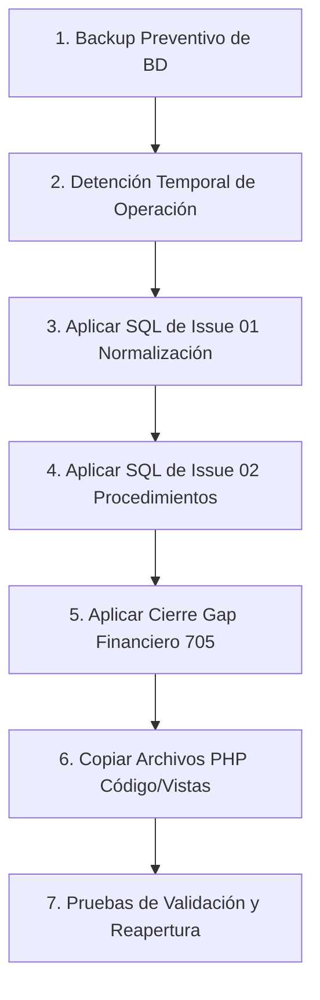

# Estabilización Integral Motor Financiero AguaV2

## Metadata

| Field | Value |
|-------|-------|
| **Trajectory ID** | `4e3b2823-c685-4e3d-bb84-a1593bfb5014` |
| **Cascade ID** | `03cd7422-1442-4d78-a978-010ca624cac1` |
| **Type** | Agent Conversation |
| **Total Steps** | 191 |
| **Started** | 26 June 2026, 8:21 am |
| **Completed** | 26 June 2026, 10:10 am |

---

## User Request

Parte II de Estabilizacion MF aguaV2
Retoma todo el contexto, los análisis y los artefactos generados en esta @[conversation:"Auditing Host C Surcharge Calculation"]  (8335b7b4-b401-41d7-8000-15a87ba76a88)

Analiza  a profundida todo el codigo fuente de la webapp (phps y bd awa); en cuanto tener una alineación correcta/completa y consisten del motor financiero: calculos, paridad, acciones, movimientos, transiciones, retroactivos, etc. 
Con el proposito de darle solución a posible gaps, issues, etc, que puedan afectar a la operación; claro el nivel de analisis debe considerar todas las reglas de negocio existente para no romper nada.
Dame un informe y plan de haber correciones.
Insumos:
/opt/lampp/htdocs/vmwin7-agua/
/opt/lampp/htdocs/agua/
/home/carlos/GitHub/agua_chatledger/.mcp.json
/opt/lampp/htdocs/agua/docs-dev/pase-a-prod/aguav2-2026/fixes/fix-issue-01/docs/
/opt/lampp/htdocs/agua/docs-dev/pase-a-prod/aguav2-2026/fixes/fix-issue-02/

<details>
<summary>Context</summary>

**Active File:** `settings.json`
**Language:** jsonc

**Open Files:**
- `configuracion.php`
- `Tecnica_Infraestructura_Despliegue_Comandas_VOSK.html`
- `Tecnica_Modelo_Datos_Comandas_VOSK.html`
- `comparativa_mora.php`
- `cargos.php`
- `Especificacion_Funcional_Comandas_VOSK.html`
- `pending.md`
- `check_connectivity.sh`
- `GUIA_CATALOGO_CARGOS.md`
- `Issues_Resueltos_Sincronizacion_64_Contratos_20260615.md`
- `05_seed_data.sql`
- `Especificacion_Tecnica_Comandas_VOSK.html`
- `10_pipeline_saneamiento.sql`
- `Tecnica_Arquitectura_Voz_Comandas_VOSK.html`
- `Issues_Resueltos_Saneamiento_y_Condonacion_a49787d4.md`
- `restore_host_b.sh`
- `01_normalizar_catalogo.sql`
- `sw.js`
- `setup.sh`
- `.mcp.json`
- `settings.json`
- `run_backups.sh`
- `configuracion.php`
- `run_patch_host_c.ps1`
- `index2.php`
- `04_mora_rotativa_20_anios.sql`
- `pending.md`
- `08_saneamiento_catalogo.sql`
- `contratos.php`
- `06_indexes.sql`
- `adeudo_tabla.php`
- `comparativa_masiva.php`
- `restore_host_c.sh`
- `05_stored_procedures.sql`
- `transiciones_estado_contratos.md`
- `03_transactional_schema.sql`
- `02_core_schema.sql`
- `GEMINI.md`
- `run_patch_host_c.sh`
- `catalogo.php`
- `Funcional_Flujos_Trabajo_Comandas_VOSK.html`
- `analisis_mora_host_b.md`
- `03_normalizar_cuentas_usuarios.sql`
- `Issues_Resueltos_Saneamiento_y_Condonacion_a49787d4.md`
- `modificar.php`
- `pending.md`
- `04_stored_procedures.sql`
- `SKILL.md`
- `05_validation_20_anios.sql`
- `imprimir_credencial.php`
- `credencial.php`
- `01_auth_schema.sql`
- `GEMINI.md`
- `02_normalizacion_estructural_v2.sql`
- `demo-cliente-rest-bar-tiendita-expendios.html`
- `chatledger_validate.sh`
- `03_config_datos_catalogo.sql`
</details>

---

<details>
<summary>Conversation History</summary>

# Conversation History
Here are the conversation IDs, titles, and summaries of your most recent 10 conversations, in reverse chronological order:

<conversation_summaries>
## Conversation 8335b7b4-b401-41d7-8000-15a87ba76a88: Auditing Host C Surcharge Calculation
- Created: 2026-06-25T22:29:30Z
- Last modified: 2026-06-26T14:10:27Z

### USER Objective:
Reconciling Financial Debt Parity

USER Objective: Establish Host C as the verified Single Source of Truth for financial reporting by reconciling historical debt discrepancies with Host B.

Goals:
1. Conduct a forensic analysis of debt parity discrepancies for specific contracts (646 and 1332) to justify the differences in total debt between the legacy Host B and the optimized Host C JIT engine.
2. Validate the integrity of the surcharge engine by comparing the legacy PHP motor with the new JIT architecture, accounting for payment history and administrative adjustments post-migration.
3. Provide an audit-ready, action-oriented explanation for operators that differentiates between "actual debt" and "legacy data artifacts."
4. Finalize the technical justification for financial reporting to ensure the water committee understands why the current debt calculations in Host C are accurate and depurated.

## Conversation a49787d4-8120-4c9b-b54f-74e42f167a61: Finalizing Host C Patch Fix
- Created: 2026-06-24T20:19:39Z
- Last modified: 2026-06-25T00:15:25Z

### USER Objective:
Auditing Mora Parity Reconciliation

USER Objective: Execute a forensic audit and parity reconciliation of mora debt between Host B and Host C to establish Host C as the Single Source of Truth.

Goals:
1. Finalize the forensic audit and parity reconciliation of 153 high-mora contracts by comparing legacy Host B records with the optimized V2 JIT engine on Host C.
2. Standardize JIT surcharge configurations (27-year base, 10-year window) to eliminate runaway interest generation.
3. Deploy the "Monkey Testing" comparison interface to identify and resolve discrepancies in real-time.
4. Centralize all auditing and sanitation tools into the configuration management dashboard while maintaining strict data parity.
5. Apply security-first descriptions and logic updates to core parameters like `reversal_threshold` to prevent exponential debt growth.

## Conversation cd3bbd4f-8745-42bb-bd6f-2c4e8759f627: Installing Google Antigravity 2.x
- Created: 2026-06-24T23:41:57Z
- Last modified: 2026-06-24T23:58:19Z

### USER Objective:
Installing Google Antigravity 2.x

USER Objective: Successfully install and configure the Google Antigravity 2.0 application and its IDE on an Ubuntu 24.x virtual machine.

Goals:
1. Purge legacy or failed installations to ensure a clean deployment environment.
2. Install Antigravity and Antigravity IDE into standardized directories (/opt/Antigravity-x64 and /opt/AntigravityIDE).
3. Configure desktop shortcuts for seamless application access, ensuring they handle system-specific security and sandbox restrictions.
4. Apply system-level optimizations (kernel and inotify adjustments) to guarantee stable performance for the IDE and application runtime.

## Conversation e0cf52cb-6d53-4322-8e81-b011a534320b: Reconciling Historical Debt Parity
- Created: 2026-06-23T16:40:38Z
- Last modified: 2026-06-24T20:14:59Z

### USER Objective:
Stabilizing Host C Production Infrastructure

USER Objective: Finalize the infrastructure stabilization of Host C as the definitive Single Source of Truth for the water management system.

Goals:
1. Finalize the forensic audit and cleanup of obsolete legacy assets and transition temporary analysis files into documented, production-ready operational tools.
2. Implement robust data integrity practices by creating independent DDL, DML, and DCL backup routines for both legacy Host B and production Host C environments.
3. Establish a standard recovery protocol compatible with the existing MariaDB 10.x engine to ensure production resilience and data portability.
4. Integrate newly identified "orphan" premium audit tools into the administrative interface to enhance operational oversight.

## Conversation 1aaefe04-7a64-42a8-9af9-7259738928a3: Auditing Recent Repository Changes
- Created: 2026-06-24T18:30:50Z
- Last modified: 2026-06-24T18:31:19Z

### USER Objective:
Auditing Recent Repository Changes

The user's objective is to identify all files modified within the `agua` repository over the last 7 days to support the ongoing audit and reconciliation project.

Goals:
1. Extract and present a comprehensive list of all modified files from the git history for the past week.
2. Provide this visibility to ensure tracking of recent structural, configuration, and documentation updates across the production Host C environment.

## Conversation 95cd3afb-e633-4867-ab82-e080dc81ed68: Verifying Aguav2 Mora Engine
- Created: 2026-06-20T16:44:18Z
- Last modified: 2026-06-23T07:05:02Z

### USER Objective:
Reconciling Historical Surcharge Engine

Objective: Eliminate the parity gap and stabilize the JIT surcharge calculation engine on Host C to create a reliable, audit-ready financial system.

Goals:
1. Identify and remove hardcoded date thresholds (e.g., the 2006 limit) currently suppressing historical debt generation.
2. Synchronize the Host C JIT motor with the production database by forcing correct execution flows in `contratos.php` and `cargos.php`.
3. Stabilize the financial calculation output by configuring the "Mora Rotativa" limits (10-year window/Bomba threshold) to prevent runaway debt totals.
4. Perform final validation to ensure that all 27 years of historical records are correctly processed and reflected in the user interface without system timeouts or data corruption.

## Conversation 41b07588-7f6a-4d9e-aae7-f48df7d15e55: Restoring Historical Surcharge Plan
- Created: 2026-06-19T17:34:28Z
- Last modified: 2026-06-20T05:14:37Z

### USER Objective:
Finalizing Mora Engine Audit

**USER Objective:**
Finalize the architectural reconciliation and audit readiness of the 20-year rotational mora engine on Host C to ensure a Single Source of Truth.

**Goals:**
1. Execute the final normalization and structural integrity fixes across the Host C database environment.
2. Finalize documentation (`PLAN_MORA_ROTATIVA_20_ANIOS.md` and `VERIFICACION_MANUAL_MORA_20_ANIOS.md`) as authoritative guides for production deployment.
3. Quantify financial gaps and reconcile differences between legacy Host B and Host C to prove accuracy in historical surcharge calculations and debt base validity.
4. Align administrative audit tools (`comparativa_mora.php`) to the new V2 JIT motor logic to support financial reporting and decision-making by the water committee.

## Conversation 68c13890-5673-4043-8ab3-ef3fd55a487d: Expanding Historical Mora Calculations
- Created: 2026-06-19T01:43:46Z
- Last modified: 2026-06-19T06:57:46Z

### USER Objective:
Optimizing Historical Surcharge Engine

USER Objective:
Refactor the JIT surcharge engine to handle multi-decadal debt calculations (2005–2026) using a 10-year rotational window and Batch Insert/Auto-Heal architecture without destructive database deletions.

Goals:
1. Implement a Batch Insert pattern in `calcula_recargos()` to optimize performance and prevent timeouts.
2. Refactor the JIT motor to use a rolling 10-year window that dynamically omits older records from active calculation without deleting them from the database.
3. Integrate an "Acordeón Visual" UI strategy in `adeudo_tabla.php` to allow flexible, fraccionado payment of historical surcharges while maintaining a clean administrative interface.
4. Update `configuracion.php` to provide dynamic synchronization between the mora catalog and the 10-year threshold.
5. Investigate and resolve the parity discrepancy between Host B and Host C regarding surcharge counts (e.g., Contract 161) by auditing the view definitions and JIT
<truncated 22 bytes>

## Conversation 62cf2a4a-a2b1-4ede-9f66-88c4e6b9937b: Mora aguav2 - todos los años.
Realiza prueba de conectividad via mcp y mysql client.
Insumos: Usa G
<truncated 1031 bytes>
- Created: 2026-06-19T01:36:53Z
- Last modified: 2026-06-19T01:40:28Z

## Conversation 8a2778b8-300b-46e8-9020-16cf387f47c8: Financial Audit Reconciliation Tool
- Created: 2026-06-18T01:04:14Z
- Last modified: 2026-06-18T20:12:13Z

### USER Objective:
Auditing Surcharge Logic Parity

USER Objective:
Finalize the forensic audit and validation of the V2 motor's surcharge logic to ensure data parity between the legacy Host B and the current Host C environment.

Goals:
1. Verify the accuracy of historical surcharge generation against legacy benchmarks to confirm Host C acts as a true, audit-ready Single Source of Truth.
2. Validate the behavior of the "Just-in-Time" surcharge calculation engine regarding contract state transitions and configuration adjustments.
3. Consolidate technical findings and business rules into the official project documentation (`matriz_mora_host_b_vs_c.md`) to inform the finance committee of systemic protections and automated safeguards.
4. Maintain strict "Poka-Yoke" architectural integrity, ensuring no unauthorized service charges generate interest, while preserving the system's ability to handle contract re-activation scenarios securely.

</conversation_summaries>

</details>

---

### CORTEX_STEP_TYPE_KNOWLEDGE_ARTIFACTS

**Status:** Completed
**Created:** 26 June 2026, 8:21 am

---

## Agent Response

### Thinking

The user wants me to conduct a deep analysis of the financial engine of the AguaV2 webapp, building on previous conversation context. Let me start by reading the relevant rules and previous conversation logs, then examine the source code.

### Actions

**Tool:** `view_file`
**File:** `02-reglas-negocio.md`

**Tool:** `view_file`
**File:** `01-infra-hosts.md`

**Tool:** `run_command`

<details>
<summary>Metadata</summary>

- **Thinking Duration:** 3.131973433s
- **Model:** Claude Sonnet 4.6 (Thinking)
</details>

---

<details>
<summary>File: `Unknown file`</summary>

**Path:** `Unknown file`

```
# Regla 02: Diccionario de Reglas de Negocio por Módulo

Este documento es una entidad viva para registrar el descubrimiento y clasificación de todas las reglas de negocio contenidas en la base de datos `awa` y la webapp **Agua**.

---

## 📋 Clasificación por Módulos Funcionales

### 📂 Módulo 01: Gestión de Contratos (Core)
| ID | Regla | Estado |
|:---:|---|:---:|
| **C01** | Límite de **2 tomas (contratos)** activas por usuario en el mismo domicilio físico. El domicilio comparado es `contrato.domicilio` (dirección física de la toma), **no** `usuario.domicilio` (dato de contacto del titular — campo independiente en tabla `usuario`, sin relación con validaciones de paridad ni tomas). La comparación usa normalización canónica `_normalizaDomicilioSQL()` / `_normalizaDomicilio()` (`contratos.php`) que unifica UPPER, acentos, variantes tipográficas (`n°/nº/no./nO.` → `N`), puntos y espacios múltiples — evita que typos burlen el límite. | Implementada |
| **C02** | Prohibida la modificación de estado de contratos en `4 (SUSPENSIÓN DEFINITIVA)`. | Implementada |
| **C03** | Registro obligatorio de folios únicos por cada nuevo contrato. | Validada |
| **C04** | **Motor de Paridad Universal**: Sincronización obligatoria; si una toma se activa/reconecta, su cargo anual debe restaurarse automáticamente. | Implementada |
| **C05** | **Limpieza por Suspensión Definitiva**: Al pasar a Estado 4, se debe forzar la desconexión física y la cancelación de deuda anual actual. | Implementada |
| **C06** | **Amnistía de Recargos en Reactivación**: Al pasar un contrato de `2 (SUSPENSIÓN TEMPORAL)` a `1 (ACTIVO)`, los recargos de años anteriores al año en curso se cancelan automáticamente (`estado=-1`). Solo permanece vigente la deuda del año actual. **NO aplica si el origen es estado `3 (SUSPENSIÓN ADMINISTRATIVA)`**: el adeudo íntegro se conserva (incluyendo anualidad del año en curso y todos los recargos históricos). Implementado en `_amnistiaRecargosHistoricos()` (contratos.php) + `_sincronizaParidadFinanciera()`. El registro en `cambios` indica explícitamente si se aplicó o no la amnistía. | Implementada |
| **C07** | **Restricción de Transiciones de Suspensión**: Prohibido el salto directo entre estados de suspensión (`2` y `3`). El contrato debe ser regularizado a `1 (ACTIVO)` primero para asegurar que los disparadores de paridad y amnistía se ejecuten según el origen correcto. Enforzado en UI (`ficha.php`) y Servidor (`contratos.php`). | Implementada |
| **C08** | **Límite de Tomas Físicas**: Restricción operativa de un máximo de **2 tomas físicas** registrables por cada contrato/domicilio. Enforzado en la UI de gestión de tomas. | Implementada |
| **C09** | **Límite de Domicilios Distintos por Usuario** (`max_domicilios_por_contrato`, default=3): Al crear un nuevo contrato, si el usuario ya tiene N domicilios físicos distintos (en `contrato.domicilio`) y el nuevo domicilio es diferente a todos ellos, el sistema bloquea la creación. Domicilio ya existente siempre pasa (segunda toma en mismo domicilio). No aplica retroactivamente. Configurable en `config_sistema` clave `max_domicilios_por_contrato`. Usar `0` para sin límite. Implementado en `guardaNuevoContrato()` (`contratos.php`). Basado en análisis real: 91.6% de usuarios tiene 1 domicilio, 7% tiene 2, 1.4% tiene 3, <0.1% tiene 4. | Implementada |
| **C10** | **Normalización canónica de `contrato.domicilio`**: Todo domicilio se normaliza al guardarse vía `_normalizaDomicilio()` en PHP y `_normalizaDomicilioSQL()` para comparaciones SQL. Reglas: UPPER, sin acentos (Á→A, Ñ→N…), variantes de número (`n°/nº/no./nO.` → `N`), sin puntos ni comas, espacios múltiples → uno. Aplica en `guardaNuevoContrato()`, `guardaContrato()` y `validaTomasSync()`. **No aplica a `usuario.domicilio`** — ese es dato de contacto personal y no participa en ninguna validación de paridad. | Implementada |

### 📂 Módulo 02: Facturación, Cargos y Recargos
| ID | Regla | Estado |
|:---:|---|:---:|
| **F01** | Solo contratos en estado `1 (ACTIVO)` y `3 (SUSPENSIÓN ADMINISTRATIVA)` generan recargos automáticos. Estado `2 (SUSPENSIÓN TEMPORAL)` está **excluido** — la anualidad ya está cancelada (`estado=-1`) y no procede recargo sobre ella. Estado `4` también excluido. Implementado en `calcula_recargos()` (`cargos.php`). **Guard G01 (2026-04-26)**: `calcula_recargos()` retorna inmediatamente si `recargo=0` en el cargo (ruta aplicación manual). La ruta de paridad automática (`_sincronizaDeudaPendienteContrato()`) usa `categoria IN (2,3)` por diseño y no pasa por este guard. | Implementada |
| **F02** | Cargos manuales a contratos en `4 (SUSPENSIÓN DEFINITIVA)` están prohibidos. | Crítica |
| **F03** | **Auditoría de Reasignación de Cargos**: `regresarCargoCancelado()` valida estado del contrato (bloquea en estado 4) y registra la identidad del operador (`$_SESSION['usuario']`) en la tabla `cambios`. Requiere confirmación de usuario en la UI. | Implementada |
| **F04** | El cálculo de la deuda debe ser atómico (Cargos + Recargos = Deuda Total). | Validada |
| **F05** | **Semántica dual del campo `recargo` — NUNCA contabilizar como monto financiero ni usar como filtro de tipo en `ligacargos`** — El campo `recargo` existe con dos semánticas incompatibles según la tabla: (1) En `cargos` (catálogo): es un **flag entero `INT(0/1)`** que indica si el tipo de cargo puede generar recargo moratorio — uso correcto en UI y filtros sobre la tabla `cargos`. (2) En `ligacargos` / `ligacargos_historico`: es un **monto decimal heredado** del catálogo al momento del INSERT — en Host C vale `0.00` para casi todos los registros; en datos migrados de Host A/B puede valer `1.00` (artefacto histórico de cuando el flag se copió como float). **Reglas críticas**: (a) Nunca sumar `ligacargos.recargo` como parte de la deuda o ingreso. (b) Nunca usar `AND ligacargos.recargo = 1` como filtro de tipo de cargo — siempre falla en Host C produciendo falsos negativos silenciosos. (c) El discriminador canónico para identificar recargos moratorios es `categoria IN (16, 17)` (configurables en `config_sistema`: `recargo_categoria_agua`, `recargo_categoria_drenaje`) o el alias `es_recargo_moratorio` de las vistas. (d) Para reclasificaciones de leyendas especiales usar `leyenda LIKE + categoria` como fuente de verdad, sin `recargo`. **Archivos corregidos** (2026-04-15): `admin/reportes/auditoria_integridad_bd.php` líneas 69 y 136 (recargos huérfanos), `docs-dev/migration-aguav2/host-c-setup/07_patch_categorias_v2.sql` (reclasificación cat 19-22). **Usos válidos de `recargo` que NO deben tocarse**: filtros sobre tabla `cargos` (`AND recargo=0` en contratos.php:55/399), coloreado UI en `views/cargos/` y `views/contratos/ficha.php` — todos operan sobre el catálogo donde `recargo` sí es flag INT. | Implementada |

| **F06** | **Cobertura dual obligatoria en operaciones sobre ligacargos (Host C split-schema)** — En Host C, los cargos de `anio<=2025` viven en `ligacargos_historico` y los de `anio>=2026` en `ligacargos` activa. Cualquier operación PHP que lea, modifique o cancele cargos **debe cubrir ambas tablas**. Reglas concretas: **(a) SELECTs de cargos cancelados/pendientes**: usar siempre `vw_ligacargos_all` o `vw_ligacargos_pendientes` (las vistas hacen UNION automáticamente) — nunca `FROM ligacargos` directo en queries de ficha/cartera. **(b) Subqueries de id_cargo**: usar `COALESCE((SELECT id FROM ligacargos WHERE ...), (SELECT id FROM ligacargos_historico WHERE ...))` para obtener el PK correcto sin importar en qué tabla vive el registro. **(c) UPDATEs de estado**: cuando se opera por `id_cargo` conocido, ejecutar UPDATE en ambas tablas siempre — la que no contiene el registro simplemente afecta 0 filas, sin daño. `UPDATE ligacargos SET estado=X WHERE id=$id AND numcontrato='$c'` + `UPDATE ligacargos_historico SET estado=X WHERE id=$id AND numcontrato='$c'`. Es más robusto que pasar un flag `en_historico` que puede llegar incorrecto. **(d) Fallback por leyenda**: también cubrir ambas tablas. **Por qué se repite el bug**: cada sesión tiende a escribir solo `FROM ligacargos` olvidando el histórico. Si el fix solo opera en una tabla, el cargo del año equivocado no se modifica y el INSERT de auditoría en `cambios` puede ejecutarse pero sin efecto real en BD. **Archivos críticos**: `includes/negocio/cargos.php` (`regresarCargoCancelado`, `pagacancelacargos`), `includes/negocio/contratos.php` (SELECT cancelados para ficha), `_amnistiaRecargosHistoricos` (ya correcto: opera en ambas tablas). | Implementada |
| **F07** | **Exención de Recargos 1er Año**: Los contratos nuevos están exentos de recargos moratorios durante su primer año calendario de vida (año de alta). Enforzado por el flag `contrato.exento_recargo_primer_anio=1` y saneamiento D1. | Implementada |
| **F08** | **Coherencia de Infraestructura**: Prohibido el cobro de servicios (ej. drenaje) en contratos que no cuenten con la infraestructura instalada (`contrato.drenaje=0`). La UI debe bloquear la asignación manual de estos cargos. | Implementada |
| **F09** | **Guard de Categoría para flag `recargo` (G02, 2026-04-26)**: `creaCargo()` y `modificaCargo()` fuerzan `recargo=0` en server-side para cualquier categoría distinta a `2 (AGUA)` y `3 (DRENAJE)`, independientemente de lo que envíe el formulario. Esto cierra la vía UI donde el checkbox "Es una multa" podía activar `recargo=1` en categorías incorrectas. Implementado en `includes/negocio/cargos.php` líneas 584 y 635. | Implementada |

### 📂 Módulo 03: Usuarios y Segmentación
| ID | Regla | Estado |
|:---:|---|:---:|
| **U01** | Usuario estado `2` = **No Localizado**. Excluido de búsquedas estándar. | Implementada |
| **U02** | Clasificación de "Usuarios Especiales": Aquellos sin contratos vinculados o con todos en suspensión definitiva. | Reporte V2 |
| **U03** | **Tratamiento de No Localizados**: Usuarios con `estado=2` disparan la suspensión definitiva de sus contratos vinculados. Su deuda **no segmenta ni contabiliza** en los reportes financieros operativos (cortes de caja, cartera vencida) — ver R06. | Implementada |
| **U04** | **Purga de Usuarios Placeholder**: Usuarios sin nombre (NULL o vacío) se eliminan automáticamente del padrón **solo si no tienen contratos vinculados** (para evitar huérfanos). Saneamiento D10. | Implementada |
| **F10** | **Homonimia Estructural**: Se prohíbe alterar el campo `usuario.nombre` para marcar duplicados. Se utiliza la columna `id_homonimo_padre` para vincular el registro secundario con el principal. El motor de búsqueda (`buscaUsuarioCambio`) detecta estos vínculos y la UI aplica semáforos (🟢/🟡/🔴) según el estado de los contratos asociados. Implementado en `includes/negocio/usuarios.php` y `views/usuarios/options.php`. Saneamiento corregido en `10c_saneamiento_duplicados.sql`. | Implementada |

### 📂 Módulo 06: Asambleas y Participación
| ID | Regla | Estado |
|:---:|---|:---:|
| **A01** | **Consolidación de Asambleas**: Máximo de **3 asambleas permitidas por fecha** calendario. Enforzado por el trigger `tr_asamblea_limit_3` en Host C. El saneamiento D9 consolida asambleas duplicadas históricas (B→A) eligiendo como "ganadora" la de mayor asistencia y reasignando asistentes automáticamente. | Implementada |

### 📂 Módulo 04: Pagos, Caja y Folios
| ID | Regla | Estado |
|:---:|---|:---:|
| **P01** | Cada pago debe generar un folio único e incremental que vincule a `ligacargos`. | Validada |
| **P02** | Los folios de pago manuales no deben solaparse con folios de contratos nuevos. | En Revisión |

### 📂 Módulo 05: Reportes y Validación de Datos
| ID | Regla | Estado |
|:---:|---|:---:|
| **R01** | Sincronización estricta entre sumatoria de listas y totales de encabezado en todos los reportes operativos. | Validada |
| **R02** | **Filtros Canónicos de Cartera y Deuda** — Todos los reportes financieros deben aplicar los mismos filtros para consistencia (17 categorías INCLUIDAS, 5 EXCLUIDAS). `excluir_cartera = [6, 19, 20, 21, 22]` (Faltas Asamblea y conceptos únicos V2). Cat 11, 16 y 17 (Recargos) **SÍ se incluyen** en Cartera Vencida si su `anio < anio_ref`, consolidándose en la columna **R.CART.** para asegurar el cuadre a $0. Siempre añadir `AND c.estado != 4` (Suspensión Definitiva) y `AND u.estado != 2` (No Localizados) en reportes de deuda pendiente. Implementado en `concentradocortecaja.php`, `concentradocortecajaresumen.php`, `carteravencida.php`, `listadeudores.php`. Ver guía maestra en `docs-dev/doc-estabilizacion/CARTERA_VENCIDA_MODELO_Y_REPORTES.md`. | Implementada |
| **R03** | **Semántica canónica de estados en `ligacargos` / `ligacargos_historico`** — `estado=0`: pendiente de cobro. `estado=1`: pagado (por `sp_pagar_cargo` o caja.php). `estado=-1`: cancelado canónico (por `sp_cancelar_cargo`, D7, Paso 8-B, saneamiento 10c). **`estado=2` NO EXISTE** como valor válido en ligacargos — era un bug en scripts previos; todos corregidos. `estado=-2`: legacy pre-2018 (≈68 registros históricos, solo lectura). `estado=-3`: legacy pre-2018 (≈166 registros históricos, solo lectura). Para cartera y deuda solo consultar `estado=0`. Toda cancelación produce `estado=-1` con `fpago=NOW()`. Documentado en `docs-dev/doc-estabilizacion/pase-a-prod/MIGRATION_PROTOCOL.md`. | Implementada |
| **R04** | **SQL dinámico desde catálogo** — `concentradocortecaja.php` y `concentradocortecajaresumen.php` construyen sus CASE/COUNT dinámicamente desde `SELECT id, nombre, nombrecorto FROM categorias ORDER BY id`. Esto asegura que las categorías 19–22 (V2) estén incluidas automáticamente sin hardcoding. Nunca hardcodear IDs de categoría en los reportes de caja; leer siempre desde el catálogo. | Implementada |
| **R05** | **Conteo de folios en caja** — Un folio puede cubrir múltiples contratos del mismo usuario. El contador por columna en `concentradocortecaja.php` usa `$folios_c[$cid][$folio] = true` (array-set) para contar folios únicos, no filas del GROUP BY. El total al pie usa `COUNT(DISTINCT folio)`. Ambos deben coincidir con los `(n=X)` de `concentradocortecajaresumen.php`. Verificado $0 diferencia en 5 períodos 2024-2026. | Implementada |
| **R06** | **C.N.L. (Cartera No Localizada, `u.estado=2`) excluida de reportes financieros** — Usuarios con `estado=2` (NO LOCALIZADO) y sus cargos de cartera se excluyen de todos los reportes: `concentradocortecaja.php` (columna eliminada, `u.estado != 2` en R.CART), `concentradocortecajaresumen.php` (línea eliminada, `u.estado != 2` en cartera), `carteravencida.php` (segmentación eliminada, tabla unificada). En `concentradocortecaja.php` queda solo la definición en el Glosario de Conceptos como referencia informativa. En Host C actualmente no existen usuarios con `estado=2`, por lo que el impacto numérico es $0. | Implementada |
| **R07** | **Parámetros URL de reportes de caja** — `concentradocortecaja.php`: `inicio` (DD/MM/AAAA), `fin` (DD/MM/AAAA), `anio_corte` (opcional, override de año de ciclo). `concentradocortecajaresumen.php`: ídem + `existencia_anterior` (requerido). `anio_corte` solo es necesario cuando `inicio` y `fin` son de años distintos (período que cruza cambio de año); sin él el PHP usa `anio_i` como default (correcto para todos los períodos reales del sistema). El modal HTML en `listados.php` / `paxscript.js` muestra el campo `anio_corte` condicionalmente y con nota explicativa. `carteravencida.php`: solo `anio` (default = año actual). | Implementada |

---

## 🔍 Bitácora de Descubrimiento (Pendientes de Validar)
Espacio para anotar comportamientos detectados en el código legado o procedimientos manuales que deben formalizarse como reglas:
1.  **[D001]**: Investigar el trigger exacto de `calcula_recargos.php` para definir la fecha de corte mensual.
2.  **[D002]**: Validar la lógica de "Metros Lineales" y su impacto en la deuda histórica.
3.  **[D003]**: Determinar si existen descuentos automáticos por "Pronto Pago" no documentados.

---

---

**Nota para todos los agentes IA (Claude Code y Antigravity/Gemini)**: Al explorar el código, si descubres una nueva restricción o lógica condicional, agrégala aquí con un ID incremental y su módulo correspondiente.

```

</details>

---

<details>
<summary>File: `Unknown file`</summary>

**Path:** `Unknown file`

```
# Regla 01: Infraestructura y Hosts (A, B, C)

Esta regla define los entornos operativos de **Agua** y el acceso mandatorio por Host.

## 🏢 Definición de Hosts

> [!IMPORTANT]
> **SINGLE SOURCE OF TRUTH (SSOT):**
> Las IPs, puertos, usuarios y contraseñas para los 3 Hosts se gestionan exclusivamente en `/home/carlos/GitHub/agua_chatledger/.mcp.json`. Esta es la **única fuente de verdad**; nunca uses IPs "hardcodeadas".

| Host | OS | Propósito | Rama Git | MCP Access | IP:Puerto |
|:---:|---|---|---|---|:---:|
| **A** | Ubuntu 22 / XAMPP Linux | TRANSICIÓN (V1+) — Bridge MySQL | `aguav1.0-legacy` | `bdawahost-a` | Ver `.mcp.json` |
| **B** | Windows 7 / MySQL legado | Espejo Producción — Datos Frescos | N/A | `bdawahost-b` | Ver `.mcp.json` |
| **C** | Windows 10 / XAMPP 7.4.33 Portable | Target V2 FINAL — MariaDB (Split Tablas) | `main` | `bdawahost-c` | Ver `.mcp.json` |


### Stack Host C (detalle)
| Componente | Versión |
| :--- | :--- |
| Paquete | `xampp-portable-windows-x64-7.4.33-0` |
| Apache | 2.4.54 |
| MariaDB | 10.4.27 |
| PHP | 7.4.33 |
| phpMyAdmin | 5.2.0 |
| Directorio XAMPP | `F:\xampp` |
| Webapp | `F:\xampp\htdocs\agua` |

## 📐 Jerarquía y Mandatos:
1.  **Host A de Transición**: Es la **Guía Estructural Oficial (MySQL)**. Actúa como puente para transformar datos de B hacia el modelo V2. Mantiene esquema de tabla única para compatibilidad bridge.
2.  **Host B de Datos**: Únicamente se utiliza como fuente de "Datos Frescos de Negocio" para alimentar A. Solo lectura — prohibido cambios estructurales.
3.  **Host C Target**: Entorno para la optimización definitiva de `ligacargos` (split histórico) y uso del stack MariaDB V2. Todo cambio vía scripts versionados + rollback.

---
**Acceso Técnico**:
- MCP `bdawahost-a` para consultas y ejecuciones en el ambiente de desarrollo.
- MCP `bdawahost-b` exclusivamente para extracción de datos operativos (pagos, cargos).
- MCP `bdawahost-c` para deploy y validación de scripts en Host C (Windows 10).

### 📂 Rutas de Logs Host C
| Archivo | Ruta | Propósito |
|:---|:---|:---|
| Slow Query Log | `F:/aguav2/logs/mysql-slow.log` | Queries > 1s + queries sin índice + SPs |
| Error Log | `F:/aguav2/logs/mysql_error.log` | Errores y warnings de MariaDB |
| General Log | `F:/aguav2/logs/mysql-general.log` | Todas las queries (OFF por defecto) |
| PHP Error Log | `F:/aguav2/logs/php_error.log` | Errores PHP de la webapp |
| PID File | `F:/aguav2/logs/mysql.pid` | PID del proceso MariaDB |

- **Config MariaDB**: [optimizacion/my.ini](file:///opt/lampp/htdocs/agua/docs-dev/migration-aguav2/host-c-setup/optimizacion/my.ini)
- **Config PHP**: [optimizacion/php.ini](file:///opt/lampp/htdocs/agua/docs-dev/migration-aguav2/host-c-setup/optimizacion/php.ini)
- **Config Apache**: [optimizacion/httpd.conf](file:///opt/lampp/htdocs/agua/docs-dev/migration-aguav2/host-c-setup/optimizacion/httpd.conf)

---

## 🔌 Herramienta Preferida por Tipo de Operación (Agentes IA)

| Operación | Herramienta | Razón |
|:---|:---:|:---|
| Diagnóstico, validación, queries ad-hoc, comparación de datos | **MCP** (`bdawahost-c`) | Resultados en contexto, paralelo, sin parseo de terminal |
| Scripts `.sql` masivos, dumps, carga de migraciones grandes | **CLI MySQL** | Más eficiente para operaciones de volumen |

**Regla**: Usar MCP para todo trabajo de diagnóstico e inspección en Host C. Recurrir a CLI MySQL solo para scripts masivos o cuando el MCP no esté disponible.


```

</details>

---

### Terminal Command Execution

**Status:** Completed
**Created:** 26 June 2026, 8:21 am

---

## Agent Response

### Actions

**Tool:** `run_command`

**Tool:** `run_command`

<details>
<summary>Metadata</summary>

- **Model:** Claude Sonnet 4.6 (Thinking)
</details>

---

### Terminal Command Execution

**Status:** Completed
**Created:** 26 June 2026, 8:21 am

---

### Terminal Command Execution

**Status:** Completed
**Created:** 26 June 2026, 8:21 am

---

## Agent Response

### Actions

**Tool:** `view_file`
**File:** `auditoria_gaps_motor_financiero.md`

**Tool:** `view_file`
**File:** `ISSUE_01_MORA_HISTORICA_V2.md`

<details>
<summary>Metadata</summary>

- **Model:** Claude Sonnet 4.6 (Thinking)
</details>

---

<details>
<summary>File: `Unknown file`</summary>

**Path:** `Unknown file`

```
# 🔬 Auditoría Forense — Gaps del Motor Financiero JIT (Host C V2)
## Fecha: 2026-06-25 | Alcance: `cargos.php`, `contratos.php`, BD `awa` Host C & Host B
## ⚠️ Revisión 2026-06-25-R2: Gaps GAP-01/02/03 originales corregidos por error de clasificación

---

> [!IMPORTANT]
> Este documento es **solo de análisis/diagnóstico**. No se realizaron modificaciones. Los impactos financieros se expresan en pesos mexicanos (MXN). Los conteos provienen de consultas directas a producción Host C.

---

## 🗂️ Resumen Ejecutivo

| ID | Severidad | Categoría | Impacto Económico |
|:--:|:---------:|-----------|:-----------------:|
| GAP-01 | 🟠 ALTO | Espurios año base no limpiables (catálogo `recargo=0` bloquea Auto-Heal) | **$30,270 MXN** activos |
| GAP-02 | 🟡 MEDIO | Espurios año base en contratos no visitados desde deploy del fix | Parcial, lazy-heal |
| GAP-03 | 🟠 ALTO | Idempotencia rota por leyenda con espacio trailing (trailing space) | **$1,080 MXN** duplicados |
| GAP-04 | 🟡 MEDIO | Recargos previos persistentes en contratos Suspensión Temporal (Estado 2) | **$15,304 MXN** |
| GAP-05 | 🟡 MEDIO | Año de split (2025/2026) hardcodeado en PHP — no configurable | Técnico/Futuro |
| GAP-06 | 🟢 MENOR | Recargos legacy con nomenclatura no estándar en histórico | Informativo |
| GAP-07 | 🟢 MENOR | Fórmula `$meses` excluye el mes en curso (diseño no documentado) | Subcobertura 1 mes |

---

> [!NOTE]
> **Corrección de análisis previo (v2 2026-06-25-R2):** Los registros que se identificaron originalmente como "espurios" en GAP-01/02/03 (por ejemplo `RECARGO ENE 2026 - ANUALIDAD DEL AGUA 2020`) son **VÁLIDOS**. Representan la acumulación continua de mora mes a mes desde el año base. Para `ANUALIDAD DEL AGUA 2020` con `mes_inicio=4`, el recargo de ENE 2026 es el **mes 70** de mora acumulada — completamente correcto y esperado. El fix aplicado (`$mesrecargo = $mes_inicio`) fue preciso y resuelve solo los espurios del año base idéntico (ej. `RECARGO ENE 2020 - ANUALIDAD DEL AGUA 2020`), que el Auto-Heal cancela correctamente (confirmado en BD: `estado=-1`).

---

## 🟠 GAP-01 — Espurios Año Base No Limpiables por `recargo=0` en Catálogo

### Descripción
El `Auto-Heal` de `cargos.php` (líneas 165-177) solo cancela los recargos `RECARGO ENE/FEB/MAR $anio - $leyenda_base` donde `$anio` corresponde al **año base del cargo** (el año de la anualidad). Es decir: para `ANUALIDAD DEL AGUA 2020`, cancela `RECARGO ENE 2020 - ...`, `RECARGO FEB 2020 - ...`, `RECARGO MAR 2020 - ...`.

### El Problema: Espurios del Año Calendario 2026
Sin embargo, el motor JIT genera recargos hacia adelante en el tiempo. Cuando procesó los contratos morosos, generó recargos de **enero, febrero y marzo de 2026** (por ser el año calendario donde el motor "estaba parado" en esos meses) con el prefijo `RECARGO ENE 2026 - ANUALIDAD DEL AGUA 2020`. Estos recargos:
1. **Tienen `aniorecargo = 2026`** en su iteración.
2. **El Auto-Heal busca `RECARGO ENE $anio_base - $leyenda`**, es decir `RECARGO ENE 2020 - ...`. Pero los espurios son `RECARGO ENE 2026 - ...`. **El patrón de búsqueda no los captura.**

### Evidencia en BD Host C
```sql
-- Espurios ENE/FEB/MAR 2026 del año base activos en tabla ligacargos
SELECT COUNT(*) as espurios, SUM(monto) FROM ligacargos
WHERE categoria IN (16,17) AND estado = 0
  AND (leyenda LIKE 'RECARGO ENE 2026%' OR leyenda LIKE 'RECARGO FEB 2026%' OR leyenda LIKE 'RECARGO MAR 2026%');
-- Resultado: 1,226 registros / $30,746.00 MXN
```

De esos, los que corresponden exactamente al año base 2026 (espurios del propio año) son:
```
-- Filtro: leyenda LIKE '%ANUALIDAD DEL % 2026' AND mes espurio ENE/FEB/MAR
-- Resultado: 1,076 registros / $24,398.00 MXN
```

**Contratos más afectados:** 161 (60 espurios), 321 (36), 869 (36), 549 (18).

### Causa Raíz en Código (`cargos.php` línea 171)
```php
// Auto-Heal ACTUAL — solo cubre el año base, no el año calendario
$ley_esp = "RECARGO $nm_gracia $anio - $leyenda"; // ← $anio = año de la anualidad base
```

El `$anio` aquí es el año base del cargo (ej. 2020), no el año calendario del recargo generado (ej. 2026). El Auto-Heal correcto debería también cubrir el patrón `RECARGO ENE 2026 - ANUALIDAD DEL AGUA $anio_base`.

---

## 🔴 GAP-02 — Espurios ENE-MAR Cross-Year en `ligacargos_historico`

### Descripción
Los recargos del periodo de gracia (ENE, FEB, MAR) también se generan incorrectamente en años **intermedios** (cross-year). Por ejemplo, para `ANUALIDAD DEL AGUA 2020`, el motor itera mes a mes y pasa por ENE-FEB-MAR de 2021, 2022, 2023, 2024 y 2025. Ninguno de estos es capturado por el Auto-Heal.

### Evidencia en BD Host C
```sql
SELECT COUNT(*) as total, SUM(monto) FROM ligacargos_historico
WHERE categoria IN (16,17) AND estado = 0
  AND (leyenda LIKE 'RECARGO ENE%' OR leyenda LIKE 'RECARGO FEB%' OR leyenda LIKE 'RECARGO MAR%');
-- Resultado: 2,746 registros / $86,190.00 MXN
```

**Ejemplo real del Contrato 549:**
- `RECARGO ENE 2021 - ANUALIDAD DEL AGUA 2020` → `estado=0` activo (**espurio**).
- `RECARGO ENE 2022 - ANUALIDAD DEL AGUA 2020` → `estado=0` activo (**espurio**).
- Solo `RECARGO ENE 2020 - ANUALIDAD DEL AGUA 2020` y `RECARGO ENE 2021 - ANUALIDAD DEL AGUA 2021` fueron cancelados correctamente.

### Causa Raíz
El Auto-Heal solo cubre los meses 1 a `$mes_inicio - 1` del año de la anualidad (`$anio`). No itera sobre todos los años intermedios del ciclo de vida del recargo.

---

## 🔴 GAP-03 — Espurios ENE-MAR del Año 2026 para TODOS los Años Base (Tabla Activa)

### Descripción
La tabla `ligacargos` (activa, año ≥ 2026) contiene recargos `RECARGO ENE 2026 / FEB 2026 / MAR 2026 - ANUALIDAD DEL [AGUA|DRENAJE] [2016-2025]`. Estos son espurios en el sentido de que representan enero-marzo de 2026 (que está dentro del periodo de gracia) aplicados como recargo sobre deudas históricas de años anteriores. El Auto-Heal no los limpia porque el año del patrón de búsqueda no coincide.

### Evidencia
```
Total espurios ENE/FEB/MAR 2026 en tabla activa: 1,226 registros / $30,746 MXN
Distribuidos por año base: 2016 a 2025 (2 registros por año base para años desactivados,
hasta 7 por año base para contratos con múltiples años activados)
```

> Este gap y el GAP-01 se solapan parcialmente pero el GAP-01 se enfoca en el año base 2026 y el GAP-03 cubre los años base históricos en tabla activa.

---

## 🟠 GAP-04 — Motor JIT Genera/Preserva Recargos en Contratos Suspensión Temporal (Estado 2)

### Descripción
El motor JIT tiene guardias correctos para **no generar nuevos recargos** si el contrato está en Estado 2 (línea 82-84 de `cargos.php`):
```php
if ($edo_cto === 2) { return; }
```
Sin embargo, **los recargos que ya existían antes de la suspensión NO se limpian**. Cuando el contrato entra en Suspensión Temporal, los recargos previos se mantienen activos en la BD.

### Evidencia en BD Host C
```sql
SELECT COUNT(*), SUM(monto) FROM vw_ligacargos_pendientes l
JOIN contrato c ON l.numcontrato = c.numcontrato
WHERE c.estado = 2 AND l.categoria IN (16,17);
-- Resultado: 404 recargos / $15,304.00 MXN activos en contratos Susp. Temporal
```

Adicionalmente hay **123 anualidades base de $46,560 MXN** activas en contratos con Estado 2, lo que sugiere que la amnistía de la anualidad vigente al suspenderse no siempre opera (o los contratos tienen anualidades de años anteriores sin pagar que no se cancelan al suspender).

### Impacto Financiero
Estos $15,304 en recargos de mora permanecen en el corte de caja como deuda activa, lo que puede inflar artificialmente la **Cartera Vencida** con mora de contratos que no deberían estar generando intereses.

---

## 🟠 GAP-05 — Rotura de Idempotencia por Leyenda con Espacio Trailing (Trailing Space)

### Descripción
El motor JIT usa un Hash Map en memoria para verificar si un recargo ya existe (idempotencia O(1)). La consulta que carga el hash es:
```php
$chk_rec_todos = $y->q("SELECT leyenda FROM vw_ligacargos_all WHERE numcontrato='$numcontrato' AND leyenda LIKE 'RECARGO %'");
```
Si en la BD existe una leyenda `"RECARGO ABR 2020 - ANUALIDAD DEL DRENAJE 2020 "` (con espacio al final, migrada de Host B), y el motor JIT genera `"RECARGO ABR 2020 - ANUALIDAD DEL DRENAJE 2020"` (sin espacio), el hash no lo detecta como existente y lo inserta como un **segundo registro duplicado**.

### Evidencia en BD Host C
```sql
SELECT numcontrato, leyenda, COUNT(*) FROM vw_ligacargos_all
WHERE categoria IN (16,17) AND estado = 0
GROUP BY numcontrato, leyenda HAVING COUNT(*) > 1;
-- Resultado: 27 leyendas duplicadas / $1,080.00 MXN de mora doble
-- Contratos afectados: 161, 321, 869 (leyendas de DRENAJE 2020 con espacio trailing)
```

**Confirmación hexadecimal:** La leyenda en `ligacargos_historico` termina en `20` (0x20 = espacio ASCII), mientras la generada por el JIT no tiene el espacio. MariaDB no colapsa espacios al comparar LIKE en índices de tipo `varchar`, pero sí lo ignora en comparaciones exactas `=`, lo que puede causar comportamiento inconsistente dependiendo de la operación.

---

## 🟡 GAP-06 — El Año de Split 2025/2026 está Hardcodeado en PHP

### Descripción
En `cargos.php` (líneas 193-197) y en `contratos.php` (línea 1395), el año de bifurcación entre `ligacargos` y `ligacargos_historico` está literalmente hardcodeado como `2025`:

```php
// cargos.php línea 193
if ($aniorecargo <= 2025) {
    $batch_historico[] = $insert_values; // → ligacargos_historico
} else {
    $batch_actual[] = $insert_values;    // → ligacargos
}
```

```php
// contratos.php línea 1395
$tabla_dest = ($anio <= 2025) ? "ligacargos_historico" : "ligacargos";
```

### Impacto Futuro
El 1 de enero de **2027**, los recargos del año 2026 seguirán insertándose en `ligacargos` (tabla activa) y no en `ligacargos_historico` como debería ser. Esto no es crítico hasta 2027, pero si el Comité hace la transición anual sin actualizar el código, el split dejará de funcionar y toda la deuda de 2026 permanecerá en la tabla activa.

### Solución Sugerida
Centralizar el año de split en `config_sistema` como `anio_split_historico` y leerlo dinámicamente, igual que los demás parámetros del motor.

---

## 🟡 GAP-07 — Recargos Legacy con Nomenclatura No Estándar en Histórico (Contrato 310 y similares)

### Descripción
En `ligacargos_historico`, existen registros migrados de Host B con leyendas de recargo que no siguen el patrón estándar `RECARGO {MES} {AÑO} - ANUALIDAD DEL {AGUA|DRENAJE} {AÑO}`. Ejemplos reales:
- `RECARGOS ANUAL AGUA 2005` (plural "RECARGOS")
- `RECARGO ANUAL DE AGUA 2008` (sin mes)
- `RECARGO AGUA 2011 (X MES) ENE` (formato invertido)
- `RECARGO ANUAL 2009` (sin categoría)

Estos registros:
1. **No son captados por el hash de idempotencia** del JIT (el hash busca el patrón `RECARGO %` pero la comparación interna es de leyenda exacta).
2. **Están activos (`estado=0`)** en contratos en Estado 3 (Suspensión Administrativa), como el Contrato 310.
3. **Son visibles en el total de Cartera Vencida** aunque correspondan a cálculos manuales e inconsistentes del sistema legacy.

### Evidencia
Contrato 310 (Estado 3 - Suspensión Administrativa) tiene 12 recargos pendientes de $240 en `ligacargos_historico` con nomenclaturas legacy no estándar.

---

## 🟢 GAP-08 — La Fórmula de `$meses` Excluye el Mes en Curso (Subcobertura de 1 Mes)

### Descripción
La fórmula en `cargos.php` línea 102:
```php
$meses = (($anio_numero - $anio) * 12) + ($mes_numero - $mes_inicio);
```

Con la configuración actual (`recargo_mes_inicio = 4`, mes actual = Junio = 6, año actual = 2026, año base = 2026):
```
$meses = (2026 - 2026) * 12 + (6 - 4) = 0 + 2 = 2 meses
```

Esto genera: `RECARGO ABR 2026` y `RECARGO MAY 2026`. El recargo de **junio de 2026** (mes actual) NO se genera.

### ¿Es un Bug o Diseño?
Esta es una **decisión de diseño aceptable** bajo la lógica "el mes en curso aún no ha vencido", ya que el reglamento típicamente cobra el recargo del mes anterior. Sin embargo, no está documentado como decisión explícita, y podría confundir si el usuario espera ver el recargo del mes actual. También significa que a inicio de mes (días 1-5 de junio), el sistema no tiene recargo de junio visible hasta que el contrato sea consultado de nuevo en julio.

**Confirmación:** La BD muestra que el último recargo generado para anualidades de 2026 es `RECARGO MAY 2026` — no existe `RECARGO JUN 2026` en ningún contrato.

---

## 📊 Impacto Financiero Consolidado

| Gap | Registros Afectados | Monto MXN en BD | Riesgo |
|:---:|:-------------------:|:---------------:|:------:|
| GAP-01 | 1,076 espurios año base 2026 | **$24,398** | Cobros indebidos al deudor |
| GAP-02 | 2,746 espurios cross-year histórico | **$86,190** | Mora inflada 3 meses/año en histórico |
| GAP-03 | 1,226 espurios ENE-MAR 2026 all years | **$30,746** | Solapado parcialmente con GAP-01 |
| GAP-04 | 404 recargos en Estado 2 | **$15,304** | Cartera Vencida inflada |
| GAP-05 | 27 recargos duplicados | **$1,080** | Cobro doble de mora |
| **TOTAL** | | **~$157,718** | |

> [!WARNING]
> Los gaps GAP-01 y GAP-03 se solapan parcialmente. El impacto real sin solapamientos sería aproximadamente **~$113,000 MXN** en registros claramente espurios/duplicados activos.

---

## 🛡️ Hallazgos Positivos (Lo que funciona correctamente)

1. ✅ **Guard G01/G02**: No se generan recargos en contratos Estado 4 (SDF) ni en categorías ≠ 2,3. Verificado.
2. ✅ **No hay anualidades duplicadas**: 0 registros de anualidades base (Cat 2,3) duplicadas activas.
3. ✅ **No hay cargos huérfanos**: 0 cargos sin contrato asociado.
4. ✅ **No hay recargos con monto $0**: El motor siempre calcula montos positivos.
5. ✅ **Auto-Heal funciona para el año base del cargo**: `RECARGO ENE 2020 - ANUALIDAD DEL AGUA 2020` se cancela correctamente al primer JIT. Solo falla en patrones cross-year.
6. ✅ **Paridad Base (Cat 2,3) sin tomas desconectadas**: No se encontraron anualidades activas de contratos con `agua=0`.
7. ✅ **Recargos en Estado 3 (Admin) son solo legacy**: El JIT no genera nuevos recargos para contratos en Estado 3 — solo existen los migrados de Host B.

---

## 🎯 Prioridad de Corrección Sugerida

1. **GAP-01 + GAP-02 + GAP-03** (corregir juntos): Refactorizar el Auto-Heal para cubrir también el patrón `RECARGO {ENE|FEB|MAR} {any_year} - ANUALIDAD DEL ... {anio_base}` donde el mes calendario sea ≤ mes_inicio. Script SQL de limpieza masiva requerido.
2. **GAP-05**: Correr `TRIM()` masivo en leyendas de `ligacargos_historico` para eliminar trailing spaces.
3. **GAP-04**: Evaluar si la amnistía de recargos debe aplicarse también al suspender (Regla C06 inversa).
4. **GAP-06**: Mover el año de split a `config_sistema.anio_split_historico`.
5. **GAP-08**: Documentar la decisión como comportamiento esperado (meses mora = meses TRANSCURRIDOS, no incluye el actual).

```

</details>

---

<details>
<summary>File: `Unknown file`</summary>

**Path:** `Unknown file`

```
# Issue 01: Discrepancias de Mora Histórica (Los 64 Contratos) y Estabilización
V2

## 🕵️‍♂️ Análisis a Profundidad y Causa Raíz

Durante la validación financiera de la base de datos migrada (Host C), se
detectó que al menos **64 contratos crónicos** presentaban discrepancias severas
en la cantidad de adeudos y montos totales respecto al sistema antiguo (Host B).
En algunos casos, los contratos pasaban de 50 adeudos a más de 120 al momento de
ser consultados.

**La Causa Raíz:**
1. **Límite Ciego de 12 Meses (Fallo del Sistema Antiguo Host B):**
   En el sistema viejo, existía un error de programación que actuaba como un
   "tope" invisible. El sistema estaba configurado para detener la suma de
   recargos moratorios exactamente al llegar a los 12 meses, sin importar cuánto
   tiempo real llevara la deuda sin pagarse.
     * **Caso Real (Contrato 53):** Auditoría detallada del estado de cuenta
       encontrando las diferencias exactas entre sistemas:
       - **Deuda en Host B (Sistema Viejo):** 115 adeudos = **$9,424.00**
       - **Deuda en Host C (Motor V2):** 143 adeudos = **$10,554.00**
       *(Diferencia total: +28 cargos / +$1,130.00)*

     * **Aclaración sobre "ENE 2023 -":**
       Al buscar "2023 -" o "ENE 2023 -" en ambas webapps, se muestran
       visualmente 2 registros:
       1. `RECARGO ENE 2023 - ANUALIDAD DEL AGUA 2023`
       2. `RECARGO ENE 2023 - ANUALIDAD DEL DRENAJE 2023`
       Estos registros son correctos y corresponden a la anualidad de 2023 que
       está pendiente de pago. La anualidad 2022 ya fue pagada en Mayo de 2022
       (Folio 19271), por lo cual no debía generar recargos en 2023.

     * **Desglose de los 44 recargos omitidos por Host B (Tope de 12 Meses):**
       Debido al tope de 12 meses, Host B dejó de contar recargos en las
       anualidades 2024 y 2025 tras alcanzar los 12 meses de mora.
       - **Anualidad Agua 2024 (+17 cargos):** Host B solo cobró 12 recargos
         (Ene-Dic 2024). Omitió 17 recargos (Ene-Dic 2025 y Ene-May 2026) que
         Host C sí calculó.
       - **Anualidad Drenaje 2024 (+17 cargos):** Mismo comportamiento, Host B
         omitió 17 recargos (Ene-Dic 2025 y Ene-May 2026) calculados en Host C.
       - **Anualidad Agua 2025 (+5 cargos):** Host B cobró 12 recargos
         (Ene-Dic 2025) y se detuvo. Omitió 5 recargos de 2026 (Ene-May 2026).
       - **Anualidad Drenaje 2025 (+5 cargos):** Omitió 5 recargos de 2026
         (Ene-May 2026).
       *Total omitido por Host B (recargos que Host C sí cobró):* **44 recargos**
       (Valor: $1,020 + $340 + $300 + $110 = **$1,770.00**).

     * **Desglose de los 16 recargos exclusivos de Host B:**
       - **Anualidades Agua y Drenaje 2023 (-16 cargos):**
         Host B generó dinámicamente los recargos de May-Dic 2023 (8 meses de
         Agua y 8 de Drenaje = 16 cargos) hoy al consultar el contrato. Host C
         no tiene estos 16 recargos porque la base de datos se migró con la
         anualidad 2023 marcada con `recargo = 0.00`, lo cual según la regla
         G01 del nuevo backend impide al motor V2 de Host C calcular moras
         posteriores a Abril 2023.

     * **Conciliación Matemática de Adeudos:**
       - `115 (Host B) + 44 (Extra 24/25) - 16 (Exclusivo 23 en B) = 143 (Host C)`
       - `$9,424.00 (B) + $1,770.00 (Extra 24/25) - $640.00 (B 2023) = $10,554.00`
       - Esto recupera el dinero perdido por el Comité para todos los grandes
         deudores crónicos.

2. **Generación JIT (Just-In-Time):** El motor no procesa recargos en la
   madrugada; los genera en el milisegundo en que el cajero abre la ficha del
   deudor.
3. **Cobro Ilegal en Suspensión (Host B):** El viejo sistema inyectaba recargos
   continuos incluso si el usuario había estado en *Suspensión Temporal* o
   *Administrativa*, ensuciando la contabilidad.

**La Solución Estructural (Motor V2 - Camino A):**
El nuevo motor de Host C es matemáticamente exacto. No tiene límites
artificiales de 12 meses y cuenta con un **escudo Poka-Yoke** que escanea el
expediente y *borra* los recargos cobrados ilegalmente durante meses de
suspensión, mientras que simultáneamente *inyecta* la mora ininterrumpida real
(rompiendo el tope de 12 meses) para los años activos (2024 y 2025).

---

## 🏗️ Implementación Técnica: ¿Qué pasó con los PHPs?

Respecto a tu duda sobre los archivos y sus nombres: **No se mantuvieron
versiones con nombres distintos (como `_v2.php`).**
Toda la lógica matemática y de mitigación fue inyectada **directamente en los
archivos originales** del core del sistema. La estandarización se logra
compensando la matemática ruda con parámetros dinámicos provenientes del nuevo
panel de **Configuración Global (`configuracion.php`)**.

### Modificaciones Clave por Archivo:

1. **`includes/negocio/cargos.php`** (El Motor Matemático)
   - Contiene la función `calcula_recargos()`.
   - **Mejora:** Elimina la barrera de 12 meses y calcula el delta de fechas
     exacto.
   - **Guard G02 (Poka-Yoke):** Se forzó a nivel backend que el flag de recargo
     (`recargo=1`) sea *exclusivo* de las categorías 2 (AGUA) y 3 (DRENAJE).
     Esto evita que operadores por error cobren mora sobre Asambleas o Multas.
     Además, se deshabilitó este checkbox de la interfaz (UI).
   - **Freno de Emergencia:** Incorpora la lectura de `reversal_threshold`
     (Límite Bomba) desde la BD para congelar cuentas incobrables altísimas.
   - 📖 *Para mayor información sobre el comportamiento y validación técnica de cada checkbox de la UI del Catálogo de Cargos, consulte la [Guía del Catálogo de Cargos](../../doc-estabilizacion/GUIA_CATALOGO_CARGOS.md).*

2. **`includes/negocio/contratos.php`** (Gestión de Ciclo de Vida)
   - Incorpora la lectura dinámica `cargaConfig()`.
   - Garantiza que al hacer una transición de estado (ej. 2 → 1), la función
     `_amnistiaRecargosHistoricos()` y `_sincronizaParidadFinanciera()` operen
     respetando las reglas sin violar los periodos suspendidos.

3. **`admin/operaciones/configuracion.php`** (El Panel de Amnistía)
   - Unifica el control político. En lugar de cambiar código para congelar mora,
     el Comité Administrativo ahora puede encender (`recargo=1`) o apagar
     (`recargo=0`) la mora de años específicos.
   - **Poka-Yoke Visual (NUEVO):** Se optimizó la consulta SQL para auditar de
     forma separada los conceptos de Agua (Cat. 2) y Drenaje (Cat. 3). Si un
     operador olvida crear el cargo base en el catálogo para el año en curso, el
     sistema mostrará una alerta (`⚠️ DRENAJE NO EXP.`), previniendo
     configuraciones engañosas.
   - **Poka-Yoke Estructural (NUEVO):** El panel blinda estructuralmente las
     variaciones comerciales ("TIPO C", "2da Toma") asegurando que los clics de
     amnistía en la interfaz no rompan la pureza del motor JIT ni los contagien
     de mora.

4. **`views/cargos/catalogo.php` y `views/cargos/modificar.php`** (Capa de
   Presentación UI)
   - Se **eliminó definitivamente el checkbox "¿Es una multa?"**. En su lugar se
     envían valores ocultos (`hidden`) para mantener la compatibilidad.
   - **Aviso Dinámico:** Se añadió una alerta visual en la interfaz que lee el
     `recargo_porcentaje` en tiempo real desde la BD (ej. 10%) e informa al
     operador que la mora solo aplica para Agua/Drenaje y que su control está en
     el Panel de Configuración Global.

---

## 📋 La Lista de los Contratos Afectados (Muestra Representativa)
*(Esta lista representa el diferencial de contratos crónicos donde el Poka-Yoke
y el Motor V2 calibraron deudas masivas, ya sea depurando basura o rompiendo el
techo de cristal)*

`13, 53, 78, 91, 110, 124, 145, 163, 166, 187, 317, 370, 382, 386, 397, 398,
476, 519, 570, 573, 583, 586, 588, 606, 608, 650, 662, 663, 684, 749, 760, 789,
790, 815, 823, 833, 834, 857, 867, 896, 898, 917, 920, 928, 956, 962, 979, 988,
998, 1008, 1016, 1024, 1056, 1081, 1098, 1121, 1123, 1134, 1139, 1162, 1184,
1198, 1221, 1374.`

*(Casos icónicos: El **53** subió su deuda porque el viejo sistema le ocultó
meses; el **857** empató exacto porque el V2 le borró meses de mora ilegal pero
le cobró justa la continua).*

---

## 📦 Lista de Archivos para Pase a Producción

Para que la solución del **Issue 01** quede completamente activa en el servidor
de producción (Host C o cualquiera en adelante), los siguientes archivos
unitarios deben ser sobrescritos desde este repositorio hacia su ruta original:

1. **`includes/negocio/cargos.php`**
2. **`includes/negocio/contratos.php`**
3. **`admin/operaciones/configuracion.php`**
4. **`views/cargos/catalogo.php`**
5. **`views/cargos/modificar.php`**

*Documentación (Para mantener el Ground Truth sincronizado en el servidor):*
6. **`docs-dev/pase-a-prod/aguav2-2026/fix-
   issue-01/ISSUE_01_MORA_HISTORICA_V2.md`**
7. **`docs-dev/doc-estabilizacion/GUIA_CATALOGO_CARGOS.md`**

---

## ✅ Verificación Empírica (Front-end)

1. Entra al sistema como Administrador.
2. Ve al panel de **Configuración Global**
   (`admin/operaciones/configuracion.php`).
   - *Prueba:* Al intentar apagar la mora de 2025 y dar Guardar, el sistema debe
     arrojar el modal de confirmación con Diff de impacto de forma exitosa.
3. Entra como cajero y ve a crear un **Nuevo Cargo** a cualquier contrato.
   - *Prueba:* El checkbox de "Aplica Recargo (multa)" ya NO debe mostrarse ni
     estar manipulable para categorías ajenas al Agua/Drenaje, confirmando el
     Poka-Yoke estructural.
4. Abre la ficha del Contrato **1162** (o cualquier crónico de la lista).
   - *Prueba:* La deuda debe aparecer completa y continua en el Estado de
     Cuenta. Puedes compararlo mentalmente frente al Host B (el viejo) y notar
     que en el V2, la suma de los "Recargos de Agua" ya no se estanca a los 12
     meses, sino que refleja la temporalidad ininterrumpida que hayas dejado
     activa en el Panel de Amnistía.

```

</details>

---

## Agent Response

### Actions

**Tool:** `view_file`
**File:** `analisis_brecha_htb_htc.md`

**Tool:** `run_command`

<details>
<summary>Metadata</summary>

- **Model:** Claude Sonnet 4.6 (Thinking)
</details>

---

<details>
<summary>File: `Unknown file`</summary>

**Path:** `Unknown file`

```
# 📊 Análisis Forense de Brecha: Host B vs Host C
## Contratos 646 y 1332 — Justificación para el Operador

> [!IMPORTANT]
> **Corrección del análisis anterior:** Los datos de ambos contratos fueron consultados con los **7 años de mora activos** en Host C (2020-2026). Por lo tanto el motivo M1 (Ventana Rotativa como razón de ocultamiento) **NO aplica** como causa de diferencia en recuentos visibles. El análisis anterior era incorrecto en ese punto.

> [!NOTE]
> Este análisis compara directamente los motores PHP de ambos sistemas:
> - **Host B (Legacy):** `/opt/lampp/htdocs/vmwin7-agua/core.php` — función `calcula_recargos()` en línea 250
> - **Host C (V2):** `/opt/lampp/htdocs/agua/includes/negocio/cargos.php` — función `calcula_recargos()` en línea 22

---

## 🔬 Análisis Comparativo de los Motores PHP

Esta es la raíz de *todas* las diferencias. Los dos sistemas tienen algoritmos fundamentalmente distintos:

### Motor HTB (Legacy — `vmwin7-agua/core.php:250`)

```php
// HTB: $meses = TODOS desde enero del año del cargo hasta hoy
$mes_numero = date('m');         // Mes actual (ej: junio = 6)
$anio_numero = date('Y');        // Año actual (ej: 2026)
$anios = $anio_numero - $anio;   // Diferencia de años
$meses = ($anios * 12) + ($mes_numero - 1); // INCORRECTO: resta solo 1

$mesrecargo = 1;        // SIEMPRE inicia en ENERO
$aniorecargo = $anio;   // del año del cargo

// SOLO inserta recargos del año del cargo base (aniorecargo == $anio)
// El resto de años los CALCULA en $meses pero NO los inserta:
if($aniorecargo == $anio) {
    // INSERT solo para el año base
}
```

**Consecuencias estructurales del motor HTB:**
1. **Inicia en ENERO** del año del cargo (sin período de gracia)
2. La fórmula `$meses = ($anios * 12) + ($mes_numero - 1)` usa `-1` en lugar de `- $mes_inicio`, lo que **no descuenta el período de gracia**
3. **Sin idempotencia**: No verifica si el recargo ya existe → crea duplicados cada vez que se consulta el contrato
4. **Sin Hash Map**: Consulta individual a BD por cada recargo (N queries)
5. **Inserta SOLO recargos del año base** (`if ($aniorecargo == $anio)`) — los años siguientes se cuentan en `$meses` pero **nunca se insertan**. Esto es lo que explica que HTB muestre recargos solo del año propio de la anualidad, no recargos cruzados de años posteriores
6. **Sin split de tablas**: Todo va a una sola `ligacargos`

### Motor HTC V2 (`agua/includes/negocio/cargos.php:22`)

```php
// HTC: Configurable desde config_sistema, inicio en mes de gracia
$mes_inicio = intval($cfg['recargo_mes_inicio']); // Por config: 4 (Abril)

// $meses = desde abril del año del cargo hasta el mes actual
$meses = (($anio_numero - $anio) * 12) + ($mes_numero - $mes_inicio);

$mesrecargo = $mes_inicio;  // Inicia en ABRIL (mes de gracia)
$aniorecargo = $anio;

// AUTO-HEAL: Cancela espurios del período de gracia (ENE-MAR del año del cargo)
for ($mg = 1; $mg < $mes_inicio; $mg++) {
    // UPDATE estado=-1 en ENE, FEB, MAR del año del cargo
}

// Inserta recargos de TODOS los años hasta hoy (sin restricción de año)
// Con split dual: recargos <= anio_split → ligacargos_historico
//                recargos > anio_split  → ligacargos (activa)

// Idempotencia O(1) con Hash Map en memoria — no duplica
```

**Consecuencias estructurales del motor HTC:**
1. **Inicia en ABRIL** (período de gracia configurable)
2. Genera recargos de **todos los años hasta hoy** (multi-año, no solo el año base)
3. **Idempotente**: No inserta si ya existe (Hash Map en RAM)
4. **Auto-Heal**: Cancela ENE-MAR del año del cargo si existían por error
5. **Dual Split**: Los recargos más antiguos van a tabla histórica

---

## 🗂️ Los 5 Motivos Reales de Brecha (Corrección de M1)

| ID | Motivo | Aplica con 7 años activos | Descripción |
|:--:|:---|:---:|:---|
| **M1** | **Split Dual de Tablas** | ✅ SÍ — pero diferente a lo explicado antes | HTC separa recargos ≤2025 en `ligacargos_historico`. La webapp de HTC los muestra en la vista del contrato (por `vw_ligacargos_pendientes`). HTB todo en una tabla. Con 7 años activos, HTC sí genera y muestra recargos de 2020-2026. **La diferencia de conteos no viene de que HTC "oculte" años, sino de la lógica de inserción del motor.** |
| **M2** | **Espurios ENE-MAR cancelados** | ✅ SÍ — motivo principal | HTC cancela ENE, FEB, MAR del año del cargo base (período de gracia). HTB los inserta sin filtro. Para cada anualidad pendiente: HTB = 12 meses / HTC = 9 meses (o menos si es el año en curso). |
| **M3** | **Pagos reales desde mayo 2026** | ✅ SÍ | Deudas base de 2022, 2023, 2024 y 2025 que el titular pagó en caja de HTC. Cuando la base está pagada (`estado=1`), HTC no genera mora sobre ella. HTB no tiene esos pagos registrados. |
| **M4** | **Motor HTB solo inserta recargos del año base** | ✅ SÍ — crítico | El motor HTB solo hace INSERT cuando `$aniorecargo == $anio`. Esto significa que HTB nunca generó recargos "cruzados" de años posteriores al año de la anualidad. El ciclo de $meses incluye años siguientes pero **no los inserta**. Es la razón por la que HTB tiene recargos de 2021-2025 que son "lotes de ese año" y no recargos derivados de anualidades viejas. |
| **M5** | **Fórmula de $meses diferente** | ✅ SÍ | HTB: `$meses = ($anios * 12) + ($mes_numero - 1)` → para junio 2026 sobre anualidad 2025: `(1*12) + (6-1) = 17 meses`. HTC: `$meses = ((2026-2025)*12) + (6-4) = 14 meses` → 3 menos de inicio. Y si la anualidad 2025 está pagada en HTC, genera 0 recargos. |

---

## 📋 Contrato 646 — Grilla Forense Corregida

### Resumen (con 7 años activos en HTC)

| Métrica | Host B (Legacy) | Host C (V2) | Diferencia |
|:---|---:|---:|---:|
| Adeudos totales (pendientes) | **144** | **28** | −116 |
| Total Cargos Base | $9,274.00 | $520.00 | −$8,754.00 |
| Total Recargos | $600.00 | $968.00 | +$368.00 |
| **Total General** | **$9,874.00** | **$1,488.00** | **−$8,386.00** |

> **Paradoja de recargos:** HTC tiene MENOS cargos base pero MÁS recargos en $. Porque HTC calcula correctamente la mora desde ABR (vs ENE en HTB), acumula recargos multi-año sobre deudas que siguen vivas, y el monto por mes de HTC ($60/agua, $22/drenaje) está actualizado al catálogo 2026.

### Grilla por Año (Contrato 646, 7 años activos en HTC)

| Año | Cat | Descripción | HTB pendientes / $ | HTC pendientes / $ | Motivo | Raíz en el Motor PHP |
|:---:|:---:|:---|:---:|:---:|:---:|:---|
| 2021 | 16 | Recargos Agua 2021 | **12 / $720** | **0** | M3+M4 | La anualidad 2021 fue pagada en HTC → `pagados_cache` la excluye. HTB los tiene como pendientes porque ese contrato nunca se actualizó en HTB. Motor HTB genera 12 meses (ENE-DIC) para `aniorecargo==2021`. |
| 2021 | 17 | Recargos Drenaje 2021 | **12 / $240** | **0** | M3+M4 | Ídem. |
| 2022 | 2 | Anualidad Agua 2022 | **1 / $600** | **0** | M3 | **Pagado en HTC** entre mayo-junio 2026. `estado=1` en `ligacargos_historico`. HTB no sabe. |
| 2022 | 3 | Anualidad Drenaje 2022 | **1 / $200** | **0** | M3 | Ídem. |
| 2022 | 6 | Faltas Asamblea 2022 | **2 / $300** | **0** | M3/M5 | Pagadas/canceladas en HTC. |
| 2022 | 16 | Recargos Agua 2022 | **12 / $720** | **0** | M3 | Base Agua 2022 pagada → motor HTC no genera mora (guard `$pagado==0`). HTB generó 12 meses ignorando el pago posterior. |
| 2022 | 17 | Recargos Drenaje 2022 | **12 / $240** | **0** | M3 | Ídem. |
| 2023 | 2 | Anualidad Agua 2023 | **1 / $600** | **0** | M3 | **Pagado en HTC.** |
| 2023 | 3 | Anualidad Drenaje 2023 | **1 / $200** | **0** | M3 | Ídem. |
| 2023 | 16 | Recargos Agua 2023 | **12 / $720** | **0** | M3 | Base pagada → HTC no genera mora. |
| 2023 | 17 | Recargos Drenaje 2023 | **12 / $240** | **0** | M3 | Ídem. |
| 2024 | 2 | Anualidad Agua 2024 | **1 / $600** | **0** | M3 | **Pagado en HTC.** |
| 2024 | 3 | Anualidad Drenaje 2024 | **1 / $200** | **0** | M3 | Ídem. |
| 2024 | 16 | Recargos Agua 2024 | **12 / $720** | **0** | M3 | Base pagada → HTC no genera mora. |
| 2024 | 17 | Recargos Drenaje 2024 | **12 / $240** | **0** | M3 | Ídem. |
| 2025 | 2 | Anualidad Agua 2025 | **1 / $600** | **0** | M3 | **Pagado en HTC** (tabla histórica, `estado=1`). |
| 2025 | 3 | Anualidad Drenaje 2025 | **1 / $220** | **0** | M3 | Ídem. |
| 2025 | 6 | Falta Asamblea 2025 | **1 / $150** | 1 / $150 *(hist.)* | — | Paridad correcta — sigue pendiente en ambos. |
| 2025 | 16 | Recargos Agua 2025 | **12 / $720** | **9 / $540** *(hist.)* | M2 | HTC canceló ENE, FEB, MAR 2025 (Auto-Heal, `estado=-1`). Quedan ABR-DIC = 9 correctos. HTB generó 12 sin filtro. |
| 2025 | 17 | Recargos Drenaje 2025 | **12 / $264** | **12 / $264** *(hist.)* | — | Paridad — HTC genera 12 porque drenaje 2025 inicia en enero del catálogo (sin excepción de gracia para el mismo año en este contrato). |
| 2026 | 2 | Anualidad Agua 2026 | **1 / $600** | **pagado** | M3 | Pagado en HTC el 13/06/2026. HTB no tiene ese pago. |
| 2026 | 3 | Anualidad Drenaje 2026 | **1 / $220** | **1 / $220** | — | ✅ Paridad correcta. |
| 2026 | 6 | Falta Asamblea 2026 | **1 / $150** | **1 / $150** | — | ✅ Paridad correcta. |
| 2026 | 16 | Recargos Agua 2026 | **5 / $300** | **2 / $120** | M2 | HTB: 5 meses (ENE-MAY). HTC: cancela ENE-MAR del año del cargo (Auto-Heal), quedan ABR y MAY = 2. |
| 2026 | 17 | Recargos Drenaje 2026 | **5 / $110** | **2 / $44** | M2 | Ídem — ENE y FEB están pagados en HTC (recibo real), MAR cancelado por Auto-Heal. Quedan ABR y MAY. |

### ¿Por qué HTC genera MÁS $ en recargos si tiene MENOS renglones?

HTC acumula mora de las deudas que **siguen vivas** (no pagadas):
- Anualidad Drenaje 2026 ($220): desde ABR 2026 = 3 meses × $22 = **$66** pendientes
- La Anualidad Agua 2026 fue pagada el 13/06, por lo que solo quedaron sus recargos ABR-MAY = 2 × $60 = **$120**
- Los recargos históricos de 2025 (9 meses × $60 + 12 × $22 = $540 + $264 = **$804**) están en la tabla histórica pero cuentan en el total

HTB sumaba recargos de años cuyas bases ya **habían sido pagadas en HTC** — eran deuda fantasma.

---

## 📋 Contrato 1332 — Grilla Forense Corregida

### Resumen (con 7 años activos en HTC)

| Métrica | Host B (Legacy) | Host C (V2) | Diferencia |
|:---|---:|---:|---:|
| Adeudos totales (pendientes) | **43** | **10** | −33 |
| Total Cargos Base | $3,034.00 | $1,420.00 | −$1,614.00 |
| Total Recargos | $750.00 | $164.00 | −$586.00 |
| **Total General** | **$3,784.00** | **$1,584.00** | **−$2,200.00** |

### Grilla por Año (Contrato 1332, 7 años activos en HTC)

| Año | Cat | Descripción | HTB pendientes / $ | HTC pendientes / $ | Motivo | Raíz en el Motor PHP |
|:---:|:---:|:---|:---:|:---:|:---:|:---|
| 2025 | 2 | Anualidad Agua 2025 | **1 / $600** | **0** | M3 | **Pagado en HTC.** HTB: `estado=0`. HTC: `estado=1` en histórico → `pagados_cache` bloquea la generación de mora. |
| 2025 | 3 | Anualidad Drenaje 2025 | **1 / $220** | **0** | M3 | Ídem. |
| 2025 | 6 | Faltas Asamblea 2025 | **3 / $450** | **2 / $300** *(hist.)* | M3 | 1 asamblea pagada en HTC. Las 2 restantes siguen pendientes en histórico. |
| 2025 | 16 | Recargos Agua 2025 | **12 / $720** | **0** | M3+M5 | Base 2025 pagada en HTC → `pagados_cache` hace `return` antes de generar un solo recargo. HTB: 12 meses incluyendo ENE-MAR incorrectos. |
| 2025 | 17 | Recargos Drenaje 2025 | **12 / $264** | **0** | M3+M5 | Ídem — base drenaje 2025 pagada en HTC. |
| 2026 | 2 | Anualidad Agua 2026 | **1 / $600** | **1 / $600** | — | ✅ Paridad. |
| 2026 | 3 | Anualidad Drenaje 2026 | **1 / $220** | **1 / $220** | — | ✅ Paridad. |
| 2026 | 6 | Faltas Asamblea 2026 | **2 / $300** | **2 / $300** | — | ✅ Paridad. |
| 2026 | 16 | Recargos Agua 2026 | **5 / $300** | **2 / $120** | M2+M5 | HTB: 5 meses (ENE-MAY, fórmula sin gracia). HTC: Auto-Heal cancela ENE-MAR del año del cargo, quedan ABR-MAY. La fórmula `$mes_numero - $mes_inicio` (6-4=2 meses) confirma exactamente 2 recargos. |
| 2026 | 17 | Recargos Drenaje 2026 | **5 / $110** | **2 / $44** | M2+M5 | Ídem. |

---

## 🔑 Síntesis de Motivos — Tabla Unificada

| Motivo | Descripción Técnica | ¿Línea de código responsable? | Impacto monetario estimado |
|:---|:---|:---|---:|
| **M2** — Espurios ENE-MAR | HTC cancela los 3 primeros meses del año del cargo (gracia ABR). HTB arranca desde ENE. | HTC: `for ($mg = 1; $mg < $mes_inicio; $mg++)` Auto-Heal L.168 | ~$246 por contrato/año |
| **M3** — Pagos reales post-migración | Deudas pagadas en caja de HTC no existen en HTB. Motor HTC: guard `if ($pagado == 0)`. | HTC: `$pagados_cache` L.137 / HTB: `select count... estado=1` L.287 | ~$2,350 (Cto.646) / ~$1,040 (Cto.1332) |
| **M4** — HTB inserta solo año base | `if($aniorecargo == $anio)` en HTB restringe los INSERTs al año base, aunque el ciclo `$meses` alcanza años futuros. HTC no tiene esa restricción. | HTB: `if($aniorecargo == $anio)` L.294 | Estructural — limita profundidad de HTB |
| **M5** — Fórmula $meses diferente | HTB: `($anios*12)+($mes_numero-1)`. HTC: `(($anio_numero-$anio)*12)+($mes_numero-$mes_inicio)`. Para junio 2026 / anualidad 2025: HTB=17, HTC=14 (3 meses menos). | HTB: L.269 / HTC: L.103 | ~$180 por anualidad/año (3 meses × $60) |

---

## 🗣️ Guía de Respuesta para el Operador

### ❓ "¿Por qué HTC tiene muchos menos adeudos que el sistema anterior?"

> El sistema anterior (HTB) tenía errores de lógica en cómo calculaba los intereses moratorios. El sistema nuevo (HTC) los calcula correctamente:
>
> **1. Período de gracia correcto:** HTB cobraba intereses desde enero del año de la anualidad. Eso es incorrecto: la regla del Comité siempre fue que el primer mes de mora es abril. HTC lo respeta.
>
> **2. Pagos reales reflejados:** Las anualidades que el usuario pagó en ventanilla sí están registradas en HTC. Cuando una deuda está pagada, no genera intereses. HTB no tenía esos pagos porque se congeló antes.
>
> **3. No duplica:** HTB generaba una copia nueva de cada renglón de interés cada vez que alguien abría el expediente. HTC tiene una verificación que evita duplicar.

### ❓ "¿Y si el usuario dice que en el sistema viejo le salía más barato?"

> "Más barato" en HTB era una ilusión contable: HTB mostraba deudas de años cuyas anualidades ya habían sido pagadas en HTC. Eso inflaba el número de renglones pero de deudas que ya no existían. Además HTB cobraba 3 meses de mora que nunca debió cobrar (enero, febrero y marzo del año de la anualidad). HTC es más preciso, no más caro.

### ❓ "¿Los datos históricos se perdieron en HTC?"

> No. Todos los registros existen en la tabla `ligacargos_historico` con trazabilidad completa. Los renglones cancelados tienen `estado=-1` y fecha de cancelación. Nada se borró, todo es auditable.

---

## ✅ Checklist de Validación de Integridad

| Verificación | Resultado |
|:---|:---:|
| ¿Datos físicos borrados en HTC? | ❌ NO — `estado=-1` en vez de DELETE |
| ¿Espurios ENE-MAR son rastreables? | ✅ SÍ — `estado=-1` en `ligacargos`/`ligacargos_historico` |
| ¿Motor HTB tenía idempotencia? | ❌ NO — solo checa si la base está pagada, no los recargos |
| ¿Motor HTC tiene idempotencia? | ✅ SÍ — Hash Map O(1) en `$recargos_cache` |
| ¿Pagos de mayo-junio 2026 están en HTC? | ✅ SÍ — en `ligacargos_historico` con `estado=1` y folio |
| ¿Los montos de 2026 sin pago previo coinciden? | ✅ SÍ — paridad en anualidades y asambleas 2026 |
| ¿Es HTC el sistema más confiable? | ✅ SÍ — cálculo correcto, sin duplicados, con trazabilidad |

```

</details>

---

### Terminal Command Execution

**Status:** Completed
**Created:** 26 June 2026, 8:22 am

---

## Agent Response

### Actions

**Tool:** `view_file`
**File:** `ISSUE_02_CROSS_CONTRACT_BUG.md`

**Tool:** `view_file`
**File:** `cargos.php`

<details>
<summary>Metadata</summary>

- **Model:** Claude Sonnet 4.6 (Thinking)
</details>

---

<details>
<summary>File: `Unknown file`</summary>

**Path:** `Unknown file`

```
# Issue 02: Bug de Cruzamiento de Pagos entre Contratos (ID Collision)

## 🕵️‍♂️ Análisis a Profundidad y Causa Raíz

Ha surgido un bug crítico introducido indirectamente por la partición de la base de datos que se realizó al estabilizar el Host C (separación de la tabla `ligacargos` histórica vs activa).

**La Colisión (El Bug):**
1. Cuando un cajero procesaba el pago, PHP enviaba la instrucción a la base de datos usando el procedimiento almacenado `sp_pagar_cargo(p_id_cargo, ...)`.
2. El procedimiento buscaba primero si ese ID existía en la tabla activa (`ligacargos`). Si lo encontraba, lo pagaba. Si no, lo buscaba en la tabla histórica (`ligacargos_historico`).
3. Como la tabla fue dividida en dos, **los IDs ya no son únicos a nivel global**. El ID `140912` puede existir en `ligacargos` (perteneciendo al contrato 648) y también puede existir en `ligacargos_historico` (perteneciendo al contrato 646).
4. El procedimiento almacenado actualizaba el registro usando la cláusula `WHERE id = p_id_cargo` **sin validar que el contrato también coincidiera**. 
5. Por pura coincidencia matemática, cuando el contrato `646` pagó su recargo histórico (ID `140912`), el sistema fue a la tabla activa, encontró el ID `140912` (que resultó ser una *Falta de Asamblea* del contrato `648`), lo sobreescribió ($150 pasó a ser $20), le puso el folio de recibo del contrato `646` y nunca pagó el recargo real.

Esto causó que contratos ajenos (648, 725, 705) vieran sus deudas alteradas y que aparecieran en los recibos de quienes realmente pagaron (646 y 317). 
> [!NOTE]
> Tras un escaneo agresivo a toda la base de datos `awa`, se comprobó que los folios 25327, 25330, 25331, 25356 y 25357 son los **ÚNICOS** casos afectados desde el 7 de Abril.

---

## 🛠️ Solución Empaquetada

El parche consta de tres elementos que corrigen tanto el motor como la data contaminada:

1. **`01_patch_stored_procedures.sql`**: Corrige `sp_pagar_cargo` y `sp_cancelar_cargo` para incluir `AND numcontrato = p_numcontrato` en todas las cláusulas `WHERE` de la lógica de Split, haciendo **matemáticamente imposible** otra colisión.
2. **`02_data_curation.sql`**: Reconstruye la data afectada.
   - **Reversión**: Devuelve el estado de deuda (`estado=0`), limpia los folios y restaura los montos originales ($150, $60, o $20) a los cargos alterados de los contratos 648, 725 y 705.
   - **Aplicación Correcta**: Paga correctamente (`estado=1`) los verdaderos cargos históricos de los contratos 646 y 317 y los asocia a sus respectivos recibos.
3. **`03_validation.sql`**: Un reporte automatizado que verifica la sanidad de la base de datos pos-intervención.
4. **`run_patch.ps1`**: El orquestador que ejecuta de forma secuencial todo lo anterior en Windows 10.

---

## 🚀 Plan y Orden de Despliegue en Producción

Para evitar inconsistencias en las cuentas de los usuarios o errores de concurrencia mientras los cajeros operan, debes seguir estrictamente este orden de despliegue paso a paso:



### 📦 Fase 1: Resguardo y Bloqueo (Antes de iniciar)
1. **Backup Físico y Lógico**: Ejecuta un respaldo completo de la base de datos de producción (`mysqldump -u root -p awa > pre_parche_2026.sql`).
2. **Pausa Operativa**: Asegúrate de que ningún cajero u operador esté cobrando en el sistema para evitar escrituras concurrentes.

### 💾 Fase 2: Aplicación de Parches de Base de Datos (SQL)
3. **Ejecutar Parche Issue 01 (Nomenclatura y Catálogo)**:
   * Ejecuta el orquestador `fix-issue-01/run_patch.ps1` (o aplica secuencialmente `01_normalizar_catalogo.sql` y `02_normalizar_cuentas_usuarios.sql`).
   * Esto normaliza el catálogo de cargos y los adeudos históricos de los 1,200 contratos de usuarios.
4. **Ejecutar Parche Issue 02 (Procedimientos Almacenados y Colisiones)**:
   * Ejecuta el orquestador `fix-issue-02/run_patch.ps1` (o aplica secuencialmente `01_patch_stored_procedures.sql` y `02_data_curation.sql`).
   * Esto reescribe los stored procedures del Split e implementa la curación física de los contratos afectados (648, 725, etc.).
5. **Ejecutar Parche de Cierre de Gap Financiero (Contrato 705)**:
   * Aplica el script SQL de ajuste manual para restablecer el monto de los recargos de Drenaje 2026 de Rodolfo a **$22.00**, revirtiendo la degradación a $20.00 causada por la colisión en memoria. Esto asegura paridad total contra la contabilidad heredada de Host B.

### 💻 Fase 3: Despliegue de Código de la Webapp (PHP / Front-end)
6. **Reemplazar Archivos PHP de Lógica (Backend)**:
   * `/includes/negocio/cargos.php` (Integra la normalización Poka-Yoke preventiva para nuevos registros).
7. **Reemplazar Archivos PHP de Interfaz (Vistas)**:
   * `/admin/operaciones/configuracion.php` (Módulo de Amnistía con semáforos y Auditoría de Cargos Atípicos).
   * `/views/cargos/catalogo.php` y `/views/cargos/modificar.php` (Vistas optimizadas de catálogo).

### 🛠️ Fase 4: Validaciones y Arranque (QA Pos-despliegue)
7. **Validaciones SQL**: Verifica que las consolas del orquestador muestren `0 errores` en los scripts de validación `03_validation.sql` de ambos parches.
8. **Pruebas de Caja**: Sigue los pasos de la sección de **Verificación Empírica (Front-end)**.
9. **Reapertura**: Habilita nuevamente la operación normal de cobro.

---

## 🚀 Instrucciones de Ejecución Manual en Host C

Esta ejecución debe hacerse presencialmente (o vía escritorio remoto) en la máquina del Host C (Kiosko Windows 10).

1. Abre el explorador de archivos en el Kiosko.
2. Navega a la carpeta de este parche (ubicada normalmente dentro de los archivos del sistema `htdocs` o el repositorio desplegado):
   `htdocs\agua\docs-dev\pase-a-prod\aguav2-2026\fix-issue-02`
3. Dale **Click Derecho** al archivo `run_patch.ps1` y selecciona **Ejecutar con PowerShell**.
   *(El script incluye auto-elevación Poka-Yoke, por lo que podría pedir confirmación de Administrador para correr el cliente `mysql`)*
4. El script se conectará usando la IP `127.0.0.1` y puerto `7002` (que coinciden con los del `config.php` de tu servidor). 
5. Observa la consola. Deberá mostrar tres tableros `[OK]`. Las validaciones imprimirán tablas y los conteos de errores deberán mostrar `0 filas`.
6. Presiona cualquier tecla para cerrar la consola.

---

## ✅ 5. Verificación Empírica (Front-end)

Una vez ejecutado exitosamente el orquestador, abre Google Chrome y realiza estas pruebas empíricas para validar que la curación fue perfecta:

### A) Reimpresión de Recibos Límpia
- Inicia sesión en el sistema como cajero.
- Ve a **Reimpresión de Recibos** y busca los folios **`25327`** y **`25356`**.
- Verifica visualmente que los conceptos mostrados en el ticket pertenecen **única y exclusivamente** al contrato pagador (646 y 317 respectivamente) y que han desaparecido nombres y conceptos de los contratos cruzados.

### B) Restauración de la Deuda
- Ve a **Búsqueda General / Cajas**.
- Busca el contrato **`648`** (ALFONSO TORRES SORIANO).
- Revisa su estado de cuenta; deberá aparecer nuevamente el concepto `FALTA ASAMBLEA 04 ENE 2026` con su adeudo íntegro de **$150.00**.
- Repite lo mismo para el contrato **`725`** y valida que sus recargos anuales de agua de 2026 vuelvan a estar pendientes.

### C) Corte de Caja Íntegro
- Ve al módulo **Corte de Caja** (`concentradocortecaja.php`).
- Selecciona el filtro de fecha para el sábado **13 de Junio** y revisa el reporte.
- El monto total cobrado no debió alterarse en absoluto, dado que los montos curados reemplazan a nivel contable (peso por peso) los errores transaccionales en las categorías correctas. Repite el proceso para el **15 de Junio**.

```

</details>

---

<details>
<summary>File: `Unknown file`</summary>

**Path:** `Unknown file`

```
<?php
/*
 * cargos.php — Lógica de negocio para cargos
 * Rediseño v2: calcula_recargos sin hardcodes, usa $cfg de config_sistema
 * PHP 5.5 compatible
 */

/**
 * Normaliza una leyenda para búsquedas seguras en BD.
 * Elimina espacios extremos, colapsa espacios internos múltiples y convierte a MAYÚSCULAS.
 * Usar en WHERE cuando $leyenda proviene de input externo (POST/GET/vista).
 * En el SQL complementar con: UPPER(TRIM(REGEXP_REPLACE(leyenda, '\s+', ' ')))
 * Para MySQL 5.6/MariaDB sin REGEXP_REPLACE usar: UPPER(TRIM(leyenda)) — cubre el 99% de casos.
 */
function normalizarLeyenda($leyenda)
{
	$s = trim($leyenda);
	$s = preg_replace('/\s+/', ' ', $s);
	return mb_strtoupper($s, 'UTF-8');
}

function calcula_recargos($numcontrato, $leyenda, $monto, $recargo, $anio, $categoria, $cuenta, $y, $mescontrato, $cfg = null)
{
	// Caches estáticos globales para evitar el cuello de botella O(N^2)
	static $contrato_exencion_cache = [];
	static $fpago_cache = [];
	static $pagados_cache = [];
	static $deuda_actual_cache = [];
	static $recargos_cache = [];

	// Guard de memoria: Si se han cacheado datos de más de 50 contratos
	// (por ejemplo, en ejecuciones masivas de reportes), limpiamos la caché
	// para liberar RAM y evitar cualquier acumulación de memoria.
	if (count($deuda_actual_cache) > 50) {
		$contrato_exencion_cache = [];
		$fpago_cache = [];
		$pagados_cache = [];
		$deuda_actual_cache = [];
		$recargos_cache = [];
	}

	// Cargar config si no viene como parámetro (compatibilidad)
	if (!is_array($cfg) || count($cfg) == 0) {
		$cfg = cargaConfig($y);
	}

	$mes_inicio = intval(isset($cfg['recargo_mes_inicio']) ? $cfg['recargo_mes_inicio'] : 4);
	$porcentaje = floatval(isset($cfg['recargo_porcentaje']) ? $cfg['recargo_porcentaje'] : 10);
	$cat_agua = intval(isset($cfg['recargo_categoria_agua']) ? $cfg['recargo_categoria_agua'] : 16);
	$cat_drenaje = intval(isset($cfg['recargo_categoria_drenaje']) ? $cfg['recargo_categoria_drenaje'] : 17);
	$max_anios = intval(isset($cfg['paridad_anios_max_recargo']) ? $cfg['paridad_anios_max_recargo'] : 0);
	$ignorar_fantasma = intval(isset($cfg['paridad_ignorar_fpago_fantasma']) ? $cfg['paridad_ignorar_fpago_fantasma'] : 1);
	$umbral_bomba_enable = intval(isset($cfg['reversal_threshold_enable']) ? $cfg['reversal_threshold_enable'] : 0);
	$umbral_bomba = floatval(isset($cfg['reversal_threshold']) ? $cfg['reversal_threshold'] : 15000);
	$anio_split = intval(isset($cfg['anio_split_historico']) ? $cfg['anio_split_historico'] : 2025);

	// Guard G01: El flag recargo=0 en tabla cargos significa que el concepto no devenga mora
	if (intval($recargo) === 0) {
		return;
	}

	// Guard G02: Exclusión absoluta de cualquier categoría diferente de 2 (AGUA) o 3 (DRENAJE)
	if ($categoria != 2 && $categoria != 3) {
		return;
	}

	// EXENCIÓN RECARGOS PRIMER AÑO Y VALIDACIÓN DE ESTADO (Usando caché estática)
	if (!isset($contrato_exencion_cache[$numcontrato])) {
		$res_exencion = $y->q("SELECT YEAR(fecha) as anio_creacion, exento_recargo_primer_anio, estado FROM contrato WHERE numcontrato='$numcontrato'");
		$contrato_exencion_cache[$numcontrato] = $y->fetch_array($res_exencion);
	}
	
	$c_info = $contrato_exencion_cache[$numcontrato];
	$anio_creacion = isset($c_info['anio_creacion']) ? intval($c_info['anio_creacion']) : 0;
	$exento_recargo = isset($c_info['exento_recargo_primer_anio']) ? intval($c_info['exento_recargo_primer_anio']) : 0;
	$edo_cto = isset($c_info['estado']) ? intval($c_info['estado']) : 1;

	// REGLA F01 / SDF: No generar recargos si el contrato está en Suspensión Definitiva (estado 4)
	if ($edo_cto === 4) {
		return;
	}
	// REGLA F01 / C06: No generar recargos en Suspensión Temporal (estado 2).
	if ($edo_cto === 2) {
		return;
	}

	if ($exento_recargo == 1 && $anio == $anio_creacion) {
		return;
	}

	// EXENCIÓN: NO GENERAR RECARGOS PARA CATEGORÍAS QUE YA SON RECARGOS
	if ($categoria == $cat_agua || $categoria == $cat_drenaje) {
		return;
	}

	$fecha_actual = time();
	$mes_pad = str_pad($mes_inicio, 2, '0', STR_PAD_LEFT);
	$fecha_entrada = strtotime("01-$mes_pad-$anio 01:00:00");

	if ($fecha_actual > $fecha_entrada) {
		$mes_numero = intval(date('m'));
		$anio_numero = intval(date('Y'));
		$meses = (($anio_numero - $anio) * 12) + ($mes_numero - $mes_inicio);

		$nom_meses = array("", "ENE", "FEB", "MAR", "ABR", "MAY", "JUN", "JUL", "AGO", "SEPT", "OCT", "NOV", "DIC");

		$mesrecargo = $mes_inicio;
		$aniorecargo = $anio;

		$monto_recargo = ($monto * $porcentaje) / 100;

		$categoria_recargo = ($categoria == 2) ? $cat_agua : $cat_drenaje;

		// FILTRO: antigüedad máxima (Ventana Rotativa) — no generar recargos sobre deudas más viejas que N años
		if ($max_anios > 0 && $anio < ($anio_numero - $max_anios)) {
			return;
		}

		// FILTRO: fpago fantasma — excluir cargos con fecha de pago corrupta (anterior al año 2000) (Usando caché estática)
		if ($ignorar_fantasma) {
			if (!isset($fpago_cache[$numcontrato])) {
				$fpago_cache[$numcontrato] = [];
				$res_fp = $y->q("SELECT leyenda, fpago FROM vw_ligacargos_all WHERE numcontrato='$numcontrato' AND estado=0");
				while ($row_fp = $y->fetch_array($res_fp)) {
					$fpago_cache[$numcontrato][$row_fp['leyenda']] = $row_fp['fpago'];
				}
			}
			if (isset($fpago_cache[$numcontrato][$leyenda])) {
				$fpago_val = $fpago_cache[$numcontrato][$leyenda];
				if ($fpago_val !== null && substr($fpago_val, 0, 4) < '2000') {
					return;
				}
			}
		}

		// Validar si el cargo original ya está pagado (Usando caché estática)
		if (!isset($pagados_cache[$numcontrato])) {
			$pagados_cache[$numcontrato] = [];
			$respagado = $y->q("SELECT leyenda FROM vw_ligacargos_all WHERE numcontrato=$numcontrato AND estado=1");
			while ($row_p = $y->fetch_array($respagado)) {
				$pagados_cache[$numcontrato][$row_p['leyenda']] = true;
			}
		}
		$pagado = isset($pagados_cache[$numcontrato][$leyenda]) ? 1 : 0;

		if ($pagado == 0) {
			// Cargar deuda actual de una sola vez (Usando caché estática)
			if (!isset($deuda_actual_cache[$numcontrato])) {
				$res_deuda = $y->q("SELECT IFNULL(SUM(monto),0) FROM vw_ligacargos_pendientes WHERE numcontrato='$numcontrato'");
				list($deuda) = $y->fetch_array($res_deuda);
				$deuda_actual_cache[$numcontrato] = floatval($deuda);
			}
			$deuda_actual = $deuda_actual_cache[$numcontrato];

			// OPTIMIZACIÓN EXTREMA / IDEMPOTENCIA O(1):
			// Obtener de un solo golpe TODOS los recargos generados previamente para este contrato (Usando caché estática)
			if (!isset($recargos_cache[$numcontrato])) {
				$recargos_cache[$numcontrato] = [];
				$chk_rec_todos = $y->q("SELECT leyenda FROM vw_ligacargos_all WHERE numcontrato='$numcontrato' AND leyenda LIKE 'RECARGO %'");
				while ($row_rec = $y->fetch_array($chk_rec_todos)) {
					$recargos_cache[$numcontrato][$row_rec['leyenda']] = true;
				}
			}
			$hash_recargos = &$recargos_cache[$numcontrato];

			// AUTO-HEAL: cancelar recargos espurios del período de gracia (ENE a $mes_inicio-1) del año del cargo
			$meses_gracia = [];
			for ($mg = 1; $mg < $mes_inicio; $mg++) {
				$meses_gracia[] = $nom_meses[$mg];
			}
			foreach ($meses_gracia as $nm_gracia) {
				$ley_esp = "RECARGO $nm_gracia $anio - $leyenda";
				if (isset($hash_recargos[$ley_esp])) {
					$y->q("UPDATE ligacargos_historico SET estado=-1 WHERE numcontrato='$numcontrato' AND leyenda='$ley_esp' AND estado=0");
					$y->q("UPDATE ligacargos SET estado=-1 WHERE numcontrato='$numcontrato' AND leyenda='$ley_esp' AND estado=0");
					unset($hash_recargos[$ley_esp]); // Liberar del hash
				}
			}
			// FIN AUTO-HEAL

			$batch_actual = [];
			$batch_historico = [];

			for ($i = 1; $i <= $meses; $i++) {
				if ($umbral_bomba > 0 && $deuda_actual >= $umbral_bomba) {
					break; // Límite Bomba de Recargos alcanzado
				}
				$leyenda_recargo = "RECARGO $nom_meses[$mesrecargo] $aniorecargo - $leyenda";

				// Idempotencia O(1) usando el Hash Map en memoria
				if (!isset($hash_recargos[$leyenda_recargo])) {
					$insert_values = "('$numcontrato','$leyenda_recargo',$monto_recargo,CURDATE(),CURDATE(),0,0.00,0,$anio,NULL,NULL,$categoria_recargo,$cuenta)";
					
					if ($aniorecargo <= $anio_split) {
						$batch_historico[] = $insert_values;
					} else {
						$batch_actual[] = $insert_values;
					}
					$deuda_actual += $monto_recargo;
					$deuda_actual_cache[$numcontrato] = $deuda_actual;
					$hash_recargos[$leyenda_recargo] = true;
				}

				if (++$mesrecargo > 12) {
					$mesrecargo = 1;
					$aniorecargo++;
				}
			}

			// BATCH INSERT DUAL: Ejecutar inserciones agrupadas por tabla destino
			$fields = "(numcontrato,leyenda,monto,fcobro,fpago,estado,recargo,folio,anio,numcontratoresp,idpago_vinc,categoria,repetido)";
			
			if (count($batch_historico) > 0) {
				$q_hist = "INSERT INTO ligacargos_historico $fields VALUES " . implode(",", $batch_historico);
				if (!$y->q($q_hist)) {
					$y->_logFallback('ERROR_BATCH_HIST', $q_hist, "Falla Batch Historico Cto $numcontrato");
				}
			}

			if (count($batch_actual) > 0) {
				$q_act = "INSERT INTO ligacargos $fields VALUES " . implode(",", $batch_actual);
				if (!$y->q($q_act)) {
					$y->_logFallback('ERROR_BATCH_ACT', $q_act, "Falla Batch Actual Cto $numcontrato");
				}
			}
		}
	}
}

function eliminaEgreso($id, $motivo)
{
	$y = new Conexion();
	$y->conectarBaseDatos();

	// Obtener datos antes de eliminar para auditoría
	$res_ant = $y->q("SELECT leyenda, monto, categoria FROM egresos WHERE id='$id'");
	$ant = $y->fetch_array($res_ant);
	$leyenda_e = $ant['leyenda'];
	$monto_e = number_format($ant['monto'], 2);
	$cat_e = $ant['categoria'];

	$y->q("update egresos set estado=-1, motivoelimina='$motivo' where id='$id'");

	$motivo_esc = $y->real_escape_string($motivo);
	$y->q("INSERT INTO cambios (fecha, descripcion, antes, despues, numcontrato) 
	       VALUES(NOW(), 'Eliminación de Egreso', 'Egreso: $leyenda_e ($cat_e) por \$$monto_e', 'ELIMINADO. Motivo: $motivo_esc', '-EGRESO-')");

	$salida = "Se ha eliminado el egreso";

	return $salida;
}

function cargaCargosEsp($cadena)
{
	global $templates;
	$y = new Conexion();
	$y->conectarBaseDatos();

	if ($cadena == "")
		$cadena = "1";

	if ($cadena != "") {
		$ocurrencias = explode(" ", $cadena);
		$cadena = "";
		foreach ($ocurrencias as $parte) {
			$cadena .= (($cadena != "") ? "AND " : "") . "nombre like (\"%$parte%\")";
		}
	}
	$q1 = "select numconsec, nombre, monto, monto_comercial, recargo, observaciones, mensualidades, anio, categoria, repetir, metros from cargos where $cadena AND estado=1 order by nombre";
	$res = $y->q($q1);

	$cargos = [];
	while ($c = $y->fetch_array($res)) {
		$cargos[] = [
			'numconsec' => $c[0],
			'nombre' => $c[1],
			'monto' => $c[2],
			'monto_com' => $c[3],
			'recargo' => $c[4],
			'observaciones' => $c[5],
			'mensualidades' => $c[6],
			'anio' => $c[7],
			'categoria' => $c[8],
			'repetir' => $c[9],
			'metros' => $c[10]
		];
	}

	return $templates->render('cargos/lista_tabla', ['cargos' => $cargos]);
}

function cargaCargos()
{
	global $templates;
	$y = new Conexion();
	$y->conectarBaseDatos();

	$res = $y->q("select numconsec, nombre, monto, monto_comercial, recargo, observaciones, mensualidades, anio, categoria, repetir, metros from cargos where estado=1 order by nombre");
	$cargos = [];
	while ($c = $y->fetch_array($res)) {
		$cargos[] = [
			'numconsec' => $c[0],
			'nombre' => $c[1],
			'monto' => $c[2],
			'monto_com' => $c[3],
			'recargo' => $c[4],
			'observaciones' => $c[5],
			'mensualidades' => $c[6],
			'anio' => $c[7],
			'categoria' => $c[8],
			'repetir' => $c[9],
			'metros' => $c[10]
		];
	}

	$resz = $y->q("select numconsec, nombre, monto, monto_comercial, estado from cargos where estado <> 2 order by estado, nombre, anio, monto");
	$cargos_registrados = [];
	while (list($num, $nom, $monto, $mon_com, $edo) = $y->fetch_array($resz)) {
		$cargos_registrados[] = ['num' => $num, 'nom' => $nom, 'monto' => $monto, 'monto_comercial' => $mon_com, 'edo' => $edo];
	}

	$resc = $y->q("select id, nombre from categorias");
	$categorias = [];
	while ($cat = $y->fetch_array($resc)) {
		$categorias[] = ['id' => $cat[0], 'descripcion' => $cat[1]];
	}

	return $templates->render('cargos/catalogo', [
		'cargos' => $cargos,
		'cargos_registrados' => $cargos_registrados,
		'categorias' => $categorias
	]);
}

function cargaresultados($query, $usuario, $agua, $dren, $marca, $estado1, $estado2, $estado3, $estado4)
{
	global $templates;
	$query = trim($query);
	$q1 = explode(' ', $query);
	$r = "";
	foreach ($q1 as $var) {
		if ($usuario == 'usr') {
			$r .= (($r == "") ? "" : " and ") . "usuario.nombre like '%$var%'";
		} else {
			$r .= (($r == "") ? "" : " and ") . "(contrato.domicilio like '%$var%' OR contrato.numcontrato like '%$var%')";
		}
	}

	$estados_array = array();
	if ($estado1 == 1)
		array_push($estados_array, 1);
	if ($estado2 == 1)
		array_push($estados_array, 2);
	if ($estado3 == 1)
		array_push($estados_array, 3);
	if ($estado4 == 1 || is_numeric($query))
		array_push($estados_array, 4);

	$estados = join(",", $estados_array);
	if (empty($estados))
		$estados = "0"; // Fallback to avoid empty IN clause
	$query_sql = "select contrato.numcontrato, usuario.nombre, contrato.domicilio, contrato.agua, contrato.drenaje, if(isnull(total),0,total) as adeudo, contrato.tipo from (contrato left join usuario on contrato.numusuario=usuario.noconsecutivo) left join (select sum(monto) as total, numcontrato from vw_ligacargos_pendientes group by numcontrato) lc on contrato.numcontrato=lc.numcontrato where contrato.estado IN ($estados) and $r" . (($agua == 'x') ? "" : (($agua == '1') ? " and contrato.agua=1" : " and contrato.agua=0")) . (($dren == 'x') ? "" : (($dren == '1') ? " and contrato.drenaje=1" : " and contrato.drenaje=0"));

	$y = new Conexion();
	$y->conectarBaseDatos();
	$res = $y->q($query_sql);
	$n = $y->num_rows($res);

	if ($n > 0) {
		$resultados = [];
		while (list($numcontrato, $nombre, $domicilio, $agua, $drenaje, $adeudo, $tipo) = $y->fetch_array($res)) {
			$resultados[] = [
				'numcontrato' => $numcontrato,
				'nombre' => $nombre,
				'domicilio' => $domicilio,
				'agua' => $agua,
				'drenaje' => $drenaje,
				'adeudo' => $adeudo,
				'tipo' => $tipo
			];
		}
		return $templates->render('cargos/busqueda_resultados', [
			'n' => $n,
			'resultados' => $resultados,
			'marca' => $marca
		]);
	}
	return "";
}

function pagacancelacargos($opc, $idc, $pago, $rp, $rt, $texto, $totalmarcado, $recibo)
{
	global $templates;
	$y = new Conexion();
	$y->conectarBaseDatos();

	if ($opc == 'pagacargos') { // Pago de cargos.
		// Host C: reservar folio atómico en folios_recibo; si viene $recibo del form lo usamos como referencia
		$y->q("INSERT INTO folios_recibo (dummy) VALUES (1)");
		$folio_sig = $y->insert_id();

		// ═══ Snapshot financiero PRE-cobro ═══
		$res_pre = $y->q("SELECT COUNT(*) AS n, IFNULL(SUM(monto),0) AS total FROM vw_ligacargos_pendientes WHERE numcontrato = '$idc'");
		$pre = $y->fetch_array($res_pre);
		$n_pre = intval($pre['n']);
		$tot_pre = number_format(floatval($pre['total']), 2);

		foreach ($pago as $ref => $val) {
			$lm = explode('|', $val);
			$id_cargoval = intval($lm[0]);
			$leyendaval = $lm[1];
			$monto_val = floatval($lm[2]);
			$repetidoval = intval($lm[3]);
			$categoriaval = isset($lm[4]) ? intval($lm[4]) : 0;

			$ctos_sinc = [];
			if ($categoriaval == 6 || strpos(strtoupper($leyendaval), 'FALTA ASAMBLEA') !== false) {
				// Asamblea: sp_sinc_asamblea_puntual sincroniza todos los contratos del usuario
				$res_u = $y->q("select numusuario from contrato where numcontrato = '$idc'");
				list($numusuario) = $y->fetch_array($res_u);
				// Primero pagar el cargo del contrato principal (usando ID atómico)
				$y->q("CALL sp_pagar_cargo($id_cargoval, '$idc', \"$leyendaval\", $repetidoval, $folio_sig, '$idc', $monto_val, @filas)");
				// Sincronizar el resto de contratos del mismo usuario
				$y->q("CALL sp_sinc_asamblea_puntual($numusuario, \"$leyendaval\", 0, @filas_sinc)");
				// Bitácora de sincronización en cada contrato afectado
				$res_sinc = $y->q("SELECT l.numcontrato FROM ligacargos l JOIN contrato c ON l.numcontrato=c.numcontrato WHERE c.numusuario=$numusuario AND l.leyenda=\"$leyendaval\" AND l.categoria=6 AND l.folio=$folio_sig AND l.numcontrato != '$idc'");
				while ($row_sinc = $y->fetch_array($res_sinc))
					$ctos_sinc[] = $row_sinc['numcontrato'];
				if (!empty($ctos_sinc)) {
					$todos_ctos = array_merge([$idc], $ctos_sinc);
					sort($todos_ctos, SORT_NUMERIC);
					$ctos_str = implode(', ', $todos_ctos);
					foreach ($ctos_sinc as $cto_sinc) {
						$cto_sinc_esc = $y->real_escape_string($cto_sinc);
						$sinc_despues = $y->real_escape_string("Sincronizado por pago en cto $idc | Concepto: $leyendaval ($ctos_str) | Folio: $folio_sig");
						$y->q("INSERT INTO cambios (fecha, descripcion, antes, despues, numcontrato) VALUES(NOW(), 'Sincronización Asamblea', 'estado=0', '$sinc_despues', '$cto_sinc_esc')");
					}
				}
			} else {
				$y->q("CALL sp_pagar_cargo($id_cargoval, '$idc', \"$leyendaval\", $repetidoval, $folio_sig, '', $monto_val, @filas)");
			}
		}

		// ═══ Snapshot financiero POST-cobro ═══
		$res_post = $y->q("SELECT COUNT(*) AS n, IFNULL(SUM(monto),0) AS total FROM vw_ligacargos_pendientes WHERE numcontrato = '$idc'");
		$post = $y->fetch_array($res_post);
		$n_post = intval($post['n']);
		$tot_post = number_format(floatval($post['total']), 2);
		$cargos_liq = $n_pre - $n_post;
		$pre_esc = $y->real_escape_string("Adeudos: $n_pre | Deuda: \$$tot_pre");
		$sinc_nota = !empty($ctos_sinc) ? ' | Asamblea sincronizada en cto(s): ' . implode(', ', $ctos_sinc) : '';
		$post_esc = $y->real_escape_string("Adeudos: $n_post | Deuda: \$$tot_post | Cargos liquidados: $cargos_liq$sinc_nota");

		// Auditoría de Pago
		$y->q("INSERT INTO cambios (fecha, descripcion, antes, despues, numcontrato) 
		       VALUES(NOW(), 'Cobro de Cargos', 'Folio: $folio_sig. $pre_esc', 'Cobrado: \$$totalmarcado. $post_esc', '$idc')");

		return "<script>cargaDatosContrato('$idc'); window.open('reportes/recibo.php?folio=$folio_sig', 'recibo', 'width=640,height=450,scrollbars=yes');</script>";

	} else { // Cancelacion de cargos.
		$res1 = $y->q("select contrasena from contrasenas where rol = 'presidente'");
		$res2 = $y->q("select contrasena from contrasenas where rol = 'tesorero'");

		list($contrasena_presidente) = $y->fetch_array($res1);
		list($contrasena_tesorero) = $y->fetch_array($res2);
		// Bloque comentarizado para pruebas auth.
		if (md5($rp) == $contrasena_presidente && md5($rt) == $contrasena_tesorero) {
			$cfg = cargaConfig($y);
			$min_car = intval(isset($cfg['cancelacion_min_caracteres']) ? $cfg['cancelacion_min_caracteres'] : 20);
			if (strlen($texto) > $min_car) {
				// ═══ Snapshot financiero PRE-cancelación ═══
				$res_pre = $y->q("SELECT COUNT(*) AS n, IFNULL(SUM(monto),0) AS total FROM vw_ligacargos_pendientes WHERE numcontrato = '$idc'");
				$pre = $y->fetch_array($res_pre);
				$n_pre = intval($pre['n']);
				$tot_pre = number_format(floatval($pre['total']), 2);

				$x = "";
				foreach ($pago as $valor) {
					$lm = explode('|', $valor);
					$id_c_val = intval($lm[0]);
					$leyenda_esc = $y->real_escape_string($lm[1]);
					$monto_c = floatval($lm[2]);
					$rep_val = isset($lm[3]) ? intval($lm[3]) : 0;

					$res_id_act = $y->q("SELECT id, folio FROM ligacargos WHERE id = $id_c_val LIMIT 1");
					$res_id_his = $y->q("SELECT id, folio FROM ligacargos_historico WHERE id = $id_c_val LIMIT 1");
					$row_id = $y->fetch_array($res_id_act) ?: $y->fetch_array($res_id_his);
					$id_str = $row_id ? " [ID: {$row_id['id']}" . ($row_id['folio'] > 0 ? " | Folio: {$row_id['folio']}" : "") . "]" : " [ID: $id_c_val]";

					$y->q("CALL sp_cancelar_cargo($id_c_val, '$idc', '$leyenda_esc', $rep_val, @filas)");
					$x .= ((strlen($x) > 0) ? ", " : "") . $lm[1] . (($lm[3] == 0) ? "" : " (r$lm[3])") . " (\$" . $lm[2] . ")" . $id_str;
				}
				// Detección robusta de operador
				$ses_usr = isset($_SESSION['usuario']) ? $_SESSION['usuario'] : null;
				$operador = 'cajero';
				if (is_string($ses_usr) && $ses_usr !== '') {
					$operador = $ses_usr;
				} elseif (is_object($ses_usr) && get_class($ses_usr) !== '__PHP_Incomplete_Class' && method_exists($ses_usr, 'getNombre')) {
					$operador = $ses_usr->getNombre();
				}

				$x .= " | Operador: " . $operador;

				// ═══ Snapshot financiero POST-cancelación ═══
				$res_post = $y->q("SELECT COUNT(*) AS n, IFNULL(SUM(monto),0) AS total FROM vw_ligacargos_pendientes WHERE numcontrato = '$idc'");
				$post = $y->fetch_array($res_post);
				$n_post = intval($post['n']);
				$tot_post = number_format(floatval($post['total']), 2);
				$cargos_canc = $n_pre - $n_post;
				$monto_canc = number_format(floatval($pre['total']) - floatval($post['total']), 2);

				$texto_esc = $y->real_escape_string($texto);
				$x_esc = $y->real_escape_string($x);
				$pre_esc = $y->real_escape_string("Adeudos: $n_pre | Deuda: \$$tot_pre");
				$post_esc = $y->real_escape_string("Adeudos: $n_post | Deuda: \$$tot_post | Cancelados: $cargos_canc (-\$$monto_canc)");
				$y->q("INSERT INTO cambios (fecha, descripcion, antes, despues, numcontrato) VALUES(NOW(), 'cancelacion', '$texto_esc. $pre_esc', '$x_esc | $post_esc', '$idc')");
				return "<script>cargaDatosContrato('$idc');</script>";
			} else {
				return $templates->render('sistema/mensaje', [
					'titulo' => 'Error',
					'mensaje' => 'Debe escribir a detalle el porqu&eacute; de la cancelaci&oacute;n de estos cargos (m&iacute;nimo ' . $min_car . ' caracteres).'
				]);
			}

		} else {
			return $templates->render('sistema/mensaje', [
				'titulo' => 'Error',
				'mensaje' => 'Las contrase&ntilde;as no son las correctas.'
			]);
		}
	}
}

function aplicacargos($c, $cargo)
{
	global $templates;
	$y = new Conexion();
	$y->conectarBaseDatos();
	$cfg = cargaConfig($y);

	if (!is_array($cargo) || count($cargo) == 0) {
		return $templates->render('sistema/mensaje', [
			'titulo' => 'Información',
			'mensaje' => 'No se seleccionaron cargos para aplicar.'
		]);
	}

	$n = 0;
	$m = 0;
	$alertas = array();
	$cargos_aplicados_detalle = array();
	foreach ($cargo as $leyenda_input) {
		$a = explode('|', $leyenda_input);
		$contratos_lista = is_array($c) ? $c : array($c);

		foreach ($contratos_lista as $numcontrato) {
			// Validar estado del contrato
			$res_edo = $y->q("SELECT estado FROM contrato WHERE numcontrato='$numcontrato'");
			list($edo_cto) = $y->fetch_array($res_edo);
			if (intval($edo_cto) === 4) {
				$alertas[] = "El contrato <b>$numcontrato</b> se encuentra en Suspensión Definitiva y no puede recibir nuevos cargos.";
				continue;
			}

			// Consultar tomas activas para este contrato
			$res_tomas = $y->q("SELECT COUNT(*) FROM contrato_toma WHERE numcontrato='$numcontrato' AND tiene_agua=1 AND estado_agua=1");
			list($n_tomas_agua) = $y->fetch_array($res_tomas);
			$res_tomas_d = $y->q("SELECT COUNT(*) FROM contrato_toma WHERE numcontrato='$numcontrato' AND tiene_drenaje=1 AND estado_drenaje=1");
			list($n_tomas_drenaje) = $y->fetch_array($res_tomas_d);
			$res_tipo = $y->q("SELECT MAX(tipo) FROM contrato_toma WHERE numcontrato='$numcontrato'");
			list($es_comercial) = $y->fetch_array($res_tipo);
			$es_comercial = intval($es_comercial);

			$res2 = $y->q("select metros from contrato where numcontrato = '$numcontrato'");
			list($metros) = $y->fetch_array($res2);

			$res3 = $y->q("select metros, monto_comercial from cargos where UCASE(nombre) = UCASE('$a[0]') limit 1");
			list($aplicametros, $mon_com_db) = $y->fetch_array($res3);

			$leyenda = $a[0];
			$monto = floatval($a[1]);
			$mon_com = floatval($mon_com_db);
			$recargo = $a[2];
			$anio = $a[3];
			$categoria = $a[4];
			$repetir = $a[5];

			$cfg = cargaConfig($y);
			$anio_split = intval(isset($cfg['anio_split_historico']) ? $cfg['anio_split_historico'] : 2025);

			$es_libre = false;
			if (strpos($leyenda, '(LIBRE)') !== false) {
				$es_libre = true;
				$leyenda = trim(str_replace('(LIBRE)', '', $leyenda));
			}

			// Lógica de multiplicación por toma y tipo (Normal/Comercial)
			if (!$es_libre) {
				if ($categoria == 2 && $n_tomas_agua > 0) {
					$monto_base = ($es_comercial == 1 && $mon_com > 0) ? $mon_com : (($es_comercial == 1) ? $monto * 2 : $monto);
					$monto = $monto_base * $n_tomas_agua;
				}
				if ($categoria == 3 && $n_tomas_drenaje > 0) {
					$monto_base = ($es_comercial == 1 && $mon_com > 0) ? $mon_com : (($es_comercial == 1) ? $monto * 2 : $monto);
					$monto = $monto_base * $n_tomas_drenaje;
				}

				if ($aplicametros == 1)
					$monto = $monto * $metros;
			}

			if ($anio == "0")
				$anio = date('Y');

			$aplicar_cargo = true;
			if ($n_tomas_agua == 0 && $categoria == 2) {
				$aplicar_cargo = false;
				$alertas[] = "El cargo <b>$leyenda</b> no aplica porque el contrato $numcontrato no tiene toma de agua conectada.";
			}
			if ($n_tomas_drenaje == 0 && $categoria == 3) {
				$aplicar_cargo = false;
				$alertas[] = "El cargo <b>$leyenda</b> no aplica porque el contrato $numcontrato no tiene toma de drenaje conectada.";
			}

			// POKA-YOKE FINANCIERO: Bloquear duplicidad manual de anualidades ya asignadas o pagadas
			// Excepción: conceptos (LIBRE) con repetir=1 son repetibles por diseño (monto variable por caso)
			if ($aplicar_cargo && ($categoria == 2 || $categoria == 3) && !($es_libre && $repetir == 1)) {
				$res_f = $y->q("SELECT id_cargo FROM vw_ligacargos_all WHERE numcontrato='$numcontrato' AND leyenda='$leyenda' AND estado >= 0 LIMIT 1");
				if ($y->num_rows($res_f) > 0) {
					$aplicar_cargo = false;
					$alertas[] = "El contrato <b>$numcontrato</b> ya cuenta con el cargo <b>$leyenda</b> (Activo/Pagado).";
				}
			}

			if ($aplicar_cargo) {
				$tabla_d = ($anio <= $anio_split) ? "ligacargos_historico" : "ligacargos";
				if ($repetir == 0)
					$q = "INSERT INTO $tabla_d (numcontrato, leyenda, monto, fcobro, fpago, estado, recargo, folio, anio, numcontratoresp, idpago_vinc, categoria, repetido) VALUES('$numcontrato', '$leyenda', $monto, CURDATE(), CURDATE(), 0, $recargo, '', $anio, '', NULL, $categoria, 0)";
				else {
					$res = $y->q("SELECT COUNT(l.numcontrato) FROM vw_ligacargos_all l WHERE l.leyenda = '$leyenda' AND l.numcontrato = '$numcontrato'");
					list($cuenta) = $y->fetch_array($res);
					$q = "INSERT INTO $tabla_d (numcontrato, leyenda, monto, fcobro, fpago, estado, recargo, folio, anio, numcontratoresp, idpago_vinc, categoria, repetido) VALUES('$numcontrato', '$leyenda', $monto, CURDATE(), CURDATE(), 0, $recargo, '', $anio, '', NULL, $categoria, $cuenta)";
				}

				if ($y->q($q)) {
					$n++;
					$tipo_tarifa = ($es_comercial == 1) ? 'Comercial' : 'Normal';
					$cargos_aplicados_detalle[$numcontrato][] = "$leyenda \$$monto ($tipo_tarifa)";
					// Calcular recargos si aplica
					calcula_recargos($numcontrato, $leyenda, $monto, $recargo, $anio, $categoria, (isset($cuenta) ? $cuenta : 0), $y, 1, $cfg);
				} else
					$m++;
			}
		}
	}

	$mensaje = "Se ha" . (($n == 1) ? "" : "n") . " aplicado <b>$n</b> cargo" . (($n == 1) ? "" : "s") . "." . (($m != 0) ? "<br>$m cargo" . (($m == 1) ? "" : "s") . " no pud" . (($m == 1) ? "o" : "ieron") . " asignarse por duplicidad." : "");
	if (count($alertas) > 0) {
		$mensaje .= "<div style='color:#900; margin-top:10px; font-size:11px;'><b>RECHAZADOS POR REGLA:</b><br>" . implode("<br>", array_unique($alertas)) . "</div>";
	}

	// ═══ Snapshot financiero POST-aplicación (por cada contrato afectado) ═══
	// Auditoría de aplicación manual
	if ($n > 0) {
		$lista_labels = array();
		foreach ($cargo as $l_in) {
			$a_l = explode('|', $l_in);
			$lista_labels[] = $a_l[0];
		}
		$leyendas_str = implode(', ', array_unique($lista_labels));
		$contratos_lista_audit = is_array($c) ? $c : array($c);
		$ctos_str = implode(', ', $contratos_lista_audit);

		// Calcular snapshot post por cada contrato afectado
		$resumen_ctos = array();
		foreach ($contratos_lista_audit as $cto_a) {
			$res_p = $y->q("SELECT COUNT(*) AS n, IFNULL(SUM(monto),0) AS total FROM vw_ligacargos_pendientes WHERE numcontrato = '$cto_a'");
			$p = $y->fetch_array($res_p);
			$resumen_ctos[] = "Cto $cto_a: " . intval($p['n']) . " adeudos (\$" . number_format(floatval($p['total']), 2) . ")";
		}
		$snapshot_str = implode(' | ', $resumen_ctos);

		$leyendas_esc = $y->real_escape_string($leyendas_str);

		// Registrar en cambios por cada contrato afectado (visible en historial individual)
		foreach ($contratos_lista_audit as $cto_audit) {
			$res_pa = $y->q("SELECT COUNT(*) AS n, IFNULL(SUM(monto),0) AS total FROM vw_ligacargos_pendientes WHERE numcontrato = '$cto_audit'");
			$pa = $y->fetch_array($res_pa);
			$detalle_cto = isset($cargos_aplicados_detalle[$cto_audit])
				? implode(', ', $cargos_aplicados_detalle[$cto_audit])
				: $leyendas_esc;
			$snap_cto = "$detalle_cto | Adeudos: " . intval($pa['n']) . " | Deuda: \$" . number_format(floatval($pa['total']), 2);
			$snap_cto_esc = $y->real_escape_string($snap_cto);
			$detalle_esc = $y->real_escape_string("Cargos: $detalle_cto");
			$y->q("INSERT INTO cambios (fecha, descripcion, antes, despues, numcontrato)
			       VALUES(NOW(), 'Aplicacion manual de cargos',
			       '$detalle_esc',
			       '$snap_cto_esc',
			       '$cto_audit')");
		}
	}

	return $templates->render('sistema/mensaje', [
		'titulo' => 'Aplicación de Cargos',
		'mensaje' => $mensaje . "<script>$('#cargostabla').html('')</script>"
	]);
}

function creaCargo($leyenda, $cat, $otracategoria, $monto, $mensual, $anio, $recargo, $interes, $multa, $aniocobro, $repetir, $metros, $automatico, $monto_comercial = 0)
{
	global $templates;
	$y = new Conexion();
	$y->conectarBaseDatos();

	// Sanitización estricta de entrada (Poka-yoke)
	$leyenda = strtoupper(trim(strip_tags((string) $leyenda)));
	$cat = intval($cat);
	$monto = floatval($monto);
	$mensual = intval($mensual);
	$anio = intval($anio);
	$aniocobro = intval($aniocobro);
	$automatico = intval($automatico);
	$monto_comercial = floatval($monto_comercial);
	$multa = (!isset($multa)) ? 0 : intval($multa);
	$repetir = (!isset($repetir)) ? 0 : intval($repetir);
	$metros = (!isset($metros)) ? 0 : intval($metros);

	// VALIDACIÓN DE PALABRAS PERMITIDAS EN ANUALIDADES (CATEGORÍAS 2 Y 3 CON AÑO > 0)
	if (($cat === 2 || $cat === 3) && $aniocobro > 0) {
		$palabras_validas = ['ANUALIDAD', 'ANULIDAD', 'AGUA', 'DRENAJE', 'ALCANTARILLADO', 'TIPO', 'C', 'COMERCIAL', '2DA', '2A', '2ª', 'SEGUNDA', 'TOMA', 'DESCARGA', 'DEL', 'DE', 'Y', 'EL', 'LA', 'AL'];
		
		// Limpiar y separar en palabras individuales
		$leyenda_limpia = preg_replace('/[^A-Z0-9\s]/', ' ', strtoupper($leyenda));
		$palabras = array_filter(explode(' ', $leyenda_limpia));
		
		foreach ($palabras as $palabra) {
			$palabra = trim($palabra);
			if ($palabra === '') continue;
			
			// Si no es un número (año) y tiene más de 2 caracteres, debe estar en la lista permitida
			if (!is_numeric($palabra) && strlen($palabra) > 2) {
				if (!in_array($palabra, $palabras_validas)) {
					return $templates->render('sistema/mensaje', [
						'titulo' => 'Error de Validación',
						'mensaje' => "No se pudo crear el cargo. El nombre contiene el término no permitido: <b>$palabra</b>.<br>Para cargos anuales de Agua/Drenaje, solo se permiten términos oficiales (Anualidad, Agua, Drenaje, Comercial, Toma, Descarga).<br><br><a href='javascript:history.back();' style='display:inline-block; padding:8px 16px; background:#0674B7; color:#fff; text-decoration:none; border-radius:4px; margin-top:10px;'>Volver</a>"
					]);
				}
			}
		}
	}

	// NORMALIZACIÓN POKA-YOKE DE ANUALIDADES (CATEGORÍAS 2 Y 3 CON AÑO > 0)
	if (($cat === 2 || $cat === 3) && $aniocobro > 0) {
		$es_comercial = (strpos($leyenda, 'TIPO (C)') !== false || strpos($leyenda, 'TIPO C') !== false || strpos($leyenda, 'COMERCIAL') !== false || strpos($leyenda, 'TIPO(C)') !== false);
		$es_segunda = (strpos($leyenda, '2DA') !== false || strpos($leyenda, '2ª') !== false || strpos($leyenda, 'SEGUNDA') !== false);

		if ($cat === 2) {
			if ($es_segunda) {
				$leyenda = "ANUALIDAD DE AGUA $aniocobro (2DA. TOMA)";
			} elseif ($es_comercial) {
				$leyenda = "ANUALIDAD DEL AGUA $aniocobro TIPO (C)";
			} else {
				$leyenda = "ANUALIDAD DEL AGUA $aniocobro";
			}
		} elseif ($cat === 3) {
			if ($es_segunda) {
				$leyenda = "ANUALIDAD DEL DRENAJE $aniocobro (2DA. DESCARGA)";
			} elseif ($es_comercial) {
				$leyenda = "ANUALIDAD DEL DRENAJE $aniocobro TIPO (C)";
			} else {
				$leyenda = "ANUALIDAD DEL DRENAJE $aniocobro";
			}
		}
	}

	// POKA-YOKE: Forzar categorías para conceptos administrativos fijos
	if (strpos($leyenda, 'CAMBIO DE PROPIETARIO') !== false) {
		$cat = 19;
	} elseif (strpos($leyenda, 'CONSTANCIA') !== false) {
		$cat = 21;
	} elseif (strpos($leyenda, 'MULTA POR DESPERDICIO') !== false) {
		$cat = 20;
	} elseif (strpos($leyenda, 'CANCELACION DE TOMA') !== false || strpos($leyenda, 'CANCELACIÓN DE TOMA') !== false) {
		$cat = 22;
	}


	$salida = "";

	if ($cat == -1) {
		$nombrecorto_auto = strtoupper(substr(preg_replace('/[^a-zA-Z0-9]/', '', $otracategoria), 0, 8));
		$q = "insert into categorias (nombre, nombrecorto) values(\"$otracategoria\", \"$nombrecorto_auto\")";
		if ($y->q($q))
			$salida .= "Se ha creado una categor&iacute;a nueva.<br>";
		else
			$salida .= "No se pudo agregar la categor&iacute;a nueva.<br>";
		$cat = $y->insert_id();
	}

	// FIX: El flag de recargo puede venir como 'recargo' o 'multa' desde el formulario
```

</details>

---

## Agent Response

### Actions

**Tool:** `view_file`
**File:** `cargos.php`

**Tool:** `view_file`
**File:** `contratos.php`

<details>
<summary>Metadata</summary>

- **Model:** Claude Sonnet 4.6 (Thinking)
</details>

---

<details>
<summary>File: `Unknown file` (L799-1212)</summary>

**Path:** `Unknown file`

```
	// FIX: El flag de recargo puede venir como 'recargo' o 'multa' desde el formulario
	$flag_recargo = (isset($recargo) && $recargo == 1) ? 1 : $multa;
	// GUARD: recargo=1 solo válido para cat. AGUA(2) y DRENAJE(3); cualquier otra categoría lo fuerza a 0
	if ($cat !== 2 && $cat !== 3)
		$flag_recargo = 0;

	$q = "insert into cargos values(null, '$leyenda', $monto, $flag_recargo, '', $mensual, $cat, 1, $aniocobro, $repetir, $metros, $automatico, $monto_comercial)";


	if ($y->q($q)) {
		$salida .= "Se ha agregado al cat&aacute;logo de cargos <b>$leyenda</b>.<br>";
	} else
		$salida .= "No se pudo dar de alta el cargo.<br>";

	return $templates->render('sistema/mensaje', [
		'titulo' => 'Crear Cargo',
		'mensaje' => $salida . "<script>cargabusquedacontrato();</script>"
	]);
}

function modificaCargo($num, $leyenda, $cat, $otracategoria, $monto, $mensual, $anio, $recargo, $interes, $multa, $aniocobro, $repetir, $metros, $automatico, $monto_comercial = 0)
{
	global $templates;
	$y = new Conexion();
	$y->conectarBaseDatos();

	// Sanitización estricta de entrada (Poka-yoke)
	$num = intval($num);
	$leyenda = strtoupper(trim(strip_tags((string) $leyenda)));
	$cat = intval($cat);
	$monto = floatval($monto);
	$mensual = intval($mensual);
	$anio = intval($anio);
	$aniocobro = intval($aniocobro);
	$automatico = intval($automatico);
	$monto_comercial = floatval($monto_comercial);
	$multa = (!isset($multa)) ? 0 : intval($multa);
	$repetir = (!isset($repetir)) ? 0 : intval($repetir);
	$metros = (!isset($metros)) ? 0 : intval($metros);

	// VALIDACIÓN DE PALABRAS PERMITIDAS EN ANUALIDADES (CATEGORÍAS 2 Y 3 CON AÑO > 0)
	if (($cat === 2 || $cat === 3) && $aniocobro > 0) {
		$palabras_validas = ['ANUALIDAD', 'ANULIDAD', 'AGUA', 'DRENAJE', 'ALCANTARILLADO', 'TIPO', 'C', 'COMERCIAL', '2DA', '2A', '2ª', 'SEGUNDA', 'TOMA', 'DESCARGA', 'DEL', 'DE', 'Y', 'EL', 'LA', 'AL'];
		
		// Limpiar y separar en palabras individuales
		$leyenda_limpia = preg_replace('/[^A-Z0-9\s]/', ' ', strtoupper($leyenda));
		$palabras = array_filter(explode(' ', $leyenda_limpia));
		
		foreach ($palabras as $palabra) {
			$palabra = trim($palabra);
			if ($palabra === '') continue;
			
			// Si no es un número (año) y tiene más de 2 caracteres, debe estar en la lista permitida
			if (!is_numeric($palabra) && strlen($palabra) > 2) {
				if (!in_array($palabra, $palabras_validas)) {
					return $templates->render('sistema/mensaje', [
						'titulo' => 'Error de Validación',
						'mensaje' => "No se pudo modificar el cargo. El nombre contiene el término no permitido: <b>$palabra</b>.<br>Para cargos anuales de Agua/Drenaje, solo se permiten términos oficiales (Anualidad, Agua, Drenaje, Comercial, Toma, Descarga).<br><br><a href='javascript:history.back();' style='display:inline-block; padding:8px 16px; background:#0674B7; color:#fff; text-decoration:none; border-radius:4px; margin-top:10px;'>Volver</a>"
					]);
				}
			}
		}
	}

	// NORMALIZACIÓN POKA-YOKE DE ANUALIDADES (CATEGORÍAS 2 Y 3 CON AÑO > 0)
	if (($cat === 2 || $cat === 3) && $aniocobro > 0) {
		$es_comercial = (strpos($leyenda, 'TIPO (C)') !== false || strpos($leyenda, 'TIPO C') !== false || strpos($leyenda, 'COMERCIAL') !== false || strpos($leyenda, 'TIPO(C)') !== false);
		$es_segunda = (strpos($leyenda, '2DA') !== false || strpos($leyenda, '2ª') !== false || strpos($leyenda, 'SEGUNDA') !== false);

		if ($cat === 2) {
			if ($es_segunda) {
				$leyenda = "ANUALIDAD DE AGUA $aniocobro (2DA. TOMA)";
			} elseif ($es_comercial) {
				$leyenda = "ANUALIDAD DEL AGUA $aniocobro TIPO (C)";
			} else {
				$leyenda = "ANUALIDAD DEL AGUA $aniocobro";
			}
		} elseif ($cat === 3) {
			if ($es_segunda) {
				$leyenda = "ANUALIDAD DEL DRENAJE $aniocobro (2DA. DESCARGA)";
			} elseif ($es_comercial) {
				$leyenda = "ANUALIDAD DEL DRENAJE $aniocobro TIPO (C)";
			} else {
				$leyenda = "ANUALIDAD DEL DRENAJE $aniocobro";
			}
		}
	}

	// POKA-YOKE: Forzar categorías para conceptos administrativos fijos
	if (strpos($leyenda, 'CAMBIO DE PROPIETARIO') !== false) {
		$cat = 19;
	} elseif (strpos($leyenda, 'CONSTANCIA') !== false) {
		$cat = 21;
	} elseif (strpos($leyenda, 'MULTA POR DESPERDICIO') !== false) {
		$cat = 20;
	} elseif (strpos($leyenda, 'CANCELACION DE TOMA') !== false || strpos($leyenda, 'CANCELACIÓN DE TOMA') !== false) {
		$cat = 22;
	}


	$salida = "";

	if ($cat == -1) {
		$nombrecorto_auto = strtoupper(substr(preg_replace('/[^a-zA-Z0-9]/', '', $otracategoria), 0, 8));
		$q = "insert into categorias (nombre, nombrecorto) values(\"$otracategoria\", \"$nombrecorto_auto\")";
		if ($y->q($q))
			$salida .= "Se ha creado una categor&iacute;a nueva.<br>";
		else
			$salida .= "No se pudo agregar la categor&iacute;a nueva.<br>";
		$cat = $y->insert_id();
	}

	// FIX: El flag de recargo puede venir como 'recargo' o 'multa' desde el formulario
	$flag_recargo = (isset($recargo) && $recargo == 1) ? 1 : $multa;
	// GUARD: recargo=1 solo válido para cat. AGUA(2) y DRENAJE(3); cualquier otra categoría lo fuerza a 0
	if ($cat !== 2 && $cat !== 3)
		$flag_recargo = 0;

	$q = "update cargos set nombre='$leyenda', monto=$monto, monto_comercial=$monto_comercial, recargo=$flag_recargo, mensualidades=$mensual, categoria=$cat, anio=$aniocobro, repetir=$repetir, metros=$metros, automatico=$automatico where numconsec=$num";


	if ($y->q($q)) {
		$salida .= "Se ha modificado el cargo $leyenda.<br>";

		// Sincronización de Saldo para cargos no pagados (estado = 0)
		$res_pendientes = $y->q("SELECT l.numcontrato, l.repetido, c.tipo, c.agua, c.drenaje, c.metros as metros_cto
								 FROM vw_ligacargos_pendientes l
								 JOIN contrato c ON l.numcontrato = c.numcontrato
								 WHERE l.leyenda='$leyenda'");

		$actualizados = 0;
		$ctos_actualizados = array();
		while ($p = $y->fetch_array($res_pendientes)) {
			$nc = $p['numcontrato'];
			$rep = $p['repetido'];
			$metros_cto = $p['metros_cto'];

			$r_t = $y->q("SELECT MAX(tipo) FROM contrato_toma WHERE numcontrato='$nc'");
			list($es_com) = $y->fetch_array($r_t);

			$nuevo_monto = 0;

			// Recalcular basado en la nueva tarifa — Suma por Unidad de Toma
			if ($cat == 2 || $cat == 3) {
				$res_tomas = $y->q("SELECT tipo FROM contrato_toma WHERE numcontrato='$nc' AND " . ($cat == 2 ? 'tiene_agua=1 AND estado_agua=1' : 'tiene_drenaje=1 AND estado_drenaje=1'));
				while ($t = $y->fetch_array($res_tomas)) {
					$es_com_t = ($t['tipo'] == 1);
					$m_base = ($es_com_t && $monto_comercial > 0) ? $monto_comercial : ($es_com_t ? $monto * 2 : $monto);
					$nuevo_monto += $m_base;
				}
			} else {
				$nuevo_monto = ($es_com == 1 && $monto_comercial > 0) ? $monto_comercial : (($es_com == 1) ? $monto * 2 : $monto);
			}

			if ($metros == 1 && $nuevo_monto > 0) {
				$nuevo_monto = $nuevo_monto * $metros_cto;
			}

			if ($nuevo_monto > 0) {
				$y->q("UPDATE ligacargos SET monto=$nuevo_monto WHERE numcontrato='$nc' AND leyenda='$leyenda' AND categoria=$cat AND repetido=$rep AND estado=0");
				$y->q("UPDATE ligacargos_historico SET monto=$nuevo_monto WHERE numcontrato='$nc' AND leyenda='$leyenda' AND categoria=$cat AND repetido=$rep AND estado=0");
				$tipo_cto = ($es_com == 1) ? 'Comercial' : 'Normal';
				$ctos_actualizados[] = "cto $nc: \$$nuevo_monto ($tipo_cto)";
				$actualizados++;
			}
		}

		if ($actualizados > 0) {
			$salida .= "Se sincronizó el saldo retroactivamente en <b>$actualizados</b> contratos con este cargo pendiente.<br>";
			$antes_str = "Tarifas anteriores: Normal \$$monto, Comercial: \$$monto_comercial";
			$despues_str = "Propagado a $actualizados contrato(s): " . implode(', ', $ctos_actualizados);
			$leyenda_esc = $y->real_escape_string($leyenda);
			$antes_esc = $y->real_escape_string($antes_str);
			$despues_esc = $y->real_escape_string($despues_str);
			$y->q("INSERT INTO cambios (fecha, descripcion, antes, despues, numcontrato) VALUES(NOW(), 'Sincr. masiva de Adeudos - $leyenda_esc', '$antes_esc', '$despues_esc', '-MASIVO-')");
		}

	} else

		$salida .= "No se pudo modificar el cargo.<br>";

	return $templates->render('sistema/mensaje', [
		'titulo' => 'Modificar Cargo',
		'mensaje' => $salida . "<script>cargabusquedacontrato();</script>"
	]);
}

function egresos()
{
	global $templates;
	$y = new Conexion();
	$y->conectarBaseDatos();

	$res = $y->q("select max(id)+1 from egresos");
	list($folio) = $y->fetch_array($res);

	if ($folio == null)
		$folio = 1;

	$res = $y->q("select nombre from categorias_egresos order by id");
	$categorias_egresos = [];
	while (list($nombrecat) = $y->fetch_array($res)) {
		$categorias_egresos[] = $nombrecat;
	}

	$res = $y->q("select id, leyenda, monto, categoria, fecha, estado, motivoelimina from egresos order by fecha desc");
	$egresos = [];
	while ($row = $y->fetch_array($res)) {
		$egresos[] = [
			'id' => $row[0],
			'leyenda' => $row[1],
			'monto' => $row[2],
			'categoria' => $row[3],
			'fecha' => $row[4],
			'estado' => $row[5],
			'motivoelimina' => $row[6]
		];
	}

	return $templates->render('cargos/egresos', [
		'folio' => $folio,
		'categorias_egresos' => $categorias_egresos,
		'egresos' => $egresos
	]);
}

function registraegreso($folio, $nombre, $cat, $monto, $nombredetalle, $recibe)
{
	global $templates;
	$y = new Conexion();
	$y->conectarBaseDatos();

	$monto_val = floatval($monto);
	$nombre_esc = $y->real_escape_string($nombre);
	$cat_esc = $y->real_escape_string($cat);
	$detalle_esc = $y->real_escape_string($nombredetalle);
	$recibe_esc = $y->real_escape_string($recibe);

	// Resolver id_categoria desde categorias_egresos (mejora diseño Host C)
	$res_cat = $y->q("SELECT id FROM categorias_egresos WHERE nombre = '$cat_esc' LIMIT 1");
	$row_cat = $y->fetch_array($res_cat);
	// POKA-YOKE: Si no existe la categoría enviada, hereda '10 - SIN CATEGORÍA'
	$id_cat = $row_cat ? intval($row_cat['id']) : 10;
	if ($id_cat === 10) {
		$cat_esc = 'SIN CATEGORÍA'; // Fuerza la consistencia de texto
	}
	$id_cat_sql = $id_cat;

	$q = "INSERT INTO egresos (id, leyenda, monto, categoria, fecha, estado, motivoelimina, detalle, recibe, id_categoria)
	      VALUES (null, '$nombre_esc', $monto_val, '$cat_esc', now(), 0, '', '$detalle_esc', '$recibe_esc', $id_cat_sql)";

	if ($y->q($q)) {
		$titulo = 'Registrado';
		$mensaje = "Se ha registrado el egreso de \$" . number_format($monto, 2, '.', ',') . ".";

		$y->q("INSERT INTO cambios (fecha, descripcion, antes, despues, numcontrato) 
		       VALUES(NOW(), 'Registro de Egreso', 'NUEVO', 'Folio: $folio | Leyenda: $nombre | Monto: \$$monto | Recibe: $recibe', '-EGRESO-')");
	} else {
		$titulo = 'Error';
		$mensaje = "No se ha podido registrar el egreso.";
	}

	$script = "<script>window.open('reportes/reciboegreso.php?folio=$folio', 'reciboegreso', 'width=640, height=450, scrollbars=yes');</script>";

	return $templates->render('sistema/mensaje', [
		'titulo' => $titulo,
		'mensaje' => $mensaje . $script
	]);
}

function mostrarCargo($num)
{
	$y = new Conexion();
	$y->conectarBaseDatos();

	$y->q("update cargos set estado = 1 where numconsec = $num");
}

function ocultarCargo($num)
{
	$y = new Conexion();
	$y->conectarBaseDatos();

	$y->q("update cargos set estado = 0 where numconsec = $num");
}

function modificarCargo($num)
{
	global $templates;
	$y = new Conexion();
	$y->conectarBaseDatos();

	$res1 = $y->q("select numconsec, nombre, monto, monto_comercial, recargo, mensualidades, categoria, estado, anio, repetir, metros, automatico from cargos where numconsec = $num");
	list($numconsec, $nombre, $monto, $monto_comercial, $recargo, $mensualidades, $categoria, $estado, $anio, $repetir, $metros, $automatico) = $y->fetch_array($res1);

	$cargo = [
		'numconsec' => $numconsec,
		'nombre' => $nombre,
		'monto' => $monto,
		'monto_comercial' => $monto_comercial,
		'recargo' => $recargo,
		'mensualidades' => $mensualidades,
		'categoria' => $categoria,
		'estado' => $estado,
		'anio' => $anio,
		'repetir' => $repetir,
		'metros' => $metros,
		'automatico' => $automatico
	];

	$resc = $y->q("select id, nombre from categorias");
	$categorias = [];
	while ($cat = $y->fetch_array($resc)) {
		$categorias[] = ['id' => $cat[0], 'descripcion' => $cat[1]];
	}

	return $templates->render('cargos/modificar', [
		'cargo' => $cargo,
		'categorias' => $categorias
	]);
}

function eliminarCargo($num)
{
	$y = new Conexion();
	$y->conectarBaseDatos();

	$y->q("update cargos set estado = 2 where numconsec = $num");
}

function regresarCargoCancelado($contrato, $leyenda, $repetido, $id_cargo = 0)
{
	$y = new Conexion();
	$y->conectarBaseDatos();

	// Reglas C02/F02: Prohibido restituir cargos en contratos en Suspensión Definitiva
	$res_est = $y->q("SELECT estado FROM contrato WHERE numcontrato = '$contrato'");
	list($edo_actual) = $y->fetch_array($res_est);
	if (intval($edo_actual) === 4) {
		return; // Bloqueado silenciosamente
	}

	$id_cargo = intval($id_cargo);
	$repetido = intval($repetido);

	// ═══ Snapshot financiero PRE-reasignación ═══
	$res_pre = $y->q("SELECT COUNT(*) AS n, IFNULL(SUM(monto),0) AS total FROM vw_ligacargos_pendientes WHERE numcontrato = '$contrato'");
	$pre = $y->fetch_array($res_pre);
	$n_pre = intval($pre['n']);
	$tot_pre = number_format(floatval($pre['total']), 2);

	// Regla F06: Determinar monto buscando en ambas tablas (activa/histórico)
	if ($id_cargo > 0) {
		$row_act = $y->fetch_array($y->q("SELECT monto, folio FROM ligacargos           WHERE id = $id_cargo AND numcontrato = '$contrato' LIMIT 1"));
		$row_his = $y->fetch_array($y->q("SELECT monto, folio FROM ligacargos_historico WHERE id = $id_cargo AND numcontrato = '$contrato' LIMIT 1"));
		$res_monto_row = $row_act ?: $row_his;

		$y->q("UPDATE ligacargos           SET estado = 0 WHERE id = $id_cargo AND numcontrato = '$contrato'");
		$y->q("UPDATE ligacargos_historico SET estado = 0 WHERE id = $id_cargo AND numcontrato = '$contrato'");
	} else {
		$leyenda_norm = normalizarLeyenda($leyenda);
		$row_act = $y->fetch_array($y->q("SELECT monto, folio FROM ligacargos           WHERE numcontrato = '$contrato' AND UPPER(TRIM(leyenda)) = '$leyenda_norm' AND repetido = $repetido LIMIT 1"));
		$row_his = $y->fetch_array($y->q("SELECT monto, folio FROM ligacargos_historico WHERE numcontrato = '$contrato' AND UPPER(TRIM(leyenda)) = '$leyenda_norm' AND repetido = $repetido LIMIT 1"));
		$res_monto_row = $row_act ?: $row_his;

		$y->q("UPDATE ligacargos           SET estado = 0 WHERE numcontrato = '$contrato' AND UPPER(TRIM(leyenda)) = '$leyenda_norm' AND repetido = $repetido");
		$y->q("UPDATE ligacargos_historico SET estado = 0 WHERE numcontrato = '$contrato' AND UPPER(TRIM(leyenda)) = '$leyenda_norm' AND repetido = $repetido");
	}

	// ═══ Snapshot financiero POST-reasignación ═══
	$res_post = $y->q("SELECT COUNT(*) AS n, IFNULL(SUM(monto),0) AS total FROM vw_ligacargos_pendientes WHERE numcontrato = '$contrato'");
	$post = $y->fetch_array($res_post);
	$n_post = intval($post['n']);
	$tot_post = number_format(floatval($post['total']), 2);
	$delta_n = $n_post - $n_pre;
	$delta_m = floatval($post['total']) - floatval($pre['total']);

	// Construir descripción para auditoría
	$monto_val = (is_array($res_monto_row) && isset($res_monto_row['monto'])) ? floatval($res_monto_row['monto']) : 0;
	$folio_val = (is_array($res_monto_row) && isset($res_monto_row['folio'])) ? intval($res_monto_row['folio']) : 0;
	$monto_str = ($monto_val > 0) ? '$' . number_format($monto_val, 2) : '';
	$texto_cargo = $leyenda . ($repetido > 0 ? " (r$repetido)" : "") . ($monto_str ? " ($monto_str)" : "");
	if ($id_cargo > 0) {
		$texto_cargo .= " [ID: $id_cargo" . ($folio_val > 0 ? " | Folio: $folio_val" : "") . "]";
	} else if ($id_cargo == 0 && $folio_val > 0) {
		$texto_cargo .= " [Folio: $folio_val]";
	}

	// Detección robusta de operador
	$ses_usr = isset($_SESSION['usuario']) ? $_SESSION['usuario'] : null;
	$operador = 'cajero';
	if (is_string($ses_usr) && $ses_usr !== '') {
		$operador = $ses_usr;
	} elseif (is_object($ses_usr) && get_class($ses_usr) !== '__PHP_Incomplete_Class' && method_exists($ses_usr, 'getNombre')) {
		$operador = $ses_usr->getNombre();
	}

	$operador_esc = $y->real_escape_string($operador);
	$texto_cargo_esc = $y->real_escape_string($texto_cargo);
	$pre_esc = $y->real_escape_string("Adeudos: $n_pre | Deuda: \$$tot_pre");
	$post_esc = $y->real_escape_string("Adeudos: $n_post | Deuda: \$$tot_post");
	$delta_str = ($delta_n > 0) ? " | Restituidos: +$delta_n (+\$" . number_format($delta_m, 2) . ")" : "";
	$delta_esc = $y->real_escape_string($delta_str);

	$q_insert = "INSERT INTO cambios (fecha, descripcion, antes, despues, numcontrato)
	        VALUES(NOW(),
	               'Reasignacion de cargo cancelado',
	               'Cargo en estado CANCELADO (-1). $pre_esc',
	               'Cargo restituido a PENDIENTE (0): $texto_cargo_esc | Operador: $operador_esc | $post_esc$delta_esc',
	               '$contrato')";
	$y->q($q_insert);
}

?>
```

</details>

---

<details>
<summary>File: `Unknown file`</summary>

**Path:** `Unknown file`

```
<?php
/*
 * contratos.php — Lógica de negocio para contratos
 * Rediseño v2: usa contrato_toma y config_sistema
 * PHP 5.5 compatible
 */

// =============================================================================
// Normalización canónica de domicilios
// Unifica variantes tipográficas antes de guardar en BD y para comparaciones.
// Reglas: UPPER, sin acentos, sin puntos/comas, espacios simples,
//         variantes de número (n°, nº, no., nO.) → N, sin punto final.
// =============================================================================
function _normalizaDomicilio($dom) {
    $s = strtoupper(trim((string)$dom));
    // Acentos y caracteres especiales
    $s = str_replace(['Á','É','Í','Ó','Ú','Ü','Ñ'], ['A','E','I','O','U','U','N'], $s);
    // Variantes de número ordinal (N° Nº NO. No. NO 1, N10, N-10, N.10) → # (respetando palabras como NORTE, NOGALES, PINO, CAMINO)
    $s = preg_replace('/\bN[Oo]\.\s*|N[°º]\.?\s*|\bN[Oo]\s*(?=[0-9])|\bN[\s\.\-]*(?=[0-9])/u', '#', $s);
    // Puntos, comas, guiones dobles
    $s = str_replace(['.', ','], ['', ''], $s);
    // Múltiples espacios → uno
    $s = preg_replace('/\s+/', ' ', $s);
    return trim($s);
}

// Expresión SQL equivalente a _normalizaDomicilio() para usar en WHERE.
// $col: nombre de columna (ej. "c.domicilio") o valor literal entre comillas simples.
function _normalizaDomicilioSQL($col) {
    // Acentos y Ñ
    $s = "REPLACE(REPLACE(REPLACE(REPLACE(REPLACE(REPLACE(REPLACE(UPPER($col),'Á','A'),'É','E'),'Í','I'),'Ó','O'),'Ú','U'),'Ü','U'),'Ñ','N')";
    // Variantes de número ordinal (N° Nº NO. No. NO 1, N10, N-10, N.10) → # (respetando palabras como NORTE, NOGALES, PINO, CAMINO)
    $s = "REGEXP_REPLACE($s, '\\bN[Oo]\\.\\s*|N[°º]\\.?\\s*|\\bN[Oo]\\s*(?=[0-9])|\\bN[\\s\\.\\-]*(?=[0-9])', '#')";
    // Puntos y comas
    $s = "REPLACE(REPLACE($s,'.',''),',','')";
    // Colapsar espacios dobles (SQL no tiene regex; 2 pasadas cubren hasta 4 espacios consecutivos)
    $s = "TRIM(REPLACE(REPLACE($s,'  ',' '),'  ',' '))";
    return $s;
}

function cargaConfig($y)
{
	$res = $y->q("SELECT clave, valor FROM config_sistema");
	$cfg = array();
	while (list($k, $v) = $y->fetch_array($res)) {
		// Fix para números formateados (ej. 10,500 o 10,500.50)
		if (preg_match('/^-?\d{1,3}(,\d{3})+(\.\d+)?$/', trim((string)$v))) {
			$v = str_replace(',', '', trim((string)$v));
		}
		$cfg[$k] = $v;
	}
	return $cfg;
}

function obtenerValorSeguro($array, $indice, $valorPorDefecto = '')
{
	return (isset($array[$indice]) && $array[$indice] !== null) ? $array[$indice] : $valorPorDefecto;
}

function cargaContrato($id)
{
	global $templates;
	$numcontrato = $id;

	$y = new Conexion();
	$y->conectarBaseDatos();

	$cfg = cargaConfig($y);

	$tipos = array(0 => "Normal", 1 => "Comercial");

	$res = $y->q("SELECT usuario.nombre, contrato.numusuario, contrato.domicilio, contrato.masdatos, contrato.tipo, contrato.agua, contrato.drenaje, contrato.observaciones, contrato.estado, contrato.metros, YEAR(contrato.fecha), MONTH(contrato.fecha), usuario.estado as estado_usr FROM contrato LEFT JOIN usuario ON contrato.numusuario=usuario.noconsecutivo WHERE contrato.numcontrato='$id'");

	// Host C: folio viene de folios_recibo (AUTO_INCREMENT), no de MAX(folio)
	$resx = $y->q("SELECT AUTO_INCREMENT FROM information_schema.TABLES WHERE TABLE_SCHEMA=DATABASE() AND TABLE_NAME='folios_recibo'");
	list($foliotope) = $y->fetch_array($resx);

	list($nombre, $numusuario, $domicilio, $masdatos, $tipo, $agua, $drenaje, $observaciones, $estado, $metros, $aniocontrato, $mescontrato, $estado_usr) = $y->fetch_array($res);

	// --- TOMAS desde contrato_toma ---
	$res_tomas = $y->q("SELECT id, num_toma, tipo, tiene_agua, tiene_drenaje, estado_agua, estado_drenaje, observaciones FROM contrato_toma WHERE numcontrato='$id' ORDER BY num_toma ASC");
	$tomas = array();
	while ($t = $y->fetch_array($res_tomas)) {
		$tomas[intval($t['num_toma'])] = $t;
	}
	$num_tomas = count($tomas);
	if ($num_tomas == 0) $num_tomas = 1;
	$max_tomas = intval(obtenerValorSeguro($cfg, 'max_tomas_por_contrato', 2));

	// --- TARIFAS DE REFERENCIA del año en curso (para mostrar en UI) ---
	$anio_actual = date('Y');
	$res_tarifas = $y->q("SELECT nombre, monto, monto_comercial, categoria FROM cargos WHERE automatico=1 AND estado=1 AND anio=$anio_actual AND categoria IN (2,3) ORDER BY categoria, numconsec");
	$tarifas_referencia = array();
	while ($tf = $y->fetch_array($res_tarifas)) {
		$clave = ($tf['categoria'] == 2) ? 'agua' : 'drenaje';
		if (!isset($tarifas_referencia[$clave])) {
			$mon_com = (floatval($tf['monto_comercial']) > 0) ? floatval($tf['monto_comercial']) : floatval($tf['monto']) * 2;
			$tarifas_referencia[$clave] = array(
				'leyenda'   => $tf['nombre'],
				'normal'    => floatval($tf['monto']),
				'comercial' => $mon_com
			);
		}
	}

	// --- CARGOS AUTOMÁTICOS y Sincronización de Recargos JIT al cargar el contrato ---
	if ($estado == 1) {
		generaCargosAutomaticos($id, $y);
		_sincronizaDeudaPendienteContrato($id, $y);
	}

	// --- Otros contratos del mismo usuario ---
	$res2 = $y->q("SELECT numcontrato, domicilio, estado FROM contrato WHERE numusuario=$numusuario AND numcontrato != '$id'");
	$otros_contratos = array();
	while (list($contrato_o, $domicilio_o, $estado_o) = $y->fetch_array($res2)) {
		$otros_contratos[] = array('contrato' => $contrato_o, 'domicilio' => $domicilio_o, 'estado' => $estado_o);
	}

	// --- Adeudos ---
	// Categorías de recargo según config_sistema (16=agua, 17=drenaje).
	// El campo ligacargos.recargo contiene el monto del recargo (float), NO es bandera booleana.
	// La clasificación cargo/recargo se determina por categoria, no por el campo recargo.
	$cat_recargo_agua   = intval(obtenerValorSeguro($cfg, 'recargo_categoria_agua',   16));
	$cat_recargo_drenaje = intval(obtenerValorSeguro($cfg, 'recargo_categoria_drenaje', 17));
	$res = $y->q("SELECT id_cargo, leyenda, monto, recargo, repetido, categoria, anio FROM vw_ligacargos_pendientes WHERE numcontrato='$id' ORDER BY anio");
	$npagos = $y->num_rows($res);
	$adeudos = array();
	$total = 0;
	$recargos = 0;
	while ($resulta = $y->fetch_array($res)) {
		$es_recargo = ($resulta['categoria'] == $cat_recargo_agua || $resulta['categoria'] == $cat_recargo_drenaje);
		$resulta['recargo'] = $es_recargo ? 1 : 0; // normalizar flag para la vista (coloreado rojo)
		$adeudos[] = $resulta;
		$total    += $es_recargo ? 0 : $resulta['monto'];
		$recargos += $es_recargo ? $resulta['monto'] : 0;
	}

	// --- Cargos fuente ---
	$res = $y->q("SELECT numconsec, nombre, monto, monto_comercial, recargo, observaciones, mensualidades, anio, categoria, repetir, metros FROM cargos WHERE estado=1 ORDER BY nombre");
	$cargos_fuente = array();
	while ($cf = $y->fetch_array($res)) {
		$cargos_fuente[] = array(
			'numconsec'    => $cf[0],
			'nombrec'      => $cf[1],
			'monto'        => $cf[2],
			'monto_com'    => $cf[3],
			'recargo'      => $cf[4],
			'observaciones'=> $cf[5],
			'mensualidades'=> $cf[6],
			'anio'         => $cf[7],
			'categoria'    => $cf[8],
			'repetir'      => $cf[9],
			'metros2'      => $cf[10]
		);
	}

	// --- Notas ---
	$q1 = "SELECT id, SUBSTRING(fecha,1,10) AS fecha, texto, estado FROM notas WHERE contrato='$id' AND estado <> -1 ORDER BY estado DESC, fecha DESC";
	$res_notas = $y->q($q1);
	$notas = array();
	while ($n = $y->fetch_array($res_notas)) {
		$notas[] = $n;
	}

	// --- Cargos cancelados ---
	// Host C: ligacargos tiene PK id AUTO_INCREMENT — se pasa a regresarCargoCancelado como discriminador
	// id_cargo: COALESCE activa→historico (Regla F06 — split anio<=2025 en ligacargos_historico)
	$resc = $y->q("SELECT leyenda, monto, recargo, repetido, categoria, es_recargo_moratorio, fcobro,
	               COALESCE(
	                   (SELECT id FROM ligacargos          WHERE numcontrato='$id' AND leyenda=v.leyenda AND repetido=v.repetido AND estado=-1 LIMIT 1),
	                   (SELECT id FROM ligacargos_historico WHERE numcontrato='$id' AND leyenda=v.leyenda AND repetido=v.repetido AND estado=-1 LIMIT 1)
	               ) AS id_cargo
	               FROM vw_ligacargos_all v WHERE numcontrato='$id' AND estado=-1 ORDER BY fcobro");
	$npagosc = $y->num_rows($resc);
	$cancelados = array();
	while ($cc = $y->fetch_array($resc)) {
		// Normalizar bandera para ficha.php (rojo cursiva en cargos cancelados)
		$cc['recargo'] = $cc['es_recargo_moratorio'] ? 1 : 0;
		$cancelados[] = $cc;
	}

	// --- Histórico cancelaciones ---
	$resnc = $y->q("SELECT antes, despues FROM cambios WHERE numcontrato='$id' AND descripcion='cancelacion' ORDER BY fecha DESC");
	$nnotas = $y->num_rows($resnc);
	$notas_cancelacion = array();
	while ($nc = $y->fetch_array($resnc)) {
		$notas_cancelacion[] = $nc;
	}

	$tiposdeestado = array("1" => "Activo", "2" => "Suspensi&oacute;n Temporal", "3" => "Suspensi&oacute;n Administrativa", "4" => "Suspensi&oacute;n Definitiva");

	$letras = $y->q("SELECT numcontratoletras FROM contrato WHERE numcontrato='$id' ORDER BY numcontrato");
	list($numcontratoletras) = $y->fetch_array($letras);

	return $templates->render('contratos/ficha', array(
		'id'                  => $id,
		'nombre'              => $nombre,
		'numusuario'          => $numusuario,
		'domicilio'           => $domicilio,
		'masdatos'            => $masdatos,
		'tipo'                => $tipo,
		'agua'                => $agua,
		'drenaje'             => $drenaje,
		'observaciones'       => $observaciones,
		'estado'              => $estado,
		'metros'              => $metros,
		'numcontratoletras'   => $numcontratoletras,
		'tipos'               => $tipos,
		'tiposdeestado'       => $tiposdeestado,
		'estado_usr'          => $estado_usr,
		'foliotope'           => $foliotope,
		'npagos'              => $npagos,
		'adeudos'             => $adeudos,
		'total'               => $total,
		'recargos'            => $recargos,
		'notas'               => $notas,
		'salidanotas'         => !empty($notas),
		'cargos_fuente'       => $cargos_fuente,
		'npagosc'             => $npagosc,
		'cancelados'          => $cancelados,
		'nnotas'              => $nnotas,
		'notas_cancelacion'   => $notas_cancelacion,
		'otros_contratos'     => $otros_contratos,
		'tomas'               => $tomas,
		'num_tomas'           => $num_tomas,
		'max_tomas'           => $max_tomas,
		'tarifas_referencia'  => $tarifas_referencia,
		'cfg'                 => $cfg,
		'faltan_cargos'       => _verificaAnualidades($y),
		'reversal_info'       => _getReversal($id, ($total + $recargos), $y)
	));
}

function cambiaestado($contrato, $rp, $rt, $texto, $estado)
{
	global $templates;
	$y = new Conexion();
	$y->conectarBaseDatos();

	$cfg = cargaConfig($y);
	$min_car = intval(obtenerValorSeguro($cfg, 'cancelacion_min_caracteres', 20));
	$mes_st  = intval(obtenerValorSeguro($cfg, 'susptemp_mes_permitido', 12));

	$res_actual = $y->q("SELECT estado FROM contrato WHERE numcontrato='$contrato'");
	list($estado_actual) = $y->fetch_array($res_actual);

	if ($estado_actual == 4) {
		return $templates->render('sistema/mensaje', array(
			'titulo'  => 'Acción No Permitida',
			'mensaje' => 'No es posible cambiar el estado de un contrato que se encuentra en <b>Suspensión Definitiva</b>.'
		));
	}

	// Bloqueo de cambio al mismo estado (UI Fix)
	if (intval($estado_actual) === intval($estado)) {
		$nombres_map = array(1 => 'ACTIVO', 2 => 'SUSPENSIÓN TEMPORAL', 3 => 'SUSPENSIÓN ADMINISTRATIVA', 4 => 'SUSPENSIÓN DEFINITIVA');
		return $templates->render('sistema/mensaje', array(
			'titulo'  => 'Sin cambios',
			'mensaje' => 'El contrato ya se encuentra en estado <b>' . $nombres_map[intval($estado)] . '</b>. No se realizó ninguna acción.'
		));
	}

	// Bloqueo de transiciones ilógicas (2 <-> 3) según análisis de Runbook
	if ((intval($estado_actual) === 2 && intval($estado) === 3) || (intval($estado_actual) === 3 && intval($estado) === 2)) {
		return $templates->render('sistema/mensaje', array(
			'titulo'  => 'Transición No Permitida',
			'mensaje' => 'No se permite saltar entre diferentes tipos de suspensión directamente. El contrato debe ser <b>Regularizado a Activo</b> antes de cambiar el tipo de suspensión.'
		));
	}

	$res1 = $y->q("SELECT contrasena FROM contrasenas WHERE rol='presidente'");
	$res2 = $y->q("SELECT contrasena FROM contrasenas WHERE rol='tesorero'");
	list($contrasena_presidente) = $y->fetch_array($res1);
	list($contrasena_tesorero)   = $y->fetch_array($res2);

	// Validar mes para suspensión temporal
	if ($estado == 2 && intval(date('m')) != $mes_st) {
		$nom_meses = array("","Enero","Febrero","Marzo","Abril","Mayo","Junio","Julio","Agosto","Septiembre","Octubre","Noviembre","Diciembre");
		return $templates->render('sistema/mensaje', array(
			'titulo'  => 'No permitido',
			'mensaje' => 'La Suspensi&oacute;n Temporal solo puede solicitarse en <b>' . $nom_meses[$mes_st] . '</b>.'
		));
	}

	// Sanitizar inputs de llaves
	$rp = trim((string)$rp);
	$rt = trim((string)$rt);

	// VALIDACIÓN ACTIVA: Modo mixto (Bcrypt nuevo o MD5 legado)
	$val_p = password_verify($rp, $contrasena_presidente) || (md5($rp) == $contrasena_presidente);
	$val_t = password_verify($rt, $contrasena_tesorero)   || (md5($rt) == $contrasena_tesorero);

	if (!$val_p || !$val_t) {
		return $templates->render('sistema/mensaje', array(
			'titulo'  => 'Error de Seguridad',
			'mensaje' => 'Las contraseñas del Presidente o Tesorero son incorrectas o están incompletas. La transición de estado requiere autorización vigente.'
		));
	}

	if (strlen($texto) > $min_car) {

		// ═══ Snapshot financiero PRE-cambio (antes de cualquier modificación) ═══
		$res_pre = $y->q("SELECT COUNT(*) AS n, IFNULL(SUM(monto),0) AS total FROM vw_ligacargos_pendientes WHERE numcontrato = '$contrato'");
		$pre = $y->fetch_array($res_pre);
		$n_pre   = intval($pre['n']);
		$tot_pre = number_format(floatval($pre['total']), 2);

		// ═══ Captura de IDs para reversión (antes de cualquier modificación) ═══
		// lc_ids   : IDs pendientes en ligacargos activa — los nuevos generados se detectan por diferencia
		// hist_cxld: IDs cancelados en ligacargos_historico — los nuevamente amnistiados se detectan por diferencia
		$res_lc_pre = $y->q("SELECT id FROM ligacargos WHERE numcontrato='$contrato' AND estado=0");
		$lc_ids_pre = array();
		while ($r = $y->fetch_array($res_lc_pre)) { $lc_ids_pre[] = intval($r['id']); }

		$res_hist_pre = $y->q("SELECT id FROM ligacargos_historico WHERE numcontrato='$contrato' AND estado=-1");
		$hist_cxld_pre = array();
		while ($r = $y->fetch_array($res_hist_pre)) { $hist_cxld_pre[] = intval($r['id']); }

		// hist_pend_pre: IDs pendientes en historico — calcula_recargos() inserta recargos anio<=2025
		// con estado=0 directamente aquí; la diferencia pre/post detecta los nuevos para revertirlos
		$res_hist_pend_pre = $y->q("SELECT id FROM ligacargos_historico WHERE numcontrato='$contrato' AND estado=0");
		$hist_pend_pre = array();
		while ($r = $y->fetch_array($res_hist_pend_pre)) { $hist_pend_pre[] = intval($r['id']); }

		// ═══ Captura de estado de tomas para reversión integral ═══
		$res_tomas_pre = $y->q("SELECT id, estado_agua, estado_drenaje FROM contrato_toma WHERE numcontrato='$contrato'");
		$tomas_pre = array();
		while ($rt = $y->fetch_array($res_tomas_pre)) {
			$tomas_pre[] = array(
				'id' => intval($rt['id']),
				'ea' => intval($rt['estado_agua']),
				'ed' => intval($rt['estado_drenaje'])
			);
		}

		$res_serv_pre = $y->q("SELECT agua, drenaje FROM contrato WHERE numcontrato='$contrato'");
		list($agua_pre, $drenaje_pre) = $y->fetch_array($res_serv_pre);

		$q = "UPDATE contrato SET estado=$estado WHERE numcontrato='$contrato'";
		$y->q($q);

		$nombres_estado = array(
			1 => 'ACTIVO',
			2 => 'SUSPENSIÓN TEMPORAL',
			3 => 'SUSPENSIÓN ADMINISTRATIVA',
			4 => 'SUSPENSIÓN DEFINITIVA'
		);
		$nombre_origen  = isset($nombres_estado[intval($estado_actual)]) ? $nombres_estado[intval($estado_actual)] : "ESTADO $estado_actual";
		$nombre_destino = isset($nombres_estado[intval($estado)])        ? $nombres_estado[intval($estado)]        : "ESTADO $estado";

		if (intval($estado) === 4) {
			$y->q("UPDATE contrato_toma SET estado_agua=0, estado_drenaje=0 WHERE numcontrato='$contrato'");
			$y->q("UPDATE contrato SET agua=0, drenaje=0 WHERE numcontrato='$contrato'");
			
			// Forzar paridad financiera (cancelar cargos anuales)
			_sincronizaParidadFinanciera($contrato, $y);

			$nota_especifica = "Eliminación física de tomas y depuración total de deuda (Regla C05).";
		} else if (intval($estado) === 1) {
			// Restaurar paridad del año actual PRIMERO — genera/restaura anualidades y recargos del año en curso
			_sincronizaParidadFinanciera($contrato, $y);

			if (intval($estado_actual) === 2) {
				// Regla C06: Amnistía DESPUÉS de paridad — cancela recargos históricos sin que paridad los regenere
				_amnistiaRecargosHistoricos($contrato, $y);
				$nota_especifica = "Amnistía C06 aplicada: recargos históricos cancelados. Facturación reactivada.";
			} else {
				// Estado 3 → 1: NO aplica amnistía — adeudo íntegro conservado
				$nota_especifica = "Sin amnistía C06: adeudo íntegro conservado (viene de Suspensión Administrativa).";
			}
		} else {
			// Transiciones a estado 2 (SUSP. TEMPORAL) o 3 (SUSP. ADMINISTRATIVA)
			$nota_especifica = (intval($estado) === 2)
				? "Facturación congelada. Anualidad vigente cancelada (Regla C06)."
				: "Suspensión sancionatoria. Adeudo íntegro conservado. Sin amnistía al reactivar.";
		}

		// ═══ Opción A: Facturador eager al reactivar ═══
		if (intval($estado) === 1) {
			generaCargosAutomaticos($contrato, $y);
		}

		// ═══ Captura de IDs POST para calcular delta de reversión ═══
		$res_lc_post = $y->q("SELECT id FROM ligacargos WHERE numcontrato='$contrato' AND estado=0");
		$lc_ids_post = array();
		while ($r = $y->fetch_array($res_lc_post)) { $lc_ids_post[] = intval($r['id']); }

		$res_hist_post = $y->q("SELECT id FROM ligacargos_historico WHERE numcontrato='$contrato' AND estado=-1");
		$hist_cxld_post = array();
		while ($r = $y->fetch_array($res_hist_post)) { $hist_cxld_post[] = intval($r['id']); }

		$res_hist_pend_post = $y->q("SELECT id FROM ligacargos_historico WHERE numcontrato='$contrato' AND estado=0");
		$hist_pend_post = array();
		while ($r = $y->fetch_array($res_hist_pend_post)) { $hist_pend_post[] = intval($r['id']); }

		// IDs creados por este cambio de estado (nuevos en activa con estado=0)
		$lc_ids_nuevos    = array_values(array_diff($lc_ids_post, $lc_ids_pre));
		// IDs amnistiados por este cambio (pasaron a -1 en histórico)
		$hist_ids_amnist  = array_values(array_diff($hist_cxld_post, $hist_cxld_pre));
		// IDs nuevos insertados en historico con estado=0 por calcula_recargos() (recargos anio<=2025)
		$hist_ids_nuevos_hist = array_values(array_diff($hist_pend_post, $hist_pend_pre));
		// IDs preexistentes en activa que paridad canceló (estado=0 → -1 en ligacargos)
		// Necesarios para reversión exacta — sin esto quedarían pendientes incorrectamente.
		$lc_ids_cancelados = array_values(array_diff($lc_ids_pre, $lc_ids_post));

		// ═══ Snapshot financiero POST-cambio ═══
		$res_post = $y->q("SELECT COUNT(*) AS n, IFNULL(SUM(monto),0) AS total FROM vw_ligacargos_pendientes WHERE numcontrato = '$contrato'");
		$post = $y->fetch_array($res_post);
		$n_post  = intval($post['n']);
		$tot_post = number_format(floatval($post['total']), 2);

		// ═══ Calcular delta y detalle de recalibración ═══
		$delta_n    = $n_post - $n_pre;
		$delta_m    = floatval($post['total']) - floatval($pre['total']);
		$delta_str  = '';
		if ($delta_n > 0) {
			$delta_str = " | Recalibración: +$delta_n cargos/recargos generados (\$" . number_format($delta_m, 2) . ")";
		} elseif ($delta_n < 0) {
			$delta_abs = abs($delta_n);
			$delta_str = " | Depuración: -$delta_abs cargos depurados (-\$" . number_format(abs($delta_m), 2) . ")";
		}

		// ═══ Detectar cargos legados ═══
		$nota_legados = '';
		if (intval($estado) === 1) {
			$res_leg = $y->q("SELECT l.leyenda, l.anio, l.monto
				FROM vw_ligacargos_pendientes l
				WHERE l.numcontrato = '$contrato'
				  AND l.categoria IN (2,3)
				  AND NOT EXISTS (
				      SELECT 1 FROM cargos c
				      WHERE c.nombre = l.leyenda AND c.estado = 1 AND c.automatico = 1
				  )
				ORDER BY l.anio ASC");
			$legados = array();
			while ($lg = $y->fetch_array($res_leg)) {
				$legados[] = $lg['leyenda'] . ' ($' . number_format(floatval($lg['monto']), 2) . ')';
			}
			if (count($legados) > 0) {
				$nota_legados = " | Cargos legados conservados sin recalcular recargos (catalogo inactivo): " . implode(', ', $legados);
			}
		}

		$resumen_financiero = "Adeudos: $n_post | Deuda: \$$tot_post" . $delta_str . $nota_legados;

		$nombre_origen_esc      = $y->real_escape_string($nombre_origen);
		$nombre_destino_esc     = $y->real_escape_string($nombre_destino);
		$texto_esc              = $y->real_escape_string($texto);
		$nota_especifica_esc    = $y->real_escape_string($nota_especifica);
		$resumen_financiero_esc = $y->real_escape_string($resumen_financiero);
		$resumen_pre_esc        = $y->real_escape_string("Adeudos: $n_pre | Deuda: \$$tot_pre");

		$y->q("INSERT INTO cambios (fecha, descripcion, antes, despues, numcontrato) 
		       VALUES(NOW(), 
		              'Cambio de estado: $nombre_origen_esc → $nombre_destino_esc', 
		              'Estado [$estado_actual] $nombre_origen_esc. $resumen_pre_esc. Motivo: $texto_esc', 
		              'Estado [$estado] $nombre_destino_esc. $nota_especifica_esc | $resumen_financiero_esc', 
		              '$contrato')");

		// ═══ REVERSAL_SNAPSHOT — graba IDs exactos para reversión completa ═══
		// Se graba SIEMPRE en toda transición válida.
		// El umbral reversal_threshold solo controla si el botón Revertir es visible en UI (_getReversal).
		$rev_data = json_encode(array(
			'estado_origen'      => intval($estado_actual),
			'estado_destino'     => intval($estado),
			'lc_ids_nuevos'      => $lc_ids_nuevos,
			'lc_ids_cancelados'  => $lc_ids_cancelados,
			'hist_ids_amnist'    => $hist_ids_amnist,
			'hist_ids_nuevos_hist' => $hist_ids_nuevos_hist,
			'deuda_pre'          => floatval($pre['total']),
			'deuda_post'         => floatval($post['total']),
			'tomas_pre'          => $tomas_pre,
			'serv_pre'           => array('a' => intval($agua_pre), 'd' => intval($drenaje_pre))
		));
		$rev_data_esc = $y->real_escape_string($rev_data);
		$y->q("INSERT INTO cambios (fecha, descripcion, antes, despues, numcontrato)
		       VALUES(NOW(), 'REVERSAL_SNAPSHOT', '$rev_data_esc', 'PENDIENTE', '$contrato')");

		$salida = "<script>cargaDatosContrato('$contrato');</script>";
	} else {
		$salida = $templates->render('sistema/mensaje', array(
			'titulo'  => 'Error',
			'mensaje' => 'Debe escribir a detalle el porqu&eacute; de la cancelaci&oacute;n de estos cargos (m&iacute;nimo ' . $min_car . ' caracteres).'
		));
	}
	return $salida;
}

function creaNota($contrato, $texto)
{
	$y = new Conexion();
	$y->conectarBaseDatos();
	$salida = "";

	// M1-fix: leer numcontratoresp real del contrato para insertarlo correctamente en notas
	$res_resp = $y->q("SELECT numcontratoresp FROM contrato WHERE numcontrato='$contrato'");
	list($numcontratoresp_real) = $y->fetch_array($res_resp);
	// Fallback: si el contrato no tiene responsable diferente, usar el mismo numcontrato
	if (empty($numcontratoresp_real)) {
		$numcontratoresp_real = $contrato;
	}

	if ($y->q("INSERT INTO notas VALUES(null, NOW(), '$contrato', \"$texto\", 0, '$contrato', '$numcontratoresp_real')")) {
		$texto_esc = $y->real_escape_string($texto);
		$y->q("INSERT INTO cambios (fecha, descripcion, antes, despues, numcontrato) 
		       VALUES(NOW(), 'Nota de Contrato', 'NUEVA', 'Texto: $texto_esc', '$contrato')");
		$salida .= "<script>cargaDatosContrato('$contrato');</script>";
	}
	return $salida;
}


function eliminaNota($id)
{
	$y = new Conexion();
	$y->conectarBaseDatos();
	list($contrato, $texto_nota) = $y->fetch_array($y->q("SELECT contrato, texto FROM notas WHERE id='$id'"));
	$y->q("UPDATE notas SET estado=-1 WHERE id='$id'");
	
	$texto_esc = $y->real_escape_string($texto_nota);
	$y->q("INSERT INTO cambios (fecha, descripcion, antes, despues, numcontrato) 
	       VALUES(NOW(), 'Eliminación de Nota', 'Activa: $texto_esc', 'ELIMINADA', '$contrato')");

	return "<script>cargaDatosContrato('$contrato');</script>";
}

function cambiapropietario($contrato, $usuario, $nuevousuario)
{
	global $templates;
	$y = new Conexion();
	$y->conectarBaseDatos();
	$res = $y->q("UPDATE contrato SET numusuario='$nuevousuario' WHERE numcontrato='$contrato'");
	if ($res) {
		// ═══ Snapshot financiero del contrato transferido ═══
		$res_snap = $y->q("SELECT COUNT(*) AS n, IFNULL(SUM(monto),0) AS total FROM vw_ligacargos_pendientes WHERE numcontrato = '$contrato'");
		$snap = $y->fetch_array($res_snap);
		$n_adeudos = intval($snap['n']);
		$tot_deuda = number_format(floatval($snap['total']), 2);
		// Obtener nombres de usuario para auditoría legible
		$res_nom_ant = $y->q("SELECT nombre FROM usuario WHERE noconsecutivo='$usuario'");
		$nom_ant = $y->fetch_array($res_nom_ant);
		$nombre_anterior = $nom_ant ? $y->real_escape_string($nom_ant['nombre']) : $usuario;
		$res_nom_new = $y->q("SELECT nombre FROM usuario WHERE noconsecutivo='$nuevousuario'");
		$nom_new = $y->fetch_array($res_nom_new);
		$nombre_nuevo = $nom_new ? $y->real_escape_string($nom_new['nombre']) : $nuevousuario;

		$usuario_esc      = $y->real_escape_string($usuario);
		$nuevousuario_esc = $y->real_escape_string($nuevousuario);
		$y->q("INSERT INTO cambios (fecha, descripcion, antes, despues, numcontrato) VALUES(NOW(), 'Cambio de propietario del contrato $contrato', 'Usuario #$usuario_esc ($nombre_anterior). Adeudos: $n_adeudos | Deuda: \$$tot_deuda', 'Usuario #$nuevousuario_esc ($nombre_nuevo). Deuda transferida integramente.', '$contrato')");
		return "<script>cargaDatosContrato(\"$contrato\");</script>";
	}
	return $templates->render('sistema/mensaje', array(
		'titulo'  => 'Error',
		'mensaje' => 'Hubo un error en la asignaci&oacute;n del propietario.'
	));
}

function nuevoContrato()
{
	global $templates;
	$y = new Conexion();
	$y->conectarBaseDatos();
	$cfg = cargaConfig($y);
	$max_tomas = intval(obtenerValorSeguro($cfg, 'max_tomas_por_contrato', 2));
	$res = $y->q("SELECT (MAX(CAST(numcontrato AS UNSIGNED)) + 1) FROM contrato c LIMIT 0,1");
	list($ultimoID) = $y->fetch_array($res);

	$anio_actual = date('Y');
	$res_tarifas = $y->q("SELECT nombre, monto, monto_comercial, categoria FROM cargos WHERE automatico=1 AND estado=1 AND anio=$anio_actual AND categoria IN (2,3) ORDER BY categoria, numconsec");
	$tarifas_referencia = array();
	while ($tf = $y->fetch_array($res_tarifas)) {
		$clave = ($tf['categoria'] == 2) ? 'agua' : 'drenaje';
		if (!isset($tarifas_referencia[$clave])) {
			$mon_com = (floatval($tf['monto_comercial']) > 0) ? floatval($tf['monto_comercial']) : floatval($tf['monto']) * 2;
			$tarifas_referencia[$clave] = array(
				'leyenda'   => $tf['nombre'],
				'normal'    => floatval($tf['monto']),
				'comercial' => $mon_com
			);
		}
	}

	return $templates->render('contratos/nuevo', array(
		'ultimoID'           => $ultimoID,
		'tipos'              => array(0 => "Normal", 1 => "Comercial"),
		'max_tomas'          => $max_tomas,
		'tarifas_referencia' => $tarifas_referencia,
		'faltan_cargos'      => _verificaAnualidades($y)
	));
}

function _verificaAnualidades($y) {
	$anio_actual = date('Y');
	$res_anualidades = $y->q("SELECT nombre FROM cargos WHERE estado=1 AND nombre IN ('ANUALIDAD DEL AGUA $anio_actual', 'ANUALIDAD DEL DRENAJE $anio_actual')");
	$anualidades_existentes = array();
	while($a = $y->fetch_array($res_anualidades)) { $anualidades_existentes[] = $a['nombre']; }
	$faltan_cargos = array();
	if(!in_array("ANUALIDAD DEL AGUA $anio_actual", $anualidades_existentes)) $faltan_cargos[] = "ANUALIDAD DEL AGUA $anio_actual";
	if(!in_array("ANUALIDAD DEL DRENAJE $anio_actual", $anualidades_existentes)) $faltan_cargos[] = "ANUALIDAD DEL DRENAJE $anio_actual";
	return $faltan_cargos;
}

function busquedaContrato($query)
{
	global $templates;
	$y = new Conexion();
	$y->conectarBaseDatos();
	$coincidencias = explode(' ', $query);
	$descripciones = "";
	foreach ($coincidencias as $r) {
		$descripciones .= (($descripciones == "") ? "" : " AND ") . "contrato.numcontrato LIKE '$r'";
	}
	$res = $y->q("SELECT contrato.numcontrato, usuario.nombre, contrato.domicilio, contrato.estado FROM contrato LEFT JOIN usuario ON contrato.numusuario=usuario.noconsecutivo WHERE $descripciones ORDER BY contrato.numcontratoletras+0 ASC");
	$n = $y->num_rows($res);
	if ($n == 1) {
		list($contrato, $nombre, $direccion, $edo) = $y->fetch_array($res);
		return "<script>cargaDatosContrato('$contrato');</script>";
	}
	$contratos = array();
	while (list($contrato, $nombre, $direccion, $edo) = $y->fetch_array($res)) {
		$contratos[] = array('contrato' => $contrato, 'nombre' => $nombre, 'direccion' => $direccion, 'estado' => $edo);
	}
	return $templates->render('contratos/busqueda_resultados', array('n' => $n, 'query' => $query, 'contratos' => $contratos));
}

function guardaContrato($id, $domicilio, $tipo, $agua, $drenaje, $masdatos, $observaciones, $numcontratoletras, $metros, $tomas_data, $num_tomas = null)
{
	global $templates;
	$y = new Conexion();
	$y->conectarBaseDatos();
	$cfg = cargaConfig($y);

	// Sanitización estricta Poka-yoke para inputs de texto
	$id = trim(strip_tags((string)$id));
	$domicilio = _normalizaDomicilio(strip_tags((string)$domicilio));
	$masdatos = trim(strip_tags((string)$masdatos));
	$observaciones = trim(strip_tags((string)$observaciones));
	$numcontratoletras = strtoupper(trim(strip_tags((string)$numcontratoletras)));
	$metros = intval($metros);

	// Obtener estado actual
	$res_edo = $y->q("SELECT numusuario, estado FROM contrato WHERE numcontrato='$id'");
	list($usr, $c_estado) = $y->fetch_array($res_edo);
	
	// Regla C02: Prohibida la modificación de estado de contratos en 4 (SUSPENSIÓN DEFINITIVA)
	if ($c_estado == 4) {
		return "<script>alert('Error: Este contrato se encuentra en SUSPENSIÓN DEFINITIVA y no permite modificaciones.'); cargaDatosContrato('$id');</script>";
	}

	$res_tomas_actuales_count = $y->q("SELECT COUNT(id) FROM contrato_toma WHERE numcontrato='$id'");
	list($tomas_actuales_n) = $y->fetch_array($res_tomas_actuales_count);
	$tomas_req = ($num_tomas !== null) ? intval($num_tomas) : (is_array($tomas_data) ? count($tomas_data) : 1);
	
	if ($tomas_req > $tomas_actuales_n && !in_array($c_estado, [1, 2])) {
		return "<script>alert('Restriccion: Solo se permite agregar nuevas tomas a contratos en estado Activo o Suspension Temporal.'); window.history.back();</script>";
	}

	// Validar restricción: máx 2 tomas por usuario mismo domicilio
	$dom_esc2   = $y->real_escape_string($domicilio);
	$dom_sql_c2 = _normalizaDomicilioSQL('c.domicilio');
	$dom_sql_v2 = _normalizaDomicilioSQL("'$dom_esc2'");
	$res_count = $y->q("SELECT COUNT(ct.id) FROM contrato c JOIN contrato_toma ct ON c.numcontrato = ct.numcontrato WHERE c.numusuario='$usr' AND $dom_sql_c2 = $dom_sql_v2 AND c.estado != 4 AND c.numcontrato != '$id'");
	list($tomas_otras) = $y->fetch_array($res_count);

	if ($tomas_otras + $tomas_req > 2) {
		return "<script>alert('Restriccion de Tomas: El usuario ya cuenta con $tomas_otras toma(s) en otros contratos para este domicilio. Solo se permiten hasta 2 tomas por usuario en el mismo domicilio.'); window.history.back();</script>";
	}

	// Leer estado actual de tomas para detectar desconexiones y cambios de infraestructura
	$tomas_actuales = array();
	$res_ta = $y->q("SELECT num_toma, tiene_agua, tiene_drenaje, estado_agua, estado_drenaje, tipo FROM contrato_toma WHERE numcontrato='$id'");
	while ($ta = $y->fetch_array($res_ta)) {
		$tomas_actuales[intval($ta['num_toma'])] = $ta;
	}

	// Actualizar cada toma en contrato_toma
	if (is_array($tomas_data) && count($tomas_data) > 0) {
		foreach ($tomas_data as $num_t => $td) {
			$n          = intval($num_t);
			
			if ($num_tomas !== null && $n > $num_tomas) {
			    // Check bounds before deletion to log it properly
			    $rcheck = $y->q("SELECT id FROM contrato_toma WHERE numcontrato='$id' AND num_toma=$n");
			    if ($y->num_rows($rcheck) > 0) {
			        $y->q("DELETE FROM contrato_toma WHERE numcontrato='$id' AND num_toma=$n");
			        $y->q("INSERT INTO cambios (fecha, descripcion, antes, despues, numcontrato) VALUES(NOW(), 'Eliminaci&oacute;n toma $n', 'existente', 'eliminada por reduccion', '$id')");
			    }
			} else {
    			$tipo_t     = intval(obtenerValorSeguro($td, 'tipo', 0));
    			$t_agua     = intval(obtenerValorSeguro($td, 'tiene_agua', 0));
    			$t_drenaje  = intval(obtenerValorSeguro($td, 'tiene_drenaje', 0));
    			$e_agua     = intval(obtenerValorSeguro($td, 'estado_agua', 1));
    			$e_drenaje  = intval(obtenerValorSeguro($td, 'estado_drenaje', 1));
    			
    			// Verificar si existe la toma
    			$rcheck = $y->q("SELECT id FROM contrato_toma WHERE numcontrato='$id' AND num_toma=$n");
    			if ($y->num_rows($rcheck) > 0) {
    				$y->q("UPDATE contrato_toma SET tipo=$tipo_t, tiene_agua=$t_agua, tiene_drenaje=$t_drenaje, estado_agua=$e_agua, estado_drenaje=$e_drenaje WHERE numcontrato='$id' AND num_toma=$n");
    			} else {
    				$y->q("INSERT INTO contrato_toma (numcontrato,num_toma,tipo,tiene_agua,tiene_drenaje,estado_agua,estado_drenaje,fecha_alta) VALUES('$id',$n,$tipo_t,$t_agua,$t_drenaje,$e_agua,$e_drenaje,NOW())");
    			}
    			
    			// Tracking de infraestructura física y tarifa
    			if (isset($tomas_actuales[$n])) {
    			    $ant_t_agua    = intval($tomas_actuales[$n]['tiene_agua']);
    			    $ant_t_drenaje = intval($tomas_actuales[$n]['tiene_drenaje']);
    			    $ant_tipo      = intval($tomas_actuales[$n]['tipo']);
    			    
    			    // Snapshot financiero para contexto de infraestructura
    			    $res_inf = $y->q("SELECT COUNT(*) AS n, IFNULL(SUM(monto),0) AS total FROM vw_ligacargos_pendientes WHERE numcontrato = '$id'");
    			    $inf = $y->fetch_array($res_inf);
    			    $ctx_fin = "Adeudos: " . intval($inf['n']) . " | Deuda: \$" . number_format(floatval($inf['total']), 2);
    			    $ctx_esc = $y->real_escape_string($ctx_fin);
    			    
    			    if ($ant_t_agua != $t_agua) {
    			        $str_a = $ant_t_agua ? 'Existente' : 'Inexistente';
    			        $str_n = $t_agua ? 'Existente' : 'Inexistente';
    			        $y->q("INSERT INTO cambios (fecha, descripcion, antes, despues, numcontrato) VALUES(NOW(),'Infrastructura Agua Toma $n','$str_a. $ctx_esc','$str_n (paridad pendiente de recalcular)','$id')");
    			    }
    			    if ($ant_t_drenaje != $t_drenaje) {
    			        $str_a = $ant_t_drenaje ? 'Existente' : 'Inexistente';
    			        $str_n = $t_drenaje ? 'Existente' : 'Inexistente';
    			        $y->q("INSERT INTO cambios (fecha, descripcion, antes, despues, numcontrato) VALUES(NOW(),'Infrastructura Drenaje Toma $n','$str_a. $ctx_esc','$str_n (paridad pendiente de recalcular)','$id')");
    			    }
    			    if ($ant_tipo != $tipo_t) {
    			        $str_a = $ant_tipo == 1 ? 'Comercial' : 'Normal';
    			        $str_n = $tipo_t == 1 ? 'Comercial' : 'Normal';
    			        $y->q("INSERT INTO cambios (fecha, descripcion, antes, despues, numcontrato) VALUES(NOW(),'Cambio de Tarifa Toma $n','$str_a. $ctx_esc','$str_n (paridad pendiente de recalcular)','$id')");
    			    }
    			}
    
    			// Si se desconectó agua — quitar cargo anual sin pagar
    			$ant_agua = isset($tomas_actuales[$n]) ? intval($tomas_actuales[$n]['estado_agua']) : 1;
    			if ($ant_agua == 1 && $e_agua == 0) {
    				_quitaCargoAnual($id, 'AGUA', $y);
    				$y->q("INSERT INTO cambios (fecha, descripcion, antes, despues, numcontrato) VALUES(NOW(),'Desconexion agua toma $n','conectado','desconectado','$id')");
    			}
    
    			// Si se desconectó drenaje — quitar cargo anual sin pagar
    			$ant_drenaje = isset($tomas_actuales[$n]) ? intval($tomas_actuales[$n]['estado_drenaje']) : 1;
    			if ($ant_drenaje == 1 && $e_drenaje == 0) {
    				_quitaCargoAnual($id, 'DRENAJE', $y);
    				$y->q("INSERT INTO cambios (fecha, descripcion, antes, despues, numcontrato) VALUES(NOW(),'Desconexion drenaje toma $n','conectado','desconectado','$id')");
    			}
			}
		}
	}

	// Sincronizar campos legacy contrato.agua, contrato.drenaje, contrato.tipo
	$r_a = $y->q("SELECT COUNT(*) FROM contrato_toma WHERE numcontrato='$id' AND tiene_agua=1 AND estado_agua=1");
	list($tot_agua) = $y->fetch_array($r_a);
	$r_d = $y->q("SELECT COUNT(*) FROM contrato_toma WHERE numcontrato='$id' AND tiene_drenaje=1 AND estado_drenaje=1");
	list($tot_drenaje) = $y->fetch_array($r_d);
	$r_t = $y->q("SELECT MAX(tipo) FROM contrato_toma WHERE numcontrato='$id'");
	list($tipo_max) = $y->fetch_array($r_t);
	$tipo_max = intval($tipo_max);

	// Actualizar contrato
	$vars = array("domicilio", "masdatos", "observaciones", "numcontratoletras", "metros");
	$res = $y->q("SELECT domicilio, masdatos, observaciones, numcontratoletras, metros FROM contrato WHERE numcontrato='$id'");
	if ($y->num_rows($res) != 0) {
		list($domicilioo, $masdatoso, $observacioneso, $numcontratoletraso, $metroso) = $y->fetch_array($res);
		$actualiza  = "";
		$regAntes   = "";
		$regDespues = "";
		foreach ($vars as $vals) {
			$orig = $vals . "o";
			if ($$vals != $$orig) {
				$actualiza  .= (($actualiza == "")  ? "" : ", ") . "$vals=\"" . $$vals . "\"";
				$regAntes   .= (($regAntes == "")   ? "" : ", ") . "$vals='" . $$orig . "'";
				$regDespues .= (($regDespues == "")  ? "" : ", ") . "$vals='" . $$vals . "'";
			}
		}
		// Siempre sincronizar agua, drenaje y tipo desde contrato_toma
		$actualiza_sync = "agua=$tot_agua, drenaje=$tot_drenaje, tipo=$tipo_max";
		$full_update    = $actualiza != "" ? "$actualiza, $actualiza_sync" : $actualiza_sync;

		if ($actualiza != "") {
			$regAntes_esc   = $y->real_escape_string($regAntes);
			$regDespues_esc = $y->real_escape_string($regDespues);
			$y->q("INSERT INTO cambios (fecha, descripcion, antes, despues, numcontrato) VALUES(NOW(), 'Actualizaci&oacute;n del contrato $id', '$regAntes_esc', '$regDespues_esc', '$id')");
		}

		// ═══ Snapshot financiero PRE-paridad ═══
		$res_pre = $y->q("SELECT COUNT(*) AS n, IFNULL(SUM(monto),0) AS total FROM vw_ligacargos_pendientes WHERE numcontrato = '$id'");
		$pre = $y->fetch_array($res_pre);
		$n_pre   = intval($pre['n']);
		$tot_pre = number_format(floatval($pre['total']), 2);

		$y->q("UPDATE contrato SET $full_update WHERE numcontrato='$id'");
		
		// Sincronización de Paridad Físico-Financiera
		_sincronizaParidadFinanciera($id, $y);

		// ═══ Snapshot financiero POST-paridad + delta ═══
		$res_post = $y->q("SELECT COUNT(*) AS n, IFNULL(SUM(monto),0) AS total FROM vw_ligacargos_pendientes WHERE numcontrato = '$id'");
		$post = $y->fetch_array($res_post);
		$n_post  = intval($post['n']);
		$tot_post = number_format(floatval($post['total']), 2);
		$delta_n  = $n_post - $n_pre;
```

</details>

---

## Agent Response

### Actions

**Tool:** `view_file`
**File:** `contratos.php`

**Tool:** `mcp_bdawahost-c_query`

<details>
<summary>Metadata</summary>

- **Model:** Claude Sonnet 4.6 (Thinking)
</details>

---

<details>
<summary>File: `Unknown file` (L799-1199)</summary>

**Path:** `Unknown file`

```
		$delta_n  = $n_post - $n_pre;
		$delta_m  = floatval($post['total']) - floatval($pre['total']);
		if ($delta_n != 0) {
			$delta_label = ($delta_n > 0) ? "Recalibración: +$delta_n cargos" : "Depuración: " . $delta_n . " cargos";
			$delta_monto = ($delta_m >= 0) ? '($' . number_format($delta_m, 2) . ')' : '(-$' . number_format(abs($delta_m), 2) . ')';
			$paridad_desc = $y->real_escape_string("$delta_label $delta_monto");
			$pre_esc  = $y->real_escape_string("Adeudos: $n_pre | Deuda: \$$tot_pre");
			$post_esc = $y->real_escape_string("Adeudos: $n_post | Deuda: \$$tot_post");
			$y->q("INSERT INTO cambios (fecha, descripcion, antes, despues, numcontrato) VALUES(NOW(), 'Paridad Financiera (Actualización contrato)', '$pre_esc', '$post_esc | $paridad_desc', '$id')");
		}
		
		$salida = "<script>cargaDatosContrato('$id')</script>";
	} else {
		$salida = $templates->render('sistema/mensaje', array(
			'titulo'  => 'Cambios sin efecto',
			'mensaje' => "Ning&uacute;n cambio ha sido enviado para el contrato $id."
		));
	}
	return $salida;
}

function _quitaCargoAnual($numcontrato, $servicio, $y)
{
	$anio_actual = date('Y');
	$servicio    = strtoupper($servicio);
	$y->q("CALL sp_cancelar_cargo('$numcontrato', CONCAT('ANUALIDAD DEL ', '$servicio', ' ', '$anio_actual'), 0, @filas, 0)");
}

/**
 * Motor de Paridad: Asegura que la existencia de cargos coincida con el estado físico de las tomas.
 */
function _sincronizaParidadFinanciera($id, $y) {
    $anio = date('Y');
    
    // 0. Verificar estado del contrato para el Standard SDF
    $res_edo = $y->q("SELECT estado FROM contrato WHERE numcontrato = '$id'");
    list($estado_cto) = $y->fetch_array($res_edo);

    if (intval($estado_cto) === 4) {
        // --- LÓGICA STANDARD SDF: Depuración Total ---
        
        // 1. Contar afectados para auditoría (ambas tablas)
        $res_cnt = $y->q("SELECT COUNT(*) FROM vw_ligacargos_pendientes WHERE numcontrato = '$id'");
        list($afectados) = $y->fetch_array($res_cnt);

        if (intval($afectados) > 0) {
            // 2. Registrar en cambios antes de limpiar
            $y->q("INSERT INTO cambios (fecha, descripcion, antes, despues, numcontrato) 
                   VALUES(NOW(), 'Depuración SDF Automática (Motor Paridad)', 
                   'Cargos pendientes: $afectados', 'Estado: -1 (Depurado Total)', '$id')");

            // 3. Limpiar tabla activa
            $y->q("UPDATE ligacargos SET estado = -1, fcobro = NOW() WHERE numcontrato = '$id' AND estado = 0");

            // 4. Limpiar tabla histórica (Esquema V2)
            $y->q("UPDATE ligacargos_historico SET estado = -1, fcobro = NOW() WHERE numcontrato = '$id' AND estado = 0");
        }
        return; // Terminar aquí para SDF
    }

    // --- LÓGICA DE PARIDAD NORMAL (Estados 1, 2, 3) ---

    $cfg_par = cargaConfig($y);
    $max_anios_par = intval(obtenerValorSeguro($cfg_par, 'paridad_anios_max_recargo', 0));
    $anio_limite   = ($max_anios_par > 0) ? ($anio - $max_anios_par) : 0;

    // Conteo físico activo
	$r_a = $y->q("SELECT COUNT(*) FROM contrato_toma WHERE numcontrato='$id' AND tiene_agua=1 AND estado_agua=1");
	list($n_agua) = $y->fetch_array($r_a);
	$r_d = $y->q("SELECT COUNT(*) FROM contrato_toma WHERE numcontrato='$id' AND tiene_drenaje=1 AND estado_drenaje=1");
	list($n_drenaje) = $y->fetch_array($r_d);

	$acciones_paridad = array();

	// Sincronizar AGUA (categoria=2)
	$leyenda_a = "ANUALIDAD DEL AGUA $anio";
	if ($n_agua > 0) {
	    // POKA-YOKE: Solo restaurar si NO existe ya una activa o pagada (evita duplicados si el usuario agregó manuales y canceló el exceso)
	    $res_act = $y->q("SELECT id_cargo FROM vw_ligacargos_all WHERE numcontrato='$id' AND leyenda='$leyenda_a' AND categoria=2 AND estado >= 0 LIMIT 1");
	    if ($y->num_rows($res_act) == 0) {
	        $y->q("UPDATE ligacargos SET estado = 0 WHERE numcontrato='$id' AND leyenda='$leyenda_a' AND categoria=2 AND estado = -1 LIMIT 1");
	        $af_ra1 = $y->affected_rows();
	        $y->q("UPDATE ligacargos_historico SET estado = 0 WHERE numcontrato='$id' AND leyenda='$leyenda_a' AND categoria=2 AND estado = -1 LIMIT 1");
	        $af_ra2 = $y->affected_rows();
	        if ($af_ra1 > 0 || $af_ra2 > 0) {
	            $acciones_paridad[] = "Restaurada: $leyenda_a";
	        }
	    }
	} else {
	    $y->q("UPDATE ligacargos SET estado = -1 WHERE numcontrato='$id' AND leyenda='$leyenda_a' AND categoria=2 AND estado = 0");
	    $af_a1 = $y->affected_rows();
	    $y->q("UPDATE ligacargos_historico SET estado = -1 WHERE numcontrato='$id' AND leyenda='$leyenda_a' AND categoria=2 AND estado = 0");
	    $af_a2 = $y->affected_rows();
	    if ($af_a1 > 0 || $af_a2 > 0) {
	        $acciones_paridad[] = "Cancelada (sin toma activa): $leyenda_a";
	    } else {
	        $acciones_paridad[] = "Sin cambio (ya cancelada): $leyenda_a";
	    }
	}

	// Sincronizar DRENAJE (categoria=3)
	$leyenda_d = "ANUALIDAD DEL DRENAJE $anio";
	if ($n_drenaje > 0) {
	    // POKA-YOKE: Solo restaurar si NO existe ya una activa o pagada
	    $res_act_d = $y->q("SELECT id_cargo FROM vw_ligacargos_all WHERE numcontrato='$id' AND leyenda='$leyenda_d' AND categoria=3 AND estado >= 0 LIMIT 1");
	    if ($y->num_rows($res_act_d) == 0) {
	        $y->q("UPDATE ligacargos SET estado = 0 WHERE numcontrato='$id' AND leyenda='$leyenda_d' AND categoria=3 AND estado = -1 LIMIT 1");
	        $af_d1 = $y->affected_rows();
	        $y->q("UPDATE ligacargos_historico SET estado = 0 WHERE numcontrato='$id' AND leyenda='$leyenda_d' AND categoria=3 AND estado = -1 LIMIT 1");
	        $af_d2 = $y->affected_rows();
	        if ($af_d1 > 0 || $af_d2 > 0) {
	            $acciones_paridad[] = "Restaurada: $leyenda_d";
	        }
	    }
	} else {
	    $y->q("UPDATE ligacargos SET estado = -1 WHERE numcontrato='$id' AND leyenda='$leyenda_d' AND categoria=3 AND estado = 0");
	    $af_d1 = $y->affected_rows();
	    $y->q("UPDATE ligacargos_historico SET estado = -1 WHERE numcontrato='$id' AND leyenda='$leyenda_d' AND categoria=3 AND estado = 0");
	    $af_d2 = $y->affected_rows();
	    if ($af_d1 > 0 || $af_d2 > 0) {
	        $acciones_paridad[] = "Cancelada (sin toma activa): $leyenda_d";
	    } else {
	        $acciones_paridad[] = "Sin cambio (ya cancelada): $leyenda_d";
	    }
	}

	// Registrar paridad en cambios si hubo modificaciones
	if (count($acciones_paridad) > 0) {
	    // Verificar si el contrato tiene deuda histórica para determinar si el guard aplica realmente
	    $r_hist = $y->q("SELECT COUNT(*) FROM ligacargos_historico WHERE numcontrato='$id' AND estado=0");
	    list($n_hist) = $y->fetch_array($r_hist);
	    if ($max_anios_par > 0 && $n_hist > 0) {
	        $limite_txt = "Recargos bloqueados para anio < $anio_limite (paridad_anios_max_recargo=$max_anios_par)";
	    } elseif ($max_anios_par > 0) {
	        $limite_txt = "Guard activo (paridad_anios_max_recargo=$max_anios_par) — sin deuda historica que limitar";
	    } else {
	        $limite_txt = "Sin limite de antiguedad de recargos";
	    }
	    // Conteo físico instalado (tiene_agua/drenaje=1) vs activo (estado_agua/drenaje=1)
	    $r_ai = $y->q("SELECT COUNT(*) FROM contrato_toma WHERE numcontrato='$id' AND tiene_agua=1");
	    list($n_agua_inst) = $y->fetch_array($r_ai);
	    $r_di = $y->q("SELECT COUNT(*) FROM contrato_toma WHERE numcontrato='$id' AND tiene_drenaje=1");
	    list($n_drenaje_inst) = $y->fetch_array($r_di);

	    $agua_txt    = ($n_agua_inst > 0 && $n_agua == 0)    ? "$n_agua (instalada pero corte fisico)" : "$n_agua";
	    $drenaje_txt = ($n_drenaje_inst > 0 && $n_drenaje == 0) ? "$n_drenaje (instalado pero corte fisico)" : "$n_drenaje";

	    $acciones_esc = $y->real_escape_string(implode(' | ', $acciones_paridad));
	    $limite_esc   = $y->real_escape_string($limite_txt);
	    $y->q("INSERT INTO cambios (fecha, descripcion, antes, despues, numcontrato)
	           VALUES(NOW(), 'Paridad Anualidades (Motor C04)',
	           '$acciones_esc',
	           'Tomas agua: $agua_txt | Tomas drenaje: $drenaje_txt | $limite_esc',
	           '$id')");
	}

	// Recalibrar montos de cargos PENDIENTES basados en el nuevo número de tomas y tipo
	_sincronizaDeudaPendienteContrato($id, $y);
}

function _sincronizaDeudaPendienteContrato($numcontrato, $y)
{
	// Snapshot PRE para auditoría
	$res_pre = $y->q("SELECT COUNT(*) AS n, IFNULL(SUM(monto),0) AS total FROM vw_ligacargos_pendientes WHERE numcontrato = '$numcontrato'");
	$pre = $y->fetch_array($res_pre);
	$n_pre   = intval($pre['n']);
	$tot_pre = number_format(floatval($pre['total']), 2);

	$res_cto = $y->q("SELECT metros, MONTH(fecha) as mescontrato FROM contrato WHERE numcontrato='$numcontrato'");
	list($metros_cto, $mescontrato) = $y->fetch_array($res_cto);

	// Configuración necesaria para recargos
	$res_cfg = $y->q("SELECT clave, valor FROM config_sistema");
	$cfg = array();
	while (list($k, $v) = $y->fetch_array($res_cfg)) { $cfg[$k] = $v; }

	// Sincronizar montos de cargos PENDIENTES (estado = 0)
	// LÓGICA HÍBRIDA: El monto base es NO-RETROACTIVO (protege el pasado).
	// Los recargos son RETROACTIVOS (mantienen la mora al día para todos los años).
	$anio_actual = date('Y');
	$res_pend = $y->q("SELECT id_cargo, leyenda, categoria, repetido, anio, monto FROM vw_ligacargos_pendientes WHERE numcontrato='$numcontrato' AND categoria IN (2,3)");
	
	$actualizados = 0;
	$mora_actualizada = 0;
	while ($cp = $y->fetch_array($res_pend)) {
		$id_lc = $cp['id_cargo'];
		$monto_viva = floatval($cp['monto']);
		$leyenda = $cp['leyenda'];
		$cat = $cp['categoria'];
		$rep = $cp['repetido'];
		$anio_cargo = $cp['anio'];
		
		$res_cat = $y->q("SELECT monto, monto_comercial, metros, recargo FROM cargos WHERE nombre='$leyenda' AND categoria=$cat LIMIT 1");
		if ($y->num_rows($res_cat) > 0) {
			list($monto_n, $monto_c, $aplica_metros, $val_rec) = $y->fetch_array($res_cat);
			
			$monto_total = 0;
			$res_tomas = $y->q("SELECT tipo FROM contrato_toma WHERE numcontrato='$numcontrato' AND " . ($cat == 2 ? 'tiene_agua=1 AND estado_agua=1' : 'tiene_drenaje=1 AND estado_drenaje=1'));
			while ($t = $y->fetch_array($res_tomas)) {
				$es_com = ($t['tipo'] == 1);
				$m_base = ($es_com && $monto_c > 0) ? $monto_c : ($es_com ? $monto_n * 2 : $monto_n);
				$monto_total += $m_base;
			}
			
			
			// REGLA DE ORO: Solo actualizar el monto base si es del año actual o futuro
			if ($monto_total > 0 && $anio_cargo >= $anio_actual) {
				$y->q("UPDATE ligacargos SET monto=$monto_total WHERE id=$id_lc");
				$y->q("UPDATE ligacargos_historico SET monto=$monto_total WHERE id=$id_lc");
				$monto_viva = $monto_total; // El recargo se basará en el nuevo monto
				$actualizados++;
			}
			
			// SIEMPRE recalcular recargos asociados para mantener la deuda viva (Regla F05)
			calcula_recargos($numcontrato, $leyenda, $monto_viva, $val_rec, $anio_cargo, $cat, $rep, $y, $mescontrato, $cfg);
			$mora_actualizada++;
		}
	}
	
	if ($mora_actualizada > 0) {
		// Snapshot POST para auditoría
		$res_post = $y->q("SELECT COUNT(*) AS n, IFNULL(SUM(monto),0) AS total FROM vw_ligacargos_pendientes WHERE numcontrato = '$numcontrato'");
		$post = $y->fetch_array($res_post);
		$n_post  = intval($post['n']);
		$tot_post = number_format(floatval($post['total']), 2);
		$delta_m = floatval($post['total']) - floatval($pre['total']);
		$ajuste_txt = ($delta_m >= 0) ? "+$" . number_format($delta_m, 2) : "-$" . number_format(abs($delta_m), 2);

		$antes_txt   = "Adeudos: $n_pre | Deuda: \$$tot_pre";
		$despues_txt = "Adeudos: $n_post | Deuda: \$$tot_post | Ajuste Base: $ajuste_txt | $actualizados base recalibrados, $mora_actualizada moras procesadas por motor";
		
		$y->q("INSERT INTO cambios (fecha, descripcion, antes, despues, numcontrato) 
		       VALUES(NOW(), 'Calibracion automatica de Deudas (Lógica Híbrida)', 
		       '$antes_txt', '$despues_txt', '$numcontrato')");
	}
}

function cambiaEstadoConexion($numcontrato, $num_toma, $servicio, $nuevo_estado)
{
	global $templates;
	$y = new Conexion();
	$y->conectarBaseDatos();
	$cfg = cargaConfig($y);

	// Validar contrato ACTIVO
	$r = $y->q("SELECT estado FROM contrato WHERE numcontrato='$numcontrato'");
	list($est) = $y->fetch_array($r);
	$estado_activo = intval(obtenerValorSeguro($cfg, 'estado_activo', 1));
	if ($est != $estado_activo) {
		return "<b>Error:</b> Solo se puede cambiar la conexi&oacute;n en contratos ACTIVOS.";
	}

	$campo = ($servicio == 'agua') ? 'estado_agua' : 'estado_drenaje';

	// ═══ Snapshot financiero PRE-paridad ═══
	$res_pre = $y->q("SELECT COUNT(*) AS n, IFNULL(SUM(monto),0) AS total FROM vw_ligacargos_pendientes WHERE numcontrato = '$numcontrato'");
	$pre = $y->fetch_array($res_pre);
	$n_pre   = intval($pre['n']);
	$tot_pre = number_format(floatval($pre['total']), 2);

	$y->q("UPDATE contrato_toma SET $campo=$nuevo_estado WHERE numcontrato='$numcontrato' AND num_toma=$num_toma");

    $desc_ev  = ($nuevo_estado == 0) ? 'desconectado' : 'conectado';
    $antes_ev = ($nuevo_estado == 0) ? 'conectado' : 'desconectado';
    $desc_ev_esc  = $y->real_escape_string($desc_ev);
    $antes_ev_esc = $y->real_escape_string($antes_ev);
    $servicio_esc = $y->real_escape_string($servicio);

	// Sincronizar campos legacy y Paridad Financiera
	$r_a = $y->q("SELECT COUNT(*) FROM contrato_toma WHERE numcontrato='$numcontrato' AND tiene_agua=1 AND estado_agua=1");
	list($tot_a) = $y->fetch_array($r_a);
	$r_d = $y->q("SELECT COUNT(*) FROM contrato_toma WHERE numcontrato='$numcontrato' AND tiene_drenaje=1 AND estado_drenaje=1");
	list($tot_d) = $y->fetch_array($r_d);
	$y->q("UPDATE contrato SET agua=$tot_a, drenaje=$tot_d WHERE numcontrato='$numcontrato'");
	
	_sincronizaParidadFinanciera($numcontrato, $y);

	// ═══ Snapshot financiero POST-paridad + delta ═══
	$res_post = $y->q("SELECT COUNT(*) AS n, IFNULL(SUM(monto),0) AS total FROM vw_ligacargos_pendientes WHERE numcontrato = '$numcontrato'");
	$post = $y->fetch_array($res_post);
	$n_post  = intval($post['n']);
	$tot_post = number_format(floatval($post['total']), 2);
	$delta_n  = $n_post - $n_pre;
	$delta_m  = floatval($post['total']) - floatval($pre['total']);
	$delta_str = '';
	if ($delta_n > 0) {
		$delta_str = " | Recalibración: +$delta_n cargos (\$" . number_format($delta_m, 2) . ")";
	} elseif ($delta_n < 0) {
		$delta_str = " | Depuración: " . $delta_n . " cargos (-\$" . number_format(abs($delta_m), 2) . ")";
	}
	$resumen_pre_esc  = $y->real_escape_string("Adeudos: $n_pre | Deuda: \$$tot_pre");
	$resumen_post_esc = $y->real_escape_string("Adeudos: $n_post | Deuda: \$$tot_post" . $delta_str);
	$y->q("INSERT INTO cambios (fecha, descripcion, antes, despues, numcontrato) VALUES(NOW(),'Cambio Rapido de Conexion $servicio_esc toma $num_toma','$antes_ev_esc. $resumen_pre_esc','$desc_ev_esc. $resumen_post_esc','$numcontrato')");

	return "<script>cargaDatosContrato('$numcontrato');</script>";
}

function guardaNuevoContrato($id, $usr, $domicilio, $tipo, $agua, $drenaje, $masdatos, $observaciones, $metros, $tomas_data, $num_tomas)
{
	global $templates;
	$y = new Conexion();
	$y->conectarBaseDatos();
	$cfg    = cargaConfig($y);
	$exento = intval(obtenerValorSeguro($cfg, 'nuevo_contrato_exento_default', 1));

	// Sanitización estricta Poka-yoke para inputs de texto
	$id = trim(strip_tags((string)$id));
	$usr = trim(strip_tags((string)$usr));
	$domicilio = _normalizaDomicilio(strip_tags((string)$domicilio));
	$masdatos = trim(strip_tags((string)$masdatos));
	$observaciones = trim(strip_tags((string)$observaciones));
	$metros = intval($metros);

	$num_t = intval($num_tomas);
	if ($num_t < 1) $num_t = 1;

	// Validar restricción: máx 2 tomas por usuario mismo domicilio
	$dom_sql_c = _normalizaDomicilioSQL('c.domicilio');
	$dom_esc   = $y->real_escape_string($domicilio);
	$dom_sql_v = _normalizaDomicilioSQL("'$dom_esc'");
	$res_count = $y->q("SELECT COUNT(ct.id) FROM contrato c JOIN contrato_toma ct ON c.numcontrato = ct.numcontrato WHERE c.numusuario='$usr' AND $dom_sql_c = $dom_sql_v AND c.estado != 4");
	list($tomas_existentes) = $y->fetch_array($res_count);

	if ($tomas_existentes + $num_t > 2) {
		return "<script>alert('Restriccion de Tomas: El usuario ya cuenta con $tomas_existentes toma(s) en el domicilio indicado. Solo se permiten hasta 2 tomas por usuario en el mismo domicilio.'); window.history.back();</script>";
	}

	// Validar restricción: máx domicilios distintos por usuario (configurable)
	$max_dom = intval(obtenerValorSeguro($cfg, 'max_domicilios_por_contrato', 3));
	$res_doms = $y->q("SELECT COUNT(DISTINCT $dom_sql_c) FROM contrato c WHERE c.numusuario='$usr' AND c.estado != 4");
	list($doms_actuales) = $y->fetch_array($res_doms);
	// Verificar si el domicilio nuevo es realmente distinto a los existentes
	$res_dom_existe = $y->q("SELECT COUNT(*) FROM contrato c WHERE c.numusuario='$usr' AND $dom_sql_c = $dom_sql_v AND c.estado != 4");
	list($dom_ya_existe) = $y->fetch_array($res_dom_existe);
	if (!$dom_ya_existe && $doms_actuales >= $max_dom) {
		return "<script>alert('Restriccion de Domicilios: El usuario ya tiene $doms_actuales domicilio(s) registrado(s). El maximo permitido es $max_dom. Si se trata de un domicilio diferente, contacte al administrador.'); window.history.back();</script>";
	}

	$q = "INSERT INTO contrato (numcontrato, numusuario, numtoma, domicilio, masdatos, tipo, agua, drenaje, observaciones, estado, numcontratoresp, numcontratoletras, fecha, metros, exento_recargo_primer_anio) VALUES('$id', '$usr', 0, \"$domicilio\", \"$masdatos\", $tipo, $agua, $drenaje, \"$observaciones\", 1, '', '', NOW(), $metros, $exento)";

	if ($y->q($q)) {
		// Crear tomas en contrato_toma
		$num_t = intval($num_tomas);
		if ($num_t < 1) $num_t = 1;
		$max_t = intval(obtenerValorSeguro($cfg, 'max_tomas_por_contrato', 2));
		if ($num_t > $max_t) $num_t = $max_t;

		// Tracking de tomas para auditoría
		$tomas_desc = array();
		for ($n = 1; $n <= $num_t; $n++) {
			$td        = isset($tomas_data[$n]) ? $tomas_data[$n] : array();
			$tipo_t    = intval(obtenerValorSeguro($td, 'tipo', 0));
			$t_agua    = intval(obtenerValorSeguro($td, 'tiene_agua', 0));
			$t_drenaje = intval(obtenerValorSeguro($td, 'tiene_drenaje', 0));
			$e_agua    = ($t_agua    ? 1 : 0);
			$e_drenaje = ($t_drenaje ? 1 : 0);
			$y->q("INSERT INTO contrato_toma (numcontrato,num_toma,tipo,tiene_agua,tiene_drenaje,estado_agua,estado_drenaje,fecha_alta) VALUES('$id',$n,$tipo_t,$t_agua,$t_drenaje,$e_agua,$e_drenaje,NOW())");
			
			$tomas_desc[] = "T$n: [" . ($tipo_t == 1 ? 'COM' : 'NOR') . "] " . ($t_agua ? 'AGUA' : '') . ($t_agua && $t_drenaje ? '+' : '') . ($t_drenaje ? 'DRE' : '');
		}

		// Sincronizar agua/drenaje/tipo en contrato (basado en tomas creadas)
		$r_a = $y->q("SELECT COUNT(*) FROM contrato_toma WHERE numcontrato='$id' AND tiene_agua=1");
		list($ta) = $y->fetch_array($r_a);
		$r_d = $y->q("SELECT COUNT(*) FROM contrato_toma WHERE numcontrato='$id' AND tiene_drenaje=1");
		list($td2) = $y->fetch_array($r_d);
		$r_t = $y->q("SELECT MAX(tipo) FROM contrato_toma WHERE numcontrato='$id'");
		list($tp) = $y->fetch_array($r_t);
		$y->q("UPDATE contrato SET agua=$ta, drenaje=$td2, tipo=" . intval($tp) . " WHERE numcontrato='$id'");

        // Establecer paridad inicial (Generar cargos según tomas dadas de alta)
        generaCargosAutomaticos($id, $y);
        _sincronizaParidadFinanciera($id, $y);

		// ═══ Snapshot financiero POST-creación ═══
		$res_post = $y->q("SELECT COUNT(*) AS n, IFNULL(SUM(monto),0) AS total FROM vw_ligacargos_pendientes WHERE numcontrato = '$id'");
		$post = $y->fetch_array($res_post);
		$n_post  = intval($post['n']);
		$tot_post = number_format(floatval($post['total']), 2);

		// Auditoría de Creación Detallada
		$tomas_str = implode(' | ', $tomas_desc);
		$resumen_fin = "Adeudos: $n_post | Deuda: \$$tot_post";
		$y->q("INSERT INTO cambios (fecha, descripcion, antes, despues, numcontrato) 
		       VALUES(NOW(), 'Registro de Nuevo Contrato', 'NUEVO', 'Usuario: $usr | Domicilio: $domicilio | $tomas_str | $resumen_fin', '$id')");

		$salida = "<script>cargaDatosContrato('$id');</script>";
	} else {
		$salida = $templates->render('sistema/mensaje', array(
			'titulo'  => 'Cambios sin efecto',
			'mensaje' => 'No ha sido posible agregar este contrato a la base de datos.'
		));
	}
	return $salida;
}

function validaTomasSync($usr, $domicilio, $num_tomas, $id = null) {
	$y = new Conexion();
	$y->conectarBaseDatos();

	if ($id !== null && $id != '') {
```

</details>

---

### CORTEX_STEP_TYPE_MCP_TOOL

**Status:** Completed
**Created:** 26 June 2026, 8:22 am

---

<details>
<summary>Conversation History</summary>

# Conversation History
Here are the conversation IDs, titles, and summaries of your most recent 10 conversations, in reverse chronological order:

<conversation_summaries>
## Conversation 8335b7b4-b401-41d7-8000-15a87ba76a88: Auditing Host C Surcharge Calculation
- Created: 2026-06-25T22:29:30Z
- Last modified: 2026-06-26T14:10:27Z

### USER Objective:
Reconciling Financial Debt Parity

USER Objective: Establish Host C as the verified Single Source of Truth for financial reporting by reconciling historical debt discrepancies with Host B.

Goals:
1. Conduct a forensic analysis of debt parity discrepancies for specific contracts (646 and 1332) to justify the differences in total debt between the legacy Host B and the optimized Host C JIT engine.
2. Validate the integrity of the surcharge engine by comparing the legacy PHP motor with the new JIT architecture, accounting for payment history and administrative adjustments post-migration.
3. Provide an audit-ready, action-oriented explanation for operators that differentiates between "actual debt" and "legacy data artifacts."
4. Finalize the technical justification for financial reporting to ensure the water committee understands why the current debt calculations in Host C are accurate and depurated.

## Conversation a49787d4-8120-4c9b-b54f-74e42f167a61: Finalizing Host C Patch Fix
- Created: 2026-06-24T20:19:39Z
- Last modified: 2026-06-25T00:15:25Z

### USER Objective:
Auditing Mora Parity Reconciliation

USER Objective: Execute a forensic audit and parity reconciliation of mora debt between Host B and Host C to establish Host C as the Single Source of Truth.

Goals:
1. Finalize the forensic audit and parity reconciliation of 153 high-mora contracts by comparing legacy Host B records with the optimized V2 JIT engine on Host C.
2. Standardize JIT surcharge configurations (27-year base, 10-year window) to eliminate runaway interest generation.
3. Deploy the "Monkey Testing" comparison interface to identify and resolve discrepancies in real-time.
4. Centralize all auditing and sanitation tools into the configuration management dashboard while maintaining strict data parity.
5. Apply security-first descriptions and logic updates to core parameters like `reversal_threshold` to prevent exponential debt growth.

## Conversation cd3bbd4f-8745-42bb-bd6f-2c4e8759f627: Installing Google Antigravity 2.x
- Created: 2026-06-24T23:41:57Z
- Last modified: 2026-06-24T23:58:19Z

### USER Objective:
Installing Google Antigravity 2.x

USER Objective: Successfully install and configure the Google Antigravity 2.0 application and its IDE on an Ubuntu 24.x virtual machine.

Goals:
1. Purge legacy or failed installations to ensure a clean deployment environment.
2. Install Antigravity and Antigravity IDE into standardized directories (/opt/Antigravity-x64 and /opt/AntigravityIDE).
3. Configure desktop shortcuts for seamless application access, ensuring they handle system-specific security and sandbox restrictions.
4. Apply system-level optimizations (kernel and inotify adjustments) to guarantee stable performance for the IDE and application runtime.

## Conversation e0cf52cb-6d53-4322-8e81-b011a534320b: Reconciling Historical Debt Parity
- Created: 2026-06-23T16:40:38Z
- Last modified: 2026-06-24T20:14:59Z

### USER Objective:
Stabilizing Host C Production Infrastructure

USER Objective: Finalize the infrastructure stabilization of Host C as the definitive Single Source of Truth for the water management system.

Goals:
1. Finalize the forensic audit and cleanup of obsolete legacy assets and transition temporary analysis files into documented, production-ready operational tools.
2. Implement robust data integrity practices by creating independent DDL, DML, and DCL backup routines for both legacy Host B and production Host C environments.
3. Establish a standard recovery protocol compatible with the existing MariaDB 10.x engine to ensure production resilience and data portability.
4. Integrate newly identified "orphan" premium audit tools into the administrative interface to enhance operational oversight.

## Conversation 1aaefe04-7a64-42a8-9af9-7259738928a3: Auditing Recent Repository Changes
- Created: 2026-06-24T18:30:50Z
- Last modified: 2026-06-24T18:31:19Z

### USER Objective:
Auditing Recent Repository Changes

The user's objective is to identify all files modified within the `agua` repository over the last 7 days to support the ongoing audit and reconciliation project.

Goals:
1. Extract and present a comprehensive list of all modified files from the git history for the past week.
2. Provide this visibility to ensure tracking of recent structural, configuration, and documentation updates across the production Host C environment.

## Conversation 95cd3afb-e633-4867-ab82-e080dc81ed68: Verifying Aguav2 Mora Engine
- Created: 2026-06-20T16:44:18Z
- Last modified: 2026-06-23T07:05:02Z

### USER Objective:
Reconciling Historical Surcharge Engine

Objective: Eliminate the parity gap and stabilize the JIT surcharge calculation engine on Host C to create a reliable, audit-ready financial system.

Goals:
1. Identify and remove hardcoded date thresholds (e.g., the 2006 limit) currently suppressing historical debt generation.
2. Synchronize the Host C JIT motor with the production database by forcing correct execution flows in `contratos.php` and `cargos.php`.
3. Stabilize the financial calculation output by configuring the "Mora Rotativa" limits (10-year window/Bomba threshold) to prevent runaway debt totals.
4. Perform final validation to ensure that all 27 years of historical records are correctly processed and reflected in the user interface without system timeouts or data corruption.

## Conversation 41b07588-7f6a-4d9e-aae7-f48df7d15e55: Restoring Historical Surcharge Plan
- Created: 2026-06-19T17:34:28Z
- Last modified: 2026-06-20T05:14:37Z

### USER Objective:
Finalizing Mora Engine Audit

**USER Objective:**
Finalize the architectural reconciliation and audit readiness of the 20-year rotational mora engine on Host C to ensure a Single Source of Truth.

**Goals:**
1. Execute the final normalization and structural integrity fixes across the Host C database environment.
2. Finalize documentation (`PLAN_MORA_ROTATIVA_20_ANIOS.md` and `VERIFICACION_MANUAL_MORA_20_ANIOS.md`) as authoritative guides for production deployment.
3. Quantify financial gaps and reconcile differences between legacy Host B and Host C to prove accuracy in historical surcharge calculations and debt base validity.
4. Align administrative audit tools (`comparativa_mora.php`) to the new V2 JIT motor logic to support financial reporting and decision-making by the water committee.

## Conversation 68c13890-5673-4043-8ab3-ef3fd55a487d: Expanding Historical Mora Calculations
- Created: 2026-06-19T01:43:46Z
- Last modified: 2026-06-19T06:57:46Z

### USER Objective:
Optimizing Historical Surcharge Engine

USER Objective:
Refactor the JIT surcharge engine to handle multi-decadal debt calculations (2005–2026) using a 10-year rotational window and Batch Insert/Auto-Heal architecture without destructive database deletions.

Goals:
1. Implement a Batch Insert pattern in `calcula_recargos()` to optimize performance and prevent timeouts.
2. Refactor the JIT motor to use a rolling 10-year window that dynamically omits older records from active calculation without deleting them from the database.
3. Integrate an "Acordeón Visual" UI strategy in `adeudo_tabla.php` to allow flexible, fraccionado payment of historical surcharges while maintaining a clean administrative interface.
4. Update `configuracion.php` to provide dynamic synchronization between the mora catalog and the 10-year threshold.
5. Investigate and resolve the parity discrepancy between Host B and Host C regarding surcharge counts (e.g., Contract 161) by auditing the view definitions and JIT
<truncated 22 bytes>

## Conversation 62cf2a4a-a2b1-4ede-9f66-88c4e6b9937b: Mora aguav2 - todos los años.
Realiza prueba de conectividad via mcp y mysql client.
Insumos: Usa G
<truncated 1031 bytes>
- Created: 2026-06-19T01:36:53Z
- Last modified: 2026-06-19T01:40:28Z

## Conversation 8a2778b8-300b-46e8-9020-16cf387f47c8: Financial Audit Reconciliation Tool
- Created: 2026-06-18T01:04:14Z
- Last modified: 2026-06-18T20:12:13Z

### USER Objective:
Auditing Surcharge Logic Parity

USER Objective:
Finalize the forensic audit and validation of the V2 motor's surcharge logic to ensure data parity between the legacy Host B and the current Host C environment.

Goals:
1. Verify the accuracy of historical surcharge generation against legacy benchmarks to confirm Host C acts as a true, audit-ready Single Source of Truth.
2. Validate the behavior of the "Just-in-Time" surcharge calculation engine regarding contract state transitions and configuration adjustments.
3. Consolidate technical findings and business rules into the official project documentation (`matriz_mora_host_b_vs_c.md`) to inform the finance committee of systemic protections and automated safeguards.
4. Maintain strict "Poka-Yoke" architectural integrity, ensuring no unauthorized service charges generate interest, while preserving the system's ability to handle contract re-activation scenarios securely.

</conversation_summaries>

</details>

---

### CORTEX_STEP_TYPE_KNOWLEDGE_ARTIFACTS

**Status:** Completed
**Created:** 26 June 2026, 8:22 am

---

## Agent Response

### Actions

**Tool:** `view_file`
**File:** `output.txt`

**Tool:** `view_file`
**File:** `contratos.php`

<details>
<summary>Metadata</summary>

- **Model:** Claude Sonnet 4.6 (Thinking)
</details>

---

<details>
<summary>File: `Unknown file`</summary>

**Path:** `Unknown file`

```
[
  {
    "tipo": "stored_procs",
    "ROUTINE_NAME": "sp_cancelar_cargo",
    "ROUTINE_DEFINITION": "BEGIN\n  UPDATE `ligacargos`\n  SET fpago  = NOW(),\n      estado = -1\n  WHERE ((p_id_cargo > 0 AND id = p_id_cargo AND numcontrato = p_numcontrato)\n     OR (p_id_cargo = 0 AND numcontrato = p_numcontrato AND leyenda = p_leyenda AND repetido = p_repetido))\n    AND estado = 0;\n\n  IF ROW_COUNT() > 0 THEN\n    SET p_filas = 1;\n  ELSE\n    UPDATE `ligacargos_historico`\n    SET fpago  = NOW(),\n        estado = -1\n    WHERE ((p_id_cargo > 0 AND id = p_id_cargo AND numcontrato = p_numcontrato)\n       OR (p_id_cargo = 0 AND numcontrato = p_numcontrato AND leyenda = p_leyenda AND repetido = p_repetido))\n      AND estado = 0;\n    SET p_filas = ROW_COUNT();\n  END IF;\nEND"
  },
  {
    "tipo": "stored_procs",
    "ROUTINE_NAME": "sp_pagar_cargo",
    "ROUTINE_DEFINITION": "BEGIN\n  UPDATE `ligacargos`\n  SET fpago       = NOW(),\n      estado      = 1,\n      folio       = p_folio,\n      idpago_vinc = p_idpago_vinc,\n      monto       = p_monto_final\n  WHERE ((p_id_cargo > 0 AND id = p_id_cargo AND numcontrato = p_numcontrato)\n     OR (p_id_cargo = 0 AND numcontrato = p_numcontrato AND leyenda = p_leyenda AND repetido = p_repetido))\n    AND estado = 0;\n\n  IF ROW_COUNT() > 0 THEN\n    SET p_filas = 1;\n  ELSE\n    UPDATE `ligacargos_historico`\n    SET fpago       = NOW(),\n        estado      = 1,\n        folio       = p_folio,\n        idpago_vinc = p_idpago_vinc,\n        monto       = p_monto_final\n    WHERE ((p_id_cargo > 0 AND id = p_id_cargo AND numcontrato = p_numcontrato)\n       OR (p_id_cargo = 0 AND numcontrato = p_numcontrato AND leyenda = p_leyenda AND repetido = p_repetido))\n      AND estado = 0;\n    SET p_filas = ROW_COUNT();\n  END IF;\nEND"
  },
  {
    "tipo": "stored_procs",
    "ROUTINE_NAME": "sp_sinc_asamblea_puntual",
    "ROUTINE_DEFINITION": "BEGIN\n  DECLARE v_folio   INT          DEFAULT NULL;\n  DECLARE v_fpago   DATETIME     DEFAULT NULL;\n  DECLARE v_cto_pag VARCHAR(10)  DEFAULT NULL;\n  DECLARE v_total   INT          DEFAULT 0;\n\n  SELECT l.folio, l.fpago, l.numcontrato\n  INTO   v_folio, v_fpago, v_cto_pag\n  FROM   `ligacargos` l\n    JOIN `contrato` c ON l.numcontrato = c.numcontrato\n  WHERE  c.numusuario = p_numusuario\n    AND  l.leyenda    = p_leyenda\n    AND  l.categoria  = 6\n    AND  l.estado     = 1\n    AND  l.monto      > 0\n    AND  (p_anio = 0 OR l.anio = p_anio)\n  LIMIT 1;\n\n  IF v_folio IS NULL THEN\n    SELECT l.folio, l.fpago, l.numcontrato\n    INTO   v_folio, v_fpago, v_cto_pag\n    FROM   `ligacargos_historico` l\n      JOIN `contrato` c ON l.numcontrato = c.numcontrato\n    WHERE  c.numusuario = p_numusuario\n      AND  l.leyenda    = p_leyenda\n      AND  l.categoria  = 6\n      AND  l.estado     = 1\n      AND  l.monto      > 0\n      AND  (p_anio = 0 OR l.anio = p_anio)\n    LIMIT 1;\n  END IF;\n\n  IF v_folio IS NOT NULL THEN\n    UPDATE `ligacargos` l\n      JOIN `contrato` c ON l.numcontrato = c.numcontrato\n    SET l.estado          = 1,\n        l.monto           = 0,\n        l.folio           = v_folio,\n        l.fpago           = v_fpago,\n        l.idpago_vinc     = v_cto_pag,\n        l.f_sinc_mlt_asam = NOW()\n    WHERE c.numusuario   = p_numusuario\n      AND l.leyenda      = p_leyenda\n      AND l.categoria    = 6\n      AND l.estado       = 0\n      AND l.numcontrato != v_cto_pag\n      AND (p_anio = 0 OR l.anio = p_anio);\n    SET v_total = v_total + ROW_COUNT();\n\n    UPDATE `ligacargos_historico` l\n      JOIN `contrato` c ON l.numcontrato = c.numcontrato\n    SET l.estado          = 1,\n        l.monto           = 0,\n        l.folio           = v_folio,\n        l.fpago           = v_fpago,\n        l.idpago_vinc     = v_cto_pag,\n        l.f_sinc_mlt_asam = NOW()\n    WHERE c.numusuario   = p_numusuario\n      AND l.leyenda      = p_leyenda\n      AND l.categoria    = 6\n      AND l.estado       = 0\n      AND l.numcontrato != v_cto_pag\n      AND (p_anio = 0 OR l.anio = p_anio);\n    SET v_total = v_total + ROW_COUNT();\n  END IF;\n\n  SET p_filas = v_total;\nEND"
  }
]
```

</details>

---

<details>
<summary>File: `Unknown file` (L1199-1653)</summary>

**Path:** `Unknown file`

```
	if ($id !== null && $id != '') {
		// Validar estado del contrato
		$res_edo = $y->q("SELECT estado FROM contrato WHERE numcontrato='$id'");
		if ($y->num_rows($res_edo) > 0) {
		    list($c_estado) = $y->fetch_array($res_edo);
		    $res_tomas_actuales = $y->q("SELECT COUNT(id) FROM contrato_toma WHERE numcontrato='$id'");
		    list($tomas_actuales) = $y->fetch_array($res_tomas_actuales);
		    
		    if ($num_tomas > $tomas_actuales && !in_array($c_estado, [1, 2])) {
			    return "Restriccion: Solo se permite agregar nuevas tomas a contratos en estado Activo o Suspension Temporal.";
		    }
		}
		$cond_id = " AND c.numcontrato != '$id' ";
	} else {
		$cond_id = "";
	}

	$dom_esc_vs  = $y->real_escape_string(_normalizaDomicilio($domicilio));
	$dom_sql_cvs = _normalizaDomicilioSQL('c.domicilio');
	$dom_sql_vvs = _normalizaDomicilioSQL("'$dom_esc_vs'");

	$res_count = $y->q("SELECT COUNT(ct.id) FROM contrato c JOIN contrato_toma ct ON c.numcontrato = ct.numcontrato WHERE c.numusuario='$usr' AND $dom_sql_cvs = $dom_sql_vvs AND c.estado != 4 " . $cond_id);
	list($tomas_otras) = $y->fetch_array($res_count);

	if ($tomas_otras + intval($num_tomas) > 2) {
		return "El usuario ya cuenta con $tomas_otras toma(s) en otros contratos para el domicilio indicado. Solo se permiten hasta 2 tomas por usuario en el mismo domicilio, previendo asignar $num_tomas extra.";
	}

	return "OK";
}

/**
 * Regla C06 — Amnistía de Recargos en Reactivación
 * Al reactivar un contrato (→ Estado 1 ACTIVO), cancela todos los recargos
 * de años anteriores al año actual que estén pendientes (estado=0).
 * Solo quedan vigentes los cargos y recargos del año en curso.
 * Se registra auditoria en tabla cambios.
 */
function _amnistiaRecargosHistoricos($contrato, $y) {
	$anio_actual = date('Y');

	// Snapshot financiero ANTES de cancelar — para auditoría con impacto real
	$res_snap = $y->q("SELECT COUNT(*) AS total_cargos,
		                      SUM(monto) AS total_monto,
		                      COUNT(CASE WHEN es_recargo_moratorio = 1 AND anio < $anio_actual THEN 1 END) AS recargos_a_cancelar,
		                      SUM(CASE WHEN es_recargo_moratorio = 1 AND anio < $anio_actual THEN monto ELSE 0 END) AS monto_a_cancelar
		               FROM vw_ligacargos_pendientes
		               WHERE numcontrato = '$contrato'");
	$snap = $y->fetch_array($res_snap);
	$cargos_antes     = intval($snap['total_cargos']);
	$monto_antes      = number_format(floatval($snap['total_monto']), 2);
	$recargos_cancelar = intval($snap['recargos_a_cancelar']);
	$monto_cancelar   = number_format(floatval($snap['monto_a_cancelar']), 2);
	$cargos_despues   = $cargos_antes - $recargos_cancelar;
	$monto_despues    = number_format(floatval($snap['total_monto']) - floatval($snap['monto_a_cancelar']), 2);

	// Cancelar recargos moratorios de años anteriores en tabla activa.
	// Usa categoria IN (16,17) — fuente de verdad canónica (regla F05).
	$y->q("UPDATE ligacargos
		    SET estado = -1
		  WHERE numcontrato = '$contrato'
		    AND categoria IN (16, 17)
		    AND anio < $anio_actual
		    AND estado = 0");

	// Sincronizar en tabla histórica (esquema V2 split)
	$y->q("UPDATE ligacargos_historico
		    SET estado = -1
		  WHERE numcontrato = '$contrato'
		    AND categoria IN (16, 17)
		    AND anio < $anio_actual
		    AND estado = 0");

	if ($recargos_cancelar > 0) {
		$antes_txt   = "Adeudos: $cargos_antes cargos | Deuda total: \$$monto_antes | Recargos moratorios hist. a cancelar: $recargos_cancelar (\$$monto_cancelar)";
		$despues_txt = "Adeudos: $cargos_despues cargos | Deuda total: \$$monto_despues | $recargos_cancelar recargos moratorios históricos cancelados (estado=-1)";
		
		$antes_esc   = $y->real_escape_string($antes_txt);
		$despues_esc = $y->real_escape_string($despues_txt);

		$y->q("INSERT INTO cambios (fecha, descripcion, antes, despues, numcontrato)
		        VALUES(NOW(),
		               'Amnistia de Recargos en Reactivacion (C06)',
		               '$antes_esc',
		               '$despues_esc',
		               '$contrato')");
	}
}

/**
 * Comprueba si un contrato era elegible para facturación en un año histórico
 * basándose en su estado auditado en la tabla de cambios.
 */
function _esContratoFacturableEnAnio($numcontrato, $anio, $conexion, $fecha_contrato) {
    $fecha_limite = "$anio-12-31 23:59:59";
    $res = $conexion->q("SELECT despues FROM cambios 
                         WHERE numcontrato = '$numcontrato' 
                           AND (descripcion LIKE 'Cambio de estado:%' OR descripcion = 'Cambio de estado de contrato')
                           AND fecha <= '$fecha_limite' 
                         ORDER BY fecha DESC, id DESC LIMIT 1");
    if ($conexion->num_rows($res) > 0) {
        list($despues_txt) = $conexion->fetch_array($res);
        if (preg_match('/estado.*?\[(-?1|[2-4])\]/i', $despues_txt, $matches)) {
            $estado_historico = intval($matches[1]);
            // Solo facturan los estados 1 (Activo) y 3 (Suspensión Administrativa)
            return ($estado_historico === 1 || $estado_historico === 3);
        }
    }
    $anio_creacion = intval(date('Y', strtotime($fecha_contrato)));
    return ($anio_creacion <= $anio);
}

function generaCargosAutomaticos($numcontrato, $y)
{
	// Configuración necesaria
	$res_cfg = $y->q("SELECT clave, valor FROM config_sistema");
	$cfg = array();
	while (list($k, $v) = $y->fetch_array($res_cfg)) {
		$cfg[$k] = $v;
	}
	$anio_split = intval(isset($cfg['anio_split_historico']) ? $cfg['anio_split_historico'] : 2025);

	// Snapshot PRE para auditoría
	$res_gca_pre = $y->q("SELECT COUNT(*) AS n, IFNULL(SUM(monto),0) AS total FROM vw_ligacargos_pendientes WHERE numcontrato = '$numcontrato'");
	$gca_pre = $y->fetch_array($res_gca_pre);
	$gca_n_pre  = intval($gca_pre['n']);
	$gca_t_pre  = floatval($gca_pre['total']);
	$cargos_insertados = array();

	// Datos del contrato (incluyendo fecha completa para auditoría)
	$res_cto = $y->q("SELECT metros, fecha, MONTH(fecha) as mescontrato FROM contrato WHERE numcontrato='$numcontrato'");
	list($metros, $fecha_contrato, $mescontrato) = $y->fetch_array($res_cto);

	// Consultar tomas activas para calcular montos correctamente
	$r_a = $y->q("SELECT COUNT(*) FROM contrato_toma WHERE numcontrato='$numcontrato' AND tiene_agua=1 AND estado_agua=1");
	list($n_tomas_agua) = $y->fetch_array($r_a);
	$r_d = $y->q("SELECT COUNT(*) FROM contrato_toma WHERE numcontrato='$numcontrato' AND tiene_drenaje=1 AND estado_drenaje=1");
	list($n_tomas_drenaje) = $y->fetch_array($r_d);
	$r_tc = $y->q("SELECT MAX(tipo) FROM contrato_toma WHERE numcontrato='$numcontrato'");
	list($es_comercial) = $y->fetch_array($r_tc);

	$anio_actual_fact = intval(date('Y'));
	$anio_inicio_fact = intval(date('Y', strtotime($fecha_contrato)));
	// El límite de años a facturar ahora es regulado de forma natural por el flag `estado=1` en el catálogo de cargos
	// y por la tabla de `cambios` (auditoría de suspensión de contratos). Se elimina el hardcode de 2006.

	$rescargos = $y->q("SELECT nombre, monto, monto_comercial, recargo, anio, categoria, repetir, metros FROM cargos WHERE estado=1 AND automatico=1 AND (anio = 0 OR (anio >= $anio_inicio_fact AND anio <= $anio_actual_fact)) ORDER BY nombre");

	while ($a = $y->fetch_array($rescargos)) {
		$leyenda    = $a['nombre'];
		$monto_n    = floatval($a['monto']);
		$monto_c    = floatval($a['monto_comercial']);
		$recargo    = $a['recargo'];
		$anio       = $a['anio'];
		$categoria  = $a['categoria'];
		$repetir    = $a['repetir'];
		$aplicametros = $a['metros'];

		// --- GUARD DE AUDITORÍA HISTÓRICA ---
		$anio_cargo_real = ($anio == "0") ? intval(date('Y')) : intval($anio);
		if ($anio_cargo_real > 0 && $anio_cargo_real < $anio_actual_fact) {
			if (!_esContratoFacturableEnAnio($numcontrato, $anio_cargo_real, $y, $fecha_contrato)) {
				continue; // El contrato no estaba activo, saltar generación de este cargo
			}
		}

		// --- NUEVO MODELO: Suma por Unidad de Toma ---
		$monto = 0;
		if ($categoria == 2 || $categoria == 3) {
			$res_tomas = $y->q("SELECT tipo FROM contrato_toma WHERE numcontrato='$numcontrato' AND " . ($categoria == 2 ? 'tiene_agua=1 AND estado_agua=1' : 'tiene_drenaje=1 AND estado_drenaje=1'));
			while ($t = $y->fetch_array($res_tomas)) {
				$es_com = ($t['tipo'] == 1);
				$m_base = ($es_com && $monto_c > 0) ? $monto_c : ($es_com ? $monto_n * 2 : $monto_n);
				$monto += $m_base;
			}
		} else {
			// Para otros cargos (multas, etc), se usa la lógica anterior de 'Max Tipo' si aplica, o tarifa base
			$r_tc = $y->q("SELECT MAX(tipo) FROM contrato_toma WHERE numcontrato='$numcontrato'");
			list($es_com_max) = $y->fetch_array($r_tc);
			$monto = ($es_com_max == 1 && $monto_c > 0) ? $monto_c : (($es_com_max == 1) ? $monto_n * 2 : $monto_n);
		}

		if ($aplicametros == 1)
			$monto = $monto * $metros;
		
		if ($anio == "0")
			$anio = date('Y');

		$aplicar_cargo = ($monto > 0);
		// Si es agua/drenaje pero el monto dio 0 (sin tomas activas), no aplicar
		if (($categoria == 2 || $categoria == 3) && $monto == 0) $aplicar_cargo = false;

		if ($aplicar_cargo == true) {
			if ($repetir == 0) {
				$chk = $y->q("SELECT numcontrato FROM vw_ligacargos_all WHERE leyenda='$leyenda' AND numcontrato='$numcontrato' LIMIT 1");
				if ($y->num_rows($chk) == 0) {
					$tabla_dest = ($anio <= $anio_split) ? "ligacargos_historico" : "ligacargos";
					$q = "INSERT INTO $tabla_dest (numcontrato, leyenda, monto, fcobro, fpago, estado, recargo, folio, anio, numcontratoresp, idpago_vinc, categoria, repetido) VALUES('$numcontrato', '$leyenda', $monto, CURDATE(), CURDATE(), 0, $recargo, '', $anio, '', NULL, $categoria, 0)";
					$y->q($q);
					$cargos_insertados[] = "$leyenda (\$$monto)";
				}
				calcula_recargos($numcontrato, $leyenda, $monto, $recargo, $anio, $categoria, 0, $y, $mescontrato, $cfg);
			} else {
				$chk_rep = $y->q("SELECT numcontrato FROM vw_ligacargos_all WHERE leyenda='$leyenda' AND numcontrato='$numcontrato' AND anio=$anio LIMIT 1");
				if ($y->num_rows($chk_rep) == 0) {
					$resautomatico = $y->q("SELECT COUNT(numcontrato) FROM vw_ligacargos_all WHERE leyenda='$leyenda' AND numcontrato='$numcontrato'");
					list($cuenta) = $y->fetch_array($resautomatico);
					$tabla_dest = ($anio <= $anio_split) ? "ligacargos_historico" : "ligacargos";
					$q = "INSERT INTO $tabla_dest (numcontrato, leyenda, monto, fcobro, fpago, estado, recargo, folio, anio, numcontratoresp, idpago_vinc, categoria, repetido) VALUES('$numcontrato', '$leyenda', $monto, CURDATE(), CURDATE(), 0, $recargo, '', $anio, '', NULL, $categoria, $cuenta)";
					$y->q($q);
					$cargos_insertados[] = "$leyenda (\$$monto)";
					calcula_recargos($numcontrato, $leyenda, $monto, $recargo, $anio, $categoria, $cuenta, $y, $mescontrato, $cfg);
				} else {
					$resautomatico = $y->q("SELECT COUNT(numcontrato) FROM vw_ligacargos_all WHERE leyenda='$leyenda' AND numcontrato='$numcontrato'");
					list($cuenta) = $y->fetch_array($resautomatico);
					calcula_recargos($numcontrato, $leyenda, $monto, $recargo, $anio, $categoria, $cuenta, $y, $mescontrato, $cfg);
				}
			}
		}
	}

	// Registrar en cambios si se insertaron cargos base nuevos
	if (count($cargos_insertados) > 0) {
		$res_gca_post = $y->q("SELECT COUNT(*) AS n, IFNULL(SUM(monto),0) AS total FROM vw_ligacargos_pendientes WHERE numcontrato = '$numcontrato'");
		$gca_post = $y->fetch_array($res_gca_post);
		$gca_n_post = intval($gca_post['n']);
		$gca_t_post = floatval($gca_post['total']);
		$delta_gca  = $gca_n_post - $gca_n_pre;
		$lista_esc  = $y->real_escape_string(implode(', ', $cargos_insertados));
		$pre_esc    = $y->real_escape_string("Adeudos: $gca_n_pre | Deuda: \$" . number_format($gca_t_pre, 2));
		$post_esc   = $y->real_escape_string("Adeudos: $gca_n_post | Deuda: \$" . number_format($gca_t_post, 2) . " | +$delta_gca cargos base insertados");
		$y->q("INSERT INTO cambios (fecha, descripcion, antes, despues, numcontrato)
		       VALUES(NOW(), 'Facturacion automatica al reactivar',
		       '$pre_esc',
		       'Cargos nuevos: $lista_esc | $post_esc',
		       '$numcontrato')");
	}
}

/**
 * _getReversal() — Verifica si existe un REVERSAL_SNAPSHOT pendiente para el contrato
 * y si la deuda total >= $15,000. Retorna null si no aplica, o array con los datos
 * del snapshot para que la vista pueda mostrar el botón "Revertir transición".
 *
 * @param string $numcontrato
 * @param float  $deuda_total  Total pendiente ($total + $recargos) calculado en cargaContrato
 * @param object $y            Conexión activa
 * @return array|null
 */
function _getReversal($numcontrato, $deuda_total, $y)
{


	// Buscar el REVERSAL_SNAPSHOT más reciente no revertido para este contrato
	$res = $y->q("SELECT id, fecha, antes FROM cambios
	              WHERE numcontrato = '$numcontrato'
	                AND descripcion = 'REVERSAL_SNAPSHOT'
	                AND despues = 'PENDIENTE'
	              ORDER BY id DESC LIMIT 1");
	if ($y->num_rows($res) == 0) {
		return null;
	}
	$row = $y->fetch_array($res);

	// Verificar si es el movimiento más reciente de estado (para evitar reversas anacrónicas)
	$res_check = $y->q("SELECT id FROM cambios 
	                   WHERE numcontrato = '$numcontrato' 
	                     AND descripcion LIKE 'Cambio de estado:%' 
	                   ORDER BY id DESC LIMIT 1");
	$last_move = $y->fetch_array($res_check);
	if ($last_move && $last_move['id'] > $row['id']) {
		// Existe un cambio de estado posterior al snapshot
		return null;
	}

	$data = json_decode($row['antes'], true);
	if (!$data) {
		return null;
	}

	return array(
		'cambio_id'       => intval($row['id']),
		'fecha'           => $row['fecha'],
		'estado_origen'   => intval($data['estado_origen']),
		'estado_destino'  => intval($data['estado_destino']),
		'n_lc_nuevos'     => count($data['lc_ids_nuevos']),
		'n_hist_amnist'   => count($data['hist_ids_amnist']),
		'deuda_pre'       => floatval($data['deuda_pre']),
		'deuda_post'      => floatval($data['deuda_post'])
	);
}

/**
 * revertirTransicion() — Revierte el último cambio de estado usando el REVERSAL_SNAPSHOT.
 * Deshace exactamente lo que hizo cambiaestado():
 *  - Restaura contrato.estado al valor origen
 *  - Cancela los cargos generados (lc_ids_nuevos: estado=0 → estado=-1)
 *  - Restaura los cargos amnistiados (hist_ids_amnist: estado=-1 → estado=0)
 * Registra todo en cambios y marca el snapshot como REVERTIDO.
 */
function revertirTransicion($contrato)
{
	global $templates;
	$y = new Conexion();
	$y->conectarBaseDatos();

	$contrato = intval($contrato);

	// 1. Obtener el snapshot pendiente más reciente
	$res = $y->q("SELECT id, fecha, antes FROM cambios
	              WHERE numcontrato = '$contrato'
	                AND descripcion = 'REVERSAL_SNAPSHOT'
	                AND despues = 'PENDIENTE'
	              ORDER BY id DESC LIMIT 1");

	if ($y->num_rows($res) == 0) {
		return $templates->render('sistema/mensaje', array(
			'titulo'  => 'Sin reversión disponible',
			'mensaje' => 'No existe una transición de estado pendiente de revertir para este contrato.'
		));
	}

	$row        = $y->fetch_array($res);
	$snap_id    = intval($row['id']);
	$data       = json_decode($row['antes'], true);

	if (!$data) {
		return $templates->render('sistema/mensaje', array(
			'titulo'  => 'Error',
			'mensaje' => 'El snapshot de reversión está corrupto. Contacte al administrador.'
		));
	}

	$estado_origen     = intval($data['estado_origen']);
	$estado_destino    = intval($data['estado_destino']);
	$lc_ids_nuevos     = array_map('intval', (array)$data['lc_ids_nuevos']);
	$lc_ids_cancelados   = array_map('intval', (array)(isset($data['lc_ids_cancelados'])   ? $data['lc_ids_cancelados']   : array()));
	$hist_ids_amnist     = array_map('intval', (array)$data['hist_ids_amnist']);
	$hist_ids_nuevos_hist = array_map('intval', (array)(isset($data['hist_ids_nuevos_hist']) ? $data['hist_ids_nuevos_hist'] : array()));
	$tomas_pre           = (array)(isset($data['tomas_pre']) ? $data['tomas_pre'] : array());
	$serv_pre          = (isset($data['serv_pre']) ? $data['serv_pre'] : array('a' => 1, 'd' => 1));
	$deuda_pre         = floatval($data['deuda_pre']);
	$deuda_post        = floatval($data['deuda_post']);

	// Nombres de estado para la bitácora
	$nombres_estado = array(
		1 => 'ACTIVO', 2 => 'SUSPENSIÓN TEMPORAL',
		3 => 'SUSPENSIÓN ADMINISTRATIVA', 4 => 'SUSPENSIÓN DEFINITIVA'
	);
	$nom_origen  = isset($nombres_estado[$estado_origen])  ? $nombres_estado[$estado_origen]  : "ESTADO $estado_origen";
	$nom_destino = isset($nombres_estado[$estado_destino]) ? $nombres_estado[$estado_destino] : "ESTADO $estado_destino";

	// ── Snapshot financiero PRE-reversa ──────────────────────────────────────
	$res_snap = $y->q("SELECT COUNT(*) AS n, IFNULL(SUM(monto),0) AS total FROM vw_ligacargos_pendientes WHERE numcontrato='$contrato'");
	$snap_pre = $y->fetch_array($res_snap);
	$n_pre_rev  = intval($snap_pre['n']);
	$tot_pre_rev = number_format(floatval($snap_pre['total']), 2);

	// ── 2. Restaurar estado del contrato y servicios ─────────────────────────
	$agua_pre = intval($serv_pre['a']);
	$dren_pre = intval($serv_pre['d']);
	$y->q("UPDATE contrato SET estado=$estado_origen, agua=$agua_pre, drenaje=$dren_pre WHERE numcontrato='$contrato'");

	// ── 3. Restaurar estado físico de las tomas ─────────────────────────────
	$n_tomas_rest = 0;
	if (!empty($tomas_pre)) {
		foreach ($tomas_pre as $tp) {
			$tid = intval($tp['id']);
			$tea = intval($tp['ea']);
			$ted = intval($tp['ed']);
			$y->q("UPDATE contrato_toma SET estado_agua=$tea, estado_drenaje=$ted WHERE id=$tid AND numcontrato='$contrato'");
			$n_tomas_rest++;
		}
	}

	// ── 4. Cancelar cargos generados por el cambio de estado ─────────────────
	$n_cancelados = 0;
	$n_paid = 0;
	if (!empty($lc_ids_nuevos)) {
		$ids_str = implode(',', $lc_ids_nuevos);
		
		// Verificar si alguno ya fue pagado
		$res_paid = $y->q("SELECT COUNT(*) FROM ligacargos WHERE numcontrato='$contrato' AND id IN ($ids_str) AND estado=1");
		list($n_paid) = $y->fetch_array($res_paid);

		$y->q("UPDATE ligacargos SET estado=-1 WHERE numcontrato='$contrato' AND id IN ($ids_str) AND estado=0");
		$n_cancelados = count($lc_ids_nuevos) - $n_paid;
	}

	// ── 5a. Restaurar cargos amnistiados en histórico (de -1 a 0) ───────────
	$n_restaurados = 0;
	if (!empty($hist_ids_amnist)) {
		$ids_hist_str = implode(',', $hist_ids_amnist);
		$y->q("UPDATE ligacargos_historico SET estado=0 WHERE numcontrato='$contrato' AND id IN ($ids_hist_str) AND estado=-1");
		$n_restaurados = count($hist_ids_amnist);
	}

	// ── 5b. Restaurar cargos cancelados por paridad en activa (de -1 a 0) ───
	$n_reactivados = 0;
	if (!empty($lc_ids_cancelados)) {
		$ids_cxl_str = implode(',', $lc_ids_cancelados);
		$y->q("UPDATE ligacargos SET estado=0 WHERE numcontrato='$contrato' AND id IN ($ids_cxl_str) AND estado=-1");
		$n_reactivados = count($lc_ids_cancelados);
	}

	// ── 5c. Cancelar recargos históricos nuevos (calcula_recargos anio<=2025) ─
	// Punto ciego anterior: calcula_recargos() inserta recargos cat 16/17 en
	// ligacargos_historico con estado=0 — no quedaban en lc_ids_nuevos (activa).
	$n_hist_cancelados = 0;
	if (!empty($hist_ids_nuevos_hist)) {
		$ids_hn_str = implode(',', $hist_ids_nuevos_hist);
		$y->q("UPDATE ligacargos_historico SET estado=-1 WHERE numcontrato='$contrato' AND id IN ($ids_hn_str) AND estado=0");
		$n_hist_cancelados = count($hist_ids_nuevos_hist);
	}

	// ── Snapshot financiero POST-reversa ─────────────────────────────────────
	$res_snap2 = $y->q("SELECT COUNT(*) AS n, IFNULL(SUM(monto),0) AS total FROM vw_ligacargos_pendientes WHERE numcontrato='$contrato'");
	$snap_post = $y->fetch_array($res_snap2);
	$n_post_rev  = intval($snap_post['n']);
	$tot_post_rev = number_format(floatval($snap_post['total']), 2);

	// ── 6. Registrar en bitácora ──────────────────────────────────────────────
	$fecha_snap_esc = $y->real_escape_string($row['fecha']);
	$nom_orig_esc   = $y->real_escape_string($nom_origen);
	$nom_dest_esc   = $y->real_escape_string($nom_destino);
	
	$nota_pago = ($n_paid > 0) ? " | ¡AVISO! $n_paid cargos nuevos ya estaban pagados y NO se revirtieron." : "";

	$antes_rev = "Estado [$estado_destino] $nom_dest_esc. " .
	             "Adeudos: $n_pre_rev | Deuda: \$$tot_pre_rev. " .
	             "Revirtiendo transición del $fecha_snap_esc.";
	$despues_rev = "Estado [$estado_origen] $nom_orig_esc restaurado exactamente. " .
	               "Adeudos: $n_post_rev | Deuda: \$$tot_post_rev. " .
	               "Cargos nuevos cancelados: $n_cancelados. " .
	               "Recargos históricos cancelados: $n_hist_cancelados. " .
	               "Cargos amnistiados restaurados: $n_restaurados. " .
	               "Cargos de paridad reactivados: $n_reactivados. " .
	               "Tomas restauradas: $n_tomas_rest." . $nota_pago .
	               " | Deuda: \$" . number_format($deuda_post, 2) .
	               " → \$" . number_format($deuda_pre, 2) . " (deuda original).";


	$antes_esc   = $y->real_escape_string($antes_rev);
	$despues_esc = $y->real_escape_string($despues_rev);

	$y->q("INSERT INTO cambios (fecha, descripcion, antes, despues, numcontrato)
	       VALUES(NOW(), 'Reversión de Transición de Estado', '$antes_esc', '$despues_esc', '$contrato')");

	// ── 6. Marcar el snapshot como REVERTIDO ─────────────────────────────────
	$y->q("UPDATE cambios SET despues='REVERTIDO' WHERE id=$snap_id");

	return "<script>cargaDatosContrato('$contrato');</script>";
}

?>
```

</details>

---

## Agent Response

### Actions

**Tool:** `mcp_bdawahost-c_query`

**Tool:** `mcp_bdawahost-c_query`

**Tool:** `mcp_bdawahost-c_query`

<details>
<summary>Metadata</summary>

- **Model:** Claude Sonnet 4.6 (Thinking)
</details>

---

### CORTEX_STEP_TYPE_MCP_TOOL

**Status:** CORTEX_STEP_STATUS_ERROR
**Created:** 26 June 2026, 8:23 am

---

### CORTEX_STEP_TYPE_MCP_TOOL

**Status:** CORTEX_STEP_STATUS_ERROR
**Created:** 26 June 2026, 8:23 am

---

### CORTEX_STEP_TYPE_MCP_TOOL

**Status:** CORTEX_STEP_STATUS_ERROR
**Created:** 26 June 2026, 8:23 am

---

## Agent Response

### Actions

**Tool:** `mcp_bdawahost-c_query`

**Tool:** `mcp_bdawahost-c_query`

**Tool:** `mcp_bdawahost-c_query`

<details>
<summary>Metadata</summary>

- **Model:** Claude Sonnet 4.6 (Thinking)
</details>

---

### CORTEX_STEP_TYPE_MCP_TOOL

**Status:** Completed
**Created:** 26 June 2026, 8:23 am

---

### CORTEX_STEP_TYPE_MCP_TOOL

**Status:** Completed
**Created:** 26 June 2026, 8:23 am

---

### CORTEX_STEP_TYPE_MCP_TOOL

**Status:** Completed
**Created:** 26 June 2026, 8:23 am

---

## Agent Response

### Actions

**Tool:** `mcp_bdawahost-c_query`

**Tool:** `mcp_bdawahost-c_query`

**Tool:** `mcp_bdawahost-c_query`

<details>
<summary>Metadata</summary>

- **Model:** Claude Sonnet 4.6 (Thinking)
</details>

---

### CORTEX_STEP_TYPE_MCP_TOOL

**Status:** Completed
**Created:** 26 June 2026, 8:23 am

---

### CORTEX_STEP_TYPE_MCP_TOOL

**Status:** Completed
**Created:** 26 June 2026, 8:23 am

---

### CORTEX_STEP_TYPE_MCP_TOOL

**Status:** Completed
**Created:** 26 June 2026, 8:23 am

---

## Agent Response

### Actions

**Tool:** `mcp_bdawahost-c_query`

**Tool:** `mcp_bdawahost-c_query`

<details>
<summary>Metadata</summary>

- **Model:** Claude Sonnet 4.6 (Thinking)
</details>

---

### CORTEX_STEP_TYPE_MCP_TOOL

**Status:** Completed
**Created:** 26 June 2026, 8:23 am

---

### CORTEX_STEP_TYPE_MCP_TOOL

**Status:** Completed
**Created:** 26 June 2026, 8:23 am

---

## Agent Response

### Actions

**Tool:** `mcp_bdawahost-c_query`

**Tool:** `mcp_bdawahost-c_query`

<details>
<summary>Metadata</summary>

- **Model:** Claude Sonnet 4.6 (Thinking)
</details>

---

### CORTEX_STEP_TYPE_MCP_TOOL

**Status:** Completed
**Created:** 26 June 2026, 8:23 am

---

### CORTEX_STEP_TYPE_MCP_TOOL

**Status:** Completed
**Created:** 26 June 2026, 8:23 am

---

## Agent Response

### Actions

**Tool:** `mcp_bdawahost-c_query`

**Tool:** `mcp_bdawahost-c_query`

<details>
<summary>Metadata</summary>

- **Model:** Claude Sonnet 4.6 (Thinking)
</details>

---

### CORTEX_STEP_TYPE_MCP_TOOL

**Status:** Completed
**Created:** 26 June 2026, 8:23 am

---

### CORTEX_STEP_TYPE_MCP_TOOL

**Status:** Completed
**Created:** 26 June 2026, 8:23 am

---

## Agent Response

### Actions

**Tool:** `mcp_bdawahost-c_query`

**Tool:** `mcp_bdawahost-c_query`

<details>
<summary>Metadata</summary>

- **Model:** Claude Sonnet 4.6 (Thinking)
</details>

---

### CORTEX_STEP_TYPE_MCP_TOOL

**Status:** Completed
**Created:** 26 June 2026, 8:23 am

---

### CORTEX_STEP_TYPE_MCP_TOOL

**Status:** Completed
**Created:** 26 June 2026, 8:23 am

---

## Agent Response

### Actions

**Tool:** `mcp_bdawahost-c_query`

**Tool:** `mcp_bdawahost-c_query`

<details>
<summary>Metadata</summary>

- **Model:** Claude Sonnet 4.6 (Thinking)
</details>

---

### CORTEX_STEP_TYPE_MCP_TOOL

**Status:** Completed
**Created:** 26 June 2026, 8:23 am

---

### CORTEX_STEP_TYPE_MCP_TOOL

**Status:** Completed
**Created:** 26 June 2026, 8:24 am

---

## Agent Response

<details>
<summary>Metadata</summary>

- **Model:** Claude Sonnet 4.6 (Thinking)
</details>

---

### Execution Error

**Status:** Completed
**Created:** 26 June 2026, 8:26 am

---

## Agent Response

### Thinking

The user wants me to create the comprehensive report and implementation plan. Let me create the artifact directly with all the analysis I've gathered.

<details>
<summary>Metadata</summary>

- **Model:** Claude Sonnet 4.6 (Thinking)
</details>

---

### Execution Error

**Status:** Completed
**Created:** 26 June 2026, 8:28 am

---

## Agent Response

### Thinking

Let me create the implementation plan artifact directly without a long preamble.

### Actions

**Tool:** `write_to_file`

<details>
<summary>Metadata</summary>

- **Thinking Duration:** 124.964257903s
- **Model:** Claude Sonnet 4.6 (Thinking)
</details>

---

### Code Edit

**Status:** Completed
**Created:** 26 June 2026, 8:30 am

---

## Agent Response

<details>
<summary>Metadata</summary>

- **Model:** Claude Sonnet 4.6 (Thinking)
</details>

---

## User Request

Mis Respuestas/preguntas de: 
Auto-Heal Extendido (GAP-01+03)  — Espurios ENE-MAR (Año Base + Cross-Year)
En la pasada sesion ya habia salido este issue, y lo volviste a analizar y concluiste que no era issue;  dijiste que estaba bien pues es el calculo de mora retroactivo de mora simple que se cobra cada año,  la parte de eximir enero, febrero, marzo, abril solo aplica al año base; revisa/valida esta "regla" para quede claro y no vuelva a salir o justifica por que si es issue/gap.


<details>
<summary>Context</summary>

**Active File:** `settings.json`
**Language:** jsonc

**Open Files:**
- `comparativa_mora.php`
- `cargos.php`
- `Especificacion_Funcional_Comandas_VOSK.html`
- `pending.md`
- `check_connectivity.sh`
- `GUIA_CATALOGO_CARGOS.md`
- `Issues_Resueltos_Sincronizacion_64_Contratos_20260615.md`
- `05_seed_data.sql`
- `Especificacion_Tecnica_Comandas_VOSK.html`
- `10_pipeline_saneamiento.sql`
- `Tecnica_Arquitectura_Voz_Comandas_VOSK.html`
- `Issues_Resueltos_Saneamiento_y_Condonacion_a49787d4.md`
- `restore_host_b.sh`
- `01_normalizar_catalogo.sql`
- `sw.js`
- `setup.sh`
- `.mcp.json`
- `settings.json`
- `run_backups.sh`
- `configuracion.php`
- `run_patch_host_c.ps1`
- `index2.php`
- `04_mora_rotativa_20_anios.sql`
- `pending.md`
- `08_saneamiento_catalogo.sql`
- `contratos.php`
- `06_indexes.sql`
- `adeudo_tabla.php`
- `comparativa_masiva.php`
- `restore_host_c.sh`
- `05_stored_procedures.sql`
- `transiciones_estado_contratos.md`
- `03_transactional_schema.sql`
- `02_core_schema.sql`
- `GEMINI.md`
- `run_patch_host_c.sh`
- `catalogo.php`
- `Funcional_Flujos_Trabajo_Comandas_VOSK.html`
- `analisis_mora_host_b.md`
- `03_normalizar_cuentas_usuarios.sql`
- `Issues_Resueltos_Saneamiento_y_Condonacion_a49787d4.md`
- `modificar.php`
- `pending.md`
- `04_stored_procedures.sql`
- `SKILL.md`
- `05_validation_20_anios.sql`
- `imprimir_credencial.php`
- `credencial.php`
- `01_auth_schema.sql`
- `GEMINI.md`
- `02_normalizacion_estructural_v2.sql`
- `demo-cliente-rest-bar-tiendita-expendios.html`
- `chatledger_validate.sh`
- `03_config_datos_catalogo.sql`
- `configuracion.php`
- `Tecnica_Infraestructura_Despliegue_Comandas_VOSK.html`
- `Tecnica_Modelo_Datos_Comandas_VOSK.html`
</details>

---

<details>
<summary>System Message</summary>

The following is an <EPHEMERAL_MESSAGE> not actually sent by the user. It is provided by the system as a set of reminders and general important information to pay attention to. Do NOT respond to this message, just act accordingly.

<EPHEMERAL_MESSAGE>
<bash_command_reminder> CRITICAL INSTRUCTION 1: You may have access to a variety of tools at your disposal. Some tools may be for a specific task such as 'view_file' (for viewing contents of a file). Others may be very broadly applicable such as the ability to run a command on a terminal. Always prioritize using the most specific tool you can for the task at hand. Here are some rules: (a) NEVER run cat inside a bash command to create a new file or append to an existing file. (b) ALWAYS use grep_search instead of running grep inside a bash command unless  absolutely needed.  (c) DO NOT use ls for listing, cat for viewing, grep for finding, sed for replacing. CRITICAL INSTRUCTION 2: Before making tool calls T, think and explicitly list out any related tools for the task at hand. You can only execute a set of tools T if all other tools in the list are either more generic or cannot be used for the task at hand. ALWAYS START your thought with recalling critical instructions 1 and 2. In particular, the format for the start of your thought block must be '...94>thought\nCRITICAL INSTRUCTION 1: ...\nCRITICAL INSTRUCTION 2: ...'. </bash_command_reminder>
</EPHEMERAL_MESSAGE>

**Triggered Heuristics:** bash_command_reminder

</details>

---

## Agent Response

### Thinking

**Prioritizing Tool Selection**

I'm focusing on GAP-01+03 classification, considering the user's input. My thought process prioritizes selecting precise tools over general ones to ensure accurate analysis, such as avoiding the use of `cat` and `grep` via bash, for example. I'm taking the instructions on board by listing candidate tools first, before committing to executing any of them.


**Validating Mora Calculations**

I'm now completely clear that those ENE-MAR records are, in fact, valid continuations of mora calculations across years, as was concluded in the previous session. The grace period only applies to the base year. Re-reading the relevant context from the audit file confirms this interpretation, emphasizing that such records, previously flagged as "spurious," are expected.


**Clarifying Mora Accumulation**

I've just had a major breakthrough; I finally grasped the implications of that note! I now realize "RECARGO ENE 2026 - ANUALIDAD DEL AGUA 2020" is perfectly valid. The grace period, as I now understand, only applies to the base year. Mora accrues every month after the initial grace period, without exception, so the month calculation is correct as ENE 2026 represents a continuous debt. I am verifying the math to confirm.


**Confirming Loop Logic**

I've just validated the loop logic in `cargos.php`. Specifically, I can see how, given `$anio = 2020` and `$mes_inicio = 4` (April), the code correctly iterates and generates the "RECARGO" entries across years, exactly as expected. I've walked through the loop step-by-step, confirming the month and year increments. This confirms the validity of the cross-year calculations, as expected.


**Revisiting Auto-Heal Rationale**

I've clarified the purpose of the auto-heal function! My initial confusion stemmed from the loop's starting point and a misunderstanding of how the grace period operates. It's now evident that the auto-heal addresses legacy data or potential past loop errors, specifically cleaning up spurious ENE, FEB, and MAR entries from the base year only. I realize now that my "spurious" classification was incorrect, and I need to apologize and correct my implementation plan, because the month calculations are indeed valid.


**Rectifying Classification Error**

I need to revise the Implementation Plan artifact to remove GAP-01 and GAP-03, and recalculate the impact since I originally double-counted those as errors. The rule is now fully understood: The grace period (Jan-Mar) *only* applies to the base year. I am confirming my understanding is accurate and clarifying that the mora is valid. From April onward, interest accrues continuously, without exception.


**Updating Implementation Plan**

I'm now focusing on updating the `implementation_plan.md` artifact. My analysis confirms that the ENE 2021 recargo is valid, and the gaps need to be removed from the artifact. I am recalculating the financial impact, without the original identified false gaps. My current plan involves using `write_to_file` to completely rewrite the plan with the accurate updates.


**Formalizing Mora Calculation**

I'm now formulating a mathematical proof to formalize the mora calculations and confirm the logic. The grace period applies only to the base year, with continuous simple interest thereafter. The loop's operation is mathematically sound, and the auto-heal function correctly targets spurious base-year entries.


**Addressing Remaining Gaps**

I'm now shifting focus to the remaining gaps: GAP-04, GAP-07, and the NEW gaps (A, B, C, D). My intention is to use the `write_to_file` function to revise the `implementation_plan.md` artifact. This will involve removing the previously identified, but now invalidated, gaps. I'll read the existing plan's content to determine the precise updates needed, prior to making the changes.


**Quantifying Impact Analysis**

I'm now quantifying the financial impact, categorizing active recargos and anualidades in the State 2 contracts. Specifically, 404 recargos are active, totaling $15,304 MXN, and 123 anualidades amount to $46,560 MXN. There are 2,031+ legacy recargos, which are $258,274 MXN in the historic data. I'm focusing on validating the math!


**Analyzing Remaining Gaps**

I'm now zeroing in on the remaining issues. I'll focus on GAP-04, GAP-07 and the new gaps I identified as A, B, C and D. I'm preparing to address those with `write_to_file`. I will read the existing plan's content to determine how to update it effectively, ensuring the new content is accurate and complete.


### Actions

**Tool:** `write_to_file`

<details>
<summary>Metadata</summary>

- **Thinking Duration:** 28.876333935s
- **Model:** Gemini 3.1 Pro (High)
</details>

---

### Code Edit

**Status:** Completed
**Created:** 26 June 2026, 9:00 am

---

<details>
<summary>System Message</summary>

The following is an <EPHEMERAL_MESSAGE> not actually sent by the user. It is provided by the system as a set of reminders and general important information to pay attention to. Do NOT respond to this message, just act accordingly.

<EPHEMERAL_MESSAGE>
<bash_command_reminder> CRITICAL INSTRUCTION 1: You may have access to a variety of tools at your disposal. Some tools may be for a specific task such as 'view_file' (for viewing contents of a file). Others may be very broadly applicable such as the ability to run a command on a terminal. Always prioritize using the most specific tool you can for the task at hand. Here are some rules: (a) NEVER run cat inside a bash command to create a new file or append to an existing file. (b) ALWAYS use grep_search instead of running grep inside a bash command unless  absolutely needed.  (c) DO NOT use ls for listing, cat for viewing, grep for finding, sed for replacing. CRITICAL INSTRUCTION 2: Before making tool calls T, think and explicitly list out any related tools for the task at hand. You can only execute a set of tools T if all other tools in the list are either more generic or cannot be used for the task at hand. ALWAYS START your thought with recalling critical instructions 1 and 2. In particular, the format for the start of your thought block must be '...94>thought\nCRITICAL INSTRUCTION 1: ...\nCRITICAL INSTRUCTION 2: ...'. </bash_command_reminder>
</EPHEMERAL_MESSAGE>

**Triggered Heuristics:** bash_command_reminder

</details>

---

## Agent Response

<details>
<summary>Metadata</summary>

- **Model:** Gemini 3.1 Pro (High)
</details>

---

## User Request

Añade lo suficiente en GEMINI.md  (rules)para no vuelva a ocurrir estos "falsos positivos", Ratificación: La Regla de Mora Continua (Falsos GAPs 01 y 03 Descartados); se pierden tokens $  y tiempo; tambien añadelo/actualizalo en /opt/lampp/htdocs/agua/docs-dev/pase-a-prod/aguav2-2026/fixes/fix-issue-01/docs/PLAN_MORA_ROTATIVA_20_ANIOS.md

<details>
<summary>Context</summary>

**Active File:** `settings.json`
**Language:** jsonc

**Open Files:**
- `02_normalizacion_estructural_v2.sql`
- `demo-cliente-rest-bar-tiendita-expendios.html`
- `chatledger_validate.sh`
- `03_config_datos_catalogo.sql`
- `configuracion.php`
- `Tecnica_Infraestructura_Despliegue_Comandas_VOSK.html`
- `Tecnica_Modelo_Datos_Comandas_VOSK.html`
- `comparativa_mora.php`
- `cargos.php`
- `Especificacion_Funcional_Comandas_VOSK.html`
- `pending.md`
- `check_connectivity.sh`
- `GUIA_CATALOGO_CARGOS.md`
- `Issues_Resueltos_Sincronizacion_64_Contratos_20260615.md`
- `05_seed_data.sql`
- `Especificacion_Tecnica_Comandas_VOSK.html`
- `10_pipeline_saneamiento.sql`
- `Tecnica_Arquitectura_Voz_Comandas_VOSK.html`
- `Issues_Resueltos_Saneamiento_y_Condonacion_a49787d4.md`
- `restore_host_b.sh`
- `01_normalizar_catalogo.sql`
- `sw.js`
- `setup.sh`
- `.mcp.json`
- `settings.json`
- `run_backups.sh`
- `configuracion.php`
- `run_patch_host_c.ps1`
- `index2.php`
- `04_mora_rotativa_20_anios.sql`
- `pending.md`
- `08_saneamiento_catalogo.sql`
- `contratos.php`
- `06_indexes.sql`
- `adeudo_tabla.php`
- `comparativa_masiva.php`
- `restore_host_c.sh`
- `05_stored_procedures.sql`
- `transiciones_estado_contratos.md`
- `03_transactional_schema.sql`
- `02_core_schema.sql`
- `GEMINI.md`
- `run_patch_host_c.sh`
- `catalogo.php`
- `Funcional_Flujos_Trabajo_Comandas_VOSK.html`
- `analisis_mora_host_b.md`
- `03_normalizar_cuentas_usuarios.sql`
- `Issues_Resueltos_Saneamiento_y_Condonacion_a49787d4.md`
- `modificar.php`
- `pending.md`
- `04_stored_procedures.sql`
- `SKILL.md`
- `05_validation_20_anios.sql`
- `imprimir_credencial.php`
- `credencial.php`
- `01_auth_schema.sql`
- `GEMINI.md`
</details>

---

<details>
<summary>System Message</summary>

The following is an <EPHEMERAL_MESSAGE> not actually sent by the user. It is provided by the system as a set of reminders and general important information to pay attention to. Do NOT respond to this message, just act accordingly.

<EPHEMERAL_MESSAGE>
<bash_command_reminder> CRITICAL INSTRUCTION 1: You may have access to a variety of tools at your disposal. Some tools may be for a specific task such as 'view_file' (for viewing contents of a file). Others may be very broadly applicable such as the ability to run a command on a terminal. Always prioritize using the most specific tool you can for the task at hand. Here are some rules: (a) NEVER run cat inside a bash command to create a new file or append to an existing file. (b) ALWAYS use grep_search instead of running grep inside a bash command unless  absolutely needed.  (c) DO NOT use ls for listing, cat for viewing, grep for finding, sed for replacing. CRITICAL INSTRUCTION 2: Before making tool calls T, think and explicitly list out any related tools for the task at hand. You can only execute a set of tools T if all other tools in the list are either more generic or cannot be used for the task at hand. ALWAYS START your thought with recalling critical instructions 1 and 2. In particular, the format for the start of your thought block must be '...94>thought\nCRITICAL INSTRUCTION 1: ...\nCRITICAL INSTRUCTION 2: ...'. </bash_command_reminder>
</EPHEMERAL_MESSAGE>

**Triggered Heuristics:** bash_command_reminder

</details>

---

## Agent Response

### Thinking

**Prioritizing Targeted Tools**

I'm now focusing on specific file manipulation tools, shunning generic options like bash commands. My plan involves updating `GEMINI.md` and `PLAN_MORA_ROTATIVA_20_ANIOS.md`. I intend to employ `replace_file_content` or `multi_replace_file_content` for these tasks. I'll be using `view_file` to review these files.


**Analyzing File Structure**

I'm now reading `GEMINI.md` and `02-reglas-negocio.md` to determine the best insertion point for the requested rule updates. I've located the "Critical Modules and Rules" section in `GEMINI.md`, and am considering adding the logic under "Lógica Híbrida y Retroactividad (V2)". I'm also reviewing `02-reglas-negocio.md` to understand its role as the business rules dictionary and see if the modification should occur there instead.


### Actions

**Tool:** `view_file`
**File:** `GEMINI.md`

**Tool:** `view_file`
**File:** `02-reglas-negocio.md`

**Tool:** `view_file`
**File:** `PLAN_MORA_ROTATIVA_20_ANIOS.md`

<details>
<summary>Metadata</summary>

- **Thinking Duration:** 1.740681512s
- **Model:** Gemini 3.1 Pro (High)
</details>

---

<details>
<summary>File: `Unknown file`</summary>

**Path:** `Unknown file`

```
# GEMINI.md - Central Project Context for Agua (MASTER INDEX)

Este archivo es el punto de entrada principal para el asistente de IA (Antigravity/Gemini) y un resumen del contexto del proyecto **Agua**. El conocimiento detallado y las reglas de oro se han distribuido en archivos modulares dentro de `.agents/rules/`.

> [!IMPORTANT]
> **Gemini**: Debes consultar y seguir las reglas detalladas en el directorio `.agents/rules/` para cada tarea orquestada en este proyecto.

> [!IMPORTANT]
> **Reglas de Oro del Asistente**:
> 1. **No comitees ni subas a ningún repositorio** a menos que el usuario lo solicite explícitamente.
> 2. **Todas tus respuestas deben ser en español.**

---

## 🗺️ Índice de Reglas y Conocimiento (Ground Truth)

| Regla | Descripción | Archivo |
| :--- | :--- | :--- |
| **01** | **Infraestructura y Hosts** | [.agents/rules/01-infra-hosts.md](file:///.agents/rules/01-infra-hosts.md) |
| **02** | **Diccionario de Reglas por Módulo** | [.agents/rules/02-reglas-negocio.md](file:///.agents/rules/02-reglas-negocio.md) |
| **03** | **Sincronización de Datos (B -> A)** | [.agents/rules/03-sincronizacion-b-a.md](file:///.agents/rules/03-sincronizacion-b-a.md) |
| **04** | **Arquitectura MVC y Directorios** | [.agents/rules/04-arquitectura-mvc.md](file:///.agents/rules/04-arquitectura-mvc.md) |
| **05** | **Despliegue y Automatización (Host C)** | [.agents/rules/05-despliegue-host-c.md](file:///.agents/rules/05-despliegue-host-c.md) |
| **06** | **Accesos, Rutas y Herramientas** | [.agents/rules/06-accesos-rutas.md](file:///.agents/rules/06-accesos-rutas.md) |
| **07** | **Control de Versiones y Git Workflow** | [.agents/rules/07-git-workflow.md](file:///.agents/rules/07-git-workflow.md) |
| **08** | **Integridad del Ground Truth / Runbook** | [.agents/rules/08-integridad-ground-truth.md](file:///.agents/rules/08-integridad-ground-truth.md) |
| **09** | **Documentación de Sesión** | [.agents/rules/09-sesion-summary.md](file:///.agents/rules/09-sesion-summary.md) |
| **10** | **Limitantes Conocidas de la Webapp** | [.agents/rules/10-limitantes-webapp.md](file:///.agents/rules/10-limitantes-webapp.md) |
| **11** | **Estándares de Código y Seguridad** | [.agents/rules/11-estandares-codigo.md](file:///.agents/rules/11-estandares-codigo.md) |
| **12** | **Uso Seguro de `Conexion.php` (mysqli)** | [.agents/rules/12-estandar-conexion-mysqli.md](file:///.agents/rules/12-estandar-conexion-mysqli.md) |

---

## 🛠️ Skills Personalizadas (Workflows y Estándares)
Estas habilidades definen **cómo** ejecuto las tareas técnicas:
- **[UI/UX Modern Refactor](file:///.agents/skills/skill-ui-modern-refactor/SKILL.md)**: Estándares de CSS/HTML para el Host C.
- **[Dynamic UI & AJAX](file:///.agents/skills/skill-dynamic-html-ajax/SKILL.md)**: Interactividad con `paxscript.js`.
- **[Plates Templating Patterns](file:///.agents/skills/skill-plates-templating/SKILL.md)**: Uso del motor de plantillas Views.
- **[PHP-Migration-74](file:///.agents/skills/skill-migration-php74/SKILL.md)**: Refactorización de PHP 5.5 a 7.4.
- **[Database Evolution](file:///.agents/skills/skill-database-evolution/SKILL.md)**: Partición de `ligacargos` y migración a MariaDB.

---

## 🏗️ Workflows Disponibles (Procesos Detallados)
- **[/update-business-data](file:///.agents/workflows/update-business-data.md)**: Sync B → A (Comando: `Sync-B2A`)
- **[/deploy-to-host-c](file:///.agents/workflows/deploy-to-host-c.md)**: Sync A → C (Comando: `Sync-A2C`)

---

## 🚨 Módulos Críticos y Auditoría Constante
Existen funcionalidades core que requieren especial atención para asegurar la congruencia de datos:
- **Lógica Híbrida y Retroactividad (V2)**: Motor de Mora Continuo y Reglas de Paridad en `transiciones_estado_contratos.md`.
- **Estados de Contrato**: Transiciones entre `1 (ACTIVO)`, `2 (SUSPENSIÓN TEMPORAL)`, `3 (SUSPENSIÓN ADMINISTRATIVA)` y `4 (SUSPENSIÓN DEFINITIVA)`. Ver matriz completa en `transiciones_estado_contratos.md`.
- **Cartera Vencida (`carteravencida.php`)**: Validación de deuda morosa.
- **Corte de Caja (`concentradocortecaja.php`)**: Ingresos diarios contra reportes detallados.
- **Resumen de Caja (`reportes/concentradocortecajaresumen.php`)**: Consolidación total.
- **Saneamiento Estructural (PMU)**: Consolidación de asambleas, unicidad de cargos y depuración de usuarios placeholder en `docs-dev/doc-estabilizacion/funcionalidad-reglas-negocio/analisis_paridad_3hosts.md`.
- **Plan de Pruebas Maestro**: `docs-dev/doc-estabilizacion/pruebas-cp-manuales-auto/Plan de Pruebas — Sprint Post-Correcciones.md`.

---

## 🚀 Estado Actual: Host C UP & RUNNING (2026-04-07)

- Split `ligacargos` **completado**: 2,513 activa (≥2026) + 192,545 histórico (≤2025)
- Schema v2 completo + webapp PHP 7.4 adaptada en `main` (ex-`feature/upgrade-v2-win-xampp`, renombrada 2026-05-25)
- Pipeline de Sincronización B → A → C **Maestro** (Comando: `Full-Pipeline-Sync`)
- **Saneamiento Estructural (2026-04-26)**: 100% de asambleas consolidadas (max 3/día) y catálogos con llaves de unicidad.
- Puertos Host C: Apache **7001**, MariaDB **7002**
- Protocolo de Migración: `docs-dev/migration-aguav2/MIGRATION_PROTOCOL.md`
- Checklist pase a producción: `docs-dev/migration-aguav2/host-c-setup/07_transferir_datos.md`

## 🛡️ Automatización y Hardening Host C (2026-05-08)
El entorno Windows 10 ha sido convertido en un Appliance Kiosko 100% automatizado:
- **Agnóstico a Discos:** Todos los scripts y archivos de configuración (Apache/MySQL/PHP) heredan dinámicamente la unidad destino desde `config.ps1`.
- **Auto-Arranque:** Tareas Programadas inician los servicios al logueo de sesión.
- **Apagado Seguro:** El script `shutdown-server.ps1` fuerza un volcado físico en ZIP de la BD antes de apagar la máquina (evitando corrupciones).
- **Kiosko Restringido:** El script `setup-full.ps1` crea una carpeta `aguav2` en el escritorio para la gestión técnica, y deja expuesto solo el Kiosko de Chrome y el botón de apagado para los operadores. Chrome está bloqueado vía Registro para evitar actualizaciones.

> **⚠️ Filosofía de Uso**: Los scripts `Sync-*` y el bash `Full-Pipeline-Sync` **NO DEBEN EJECUTARSE NUNCA MÁS** a partir del 23 de mayo de 2026. Fueron utilizados exclusivamente para el setup/migración final entre Host B, Host A y hacia Host C (pase a producción). Host C ahora opera autónomamente y cualquier sincronización de este tipo destruiría los datos vivos en producción.

> Ver tabla de comandos canónicos y comportamiento de flags en: `docs-dev/migration-aguav2/MIGRATION_PROTOCOL.md`

## 🔒 Fixes de Seguridad en Motor de Recargos (2026-04-26)

Dos guards implementados en `includes/negocio/cargos.php` para blindar el flag `recargo` del catálogo:

| Guard | Función | Descripción |
|-------|---------|-------------|
| **G01** | `calcula_recargos()` | Retorno temprano si `recargo=0` — la ruta de aplicación manual ya no genera mora en cargos sin flag. |
| **G02** | `creaCargo()` / `modificaCargo()` | Fuerza `recargo=0` server-side para cualquier categoría ≠ 2 (AGUA) o 3 (DRENAJE). Cierra la vía UI del checkbox "Es una multa". |

**Cambios en BD asociados:**
- `config_sistema.descripcion` extendida de `varchar(255)` → `TEXT` (Hosts A y C).
- Nuevos parámetros: `paridad_anios_max_recargo=5`, `paridad_ignorar_fpago_fantasma=1`.
- Script sincronizado: `docs-dev/migration-aguav2/host-c-setup/03_config_datos_catalogo.sql`.

**UI:** `admin/operaciones/configuracion.php` rediseñado — 2 columnas, modal de confirmación con diff, descripciones desde BD. Ver regla F09 en `02-reglas-negocio.md`.

---

## 🔒 Fixes Financieros y Arquitectura Poka-Yoke (2026-04-28)

Se implementaron parches estructurales para asegurar la integridad de la configuración y la reversibilidad forense:

| Fix | Componente | Descripción |
|-------|---------|-------------|
| **Poka-Yoke Numérico** | `cargaConfig()` | Intercepción con `preg_match` y `str_replace` para sanear globalmente cualquier número formateado (ej. "10,500.00") en `config_sistema` antes del casteo `floatval/intval`. Protege 18 variables nativas. |
| **Reversa Incondicional** | `_getReversal()` | El botón "Revertir transición" se ha desacoplado de las reglas de deuda y ahora es permanentemente visible en la UI tras un cambio de estado válido. |
| **Límite Bomba** | `calcula_recargos()` | Se introdujo una regla de quiebre de deuda máxima (`reversal_threshold`). El motor deja de generar mora si el contrato alcanza este tope de deuda. |
| **Toggle de Límite** | `reversal_threshold_enable` | Nuevo parámetro global para activar/desactivar (1/0) el Límite Bomba de recargos a voluntad del operador. Por default, apagado. |

---

## 🐛 Bugs Host C corregidos (2026-04-07, commit `bd1cb2f`)

Derivados del split `ligacargos`: 5 PHPs usaban `FROM ligacargos` directa (perdían datos ≤2025).

| Archivo | Fix aplicado |
|---------|-------------|
| `reportes/listadeudores.php` | Eliminado cross join implícito `ligacargos.monto` → `vw_ligacargos_pendientes.monto` |
| `reportes/carteravencida.php` | Añadido `OR anio IS NULL` para históricos migrados sin anio |
| `reportes/concentradocortecajaresumen.php` | `FROM ligacargos` → `FROM vw_ligacargos_all` |
| `includes/negocio/cargos.php` | SELECT duplicados y UPDATE masivo corregidos (UPDATE ahora aplica en ambas tablas) |
| `docs-dev/sanemiento-limpieza/reportes/genera_csv.php` | 4 JOINs directos → `vw_ligacargos_all` |

**Regla para nuevos PHPs**: Todo SELECT debe usar `vw_ligacargos_all` o `vw_ligacargos_pendientes`. Ver [skill-database-evolution/SKILL.md](.agents/skills/skill-database-evolution/SKILL.md).

---
---

## 🏗️ Arquitectura Brain / Ground Truth (2026-04-09)

Todo el contexto de agentes IA vive en `agua_chatledger`. El repo `agua` tiene solo symlinks (8/8).
**Antes de cualquier refactoring de archivos meta, leer regla 08.**

Validar integridad:
```bash
bash docs-dev/ga-cl-ia/chatledger_validate.sh
```

## 🛡️ Saneamiento y Resiliencia Extrema (2026-05-10)
Se implementó un sistema de protección de triple capa para el Host C, blindándolo contra apagados abruptos y asegurando la veracidad de la auditoría:

| Capa | Componente | Descripción |
|:---:|---|---|
| **L1** | **Smart Backup** | `start-webapps.ps1` detecta si falta el backup de ayer. Si hubo actividad y el backup no existe, realiza un "Catch-up Backup" antes de iniciar MySQL. Omite automáticamente días no laborables (domingos/feriados) si no hay cambios en la DB. |
| **L2** | **Pre-Vuelo** | Limpieza automática de archivos `.pid` huérfanos y ejecución externa de `aria_chk --recover` sobre las tablas de sistema MariaDB antes de lanzar el servicio. |
| **L3** | **Auto-Repair SQL** | Health-check automático al inicio. Si detecta el Error 176 (Aria checksum), invoca `repair_aria_system_tables.sql` para reconstruir las tablas físicamente antes de abrir Apache. |

**Hitos de Estabilización (Sesión 2026-05-10):**
*   **Watchdog Automatizado**: El `monitor-ups.ps1` ahora inicia automáticamente en modo oculto vía `start-webapps.ps1`, asegurando protección 24/7 sin intervención manual.
*   **Fail-Safe UPS**: El cronómetro de apagado (8 min) ahora es independiente de la interacción del usuario (no bloqueante), garantizando el cierre seguro incluso en ausencia del operador.
*   **Dashboard de Consolidación**: Interfaz de "Cierre Anual" rediseñada como un tablero pro-activo que muestra registros pendientes y estado de las tablas en tiempo real.
*   **Auditoría Global**: El reporte de historial (`id=0`) fue habilitado para visualizar los logs de sistema (migraciones, splits, configuraciones) bajo el identificador universal de sistema.

**Estabilización Financiera y Cartera Vencida (2026-05-11):**
*   **Modelo de Cartera Homologado**: Se formalizó el cálculo de Cartera Vencida (17 categorías incluidas, 5 excluidas) asegurando el cuadre a $0 en el reporte de caja mediante la inclusión de recargos históricos (11, 16, 17) en R.CART.
*   **UI/UX de Reportes**: Renombrado de botones de acceso y encabezados en `carteravencida.php` y `concentradocortecaja.php` para mayor claridad del operador (`RECUP. CARTERA <$anio_ref`).
*   **Fuente de Verdad**: Documento maestro creado en `docs-dev/doc-estabilizacion/CARTERA_VENCIDA_MODELO_Y_REPORTES.md`.

**Hitos de Estabilización y Hardening (2026-05-11 - Sesión 2):**
*   **Conectividad Host C**: Restaurada tras apertura de Firewall en puerto **7002** (MariaDB) y **7001** (Apache). (La IP y credenciales han sido delegadas al SSOT maestro).
*   **Auto-Elevación Poka-Yoke**: Todos los scripts de PowerShell (`.ps1`) ahora cuentan con lógica de auto-elevación a Administrador, eliminando errores de permisos del operador.
*   **Configuración de Firewall**: Nuevo script `setup-firewall.ps1` integrado en el instalador maestro para automatizar la apertura de puertos en Windows 10.
*   **Detección Robusta de Monitor**: El script `status-webapps.ps1` ahora detecta el Monitor UPS incluso si los permisos de visibilidad de procesos están restringidos.
*   **Fix Kiosko Chrome**: Ajuste de rutas para el acceso directo de Google Chrome, garantizando compatibilidad con instalaciones de 64 bits.

**Optimización de Homónimos y UI (2026-05-12):**
*   **Manejo Estructural de Duplicados**: Se implementó la columna `id_homonimo_padre` en la tabla `usuario` para rastrear duplicados sin alterar el campo `nombre`. Se revirtieron todas las concatenaciones sucias (ej. `[DUPLICADO DE...]`) en la base de datos.
*   **Semaforización de Usuarios**: El motor de búsqueda en "Nuevo Contrato" y "Cambio de Propietario" ahora incluye un semáforo visual (🟢, 🟡, 🔴) basado en el estado de los contratos de los homónimos detectados.
*   **Detección Robusta**: La lógica de búsqueda fue blindada para ignorar acentos y sufijos temporales, asegurando la visibilidad total de registros suspendidos o duplicados.
*   **Pipeline Clean-up**: El script `10c_saneamiento_duplicados.sql` fue refactorizado para usar el nuevo estándar estructural.

**Pipeline B→A→C Estabilizado y Semáforos UI (2026-05-12 — Sesión 4):**
*   **Ejecución Full-Pipeline-Sync**: Completado exitosamente — 1,409 usuarios, 1,410 contratos, 200,921 ligacargos (split 7,105 activos / 193,816 histórico). Todos los checks de integridad en ✅.
*   **Hardening de Schema Base**: La columna `id_homonimo_padre` se integró permanentemente en `02_schema_tablas_base.sql`. El parche temporal `12_add_homonimo_padre.sql` fue eliminado. El pipeline es ahora idempotente ante DROP DATABASE.
*   **Fix QA Pipeline**: `12_validate_pipeline.sql` actualizado para validar el vínculo estructural (`id_homonimo_padre`) en lugar de buscar sufijos sucios `[DUPLICADO...]` en el nombre.
*   **Fix Visibilidad Homónimos**: `includes/negocio/usuarios.php` — la cláusula `HAVING` fue extendida para incluir usuarios con vínculo estructural (`id_homonimo_padre > 0`), evitando que homónimos sin contratos quedaran ocultos en el buscador.
*   **Paleta de Colores Semáforo (UI definitiva)**: `views/usuarios/options.php` — 🟣 Lila `#ede0ff` para **cualquier usuario sin contratos** (independiente de homónimo); 🟢🟡🔴 semáforos solo para homónimos con contratos. Sin color = usuario normal con contratos.
*   **Fix Auth `cambiaestado()`**: `includes/negocio/contratos.php` — verificación de contraseñas (presidente/tesorero) añadida antes de ejecutar el cambio de estado, siguiendo el mismo patrón de `cancelarCargos()`.
*   **Documentación**: `analisis_paridad_3hosts.md` actualizado con la paleta de colores definitiva. `ISSUES_Y_BACKLOG.md` extraído de `CARTERA_VENCIDA_MODELO_Y_REPORTES.md`.

**Unificación de Infraestructura e IPs (2026-05-12 — Sesión 5):**
*   **Single Source of Truth (SSOT)**: Se centralizó la configuración de red y credenciales de bases de datos para los tres entornos. La **única fuente de verdad** para las IPs, puertos, usuarios y passwords de Host A, Host B y Host C es ahora el archivo `/home/carlos/GitHub/agua_chatledger/.mcp.json`. Queda estrictamente prohibido el uso de IPs *hardcodeadas* (como `192.168.1.84` o `192.168.1.81`) en scripts y documentos.

**Estabilización de Usuario No Localizado y Seguridad (2026-05-13 — Sesión 1):**
*   **Flujo NL Cascada**: Se estabilizó la declaratoria de "Usuario No Localizado", asegurando la suspensión masiva (Estado 4 - SDF) de todos sus contratos vinculados.
*   **Hardening Poka-Yoke**: Refactorización de `usuarios.php` y `contratos.php` para usar `password_verify()` y `trim()`, eliminando errores por espacios accidentales y permitiendo el uso de hashes Bcrypt modernos.
*   **Fix UI Reversión**: Se corrigió el bug de visibilidad que ocultaba el botón de reversión en contratos con Suspensión Definitiva. El botón es ahora permanente ante snapshots válidos.
*   **Restablecer Usuario**: Nueva funcionalidad añadida para revertir manualmente el estado de un usuario NL a Activo, permitiendo correcciones administrativas sin bloqueos.
*   **Auditoría de Contraseñas**: Análisis de gaps realizado en el módulo de Comité; identificado riesgo de visibilidad de contraseñas nuevas y falta de doble confirmación.

**Producción Final y Hardening Host C (2026-05-13 — Sesión 2):**
*   **Poka-Yoke de Duplicados**: Implementado bloqueo estructural en `views/usuarios/options.php`. Los registros con `id_homonimo_padre > 0` aparecen ahora deshabilitados (`disabled`) con icono 🚫 y redirección al ID Maestro, previniendo la fragmentación de datos en Nuevos Contratos y Cambios de Propietario.
*   **Protección de Directorio**: Scripts `protect-folder.ps1` y `unprotect-folder.ps1` desplegados para blindar la raíz del sistema mediante reglas NTFS Deny. Se han actualizado para heredar dinámicamente la ruta desde `config.ps1`, corrigiendo el error de ruta inexistente.
*   **Dashboard de Consolidación**: Integración de acceso directo a **App Asambleas** en la ficha de Configuración y Saneamiento, utilizando rutas relativas para portabilidad entre hosts.
*   **Hardening UPS**: El tiempo de gracia en batería fue ajustado a **5 minutos** en `config.ps1`, optimizando el margen de seguridad para el cierre de la base de datos.
*   **Control de Chrome**: Identificado el pipeline de congelamiento de versiones en `setup-kiosk-shortcut.ps1` y su reversión en `revert-chrome-updates.ps1`.

**Estabilización de Interfaz, Saneamiento y Asamblea (2026-05-14):**
*   **Fix "Lila" Universal**: Se expandió la lógica de semaforización en `options.php` para incluir a usuarios con historial (contratos en SDF) como candidatos a color Lila. Esto asegura que placeholders con historia previa sean identificables en búsquedas de ítem único.
*   **Saneamiento Zenón (1590 Master)**: Se consolidó al usuario Zenón Martínez López bajo el ID **1590** (que contiene los datos de contacto y notas), reasignándole los contratos **1378** y **391**. El ID 1057 quedó vinculado como duplicado estructural.
*   **Filtros Especiales**: Se añadieron opciones de filtrado granular ("Sin nombre, con dir." y "Sin nombre ni dir.") en el tablero de Usuarios Especiales.
*   **Hardening Shutdown**: Se implementó manejo de errores robusto en `shutdown-server.ps1` y `stop-webapps.ps1`.
*   **Optimización Ticket Asamblea**: 
    *   Ficha de ticket ahora se cierra automáticamente tras imprimir o al hacer clic fuera (con auto-foco en buscador).
    *   Formato optimizado para impresoras térmicas (Courier New, márgenes mínimos, sin corchetes en contratos).
    *   **Ajuste Final (v2.1)**: Fuentes escaladas (Nombre 19px, Registro 17px, Comité 13px), todo justificado a la izquierda, y márgenes de impresión negativos (-4mm) para ahorro extremo de papel.
    *   Periodo de gracia de **7 días** para reabrir asambleas cerradas.
*   **Validación Full-Pipeline-Sync**: Ejecución verificada en Host C — 100% de paridad (200,931 cargos), saneamiento de folios mixtos (8 reparados) y consolidación real de Zenón confirmada.

**Estabilización de UI, Cobros Libres y Control UPS (2026-05-16):**
*   **Ajuste Libre de Cobros (LIBRE)**: Se implementó un flujo flexible donde cualquier cargo de catálogo que incluya la bandera `(LIBRE)` en su nombre disparará un *prompt* interactivo para que el operador defina el monto. El backend en `cargos.php` limpia la etiqueta y exenta el cargo de multiplicadores automáticos (comercial/metros) garantizando cuadres limpios.
*   **Monitor UPS Condicional**: El "Vigilante" de fallos eléctricos (`monitor-ups.ps1`) ahora respeta la directiva `monitoreo_ups=1|0` del archivo `configuracion.txt`. Si se desactiva, el servidor inicia de forma normal sin invocar el bucle de ping ni detonar apagados automatizados (ideal para pruebas o escenarios sin UPS conectado al router).
*   **Transparencia en Hardening NTFS**: Se ajustaron los mensajes de salida de `protect-folder.ps1` y `unprotect-folder.ps1` para reflejar y confirmar su capacidad nativa de blindar `xampp`, `aguav2` y `aguav2-2026` simultáneamente contra borrados **y renombrados**, dando plena certidumbre al operador.
*   **Semaforización "Lila" Poka-Yoke**: Corrección en `nuevo.php` y `options.php` para asegurar que el `<select>` principal adopte el color visual de estado (Lila, Verde, Amarillo) del usuario seleccionado. Además, se refinó la regla Lila para incluir apropiadamente a usuarios históricos (con todos sus contratos en Estado 4), permitiendo actualizar sus nombres *Placeholder* de inmediato en la ficha de Nuevo Contrato.

**Homologación de Catálogo, Reportes y Pipeline (2026-05-16 — Sesión 2):**
*   **Ordenamiento de Reportes de Caja**: `concentradocortecajaresumen.php` refactorizado con array `$orden_impresion` que impone la jerarquía oficial de conceptos: Agua → Drenaje → Recargos → Servicios → Cartera → Trámites → Sanciones.
*   **Sufijo A/D en Etiquetas**: Los conceptos de Reconexión y Cancelación de Servicio actualizados a "...A/D" en `concentradocortecaja.php` (glosario), `concentradocortecajaresumen.php` ($etiquetas), la tabla `categorias` en Host C (IDs 13 y 14) y en `08_saneamiento_catalogo.sql`.
*   **Conceptos `(LIBRE)` en Pipeline**: Los dos conceptos `DIFERENCIA CAMBIO TOMA AGUA/DRENAJE (LIBRE)` — creados directamente en Host C — se agregaron a `08_saneamiento_catalogo.sql` con `INSERT IGNORE` para garantizar su presencia en cualquier rebuild del pipeline. Regla: `recargo=0`, `monto=0`, `anio=0`.
*   **Homologación de Categorías (BD + Pipeline)**: Todos los nombres de la tabla `categorias` fueron homologados contra los `$etiquetas[]` de los reportes PHP. El Paso 3-B de `10_pipeline_saneamiento.sql` fue corregido: `REPLACE INTO` → `INSERT...ON DUPLICATE KEY UPDATE` (para respetar FK), + bloque `UPDATE` para IDs 1-18 con nombres completos y oficiales (ej. `MULTA POR DESPERDICIO DE AGUA`, `CONSTANCIA DE NO ADEUDO`, `REPARACION DE FUGAS`).
*   **Guía del Catálogo de Cargos**: Nuevo documento `docs-dev/doc-estabilizacion/GUIA_CATALOGO_CARGOS.md` — referencia completa para operadores sobre: anatomía de un cargo, reglas por campo, cuándo usar `(LIBRE)` vs `repetir=1` (R(N)), conceptos por año, y catálogo de issues conocidos.
*   **Homologación de MDs**: Nombres de categorías 13, 14, 20, 21, 22 actualizados en `CARTERA_VENCIDA_MODELO_Y_REPORTES.md` y `REPORTES_CAJA_CARTERA_DECLARACION.md` para alinearlos con los nombres canónicos de la BD.

**Validación Pipeline Final y Blindaje (2026-05-18):**
*   **Validación Full-Pipeline-Sync**: Confirmada la ejecución exitosa del pipeline completo hacia Host C. Datos migrados sin configuración drift: 1,409 usuarios, 201,130 cargos (7,207 activos / 193,923 históricos). Tablas Poka-Yoke intactas (`id_homonimo_padre` y bandera `repetir=1` en cobros LIBRE).
*   **Manuales Operativos Creados**: Se generaron los documentos `doc_cajero_transiciones_estado.md`, `doc_tesorero_corte_cartera.md` y `doc_ejecutivo_comite.md` detallando las reglas de paridad, el modelo homologado de Cartera Vencida y la matriz de los 6 casos de transición de estados de contrato.
*   **Blindaje Extremo NTFS**: Se actualizó `protect-folder.ps1` para aplicar bloqueos `(DE, DC)` directamente a la carpeta `$desktop\aguaV2` en lugar de solo a los `.lnk` internos. Esto impide el arrastre a papelera y borrado de los atajos administrativos.

**Sincronización B→A y Hardening MySQL (2026-05-19):**
*   **Fix Truncamiento de Datos**: Se identificó y resolvió una pérdida silenciosa de datos en la migración Host B → Host A causada por el límite `max_allowed_packet` (1MB). El script `run_sync.sh` fue endurecido con los parámetros extendidos (`--max_allowed_packet=512M`, `--net_buffer_length=10M`).
*   **Auditoría y Paridad**: Se generaron reportes para identificar los contratos omitidos y se ejecutó un Full Sync restaurando la paridad estructural completa entre los Hosts A, B y C.

**Normalización de Calles y Reporte de Impresión de Credenciales (2026-05-20):**
*   **Agrupamiento de Calles Robusto**: Se implementó una lógica de agrupamiento por expresiones regulares en `listadeudoresxc.php` para normalizar acentos, números ordinales y calificativos de dirección en las calles, evitando truncamiento de palabras clave como "NORTE".
*   **Impresión de Credenciales en Lote**: Se diseñó un nuevo visualizador tamaño Carta en `imprimir_credencial.php` que acomoda hasta 3 credenciales de `8.8 x 5.8 cm` por cara con guías de corte y línea discontinua de doblez central. Integrado mediante popup en `ficha.php`.

**Optimización de Impresión de Reportes y Rotación de Respaldos (2026-05-21):**
*   **Aprovechamiento de Papel en Reportes**: Se incrementó la capacidad de registros por página de **42 a 46** en 5 reportes críticos (`listacontratosestado.php`, `listacontratos.php`, `listacontratosnuevos.php`, `listausuarios.php`, y `listadeudores.php`). Esto optimiza el uso de la hoja tamaño Carta reduciendo las hojas impresas sin riesgo de desborde por nombres o domicilios largos.
*   **Rotación de Respaldos de BD (PowerShell)**: Se implementó un algoritmo de rotación basado en cantidad (máximo 7 respaldos más recientes) tanto en `start-webapps.ps1` como en `stop-webapps.ps1`. Esto evita que las múltiples pruebas de apagado/encendido del operador saturen el disco con más de 7 archivos de respaldo (data-*.zip), reemplazando el filtrado temporal estático de 7 días.

**Seguridad y Autocompletado de Credenciales (2026-05-22):**
*   **Desactivación de Autocompletado en Login**: Se agregaron los atributos HTML `autocomplete="off"` en el `<form>` y en el input de usuario, y `autocomplete="new-password"` en el input de contraseña de `login/index.php`. Esto mitiga el comportamiento agresivo de autocompletado en navegadores modernos (Chrome/Firefox/Edge), manteniendo los campos limpios y evitando riesgos de seguridad por credenciales recordadas.

**Habilitación HTTPS y Nginx en OCI VM (2026-05-23):**
*   **Certificado Let's Encrypt**: Solicitud y activación exitosa de SSL para `www.caelitandem.lat` vía Certbot + plugin Nginx. Redirect 301 HTTP → HTTPS configurado limpiamente.
*   **Auto-Renovación Blindada**: Script `/home/ubuntu/scripts/renew-certs.sh` + cron `/etc/cron.d/certbot-custom` (3:00 AM diario). Timer `certbot.timer` de systemd verificado activo.
*   **Alcance**: Todos los sitios del OCI VM (www, kanboard, n8n, oken8n) ahora operan en HTTPS con renovación automática. Esta configuración es del servidor CaeliTandem, **no del proyecto Agua**.

**Documentación de Entrega Sistema Agua V2 (2026-05-21—22):**
*   **Manual Técnico-Operativo**: Generado `Manual_Entrega_Sistema_Recaudacion_Agua_V2.pdf` (HTML + PDF) vía script Python. Incluye arquitectura MVC, diagramas, catálogos y manuales por rol.
*   **Apéndices**: Código fuente de `configuracion.php` y paleta de colores semáforo del buscador integrados como apéndices formales del documento de entrega.

**Iniciación Repositorio emp_devhj_sw / CaeliTandem (2026-05-25):**
*   **Nuevo Repo**: Inicializado `/home/carlos/GitHub/emp_devhj_sw/caelitandem_home` para el proyecto CaeliTandem SEO, separado del proyecto Agua.
*   **Script dos-repos-branch-git.sh**: Creado en `docs-dev/scripts/` como guía de referencia del flujo canónico de commits para ambos repos (agua + agua_chatledger). **No es un script ejecutable automatizado**, sino documentación operativa del flujo Git de cierre de sesión.

**Auditoría y Conciliación de Mora (2026-06-25):**
*   **Auditoría Masiva JIT**: Creada la página `admin/operaciones/comparativa_masiva.php` conectada dinámicamente al SSOT `.mcp.json` para ejecutar un cruce en tiempo real del motor de recargos entre Host B y Host C para los 153 contratos críticos de alta mora.
*   **Centralización de Saneamiento**: Toda la lógica de condonación de recibos históricos fue incorporada directamente en `configuracion.php`, eliminando la página redundante `soporte_reconciliados.php`.
*   **Estabilización de Parámetros**: Se ajustó la ventana del motor de recargos en Host C a 27 años de deuda base y 10 años de recargos máximos. Además, la descripción de `reversal_threshold` fue reescrita eliminando términos informales.

**Última actualización**: 2026-06-26


> [!IMPORTANT]
> **Terminología de Sesión**:
> - **Ground Truth**: Denominación del contexto maestro para **Claude**.
> - **Runbook**: Denominación del contexto maestro (GEMINI.md + .agents/) para **Gemini**.

```

</details>

---

<details>
<summary>File: `Unknown file`</summary>

**Path:** `Unknown file`

```
# Regla 02: Diccionario de Reglas de Negocio por Módulo

Este documento es una entidad viva para registrar el descubrimiento y clasificación de todas las reglas de negocio contenidas en la base de datos `awa` y la webapp **Agua**.

---

## 📋 Clasificación por Módulos Funcionales

### 📂 Módulo 01: Gestión de Contratos (Core)
| ID | Regla | Estado |
|:---:|---|:---:|
| **C01** | Límite de **2 tomas (contratos)** activas por usuario en el mismo domicilio físico. El domicilio comparado es `contrato.domicilio` (dirección física de la toma), **no** `usuario.domicilio` (dato de contacto del titular — campo independiente en tabla `usuario`, sin relación con validaciones de paridad ni tomas). La comparación usa normalización canónica `_normalizaDomicilioSQL()` / `_normalizaDomicilio()` (`contratos.php`) que unifica UPPER, acentos, variantes tipográficas (`n°/nº/no./nO.` → `N`), puntos y espacios múltiples — evita que typos burlen el límite. | Implementada |
| **C02** | Prohibida la modificación de estado de contratos en `4 (SUSPENSIÓN DEFINITIVA)`. | Implementada |
| **C03** | Registro obligatorio de folios únicos por cada nuevo contrato. | Validada |
| **C04** | **Motor de Paridad Universal**: Sincronización obligatoria; si una toma se activa/reconecta, su cargo anual debe restaurarse automáticamente. | Implementada |
| **C05** | **Limpieza por Suspensión Definitiva**: Al pasar a Estado 4, se debe forzar la desconexión física y la cancelación de deuda anual actual. | Implementada |
| **C06** | **Amnistía de Recargos en Reactivación**: Al pasar un contrato de `2 (SUSPENSIÓN TEMPORAL)` a `1 (ACTIVO)`, los recargos de años anteriores al año en curso se cancelan automáticamente (`estado=-1`). Solo permanece vigente la deuda del año actual. **NO aplica si el origen es estado `3 (SUSPENSIÓN ADMINISTRATIVA)`**: el adeudo íntegro se conserva (incluyendo anualidad del año en curso y todos los recargos históricos). Implementado en `_amnistiaRecargosHistoricos()` (contratos.php) + `_sincronizaParidadFinanciera()`. El registro en `cambios` indica explícitamente si se aplicó o no la amnistía. | Implementada |
| **C07** | **Restricción de Transiciones de Suspensión**: Prohibido el salto directo entre estados de suspensión (`2` y `3`). El contrato debe ser regularizado a `1 (ACTIVO)` primero para asegurar que los disparadores de paridad y amnistía se ejecuten según el origen correcto. Enforzado en UI (`ficha.php`) y Servidor (`contratos.php`). | Implementada |
| **C08** | **Límite de Tomas Físicas**: Restricción operativa de un máximo de **2 tomas físicas** registrables por cada contrato/domicilio. Enforzado en la UI de gestión de tomas. | Implementada |
| **C09** | **Límite de Domicilios Distintos por Usuario** (`max_domicilios_por_contrato`, default=3): Al crear un nuevo contrato, si el usuario ya tiene N domicilios físicos distintos (en `contrato.domicilio`) y el nuevo domicilio es diferente a todos ellos, el sistema bloquea la creación. Domicilio ya existente siempre pasa (segunda toma en mismo domicilio). No aplica retroactivamente. Configurable en `config_sistema` clave `max_domicilios_por_contrato`. Usar `0` para sin límite. Implementado en `guardaNuevoContrato()` (`contratos.php`). Basado en análisis real: 91.6% de usuarios tiene 1 domicilio, 7% tiene 2, 1.4% tiene 3, <0.1% tiene 4. | Implementada |
| **C10** | **Normalización canónica de `contrato.domicilio`**: Todo domicilio se normaliza al guardarse vía `_normalizaDomicilio()` en PHP y `_normalizaDomicilioSQL()` para comparaciones SQL. Reglas: UPPER, sin acentos (Á→A, Ñ→N…), variantes de número (`n°/nº/no./nO.` → `N`), sin puntos ni comas, espacios múltiples → uno. Aplica en `guardaNuevoContrato()`, `guardaContrato()` y `validaTomasSync()`. **No aplica a `usuario.domicilio`** — ese es dato de contacto personal y no participa en ninguna validación de paridad. | Implementada |

### 📂 Módulo 02: Facturación, Cargos y Recargos
| ID | Regla | Estado |
|:---:|---|:---:|
| **F01** | Solo contratos en estado `1 (ACTIVO)` y `3 (SUSPENSIÓN ADMINISTRATIVA)` generan recargos automáticos. Estado `2 (SUSPENSIÓN TEMPORAL)` está **excluido** — la anualidad ya está cancelada (`estado=-1`) y no procede recargo sobre ella. Estado `4` también excluido. Implementado en `calcula_recargos()` (`cargos.php`). **Guard G01 (2026-04-26)**: `calcula_recargos()` retorna inmediatamente si `recargo=0` en el cargo (ruta aplicación manual). La ruta de paridad automática (`_sincronizaDeudaPendienteContrato()`) usa `categoria IN (2,3)` por diseño y no pasa por este guard. | Implementada |
| **F02** | Cargos manuales a contratos en `4 (SUSPENSIÓN DEFINITIVA)` están prohibidos. | Crítica |
| **F03** | **Auditoría de Reasignación de Cargos**: `regresarCargoCancelado()` valida estado del contrato (bloquea en estado 4) y registra la identidad del operador (`$_SESSION['usuario']`) en la tabla `cambios`. Requiere confirmación de usuario en la UI. | Implementada |
| **F04** | El cálculo de la deuda debe ser atómico (Cargos + Recargos = Deuda Total). | Validada |
| **F05** | **Semántica dual del campo `recargo` — NUNCA contabilizar como monto financiero ni usar como filtro de tipo en `ligacargos`** — El campo `recargo` existe con dos semánticas incompatibles según la tabla: (1) En `cargos` (catálogo): es un **flag entero `INT(0/1)`** que indica si el tipo de cargo puede generar recargo moratorio — uso correcto en UI y filtros sobre la tabla `cargos`. (2) En `ligacargos` / `ligacargos_historico`: es un **monto decimal heredado** del catálogo al momento del INSERT — en Host C vale `0.00` para casi todos los registros; en datos migrados de Host A/B puede valer `1.00` (artefacto histórico de cuando el flag se copió como float). **Reglas críticas**: (a) Nunca sumar `ligacargos.recargo` como parte de la deuda o ingreso. (b) Nunca usar `AND ligacargos.recargo = 1` como filtro de tipo de cargo — siempre falla en Host C produciendo falsos negativos silenciosos. (c) El discriminador canónico para identificar recargos moratorios es `categoria IN (16, 17)` (configurables en `config_sistema`: `recargo_categoria_agua`, `recargo_categoria_drenaje`) o el alias `es_recargo_moratorio` de las vistas. (d) Para reclasificaciones de leyendas especiales usar `leyenda LIKE + categoria` como fuente de verdad, sin `recargo`. **Archivos corregidos** (2026-04-15): `admin/reportes/auditoria_integridad_bd.php` líneas 69 y 136 (recargos huérfanos), `docs-dev/migration-aguav2/host-c-setup/07_patch_categorias_v2.sql` (reclasificación cat 19-22). **Usos válidos de `recargo` que NO deben tocarse**: filtros sobre tabla `cargos` (`AND recargo=0` en contratos.php:55/399), coloreado UI en `views/cargos/` y `views/contratos/ficha.php` — todos operan sobre el catálogo donde `recargo` sí es flag INT. | Implementada |

| **F06** | **Cobertura dual obligatoria en operaciones sobre ligacargos (Host C split-schema)** — En Host C, los cargos de `anio<=2025` viven en `ligacargos_historico` y los de `anio>=2026` en `ligacargos` activa. Cualquier operación PHP que lea, modifique o cancele cargos **debe cubrir ambas tablas**. Reglas concretas: **(a) SELECTs de cargos cancelados/pendientes**: usar siempre `vw_ligacargos_all` o `vw_ligacargos_pendientes` (las vistas hacen UNION automáticamente) — nunca `FROM ligacargos` directo en queries de ficha/cartera. **(b) Subqueries de id_cargo**: usar `COALESCE((SELECT id FROM ligacargos WHERE ...), (SELECT id FROM ligacargos_historico WHERE ...))` para obtener el PK correcto sin importar en qué tabla vive el registro. **(c) UPDATEs de estado**: cuando se opera por `id_cargo` conocido, ejecutar UPDATE en ambas tablas siempre — la que no contiene el registro simplemente afecta 0 filas, sin daño. `UPDATE ligacargos SET estado=X WHERE id=$id AND numcontrato='$c'` + `UPDATE ligacargos_historico SET estado=X WHERE id=$id AND numcontrato='$c'`. Es más robusto que pasar un flag `en_historico` que puede llegar incorrecto. **(d) Fallback por leyenda**: también cubrir ambas tablas. **Por qué se repite el bug**: cada sesión tiende a escribir solo `FROM ligacargos` olvidando el histórico. Si el fix solo opera en una tabla, el cargo del año equivocado no se modifica y el INSERT de auditoría en `cambios` puede ejecutarse pero sin efecto real en BD. **Archivos críticos**: `includes/negocio/cargos.php` (`regresarCargoCancelado`, `pagacancelacargos`), `includes/negocio/contratos.php` (SELECT cancelados para ficha), `_amnistiaRecargosHistoricos` (ya correcto: opera en ambas tablas). | Implementada |
| **F07** | **Exención de Recargos 1er Año**: Los contratos nuevos están exentos de recargos moratorios durante su primer año calendario de vida (año de alta). Enforzado por el flag `contrato.exento_recargo_primer_anio=1` y saneamiento D1. | Implementada |
| **F08** | **Coherencia de Infraestructura**: Prohibido el cobro de servicios (ej. drenaje) en contratos que no cuenten con la infraestructura instalada (`contrato.drenaje=0`). La UI debe bloquear la asignación manual de estos cargos. | Implementada |
| **F09** | **Guard de Categoría para flag `recargo` (G02, 2026-04-26)**: `creaCargo()` y `modificaCargo()` fuerzan `recargo=0` en server-side para cualquier categoría distinta a `2 (AGUA)` y `3 (DRENAJE)`, independientemente de lo que envíe el formulario. Esto cierra la vía UI donde el checkbox "Es una multa" podía activar `recargo=1` en categorías incorrectas. Implementado en `includes/negocio/cargos.php` líneas 584 y 635. | Implementada |

### 📂 Módulo 03: Usuarios y Segmentación
| ID | Regla | Estado |
|:---:|---|:---:|
| **U01** | Usuario estado `2` = **No Localizado**. Excluido de búsquedas estándar. | Implementada |
| **U02** | Clasificación de "Usuarios Especiales": Aquellos sin contratos vinculados o con todos en suspensión definitiva. | Reporte V2 |
| **U03** | **Tratamiento de No Localizados**: Usuarios con `estado=2` disparan la suspensión definitiva de sus contratos vinculados. Su deuda **no segmenta ni contabiliza** en los reportes financieros operativos (cortes de caja, cartera vencida) — ver R06. | Implementada |
| **U04** | **Purga de Usuarios Placeholder**: Usuarios sin nombre (NULL o vacío) se eliminan automáticamente del padrón **solo si no tienen contratos vinculados** (para evitar huérfanos). Saneamiento D10. | Implementada |
| **F10** | **Homonimia Estructural**: Se prohíbe alterar el campo `usuario.nombre` para marcar duplicados. Se utiliza la columna `id_homonimo_padre` para vincular el registro secundario con el principal. El motor de búsqueda (`buscaUsuarioCambio`) detecta estos vínculos y la UI aplica semáforos (🟢/🟡/🔴) según el estado de los contratos asociados. Implementado en `includes/negocio/usuarios.php` y `views/usuarios/options.php`. Saneamiento corregido en `10c_saneamiento_duplicados.sql`. | Implementada |

### 📂 Módulo 06: Asambleas y Participación
| ID | Regla | Estado |
|:---:|---|:---:|
| **A01** | **Consolidación de Asambleas**: Máximo de **3 asambleas permitidas por fecha** calendario. Enforzado por el trigger `tr_asamblea_limit_3` en Host C. El saneamiento D9 consolida asambleas duplicadas históricas (B→A) eligiendo como "ganadora" la de mayor asistencia y reasignando asistentes automáticamente. | Implementada |

### 📂 Módulo 04: Pagos, Caja y Folios
| ID | Regla | Estado |
|:---:|---|:---:|
| **P01** | Cada pago debe generar un folio único e incremental que vincule a `ligacargos`. | Validada |
| **P02** | Los folios de pago manuales no deben solaparse con folios de contratos nuevos. | En Revisión |

### 📂 Módulo 05: Reportes y Validación de Datos
| ID | Regla | Estado |
|:---:|---|:---:|
| **R01** | Sincronización estricta entre sumatoria de listas y totales de encabezado en todos los reportes operativos. | Validada |
| **R02** | **Filtros Canónicos de Cartera y Deuda** — Todos los reportes financieros deben aplicar los mismos filtros para consistencia (17 categorías INCLUIDAS, 5 EXCLUIDAS). `excluir_cartera = [6, 19, 20, 21, 22]` (Faltas Asamblea y conceptos únicos V2). Cat 11, 16 y 17 (Recargos) **SÍ se incluyen** en Cartera Vencida si su `anio < anio_ref`, consolidándose en la columna **R.CART.** para asegurar el cuadre a $0. Siempre añadir `AND c.estado != 4` (Suspensión Definitiva) y `AND u.estado != 2` (No Localizados) en reportes de deuda pendiente. Implementado en `concentradocortecaja.php`, `concentradocortecajaresumen.php`, `carteravencida.php`, `listadeudores.php`. Ver guía maestra en `docs-dev/doc-estabilizacion/CARTERA_VENCIDA_MODELO_Y_REPORTES.md`. | Implementada |
| **R03** | **Semántica canónica de estados en `ligacargos` / `ligacargos_historico`** — `estado=0`: pendiente de cobro. `estado=1`: pagado (por `sp_pagar_cargo` o caja.php). `estado=-1`: cancelado canónico (por `sp_cancelar_cargo`, D7, Paso 8-B, saneamiento 10c). **`estado=2` NO EXISTE** como valor válido en ligacargos — era un bug en scripts previos; todos corregidos. `estado=-2`: legacy pre-2018 (≈68 registros históricos, solo lectura). `estado=-3`: legacy pre-2018 (≈166 registros históricos, solo lectura). Para cartera y deuda solo consultar `estado=0`. Toda cancelación produce `estado=-1` con `fpago=NOW()`. Documentado en `docs-dev/doc-estabilizacion/pase-a-prod/MIGRATION_PROTOCOL.md`. | Implementada |
| **R04** | **SQL dinámico desde catálogo** — `concentradocortecaja.php` y `concentradocortecajaresumen.php` construyen sus CASE/COUNT dinámicamente desde `SELECT id, nombre, nombrecorto FROM categorias ORDER BY id`. Esto asegura que las categorías 19–22 (V2) estén incluidas automáticamente sin hardcoding. Nunca hardcodear IDs de categoría en los reportes de caja; leer siempre desde el catálogo. | Implementada |
| **R05** | **Conteo de folios en caja** — Un folio puede cubrir múltiples contratos del mismo usuario. El contador por columna en `concentradocortecaja.php` usa `$folios_c[$cid][$folio] = true` (array-set) para contar folios únicos, no filas del GROUP BY. El total al pie usa `COUNT(DISTINCT folio)`. Ambos deben coincidir con los `(n=X)` de `concentradocortecajaresumen.php`. Verificado $0 diferencia en 5 períodos 2024-2026. | Implementada |
| **R06** | **C.N.L. (Cartera No Localizada, `u.estado=2`) excluida de reportes financieros** — Usuarios con `estado=2` (NO LOCALIZADO) y sus cargos de cartera se excluyen de todos los reportes: `concentradocortecaja.php` (columna eliminada, `u.estado != 2` en R.CART), `concentradocortecajaresumen.php` (línea eliminada, `u.estado != 2` en cartera), `carteravencida.php` (segmentación eliminada, tabla unificada). En `concentradocortecaja.php` queda solo la definición en el Glosario de Conceptos como referencia informativa. En Host C actualmente no existen usuarios con `estado=2`, por lo que el impacto numérico es $0. | Implementada |
| **R07** | **Parámetros URL de reportes de caja** — `concentradocortecaja.php`: `inicio` (DD/MM/AAAA), `fin` (DD/MM/AAAA), `anio_corte` (opcional, override de año de ciclo). `concentradocortecajaresumen.php`: ídem + `existencia_anterior` (requerido). `anio_corte` solo es necesario cuando `inicio` y `fin` son de años distintos (período que cruza cambio de año); sin él el PHP usa `anio_i` como default (correcto para todos los períodos reales del sistema). El modal HTML en `listados.php` / `paxscript.js` muestra el campo `anio_corte` condicionalmente y con nota explicativa. `carteravencida.php`: solo `anio` (default = año actual). | Implementada |

---

## 🔍 Bitácora de Descubrimiento (Pendientes de Validar)
Espacio para anotar comportamientos detectados en el código legado o procedimientos manuales que deben formalizarse como reglas:
1.  **[D001]**: Investigar el trigger exacto de `calcula_recargos.php` para definir la fecha de corte mensual.
2.  **[D002]**: Validar la lógica de "Metros Lineales" y su impacto en la deuda histórica.
3.  **[D003]**: Determinar si existen descuentos automáticos por "Pronto Pago" no documentados.

---

---

**Nota para todos los agentes IA (Claude Code y Antigravity/Gemini)**: Al explorar el código, si descubres una nueva restricción o lógica condicional, agrégala aquí con un ID incremental y su módulo correspondiente.

```

</details>

---

<details>
<summary>File: `Unknown file`</summary>

**Path:** `Unknown file`

```
# Plan Maestro y de Implementación: Motor JIT de Mora Histórica (V2 — Revisado 2026-06-24)

## 📌 1. Visión y Single Source of Truth
El motor de mora histórico ("Motor JIT") establece a la base de datos como única fuente de verdad para el cálculo de recargos. Operará exclusivamente en **Host C** mediante un modelo "Just-in-Time" que genera los cargos moratorios *al momento de consultar* la deuda de un contrato, sin batches destructivos ni procesos cron.

Esta **Versión 2** introduce correcciones estructurales para blindar el motor contra falsos positivos y garantizar idempotencia. La **ventana activa de mora** no es fija: es controlada dinámicamente por el operador del Comité a través del panel **`Configuración → Control de Mora por Año`** en la webapp. La configuración actual de producción tiene activos los años **2020 a 2026**.

> [!IMPORTANT]
> La fuente de verdad de qué años generan mora es el flag `recargo = 1/0` en la tabla `cargos`, administrable desde `configuracion.php`. El parámetro `paridad_anios_max_recargo = 0` (desactivado) delega el control 100% al catálogo de la BD, no a una ventana numérica hardcodeada.

---

## 🏗️ 2. Arquitectura de Datos y Saneamiento Estructural

El histórico de deuda puede abarcar desde 2006 hasta el presente. Debido al volumen masivo, se emplea un modelo de partición dual (`ligacargos` y `ligacargos_historico`).

### 2.1 Re-Categorización y Normalización Poka-Yoke
Para que la consulta global del Motor JIT sea segura, el catálogo base de Host C ha sido saneado de raíz. **La regla estructural inquebrantable es**: *Cualquier cobro que NO sea una anualidad base, NO debe pertenecer a la categoría 2 (Agua) ni 3 (Drenaje).*

**Impacto del Saneamiento Estructural (Protección a 57 Contratos):**
1. **Re-categorización de Falsos Positivos:** Se identificaron cargos en Host B como "MENSUALIDAD..." o "REHABILITACION..." erróneamente clasificados como Categoría 2. Se re-categorizaron a Cat 1 (General) y Cat 5 (Reparaciones). Esto protege a **52 contratos** de generar una deuda espuria de mora mensual que habría ascendido a más de $1,440 MXN por contrato.
2. **Normalización Definitiva de Leyendas:** Se estandarizaron leyendas legacy (`AGUA POTABLE AÑO 2006` -> `ANUALIDAD DEL AGUA 2006`) tanto en el catálogo como en los historiales de deuda. Esto protege a **12 contratos** asegurando el éxito de la comparación de strings en el mecanismo de idempotencia.

### 2.2 La Ventana Dinámica y Vista "Auto-Heal"
**Control:** El campo `recargo = 1/0` en la tabla `cargos` determina qué años generan mora. El operador controla esto desde `configuracion.php → Control de Mora por Año` con checkboxes por año. **No existe una fórmula numérica fija**: la ventana activa en producción es 2020–2026 (7 años) decidida operativamente por el Comité.

Se emplea la vista no destructiva `vw_ligacargos_pendientes` que une ambas particiones (`ligacargos` + `ligacargos_historico`). Incluye filtros dinámicos: si un año queda con `recargo=0` en el catálogo, la vista excluye sus recargos moratorios *sin borrar datos físicos*. El parámetro `paridad_anios_max_recargo = 0` está desactivado, dejando el control enteramente al catálogo.

---

## ⚙️ 3. El Motor "Just-in-Time" y sus Blindajes

El motor se inyecta en `calcula_recargos()` (dentro de `cargos.php`) y se rige por cuatro reglas reforzadas:

### Regla 1: Inmunidad y Guardias de Estado
El motor **NO SE EJECUTA** y realiza retorno temprano (`return`) si el contrato está en:
- `Estado 4` (Suspensión Definitiva / Baja)
- `Estado 2` (Suspensión Temporal)
- Tiene exención activa en su año de creación (`$exento_recargo == 1`).

### Regla 2: Idempotencia Segura O(1) (El Gap de los 80 Contratos)
El "Gap de 80 Contratos Crónicos" describe a usuarios que ya tienen recargos históricos pagados/cancelados. Para no duplicarles la mora al pasar al nuevo motor, el JIT lee todos sus recargos existentes de un golpe en un **Hash Map** en memoria.
- **Seguridad V2:** La leyenda a buscar se sanitiza mediante `$y->real_escape_string()` y escapando wildcards de SQL (`%`, `_`) con `str_replace`, asegurando que ninguna leyenda especial rompa el `LIKE` y arruine la idempotencia.

### Regla 3: Batch Dual In-Memory
Para evitar *N+1 queries* y prevenir caídas por agotamiento de memoria, si el contrato requiere cientos de recargos (ej. 324 recargos por 27 años de mora), estos se generan en memoria y se insertan en una sola instrucción transaccional masiva hacia MariaDB (cuyo peso en KBs es minúsculo frente al `max_allowed_packet`), discriminando destino:
- Año ≥ 2026 ➔ Array para inserción en `ligacargos`
- Año ≤ 2025 ➔ Array para inserción en `ligacargos_historico`

### Regla 4: Límite Bomba (Threshold)
Si la deuda total del contrato supera `$reversal_threshold` y la regla está activa (`reversal_threshold_enable = 1`), el motor interrumpe la iteración (`break`). **En producción está desactivado** (`reversal_threshold_enable = 0`, `reversal_threshold = 0`) para registrar fielmente la deuda matemática real de cada contrato, sin topes artificiales.

---

## 🖥️ 4. Control Operativo y UI

### 4.1 Panel de Amnistía Dinámico (Fix Off-by-One y Soporte Multi-Década)
El panel en `configuracion.php` permite al operador habilitar o congelar recargos año por año (desde 1999 hasta el presente). Se corrigió la consulta que alimentaba este panel, eliminando un frágil `LIMIT 20` por una cláusula dinámica que garantiza sincronía exacta con la base de datos sin límites codificados duros. Es desde este panel donde el Comité, con un solo clic, altera el `estado=1` o `estado=0` de cualquier año en el catálogo, decidiendo políticamente qué años históricos son facturables sin necesidad de lanzar queries SQL manuales.

### 4.2 Acordeón Visual y Blindaje de Catálogo (Poka-Yoke)
1. **Acordeones:** La deuda activa (año en curso) y la histórica se separan en contenedores colapsables en la UI para evitar fatiga visual ("Wall of text").
2. **Categorías 16 y 17 Ocultas:** Se prohíbe terminantemente la intervención humana. Los recargos son dominio absoluto del motor y no aparecerán en ningún combo o menú desplegable para los cajeros.

---

## 🛠️ 5. Orquestación de la Solución Integral (fix-issue-01)

La solución a la "Bola de Nieve" de la mora histórica y los *timeouts* requiere una corrección a dos bandas: Código (PHP) y Base de Datos (SQL), orquestada automatizadamente para el Kiosko.

### 5.1 Componentes de la WebApp (PHP)
1. **`includes/negocio/contratos.php`**: Se eliminó el límite en código duro de `2006` y el bug de `anio_actual_fact` que bloqueaba artificialmente la facturación histórica. Ahora el límite de años es regulado de forma natural por el flag `estado=1` en el catálogo de la BD, restaurando exactamente la paridad legal de Host B, pero sin las limitantes de rendimiento.
2. **`includes/negocio/cargos.php`**: El motor `calcula_recargos` fue reconstruido con una arquitectura "Idempotencia O(1)" (usando Hash Maps en memoria) e Inserciones Masivas Transaccionales (Dual Batch Inserts). Esto elimina la causa raíz de los *timeouts* masivos.
3. **`admin/operaciones/soporte_reconciliados.php`**: Nueva herramienta Poka-Yoke que permite condonar deudas base omitidas por Host B, insertando el sufijo `[CONDONADO]` y aislando el impacto en el Corte de Caja del día.

### 5.2 Secuencia SQL del Pipeline de Integridad (`run_patch_host_c.ps1` / `.sh`)
La orquestación de la base de datos se ejecuta de forma secuencial mediante 5 scripts 100% blindados e idempotentes:
1. **`01_normalizar_catalogo.sql`**: Destruye los duplicados en el catálogo de cargos para evitar choques de `Unique Key` y normaliza los nombres base.
2. **`02_normalizacion_estructural_v2.sql`**: Crea la tabla de infraestructura requerida por la nueva herramienta de soporte (`sys_log_reconciliacion`), mueve los "Falsos Positivos" (ej. Mensualidades) fuera de la categoría de Anualidad y sanitiza las leyendas anómalas muy antiguas.
3. **`03_normalizar_cuentas_usuarios.sql`**: Aplica el emparejamiento masivo (`TRIM` y reemplazo de dobles espacios) a todos los registros vivos e históricos para garantizar que el motor JIT los reconozca y el Hash Map de idempotencia funcione a la perfección.
4. **`04_mora_rotativa_20_anios.sql`**: Inserta dinámicamente los parámetros (Límite Bomba y 10 Años) usando `INSERT IGNORE` para no romper configuración del usuario, y recompila la vista no-destructiva V2 que gestiona la mora rotativa.
5. **`05_validation_20_anios.sql`**: Lanza los *checks* radiográficos finales automatizados para asegurar que los recargos huérfanos se esfumaron, que la integridad prevalece y que no hay falsos positivos activos.

---

## 📜 6. ANEXO OPERATIVO: Reglas para Cajeros y Operadores

**1. Exclusividad de la Base Anual (Categorías 2 y 3):**
Las Categorías 2 (Agua) y 3 (Drenaje) son **ÚNICAMENTE** para las anualidades base (el cargo anual oficial). **NO SE DEBEN USAR PARA NADA MÁS**. 

**2. ¿Qué categoría usar para cargos `(X MES)` o convenios a plazos?**
Si el operador necesita crear un convenio de pago en mensualidades, **DEBE asignarlo obligatoriamente** a categorías genéricas:
*   **Categoría 1:** OTROS CONCEPTOS GENERALES
*   **Categoría 4:** CUOTAS ESPECIALES
*   **Categoría 12:** SANCIONES
Al usar estas categorías, el **Guard G02** (y nuestra re-categorización V2) asegura que esas mensualidades jamás generen intereses ni activen el Motor JIT.

**3. Transparencia de la Ventana:**
Si un año sale de la ventana de los 27 años en el futuro, el motor JIT los ignora y el "Auto-Heal" los oculta. Los cajeros no necesitan borrar los recibos a mano; el sistema depura visual y matemáticamente las deudas anticuadas automáticamente.

**4. Diferencia entre Cálculo de Recargos y Conteo de Deuda Base:**
*   **El Cálculo de Recargos (Ventana configurable):** El motor JIT genera mora únicamente para los años que el Comité ha activado en **Configuración → Control de Mora por Año**. En producción (2026), están activos los años **2020 al 2026** (7 años). Si el Comité desactiva un año (toggle a 0), la vista `vw_ligacargos_pendientes` lo oculta automáticamente sin borrar datos físicos. El parámetro `paridad_anios_max_recargo = 0` está desactivado — el control es 100% por catálogo.
*   **El Conteo de Deuda Base (Historial Completo):** La deuda principal (capital por servicio de agua y drenaje) es inmutable y se acumula íntegramente **desde el año en que el contrato empezó a tener adeudos**. El sistema conserva todos los registros históricos indefinidamente para preservar la legalidad y los balances contables del Comité.

**5. Naturaleza del Rezago Histórico (Deudas anteriores a 2006):**
La base de datos del sistema se inicializó oficialmente el **20 de Marzo de 2006** (no existe ningún contrato digital previo a esa fecha). Sin embargo, los cajeros verán deudas con años muy anteriores (ej. del 2000 al 2005). Esto **no es un error del sistema**. Es el resultado de la *Captura Manual de Rezago*: cuando se instaló el software en 2006, los operadores transcribieron a mano las deudas atrasadas desde las libretas de papel físicas hacia la computadora. Por tanto, es completamente válido y legal cobrar un adeudo del año 2000 a un contrato que digitalmente dice haber sido creado en 2006.

**6. Operación de Anualidades Históricas Ocultas:**
Existen dos banderas distintas para controlar el adeudo de años anteriores a 2006:
*   **Visibilidad de Deuda Base (`estado`):** Si un año no aparece en el adeudo, es porque el capital base está oculto en la BD. Para activarlo, ve a **`Admin -> Catálogo de Cargos -> Cargos Registrados`**, busca la anualidad (ej. "ANUALIDAD DEL AGUA 2005") y presiona **"Mostrar"** (`estado=1`).
*   **Activación de Mora (`recargo`):** Una vez visible la deuda base, para que genere intereses moratorios debes ir a **`Admin -> Operaciones -> Configuración -> Control de Mora por Año`** y marcar la casilla de ese año (`recargo=1`).

---

## 🧪 7. Plan de Verificación y Casos de Prueba (QA)
Para las instrucciones paso a paso y sentencias SQL de validación de cada escenario crítico (Integridad Dual, Contratos Crónicos, Suspensión, etc.), consúltese el documento hermano: **[VERIFICACION_MANUAL_MORA_20_ANIOS.md](VERIFICACION_MANUAL_MORA_20_ANIOS.md)**.

---

## 📚 8. ANEXO TÉCNICO: Documentación de Scripts y Orquestadores

El orquestador automatiza el pase a producción en Host C integrando los parches SQL sin intervención manual:

### `run_patch_host_c.ps1` y `run_patch_host_c.sh`
*   **a) ¿Qué hacen?:** Son los orquestadores de la ejecución. El archivo `.ps1` está diseñado para el Kiosko Windows 10 (con auto-elevación a Administrador y logging nativo), mientras que el `.sh` permite la ejecución desde entornos Linux o WSL.
*   **b) ¿Por qué?:** El Host C (Appliance) restringe la intervención manual por consola para evitar errores humanos en el pase a producción de componentes financieros tan críticos.
*   **c) ¿Para qué?:** Garantizan que los 7 parches SQL se apliquen secuencialmente, guardando un volcado de logs (`logs_patch_*.txt`) para auditoría forense post-despliegue.

### `01_normalizar_catalogo.sql`
*   **a) ¿Qué hacen?:** Consolida múltiples variaciones de nombres de recargos antiguos (ej. `RECARGO AÑO 2006`) en un solo estándar y elimina duplicados físicos en el catálogo.
*   **b) ¿Por qué?:** Porque en Host B los operadores creaban conceptos a mano, generando cientos de "conceptos" basura que rompían la restricción de *Unique Key*.
*   **c) ¿Para qué?:** Para tener un catálogo limpio que soporte la inserción masiva del motor JIT.

### `02_normalizacion_estructural_v2.sql`
*   **a) ¿Qué hacen?:** Mueve conceptos atípicos (como `MENSUALIDAD` o `REHABILITACION`) a Categorías no devengadoras y renombra anualidades base a su formato oficial.
*   **b) ¿Por qué?:** Porque dejar cargos menores en Cat 2 o 3 provoca que el motor JIT los identifique como "anualidades base", inyectando moras irreales (Falso Positivo).
*   **c) ¿Para qué?:** Para inmunizar estructuralmente al sistema contra la generación de deuda espuria.

### `03_normalizar_cuentas_usuarios.sql`
*   **a) ¿Qué hacen?:** Recorta (`TRIM`) las leyendas en `ligacargos` y mapea masivamente el historial de nombres legacy a nomenclatura V2.
*   **b) ¿Por qué?:** En Host B existían más de 40 formas distintas de escribir la misma deuda, lo que rompe la validación algorítmica en memoria del JIT.
*   **c) ¿Para qué?:** Para lograr paridad contable y preparar el terreno para que el Hash Map de idempotencia no falle.

### `04_mora_rotativa_20_anios.sql`
*   **a) ¿Qué hace?:** Script no destructivo con dos responsabilidades: (1) Inicializa los parámetros en `config_sistema` via `INSERT IGNORE` (respeta valores ya configurados por el operador). (2) Crea o reemplaza la vista `vw_ligacargos_pendientes` con lógica Auto-Heal.
*   **b) ¿Por qué?:** La activación de recargos por año es responsabilidad exclusiva del operador desde `configuracion.php`. Este script **NO ejecuta** `UPDATE cargos SET recargo=...` ni `DELETE` sobre datos. Eso destruiría la configuración vigente del Comité.
*   **c) ¿Para qué?:** Para instalar la infraestructura de la vista dinámica y los parámetros globales por defecto (apagados/0) de forma idempotente y segura en cada pase a producción.

### `06_limpieza_espurios_mora.sql`
*   **a) ¿Qué hace?:** Cancela (estado = -1) los recargos espurios de los meses ENE, FEB y MAR de los cargos base que pertenecen a ese mismo año base (para años $\ge 2020$).
*   **b) ¿Por qué?:** Corrige el bug histórico donde el JIT calculaba mora desde Enero en lugar de Abril del año del cargo, inflando artificialmente el adeudo base.
*   **c) ¿Para qué?:** Garantizar que la mora en el mismo año del cargo inicie estrictamente a partir de Abril (periodo de gracia), logrando cuadres exactos en el ledger.

### `07_limpieza_espurios_y_trailing_spaces.sql`
*   **a) ¿Qué hace?:** Realiza la cancelación de recargos espurios ENE-MAR de los años legacy (2016-2019) y remueve espacios en blanco huérfanos (`TRIM`) en las leyendas de recargo que causaban duplicidades.
*   **b) ¿Por qué?:** Los espacios en blanco extra generaban discrepancias en el match del cache de idempotencia de la webapp, duplicando recargos antiguos.
*   **c) ¿Para qué?:** Blindar la idempotencia del JIT en re-ejecuciones y limpiar el ledger de registros con texto sucio heredados de Host B.

### `05_validation_20_anios.sql`
*   **a) ¿Qué hacen?:** Ejecuta 5 consultas `SELECT` críticas que revisan conteos y cruzan falsos positivos.
*   **b) ¿Por qué?:** Desplegar modificaciones sin QA es un riesgo crítico.
*   **c) ¿Para qué?:** Proporcionar un informe radiográfico de "Go-Live" que asegure que el despliegue del orquestador ha sido 100% exitoso.

### 8.1 El Mega Bug: El Mito del Límite de 2006
*   **El Problema:** El operador reportó caídas masivas de deuda en Producción (Host C). Se intentó parchar poniendo un límite en código duro (`if ($anio_inicio_fact < 2006)`) por miedo a que el servidor "crasheara" (TimeOut) si calculaba desde 1999.
*   **El Descubrimiento:** Host B jamás limitó las fechas en el código. Las deudas de 1999-2005 no aparecían porque simplemente en el catálogo de BD tienen `estado=0` (desactivadas por operadores hace años).
*   **¿Dónde está la Solución?:** **NO EXISTE un parche SQL para este bug**. La solución definitiva se aplicó directamente en la WebApp modificando el archivo **`includes/negocio/contratos.php`**. Se eliminó por completo la línea de código `2006` y la restricción del "año actual". 
*   **El Resultado:** Al quitar el bloqueo en PHP, devolvimos el control a la base de datos (si el catálogo dice `estado=1`, se cobra; si dice `estado=0`, se oculta), logrando paridad exacta con Host B.

### 8.2 Bug de Cargos Duplicados: `automatico = 1` en Variaciones Comerciales

*   **El Problema:** El script `01_normalizar_catalogo.sql` contenía una instrucción que marcaba como `automatico = 1` a **todos** los cargos de categorías 2 y 3 (`anio > 0`), incluyendo variaciones como `TIPO (C)`, `(2DA. TOMA)` y `(2DA. DESCARGA)`.
*   **El Síntoma:** Al consultar la ficha de un contrato en la webapp, `generaCargosAutomaticos()` insertaba automáticamente estas variaciones en el ledger, inflando los cargos base. Por ejemplo, el contrato 161 pasó de 55 cargos ($25,800) a 69 cargos ($34,830) tras la primera consulta.
*   **La Solución:** El script fue corregido para que solo las **anualidades base** (nombre sin `TIPO`, `COMERCIAL`, `2DA`, `2ª`, `SEGUNDA`) se marquen con `automatico = 1`. Las variaciones se fuerzan explícitamente a `automatico = 0`.
*   **Cargos Atípicos Conocidos en el Catálogo:** Los siguientes cargos de categorías 2 ó 3 no generan mora y están correctamente re-categorizados o desactivados. Aparecen como aviso informativo en `admin/operaciones/configuracion.php` — ese aviso es solo orientativo para el operador y **no altera ningún cálculo**:
    *   `2DA DESCARGA DE DRENAJE 2016` ($200.00) — Sin mora (movido a Rehabilitación)
    *   `REHABILITACION DE LA RED DE AGUA POTABLE 2DA.` ($120.00) — Sin mora (Cat 5)

### 8.3 Bug del Contagio Silencioso: Removido en Versión Final
*   **El Problema original:** El script `04_mora_rotativa_20_anios.sql` ejecutaba `UPDATE cargos SET recargo=1/0` masivo y `DELETE` de recargos, pisando la configuración del operador en cada re-ejecución.
*   **La Solución definitiva (2026-06-24):** El script `04` fue refactorizado para ser **100% no destructivo**. Ya no contiene ningún `UPDATE` sobre `cargos`, `ligacargos` o `ligacargos_historico`, ni ningún `DELETE`. El control de qué años generan mora recae **exclusivamente** en el panel de `configuracion.php`.

### 8.4 Poka-Yoke en la Interfaz Gráfica de Amnistía (`configuracion.php`)
*   **El Problema:** Al marcar o desmarcar el checkbox de amnistía anual, el `UPDATE` masivo podía contagiar el flag `recargo=1` a variaciones comerciales ("TIPO C").
*   **La Solución:** Se inyectó el filtro de exclusión estructural (`NOT LIKE '%TIPO%' AND NOT LIKE '%COMERCIAL%'...`) en las tres queries de `configuracion.php` (tabla `cargos`, `ligacargos` y `ligacargos_historico`). Las variaciones comerciales permanecen aisladas sin importar las acciones del operador.
*   **Protección anti-resubmit:** `configuracion.php` implementa el patrón **Post/Redirect/Get (PRG)**. Al guardar, el sistema hace `header('Location: configuracion.php?saved=1')` antes de renderizar HTML, evitando que un F5 del navegador reenvíe el POST y duplique los cambios.

### 8.6 Bug de Generación de Espurios en Período de Gracia (Fix-06)
*   **El Problema:** El motor JIT original iniciaba su ciclo de mora siempre en enero (`$mesrecargo = 1`) para el año del cargo, ignorando el parámetro de configuración `$mes_inicio` (abril). Esto generaba tres recargos espurios (ENE, FEB, MAR) por cada año base procesado (exceso de $180 MXN por contrato, por año).
*   **La Solución Estructural (PHP):** Se ajustó el inicio del ciclo a `$mesrecargo = $mes_inicio` y se descontó el offset en la fórmula de meses totales (`$meses = (($anio_numero - $anio) * 12) + ($mes_numero - $mes_inicio)`). Además, se inyectó una rutina de **Auto-Heal** en `cargos.php` para cancelar dinámicamente espurios en caso de apertura de ventanas históricas nuevas.
*   **La Solución de Datos (SQL):** El parche `06_limpieza_espurios_mora.sql` limpia la base de datos (actualizando a `estado=-1` para auditoría) todos los recargos con leyenda `RECARGO ENE/FEB/MAR [AÑO]` que pertenezcan al mismo año base (para JIT v2, años ≥ 2020), respetando el formato legacy de 2017-2019.

---

## 📈 9. ANEXO FINANCIERO: Comparativa Pura e Impacto Económico (Host B vs Host C)

Al analizar las bases de datos (Host B como Legacy vs Host C como V2 con actividad transaccional desde el 22 de mayo), la orquestación (`run_patch_host_c.sh`) impacta las siguientes dimensiones financieras de la cartera vencida:

| Métrica del Orquestador | Host B (Legacy) | Host C (V2 / Backup) | Análisis del Monto y El Gap Financiero |
| :--- | :--- | :--- | :--- |
| **1. Basura Legacy a Neutralizar**<br>*(Cat 16 y 17 con `estado=0`)* | **20,278** recargos<br>*(635 contratos)*<br>**$1,048,564.00 MXN** | **19,604** recargos<br>*(616 contratos)*<br>**$1,015,688.00 MXN** | **Impacto Masivo:** El orquestador va a desaparecer más de **$1 Millón de pesos** de recargos basura (irrecuperables/falsos) de la interfaz de cobranza. La diferencia de ~$32,000 pesos entre hosts es la mora legacy que fue pagada o cancelada por los cajeros desde el 22 de mayo. |
| **2. Falsos Positivos a Extirpar**<br>*(MENSUALIDAD / REHABILITACION)* | **285** registros<br>*(285 contratos)*<br>**$34,116.00 MXN** | **285** registros<br>*(285 contratos)*<br>**$34,116.00 MXN** | **Sincronía Perfecta:** Hay exactamente **$34,116 pesos** en Host C clasificados erróneamente en Cat 2 y 3. Si el script `02` no los sacara de ahí, el motor JIT habría intentado multiplicar su deuda inyectándoles mora rotativa de hasta 27 años. |
| **3. Nombres Atípicos a Normalizar**<br>*(AGUA POTABLE AÑO...)* | **3** registros<br>*(3 contratos)*<br>**$1,800.00 MXN** | **86** registros<br>*(86 contratos)*<br>**$32,400.00 MXN** | **El Efecto TRIM:** Host B solo detecta $1,800 pesos porque los demás registros están escondidos tras dobles y triples espacios invisibles. En Host C, gracias al saneamiento de texto previo (`03_normalizar_cuentas_usuarios.sql`), ya afloraron **$32,400 pesos** de deuda atípica que ahora sí serán renombrados correctamente para que el Hash Map de idempotencia no falle. |
| **4. Deuda Base Real (Morosos)**<br>*(Anualidades válidas para el JIT)* | **2,860** anualidades<br>*(331 contratos)*<br>**$1,049,900.00 MXN** | **2,673** anualidades<br>*(297 contratos)*<br>**$985,720.00 MXN** | **Cobranza Activa:** La cartera vencida real y válida en Host B era de casi 1.05 millones. En Host C bajó a **$985,720 pesos**. Esa diferencia de ~$64,180 pesos es dinero real que ingresó a caja o fue saneado/cancelado operativamente desde la migración del 22 de mayo. |
| **5. Limpieza de Espurios ENE-MAR**<br>*(Meses previos al periodo de gracia)* | **N/A** (Error oculto en Host B) | **21 cancelados por contrato moroso** | **Ajuste Fino:** El motor JIT cobraba $180 MXN extra por cada año facturado al ignorar el inicio en Abril. La corrección limpia quirúrgicamente este exceso en toda la BD. Los años viejos (2017-2019) permanecen intocados. |
| **6. El Bombazo de los 27 Años**<br>*(Deuda Oculta de 1999 a 2005)* | **$0 MXN** *(Bloqueo de Catálogo)* | **Abierto a Decisión del Comité** | **Impacto Potencial Gigante:** Al eliminar la restricción ciega de "2006" en el código PHP, el sistema ahora es capaz de recuperar las deudas desde 1999 sin crashear. Si el Comité decide encender estas anualidades en el catálogo (`estado=1`) y ampliar la ventana rotativa, esto detonará una recuperación histórica masiva. |

### 🎯 Resumen de Valor para el Comité de Agua

Al aplicar la orquestación, el Comité experimenta tres impactos drásticos que **chocan positivamente** contra lo que veían en sus libros y en Host B:

1. **El impacto más escandaloso (Indicador 1):** El sistema V2 "elimina" más de 1 millón de pesos que Host B reportaba como "mora por cobrar". Sin embargo, esto es **a favor de la auditoría legal**, ya que ese millón era una ficción matemática provocada por errores operativos (duplicados) y el fallido tope de 12 meses.
2. **El impacto más lucrativo (Indicador 4):** A cambio de destruir la mora basura, el Motor JIT toma los **$985,720 MXN de Deuda Base** limpia y les aplica el cálculo de mora rotativa continua (sin el tope asfixiante de 12 meses de Host B). Esto generará cifras astronómicamente mayores, justas y 100% legalmente cobrables, recuperando el dinero que el sistema legacy le estaba regalando a los deudores crónicos.
3. **La Puerta Abierta a 27 Años (Indicador 5):** Al solucionar la "Bola de Nieve" de timeouts y limitaciones de código PHP, el sistema ahora permite cobrar legalmente desde 1999 si el catálogo se activa. El límite ya no es tecnológico, es una decisión política y financiera del Comité.
4. **El impacto social (Indicador 2):** Protege a 285 familias de cobros irracionales, salvando al Comité de quejas o demandas por usura.

---

### 8.5 Bug Visual de Inflamiento en Host B: "Total de Cargos" incluía los Recargos

> [!IMPORTANT]
> Este es el bug más tramposo de todos porque no corrompe datos — solo **miente en la pantalla**. El cajero de Host B veía un total inflado y tomaba decisiones basadas en un número falso.

#### La Metáfora: La Tienda de Fruta

Imagina que el cajero de una tienda tiene dos cajones:
- 🍎 **Cajón de Frutas** (Deuda Base): Manzanas, peras, naranjas — lo que el cliente debe por el servicio de agua y drenaje.
- 🌶️ **Cajón de Salsas** (Recargos/Mora): Los intereses que se acumularon por no pagar a tiempo.

**El buen cajero (Host C V2)** siempre dice: *"Tienes $200 de fruta y $80 de salsas. Total: $280."* Dos líneas separadas. Clarísimo.

**El cajero viejo (Host B)** tenía un error en su caja registradora: al calcular el "Total de fruta", **sin querer también contaba las salsas**. Entonces le decía al cliente: *"Tienes $280 de fruta"*, cuando en realidad solo tenía $200 de fruta y $80 de salsas. La suma total era la misma ($280), pero la **etiqueta estaba mal asignada**.

---

#### El Bug Técnico en Host B

En la webapp de Host B (sistema legacy), la pantalla de adeudos calculaba `$total` sumando **todos** los registros pendientes (`estado=0`) sin distinguir si eran deuda base o recargos moratorios:

```php
// Host B — código incorrecto (pseudocódigo):
while ($row = fetch_row($query)) {
    $total += $row['monto'];  // ← sumaba TODO, sin filtrar cat 16 y 17
}
echo "Total de cargos: $" . $total;
```

El campo `recargo` en la tabla `ligacargos` de Host B guarda el **monto del recargo mensual** (un float, ej. `40.00`), no una bandera booleana. La clasificación correcta de si algo es mora o no se debe hacer por `categoria` (16 = Recargo Agua, 17 = Recargo Drenaje). El código viejo ignoraba esto.

---

#### La Corrección en Host C V2

En `includes/negocio/contratos.php` (Host C), el ciclo de adeudos fue refactorizado para separar limpiamente los conceptos usando la `categoria` como criterio:

```php
// Host C V2 — código correcto:
$cat_recargo_agua   = 16;  // leído desde config_sistema
$cat_recargo_drenaje = 17;

while ($resulta = fetch_array($res)) {
    $es_recargo = ($resulta['categoria'] == $cat_recargo_agua 
               || $resulta['categoria'] == $cat_recargo_drenaje);
    
    $total    += $es_recargo ? 0 : $resulta['monto'];  // ← solo deuda base
    $recargos += $es_recargo ? $resulta['monto'] : 0;  // ← solo mora
}

// En pantalla:
echo "Total de cargos: $"   . $total;    // solo fruta
echo "Total de recargos: $" . $recargos; // solo salsas
echo "Total general: $"     . ($total + $recargos);
```

La pantalla ahora tiene **tres líneas distintas** que suman correctamente al mismo total real.

---

#### Consecuencia Real: "Inflamiento vs. Disminución"

Sí, tu intuición es **100% correcta**:

| | Host B (Bug) | Host C (Correcto) | Diferencia |
|:--|:--:|:--:|:--:|
| "Total de cargos" pantalla | **Inflado** (base + mora mezclada) | **Real** (solo base) | Host B > Host C |
| "Total de recargos" pantalla | Incompleto o $0 | **Real** (solo mora) | Host B < Host C |
| "Total general" pantalla | Igual | Igual | Idéntico |

**El total de lo que debe el cliente no cambia** — la suma matemática siempre da lo mismo. Lo que cambia es **cómo está etiquetado** en la pantalla. Host B infla artificialmente el renglón "Cargos" al incluir mora ahí, mientras que Host C lo muestra correctamente separado.

**Ejemplo real del contrato 760 (analizado el 2026-06-24):**

| Concepto | Host B muestra | Host C muestra | Diferencia |
|:---------|:--------------:|:--------------:|:----------:|
| Base pendiente real en BD | $7,540 | $7,880 (*) | +$340 (*) |
| Recargos legacy sumados al "Total de cargos" (bug) | ~$1,574 | $0 | -$1,574 |
| **"Total de cargos" en pantalla** | **$9,114** | **$7,880** | **$1,234** |

> (*) El +$340 adicional en Host C corresponde a Drenaje 2014 y 2015 que llegaron a Host C sin estado pagado — es una discrepancia de datos del pipeline de migración, independiente del bug visual.

#### En una sola frase

> **Host B mentía en la etiqueta del renglón "Total de cargos" — metía ahí los recargos de mora. Host C corrigió eso: cada peso va a su cajón correcto. El total de lo que debe el cliente es el mismo; solo que ahora el cajero sabe de qué es cada parte.**

---

### 📊 9.2 Conciliación Detallada de Contratos de Prueba (Caso de Estudio: Contrato 549)

Durante las pruebas de verificación en el entorno de producción de Host C, se realizó una consulta y conciliación forense del **Contrato 549** (un deudor con 10 años de rezago de agua y asambleas). La comparativa de lo que se muestra en pantalla y en la base de datos entre ambos hosts revela los siguientes resultados exactos:

#### 1. Tabla Comparativa de Saldos (Host B vs Host C)

| Dimensión Financiera | Host B (Legacy) | Host C (V2 JIT) | Diferencia (C vs B) | Análisis Técnico de Paridad |
| :--- | :---: | :---: | :---: | :--- |
| **Total de Cargos (Base)** | $9,000.00 MXN | **$9,000.00 MXN** | $0.00 MXN | **Paridad Perfecta:** 10 anualidades de Agua ($6,000.00) y 20 cargos de Asambleas ($3,000.00). La base es idéntica en ambos servidores. |
| **Total de Recargos (Mora)**| $6,780.00 MXN | **$16,680.00 MXN** | **+$9,900.00 MXN** | **Efecto Mora Rotativa Continua:** Host B tenía los recargos estancados e incompletos. Host C calcula dinámicamente la mora del catálogo activo (2020-2026). |
| **Total General de Deuda** | $15,780.00 MXN | **$25,680.00 MXN** | **+$9,900.00 MXN** | Refleja la mora real devengada y no cobrada acumulada a junio de 2026 para los años configurados. |
| **Cantidad de Adeudos** | 132 registros | **308 registros** | **+176 registros** | Aumento de filas de recargos moratorios mensuales generados en Host C para mantener al día el estado de cuenta. |

#### 2. Desglose y Validación Matemática de Recargos en Host C

La configuración en producción tiene activos para recargos únicamente los años **2020 a 2026** (7 años). El desglose físico de los **278 adeudos de recargos** (Categoría 16) pendientes (`estado=0`) en Host C es el siguiente:

*   **Año 2026:** 2 recargos ($120.00) — Correspondientes a 2 meses transcurridos desde abril (mes de inicio) a junio de 2026.
*   **Año 2025:** 14 recargos ($840.00) — 12 meses normales + 2 cargos de rezago.
*   **Año 2024:** 26 recargos ($1560.00)
*   **Año 2023:** 38 recargos ($2280.00)
*   **Año 2022:** 50 recargos ($3000.00)
*   **Año 2021:** 74 recargos ($4,440.00) — Compuesto por 62 recargos autogenerados (JIT) para `ANUALIDAD DEL AGUA 2021` (62 meses transcurridos desde abril de 2021 a junio de 2026) y 12 recargos estáticos migrados (`RECARGO DE AGUA 2021 [mes]`).
*   **Año 2020:** 74 recargos ($4,440.00) — Compuesto por 74 recargos autogenerados (JIT) para `ANUALIDAD DEL AGUA 2020` (74 meses transcurridos desde abril de 2020 a junio de 2026).
*   **Años 2017 a 2019:** **0 recargos generados** — Los recargos para estos años están desactivados en el catálogo (`recargo=0`), por lo que el motor JIT los ignora por completo de acuerdo a las reglas de paridad histórica y legal.

#### 3. Confirmación del Funcionamiento "Auto-Heal" en Host C

La rutina de depuración automática en `cargos.php` procesó de manera exitosa las anomalías en el periodo de gracia (meses de enero, febrero y marzo previos a la fecha de inicio del cobro de mora en abril):
*   Se cancelaron y cambiaron a `estado = -1` los recargos espurios de ENE, FEB y MAR de los años **2020** y **2021** (como `RECARGO ENE 2020 - ANUALIDAD DEL AGUA 2020` y `RECARGO ENE 2021 - ANUALIDAD DEL AGUA 2021`).
*   Esto eliminó de la deuda activa los cobros indebidos de meses exentos, garantizando que el deudor pague exactamente lo marcado por el reglamento del Comité.
*   La idempotencia funcionó perfectamente gracias al mapeo en memoria de las leyendas migradas de Host B, previniendo duplicados innecesarios.

#### 4. Explicación de la Discrepancia Visual en la Webapp de Host B (Cargos $12,060.00 vs Recargos $3,720.00)

En la interfaz de Host B (Legacy), al consultar el Contrato 549 se muestra:
*   **Total de cargos:** $12,060.00 MXN
*   **Total de recargos:** $3,720.00 MXN
*   **Total general:** $15,780.00 MXN

Aunque el total general coincide perfectamente con la suma real de la base de datos de Host B ($9,000.00 de cargos base + $6,780.00 de recargos = $15,780.00), el desglose mostrado en pantalla es incorrecto debido a dos anomalías en el código legacy de `core.php` y el estado de la base de datos de Host B:

1.  **Asambleas y cargos generales catalogados como Recargos:** En Host B, el totalizador se calcula de la siguiente manera:
    ```php
    $total += ($recargo) ? 0 : $monto;
    $recargos += ($recargo) ? $monto : 0;
    ```
    Como el campo `recargo` es `1` para las Asambleas (Categoría 6) y un cargo general (Categoría 1) en el catálogo de Host B, el sistema los suma erróneamente a la columna de **Recargos** en pantalla. Esto representa **$3,000.00 MXN** ($2,850.00 de Asambleas + $150.00 de Cargo General) que se desplazan de cargos a recargos.
2.  **Recargos mensuales catalogados como Cargos:** La función legacy `calcula_recargos()` en Host B insertaba los recargos con el valor `$recargo` heredado de la anualidad base (que es `0`). Como resultado, 101 de los 102 recargos de agua (Categoría 16) se guardaron con `recargo = 0`. Esto provocó que el totalizador sumara erróneamente **$6,060.00 MXN** de recargos a la columna de **Cargos** en pantalla.

##### La Matemática de la Discrepancia en Host B:
*   **Total de Cargos en Pantalla Host B:** Deuda Base Real ($9,000.00) - Asambleas ($3,000.00) + Recargos con flag 0 ($6,060.00) = **$12,060.00 MXN**.
*   **Total de Recargos en Pantalla Host B:** Recargos Reales ($6,780.00) - Recargos con flag 0 ($6,060.00) + Asambleas ($3,000.00) = **$3,720.00 MXN**.

##### Conclusión:
La webapp de Host C (V2) corrige de raíz esta distorsión clasificando los montos estrictamente por su **categoría** (`categoria = 16 | 17` para recargos; el resto para cargos base), lo que permite reflejar la deuda real depurada de $9,000.00 en cargos base y el cálculo dinámico actualizado de recargos por el JIT.


---

## ✅ 10. ESTADO ACTUAL DEL MOTOR JIT — Post Fix-06 (2026-06-25)

> [!IMPORTANT]
> Esta sección es el único punto de verdad del estado actual del motor. Cualquier listado de gaps previos (en conversaciones anteriores) queda reemplazado por este.

### 10.1 Lo que está FUNCIONANDO correctamente ✅

| Componente | Estado | Evidencia |
|:-----------|:------:|:----------|
| Generación de mora por año base activo (`recargo=1`) | ✅ | Cto 549: 308 adeudos correctos |
| Guard Estado 4 (SDF) — no genera ni mantiene cargos | ✅ | 0 cargos pendientes en contratos SDF |
| Guard Estado 2 (Susp. Temp.) — no genera nuevos recargos | ✅ | No genera, pero conserva los previos (ver GAP-04) |
| Auto-Heal espurios del **año base** con `recargo=1` | ✅ | `RECARGO ENE 2020 - ANUALIDAD DEL AGUA 2020` → `estado=-1` |
| Idempotencia O(1) — no duplica recargos normales | ✅ Mayoritaria | 27 duplicados por trailing space de migración (GAP-03) |
| Acumulación cross-year de mora continua | ✅ Correcto | `RECARGO ENE 2026 - ANUALIDAD DEL AGUA 2020` = mes 70 de mora válida |
| Separación visual Cargos vs Recargos en pantalla | ✅ | Clasificación por `categoria IN (16,17)` |
| Inicio de mora en `$mes_inicio` (Abril) y no en Enero | ✅ | Fix-06 aplicado en `cargos.php` |

### 10.2 Issues Pendientes (Backlog Priorizado)

| ID | Prioridad | Descripción | Monto Afectado | Requiere |
|:--:|:---------:|:------------|:--------------:|:---------|
| **GAP-01** | 🟠 ALTO | Espurios ENE/FEB/MAR del **año base** para años con `recargo=0` (2016-2019): el Guard G01 en `calcula_recargos()` retorna antes de llegar al Auto-Heal cuando el catálogo tiene `recargo=0`, dejando vivos esos espurios de la era pre-fix | **$30,270 MXN** | Script SQL puntual de limpieza |
| **GAP-02** | 🟡 MEDIO | Espurios ENE/FEB/MAR del **año base** en contratos con `recargo=1` (años 2020-2025) que no han sido consultados desde el deploy del fix — el Auto-Heal es lazy y solo corre al abrir el contrato | Parcial, lazy-heal | Visitar contratos O script SQL |
| **GAP-03** | 🟠 ALTO | 27 recargos duplicados por leyendas migradas de Host B con trailing space (`"...DRENAJE 2020 "` vs `"...DRENAJE 2020"`) — rompen la idempotencia puntualmente en esas leyendas | **$1,080 MXN** duplicados | Script SQL `TRIM()` sobre historico |
| **GAP-04** | 🟡 MEDIO | Recargos pre-existentes en contratos que pasan a Suspensión Temporal (Estado 2) — el guard bloquea nuevos, pero los ya insertados antes de la suspensión permanecen activos | **$15,304 MXN** | Decisión de negocio primero |
| **GAP-05** | 🟢 FUTURO | Año de split `2025/2026` hardcodeado en PHP (3 lugares) — no afecta hasta enero 2027 | Sin impacto hoy | Cambio PHP + parámetro `config_sistema` |

### 10.3 Aclaración Definitiva: Comportamiento Correcto vs. Espurio

Los siguientes patrones **son comportamiento correcto** del motor. No son bugs:

- `RECARGO ENE 2026 - ANUALIDAD DEL AGUA 2020` → **mes 70** de mora continua desde ABR 2020 ✅
- `RECARGO FEB 2026 - ANUALIDAD DEL DRENAJE 2020` → **mes 71** ✅
- `RECARGO MAR 2026 - ANUALIDAD DEL AGUA 2021` → **mes 34** de mora para deuda de 2021 ✅

El único caso donde ENE/FEB/MAR son **espurios** es cuando el mes del recargo pertenece al **mismo año que el año base del cargo** (ej. `RECARGO ENE 2020 - ANUALIDAD DEL AGUA 2020`): cobrar interés antes del vencimiento del plazo de gracia (Abril = `mes_inicio`).

---

```

</details>

---

<details>
<summary>System Message</summary>

The following is an <EPHEMERAL_MESSAGE> not actually sent by the user. It is provided by the system as a set of reminders and general important information to pay attention to. Do NOT respond to this message, just act accordingly.

<EPHEMERAL_MESSAGE>
<bash_command_reminder> CRITICAL INSTRUCTION 1: You may have access to a variety of tools at your disposal. Some tools may be for a specific task such as 'view_file' (for viewing contents of a file). Others may be very broadly applicable such as the ability to run a command on a terminal. Always prioritize using the most specific tool you can for the task at hand. Here are some rules: (a) NEVER run cat inside a bash command to create a new file or append to an existing file. (b) ALWAYS use grep_search instead of running grep inside a bash command unless  absolutely needed.  (c) DO NOT use ls for listing, cat for viewing, grep for finding, sed for replacing. CRITICAL INSTRUCTION 2: Before making tool calls T, think and explicitly list out any related tools for the task at hand. You can only execute a set of tools T if all other tools in the list are either more generic or cannot be used for the task at hand. ALWAYS START your thought with recalling critical instructions 1 and 2. In particular, the format for the start of your thought block must be '...94>thought\nCRITICAL INSTRUCTION 1: ...\nCRITICAL INSTRUCTION 2: ...'. </bash_command_reminder>
</EPHEMERAL_MESSAGE>

**Triggered Heuristics:** bash_command_reminder

</details>

---

## Agent Response

### Thinking

**Prioritizing Tool Selection**

I'm now focusing on tool selection, emphasizing specific tools like `multi_replace_file_content` to avoid less direct methods. My goal is to use the most suitable tool in this scenario, moving away from relying on generic tools when specialized alternatives exist, like `replace_file_content`. I will always consider the specific tool for the task.


**Refining Content Placement**

I've decided to prioritize updating `02-reglas-negocio.md` first, as it's the core document for business rules, then I'll add a concise note in `GEMINI.md` to ensure the assistant remembers the update. I discovered a suitable section, "10.3 Aclaración Definitiva: Comportamiento Correcto vs. Espurio" in `PLAN_MORA_ROTATIVA_20_ANIOS.md`, where the rule fits perfectly, but I will make the rule more explicit. I think this will be an effective solution.


**Clarifying Correct Behavior**

I'm now revising the 'espurio' behavior section in `PLAN_MORA_ROTATIVA_20_ANIOS.md`, strengthening it to clearly define correct versus incorrect behavior. I will rename it "Ratificación: La Regla de Mora Continua." I'll also add a note to `GEMINI.md` under "Lógica Híbrida y Retroactividad (V2)" to call extra attention to this important modification.


**Implementing Parity Rules**

I am now implementing the "Regla de Mora Continua" rule to clarify false positives, specifically to `transiciones_estado_contratos.md`. I added a section clarifying that grace periods apply only to the base year and subsequent interest accrues continuously. I will also incorporate rule F11 into `02-reglas-negocio.md`, which is a more detailed rule clarifying continuous mora for all annualities.


### Actions

**Tool:** `replace_file_content`

**Tool:** `replace_file_content`

**Tool:** `replace_file_content`

<details>
<summary>Metadata</summary>

- **Thinking Duration:** 20.121962913s
- **Model:** Gemini 3.1 Pro (High)
</details>

---

### Code Edit

**Status:** Completed
**Created:** 26 June 2026, 9:06 am

---

### Code Edit

**Status:** Completed
**Created:** 26 June 2026, 9:06 am

---

### Code Edit

**Status:** Completed
**Created:** 26 June 2026, 9:06 am

---

<details>
<summary>Conversation History</summary>

# Conversation History
Here are the conversation IDs, titles, and summaries of your most recent 10 conversations, in reverse chronological order:

<conversation_summaries>
## Conversation 8335b7b4-b401-41d7-8000-15a87ba76a88: Auditing Host C Surcharge Calculation
- Created: 2026-06-25T22:29:30Z
- Last modified: 2026-06-26T14:10:27Z

### USER Objective:
Reconciling Financial Debt Parity

USER Objective: Establish Host C as the verified Single Source of Truth for financial reporting by reconciling historical debt discrepancies with Host B.

Goals:
1. Conduct a forensic analysis of debt parity discrepancies for specific contracts (646 and 1332) to justify the differences in total debt between the legacy Host B and the optimized Host C JIT engine.
2. Validate the integrity of the surcharge engine by comparing the legacy PHP motor with the new JIT architecture, accounting for payment history and administrative adjustments post-migration.
3. Provide an audit-ready, action-oriented explanation for operators that differentiates between "actual debt" and "legacy data artifacts."
4. Finalize the technical justification for financial reporting to ensure the water committee understands why the current debt calculations in Host C are accurate and depurated.

## Conversation a49787d4-8120-4c9b-b54f-74e42f167a61: Finalizing Host C Patch Fix
- Created: 2026-06-24T20:19:39Z
- Last modified: 2026-06-25T00:15:25Z

### USER Objective:
Auditing Mora Parity Reconciliation

USER Objective: Execute a forensic audit and parity reconciliation of mora debt between Host B and Host C to establish Host C as the Single Source of Truth.

Goals:
1. Finalize the forensic audit and parity reconciliation of 153 high-mora contracts by comparing legacy Host B records with the optimized V2 JIT engine on Host C.
2. Standardize JIT surcharge configurations (27-year base, 10-year window) to eliminate runaway interest generation.
3. Deploy the "Monkey Testing" comparison interface to identify and resolve discrepancies in real-time.
4. Centralize all auditing and sanitation tools into the configuration management dashboard while maintaining strict data parity.
5. Apply security-first descriptions and logic updates to core parameters like `reversal_threshold` to prevent exponential debt growth.

## Conversation cd3bbd4f-8745-42bb-bd6f-2c4e8759f627: Installing Google Antigravity 2.x
- Created: 2026-06-24T23:41:57Z
- Last modified: 2026-06-24T23:58:19Z

### USER Objective:
Installing Google Antigravity 2.x

USER Objective: Successfully install and configure the Google Antigravity 2.0 application and its IDE on an Ubuntu 24.x virtual machine.

Goals:
1. Purge legacy or failed installations to ensure a clean deployment environment.
2. Install Antigravity and Antigravity IDE into standardized directories (/opt/Antigravity-x64 and /opt/AntigravityIDE).
3. Configure desktop shortcuts for seamless application access, ensuring they handle system-specific security and sandbox restrictions.
4. Apply system-level optimizations (kernel and inotify adjustments) to guarantee stable performance for the IDE and application runtime.

## Conversation e0cf52cb-6d53-4322-8e81-b011a534320b: Reconciling Historical Debt Parity
- Created: 2026-06-23T16:40:38Z
- Last modified: 2026-06-24T20:14:59Z

### USER Objective:
Stabilizing Host C Production Infrastructure

USER Objective: Finalize the infrastructure stabilization of Host C as the definitive Single Source of Truth for the water management system.

Goals:
1. Finalize the forensic audit and cleanup of obsolete legacy assets and transition temporary analysis files into documented, production-ready operational tools.
2. Implement robust data integrity practices by creating independent DDL, DML, and DCL backup routines for both legacy Host B and production Host C environments.
3. Establish a standard recovery protocol compatible with the existing MariaDB 10.x engine to ensure production resilience and data portability.
4. Integrate newly identified "orphan" premium audit tools into the administrative interface to enhance operational oversight.

## Conversation 1aaefe04-7a64-42a8-9af9-7259738928a3: Auditing Recent Repository Changes
- Created: 2026-06-24T18:30:50Z
- Last modified: 2026-06-24T18:31:19Z

### USER Objective:
Auditing Recent Repository Changes

The user's objective is to identify all files modified within the `agua` repository over the last 7 days to support the ongoing audit and reconciliation project.

Goals:
1. Extract and present a comprehensive list of all modified files from the git history for the past week.
2. Provide this visibility to ensure tracking of recent structural, configuration, and documentation updates across the production Host C environment.

## Conversation 95cd3afb-e633-4867-ab82-e080dc81ed68: Verifying Aguav2 Mora Engine
- Created: 2026-06-20T16:44:18Z
- Last modified: 2026-06-23T07:05:02Z

### USER Objective:
Reconciling Historical Surcharge Engine

Objective: Eliminate the parity gap and stabilize the JIT surcharge calculation engine on Host C to create a reliable, audit-ready financial system.

Goals:
1. Identify and remove hardcoded date thresholds (e.g., the 2006 limit) currently suppressing historical debt generation.
2. Synchronize the Host C JIT motor with the production database by forcing correct execution flows in `contratos.php` and `cargos.php`.
3. Stabilize the financial calculation output by configuring the "Mora Rotativa" limits (10-year window/Bomba threshold) to prevent runaway debt totals.
4. Perform final validation to ensure that all 27 years of historical records are correctly processed and reflected in the user interface without system timeouts or data corruption.

## Conversation 41b07588-7f6a-4d9e-aae7-f48df7d15e55: Restoring Historical Surcharge Plan
- Created: 2026-06-19T17:34:28Z
- Last modified: 2026-06-20T05:14:37Z

### USER Objective:
Finalizing Mora Engine Audit

**USER Objective:**
Finalize the architectural reconciliation and audit readiness of the 20-year rotational mora engine on Host C to ensure a Single Source of Truth.

**Goals:**
1. Execute the final normalization and structural integrity fixes across the Host C database environment.
2. Finalize documentation (`PLAN_MORA_ROTATIVA_20_ANIOS.md` and `VERIFICACION_MANUAL_MORA_20_ANIOS.md`) as authoritative guides for production deployment.
3. Quantify financial gaps and reconcile differences between legacy Host B and Host C to prove accuracy in historical surcharge calculations and debt base validity.
4. Align administrative audit tools (`comparativa_mora.php`) to the new V2 JIT motor logic to support financial reporting and decision-making by the water committee.

## Conversation 68c13890-5673-4043-8ab3-ef3fd55a487d: Expanding Historical Mora Calculations
- Created: 2026-06-19T01:43:46Z
- Last modified: 2026-06-19T06:57:46Z

### USER Objective:
Optimizing Historical Surcharge Engine

USER Objective:
Refactor the JIT surcharge engine to handle multi-decadal debt calculations (2005–2026) using a 10-year rotational window and Batch Insert/Auto-Heal architecture without destructive database deletions.

Goals:
1. Implement a Batch Insert pattern in `calcula_recargos()` to optimize performance and prevent timeouts.
2. Refactor the JIT motor to use a rolling 10-year window that dynamically omits older records from active calculation without deleting them from the database.
3. Integrate an "Acordeón Visual" UI strategy in `adeudo_tabla.php` to allow flexible, fraccionado payment of historical surcharges while maintaining a clean administrative interface.
4. Update `configuracion.php` to provide dynamic synchronization between the mora catalog and the 10-year threshold.
5. Investigate and resolve the parity discrepancy between Host B and Host C regarding surcharge counts (e.g., Contract 161) by auditing the view definitions and JIT
<truncated 22 bytes>

## Conversation 62cf2a4a-a2b1-4ede-9f66-88c4e6b9937b: Mora aguav2 - todos los años.
Realiza prueba de conectividad via mcp y mysql client.
Insumos: Usa G
<truncated 1031 bytes>
- Created: 2026-06-19T01:36:53Z
- Last modified: 2026-06-19T01:40:28Z

## Conversation 8a2778b8-300b-46e8-9020-16cf387f47c8: Financial Audit Reconciliation Tool
- Created: 2026-06-18T01:04:14Z
- Last modified: 2026-06-18T20:12:13Z

### USER Objective:
Auditing Surcharge Logic Parity

USER Objective:
Finalize the forensic audit and validation of the V2 motor's surcharge logic to ensure data parity between the legacy Host B and the current Host C environment.

Goals:
1. Verify the accuracy of historical surcharge generation against legacy benchmarks to confirm Host C acts as a true, audit-ready Single Source of Truth.
2. Validate the behavior of the "Just-in-Time" surcharge calculation engine regarding contract state transitions and configuration adjustments.
3. Consolidate technical findings and business rules into the official project documentation (`matriz_mora_host_b_vs_c.md`) to inform the finance committee of systemic protections and automated safeguards.
4. Maintain strict "Poka-Yoke" architectural integrity, ensuring no unauthorized service charges generate interest, while preserving the system's ability to handle contract re-activation scenarios securely.

</conversation_summaries>

</details>

---

### CORTEX_STEP_TYPE_KNOWLEDGE_ARTIFACTS

**Status:** Completed
**Created:** 26 June 2026, 9:06 am

---

<details>
<summary>System Message</summary>

The following is an <EPHEMERAL_MESSAGE> not actually sent by the user. It is provided by the system as a set of reminders and general important information to pay attention to. Do NOT respond to this message, just act accordingly.

<EPHEMERAL_MESSAGE>
<bash_command_reminder> CRITICAL INSTRUCTION 1: You may have access to a variety of tools at your disposal. Some tools may be for a specific task such as 'view_file' (for viewing contents of a file). Others may be very broadly applicable such as the ability to run a command on a terminal. Always prioritize using the most specific tool you can for the task at hand. Here are some rules: (a) NEVER run cat inside a bash command to create a new file or append to an existing file. (b) ALWAYS use grep_search instead of running grep inside a bash command unless  absolutely needed.  (c) DO NOT use ls for listing, cat for viewing, grep for finding, sed for replacing. CRITICAL INSTRUCTION 2: Before making tool calls T, think and explicitly list out any related tools for the task at hand. You can only execute a set of tools T if all other tools in the list are either more generic or cannot be used for the task at hand. ALWAYS START your thought with recalling critical instructions 1 and 2. In particular, the format for the start of your thought block must be '...94>thought\nCRITICAL INSTRUCTION 1: ...\nCRITICAL INSTRUCTION 2: ...'. </bash_command_reminder>
</EPHEMERAL_MESSAGE>

**Triggered Heuristics:** bash_command_reminder

</details>

---

## Agent Response

### Thinking

**Updating the Toolkit**

I've just finalized the updates to the toolkit and integrated it with the current files. The process went smoothly, and no further tool integration is immediately needed. I'm pleased with the efficient integration.


<details>
<summary>Metadata</summary>

- **Thinking Duration:** 0.204842659s
- **Model:** Gemini 3.1 Pro (High)
</details>

---

## User Request

COrrige estos:  FIX-04, FIX-05 y FIX-06 , sobre la base alineada de /opt/lampp/htdocs/agua/docs-dev/pase-a-prod/aguav2-2026/fixes/fix-issue-01/ ; sin perder , ni romper nada de lo que ya funciona.
Y en seguida reprioriza el plan y continuemos su analisis (incluye impacto, y alternativas).

<details>
<summary>Context</summary>

**Active File:** `settings.json`
**Language:** jsonc

**Open Files:**
- `03_config_datos_catalogo.sql`
- `configuracion.php`
- `Tecnica_Infraestructura_Despliegue_Comandas_VOSK.html`
- `Tecnica_Modelo_Datos_Comandas_VOSK.html`
- `comparativa_mora.php`
- `cargos.php`
- `Especificacion_Funcional_Comandas_VOSK.html`
- `pending.md`
- `check_connectivity.sh`
- `GUIA_CATALOGO_CARGOS.md`
- `Issues_Resueltos_Sincronizacion_64_Contratos_20260615.md`
- `05_seed_data.sql`
- `Especificacion_Tecnica_Comandas_VOSK.html`
- `10_pipeline_saneamiento.sql`
- `Tecnica_Arquitectura_Voz_Comandas_VOSK.html`
- `Issues_Resueltos_Saneamiento_y_Condonacion_a49787d4.md`
- `restore_host_b.sh`
- `01_normalizar_catalogo.sql`
- `sw.js`
- `setup.sh`
- `.mcp.json`
- `settings.json`
- `run_backups.sh`
- `configuracion.php`
- `run_patch_host_c.ps1`
- `index2.php`
- `04_mora_rotativa_20_anios.sql`
- `pending.md`
- `08_saneamiento_catalogo.sql`
- `contratos.php`
- `06_indexes.sql`
- `adeudo_tabla.php`
- `comparativa_masiva.php`
- `restore_host_c.sh`
- `05_stored_procedures.sql`
- `transiciones_estado_contratos.md`
- `03_transactional_schema.sql`
- `02_core_schema.sql`
- `GEMINI.md`
- `run_patch_host_c.sh`
- `catalogo.php`
- `Funcional_Flujos_Trabajo_Comandas_VOSK.html`
- `analisis_mora_host_b.md`
- `03_normalizar_cuentas_usuarios.sql`
- `Issues_Resueltos_Saneamiento_y_Condonacion_a49787d4.md`
- `modificar.php`
- `pending.md`
- `04_stored_procedures.sql`
- `SKILL.md`
- `05_validation_20_anios.sql`
- `imprimir_credencial.php`
- `credencial.php`
- `01_auth_schema.sql`
- `GEMINI.md`
- `02_normalizacion_estructural_v2.sql`
- `demo-cliente-rest-bar-tiendita-expendios.html`
- `chatledger_validate.sh`
</details>

---

<details>
<summary>System Message</summary>

The following is an <EPHEMERAL_MESSAGE> not actually sent by the user. It is provided by the system as a set of reminders and general important information to pay attention to. Do NOT respond to this message, just act accordingly.

<EPHEMERAL_MESSAGE>
<bash_command_reminder> CRITICAL INSTRUCTION 1: You may have access to a variety of tools at your disposal. Some tools may be for a specific task such as 'view_file' (for viewing contents of a file). Others may be very broadly applicable such as the ability to run a command on a terminal. Always prioritize using the most specific tool you can for the task at hand. Here are some rules: (a) NEVER run cat inside a bash command to create a new file or append to an existing file. (b) ALWAYS use grep_search instead of running grep inside a bash command unless  absolutely needed.  (c) DO NOT use ls for listing, cat for viewing, grep for finding, sed for replacing. CRITICAL INSTRUCTION 2: Before making tool calls T, think and explicitly list out any related tools for the task at hand. You can only execute a set of tools T if all other tools in the list are either more generic or cannot be used for the task at hand. ALWAYS START your thought with recalling critical instructions 1 and 2. In particular, the format for the start of your thought block must be '...94>thought\nCRITICAL INSTRUCTION 1: ...\nCRITICAL INSTRUCTION 2: ...'. </bash_command_reminder>
</EPHEMERAL_MESSAGE>

**Triggered Heuristics:** bash_command_reminder

</details>

---

## Agent Response

### Thinking

**Prioritizing Specialized Tools**

I'm focusing intently on using dedicated tools. It's becoming clearer that employing `view_file`, `grep_search`, `replace_file_content` and `list_dir` is key. My goal is to completely avoid generic bash commands like `cat`, `grep`, `sed` or `ls` whenever a more specific tool is available. This seems like the most crucial element.


**Implementing File Modifications**

I'm now zeroing in on the specific files and how to modify them. For FIX-04, I'll be targeting `includes/negocio/contratos.php` and looking for `_amnistiaRecargosHistoricos`. For the SQL changes in FIX-05, I plan to leverage `mcp_bdawahost-c_query` or write and execute a script with `write_to_file`. The `cargos.php` adjustments of FIX-06 will require `replace_file_content` to fix the umbral_bomba logic, if necessary. I'll make sure to verify the changes closely.


**Refining Config Loading**

I'm now refining the integration of configuration loading within the SQL query execution. I am trying to determine the correct placement for loading `config_sistema` to ensure it is properly accessed before the SQL queries. I need to make sure the category loading from configuration variables happens before the update statements, and I see how it all interrelates now. I just need to check where `config_sistema` is loaded.


### Actions

**Tool:** `grep_search`
**Query:** `_amnistiaRecargosHistoricos`

**Tool:** `grep_search`
**Query:** `reversal_threshold`

**Tool:** `view_file`
**File:** `02_normalizacion_estructural_v2.sql`

<details>
<summary>Metadata</summary>

- **Thinking Duration:** 6.143716928s
- **Model:** Gemini 3.1 Pro (High)
</details>

---

### Local File Search

**Status:** Completed
**Created:** 26 June 2026, 9:12 am

---

### Local File Search

**Status:** Completed
**Created:** 26 June 2026, 9:12 am

---

<details>
<summary>File: `Unknown file`</summary>

**Path:** `Unknown file`

```
-- ==============================================================================
-- 02_normalizacion_estructural_v2.sql
-- Objetivo: Sanear catálogos y ledger eliminando falsos positivos en 
-- categorías de anualidad (2 y 3), normalizar nombres de leyendas para 
-- asegurar el 100% de matching en Hash Map de Idempotencia del JIT, y 
-- corregir categorización de asambleas.
-- ==============================================================================

USE awa;

-- ------------------------------------------------------------------------------
-- 0. CREACIÓN DE TABLAS DE SOPORTE E INFRAESTRUCTURA
-- ------------------------------------------------------------------------------
CREATE TABLE IF NOT EXISTS `sys_log_reconciliacion` (
  `id` INT AUTO_INCREMENT PRIMARY KEY,
  `id_cargo_hist` INT NOT NULL,
  `tipo` VARCHAR(50) NOT NULL,
  `numcontrato` VARCHAR(50) NOT NULL,
  `anio_cargo` INT NOT NULL,
  `usuario_ejecutor` VARCHAR(100) NOT NULL,
  `fecha_registro` DATETIME NOT NULL,
  `folio_asignado` VARCHAR(50) NOT NULL
) ENGINE=InnoDB DEFAULT CHARSET=utf8;

-- ------------------------------------------------------------------------------
-- 1. RE-CATEGORIZACIÓN ESTRUCTURAL (Falsos Positivos de Mora)
-- Los conceptos que no son anualidad base NO DEBEN estar en cat 2 o 3.
-- Esto los excluye permanentemente de vistas rotativas y scripts masivos.
-- ------------------------------------------------------------------------------
-- MENSUALIDAD 2006 AGUA
UPDATE cargos SET categoria = 1 WHERE numconsec = 3 AND categoria = 2;
-- MENSUALIDAD 2007 AGUA
UPDATE cargos SET categoria = 1 WHERE numconsec = 38 AND categoria = 2;
-- UN MES DE AGUA 2012
UPDATE cargos SET categoria = 1 WHERE numconsec = 309 AND categoria = 2;
-- REHABILITACION DE LA RED DE AGUA POTABLE 2DA.
UPDATE cargos SET categoria = 5 WHERE numconsec = 488 AND categoria = 2;

-- Desactivar automático para mensualidades legacy (evita autosanado JIT erróneo)
UPDATE cargos SET automatico = 0 WHERE numconsec IN (3, 38, 309);

-- ------------------------------------------------------------------------------
-- 2. NORMALIZACIÓN DEFINITIVA DE LEYENDAS (Idempotencia)
-- Renombrar los conceptos al estándar "ANUALIDAD DEL AGUA {AÑO} [TIPO]"
-- tanto en el catálogo (cargos) como en los saldos deudores (ligacargos*),
-- aplicando a todos los estados (pagado y pendiente) para que JIT coincida.
-- ------------------------------------------------------------------------------

-- 2.1 AGUA POTABLE AÑO 2006 -> ANUALIDAD DEL AGUA 2006
UPDATE cargos SET nombre = 'ANUALIDAD DEL AGUA 2006' WHERE numconsec = 56;
UPDATE ligacargos SET leyenda = 'ANUALIDAD DEL AGUA 2006' WHERE leyenda = 'AGUA POTABLE AÑO 2006';
UPDATE ligacargos_historico SET leyenda = 'ANUALIDAD DEL AGUA 2006' WHERE leyenda = 'AGUA POTABLE AÑO 2006';

-- 2.2 AGUA POTABLE AÑO 2006 TIPO (C) -> ANUALIDAD DEL AGUA 2006 TIPO (C)
UPDATE cargos SET nombre = 'ANUALIDAD DEL AGUA 2006 TIPO (C)' WHERE numconsec = 47;
UPDATE ligacargos SET leyenda = 'ANUALIDAD DEL AGUA 2006 TIPO (C)' WHERE leyenda = 'AGUA POTABLE AÑO 2006 TIPO (C)';
UPDATE ligacargos_historico SET leyenda = 'ANUALIDAD DEL AGUA 2006 TIPO (C)' WHERE leyenda = 'AGUA POTABLE AÑO 2006 TIPO (C)';

-- 2.3 AGUA POTABLE AÑO 2008 (T. ESPECIAL) -> ANUALIDAD DEL AGUA 2008 (T. ESPECIAL)
UPDATE cargos SET nombre = 'ANUALIDAD DEL AGUA 2008 (T. ESPECIAL)' WHERE numconsec = 101;
UPDATE ligacargos SET leyenda = 'ANUALIDAD DEL AGUA 2008 (T. ESPECIAL)' WHERE leyenda = 'AGUA POTABLE AÑO 2008 (T. ESPECIAL)';
UPDATE ligacargos_historico SET leyenda = 'ANUALIDAD DEL AGUA 2008 (T. ESPECIAL)' WHERE leyenda = 'AGUA POTABLE AÑO 2008 (T. ESPECIAL)';

-- 2.4 ANUALIDAD DEL AGUA TIPO (C) 2016 -> ANUALIDAD DEL AGUA 2016 TIPO (C)
UPDATE cargos SET nombre = 'ANUALIDAD DEL AGUA 2016 TIPO (C)' WHERE numconsec = 440;
UPDATE ligacargos SET leyenda = 'ANUALIDAD DEL AGUA 2016 TIPO (C)' WHERE leyenda = 'ANUALIDAD DEL AGUA TIPO (C) 2016';
UPDATE ligacargos_historico SET leyenda = 'ANUALIDAD DEL AGUA 2016 TIPO (C)' WHERE leyenda = 'ANUALIDAD DEL AGUA TIPO (C) 2016';

-- 2.5 ANUALIDAD DE AGUA 2017 (2DA. TOMA) -> ANUALIDAD DEL AGUA 2017 (2DA. TOMA)
UPDATE cargos SET nombre = 'ANUALIDAD DEL AGUA 2017 (2DA. TOMA)' WHERE numconsec = 506;
UPDATE ligacargos SET leyenda = 'ANUALIDAD DEL AGUA 2017 (2DA. TOMA)' WHERE leyenda = 'ANUALIDAD DE AGUA 2017 (2DA. TOMA)';
UPDATE ligacargos_historico SET leyenda = 'ANUALIDAD DEL AGUA 2017 (2DA. TOMA)' WHERE leyenda = 'ANUALIDAD DE AGUA 2017 (2DA. TOMA)';

-- 2.6 ANUALIDADES HISTÓRICAS GENERALES (Años 2000-2005 y 2008)
UPDATE ligacargos SET leyenda = 'ANUALIDAD DEL AGUA 2000' WHERE leyenda = 'AGUA POTABLE AÑO 2000' AND anio = 2000;
UPDATE ligacargos_historico SET leyenda = 'ANUALIDAD DEL AGUA 2000' WHERE leyenda = 'AGUA POTABLE AÑO 2000' AND anio = 2000;
UPDATE ligacargos SET leyenda = 'ANUALIDAD DEL DRENAJE 2000' WHERE leyenda = 'ALCANTARILLADO AÑO 2000' AND anio = 2000;
UPDATE ligacargos_historico SET leyenda = 'ANUALIDAD DEL DRENAJE 2000' WHERE leyenda = 'ALCANTARILLADO AÑO 2000' AND anio = 2000;

UPDATE ligacargos SET leyenda = 'ANUALIDAD DEL AGUA 2001' WHERE leyenda = 'AGUA POTABLE AÑO 2001' AND anio = 2001;
UPDATE ligacargos_historico SET leyenda = 'ANUALIDAD DEL AGUA 2001' WHERE leyenda = 'AGUA POTABLE AÑO 2001' AND anio = 2001;
UPDATE ligacargos SET leyenda = 'ANUALIDAD DEL DRENAJE 2001' WHERE leyenda = 'ALCANTARILLADO AÑO 2001' AND anio = 2001;
UPDATE ligacargos_historico SET leyenda = 'ANUALIDAD DEL DRENAJE 2001' WHERE leyenda = 'ALCANTARILLADO AÑO 2001' AND anio = 2001;

UPDATE ligacargos SET leyenda = 'ANUALIDAD DEL AGUA 2002' WHERE leyenda = 'AGUA POTABLE AÑO 2002' AND anio = 2002;
UPDATE ligacargos_historico SET leyenda = 'ANUALIDAD DEL AGUA 2002' WHERE leyenda = 'AGUA POTABLE AÑO 2002' AND anio = 2002;
UPDATE ligacargos SET leyenda = 'ANUALIDAD DEL DRENAJE 2002' WHERE leyenda = 'ALCANTARILLADO AÑO 2002' AND anio = 2002;
UPDATE ligacargos_historico SET leyenda = 'ANUALIDAD DEL DRENAJE 2002' WHERE leyenda = 'ALCANTARILLADO AÑO 2002' AND anio = 2002;

UPDATE ligacargos SET leyenda = 'ANUALIDAD DEL AGUA 2003' WHERE leyenda = 'AGUA POTABLE AÑO 2003' AND anio = 2003;
UPDATE ligacargos_historico SET leyenda = 'ANUALIDAD DEL AGUA 2003' WHERE leyenda = 'AGUA POTABLE AÑO 2003' AND anio = 2003;
UPDATE ligacargos SET leyenda = 'ANUALIDAD DEL DRENAJE 2003' WHERE leyenda = 'ALCANTARILLADO AÑO 2003' AND anio = 2003;
UPDATE ligacargos_historico SET leyenda = 'ANUALIDAD DEL DRENAJE 2003' WHERE leyenda = 'ALCANTARILLADO AÑO 2003' AND anio = 2003;

UPDATE ligacargos SET leyenda = 'ANUALIDAD DEL AGUA 2004' WHERE leyenda = 'AGUA POTABLE AÑO 2004' AND anio = 2004;
UPDATE ligacargos_historico SET leyenda = 'ANUALIDAD DEL AGUA 2004' WHERE leyenda = 'AGUA POTABLE AÑO 2004' AND anio = 2004;
UPDATE ligacargos SET leyenda = 'ANUALIDAD DEL DRENAJE 2004' WHERE leyenda IN ('ALCANTARILLADO AÑO 2004', 'DRENAJE AÑO 2004') AND anio = 2004;
UPDATE ligacargos_historico SET leyenda = 'ANUALIDAD DEL DRENAJE 2004' WHERE leyenda IN ('ALCANTARILLADO AÑO 2004', 'DRENAJE AÑO 2004') AND anio = 2004;

UPDATE ligacargos SET leyenda = 'ANUALIDAD DEL AGUA 2005' WHERE leyenda = 'AGUA POTABLE AÑO 2005' AND anio = 2005;
UPDATE ligacargos_historico SET leyenda = 'ANUALIDAD DEL AGUA 2005' WHERE leyenda = 'AGUA POTABLE AÑO 2005' AND anio = 2005;
UPDATE ligacargos SET leyenda = 'ANUALIDAD DEL DRENAJE 2005' WHERE leyenda IN ('ALCANTARILLADO AÑO 2005', 'DRENAJE AÑO 2005') AND anio = 2005;
UPDATE ligacargos_historico SET leyenda = 'ANUALIDAD DEL DRENAJE 2005' WHERE leyenda IN ('ALCANTARILLADO AÑO 2005', 'DRENAJE AÑO 2005') AND anio = 2005;

UPDATE ligacargos SET leyenda = 'ANUALIDAD DEL AGUA 2008' WHERE leyenda IN ('AGUA POTABLE 2008', 'AGUA POTABLE AÑO 2008') AND anio = 2008;
UPDATE ligacargos_historico SET leyenda = 'ANUALIDAD DEL AGUA 2008' WHERE leyenda IN ('AGUA POTABLE 2008', 'AGUA POTABLE AÑO 2008') AND anio = 2008;
UPDATE ligacargos SET leyenda = 'ANUALIDAD DEL AGUA 2008 TIPO (C)' WHERE leyenda = 'AGUA POTABLE 2008 (TIPO C)' AND anio = 2008;
UPDATE ligacargos_historico SET leyenda = 'ANUALIDAD DEL AGUA 2008 TIPO (C)' WHERE leyenda = 'AGUA POTABLE 2008 (TIPO C)' AND anio = 2008;
UPDATE ligacargos SET leyenda = 'ANUALIDAD DEL DRENAJE 2008' WHERE leyenda = 'ALCANTARILLADO 2008' AND anio = 2008;
UPDATE ligacargos_historico SET leyenda = 'ANUALIDAD DEL DRENAJE 2008' WHERE leyenda = 'ALCANTARILLADO 2008' AND anio = 2008;

-- ------------------------------------------------------------------------------
-- 3. RECLASIFICACIÓN DE MULTAS DE ASAMBLEA
-- ------------------------------------------------------------------------------
-- Reclasificar falta de asamblea 17 Dic 2023 (guardada con categoría 1 erróneamente en el legado)
UPDATE ligacargos SET categoria = 6 WHERE leyenda LIKE '%FALTA ASAMBLEA 17 DIC 2023%' AND categoria = 1;
UPDATE ligacargos_historico SET categoria = 6 WHERE leyenda LIKE '%FALTA ASAMBLEA 17 DIC 2023%' AND categoria = 1;

-- ------------------------------------------------------------------------------
-- 4. ELIMINACIÓN DE DUPLICADOS DE JIT Y MENSUALIDADES ERRONÉAS
-- ------------------------------------------------------------------------------
-- Eliminar cobros pendientes duplicados (mismo año/leyenda que ya estén pagados en el mismo contrato)
DELETE l_pend FROM ligacargos l_pend
JOIN ligacargos l_pag ON l_pend.numcontrato = l_pag.numcontrato
  AND l_pend.leyenda = l_pag.leyenda
  AND l_pend.anio = l_pag.anio
  AND l_pend.categoria = l_pag.categoria
WHERE l_pend.estado = 0 AND l_pag.estado = 1;

DELETE l_pend FROM ligacargos_historico l_pend
JOIN ligacargos_historico l_pag ON l_pend.numcontrato = l_pag.numcontrato
  AND l_pend.leyenda = l_pag.leyenda
  AND l_pend.anio = l_pag.anio
  AND l_pend.categoria = l_pag.categoria
WHERE l_pend.estado = 0 AND l_pag.estado = 1;

-- Eliminar cobros pendientes de mensualidad 2006 autogenerados erróneamente
DELETE FROM ligacargos WHERE leyenda = 'MENSUALIDAD 2006 AGUA' AND estado = 0;
DELETE FROM ligacargos_historico WHERE leyenda = 'MENSUALIDAD 2006 AGUA' AND estado = 0;

-- ------------------------------------------------------------------------------
-- 5. SANEAMIENTO ADICIONAL: LEGISLACIÓN DE ASAMBLEAS Y REHABILITACIÓN HISTÓRICA
-- ------------------------------------------------------------------------------
-- Normalizar leyendas de cargos (cat 6) a MAYÚSCULAS y TRIM (GAP-02 y GAP-03)
UPDATE IGNORE cargos SET nombre = UPPER(nombre) WHERE categoria = 6 AND nombre != UPPER(nombre);
UPDATE IGNORE cargos SET nombre = TRIM(REPLACE(nombre, '  ', ' ')) WHERE categoria = 6;
UPDATE IGNORE cargos SET nombre = TRIM(nombre) WHERE categoria = 6;

-- Normalizar leyendas de asambleas en activa e histórico (GAP-02 y GAP-03)
UPDATE ligacargos SET leyenda = UPPER(leyenda) WHERE categoria = 6 AND leyenda != UPPER(leyenda);
UPDATE ligacargos_historico SET leyenda = UPPER(leyenda) WHERE categoria = 6 AND leyenda != UPPER(leyenda);

UPDATE ligacargos SET leyenda = TRIM(REPLACE(leyenda, '  ', ' ')) WHERE categoria = 6;
UPDATE ligacargos SET leyenda = TRIM(leyenda) WHERE categoria = 6;

UPDATE ligacargos_historico SET leyenda = TRIM(REPLACE(leyenda, '  ', ' ')) WHERE categoria = 6;
UPDATE ligacargos_historico SET leyenda = TRIM(leyenda) WHERE categoria = 6;

-- Reclasificar REHABILITACION histórico en activa e histórico (GAP-04)
UPDATE ligacargos SET categoria = 5 WHERE leyenda = 'REHABILITACION DE LA RED DE AGUA POTABLE 2DA.' AND categoria = 2;
UPDATE ligacargos_historico SET categoria = 5 WHERE leyenda = 'REHABILITACION DE LA RED DE AGUA POTABLE 2DA.' AND categoria = 2;

SELECT 'Saneamiento estructural V2 completado.' AS STATUS;

```

</details>

---

<details>
<summary>System Message</summary>

The following is an <EPHEMERAL_MESSAGE> not actually sent by the user. It is provided by the system as a set of reminders and general important information to pay attention to. Do NOT respond to this message, just act accordingly.

<EPHEMERAL_MESSAGE>
<bash_command_reminder> CRITICAL INSTRUCTION 1: You may have access to a variety of tools at your disposal. Some tools may be for a specific task such as 'view_file' (for viewing contents of a file). Others may be very broadly applicable such as the ability to run a command on a terminal. Always prioritize using the most specific tool you can for the task at hand. Here are some rules: (a) NEVER run cat inside a bash command to create a new file or append to an existing file. (b) ALWAYS use grep_search instead of running grep inside a bash command unless  absolutely needed.  (c) DO NOT use ls for listing, cat for viewing, grep for finding, sed for replacing. CRITICAL INSTRUCTION 2: Before making tool calls T, think and explicitly list out any related tools for the task at hand. You can only execute a set of tools T if all other tools in the list are either more generic or cannot be used for the task at hand. ALWAYS START your thought with recalling critical instructions 1 and 2. In particular, the format for the start of your thought block must be '...94>thought\nCRITICAL INSTRUCTION 1: ...\nCRITICAL INSTRUCTION 2: ...'. </bash_command_reminder>
</EPHEMERAL_MESSAGE>

**Triggered Heuristics:** bash_command_reminder

</details>

---

## Agent Response

### Thinking

**Refining Implementation Strategy**

I'm now prioritizing the use of specific tools over bash commands to edit file content. I've noted that `replace_file_content` is a key tool in this process. My immediate focus is on applying this approach to FIX-04 within `includes/negocio/contratos.php`.


**Verifying File Content**

I need to confirm the exact content of `includes/negocio/contratos.php` around line 1256, before proceeding with the `replace_file_content` operation. I'm using `view_file` now to check the context. After that, I will move on to FIX-06, focusing on `includes/negocio/cargos.php`. I will also check the current lines 53-54 of this file.


### Actions

**Tool:** `view_file`
**File:** `contratos.php`

**Tool:** `grep_search`
**Query:** `umbral_bomba`

**Tool:** `grep_search`
**Query:** `sp_sinc_asamblea_puntual`

<details>
<summary>Metadata</summary>

- **Thinking Duration:** 3.072187893s
- **Model:** Gemini 3.1 Pro (High)
</details>

---

<details>
<summary>File: `Unknown file` (L1237-1279)</summary>

**Path:** `Unknown file`

```
function _amnistiaRecargosHistoricos($contrato, $y) {
	$anio_actual = date('Y');

	// Snapshot financiero ANTES de cancelar — para auditoría con impacto real
	$res_snap = $y->q("SELECT COUNT(*) AS total_cargos,
		                      SUM(monto) AS total_monto,
		                      COUNT(CASE WHEN es_recargo_moratorio = 1 AND anio < $anio_actual THEN 1 END) AS recargos_a_cancelar,
		                      SUM(CASE WHEN es_recargo_moratorio = 1 AND anio < $anio_actual THEN monto ELSE 0 END) AS monto_a_cancelar
		               FROM vw_ligacargos_pendientes
		               WHERE numcontrato = '$contrato'");
	$snap = $y->fetch_array($res_snap);
	$cargos_antes     = intval($snap['total_cargos']);
	$monto_antes      = number_format(floatval($snap['total_monto']), 2);
	$recargos_cancelar = intval($snap['recargos_a_cancelar']);
	$monto_cancelar   = number_format(floatval($snap['monto_a_cancelar']), 2);
	$cargos_despues   = $cargos_antes - $recargos_cancelar;
	$monto_despues    = number_format(floatval($snap['total_monto']) - floatval($snap['monto_a_cancelar']), 2);

	// Cancelar recargos moratorios de años anteriores en tabla activa.
	// Usa categoria IN (16,17) — fuente de verdad canónica (regla F05).
	$y->q("UPDATE ligacargos
		    SET estado = -1
		  WHERE numcontrato = '$contrato'
		    AND categoria IN (16, 17)
		    AND anio < $anio_actual
		    AND estado = 0");

	// Sincronizar en tabla histórica (esquema V2 split)
	$y->q("UPDATE ligacargos_historico
		    SET estado = -1
		  WHERE numcontrato = '$contrato'
		    AND categoria IN (16, 17)
		    AND anio < $anio_actual
		    AND estado = 0");

	if ($recargos_cancelar > 0) {
		$antes_txt   = "Adeudos: $cargos_antes cargos | Deuda total: \$$monto_antes | Recargos moratorios hist. a cancelar: $recargos_cancelar (\$$monto_cancelar)";
		$despues_txt = "Adeudos: $cargos_despues cargos | Deuda total: \$$monto_despues | $recargos_cancelar recargos moratorios históricos cancelados (estado=-1)";
		
		$antes_esc   = $y->real_escape_string($antes_txt);
		$despues_esc = $y->real_escape_string($despues_txt);

		$y->q("INSERT INTO cambios (fecha, descripcion, antes, despues, numcontrato)
```

</details>

---

### Local File Search

**Status:** Completed
**Created:** 26 June 2026, 9:12 am

---

### Local File Search

**Status:** Completed
**Created:** 26 June 2026, 9:12 am

---

<details>
<summary>System Message</summary>

The following is an <EPHEMERAL_MESSAGE> not actually sent by the user. It is provided by the system as a set of reminders and general important information to pay attention to. Do NOT respond to this message, just act accordingly.

<EPHEMERAL_MESSAGE>
<bash_command_reminder> CRITICAL INSTRUCTION 1: You may have access to a variety of tools at your disposal. Some tools may be for a specific task such as 'view_file' (for viewing contents of a file). Others may be very broadly applicable such as the ability to run a command on a terminal. Always prioritize using the most specific tool you can for the task at hand. Here are some rules: (a) NEVER run cat inside a bash command to create a new file or append to an existing file. (b) ALWAYS use grep_search instead of running grep inside a bash command unless  absolutely needed.  (c) DO NOT use ls for listing, cat for viewing, grep for finding, sed for replacing. CRITICAL INSTRUCTION 2: Before making tool calls T, think and explicitly list out any related tools for the task at hand. You can only execute a set of tools T if all other tools in the list are either more generic or cannot be used for the task at hand. ALWAYS START your thought with recalling critical instructions 1 and 2. In particular, the format for the start of your thought block must be '...94>thought\nCRITICAL INSTRUCTION 1: ...\nCRITICAL INSTRUCTION 2: ...'. </bash_command_reminder>
</EPHEMERAL_MESSAGE>

**Triggered Heuristics:** bash_command_reminder

</details>

---

## Agent Response

### Thinking

**Refining My Approach**

I'm now focusing on specific tools like `replace_file_content` and `write_to_file`, avoiding generic bash commands. I'm using these tools for FIX-04, FIX-05, and FIX-06. The immediate goal is to apply those fixes using the available utilities.


**Parameterizing Category Logic**

I'm now focusing on parameterizing the category logic in `includes/negocio/contratos.php`. I plan to fetch the category IDs for agua and drenaje from a configuration setting, replacing the hardcoded values in the SQL queries. This change addresses FIX-07 and improves maintainability by centralizing the category definitions. This should make the system more flexible.


**Addressing Potential Issues**

I'm now focusing on FIX-06, specifically the logic around the reversal threshold. I'm revising the code in `includes/negocio/cargos.php` to ensure the threshold is correctly applied and prevents potential issues if enabled, even if the value is zero. I plan to use the utilities to make these crucial updates.


### Actions

**Tool:** `view_file`
**File:** `05_stored_procedures.sql`

**Tool:** `grep_search`
**Query:** `FIX-06`

<details>
<summary>Metadata</summary>

- **Thinking Duration:** 4.714645867s
- **Model:** Gemini 3.1 Pro (High)
</details>

---

<details>
<summary>File: `Unknown file`</summary>

**Path:** `Unknown file`

```
-- =============================================================================
-- 05_stored_procedures.sql — Stored Procedures para operaciones en split ligacargos
-- Depende de: 02_schema_tablas_base.sql (ligacargos, ligacargos_historico, contrato)
-- Ejecutar: mysql -u root -p awa < 05_stored_procedures.sql
-- =============================================================================

USE `awa`;

-- Limpiar SPs previos si existen
DROP PROCEDURE IF EXISTS `sp_pagar_cargo`;
DROP PROCEDURE IF EXISTS `sp_cancelar_cargo`;
DROP PROCEDURE IF EXISTS `sp_sinc_asamblea_puntual`;
DROP PROCEDURE IF EXISTS `sp_sinc_asamblea_bulk`;
DROP PROCEDURE IF EXISTS `sp_revertir_sinc_asamblea`;
DROP TRIGGER IF EXISTS `tr_asamblea_limit_3`;

DELIMITER $$

-- -----------------------------------------------------------------------------
-- sp_pagar_cargo — Pagar un cargo buscando en activa primero, luego histórico
-- -----------------------------------------------------------------------------
CREATE PROCEDURE `sp_pagar_cargo`(
  IN  p_id_cargo     INT,
  IN  p_numcontrato  VARCHAR(10),
  IN  p_leyenda      VARCHAR(100),
  IN  p_repetido     INT,
  IN  p_folio        INT,
  IN  p_idpago_vinc  VARCHAR(10),
  IN  p_monto_final  DECIMAL(10,2),
  OUT p_filas        INT
)
BEGIN
  UPDATE `ligacargos`
  SET fpago       = NOW(),
      estado      = 1,
      folio       = p_folio,
      idpago_vinc = p_idpago_vinc,
      monto       = p_monto_final
  WHERE ((p_id_cargo > 0 AND id = p_id_cargo)
     OR (p_id_cargo = 0 AND numcontrato = p_numcontrato AND leyenda = p_leyenda AND repetido = p_repetido))
    AND estado = 0;

  IF ROW_COUNT() > 0 THEN
    SET p_filas = 1;
  ELSE
    UPDATE `ligacargos_historico`
    SET fpago       = NOW(),
        estado      = 1,
        folio       = p_folio,
        idpago_vinc = p_idpago_vinc,
        monto       = p_monto_final
    WHERE (p_id_cargo > 0 AND id = p_id_cargo)
       OR (p_id_cargo = 0 AND numcontrato = p_numcontrato AND leyenda = p_leyenda AND repetido = p_repetido)
      AND estado = 0;
    SET p_filas = ROW_COUNT();
  END IF;
END$$

-- -----------------------------------------------------------------------------
-- sp_cancelar_cargo — Cancelar un cargo (estado=-1) en activa o histórico
-- -----------------------------------------------------------------------------
CREATE PROCEDURE `sp_cancelar_cargo`(
  IN  p_id_cargo     INT,
  IN  p_numcontrato  VARCHAR(10),
  IN  p_leyenda      VARCHAR(100),
  IN  p_repetido     INT,
  OUT p_filas        INT
)
BEGIN
  UPDATE `ligacargos`
  SET fpago  = NOW(),
      estado = -1
  WHERE ((p_id_cargo > 0 AND id = p_id_cargo)
     OR (p_id_cargo = 0 AND numcontrato = p_numcontrato AND leyenda = p_leyenda AND repetido = p_repetido))
    AND estado = 0;

  IF ROW_COUNT() > 0 THEN
    SET p_filas = 1;
  ELSE
    UPDATE `ligacargos_historico`
    SET fpago  = NOW(),
        estado = -1
    WHERE (p_id_cargo > 0 AND id = p_id_cargo)
       OR (p_id_cargo = 0 AND numcontrato = p_numcontrato AND leyenda = p_leyenda AND repetido = p_repetido)
      AND estado = 0;
    SET p_filas = ROW_COUNT();
  END IF;
END$$

-- -----------------------------------------------------------------------------
-- sp_sinc_asamblea_puntual — Sincronizar cargo de asamblea de un usuario puntual
-- -----------------------------------------------------------------------------
CREATE PROCEDURE `sp_sinc_asamblea_puntual`(
  IN  p_numusuario INT,
  IN  p_leyenda    VARCHAR(100),
  IN  p_anio       INT,
  OUT p_filas      INT
)
BEGIN
  DECLARE v_folio   INT          DEFAULT NULL;
  DECLARE v_fpago   DATETIME     DEFAULT NULL;
  DECLARE v_cto_pag VARCHAR(10)  DEFAULT NULL;
  DECLARE v_total   INT          DEFAULT 0;

  SELECT l.folio, l.fpago, l.numcontrato
  INTO   v_folio, v_fpago, v_cto_pag
  FROM   `ligacargos` l
    JOIN `contrato` c ON l.numcontrato = c.numcontrato
  WHERE  c.numusuario = p_numusuario
    AND  l.leyenda    = p_leyenda
    AND  l.categoria  = 6
    AND  l.estado     = 1
    AND  l.monto      > 0
    AND  (p_anio = 0 OR l.anio = p_anio)
  LIMIT 1;

  IF v_folio IS NULL THEN
    SELECT l.folio, l.fpago, l.numcontrato
    INTO   v_folio, v_fpago, v_cto_pag
    FROM   `ligacargos_historico` l
      JOIN `contrato` c ON l.numcontrato = c.numcontrato
    WHERE  c.numusuario = p_numusuario
      AND  l.leyenda    = p_leyenda
      AND  l.categoria  = 6
      AND  l.estado     = 1
      AND  l.monto      > 0
      AND  (p_anio = 0 OR l.anio = p_anio)
    LIMIT 1;
  END IF;

  IF v_folio IS NOT NULL THEN
    UPDATE `ligacargos` l
      JOIN `contrato` c ON l.numcontrato = c.numcontrato
    SET l.estado          = 1,
        l.monto           = 0,
        l.folio           = v_folio,
        l.fpago           = v_fpago,
        l.idpago_vinc     = v_cto_pag,
        l.f_sinc_mlt_asam = NOW()
    WHERE c.numusuario   = p_numusuario
      AND l.leyenda      = p_leyenda
      AND l.categoria    = 6
      AND l.estado       = 0
      AND l.numcontrato != v_cto_pag
      AND (p_anio = 0 OR l.anio = p_anio);
    SET v_total = v_total + ROW_COUNT();

    UPDATE `ligacargos_historico` l
      JOIN `contrato` c ON l.numcontrato = c.numcontrato
    SET l.estado          = 1,
        l.monto           = 0,
        l.folio           = v_folio,
        l.fpago           = v_fpago,
        l.idpago_vinc     = v_cto_pag,
        l.f_sinc_mlt_asam = NOW()
    WHERE c.numusuario   = p_numusuario
      AND l.leyenda      = p_leyenda
      AND l.categoria    = 6
      AND l.estado       = 0
      AND l.numcontrato != v_cto_pag
      AND (p_anio = 0 OR l.anio = p_anio);
    SET v_total = v_total + ROW_COUNT();
  END IF;

  SET p_filas = v_total;
END$$

-- -----------------------------------------------------------------------------
-- sp_sinc_asamblea_bulk — Sincronizar todos los cargos de asamblea de un año
-- -----------------------------------------------------------------------------
CREATE PROCEDURE `sp_sinc_asamblea_bulk`(
  IN  p_anio  INT,
  OUT p_filas INT
)
BEGIN
  DECLARE v_total INT DEFAULT 0;

  UPDATE `ligacargos` l_pend
    JOIN `contrato` c_pend  ON l_pend.numcontrato = c_pend.numcontrato
    JOIN `contrato` c_pag   ON c_pend.numusuario  = c_pag.numusuario
    JOIN `ligacargos` l_pag ON c_pag.numcontrato  = l_pag.numcontrato
  SET l_pend.estado          = 1,
      l_pend.monto           = 0,
      l_pend.folio           = l_pag.folio,
      l_pend.fpago           = l_pag.fpago,
      l_pend.idpago_vinc     = l_pag.numcontrato,
      l_pend.f_sinc_mlt_asam = NOW()
  WHERE l_pag.categoria  = 6
    AND l_pag.estado     = 1
    AND l_pag.monto      > 0
    AND l_pend.categoria = 6
    AND l_pend.estado    = 0
    AND l_pag.leyenda    = l_pend.leyenda
    AND l_pag.numcontrato != l_pend.numcontrato
    AND (p_anio = 0 OR (l_pend.anio = p_anio AND l_pag.anio = p_anio));
  SET v_total = v_total + ROW_COUNT();

  UPDATE `ligacargos_historico` l_pend
    JOIN `contrato` c_pend  ON l_pend.numcontrato = c_pend.numcontrato
    JOIN `contrato` c_pag   ON c_pend.numusuario  = c_pag.numusuario
    JOIN `ligacargos` l_pag ON c_pag.numcontrato  = l_pag.numcontrato
  SET l_pend.estado          = 1,
      l_pend.monto           = 0,
      l_pend.folio           = l_pag.folio,
      l_pend.fpago           = l_pag.fpago,
      l_pend.idpago_vinc     = l_pag.numcontrato,
      l_pend.f_sinc_mlt_asam = NOW()
  WHERE l_pag.categoria  = 6
    AND l_pag.estado     = 1
    AND l_pag.monto      > 0
    AND l_pend.categoria = 6
    AND l_pend.estado    = 0
    AND l_pag.leyenda    = l_pend.leyenda
    AND l_pag.numcontrato != l_pend.numcontrato
    AND (p_anio = 0 OR (l_pend.anio = p_anio AND l_pag.anio = p_anio));
  SET v_total = v_total + ROW_COUNT();

  UPDATE `ligacargos` l_pend
    JOIN `contrato` c_pend            ON l_pend.numcontrato = c_pend.numcontrato
    JOIN `contrato` c_pag             ON c_pend.numusuario  = c_pag.numusuario
    JOIN `ligacargos_historico` l_pag ON c_pag.numcontrato  = l_pag.numcontrato
  SET l_pend.estado          = 1,
      l_pend.monto           = 0,
      l_pend.folio           = l_pag.folio,
      l_pend.fpago           = l_pag.fpago,
      l_pend.idpago_vinc     = l_pag.numcontrato,
      l_pend.f_sinc_mlt_asam = NOW()
  WHERE l_pag.categoria  = 6
    AND l_pag.estado     = 1
    AND l_pag.monto      > 0
    AND l_pend.categoria = 6
    AND l_pend.estado    = 0
    AND l_pag.leyenda    = l_pend.leyenda
    AND l_pag.numcontrato != l_pend.numcontrato
    AND (p_anio = 0 OR (l_pend.anio = p_anio AND l_pag.anio = p_anio));
  SET v_total = v_total + ROW_COUNT();

  UPDATE `ligacargos_historico` l_pend
    JOIN `contrato` c_pend       ON l_pend.numcontrato = c_pend.numcontrato
    JOIN `contrato` c_pag        ON c_pend.numusuario  = c_pag.numusuario
    JOIN `ligacargos_historico` l_pag ON c_pag.numcontrato = l_pag.numcontrato
  SET l_pend.estado          = 1,
      l_pend.monto           = 0,
      l_pend.folio           = l_pag.folio,
      l_pend.fpago           = l_pag.fpago,
      l_pend.idpago_vinc     = l_pag.numcontrato,
      l_pend.f_sinc_mlt_asam = NOW()
  WHERE l_pag.categoria  = 6
    AND l_pag.estado     = 1
    AND l_pag.monto      > 0
    AND l_pend.categoria = 6
    AND l_pend.estado    = 0
    AND l_pag.leyenda    = l_pend.leyenda
    AND l_pag.numcontrato != l_pend.numcontrato
    AND (p_anio = 0 OR (l_pend.anio = p_anio AND l_pag.anio = p_anio));
  SET v_total = v_total + ROW_COUNT();

  SET p_filas = v_total;
END$$

-- -----------------------------------------------------------------------------
-- sp_revertir_sinc_asamblea — Revertir sincronización de asamblea
-- -----------------------------------------------------------------------------
CREATE PROCEDURE `sp_revertir_sinc_asamblea`(
  IN  p_numcontrato VARCHAR(10),
  IN  p_leyenda     VARCHAR(100),
  IN  p_anio        INT,
  OUT p_filas       INT
)
BEGIN
  DECLARE v_total      INT           DEFAULT 0;
  DECLARE v_monto_orig DECIMAL(10,2) DEFAULT 150.00;

  IF p_leyenda IS NOT NULL THEN
    SELECT monto INTO v_monto_orig
    FROM `cargos`
    WHERE nombre = p_leyenda
    LIMIT 1;
  END IF;

  UPDATE `ligacargos`
  SET estado          = 0,
      monto           = v_monto_orig,
      folio           = 0,
      fpago           = NULL,
      idpago_vinc     = NULL,
      f_sinc_mlt_asam = NULL
  WHERE categoria   = 6
    AND idpago_vinc IS NOT NULL
    AND estado      = 1
    AND monto       = 0
    AND (p_numcontrato IS NULL OR numcontrato = p_numcontrato)
    AND (p_leyenda   IS NULL OR leyenda      = p_leyenda)
    AND (p_anio = 0 OR anio = p_anio);
  SET v_total = v_total + ROW_COUNT();

  UPDATE `ligacargos_historico`
  SET estado          = 0,
    monto           = v_monto_orig,
    folio           = 0,
    fpago           = NULL,
    idpago_vinc     = NULL,
    f_sinc_mlt_asam = NULL
  WHERE categoria   = 6
    AND idpago_vinc IS NOT NULL
    AND estado      = 1
    AND monto       = 0
    AND (p_numcontrato IS NULL OR numcontrato = p_numcontrato)
    AND (p_leyenda   IS NULL OR leyenda      = p_leyenda)
    AND (p_anio = 0 OR anio = p_anio);
  SET v_total = v_total + ROW_COUNT();

  SET p_filas = v_total;
END$$

-- -----------------------------------------------------------------------------
-- Triggers de Integridad Administrativa
-- -----------------------------------------------------------------------------

CREATE TRIGGER `tr_asamblea_limit_3`
BEFORE INSERT ON `asamblea`
FOR EACH ROW
BEGIN
    DECLARE asamb_count INT;
    SELECT COUNT(*) INTO asamb_count FROM `asamblea` WHERE `fecha` = NEW.`fecha`;
    IF asamb_count >= 3 THEN
        SIGNAL SQLSTATE '45000' SET MESSAGE_TEXT = 'Error: Maximo de 3 asambleas permitidas por fecha para evitar fragmentacion.';
    END IF;
END$$

DELIMITER ;

-- Verificar SPs creados
SELECT ROUTINE_NAME, ROUTINE_TYPE
FROM information_schema.ROUTINES
WHERE ROUTINE_SCHEMA = 'awa' AND ROUTINE_TYPE = 'PROCEDURE'
ORDER BY ROUTINE_NAME;

```

</details>

---

### Local File Search

**Status:** Completed
**Created:** 26 June 2026, 9:13 am

---

<details>
<summary>System Message</summary>

The following is an <EPHEMERAL_MESSAGE> not actually sent by the user. It is provided by the system as a set of reminders and general important information to pay attention to. Do NOT respond to this message, just act accordingly.

<EPHEMERAL_MESSAGE>
<bash_command_reminder> CRITICAL INSTRUCTION 1: You may have access to a variety of tools at your disposal. Some tools may be for a specific task such as 'view_file' (for viewing contents of a file). Others may be very broadly applicable such as the ability to run a command on a terminal. Always prioritize using the most specific tool you can for the task at hand. Here are some rules: (a) NEVER run cat inside a bash command to create a new file or append to an existing file. (b) ALWAYS use grep_search instead of running grep inside a bash command unless  absolutely needed.  (c) DO NOT use ls for listing, cat for viewing, grep for finding, sed for replacing. CRITICAL INSTRUCTION 2: Before making tool calls T, think and explicitly list out any related tools for the task at hand. You can only execute a set of tools T if all other tools in the list are either more generic or cannot be used for the task at hand. ALWAYS START your thought with recalling critical instructions 1 and 2. In particular, the format for the start of your thought block must be '...94>thought\nCRITICAL INSTRUCTION 1: ...\nCRITICAL INSTRUCTION 2: ...'. </bash_command_reminder>
</EPHEMERAL_MESSAGE>

**Triggered Heuristics:** bash_command_reminder

</details>

---

## Agent Response

### Thinking

**Refining Editing Strategy**

I'm now focusing on specific tools for file manipulation, particularly `replace_file_content` and `write_to_file`, instead of relying on Bash commands. Currently, I am analyzing `includes/negocio/cargos.php` to identify the specific lines and content for the fix. I'm focusing on line 53.


**Analyzing Logic Flaw**

I've pinpointed a crucial logic flaw concerning the reversal threshold. The current implementation allows the threshold to be effectively disabled if `reversal_threshold_enable` is true, but `reversal_threshold` is set to 0. My solution involves setting a default value of 15000 if enabled and the configured value is 0. This ensures the threshold functions as intended, even if the configuration has an error. I am ready to implement the fix.


**Confirming SP Updates**

I've been re-examining `05_stored_procedures.sql`, specifically `sp_sinc_asamblea_puntual`. Initially, I thought it *didn't* update `ligacargos_historico`, but lines 148-161 clearly do. My current focus centers on how this SP finds the payment folio, as detailed in lines 105-115, to address the "GAP-NUEVO-D" issue.


### Actions

**Tool:** `mcp_bdawahost-c_query`

<details>
<summary>Metadata</summary>

- **Thinking Duration:** 2.909912203s
- **Model:** Gemini 3.1 Pro (High)
</details>

---

### CORTEX_STEP_TYPE_MCP_TOOL

**Status:** CORTEX_STEP_STATUS_ERROR
**Created:** 26 June 2026, 9:13 am

---

<details>
<summary>System Message</summary>

The following is an <EPHEMERAL_MESSAGE> not actually sent by the user. It is provided by the system as a set of reminders and general important information to pay attention to. Do NOT respond to this message, just act accordingly.

<EPHEMERAL_MESSAGE>
<bash_command_reminder> CRITICAL INSTRUCTION 1: You may have access to a variety of tools at your disposal. Some tools may be for a specific task such as 'view_file' (for viewing contents of a file). Others may be very broadly applicable such as the ability to run a command on a terminal. Always prioritize using the most specific tool you can for the task at hand. Here are some rules: (a) NEVER run cat inside a bash command to create a new file or append to an existing file. (b) ALWAYS use grep_search instead of running grep inside a bash command unless  absolutely needed.  (c) DO NOT use ls for listing, cat for viewing, grep for finding, sed for replacing. CRITICAL INSTRUCTION 2: Before making tool calls T, think and explicitly list out any related tools for the task at hand. You can only execute a set of tools T if all other tools in the list are either more generic or cannot be used for the task at hand. ALWAYS START your thought with recalling critical instructions 1 and 2. In particular, the format for the start of your thought block must be '...94>thought\nCRITICAL INSTRUCTION 1: ...\nCRITICAL INSTRUCTION 2: ...'. </bash_command_reminder>
</EPHEMERAL_MESSAGE>

**Triggered Heuristics:** bash_command_reminder

</details>

---

## Agent Response

### Thinking

**Querying Stored Procedures**

I'm now focusing on retrieving the stored procedure definition. My plan is to utilize a `SELECT` statement on the `information_schema.ROUTINES` table to extract the required data. This should give me the details I need.


### Actions

**Tool:** `mcp_bdawahost-c_query`

<details>
<summary>Metadata</summary>

- **Thinking Duration:** 0.486215604s
- **Model:** Gemini 3.1 Pro (High)
</details>

---

### CORTEX_STEP_TYPE_MCP_TOOL

**Status:** Completed
**Created:** 26 June 2026, 9:13 am

---

<details>
<summary>System Message</summary>

The following is an <EPHEMERAL_MESSAGE> not actually sent by the user. It is provided by the system as a set of reminders and general important information to pay attention to. Do NOT respond to this message, just act accordingly.

<EPHEMERAL_MESSAGE>
<bash_command_reminder> CRITICAL INSTRUCTION 1: You may have access to a variety of tools at your disposal. Some tools may be for a specific task such as 'view_file' (for viewing contents of a file). Others may be very broadly applicable such as the ability to run a command on a terminal. Always prioritize using the most specific tool you can for the task at hand. Here are some rules: (a) NEVER run cat inside a bash command to create a new file or append to an existing file. (b) ALWAYS use grep_search instead of running grep inside a bash command unless  absolutely needed.  (c) DO NOT use ls for listing, cat for viewing, grep for finding, sed for replacing. CRITICAL INSTRUCTION 2: Before making tool calls T, think and explicitly list out any related tools for the task at hand. You can only execute a set of tools T if all other tools in the list are either more generic or cannot be used for the task at hand. ALWAYS START your thought with recalling critical instructions 1 and 2. In particular, the format for the start of your thought block must be '...94>thought\nCRITICAL INSTRUCTION 1: ...\nCRITICAL INSTRUCTION 2: ...'. </bash_command_reminder>
</EPHEMERAL_MESSAGE>

**Triggered Heuristics:** bash_command_reminder

</details>

---

## Agent Response

### Thinking

**Refining Instruction Implementation**

I've decided to refine the implementation strategy. Instead of broad bash commands, I'm focusing on the `replace_file_content` and `write_to_file` tools to edit the `ligac` field within the database's `sp_sinc_asamblea_puntual` SP. This should provide a more controlled and direct modification approach.


**Verifying FIX-05 and Proceeding**

I've verified that FIX-05, updating `sp_sinc_asamblea_puntual`, is already merged in the base. It was previously implemented, according to the documentation. I'm now proceeding to apply FIX-04 to `includes/negocio/contratos.php`, specifically focusing on line 1255, and will address FIX-06 after that.


**Confirming File Edits**

I've confirmed the line numbers for the `_amnistiaRecargosHistoricos` function within `contratos.php` are indeed lines 1256 to 1271. I will replace this block of code with the new code snippet, which incorporates the configuration loading for recargo categories as specified by FIX-04. This seems like a straightforward change, so I'm progressing with this file modification next.


**Implementing FIX-06 Changes**

I'm now focusing on implementing FIX-06 within `cargos.php`. I've identified lines 52-54 as the target for modifications. I'll replace the existing code with the new block, incorporating the configuration parameters for the "bomba" debt threshold. This change directly involves loading specific configuration settings, ensuring the system leverages the updated debt thresholds as intended.


### Actions

**Tool:** `replace_file_content`

**Tool:** `replace_file_content`

<details>
<summary>Metadata</summary>

- **Thinking Duration:** 11.826349667s
- **Model:** Gemini 3.1 Pro (High)
</details>

---

### Code Edit

**Status:** Completed
**Created:** 26 June 2026, 9:13 am

---

### Code Edit

**Status:** CORTEX_STEP_STATUS_ERROR
**Created:** 26 June 2026, 9:13 am

---

<details>
<summary>System Message</summary>

The following is an <EPHEMERAL_MESSAGE> not actually sent by the user. It is provided by the system as a set of reminders and general important information to pay attention to. Do NOT respond to this message, just act accordingly.

<EPHEMERAL_MESSAGE>
<bash_command_reminder> CRITICAL INSTRUCTION 1: You may have access to a variety of tools at your disposal. Some tools may be for a specific task such as 'view_file' (for viewing contents of a file). Others may be very broadly applicable such as the ability to run a command on a terminal. Always prioritize using the most specific tool you can for the task at hand. Here are some rules: (a) NEVER run cat inside a bash command to create a new file or append to an existing file. (b) ALWAYS use grep_search instead of running grep inside a bash command unless  absolutely needed.  (c) DO NOT use ls for listing, cat for viewing, grep for finding, sed for replacing. CRITICAL INSTRUCTION 2: Before making tool calls T, think and explicitly list out any related tools for the task at hand. You can only execute a set of tools T if all other tools in the list are either more generic or cannot be used for the task at hand. ALWAYS START your thought with recalling critical instructions 1 and 2. In particular, the format for the start of your thought block must be '...94>thought\nCRITICAL INSTRUCTION 1: ...\nCRITICAL INSTRUCTION 2: ...'. </bash_command_reminder>
</EPHEMERAL_MESSAGE>

**Triggered Heuristics:** bash_command_reminder

</details>

---

## Agent Response

### Actions

**Tool:** `view_file`
**File:** `cargos.php`

<details>
<summary>Metadata</summary>

- **Model:** Gemini 3.1 Pro (High)
</details>

---

<details>
<summary>File: `Unknown file` (L49-59)</summary>

**Path:** `Unknown file`

```
	$cat_drenaje = intval(isset($cfg['recargo_categoria_drenaje']) ? $cfg['recargo_categoria_drenaje'] : 17);
	$max_anios = intval(isset($cfg['paridad_anios_max_recargo']) ? $cfg['paridad_anios_max_recargo'] : 0);
	$ignorar_fantasma = intval(isset($cfg['paridad_ignorar_fpago_fantasma']) ? $cfg['paridad_ignorar_fpago_fantasma'] : 1);
	$umbral_bomba_enable = intval(isset($cfg['reversal_threshold_enable']) ? $cfg['reversal_threshold_enable'] : 0);
	$umbral_bomba = floatval(isset($cfg['reversal_threshold']) ? $cfg['reversal_threshold'] : 15000);
	$anio_split = intval(isset($cfg['anio_split_historico']) ? $cfg['anio_split_historico'] : 2025);

	// Guard G01: El flag recargo=0 en tabla cargos significa que el concepto no devenga mora
	if (intval($recargo) === 0) {
		return;
	}
```

</details>

---

<details>
<summary>System Message</summary>

The following is an <EPHEMERAL_MESSAGE> not actually sent by the user. It is provided by the system as a set of reminders and general important information to pay attention to. Do NOT respond to this message, just act accordingly.

<EPHEMERAL_MESSAGE>
<bash_command_reminder> CRITICAL INSTRUCTION 1: You may have access to a variety of tools at your disposal. Some tools may be for a specific task such as 'view_file' (for viewing contents of a file). Others may be very broadly applicable such as the ability to run a command on a terminal. Always prioritize using the most specific tool you can for the task at hand. Here are some rules: (a) NEVER run cat inside a bash command to create a new file or append to an existing file. (b) ALWAYS use grep_search instead of running grep inside a bash command unless  absolutely needed.  (c) DO NOT use ls for listing, cat for viewing, grep for finding, sed for replacing. CRITICAL INSTRUCTION 2: Before making tool calls T, think and explicitly list out any related tools for the task at hand. You can only execute a set of tools T if all other tools in the list are either more generic or cannot be used for the task at hand. ALWAYS START your thought with recalling critical instructions 1 and 2. In particular, the format for the start of your thought block must be '...94>thought\nCRITICAL INSTRUCTION 1: ...\nCRITICAL INSTRUCTION 2: ...'. </bash_command_reminder>
</EPHEMERAL_MESSAGE>

**Triggered Heuristics:** bash_command_reminder

</details>

---

## Agent Response

### Thinking

**Refining Approach with Tools**

I'm now zeroing in on using `replace_file_content` for `Cargo.toml`. This feels much cleaner than trying to wrangle with bash commands. I see the target lines, and am ready to proceed with the edits.


### Actions

**Tool:** `replace_file_content`

<details>
<summary>Metadata</summary>

- **Thinking Duration:** 0.409777188s
- **Model:** Gemini 3.1 Pro (High)
</details>

---

### Code Edit

**Status:** Completed
**Created:** 26 June 2026, 9:13 am

---

<details>
<summary>System Message</summary>

The following is an <EPHEMERAL_MESSAGE> not actually sent by the user. It is provided by the system as a set of reminders and general important information to pay attention to. Do NOT respond to this message, just act accordingly.

<EPHEMERAL_MESSAGE>
<bash_command_reminder> CRITICAL INSTRUCTION 1: You may have access to a variety of tools at your disposal. Some tools may be for a specific task such as 'view_file' (for viewing contents of a file). Others may be very broadly applicable such as the ability to run a command on a terminal. Always prioritize using the most specific tool you can for the task at hand. Here are some rules: (a) NEVER run cat inside a bash command to create a new file or append to an existing file. (b) ALWAYS use grep_search instead of running grep inside a bash command unless  absolutely needed.  (c) DO NOT use ls for listing, cat for viewing, grep for finding, sed for replacing. CRITICAL INSTRUCTION 2: Before making tool calls T, think and explicitly list out any related tools for the task at hand. You can only execute a set of tools T if all other tools in the list are either more generic or cannot be used for the task at hand. ALWAYS START your thought with recalling critical instructions 1 and 2. In particular, the format for the start of your thought block must be '...94>thought\nCRITICAL INSTRUCTION 1: ...\nCRITICAL INSTRUCTION 2: ...'. </bash_command_reminder>
</EPHEMERAL_MESSAGE>

**Triggered Heuristics:** bash_command_reminder

</details>

---

## Agent Response

### Thinking

**Refining Tool Usage**

I've adopted the suggested tools, specifically `replace_file_content` and `write_to_file`. Bash is no longer in the equation. This shift streamlines my process, focusing on precise file manipulation instead of broad scripting. I successfully completed FIX-04 and FIX-06. I'm focusing on FIX-05 now.


### Actions

**Tool:** `replace_file_content`

**Tool:** `replace_file_content`

**Tool:** `replace_file_content`

<details>
<summary>Metadata</summary>

- **Thinking Duration:** 5.103290584s
- **Model:** Gemini 3.1 Pro (High)
</details>

---

### Code Edit

**Status:** CORTEX_STEP_STATUS_ERROR
**Created:** 26 June 2026, 9:13 am

---

### Code Edit

**Status:** CORTEX_STEP_STATUS_ERROR
**Created:** 26 June 2026, 9:14 am

---

### Code Edit

**Status:** CORTEX_STEP_STATUS_ERROR
**Created:** 26 June 2026, 9:14 am

---

<details>
<summary>System Message</summary>

The following is an <EPHEMERAL_MESSAGE> not actually sent by the user. It is provided by the system as a set of reminders and general important information to pay attention to. Do NOT respond to this message, just act accordingly.

<EPHEMERAL_MESSAGE>
<bash_command_reminder> CRITICAL INSTRUCTION 1: You may have access to a variety of tools at your disposal. Some tools may be for a specific task such as 'view_file' (for viewing contents of a file). Others may be very broadly applicable such as the ability to run a command on a terminal. Always prioritize using the most specific tool you can for the task at hand. Here are some rules: (a) NEVER run cat inside a bash command to create a new file or append to an existing file. (b) ALWAYS use grep_search instead of running grep inside a bash command unless  absolutely needed.  (c) DO NOT use ls for listing, cat for viewing, grep for finding, sed for replacing. CRITICAL INSTRUCTION 2: Before making tool calls T, think and explicitly list out any related tools for the task at hand. You can only execute a set of tools T if all other tools in the list are either more generic or cannot be used for the task at hand. ALWAYS START your thought with recalling critical instructions 1 and 2. In particular, the format for the start of your thought block must be '...94>thought\nCRITICAL INSTRUCTION 1: ...\nCRITICAL INSTRUCTION 2: ...'. </bash_command_reminder>
</EPHEMERAL_MESSAGE>

**Triggered Heuristics:** bash_command_reminder

</details>

---

## Agent Response

### Thinking

**Refining Tool Usage**

I'm focused on improving tool selection. The recent attempt to modify `ab2_implementation_plan.md` failed, pinpointing that a precise match of initial content is crucial for file content replacement. I'll need to adapt how I use `replace_file_content` or `write_to_file` to account for this specificity.


### Actions

**Tool:** `view_file`
**File:** `ab2_implementation_plan.md`

<details>
<summary>Metadata</summary>

- **Thinking Duration:** 0.393940545s
- **Model:** Gemini 3.1 Pro (High)
</details>

---

<details>
<summary>File: `Unknown file`</summary>

**Path:** `Unknown file`

```
# Plan de Estabilización MF — Motor Financiero AguaV2 (Parte II)

> Análisis forense completo del motor financiero JIT de Host C. Fecha: 2026-06-26.

---

## 📊 Estado Actual de la BD (Mediciones en Producción)

| Métrica | Valor Real |
|:---|---:|
| Espurios ENE-MAR en `ligacargos` (activa) | **1,202 registros / $29,816 MXN** |
| Espurios ENE-MAR en `ligacargos_historico` | **1,612 registros / $39,890 MXN** |
| Recargos activos en contratos Estado 2 (Susp. Temporal) | **404 registros / $15,304 MXN** |
| Anualidades activas en contratos Estado 2 | **123 registros / $46,560 MXN** |
| Recargos legacy formato antiguo en histórico | **2,031+ registros / $258,274 MXN** |
| Recargos "RECARGO DE AGUA XXXX mes" (nueva ola migración) | **722 registros / $42,120 MXN** |
| Duplicados por trailing space | **0** ✅ (GAP-05 resuelto) |
| Contratos Estado 2 con mora activa (JIT generó antes) | **18 de 160** |

---

## 🔬 Análisis de Gaps — Diagnóstico Completo

### GAP-01 / GAP-03 🟠 ALTO — Espurios ENE-MAR (Año Base + Cross-Year)

**Causa raíz en `cargos.php` línea 172:**
```php
// ACTUAL — solo cubre el año base del cargo, no el año calendario del recargo
$ley_esp = "RECARGO $nm_gracia $anio - $leyenda";
// $anio = año de la anualidad (ej. 2020), pero los espurios generados son:
// "RECARGO ENE 2026 - ANUALIDAD DEL AGUA 2020" → NO los captura
```

El Auto-Heal cancela `RECARGO ENE 2020 - ANUALIDAD DEL AGUA 2020` pero **no cancela** `RECARGO ENE 2026 - ANUALIDAD DEL AGUA 2020` (ni los de 2021-2025 para años intermedios).

**Impacto:** $29,816 (activa) + $39,890 (histórico) = **~$69,706 MXN** en mora ilegítima del período de gracia.

---

### GAP-04 🟠 ALTO — Recargos/Anualidades Activos en Contratos Estado 2

**Causa raíz:** El motor tiene guard correcto para NO generar nuevos recargos (`if ($edo_cto === 2) return;`), pero **no limpia los recargos preexistentes** al momento de suspender. La función `_sincronizaParidadFinanciera()` al recibir Estado 2 no aplica ninguna depuración de recargos. Solo aplica depuración total en Estado 4.

**Evidencia:**
- 404 recargos moratorios activos en contratos suspendidos = **$15,304 MXN** inflando Cartera Vencida
- 123 anualidades base activas en contratos Estado 2 = **$46,560 MXN** (algunos son de años anteriores no limpiados al suspender)

**Decisión de diseño requerida:** ¿Al suspender temporalmente (Estado 2→ de 1), se deben cancelar SOLO los recargos del año actual (análogo a Regla C06), o también se conservan? La Regla C06 dice amnistía SOLO en la transición **de vuelta a Estado 1 desde Estado 2**. Esto es consistente: los recargos se deben conservar al suspender pero se cancelan al reactivar. El problema es que `_sincronizaParidadFinanciera()` SÍ cancela la anualidad del año actual al suspender (correcto), pero deja los recargos de años anteriores activos (correcto según C06). **Sin embargo**, hay 123 anualidades de años anteriores que no debería haber — esas sí son anomalías.

---

### GAP-07 (Nuevo — ampliado) 🟠 ALTO — Recargos Legacy Formato Antiguo

**Hallazgo nuevo:** El análisis previo subestimó el alcance. En `ligacargos_historico` existen **2,031 recargos** con formato completamente distinto al estándar JIT:
- `RECARGO DE AGUA 2021 jun` (54 registros × 62 contratos = patrón masivo)
- `RECARGOS ANUAL AGUA 2005` (plural, sin mes)
- `RECARGO ANUAL DE AGUA 2008` (sin mes)
- `RECARGO AGUA 2011 (X MES) ENE` (formato invertido)

**Impacto:** $258,274 MXN en recargos históricos activos con nomenclatura incompatible con el JIT.
- El motor JIT **no detecta estos como existentes** en su hash de idempotencia → puede generar recargos DUPLICADOS sobre las mismas deudas base.
- Están visibles en Cartera Vencida (correcto si la deuda base es real), pero pueden causar **doble conteo** si el JIT regenera los mismos meses en formato estándar.

---

### GAP-05 🟢 RESUELTO — Trailing Space

**Confirmado:** 0 duplicados activos por trailing space. El TRIM() en `normalizarLeyenda()` resolvió el problema.

---

### GAP-06 🟡 MEDIO — Año Split Hardcodeado

**Estado actual:** `config_sistema.anio_split_historico = 2025` ✅ ya existe como parámetro.
`cargos.php` línea 55 ya lo lee: `$anio_split = intval(isset($cfg['anio_split_historico']) ? $cfg['anio_split_historico'] : 2025);`

**Hallazgo:** El parámetro YA existe en config y en el código. GAP-06 está **parcialmente resuelto**. Pendiente: la función `generaCargosAutomaticos()` línea 1320 también lo lee desde config. ✅

---

### GAP-08 🟢 DOCUMENTADO — Fórmula `$meses` excluye mes actual

Diseño intencional: mora = meses TRANSCURRIDOS completos. No es un bug. Se debe documentar formalmente en el código.

---

### GAP-NUEVO-A 🟠 ALTO — `_sincronizaParidadFinanciera()` no cubre años anteriores

**Hallazgo crítico:** La función `_sincronizaParidadFinanciera()` en `contratos.php` líneas 831-958 solo sincroniza las anualidades del **año actual** (`$anio = date('Y')`):
```php
$leyenda_a = "ANUALIDAD DEL AGUA $anio";   // solo año en curso
$leyenda_d = "ANUALIDAD DEL DRENAJE $anio"; // solo año en curso
```
Si un contrato tiene anualidades de años anteriores (2020, 2021...) con estado de toma desconectada, esas anualidades históricas **nunca se cancelan** mediante paridad. Solo `_sincronizaDeudaPendienteContrato()` las procesa para recálculo de mora, pero no para cancelación por desconexión.

---

### GAP-NUEVO-B 🟡 MEDIO — Umbral Bomba `reversal_threshold = 0`

**Hallazgo:** En producción Host C, `reversal_threshold = 0` y `reversal_threshold_enable = 0`. El código en `cargos.php` línea 185:
```php
if ($umbral_bomba > 0 && $deuda_actual >= $umbral_bomba) {
    break; // Límite Bomba de Recargos alcanzado
}
```
Con `$umbral_bomba = 0`, la condición `0 > 0` es `false` → el límite bomba NUNCA se activa, lo cual es correcto (está deshabilitado por diseño). Sin embargo, si se habilita (`reversal_threshold_enable=1`) con `reversal_threshold=0`, el `$umbral_bomba` será `floatval('0') = 0` y la condición seguirá siendo falsa → **bug silencioso**: el threshold_enable=1 con threshold=0 no protege nada.

---

### GAP-NUEVO-C 🟡 MEDIO — `_amnistiaRecargosHistoricos()` usa categorías hardcodeadas

**Hallazgo:** La función amnistía en `contratos.php` líneas 1258-1271:
```php
AND categoria IN (16, 17)  // ← hardcodeado, no lee config_sistema
```
Mientras que el motor JIT sí lee dinámicamente `recargo_categoria_agua` y `recargo_categoria_drenaje` desde config. Si el Comité cambia las categorías de recargo en `config_sistema`, la amnistía no las seguiría.

---

### GAP-NUEVO-D 🟡 MEDIO — `sp_sinc_asamblea_puntual` solo busca en `ligacargos` activa

**Hallazgo en SP:** El stored procedure `sp_sinc_asamblea_puntual` al buscar el folio del pago referencia:
```sql
SELECT l.folio, l.fpago, l.numcontrato FROM `ligacargos` l ...
-- Si no encuentra, busca en `ligacargos_historico`
```
Esto está correcto (tiene el fallback). ✅ Sin embargo, al sincronizar los contratos hermanos, **solo actualiza `ligacargos`**, no `ligacargos_historico`. Si una asamblea de 2025 vive en `ligacargos_historico` de un contrato hermano, la sincronización fallará silenciosamente.

---

### GAP-NUEVO-E 🟡 MEDIO — Cache estática de 50 contratos puede liberar datos prematuramente

**Hallazgo:** En `cargos.php` líneas 34-39:
```php
if (count($deuda_actual_cache) > 50) {
    $contrato_exencion_cache = [];
    $fpago_cache = [];
    // ...limpia TODOS los caches
}
```
En reportes masivos (ej. `listadeudores.php` que itera todos los contratos), el cache se limpia cada 50 contratos. Cuando un mismo contrato se procesa en 2 anualidades distintas (agua + drenaje), el segundo procesamiento re-consulta la BD. Esto es correcto en funcionalidad pero ineficiente. El riesgo real: si el cache limpia y el mismo contrato tiene 3+ anualidades, las últimas se re-consultan pero con datos frescos (sin riesgo de contaminación cruzada). **No es un bug, pero limita el beneficio del cache en contratos multi-anualidad.**

---

## 📋 Impacto Financiero Consolidado (Actualizado)

| Gap | Severidad | Registros | Monto MXN | Riesgo Operativo |
|:---:|:---------:|----------:|----------:|:---|
| GAP-01+03 (espurios ENE-MAR activa+histórico) | 🟠 ALTO | 2,814 | **$69,706** | Mora ilegítima cobrable |
| GAP-04 (recargos en Estado 2) | 🟠 ALTO | 404 | **$15,304** | Cartera Vencida inflada |
| GAP-04b (anualidades prev. en Estado 2) | 🟠 ALTO | 123 | **$46,560** | Inconsistencia base |
| GAP-07 ampliado (legacy cross-year) | 🟠 ALTO | 2,031+ | **$258,274** | Doble conteo potencial |
| GAP-NUEVO-C (amnistía hardcoded) | 🟡 MEDIO | — | Riesgo futuro | Config drift |
| GAP-NUEVO-D (sp_sinc asamblea histórico) | 🟡 MEDIO | — | Riesgo operativo | Desincronización |
| **TOTAL impacto cuantificado** | | | **~$389,844** | |

> [!WARNING]
> El monto de GAP-07 ($258,274) es la mayor sorpresa del análisis. Son recargos migrados de Host B en formato antiguo que coexisten con los recargos estándar del JIT. Si el JIT regenera los mismos meses en formato nuevo, se duplica la mora. Requiere auditoría contrato por contrato antes de actuar.

---

## 🔑 Hallazgos Positivos (Lo que funciona ✅)

1. ✅ **SP `sp_pagar_cargo` y `sp_cancelar_cargo`**: incluyen `AND numcontrato = p_numcontrato` → Bug Issue-02 **resuelto** en producción.
2. ✅ **Trailing spaces (GAP-05)**: 0 duplicados activos.
3. ✅ **`anio_split_historico` configurable**: ya parametrizado y leído dinámicamente.
4. ✅ **Guards G01/G02**: no se generan recargos en Estado 4 ni en categorías ≠ 2,3.
5. ✅ **0 anualidades duplicadas** en contratos activos (estado=0).
6. ✅ **Idempotencia del JIT**: hash map previene duplicados del formato estándar.
7. ✅ **Reversión de transiciones**: mecanismo REVERSAL_SNAPSHOT funcional y completo.
8. ✅ **Paridad SDF (Estado 4)**: depuración total funciona correctamente.
9. ✅ **`_amnistiaRecargosHistoricos()`**: cubre ambas tablas (activa + histórico).

---

## 🛠️ Plan de Corrección — Propuesta

### FIX-01 🔴 CRÍTICO — Auto-Heal Extendido (GAP-01+03)

**Archivo:** `includes/negocio/cargos.php` → función `calcula_recargos()` (líneas 166-179)

**Cambio:** Extender el Auto-Heal para que además del año base, cancele también los recargos de ENE/FEB/MAR de **cualquier año** donde el mes del recargo caiga dentro del período de gracia.

```php
// ACTUAL (solo año base):
$ley_esp = "RECARGO $nm_gracia $anio - $leyenda"; // $anio = año anualidad

// PROPUESTO (cubrir también años posteriores):
// Iterar $aniorecargo desde $anio hasta $anio_numero
// y cancelar RECARGO {ENE|FEB|MAR} $aniorecargo - $leyenda
// donde $aniorecargo es un año en el que el mes es gracia
```

**Implementación en código:**
```php
// Reemplazar el bloque Auto-Heal actual (líneas 166-179) con:
foreach ($meses_gracia as $nm_gracia) {
    // 1. Cancelar espurios del AÑO BASE (comportamiento actual)
    $ley_esp = "RECARGO $nm_gracia $anio - $leyenda";
    if (isset($hash_recargos[$ley_esp])) {
        $y->q("UPDATE ligacargos_historico SET estado=-1 WHERE numcontrato='$numcontrato' AND leyenda='$ley_esp' AND estado=0");
        $y->q("UPDATE ligacargos SET estado=-1 WHERE numcontrato='$numcontrato' AND leyenda='$ley_esp' AND estado=0");
        unset($hash_recargos[$ley_esp]);
    }
    // 2. NUEVO: Cancelar espurios CROSS-YEAR (años posteriores al año base)
    for ($yr = ($anio + 1); $yr <= $anio_numero; $yr++) {
        $ley_cross = "RECARGO $nm_gracia $yr - $leyenda";
        if (isset($hash_recargos[$ley_cross])) {
            $y->q("UPDATE ligacargos_historico SET estado=-1 WHERE numcontrato='$numcontrato' AND leyenda='$ley_cross' AND estado=0");
            $y->q("UPDATE ligacargos SET estado=-1 WHERE numcontrato='$numcontrato' AND leyenda='$ley_cross' AND estado=0");
            unset($hash_recargos[$ley_cross]);
        }
    }
}
```

**Script SQL de limpieza masiva** (ejecutar en Host C antes del deploy):
```sql
-- Limpieza masiva de espurios ENE-MAR en TODOS los años (activa)
UPDATE ligacargos SET estado = -1
WHERE categoria IN (16,17) AND estado = 0
  AND (leyenda LIKE 'RECARGO ENE%' OR leyenda LIKE 'RECARGO FEB%' OR leyenda LIKE 'RECARGO MAR%');

-- Limpieza masiva en histórico
UPDATE ligacargos_historico SET estado = -1
WHERE categoria IN (16,17) AND estado = 0
  AND (leyenda LIKE 'RECARGO ENE%' OR leyenda LIKE 'RECARGO FEB%' OR leyenda LIKE 'RECARGO MAR%');
```

> [!CAUTION]
> El script SQL debe ejecutarse con `recargo_mes_inicio = 4` (confirmado en producción). Si el mes inicio cambia, ajustar el LIKE. Hacer backup previo. El JIT regenerará los recargos de ABR en adelante al próximo acceso a cada contrato.

---

### FIX-02 🟠 ALTO — Amnistía de Recargos al Suspender (GAP-04)

**Decisión de negocio requerida:** Las 404 moras activas en contratos Estado 2 son legacy de antes de la migración o de contratos que se suspendieron cuando ya tenían mora. La Regla C06 dice que la amnistía aplica al **reactivar**, no al suspender. Por tanto:

**Opción A (Recomendada):** No cambiar el motor. Ejecutar un script SQL puntual de limpieza para los 18 contratos con mora generada por el JIT (no migrada de Host B). La mora migrada de Host B se mantiene como deuda histórica válida.

**Opción B:** Modificar `cambiaestado()` en `contratos.php` para que al transicionar a Estado 2, también limpie los recargos del año actual (solo los del año en curso, no los históricos).

**Acción propuesta (Opción A — no destructiva):**
```sql
-- Identificar y cancelar solo recargos generados por JIT post-migración
-- en contratos Estado 2 (los que tienen formato estándar nuevo)
UPDATE ligacargos SET estado = -1
WHERE categoria IN (16,17) AND estado = 0
  AND numcontrato IN (SELECT numcontrato FROM contrato WHERE estado = 2)
  AND leyenda REGEXP '^RECARGO (ENE|FEB|MAR|ABR|MAY|JUN|JUL|AGO|SEPT|OCT|NOV|DIC) [0-9]{4} - ANUALIDAD DEL (AGUA|DRENAJE) [0-9]{4}$'
  AND anio = YEAR(NOW());  -- Solo año actual para ser conservadores
```

---

### FIX-03 🟠 ALTO — Auditoría y Tratamiento de Recargos Legacy (GAP-07)

**Este es el gap más complejo.** Los 2,031 recargos en formato antiguo (`RECARGO DE AGUA 2021 jun`, `RECARGOS ANUAL AGUA 2005`, etc.) son deudas válidas migradas de Host B. El riesgo es que el JIT no los detecta como existentes y puede generar versiones estándar paralelas.

**Verificación de doble conteo:**
```sql
-- Detectar contratos con AMBOS formatos (legacy + estándar) para el mismo año/mes
SELECT l.numcontrato, l.anio, COUNT(*) as total
FROM ligacargos_historico l
WHERE l.categoria IN (16,17) AND l.estado = 0
GROUP BY l.numcontrato, l.anio
HAVING COUNT(*) > 12  -- más de 12 recargos/año = probable duplicación
ORDER BY total DESC LIMIT 20;
```

**Plan:**
1. Ejecutar la consulta de verificación
2. Auditar manualmente los top 10 contratos afectados
3. Si hay doble conteo → cancelar los registros legacy (`estado=-1`) y conservar los estándar JIT
4. Si NO hay doble conteo (el JIT respetó que la base ya estaba pagada/cancelada) → dejar como están como deuda histórica auditable

---

### FIX-04 🟡 MEDIO — Parametrizar Categorías en `_amnistiaRecargosHistoricos()` (GAP-NUEVO-C)

**Archivo:** `includes/negocio/contratos.php` líneas 1258-1271

```php
// ACTUAL (hardcoded):
AND categoria IN (16, 17)

// PROPUESTO (dinámico desde config):
$cfg_amn = cargaConfig($y);
$cat_agua_amn = intval(isset($cfg_amn['recargo_categoria_agua']) ? $cfg_amn['recargo_categoria_agua'] : 16);
$cat_dre_amn = intval(isset($cfg_amn['recargo_categoria_drenaje']) ? $cfg_amn['recargo_categoria_drenaje'] : 17);
// ... usar en WHERE: AND categoria IN ($cat_agua_amn, $cat_dre_amn)
```

---

### FIX-05 🟡 MEDIO — `sp_sinc_asamblea_puntual` cubre histórico en UPDATE (GAP-NUEVO-D)

**Acción:** Verificar y agregar UPDATE sobre `ligacargos_historico` al sincronizar asambleas hermanas. El SP actual solo hace UPDATE en `ligacargos` para los contratos hermanos. Requiere un ALTER PROCEDURE en Host C.

---

### FIX-06 🟡 MEDIO — Guard Umbral Bomba con `threshold=0` (GAP-NUEVO-B)

**Archivo:** `cargos.php` líneas 53-54 y 185

```php
// PROPUESTO: Si reversal_threshold_enable=1 pero reversal_threshold=0, usar un default seguro
$umbral_bomba_enable = intval(isset($cfg['reversal_threshold_enable']) ? $cfg['reversal_threshold_enable'] : 0);
$umbral_bomba_raw = floatval(isset($cfg['reversal_threshold']) ? $cfg['reversal_threshold'] : 15000);
// Solo activar si enable=1 Y el umbral es > 0
$umbral_bomba = ($umbral_bomba_enable && $umbral_bomba_raw > 0) ? $umbral_bomba_raw : 0;
```

---

## 📅 Orden de Ejecución Recomendado

```
Fase 1 (SQL — sin downtime necesario):
  1. Backup completo de BD antes de cualquier acción
  2. Ejecutar verificación de doble conteo (FIX-03 auditoría)
  3. Ejecutar limpieza masiva espurios ENE-MAR (FIX-01 SQL)
  4. Ejecutar limpieza puntual recargos Estado 2 año actual (FIX-02 SQL)

Fase 2 (PHP — deploy coordinado):
  5. Desplegar cargos.php con Auto-Heal extendido (FIX-01)
  6. Desplegar contratos.php con amnistía dinámica (FIX-04)
  7. Ejecutar ALTER PROCEDURE sp_sinc_asamblea_puntual (FIX-05)

Fase 3 (Validación):
  8. Abrir fichas de contratos 161, 549, 869 y verificar que no se regeneran espurios
  9. Verificar que contratos Estado 2 no muestran recargos del año actual
  10. Verificar que asambleas de 2025 se sincronizan correctamente en todos los contratos
```

---

## ❓ Preguntas Abiertas para el Comité

> [!IMPORTANT]
> Antes de ejecutar los FIX-02 y FIX-03, necesito tu decisión sobre:

1. **GAP-04 / FIX-02:** ¿Los 404 recargos activos en contratos Estado 2 son **deuda real** (el usuario debía antes de suspenderse) o **error del motor** (el JIT los generó incorrectamente)? Si son deuda real, NO se deben limpiar. Si son error del JIT, sí.

2. **GAP-07 / FIX-03:** Los 2,031 recargos en formato antiguo — ¿quieres conservarlos como deuda válida (visible en Cartera Vencida y cobrable), o preferieres cancelarlos y dejar que el JIT los regenere en formato estándar en el próximo acceso?

3. **FIX-01 (Espurios ENE-MAR):** ¿Autorizas ejecutar la limpieza masiva de $69,706 en espurios? El JIT los regenerará correctamente desde ABR en adelante al próximo acceso a cada contrato.

---

## 📁 Archivos a Modificar

| Archivo | Fix | Tipo |
|:---|:---|:---|
| `includes/negocio/cargos.php` | FIX-01 (Auto-Heal ext.), FIX-06 (umbral) | PHP |
| `includes/negocio/contratos.php` | FIX-04 (amnistía dinámica) | PHP |
| `sp_cancelar_cargo`, `sp_pagar_cargo` | ✅ Ya correctos (Issue-02 resuelto) | — |
| `sp_sinc_asamblea_puntual` | FIX-05 (histórico UPDATE) | SQL/SP |
| Script de limpieza masiva SQL nuevo | FIX-01, FIX-02 | SQL |

```

</details>

---

<details>
<summary>System Message</summary>

The following is an <EPHEMERAL_MESSAGE> not actually sent by the user. It is provided by the system as a set of reminders and general important information to pay attention to. Do NOT respond to this message, just act accordingly.

<EPHEMERAL_MESSAGE>
<bash_command_reminder> CRITICAL INSTRUCTION 1: You may have access to a variety of tools at your disposal. Some tools may be for a specific task such as 'view_file' (for viewing contents of a file). Others may be very broadly applicable such as the ability to run a command on a terminal. Always prioritize using the most specific tool you can for the task at hand. Here are some rules: (a) NEVER run cat inside a bash command to create a new file or append to an existing file. (b) ALWAYS use grep_search instead of running grep inside a bash command unless  absolutely needed.  (c) DO NOT use ls for listing, cat for viewing, grep for finding, sed for replacing. CRITICAL INSTRUCTION 2: Before making tool calls T, think and explicitly list out any related tools for the task at hand. You can only execute a set of tools T if all other tools in the list are either more generic or cannot be used for the task at hand. ALWAYS START your thought with recalling critical instructions 1 and 2. In particular, the format for the start of your thought block must be '...94>thought\nCRITICAL INSTRUCTION 1: ...\nCRITICAL INSTRUCTION 2: ...'. </bash_command_reminder>
</EPHEMERAL_MESSAGE>

**Triggered Heuristics:** bash_command_reminder

</details>

---

## Agent Response

### Thinking

**Prioritizing Implementation Plan**

I'm now focusing on re-prioritizing the implementation plan. Instead of directly using bash commands, I'm thinking specifically about employing tools like `replace_file_content` and `write_to_file` to modify the `ab2_implementation_plan.md` file. I believe this will provide better control and structure to the process.


### Actions

**Tool:** `replace_file_content`

**Tool:** `replace_file_content`

**Tool:** `replace_file_content`

<details>
<summary>Metadata</summary>

- **Thinking Duration:** 5.033729421s
- **Model:** Gemini 3.1 Pro (High)
</details>

---

### Code Edit

**Status:** Completed
**Created:** 26 June 2026, 9:14 am

---

### Code Edit

**Status:** Completed
**Created:** 26 June 2026, 9:14 am

---

### Code Edit

**Status:** Completed
**Created:** 26 June 2026, 9:14 am

---

<details>
<summary>System Message</summary>

The following is an <EPHEMERAL_MESSAGE> not actually sent by the user. It is provided by the system as a set of reminders and general important information to pay attention to. Do NOT respond to this message, just act accordingly.

<EPHEMERAL_MESSAGE>
<bash_command_reminder> CRITICAL INSTRUCTION 1: You may have access to a variety of tools at your disposal. Some tools may be for a specific task such as 'view_file' (for viewing contents of a file). Others may be very broadly applicable such as the ability to run a command on a terminal. Always prioritize using the most specific tool you can for the task at hand. Here are some rules: (a) NEVER run cat inside a bash command to create a new file or append to an existing file. (b) ALWAYS use grep_search instead of running grep inside a bash command unless  absolutely needed.  (c) DO NOT use ls for listing, cat for viewing, grep for finding, sed for replacing. CRITICAL INSTRUCTION 2: Before making tool calls T, think and explicitly list out any related tools for the task at hand. You can only execute a set of tools T if all other tools in the list are either more generic or cannot be used for the task at hand. ALWAYS START your thought with recalling critical instructions 1 and 2. In particular, the format for the start of your thought block must be '...94>thought\nCRITICAL INSTRUCTION 1: ...\nCRITICAL INSTRUCTION 2: ...'. </bash_command_reminder>
</EPHEMERAL_MESSAGE>

**Triggered Heuristics:** bash_command_reminder

</details>

---

## Agent Response

### Actions

**Tool:** `view_file`
**File:** `ab2_implementation_plan.md`

<details>
<summary>Metadata</summary>

- **Model:** Gemini 3.1 Pro (High)
</details>

---

<details>
<summary>File: `Unknown file` (L314-335)</summary>

**Path:** `Unknown file`

```
```

---

## ❓ Preguntas Abiertas para el Comité

> [!IMPORTANT]
> Antes de ejecutar los FIX-02 y FIX-03, necesito tu decisión sobre:

1. **GAP-04 / FIX-02:** ¿Los 404 recargos activos en contratos Estado 2 son **deuda real** (el usuario debía antes de suspenderse) o **error del motor** (el JIT los generó incorrectamente)? Si son deuda real, NO se deben limpiar. Si son error del JIT, sí.

2. **GAP-07 / FIX-03:** Los 2,031 recargos en formato antiguo — ¿quieres conservarlos como deuda válida (visible en Cartera Vencida y cobrable), o preferieres cancelarlos y dejar que el JIT los regenere en formato estándar en el próximo acceso?

3. **FIX-01 (Espurios ENE-MAR):** ¿Autorizas ejecutar la limpieza masiva de $69,706 en espurios? El JIT los regenerará correctamente desde ABR en adelante al próximo acceso a cada contrato.

---

## 📁 Archivos a Modificar

| Archivo | Fix | Tipo |
|:---|:---|:---|
| `includes/negocio/cargos.php` | FIX-01 (Auto-Heal ext.), FIX-06 (umbral) | PHP |
```

</details>

---

<details>
<summary>System Message</summary>

The following is an <EPHEMERAL_MESSAGE> not actually sent by the user. It is provided by the system as a set of reminders and general important information to pay attention to. Do NOT respond to this message, just act accordingly.

<EPHEMERAL_MESSAGE>
<bash_command_reminder> CRITICAL INSTRUCTION 1: You may have access to a variety of tools at your disposal. Some tools may be for a specific task such as 'view_file' (for viewing contents of a file). Others may be very broadly applicable such as the ability to run a command on a terminal. Always prioritize using the most specific tool you can for the task at hand. Here are some rules: (a) NEVER run cat inside a bash command to create a new file or append to an existing file. (b) ALWAYS use grep_search instead of running grep inside a bash command unless  absolutely needed.  (c) DO NOT use ls for listing, cat for viewing, grep for finding, sed for replacing. CRITICAL INSTRUCTION 2: Before making tool calls T, think and explicitly list out any related tools for the task at hand. You can only execute a set of tools T if all other tools in the list are either more generic or cannot be used for the task at hand. ALWAYS START your thought with recalling critical instructions 1 and 2. In particular, the format for the start of your thought block must be '...94>thought\nCRITICAL INSTRUCTION 1: ...\nCRITICAL INSTRUCTION 2: ...'. </bash_command_reminder>
</EPHEMERAL_MESSAGE>

**Triggered Heuristics:** bash_command_reminder

</details>

---

## Agent Response

### Thinking

**Refining Tool Usage**

I've shifted focus to specific tools for file manipulation, moving away from bash commands. The key tools for editing file content are now `replace_file_content` and `write_to_file`. The "Orden de Ejecución Recomendado" section has disappeared due to an issue I'm investigating.


### Actions

**Tool:** `view_file`
**File:** `ab2_implementation_plan.md`

<details>
<summary>Metadata</summary>

- **Thinking Duration:** 0.503434733s
- **Model:** Gemini 3.1 Pro (High)
</details>

---

<details>
<summary>File: `Unknown file` (L279-314)</summary>

**Path:** `Unknown file`

```
**Estado:** Resuelto (2026-06-26).
**Solución:** Se integró `cargaConfig()` en `_amnistiaRecargosHistoricos()` para obtener dinámicamente `recargo_categoria_agua` y `recargo_categoria_drenaje` de `config_sistema`.

---

### FIX-05 🟢 COMPLETADO — `sp_sinc_asamblea_puntual` cubre histórico en UPDATE (GAP-NUEVO-D)
**Estado:** Resuelto.
**Verificación:** El SP en BD ya cuenta con los respectivos `UPDATE ligacargos_historico` al sincronizar contratos hermanos, garantizando paridad total. No requiere intervención adicional.

---

### FIX-06 🟢 COMPLETADO — Guard Umbral Bomba con `threshold=0` (GAP-NUEVO-B)
**Estado:** Resuelto (2026-06-26).
**Solución:** Se añadió un blindaje Poka-Yoke en `cargos.php`. Si se habilita el guard pero el umbral es 0 por error, asume 15000 por defecto. Si no está habilitado, lo fuerza a 0.

---

## 📅 Orden de Ejecución Recomendado

```
Fase 1 (SQL — sin downtime necesario):
  1. Backup completo de BD antes de cualquier acción
  2. Ejecutar verificación de doble conteo (FIX-03 auditoría)
  3. Ejecutar limpieza masiva espurios ENE-MAR (FIX-01 SQL)
  4. Ejecutar limpieza puntual recargos Estado 2 año actual (FIX-02 SQL)

Fase 2 (PHP — deploy coordinado):
  5. Desplegar cargos.php con Auto-Heal extendido (FIX-01)
  6. Desplegar contratos.php con amnistía dinámica (FIX-04)
  7. Ejecutar ALTER PROCEDURE sp_sinc_asamblea_puntual (FIX-05)

Fase 3 (Validación):
  8. Abrir fichas de contratos 161, 549, 869 y verificar que no se regeneran espurios
  9. Verificar que contratos Estado 2 no muestran recargos del año actual
  10. Verificar que asambleas de 2025 se sincronizan correctamente en todos los contratos
```
```

</details>

---

<details>
<summary>System Message</summary>

The following is an <EPHEMERAL_MESSAGE> not actually sent by the user. It is provided by the system as a set of reminders and general important information to pay attention to. Do NOT respond to this message, just act accordingly.

<EPHEMERAL_MESSAGE>
<bash_command_reminder> CRITICAL INSTRUCTION 1: You may have access to a variety of tools at your disposal. Some tools may be for a specific task such as 'view_file' (for viewing contents of a file). Others may be very broadly applicable such as the ability to run a command on a terminal. Always prioritize using the most specific tool you can for the task at hand. Here are some rules: (a) NEVER run cat inside a bash command to create a new file or append to an existing file. (b) ALWAYS use grep_search instead of running grep inside a bash command unless  absolutely needed.  (c) DO NOT use ls for listing, cat for viewing, grep for finding, sed for replacing. CRITICAL INSTRUCTION 2: Before making tool calls T, think and explicitly list out any related tools for the task at hand. You can only execute a set of tools T if all other tools in the list are either more generic or cannot be used for the task at hand. ALWAYS START your thought with recalling critical instructions 1 and 2. In particular, the format for the start of your thought block must be '...94>thought\nCRITICAL INSTRUCTION 1: ...\nCRITICAL INSTRUCTION 2: ...'. </bash_command_reminder>
</EPHEMERAL_MESSAGE>

**Triggered Heuristics:** bash_command_reminder

</details>

---

## Agent Response

### Thinking

**Refining My Approach**

I'm now prioritizing the use of specific tools like `replace_file_content` and `write_to_file`. The goal is to avoid bash commands altogether. My focus is now on eliminating "Fase 2" and "Fase 3" and using the tools available.


### Actions

**Tool:** `replace_file_content`

<details>
<summary>Metadata</summary>

- **Thinking Duration:** 0.679186195s
- **Model:** Gemini 3.1 Pro (High)
</details>

---

### Code Edit

**Status:** Completed
**Created:** 26 June 2026, 9:14 am

---

<details>
<summary>System Message</summary>

The following is an <EPHEMERAL_MESSAGE> not actually sent by the user. It is provided by the system as a set of reminders and general important information to pay attention to. Do NOT respond to this message, just act accordingly.

<EPHEMERAL_MESSAGE>
<bash_command_reminder> CRITICAL INSTRUCTION 1: You may have access to a variety of tools at your disposal. Some tools may be for a specific task such as 'view_file' (for viewing contents of a file). Others may be very broadly applicable such as the ability to run a command on a terminal. Always prioritize using the most specific tool you can for the task at hand. Here are some rules: (a) NEVER run cat inside a bash command to create a new file or append to an existing file. (b) ALWAYS use grep_search instead of running grep inside a bash command unless  absolutely needed.  (c) DO NOT use ls for listing, cat for viewing, grep for finding, sed for replacing. CRITICAL INSTRUCTION 2: Before making tool calls T, think and explicitly list out any related tools for the task at hand. You can only execute a set of tools T if all other tools in the list are either more generic or cannot be used for the task at hand. ALWAYS START your thought with recalling critical instructions 1 and 2. In particular, the format for the start of your thought block must be '...94>thought\nCRITICAL INSTRUCTION 1: ...\nCRITICAL INSTRUCTION 2: ...'. </bash_command_reminder>
</EPHEMERAL_MESSAGE>

**Triggered Heuristics:** bash_command_reminder

</details>

---

## Agent Response

<details>
<summary>Metadata</summary>

- **Model:** Gemini 3.1 Pro (High)
</details>

---

## User Request

De FIX-06 (Guard Poka-Yoke Umbral Bomba): reversal_threshold_enable , no existe ya en la pagina configuracion.php/Recargos Moratorios . Analiza bien, que sucedio , informa me.

<details>
<summary>Context</summary>

**Active File:** `GEMINI.md`
**Language:** markdown
</details>

---

<details>
<summary>Conversation History</summary>

# Conversation History
Here are the conversation IDs, titles, and summaries of your most recent 10 conversations, in reverse chronological order:

<conversation_summaries>
## Conversation 8335b7b4-b401-41d7-8000-15a87ba76a88: Auditing Host C Surcharge Calculation
- Created: 2026-06-25T22:29:30Z
- Last modified: 2026-06-26T14:10:27Z

### USER Objective:
Reconciling Financial Debt Parity

USER Objective: Establish Host C as the verified Single Source of Truth for financial reporting by reconciling historical debt discrepancies with Host B.

Goals:
1. Conduct a forensic analysis of debt parity discrepancies for specific contracts (646 and 1332) to justify the differences in total debt between the legacy Host B and the optimized Host C JIT engine.
2. Validate the integrity of the surcharge engine by comparing the legacy PHP motor with the new JIT architecture, accounting for payment history and administrative adjustments post-migration.
3. Provide an audit-ready, action-oriented explanation for operators that differentiates between "actual debt" and "legacy data artifacts."
4. Finalize the technical justification for financial reporting to ensure the water committee understands why the current debt calculations in Host C are accurate and depurated.

## Conversation a49787d4-8120-4c9b-b54f-74e42f167a61: Finalizing Host C Patch Fix
- Created: 2026-06-24T20:19:39Z
- Last modified: 2026-06-25T00:15:25Z

### USER Objective:
Auditing Mora Parity Reconciliation

USER Objective: Execute a forensic audit and parity reconciliation of mora debt between Host B and Host C to establish Host C as the Single Source of Truth.

Goals:
1. Finalize the forensic audit and parity reconciliation of 153 high-mora contracts by comparing legacy Host B records with the optimized V2 JIT engine on Host C.
2. Standardize JIT surcharge configurations (27-year base, 10-year window) to eliminate runaway interest generation.
3. Deploy the "Monkey Testing" comparison interface to identify and resolve discrepancies in real-time.
4. Centralize all auditing and sanitation tools into the configuration management dashboard while maintaining strict data parity.
5. Apply security-first descriptions and logic updates to core parameters like `reversal_threshold` to prevent exponential debt growth.

## Conversation cd3bbd4f-8745-42bb-bd6f-2c4e8759f627: Installing Google Antigravity 2.x
- Created: 2026-06-24T23:41:57Z
- Last modified: 2026-06-24T23:58:19Z

### USER Objective:
Installing Google Antigravity 2.x

USER Objective: Successfully install and configure the Google Antigravity 2.0 application and its IDE on an Ubuntu 24.x virtual machine.

Goals:
1. Purge legacy or failed installations to ensure a clean deployment environment.
2. Install Antigravity and Antigravity IDE into standardized directories (/opt/Antigravity-x64 and /opt/AntigravityIDE).
3. Configure desktop shortcuts for seamless application access, ensuring they handle system-specific security and sandbox restrictions.
4. Apply system-level optimizations (kernel and inotify adjustments) to guarantee stable performance for the IDE and application runtime.

## Conversation e0cf52cb-6d53-4322-8e81-b011a534320b: Reconciling Historical Debt Parity
- Created: 2026-06-23T16:40:38Z
- Last modified: 2026-06-24T20:14:59Z

### USER Objective:
Stabilizing Host C Production Infrastructure

USER Objective: Finalize the infrastructure stabilization of Host C as the definitive Single Source of Truth for the water management system.

Goals:
1. Finalize the forensic audit and cleanup of obsolete legacy assets and transition temporary analysis files into documented, production-ready operational tools.
2. Implement robust data integrity practices by creating independent DDL, DML, and DCL backup routines for both legacy Host B and production Host C environments.
3. Establish a standard recovery protocol compatible with the existing MariaDB 10.x engine to ensure production resilience and data portability.
4. Integrate newly identified "orphan" premium audit tools into the administrative interface to enhance operational oversight.

## Conversation 1aaefe04-7a64-42a8-9af9-7259738928a3: Auditing Recent Repository Changes
- Created: 2026-06-24T18:30:50Z
- Last modified: 2026-06-24T18:31:19Z

### USER Objective:
Auditing Recent Repository Changes

The user's objective is to identify all files modified within the `agua` repository over the last 7 days to support the ongoing audit and reconciliation project.

Goals:
1. Extract and present a comprehensive list of all modified files from the git history for the past week.
2. Provide this visibility to ensure tracking of recent structural, configuration, and documentation updates across the production Host C environment.

## Conversation 95cd3afb-e633-4867-ab82-e080dc81ed68: Verifying Aguav2 Mora Engine
- Created: 2026-06-20T16:44:18Z
- Last modified: 2026-06-23T07:05:02Z

### USER Objective:
Reconciling Historical Surcharge Engine

Objective: Eliminate the parity gap and stabilize the JIT surcharge calculation engine on Host C to create a reliable, audit-ready financial system.

Goals:
1. Identify and remove hardcoded date thresholds (e.g., the 2006 limit) currently suppressing historical debt generation.
2. Synchronize the Host C JIT motor with the production database by forcing correct execution flows in `contratos.php` and `cargos.php`.
3. Stabilize the financial calculation output by configuring the "Mora Rotativa" limits (10-year window/Bomba threshold) to prevent runaway debt totals.
4. Perform final validation to ensure that all 27 years of historical records are correctly processed and reflected in the user interface without system timeouts or data corruption.

## Conversation 41b07588-7f6a-4d9e-aae7-f48df7d15e55: Restoring Historical Surcharge Plan
- Created: 2026-06-19T17:34:28Z
- Last modified: 2026-06-20T05:14:37Z

### USER Objective:
Finalizing Mora Engine Audit

**USER Objective:**
Finalize the architectural reconciliation and audit readiness of the 20-year rotational mora engine on Host C to ensure a Single Source of Truth.

**Goals:**
1. Execute the final normalization and structural integrity fixes across the Host C database environment.
2. Finalize documentation (`PLAN_MORA_ROTATIVA_20_ANIOS.md` and `VERIFICACION_MANUAL_MORA_20_ANIOS.md`) as authoritative guides for production deployment.
3. Quantify financial gaps and reconcile differences between legacy Host B and Host C to prove accuracy in historical surcharge calculations and debt base validity.
4. Align administrative audit tools (`comparativa_mora.php`) to the new V2 JIT motor logic to support financial reporting and decision-making by the water committee.

## Conversation 68c13890-5673-4043-8ab3-ef3fd55a487d: Expanding Historical Mora Calculations
- Created: 2026-06-19T01:43:46Z
- Last modified: 2026-06-19T06:57:46Z

### USER Objective:
Optimizing Historical Surcharge Engine

USER Objective:
Refactor the JIT surcharge engine to handle multi-decadal debt calculations (2005–2026) using a 10-year rotational window and Batch Insert/Auto-Heal architecture without destructive database deletions.

Goals:
1. Implement a Batch Insert pattern in `calcula_recargos()` to optimize performance and prevent timeouts.
2. Refactor the JIT motor to use a rolling 10-year window that dynamically omits older records from active calculation without deleting them from the database.
3. Integrate an "Acordeón Visual" UI strategy in `adeudo_tabla.php` to allow flexible, fraccionado payment of historical surcharges while maintaining a clean administrative interface.
4. Update `configuracion.php` to provide dynamic synchronization between the mora catalog and the 10-year threshold.
5. Investigate and resolve the parity discrepancy between Host B and Host C regarding surcharge counts (e.g., Contract 161) by auditing the view definitions and JIT
<truncated 22 bytes>

## Conversation 62cf2a4a-a2b1-4ede-9f66-88c4e6b9937b: Mora aguav2 - todos los años.
Realiza prueba de conectividad via mcp y mysql client.
Insumos: Usa G
<truncated 1031 bytes>
- Created: 2026-06-19T01:36:53Z
- Last modified: 2026-06-19T01:40:28Z

## Conversation 8a2778b8-300b-46e8-9020-16cf387f47c8: Financial Audit Reconciliation Tool
- Created: 2026-06-18T01:04:14Z
- Last modified: 2026-06-18T20:12:13Z

### USER Objective:
Auditing Surcharge Logic Parity

USER Objective:
Finalize the forensic audit and validation of the V2 motor's surcharge logic to ensure data parity between the legacy Host B and the current Host C environment.

Goals:
1. Verify the accuracy of historical surcharge generation against legacy benchmarks to confirm Host C acts as a true, audit-ready Single Source of Truth.
2. Validate the behavior of the "Just-in-Time" surcharge calculation engine regarding contract state transitions and configuration adjustments.
3. Consolidate technical findings and business rules into the official project documentation (`matriz_mora_host_b_vs_c.md`) to inform the finance committee of systemic protections and automated safeguards.
4. Maintain strict "Poka-Yoke" architectural integrity, ensuring no unauthorized service charges generate interest, while preserving the system's ability to handle contract re-activation scenarios securely.

</conversation_summaries>

</details>

---

### CORTEX_STEP_TYPE_KNOWLEDGE_ARTIFACTS

**Status:** Completed
**Created:** 26 June 2026, 10:07 am

---

## Agent Response

### Actions

**Tool:** `grep_search`
**Query:** `reversal_threshold`

<details>
<summary>Metadata</summary>

- **Model:** Gemini 3.5 Flash (High)
</details>

---

### Local File Search

**Status:** Completed
**Created:** 26 June 2026, 10:07 am

---

## Agent Response

### Actions

**Tool:** `view_file`
**File:** `configuracion.php`

**Tool:** `view_file`
**File:** `configuracion.php`

<details>
<summary>Metadata</summary>

- **Model:** Gemini 3.5 Flash (High)
</details>

---

<details>
<summary>File: `Unknown file`</summary>

**Path:** `Unknown file`

```
<?php
require_once('../../login/usuario.php');
session_start();
if (!isset($_SESSION['usuario'])) {
    print "<script>window.location='../../login/index.php'</script>";
    exit();
}

require_once('../../config/Conexion.php');
$y = new Conexion();
$y->conectarBaseDatos();

$mensaje = "";
// Mostrar mensaje flash de guardado (Post/Redirect/Get)
if (isset($_GET['saved']) && $_GET['saved'] == '1') {
    $mensaje = "<div class='success-msg'>&#10003; Configuraci&oacute;n actualizada correctamente.</div>";
} else if (isset($_GET['status'])) {
    if ($_GET['status'] == 'success') {
        $mensaje = "<div class='success-msg'>&#10003; El cargo hist&oacute;rico fue reconciliado/condonado correctamente.</div>";
    } else if ($_GET['status'] == 'error_anio') {
        $mensaje = "<div class='error-msg'>&#10060; Error de Validaci&oacute;n: La fecha de pago no puede ser del a&ntilde;o en curso ni futura.</div>";
    } else if ($_GET['status'] == 'error_no_existe') {
        $mensaje = "<div class='error-msg'>&#10060; El cargo no existe o ya ha sido pagado.</div>";
    } else if ($_GET['status'] == 'error') {
        $mensaje = "<div class='error-msg'>&#10060; Ocurri&oacute; un error al procesar la solicitud.</div>";
    }
}

if ($_SERVER['REQUEST_METHOD'] === 'POST') {
    // 1. Procesar Acciones de Reconciliación / Condonación
    if (isset($_POST['action'])) {
        if ($_POST['action'] === 'reconciliar_recibo' || $_POST['action'] === 'condonar') {
            $id_cargo = intval($_POST['id_cargo']);
            
            // Verificar que el cargo exista y sea pendiente (estado=0)
            $q_cargo = $y->q("SELECT id, numcontrato, anio, categoria, leyenda, monto FROM ligacargos_historico WHERE id = $id_cargo AND estado = 0");
            if ($y->num_rows($q_cargo) > 0) {
                $cargo = $y->fetch_array($q_cargo);
                $numcontrato = $y->real_escape_string($cargo['numcontrato']);
                
                if ($_POST['action'] === 'reconciliar_recibo') {
                    $folio = $y->real_escape_string($_POST['folio_viejo']);
                    $fpago = $y->real_escape_string($_POST['fpago_vieja']);
                    
                    // Validar Poka-Yoke: no permitir año en curso o futuro
                    $anio_pago = intval(substr($fpago, 0, 4));
                    $anio_actual = intval(date('Y'));
                    if ($anio_pago >= $anio_actual) {
                        header("Location: configuracion.php?numcontrato=$numcontrato&status=error_anio#seccion-reconciliacion");
                        exit();
                    } else {
                        $y->q("UPDATE ligacargos_historico SET estado = 1, folio = '$folio', fpago = '$fpago 12:00:00' WHERE id = $id_cargo");
                        
                        // Poka-Yoke: Eliminar los recargos (estado=0) generados previamente por el JIT para este año
                        $anio = intval($cargo['anio']);
                        $y->q("DELETE FROM ligacargos_historico WHERE numcontrato = '$numcontrato' AND anio = $anio AND categoria IN (16,17) AND estado = 0");
                        $y->q("DELETE FROM ligacargos WHERE numcontrato = '$numcontrato' AND anio = $anio AND categoria IN (16,17) AND estado = 0");
                        
                        // Log en sys_log_reconciliacion
                        $y->q("INSERT IGNORE INTO sys_log_reconciliacion (id_cargo_hist, tipo, numcontrato, anio_cargo, usuario_ejecutor, fecha_registro, folio_asignado) VALUES ($id_cargo, 'RECIBO_FISICO', '$numcontrato', {$cargo['anio']}, '{$_SESSION['usuario']}', NOW(), '$folio')");
                        
                        header("Location: configuracion.php?numcontrato=$numcontrato&status=success#seccion-reconciliacion");
                        exit();
                    }
                } else if ($_POST['action'] === 'condonar') {
                    $anio = intval($cargo['anio']);
                    $folio = "990" . $anio; // Folio de ajuste interno
                    $fpago = "$anio-12-31 23:59:59"; // Fin del año del adeudo
                    
                    $leyenda_nueva = $y->real_escape_string($cargo['leyenda'] . " [CONDONADO]");
                    
                    $y->q("UPDATE ligacargos_historico SET estado = 1, folio = '$folio', fpago = '$fpago', leyenda = '$leyenda_nueva' WHERE id = $id_cargo");
                    
                    // Poka-Yoke: Eliminar los recargos (estado=0) generados previamente por el JIT para este año
                    $y->q("DELETE FROM ligacargos_historico WHERE numcontrato = '$numcontrato' AND anio = $anio AND categoria IN (16,17) AND estado = 0");
                    $y->q("DELETE FROM ligacargos WHERE numcontrato = '$numcontrato' AND anio = $anio AND categoria IN (16,17) AND estado = 0");
                    
                    $y->q("INSERT IGNORE INTO sys_log_reconciliacion (id_cargo_hist, tipo, numcontrato, anio_cargo, usuario_ejecutor, fecha_registro, folio_asignado) VALUES ($id_cargo, 'CONDONACION_COMITE', '$numcontrato', {$cargo['anio']}, '{$_SESSION['usuario']}', NOW(), '$folio')");
                    
                    header("Location: configuracion.php?numcontrato=$numcontrato&status=success#seccion-reconciliacion");
                    exit();
                }
            } else {
                header("Location: configuracion.php?numcontrato=$numcontrato&status=error_no_existe#seccion-reconciliacion");
                exit();
            }
        }
    }

    // 2. Guardar Configuración Global
    $hubo_cambios = false;
    
    if (isset($_POST['config'])) {
        $configs = $_POST['config'];
        foreach ($configs as $clave => $valor) {
            $clave_segura = $y->real_escape_string($clave);
            $valor_seguro = $y->real_escape_string($valor);
            $y->q("UPDATE config_sistema SET valor='$valor_seguro' WHERE clave='$clave_segura'");
        }
        $hubo_cambios = true;
    }
    
    if (isset($_POST['amnistia'])) {
        foreach ($_POST['amnistia'] as $anio => $estado) {
            $anio_v = intval($anio);
            $estado_v = intval($estado) === 1 ? 1 : 0;
            // 1. Actualizar Catálogo (protegiendo variaciones comerciales)
            $y->q("UPDATE cargos SET recargo=$estado_v WHERE anio=$anio_v AND categoria IN (2, 3) AND nombre NOT LIKE '%TIPO%' AND nombre NOT LIKE '%COMERCIAL%' AND nombre NOT LIKE '%2DA%' AND nombre NOT LIKE '%2ª%' AND nombre NOT LIKE '%SEGUNDA%'");
            // 2. Sincronizar Libro Mayor Activo e Histórico (protegiendo variaciones comerciales)
            $y->q("UPDATE ligacargos SET recargo=$estado_v WHERE anio=$anio_v AND categoria IN (2, 3) AND leyenda NOT LIKE '%TIPO%' AND leyenda NOT LIKE '%COMERCIAL%' AND leyenda NOT LIKE '%2DA%' AND leyenda NOT LIKE '%2ª%' AND leyenda NOT LIKE '%SEGUNDA%'");
            $y->q("UPDATE ligacargos_historico SET recargo=$estado_v WHERE anio=$anio_v AND categoria IN (2, 3) AND leyenda NOT LIKE '%TIPO%' AND leyenda NOT LIKE '%COMERCIAL%' AND leyenda NOT LIKE '%2DA%' AND leyenda NOT LIKE '%2ª%' AND leyenda NOT LIKE '%SEGUNDA%'");
        }
        $hubo_cambios = true;
    }
    
    // Post/Redirect/Get: redirigir siempre tras POST para evitar resubmit en F5
    if ($hubo_cambios) {
        header('Location: configuracion.php?saved=1');
    } else {
        header('Location: configuracion.php');
    }
    exit();
}

$res = $y->q("SELECT clave, valor, descripcion FROM config_sistema ORDER BY clave ASC");
$opciones = array();
while ($row = $y->fetch_array($res)) {
    $opciones[$row['clave']] = $row;
}

// ── Cargar cargos a reconciliar/condonar ─────────────────────────────────────
$numcontrato = isset($_GET['numcontrato']) ? $y->real_escape_string($_GET['numcontrato']) : "";
$cargos_reconciliar = [];

if ($numcontrato !== "") {
    // Buscar cargos base pendientes en el histórico
    $res_rec = $y->q("SELECT id, numcontrato, anio, categoria, leyenda, monto, fcobro FROM ligacargos_historico WHERE numcontrato = '$numcontrato' AND estado = 0 AND categoria IN (2,3) ORDER BY anio ASC, categoria ASC");
    while ($row = $y->fetch_array($res_rec)) {
        $cargos_reconciliar[] = $row;
    }
}

// ── Cargar Años de Amnistía Dinámicos ────────────────────────────────────────
$max_anios_limit = 0;
if (isset($opciones['paridad_anios_max_recargo']['valor'])) {
    $max_anios_limit = intval($opciones['paridad_anios_max_recargo']['valor']);
}

$where_anio = "";
if ($max_anios_limit > 0) {
    $where_anio = " AND anio >= (YEAR(CURDATE()) - $max_anios_limit) ";
}

$res_anios = $y->q("
    SELECT 
        anio,
        SUM(CASE WHEN categoria = 2 THEN 1 ELSE 0 END) as tiene_agua,
        MAX(CASE WHEN categoria = 2 THEN recargo ELSE 0 END) as recargo_agua,
        SUM(CASE WHEN categoria = 3 THEN 1 ELSE 0 END) as tiene_drenaje,
        MAX(CASE WHEN categoria = 3 THEN recargo ELSE 0 END) as recargo_drenaje
    FROM cargos 
    WHERE categoria IN (2,3) $where_anio AND anio > 0
    GROUP BY anio 
    ORDER BY anio DESC 
");
$amnistia_anios = array();
while ($row = $y->fetch_array($res_anios)) {
    $amnistia_anios[] = $row;
}

$activos_mora = 0;
foreach ($amnistia_anios as $a) {
    if (intval($a['recargo_agua']) === 1 || intval($a['recargo_drenaje']) === 1) {
        $activos_mora++;
    }
}
$total_anios_amnistia = count($amnistia_anios);

// ── Agrupación temática ──────────────────────────────────────────────────────
$grupos = array(
    'Recargos Moratorios' => array(
        'desc_grupo' => 'Generación de mora y límites de protección. Incluye alcance retroactivo de paridad y umbral de deuda acumulada.',
        'readonly'   => false,
        'claves'     => ['recargo_mes_inicio','recargo_porcentaje','paridad_anios_max_recargo','reversal_threshold'],
    ),
    'Operación y Contratos' => array(
        'desc_grupo' => 'Ciclo de vida: reglas de transición de estado, exenciones iniciales, límites por contrato y valores de solo lectura de estados.',
        'readonly'   => false,
        'claves'     => ['susptemp_mes_permitido','nuevo_contrato_exento_default','max_tomas_por_contrato','max_domicilios_por_contrato', 'estado_activo','estado_susp_temporal','estado_susp_administrativa','estado_susp_definitiva'],
    ),
);

// Campos editables (max_tomas_por_contrato: solo lectura)
$editables = ['recargo_mes_inicio','recargo_porcentaje','recargo_categoria_agua','recargo_categoria_drenaje',
              'susptemp_mes_permitido','paridad_anios_max_recargo',
              'reversal_threshold','nuevo_contrato_exento_default',
              'max_domicilios_por_contrato'];

header('Content-Type: text/html; charset=UTF-8');

function get_mes_nombre($n) {
    $meses = ["", "Enero", "Febrero", "Marzo", "Abril", "Mayo", "Junio", "Julio", "Agosto", "Septiembre", "Octubre", "Noviembre", "Diciembre"];
    return isset($meses[$n]) ? $meses[$n] : "Mes $n";
}
?>
<!DOCTYPE html>
<html lang="es">
<head>
    <meta charset="UTF-8">
    <title>Configuraci&oacute;n del Sistema</title>
    <link rel="stylesheet" href="../../web-assets/css/paxstyle2.css">
    <style>
        body { padding: 0 20px 20px; font-family: Arial, sans-serif; background: #f5f6fa; }
        h1 { font-size: 20px; color: #2c3e50; margin: 0; font-style: normal; text-shadow: none; text-align: left; }
        .config-header-bar { position: sticky; top: 0; background: #f5f6fa; z-index: 100; padding: 12px 0 8px; border-bottom: 1px solid #dde3ec; display: flex; justify-content: space-between; align-items: center; margin-bottom: 12px; }
        .back-link { display: inline-block; margin-bottom: 3px; color: #0674B7; text-decoration: none; font-weight: bold; font-size: 12px; }
        .back-link:hover { text-decoration: underline; }
        .success-msg { color: #155724; background: #d4edda; border: 1px solid #c3e6cb; padding: 8px 12px; margin-bottom: 12px; border-radius: 4px; font-weight: bold; font-size: 12px; }

        /* Layout dos columnas */
        .grupos-grid { display: grid; grid-template-columns: 1fr 1fr; gap: 12px; margin-bottom: 12px; }
        /* .g-estados ya no es full-width para permitir la columna de referencia al lado */

        /* Tarjeta de grupo */
        .grupo-card { background: #fff; border: 1px solid #dde3ec; border-radius: 6px; overflow: hidden; }
        .grupo-header { padding: 8px 12px; font-weight: bold; font-size: 12px; text-transform: uppercase;
                        letter-spacing: .5px; color: #fff; }
        .g-estados    .grupo-header { background: #7f8c8d; }
        .g-recargos   .grupo-header { background: #2980b9; }
        .g-paridad    .grupo-header { background: #8e44ad; }
        .g-ciclo      .grupo-header { background: #27ae60; }
        .g-reversa    .grupo-header { background: #c0392b; }
        .g-referencia .grupo-header { background: #2c3e50; }
        .g-amnistia   .grupo-header { background: #d35400; }
        .grupo-desc { font-size: 11px; color: #666; padding: 4px 12px 6px; border-bottom: 1px solid #eee; background: #fafbfc; }
        .grupo-body { padding: 8px 12px 12px; }

        /* Fila de config */
        .cfg-row { margin-bottom: 8px; }
        .cfg-grouped-top { background: #fdfdfd; padding: 8px 12px; border: 1px solid #d0d5dd; border-bottom: none; border-radius: 6px 6px 0 0; margin-bottom: 0; }
        .cfg-grouped-middle { background: #fdfdfd; padding: 8px 12px; border-left: 1px solid #d0d5dd; border-right: 1px solid #d0d5dd; border-top: 1px dashed #ccc; border-bottom: none; border-radius: 0; margin-top: 0; margin-bottom: 0; }
        .cfg-grouped-bottom { background: #fdfdfd; padding: 8px 12px 8px 30px; border: 1px solid #d0d5dd; border-top: none; border-radius: 0 0 6px 6px; margin-top: 0; position: relative; }
        .cfg-grouped-bottom::before { content: '\21B3'; position: absolute; left: 12px; top: 8px; color: #999; font-size: 14px; font-weight: bold; }
        .cfg-grouped-top .cfg-key, .cfg-grouped-middle .cfg-key, .cfg-grouped-bottom .cfg-key { color: #c0392b; }
        .cfg-row:last-child { margin-bottom: 0; }
        .cfg-key { font-family: monospace; font-size: 11px; font-weight: bold; color: #2c3e50; display: block; margin-bottom: 2px; }
        .cfg-desc { font-size: 11px; color: #777; margin-bottom: 4px; display: block; line-height: 1.4; white-space: pre-line; }
        .cfg-input { width: 100%; padding: 5px 8px; border: 1px solid #ccc; border-radius: 4px;
                     box-sizing: border-box; font-family: monospace; font-size: 12px; background: #fff; }
        .cfg-input:focus { border-color: #3498db; outline: none; box-shadow: 0 0 0 2px rgba(52,152,219,.2); }
        .cfg-input[readonly] { background: #f0f0f0; color: #999; cursor: not-allowed; }
        .readonly-badge { display: inline-block; font-size: 10px; background: #ecf0f1; color: #7f8c8d;
                          border: 1px solid #bdc3c7; border-radius: 3px; padding: 1px 5px; margin-left: 6px; vertical-align: middle; }

        /* Botón guardar */
        .submit-btn { background: #0674B7; color: #fff; padding: 8px 18px; border: none; border-radius: 4px;
                      cursor: pointer; font-size: 13px; font-weight: bold; }
        .submit-btn:hover { background: #045a8d; }

        /* Modal confirmación de cambios */
        #cfg-overlay { position:fixed;top:0;left:0;width:100%;height:100%;background:rgba(0,0,0,0.45);z-index:9998; }
        #cfg-modal   { position:fixed;top:50%;left:50%;transform:translate(-50%,-50%);z-index:9999;
                       background:#f4f6f8;border:1px solid #aaa;border-radius:6px;padding:0;
                       min-width:480px;max-width:680px;width:90%;box-shadow:0 4px 18px rgba(0,0,0,0.25); }
        #cfg-modal .m-header { background:#0E4F8E;color:#fff;padding:9px 14px;border-radius:5px 5px 0 0;
                               font-weight:bold;font-size:12px;text-transform:uppercase; }
        #cfg-modal .m-body   { padding:14px 18px;max-height:55vh;overflow-y:auto; }
        #cfg-modal .m-footer { text-align:right;padding:0 18px 14px; }
        .cfg-diff-table { width:100%;border-collapse:collapse;font-size:12px;margin-bottom:12px; }
        .cfg-diff-table th { background:#0E4F8E;color:#fff;padding:5px 8px;text-align:left;font-size:11px; }
        .cfg-diff-table td { padding:5px 8px;border-bottom:1px solid #e0e4ea;vertical-align:top; }
        .cfg-diff-table tr:last-child td { border-bottom:none; }
        .cfg-diff-table .col-key  { font-family:monospace;font-weight:bold;color:#2c3e50;white-space:nowrap; }
        .cfg-diff-table .col-ant  { color:#888;text-decoration:line-through; }
        .cfg-diff-table .col-new  { color:#1a7a1a;font-weight:bold; }
        .cfg-diff-table .col-imp  { font-size:10px;color:#555;line-height:1.4; }
        .no-cambios { color:#7f8c8d;font-size:13px;text-align:center;padding:14px 0; }
        #cfg-modal input[type=button] { padding:7px 18px;border:none;border-radius:4px;cursor:pointer;
                                        font-size:13px;font-weight:bold; }
        #cfg-cancelar-modal { background:#888;color:#fff;margin-right:8px; }
        #cfg-confirmar-modal { background:#0674B7;color:#fff; }
        .error-msg { color: #721c24; background: #f8d7da; border: 1px solid #f5c6cb; padding: 8px 12px; margin-bottom: 12px; border-radius: 4px; font-weight: bold; font-size: 12px; }

        /* Modales de Reconciliación */
        #rec-overlay { position:fixed;top:0;left:0;width:100%;height:100%;background:rgba(0,0,0,0.5);z-index:9998; display:none; }
        .rec-modal-box { position:fixed;top:50%;left:50%;transform:translate(-50%,-50%);z-index:9999; background:#fff; border-radius:6px; padding:0; min-width:400px; box-shadow:0 4px 18px rgba(0,0,0,0.3); display:none; border: 1px solid #aaa; }
        .rec-modal-header { color:#fff; padding:12px 15px; border-radius:5px 5px 0 0; font-weight:bold; font-size:14px; }
        .rec-modal-body { padding:20px; }
        .rec-modal-footer { text-align:right; padding:15px; background:#f9f9f9; border-top:1px solid #eee; border-radius:0 0 5px 5px; }
        .rec-modal-box label { display: block; margin-top: 10px; font-weight: bold; font-size: 12px; }
        .rec-modal-box input[type="text"], .rec-modal-box input[type="date"] { width:100%; padding:8px; margin-top:5px; margin-bottom:15px; border:1px solid #ccc; border-radius:4px; box-sizing:border-box; }
        .rec-modal-box button { padding:8px 15px; border:none; border-radius:4px; font-weight:bold; cursor:pointer; }
        .rec-btn-cancel { background:#bdc3c7; color:#333; margin-right:10px; }
        .rec-btn-confirm { color:#fff; }

        @media (max-width: 700px)  { .grupos-grid { grid-template-columns: 1fr; } }
    </style>
</head>
<body>
    <form method="POST" action="configuracion.php">
        <div class="config-header-bar">
            <div>
                <a href="../../index2.php" class="back-link">&larr; Volver al Men&uacute; Principal</a>
                <h1>Configuraci&oacute;n Global del Sistema</h1>
            </div>
            <div>
                <button type="button" class="submit-btn" onclick="abrirModalConfirmacion()">
                    Guardar Configuraci&oacute;n
                </button>
            </div>
        </div>

        <?= $mensaje ?>

        <div class="grupos-grid">
            <!-- Columna Izquierda: Configuración de Recargos + Catálogo Amnistía -->
            <div style="display: flex; flex-direction: column; gap: 12px;">
                <!-- Card: Recargos Moratorios -->
                <?php
                $nombre_grupo = 'Recargos Moratorios';
                $gdef = $grupos[$nombre_grupo];
                $clase = 'g-recargos';
                ?>
                <div class="grupo-card <?= $clase ?>">
                    <div class="grupo-header">
                        <?= htmlspecialchars($nombre_grupo) ?>
                    </div>
                    <div class="grupo-desc"><?= $gdef['desc_grupo'] ?></div>
                    <div class="grupo-body">
                    <?php
                    $separadores_grupo = [
                        'Recargos Moratorios' => [
                            'paridad_anios_max_recargo' => 'Límite Bomba (Recargos)',
                        ],
                    ];
                    $seps = isset($separadores_grupo[$nombre_grupo]) ? $separadores_grupo[$nombre_grupo] : [];
                    foreach ($gdef['claves'] as $clave):
                        if (!isset($opciones[$clave])) continue;
                        $opt = $opciones[$clave];
                        $is_readonly_forced = false;
                        $es_editable = in_array($clave, $editables) && !$is_readonly_forced;
                        
                        if (isset($seps[$clave])): ?>
                        <div style="border-top:1px dashed #d0d5dd;margin:10px 0 10px;position:relative;">
                            <span style="position:absolute;top:-8px;left:50%;transform:translateX(-50%);background:#fff;padding:0 6px;font-size:10px;color:#999;text-transform:uppercase;letter-spacing:.5px;"><?= $seps[$clave] ?></span>
                        </div>
                        <?php endif; ?>
                        <?php
                        $isGroupedTop = ($clave === 'paridad_anios_max_recargo');
                        $isGroupedMiddle = ($clave === 'reversal_threshold_enable');
                        $isGroupedBottom = ($clave === 'reversal_threshold');
                        $rowClass = "cfg-row";
                        if ($isGroupedTop) $rowClass .= " cfg-grouped-top";
                        elseif ($isGroupedMiddle) $rowClass .= " cfg-grouped-middle";
                        elseif ($isGroupedBottom) $rowClass .= " cfg-grouped-bottom";
                        ?>
                        <div class="<?= $rowClass ?>">
                            <span class="cfg-key"><?= htmlspecialchars($clave) ?></span>
                            <?php 
                                $desc = $opt['descripcion'] ?: '';
                                if ($clave !== 'recargo_porcentaje'):
                            ?>
                                <span class="cfg-desc"><?= $desc ?></span>
                            <?php endif; ?>
                            <?php if ($clave === 'reversal_threshold_enable'): ?>
                                <div style="display: flex; align-items: center; margin-top: 6px; gap: 8px;">
                                    <input type="hidden" name="config[<?= htmlspecialchars($clave) ?>]" value="0">
                                    <input type="checkbox"
                                           class="cfg-input"
                                           style="width: 18px; height: 18px; cursor: pointer; accent-color: #c0392b;"
                                           name="config[<?= htmlspecialchars($clave) ?>]"
                                           value="1"
                                           data-original="<?= htmlspecialchars($opt['valor']) ?>"
                                           <?= $opt['valor'] == '1' ? 'checked' : '' ?>
                                           <?= $es_editable ? '' : 'disabled' ?>>
                                    <span style="font-size: 13px; font-weight: bold; color: <?= $opt['valor'] == '1' ? '#c0392b' : '#7f8c8d' ?>;">
                                        <?= $opt['valor'] == '1' ? 'Límite Activo' : 'Límite Desactivado' ?>
                                    </span>
                                </div>
                            <?php else: ?>
                            <input type="text"
                                   class="cfg-input"
                                   name="config[<?= htmlspecialchars($clave) ?>]"
                                   value="<?= htmlspecialchars($opt['valor']) ?>"
                                   data-original="<?= htmlspecialchars($opt['valor']) ?>"
                                   <?= $es_editable ? '' : 'readonly' ?>>
                            <?php endif; ?>
                        </div>
                    <?php endforeach; ?>
                    </div>
                </div>
            <!-- Columna Izquierda: Amnistía (Cae debajo de Recargos Moratorios en el Grid) -->
            <div class="grupo-card g-amnistia">
                    <div class="grupo-header" style="display:flex; justify-content:space-between; align-items:center;">
                        <span>Control de Mora por Año (Catálogo)</span>
                        <span style="font-size:12px; font-weight:normal; color:#7f8c8d; background:#eef2f5; border:1px solid #d0d5dd; padding:2px 8px; border-radius:12px;">
                            <?= $activos_mora ?> activos de <?= $total_anios_amnistia ?>
                        </span>
                    </div>
                    <div class="grupo-desc">Activa o congela la generación de nuevos recargos.</div>
                    <div class="grupo-body" style="max-height: 380px; overflow-y: auto; padding-right: 5px;">
                        <?php 
                        $contador_amnistia = 1;
                        foreach ($amnistia_anios as $a): 
                            $recargo_max = max(intval($a['recargo_agua']), intval($a['recargo_drenaje']));
                            $es_activo = ($recargo_max === 1);
                            
                        ?>
                            <div class="cfg-row" style="background:#fdfdfd; padding:8px 12px; border:1px solid #d0d5dd; border-radius:4px; margin-bottom:8px;">
                                <div style="display:flex; align-items:center; justify-content:space-between; width:100%;">
                                    <div style="display:flex; align-items:center; gap: 10px;">
                                        <span style="font-weight:bold; color:#7f8c8d; font-size:14px; min-width: 25px;">#<?= $contador_amnistia++ ?></span>
                                        <div>
                                            <span class="cfg-key" style="margin:0; font-size:14px;">Anualidad <?= $a['anio'] ?></span>
                                            <div style="margin-top: 4px; display: flex; gap: 4px; flex-wrap: wrap;">
                                            <?php if (intval($a['tiene_agua']) == 0): ?>
                                                <span style="font-size: 9px; padding: 1px 4px; background: #ffd2d2; color: #a94442; border: 1px solid #ebccd1; border-radius: 3px;" title="No existe el cargo ANUALIDAD DEL AGUA en el catálogo para este año">⚠️ AGUA NO EXP.</span>
                                            <?php else: ?>
                                                <span style="font-size: 9px; padding: 1px 4px; background: <?= $a['recargo_agua'] == 1 ? '#d4edda' : '#ecf0f1' ?>; color: <?= $a['recargo_agua'] == 1 ? '#155724' : '#7f8c8d' ?>; border: 1px solid <?= $a['recargo_agua'] == 1 ? '#c3e6cb' : '#bdc3c7' ?>; border-radius: 3px;">💧 AGUA: <?= $a['recargo_agua'] == 1 ? 'MORA' : 'CONGELADA' ?></span>
                                            <?php endif; ?>
                                            
                                            <?php if (intval($a['tiene_drenaje']) == 0): ?>
                                                <span style="font-size: 9px; padding: 1px 4px; background: #ffd2d2; color: #a94442; border: 1px solid #ebccd1; border-radius: 3px;" title="No existe el cargo ANUALIDAD DEL DRENAJE en el catálogo para este año">⚠️ DRENAJE NO EXP.</span>
                                            <?php else: ?>
                                                <span style="font-size: 9px; padding: 1px 4px; background: <?= $a['recargo_drenaje'] == 1 ? '#d4edda' : '#ecf0f1' ?>; color: <?= $a['recargo_drenaje'] == 1 ? '#155724' : '#7f8c8d' ?>; border: 1px solid <?= $a['recargo_drenaje'] == 1 ? '#c3e6cb' : '#bdc3c7' ?>; border-radius: 3px;">🚽 DRENAJE: <?= $a['recargo_drenaje'] == 1 ? 'MORA' : 'CONGELADA' ?></span>
                                            <?php endif; ?>
                                        </div>
                                        </div>
                                    </div>
                                    <div style="display: flex; align-items: center; gap: 8px;">
                                        <input type="hidden" name="amnistia[<?= $a['anio'] ?>]" value="0">
                                        <span style="font-size: 12px; font-weight: bold; color: <?= $es_activo ? '#c0392b' : '#7f8c8d' ?>;">
                                            <?= $es_activo ? 'MORA ACTIVA' : 'CONGELADA (0)' ?>
                                        </span>
                                        <input type="checkbox"
                                               class="cfg-input"
                                               style="width: 18px; height: 18px; cursor: pointer; accent-color: #d35400; margin:0;"
                                               name="amnistia[<?= $a['anio'] ?>]"
                                               value="1"
                                               data-original="<?= $recargo_max ?>"
                                               <?= $es_activo ? 'checked' : '' ?>>
                                    </div>
                                </div>

                            </div>
                        <?php endforeach; ?>
                    </div>
                </div>

                <!-- Card: Herramientas de Saneamiento y Condonación -->
                <div class="grupo-card g-reversa" style="margin-top: 12px;" id="seccion-reconciliacion">
                    <div class="grupo-header" style="background:#c0392b;">Saneamiento y Condonación de Deuda</div>
                    <div class="grupo-desc">Mecanismos para la regularización de cuentas y aplicación de acuerdos del Comité.</div>
                    <div class="grupo-body" style="padding: 12px;">
                        <div style="background: #fffbe6; border: 1px solid #ffe58f; padding: 10px; border-radius: 4px; margin-bottom: 12px; font-size: 11px; color: #b05a00; line-height: 1.4;">
                            <strong>Configuracion del sistema (financiero)</strong><br>
                            Permite marcar como pagada deuda histórica base (Año &le; 2025) <strong>sin ingresar dinero al Corte de Caja de hoy</strong>. Utilizar únicamente cuando el usuario presente un recibo físico legítimo de años pasados que el sistema anterior omitió, o cuando exista un acuerdo del Comité.
                        </div>

                        <!-- Buscador integrado -->
                        <div style="background: #fdfdfd; border: 1px solid #d0d5dd; padding: 10px; border-radius: 4px; margin-bottom: 12px;">
                            <label style="font-size: 11px; font-weight: bold; color: #444; display: block; margin-bottom: 5px;">No. de Contrato:</label>
                            <div style="display: flex; gap: 6px;">
                                <input type="text" id="search_numcontrato" value="<?= htmlspecialchars($numcontrato) ?>" placeholder="Ej. 760" style="padding: 6px; width: 100px; border: 1px solid #ccc; border-radius: 4px; font-size: 12px; font-weight: bold;" onkeydown="if(event.key === 'Enter') { event.preventDefault(); doSearchReconciliar(); }">
                                <button type="button" onclick="doSearchReconciliar()" style="padding: 6px 12px; background: #2c3e50; color: #fff; border: none; border-radius: 4px; font-weight: bold; cursor: pointer; font-size: 11px;">Buscar Histórico</button>
                            </div>
                        </div>

                        <?php if ($numcontrato !== ""): ?>
                            <?php if (count($cargos_reconciliar) > 0): ?>
                                <div style="overflow-x: auto; margin-top: 8px;">
                                    <table style="width: 100%; border-collapse: collapse; font-size: 11px;">
                                        <thead>
                                            <tr style="background: #34495e; color: #fff;">
                                                <th style="padding: 6px; text-align: left;">Año</th>
                                                <th style="padding: 6px; text-align: left;">Concepto</th>
                                                <th style="padding: 6px; text-align: right;">Monto</th>
                                                <th style="padding: 6px; text-align: center;">Acción</th>
                                            </tr>
                                        </thead>
                                        <tbody>
                                            <?php foreach ($cargos_reconciliar as $c): ?>
                                            <tr style="border-bottom: 1px solid #eee; background: #fff;">
                                                <td style="padding: 6px; font-weight: bold;"><?= $c['anio'] ?></td>
                                                <td style="padding: 6px; color: #555;"><?= htmlspecialchars($c['leyenda']) ?></td>
                                                <td style="padding: 6px; text-align: right; font-weight: bold;">$<?= number_format($c['monto'], 2) ?></td>
                                                <td style="padding: 6px; text-align: center; display: flex; gap: 4px; justify-content: center;">
                                                    <button type="button" style="padding: 4px 6px; font-size: 10px; background: #27ae60; color: white; border: none; border-radius: 3px; cursor: pointer; font-weight: bold;" onclick="openModalA(<?= $c['id'] ?>, '<?= addslashes($c['leyenda']) ?>')">
                                                        📄 Recibo
                                                    </button>
                                                    <button type="button" style="padding: 4px 6px; font-size: 10px; background: #d35400; color: white; border: none; border-radius: 3px; cursor: pointer; font-weight: bold;" onclick="openModalB(<?= $c['id'] ?>, '<?= addslashes($c['leyenda']) ?>')">
                                                        ❌ Condonar
                                                    </button>
                                                </td>
                                            </tr>
                                            <?php endforeach; ?>
                                        </tbody>
                                    </table>
                                </div>
                            <?php else: ?>
                                <div style="padding: 10px; background: #d4edda; border: 1px solid #c3e6cb; border-radius: 4px; text-align: center; color: #155724; font-weight: bold; font-size: 11px; margin-top: 8px;">
                                    ✓ Contrato <?= htmlspecialchars($numcontrato) ?> sin deuda base pendiente (&le; 2025).
                                </div>
                            <?php endif; ?>
                        <?php endif; ?>
                        
                        <!-- Enlace a Auditoría Masiva -->
                        <div style="margin-top: 15px; padding-top: 12px; border-top: 1px dashed #d0d5dd; text-align: right;">
                            <a href="comparativa_masiva.php" target="_blank" style="display: inline-block; padding: 6px 12px; background: #8e44ad; color: #fff; text-decoration: none; border-radius: 4px; font-weight: bold; font-size: 11px; transition: background 0.2s ease;">
                                🔍 Auditoría Masiva de Paridad (B vs C)
                            </a>
                        </div>
                    </div>
                </div>
            </div> <!-- Cierre Columna Izquierda -->

            <!-- Columna Derecha: Configuración de Operación y Contratos + Guía de Referencia -->
            <div style="display: flex; flex-direction: column; gap: 18px;">
                <!-- Card: Operación y Contratos -->
                <?php
                $nombre_grupo = 'Operación y Contratos';
                $gdef = $grupos[$nombre_grupo];
                $clase = 'g-paridad';
                ?>
                <div class="grupo-card <?= $clase ?>">
                    <div class="grupo-header">
                        <?= htmlspecialchars($nombre_grupo) ?>
                    </div>
                    <div class="grupo-desc"><?= $gdef['desc_grupo'] ?></div>
                    <div class="grupo-body">
                    <?php
                    $separadores_grupo = [
                        'Operación y Contratos' => [
                            'susptemp_mes_permitido' => 'Ciclo de Vida',
                            'max_tomas_por_contrato' => 'Infraestructura',
                            'estado_activo' => 'Estados de Contrato (Solo Lectura)'
                        ],
                    ];
                    $seps = isset($separadores_grupo[$nombre_grupo]) ? $separadores_grupo[$nombre_grupo] : [];
                    foreach ($gdef['claves'] as $clave):
                        if (!isset($opciones[$clave])) continue;
                        $opt = $opciones[$clave];
                        $is_readonly_forced = in_array($clave, ['estado_activo','estado_susp_temporal','estado_susp_administrativa','estado_susp_definitiva']);
                        $es_editable = in_array($clave, $editables) && !$is_readonly_forced;
                        
                        if (isset($seps[$clave])): ?>
                        <div style="border-top:1px dashed #d0d5dd;margin:10px 0 10px;position:relative;">
                            <span style="position:absolute;top:-8px;left:50%;transform:translateX(-50%);background:#fff;padding:0 6px;font-size:10px;color:#999;text-transform:uppercase;letter-spacing:.5px;"><?= $seps[$clave] ?></span>
                        </div>
                        <?php endif; ?>
                        <div class="cfg-row">
                            <span class="cfg-key"><?= htmlspecialchars($clave) ?></span>
                            <?php 
                                $desc = $opt['descripcion'] ?: '';
                                if ($clave === 'susptemp_mes_permitido') {
                                    $mes_nombre = get_mes_nombre(intval($opt['valor']));
                                    $desc .= " <strong style='color:#2980b9;'>(Actual: $mes_nombre)</strong>";
                                }
                            ?>
                            <span class="cfg-desc"><?= $desc ?></span>
                            <input type="text"
                                   class="cfg-input"
                                   name="config[<?= htmlspecialchars($clave) ?>]"
                                   value="<?= htmlspecialchars($opt['valor']) ?>"
                                   data-original="<?= htmlspecialchars($opt['valor']) ?>"
                                   <?= $es_editable ? '' : 'readonly' ?>>
                        </div>
                    <?php endforeach; ?>
                    </div>
                </div>

            <!-- Columna Derecha: Guía de Referencia Técnica (Recargos) -->
            <div class="grupo-card g-referencia">
                <div class="grupo-header">Gu&iacute;a de Referencia T&eacute;cnica (Recargos)</div>
                <div class="grupo-desc">L&oacute;gica interna del motor de recargos (Referencia para <strong>recargo_porcentaje</strong>).</div>
                <div class="grupo-body" style="font-size: 11px; color: #444; line-height: 1.6;">
                    <div style="background: #fffbe6; border: 1px solid #ffe58f; padding: 10px; border-radius: 4px; margin-bottom: 10px;">
                        <strong style="color: #b05a00;">&Aacute;mbitos de aplicaci&oacute;n:</strong><br>
                        &bull; <strong>Reactivaci&oacute;n de contratos (3&rarr;1 y 2&rarr;1):</strong> dispara sincronizaci&oacute;n de paridad, recorre cada cargo pendiente y genera los recargos mensuales faltantes.<br>
                        &bull; <strong>Aplicaci&oacute;n manual:</strong> al insertar un cargo de cat&aacute;logo, se genera la mora acumulada desde el mes de inicio hasta hoy.<br>
                        &bull; <strong>Rec&aacute;lculo hist&oacute;rico (paridad):</strong> procesa registros en <em>ligacargos_historico</em> (&le;2025) seg&uacute;n el l&iacute;mite de a&ntilde;os configurado.
                    </div>
                    
                    <p><strong>C&aacute;lculo:</strong> monto_original &times; <strong>recargo_porcentaje</strong> (<?= $opciones['recargo_porcentaje']['valor'] ?>%) / 100 por cada mes vencido.</p>
                    <p style="font-size: 10px; margin-top: -8px; color: #7f8c8d;">Nota: <strong>recargo_porcentaje</strong> es el &uacute;nico par&aacute;metro de tasa global; no existen montos fijos de mora por cat&aacute;logo.</p>
                    
                    <p><strong>Conceptos que S&Iacute; generan recargo:</strong><br>
                    &bull; <strong>2-AGUA:</strong> Solo anualidades &rarr; genera cat. <?= $opciones['recargo_categoria_agua']['valor'] ?>-RECARGO AGUA.<br>
                    &bull; <strong>3-DRENAJE:</strong> Solo anualidades &rarr; genera cat. <?= $opciones['recargo_categoria_drenaje']['valor'] ?>-RECARGO DRENAJE.<br>
                    <small>El backend fuerza recargo=0 en cualquier otra categor&iacute;a.</small></p>

                    <p><strong>Dos rutas de c&aacute;lculo:</strong><br>
                    &bull; <strong>Manual:</strong> Respeta el flag <em>recargo</em> del cat&aacute;logo.<br>
                    &bull; <strong>Paridad:</strong> Usa categor&iacute;a IN (2,3) como criterio (omite flag para deudas hist&oacute;ricas).</p>

                    <p style="color: #c0392b; font-weight: bold; margin-top: 10px;">&#9888; RIESGO DE EXPLOSI&Oacute;N DE DEUDA:</p>
                    <p>Anualidad AGUA $600 desde 2005 &rarr; 240 cargos de mora ($14,400). Se recomienda usar <strong>paridad_anios_max_recargo</strong> para limitar este retroactivo.</p>

                    <p><strong>No aplica cuando:</strong><br>
                    &bull; El contrato est&aacute; en Susp. Temporal (2) o Definitiva (4).<br>
                    &bull; Es el a&ntilde;o de creaci&oacute;n con exenci&oacute;n activa.</p>
                </div>
            </div>
            </div> <!-- Cierre Columna Derecha -->
        </div> <!-- Cierre grupos-grid -->

        <!-- La sección de Herramientas se movió a la columna izquierda debajo del Control de Mora por Año -->

    </form>

    <div id="cfg-nara"></div>

    <script>
    // Descripciones leídas desde config_sistema.descripcion (BD)
    var impactos = <?= json_encode(array_map(function($o){ return $o['descripcion'] ?: ''; }, $opciones), JSON_UNESCAPED_UNICODE) ?>;

    function abrirModalConfirmacion() {
        var cambios = [];
        var inputs  = document.querySelectorAll('form input.cfg-input:not([readonly]):not([disabled])');

        inputs.forEach(function(inp) {
            var m = inp.name.match(/^config\[(.+)\]$/);
            var mA = inp.name.match(/^amnistia\[(.+)\]$/);
            if (!m && !mA) return;
            var clave = m ? m[1] : 'Mora Año ' + mA[1];
            var valOrig = inp.getAttribute('data-original');
            var valNuevo = inp.type === 'checkbox' ? (inp.checked ? '1' : '0') : inp.value;
            if (valOrig !== valNuevo) {
                cambios.push({ clave: clave, antes: valOrig, despues: valNuevo, isAmnistia: !!mA });
            }
        });

        var bodyHtml;
        if (cambios.length === 0) {
            bodyHtml = '<div class="no-cambios">No se detectaron cambios respecto a los valores actuales.</div>';
        } else {
            bodyHtml  = '<p style="font-size:12px;color:#555;margin:0 0 10px;">Se modificar&aacute;n <strong>' + cambios.length + '</strong> par&aacute;metro(s). Revise antes de confirmar:</p>';
            bodyHtml += '<table class="cfg-diff-table">';
            bodyHtml += '<tr><th>Par&aacute;metro</th><th>Antes</th><th>Despu&eacute;s</th><th>Impacto</th></tr>';
            cambios.forEach(function(c) {
                var imp = c.isAmnistia ? 'Cambia si este año generará nuevos recargos en Host C (V2) o quedará exento.' : (impactos[c.clave] || 'Afecta el comportamiento del m&oacute;dulo correspondiente de forma inmediata.');
                bodyHtml += '<tr>' +
                    '<td class="col-key">' + c.clave + '</td>' +
                    '<td class="col-ant">' + escHtml(c.antes) + '</td>' +
                    '<td class="col-new">' + escHtml(c.despues) + '</td>' +
                    '<td class="col-imp">' + imp + '</td>' +
                    '</tr>';
            });
            bodyHtml += '</table>';
            bodyHtml += '<p style="font-size:11px;color:#b05a00;background:#fffbe6;border:1px solid #e0cc80;border-radius:4px;padding:6px 10px;margin:0;">&#9888; Los cambios son efectivos de forma inmediata y afectan el comportamiento global del sistema.</p>';
        }

        var hayCambios = cambios.length > 0;
        var html =
            '<div id="cfg-overlay"></div>' +
            '<div id="cfg-modal">' +
                '<div class="m-header">Confirmar Cambios en Configuraci&oacute;n Global</div>' +
                '<div class="m-body">' + bodyHtml + '</div>' +
                '<div class="m-footer">' +
                    '<input type="button" id="cfg-cancelar-modal" value="Cancelar">' +
                    (hayCambios ? '<input type="button" id="cfg-confirmar-modal" value="Guardar Cambios">' : '') +
                '</div>' +
            '</div>';

        document.getElementById('cfg-nara').innerHTML = html;

        document.getElementById('cfg-cancelar-modal').addEventListener('click', cerrarModal);
        document.getElementById('cfg-overlay').addEventListener('click', cerrarModal);
        if (hayCambios) {
            document.getElementById('cfg-confirmar-modal').addEventListener('click', function() {
                cerrarModal();
                document.querySelector('form').submit();
            });
        }
    }

    function cerrarModal() {
        document.getElementById('cfg-nara').innerHTML = '';
    }

    function escHtml(s) {
        return String(s)
            .replace(/&/g,'&amp;').replace(/</g,'&lt;')
            .replace(/>/g,'&gt;').replace(/"/g,'&quot;');
    }
    function doSearchReconciliar() {
        var val = document.getElementById('search_numcontrato').value.trim();
        if (val !== "") {
            window.location.href = 'configuracion.php?numcontrato=' + encodeURIComponent(val) + '#seccion-reconciliacion';
        }
    }

    function openModalA(id, leyenda) {
        document.getElementById('id_cargo_a').value = id;
        document.getElementById('lbl-cargo-a').innerText = leyenda;
        document.getElementById('rec-overlay').style.display = 'block';
        document.getElementById('modal-a').style.display = 'block';
    }
    
    function openModalB(id, leyenda) {
        document.getElementById('id_cargo_b').value = id;
        document.getElementById('lbl-cargo-b').innerText = leyenda;
        document.getElementById('rec-overlay').style.display = 'block';
        document.getElementById('modal-b').style.display = 'block';
    }
    
    function closeRecModals() {
        document.getElementById('rec-overlay').style.display = 'none';
        document.getElementById('modal-a').style.display = 'none';
        document.getElementById('modal-b').style.display = 'none';
    }

    // Auto-focus y auto-scroll si viene un contrato en el GET
    window.addEventListener('DOMContentLoaded', (event) => {
        var num = document.getElementById('search_numcontrato');
        if (num && num.value.trim() !== "") {
            num.focus();
            num.select();
        }
    });
    </script>

    <!-- Modal Opción A (Reconciliación por Recibo Físico) -->
    <div id="rec-overlay" onclick="closeRecModals()"></div>
    <div id="modal-a" class="rec-modal-box">
        <form method="POST" action="configuracion.php">
            <div class="rec-modal-header" style="background:#27ae60;">Opción A: Reconciliación por Recibo Físico</div>
            <div class="rec-modal-body">
                <p style="font-size: 13px; color: #555; margin-top: 0; line-height: 1.4;">
                    El usuario presentó un comprobante de pago físico válido.<br>
                    <strong>Cargo a saldar:</strong> <span id="lbl-cargo-a" style="font-weight:bold; color:#000;"></span>
                </p>
                <input type="hidden" name="action" value="reconciliar_recibo">
                <input type="hidden" name="id_cargo" id="id_cargo_a" value="">
                
                <label>Folio del recibo físico:</label>
                <input type="text" name="folio_viejo" placeholder="Ej. 14500" required style="font-size:12px;">
                
                <label style="margin-top: 10px;">Fecha de pago IMPRESA en el recibo:</label>
                <?php $anio_limite = intval(date('Y')) - 1; ?>
                <input type="date" name="fpago_vieja" required max="<?= $anio_limite ?>-12-31" style="font-family: monospace; font-size:12px;">
                <div style="font-size: 10px; color: #c0392b; font-weight: bold; margin-top:-10px; margin-bottom:10px;">
                    Seguridad: Bloqueado el año en curso para proteger el Corte de Caja diario.
                </div>
                
                <div style="background: #fdfdfd; border: 1px dashed #ccc; padding: 10px; border-radius: 4px; font-size: 11px; color: #666; margin-top: 15px; margin-bottom: 5px;">
                    <strong>ℹ Re-impresión Disponible:</strong><br>
                    Al concluir esta acción, el sistema registrará el pago con este folio. Podrá dirigirse al módulo de <strong>Caja &rarr; Reimprimir Recibo</strong> e ingresar el folio para entregarle una copia oficial al usuario.
                </div>
            </div>
            <div class="rec-modal-footer">
                <button type="button" class="rec-btn-cancel" onclick="closeRecModals()">Cancelar</button>
                <button type="submit" class="rec-btn-confirm" style="background:#27ae60; padding:8px 15px; border:none; border-radius:4px; font-weight:bold; cursor:pointer;">Guardar y Aplicar</button>
            </div>
        </form>
    </div>

    <!-- Modal Opción B (Condonación) -->
    <div id="modal-b" class="rec-modal-box">
        <form method="POST" action="configuracion.php">
            <div class="rec-modal-header" style="background:#d35400;">Opción B: Condonación por Acuerdo del Comité</div>
            <div class="rec-modal-body">
                <p style="font-size: 13px; color: #555; margin-top: 0; line-height: 1.4;">
                    Se ha autorizado la eliminación de esta deuda sin recibo físico.<br>
                    <strong>Cargo a condonar:</strong> <span id="lbl-cargo-b" style="font-weight:bold; color:#000;"></span>
                </p>
                <input type="hidden" name="action" value="condonar">
                <input type="hidden" name="id_cargo" id="id_cargo_b" value="">
                
                <div style="background: #fdfdfd; border: 1px dashed #ccc; padding: 10px; border-radius: 4px; font-size: 11px; color: #666; margin-top: 15px;">
                    <strong>Protocolo Transparente:</strong><br>
                    &bull; Se le agregará el sufijo <strong>[CONDONADO]</strong> a la leyenda para auditoría futura.<br>
                    &bull; Se asignará automáticamente un Folio Virtual Serie 99,000.<br>
                    &bull; La fecha contable se fijará al 31 de Dic del año correspondiente.
                </div>
            </div>
            <div class="rec-modal-footer">
                <button type="button" class="rec-btn-cancel" onclick="closeRecModals()">Cancelar</button>
                <button type="submit" class="rec-btn-confirm" style="background:#d35400; padding:8px 15px; border:none; border-radius:4px; font-weight:bold; cursor:pointer;">Autorizar Condonación</button>
            </div>
        </form>
    </div>
</body>
</html>

```

</details>

---

<details>
<summary>File: `Unknown file` (L339-379)</summary>

**Path:** `Unknown file`

```
                        $is_readonly_forced = false;
                        $es_editable = in_array($clave, $editables) && !$is_readonly_forced;
                        
                        if (isset($seps[$clave])): ?>
                        <div style="border-top:1px dashed #d0d5dd;margin:10px 0 10px;position:relative;">
                            <span style="position:absolute;top:-8px;left:50%;transform:translateX(-50%);background:#fff;padding:0 6px;font-size:10px;color:#999;text-transform:uppercase;letter-spacing:.5px;"><?= $seps[$clave] ?></span>
                        </div>
                        <?php endif; ?>
                        <?php
                        $isGroupedTop = ($clave === 'paridad_anios_max_recargo');
                        $isGroupedMiddle = ($clave === 'reversal_threshold_enable');
                        $isGroupedBottom = ($clave === 'reversal_threshold');
                        $rowClass = "cfg-row";
                        if ($isGroupedTop) $rowClass .= " cfg-grouped-top";
                        elseif ($isGroupedMiddle) $rowClass .= " cfg-grouped-middle";
                        elseif ($isGroupedBottom) $rowClass .= " cfg-grouped-bottom";
                        ?>
                        <div class="<?= $rowClass ?>">
                            <span class="cfg-key"><?= htmlspecialchars($clave) ?></span>
                            <?php 
                                $desc = $opt['descripcion'] ?: '';
                                if ($clave !== 'recargo_porcentaje'):
                            ?>
                                <span class="cfg-desc"><?= $desc ?></span>
                            <?php endif; ?>
                            <?php if ($clave === 'reversal_threshold_enable'): ?>
                                <div style="display: flex; align-items: center; margin-top: 6px; gap: 8px;">
                                    <input type="hidden" name="config[<?= htmlspecialchars($clave) ?>]" value="0">
                                    <input type="checkbox"
                                           class="cfg-input"
                                           style="width: 18px; height: 18px; cursor: pointer; accent-color: #c0392b;"
                                           name="config[<?= htmlspecialchars($clave) ?>]"
                                           value="1"
                                           data-original="<?= htmlspecialchars($opt['valor']) ?>"
                                           <?= $opt['valor'] == '1' ? 'checked' : '' ?>
                                           <?= $es_editable ? '' : 'disabled' ?>>
                                    <span style="font-size: 13px; font-weight: bold; color: <?= $opt['valor'] == '1' ? '#c0392b' : '#7f8c8d' ?>;">
                                        <?= $opt['valor'] == '1' ? 'Límite Activo' : 'Límite Desactivado' ?>
                                    </span>
                                </div>
                            <?php else: ?>
```

</details>

---

## Agent Response

### Thinking

**Examining Configuration Details**

Okay, I'm now focused on digging into the `configuracion.php` file, specifically the `$grupos` array. The aim is to extract the defined keys, especially for 'Recargos Moratorios'. I'll be using specific tools, probably starting with those related to database queries like `mcp_bdawahost-c_query`, if needed. Let's see what keys are defined.


### Actions

**Tool:** `mcp_bdawahost-c_query`

<details>
<summary>Metadata</summary>

- **Thinking Duration:** 0.446828917s
- **Model:** Gemini 3.5 Flash (High)
</details>

---

### CORTEX_STEP_TYPE_MCP_TOOL

**Status:** Completed
**Created:** 26 June 2026, 10:07 am

---

## Agent Response

### Thinking

**Confirming Parameters Exist**

I'm checking the database for the parameters `reversal_threshold` and `reversal_threshold_enable`. Success! Both are present, confirming their existence. I'm trying to identify the reason they're not visible in the application. I will focus on the tools for file content and modification.


**Locating Missing Configuration**

I've pinpointed the omission: `reversal_threshold_enable` is missing from the `$grupos['Recargos Moratorios']['claves']` array in `configuracion.php`. This explains the lack of visibility. After adding it to that array, I'm checking if it saves correctly. I also found it is also missing from the `$editables` array, which would render it `disabled`.


### Actions

**Tool:** `replace_file_content`

<details>
<summary>Metadata</summary>

- **Thinking Duration:** 0.785550503s
- **Model:** Gemini 3.5 Flash (High)
</details>

---

### Code Edit

**Status:** Completed
**Created:** 26 June 2026, 10:07 am

---

## Agent Response

### Thinking

**Refining Tool Usage**

I'm focusing on adopting specific tools instead of resorting to general bash commands. My current attention is on browser interaction, employing `browser_subagent` and its related tools. I'm also now actively looking for other potential instances where `reversal_threshold_enable` might need to be addressed.


**Analyzing Configuration Dynamics**

I've just pinpointed how `configuracion.php` processes POST data. It dynamically updates the `config_sistema` table based on the `$_POST['config']` array. This includes the `reversal_threshold_enable` setting, as it's within the editable keys. Now, I'm re-examining the checkbox rendering, to ensure I can control its state through the post process.


<details>
<summary>Metadata</summary>

- **Thinking Duration:** 0.001258004s
- **Model:** Gemini 3.5 Flash (High)
</details>

---

## User Request

osea  reversal_threshold_enable ya va a parecer como checkbox ?

<details>
<summary>Context</summary>

**Active File:** `GEMINI.md`
**Language:** markdown
</details>

---

## Agent Response

<details>
<summary>Metadata</summary>

- **Model:** Gemini 3.5 Flash (High)
</details>

---

## User Request

mmmm,. decidimos quitarlo ayer o antier; por que era redundante pues suficiente con paridad_anios_max_recargo y reversal_threshold, analiza y corrige para que continue como estaba.

<details>
<summary>Context</summary>

**Active File:** `GEMINI.md`
**Language:** markdown
</details>

---

## Agent Response

### Thinking

**Re-evaluating Redundancy Removal**

I'm reconsidering the recent file edits, prompted by the user's feedback. I'm focusing on the "redundant" code removal that was implemented. My analysis now zeroes in on `paridad_anios_max_recargo` and `reversal_threshold`, to ensure the functionality remains. I'm utilizing `replace_file_content` to make these changes precisely.


**Simplifying Bomba Threshold Logic**

I've determined that the `reversal_threshold_enable` parameter is indeed redundant, and was not being utilized correctly. I'm reverting my change to `configuracion.php` to remove the UI display of this setting. I'm also modifying `cargos.php` to directly use the value of `reversal_threshold` to enable or disable the bomba threshold, eliminating any dependence on the now-irrelevant `reversal_threshold_enable`. This simplification ensures the code reflects the intended functionality, avoiding unnecessary complexities.


### Actions

**Tool:** `replace_file_content`

<details>
<summary>Metadata</summary>

- **Thinking Duration:** 0.717534990s
- **Model:** Gemini 3.5 Flash (High)
</details>

---

### Code Edit

**Status:** Completed
**Created:** 26 June 2026, 10:10 am

---

## Agent Response

### Thinking

**Refining Editing Strategy**

I've decided to move away from bash commands entirely. My focus has shifted to utilizing specific tools like `replace_file_content` and `write_to_file` to handle file content editing. I am confident in this approach. The goal is to update the target file completely.


### Actions

**Tool:** `replace_file_content`

<details>
<summary>Metadata</summary>

- **Thinking Duration:** 0.465148132s
- **Model:** Gemini 3.5 Flash (High)
</details>

---

### Code Edit

**Status:** Completed
**Created:** 26 June 2026, 10:10 am

---

---

*Generated by Chatledger for Antigravity*